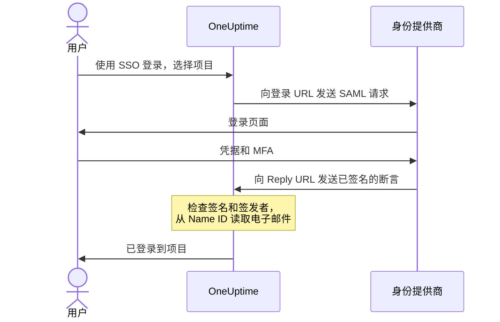

# SSO

单点登录（SSO）让项目中的人员通过组织的身份提供商（IdP），使用 SAML 2.0 或 OpenID Connect 登录 OneUptime。您可以在一个地方管理访问权限、密码和多因素认证，还可以要求项目中的所有人都使用 SSO。

> [!NOTE]
> **版本：** SSO（包括“Require SSO for login”）属于 OneUptime 的所有版本：自托管部署在 Community Edition 中即可使用，无需许可证。在 OneUptime Cloud 上，**Scale** 及以上套餐可用。各版本包含哪些功能，请参阅 [企业版](/docs/self-hosted/enterprise)。

:::cards
- [设置 SAML 提供商](#设置-sso): 在 OneUptime 中创建它，并把两个 URL 交给您的 IdP。
- [身份提供商指南](#身份提供商指南): Keycloak、Microsoft Entra ID 和 Okta 的分步说明。
- [OpenID Connect](#openid-connect-oidc): 改为通过 OIDC 应用登录。
- [要求使用 SSO](#为项目要求使用-sso): 让 SSO 成为进入项目的唯一方式。
:::

## SAML 登录的工作原理

一个 SAML 提供商把一个项目连接到身份提供商中的一个应用。登录的人在 OneUptime 的 **使用 SSO 登录** 页面上选择项目，在您的 IdP 登录，然后以已登录状态返回。



OneUptime 只从您的 IdP 发送的断言中读取少量内容：

| 断言中的内容 | OneUptime 如何处理 |
| --- | --- |
| 签名 | 使用提供商的 **公开证书** 进行校验。响应必须已签名，且不得加密。 |
| Issuer | 必须与提供商的 **签发者** 完全一致。 |
| Name ID | 此人的电子邮件地址。必须是有效的电子邮件地址。 |
| `http://schemas.microsoft.com/identity/claims/displayname` | 此人的姓名，在 OneUptime 创建其账号时使用。可选。 |

首次登录的人会加入该提供商的 **团队**，这些团队决定了他们能做什么：请参阅 [SSO 用户的角色和团队](#sso-用户的角色和团队)。

> [!NOTE]
> 在 OneUptime Cloud 上，当某人首次通过项目的某个 SAML 或 OIDC 提供商登录该项目时，OneUptime 不会直接让其登录，而是通过电子邮件向其发送一个链接。此人打开链接，确认项目的单点登录可以为其登录，然后继续登录。该链接在 24 小时内有效。这在每个项目中只发生一次；如果此人离开项目后又回来，则会再次发生。自托管部署会直接让人登录。

## 设置 SSO

您需要添加 SSO 提供商的权限（**Project Owner**、**Project Admin** 或 **Create Project SSO**），在 OneUptime Cloud 上还需要 **Scale** 套餐。身份提供商一侧的设置请参阅 [身份提供商指南](#身份提供商指南)。

:::steps
1. **导航至项目设置**

   - 进入您的 OneUptime 项目
   - 导航至 **项目设置** > **安全** > **SSO**

2. **创建 SSO 配置**

   - 点击 **创建SSO**
   - 输入 SSO 配置的 **名称**（例如 "Keycloak SAML" 或 "Okta SAML"）
   - 输入身份提供商的 **登录 URL**
   - 输入身份提供商的 **签发者**（实体 ID）
   - 粘贴身份提供商的 **公开证书**
   - 在 **登录** 步骤中，**团队** 默认是项目的成员团队：首次登录的人会加入这些团队。只接受您自己可以邀请他人加入的团队：授予的访问权限超出您自身权限的团队会在 **团队** 下方注明
   - 其余内容已在 **更多字段** 中填好：**签名方法**（`RSA-SHA256`）、**摘要方法**（`SHA256`）以及描述（“Sign in with”加名称）。仅当您的身份提供商需要时才更改它们

3. **获取 OneUptime 的 SSO 元数据**
   - 保存后会打开 **SSO Configuration** 对话框。也可以通过 **查看 SSO 配置** 按钮再次打开
   - 复制 **Identifier (Entity ID)**，例如 `https://oneuptime.com/<project-id>/<provider-id>`，IdP 配置中需要它
   - 复制 **Reply URL (Assertion Consumer Service URL)**，例如 `https://oneuptime.com/identity/idp-login/<project-id>/<provider-id>`，IdP 配置中需要它
   - 新的提供商默认处于关闭状态。在 IdP 配置好这两个值后，请编辑该提供商并开启 **已启用**

4. **测试提供商**
   - 打开 **Test Single Sign On (SSO)** 卡片中的链接，并在打开的页面上选择该提供商。您会被带到身份提供商的登录页面，然后以已登录状态返回 OneUptime
   - 确认可以正常使用后，您就可以为项目 [要求使用 SSO](#为项目要求使用-sso)
:::

## 身份提供商指南

选择您的身份提供商。每个指南都会获取 IdP 的值，在 OneUptime 中创建提供商，然后把 OneUptime 的 **Identifier (Entity ID)** 和 **Reply URL** 交给 IdP。

:::tabs
@tab Keycloak
Keycloak 是一款流行的开源身份和访问管理解决方案。您需要一个带有 realm 的正在运行的 Keycloak 实例，以及 Keycloak 和 OneUptime 的管理员访问权限。

:::steps
1. **收集 realm 的值**

   - **登录 URL**：`https://<your-keycloak-domain>/auth/realms/<your-realm>/protocol/saml`
   - **签发者**：`https://<your-keycloak-domain>/auth/realms/<your-realm>`
   - **证书**：realm 的签名证书。打开 `https://<your-keycloak-domain>/auth/realms/<your-realm>/protocol/saml/descriptor` 并复制 `X509Certificate` 的值，或者打开 **Realm settings** > **Keys**，点击 RS256 密钥的 **Certificate**

   Keycloak 17 及更高版本提供的这些 URL 不带 `/auth` 前缀。请把证书放在各自独立的行之间，如下所示：

   ```text
   -----BEGIN CERTIFICATE-----
   MIICnzCCAYcCBgFyPZ8QFzANBgkqhkiG.......
   -----END CERTIFICATE-----
   ```

2. **在 OneUptime 中创建提供商**

   前往 **项目设置** > **安全** > **SSO**，点击 **创建SSO** 并填写：
   - **名称**：一个描述性的名称（例如 `my-project-oneuptime`）
   - **登录 URL** 和 **签发者**：上面的值
   - **公开证书**：证书，放在各自独立的 `BEGIN CERTIFICATE` 行和 `END CERTIFICATE` 行之间
   - **签名方法** 和 **摘要方法**：已在 **更多字段** 中设置好（`RSA-SHA256` 和 `SHA256`）

   保存，然后从打开的对话框中复制 **Identifier (Entity ID)** 和 **Reply URL (Assertion Consumer Service URL)**。

3. **创建 Keycloak 客户端**

   在 Keycloak 中打开您 realm 的 **Clients**，创建一个客户端或编辑现有客户端：
   - **Client Protocol**（客户端类型）：`saml`
   - **Client ID**：OneUptime 的 **Identifier (Entity ID)**
   - **Root URL** 和 **Valid Redirect URIs**：您的 OneUptime URL
   - **Assertion Consumer Service POST Binding URL**：OneUptime 的 **Reply URL (Assertion Consumer Service URL)**

4. **调整客户端设置**

   - 将 **Name ID Format** 设为 `email`，并开启 **Force Name ID Format**，使 Keycloak 始终以电子邮件作为 Name ID 发送
   - 在客户端的 **Keys** 选项卡上，关闭 **Client signature required**（位于 **Signing keys config** 中）：OneUptime 不会对其请求签名

5. **开启提供商并进行测试**

   在 OneUptime 中编辑提供商并开启 **已启用**，然后打开 **Test Single Sign On (SSO)** 卡片中的链接并选择该提供商。您应当被带到 Keycloak 登录页面，然后返回 OneUptime。
:::
@tab Microsoft Entra ID
Microsoft Entra ID（原名 Azure AD / Active Directory）是 Microsoft 的云身份服务。您需要一个支持使用 SAML SSO 的企业应用程序的租户，以及 Entra ID 和 OneUptime 的管理员访问权限。

:::steps
1. **在 Entra ID 中创建企业应用程序**

   - 登录 [Microsoft Entra admin center](https://entra.microsoft.com)
   - 前往 **Identity** > **Applications** > **Enterprise applications**，点击 **+ New application**，然后点击 **+ Create your own application**
   - 输入名称（例如 "OneUptime"），选择 **Integrate any other application you don't find in the gallery (Non-gallery)**，然后点击 **Create**

2. **复制 Entra ID 的 SAML 值**

   - 在应用程序中前往 **Single sign-on** 并选择 **SAML**
   - 在 **SAML Certificates** 中下载 **Certificate (Base64)**，用文本编辑器打开该文件并复制其内容
   - 在 **Set up OneUptime** 中复制 **Login URL** 和 **Microsoft Entra Identifier**（在较旧的租户中为 **Azure AD Identifier**）

3. **在 OneUptime 中创建提供商**

   前往 **项目设置** > **安全** > **SSO**，点击 **创建SSO** 并填写：
   - **名称**：一个描述性的名称（例如 `Azure AD SAML`）
   - **登录 URL**：**Login URL**
   - **签发者**：**Microsoft Entra Identifier**
   - **公开证书**：Base64 证书，包括 `BEGIN CERTIFICATE` 行和 `END CERTIFICATE` 行
   - **签名方法** 和 **摘要方法**：已在 **更多字段** 中设置好（`RSA-SHA256` 和 `SHA256`）

   保存，然后从打开的对话框中复制 **Identifier (Entity ID)** 和 **Reply URL (Assertion Consumer Service URL)**。

4. **把 OneUptime 的 URL 交给 Entra ID**

   在 **Basic SAML Configuration** 中点击 **Edit** 并设置：
   - **Identifier (Entity ID)**：OneUptime 的 **Identifier (Entity ID)**
   - **Reply URL (Assertion Consumer Service URL)**：OneUptime 的 **Reply URL**

   点击 **Save**。

5. **以 Name ID 发送电子邮件**

   在 **Attributes & Claims** 中点击 **Edit**：
   - 将 **Unique User Identifier (Name ID)** 设为用户的电子邮件地址：`user.mail`，或者在 `user.userprincipalname` 就是电子邮件地址时使用它
   - 将 **Name identifier format** 设为 `Email address`
   - 可选：添加一个名为 `http://schemas.microsoft.com/identity/claims/displayname`、源属性为 `user.displayname` 的声明，让新账号获得此人的姓名。OneUptime 会忽略其他声明

6. **分配用户和组**

   在应用程序的 **Users and groups** 中点击 **+ Add user/group**，选择要授予 SSO 访问权限的用户和组，然后点击 **Assign**。

7. **开启提供商并进行测试**

   在 OneUptime 中编辑提供商并开启 **已启用**，然后打开 **Test Single Sign On (SSO)** 卡片中的链接并选择该提供商。您应当被带到 Microsoft 登录页面，然后返回 OneUptime。
:::
@tab Okta
Okta 是一款广泛使用、支持 SAML SSO 的身份平台。您需要一个具有管理员访问权限的 Okta 组织，以及 OneUptime 的管理员访问权限。

:::steps
1. **在 Okta 中创建 SAML 应用程序**

   - 在 Okta Admin Console 中前往 **Applications** > **Applications**，点击 **Create App Integration**
   - 选择 **SAML 2.0** 并点击 **Next**，在 **App name** 中输入 "OneUptime"，然后点击 **Next**
   - Okta 会在显示自己的 URL 之前先要求填写 OneUptime 的 URL。暂时把您的 OneUptime 地址（例如 `https://oneuptime.com`）填入 **Single sign-on URL** 和 **Audience URI (SP Entity ID)**：您会在第 4 步替换这两个值
   - 将 **Name ID format** 设为 `EmailAddress`，将 **Application username** 设为 `Email`
   - 点击 **Next**，选择 **I'm an Okta customer adding an internal app**，然后点击 **Finish**

2. **复制 Okta 的 SAML 值**

   在应用程序的 **Sign On** 选项卡上，在 **SAML Signing Certificates** 中找到处于活动状态的证书：
   - 点击 **Actions** > **View IdP metadata**，复制 **登录 URL**（Identity Provider Single Sign-On URL）和 **签发者**（Identity Provider Issuer）
   - 点击 **Actions** > **Download certificate**，用文本编辑器打开 `.cert` 文件并复制其内容

3. **在 OneUptime 中创建提供商**

   前往 **项目设置** > **安全** > **SSO**，点击 **创建SSO** 并填写：
   - **名称**：一个描述性的名称（例如 `Okta SAML`）
   - **登录 URL** 和 **签发者**：Okta 的值
   - **公开证书**：证书，包括 `BEGIN CERTIFICATE` 行和 `END CERTIFICATE` 行
   - **签名方法** 和 **摘要方法**：已在 **更多字段** 中设置好（`RSA-SHA256` 和 `SHA256`）

   保存，然后从打开的对话框中复制 **Identifier (Entity ID)** 和 **Reply URL (Assertion Consumer Service URL)**。

4. **把 OneUptime 的 URL 交给 Okta**

   在应用程序的 **General** 选项卡上，点击 **SAML Settings** 中的 **Edit** 和 **Next**，然后设置：
   - **Single sign-on URL**：OneUptime 的 **Reply URL (Assertion Consumer Service URL)**
   - **Audience URI (SP Entity ID)**：OneUptime 的 **Identifier (Entity ID)**

   可选：添加一个名为 `http://schemas.microsoft.com/identity/claims/displayname`、值为 `user.firstName + " " + user.lastName` 的 attribute statement，让新账号获得此人的姓名。点击 **Next**，然后点击 **Finish**。

5. **分配人员**

   在 **Assignments** 选项卡上点击 **Assign** > **Assign to People** 或 **Assign to Groups**，选择要授予 SSO 访问权限的人，为每个人点击 **Assign**，然后点击 **Done**。

6. **开启提供商并进行测试**

   在 OneUptime 中编辑提供商并开启 **已启用**，然后打开 **Test Single Sign On (SSO)** 卡片中的链接并选择该提供商。您应当被带到 Okta 登录页面，然后返回 OneUptime。
:::
@tab 其他
OneUptime 的 SSO 使用 SAML 2.0，可与任何兼容的身份提供商配合使用：

:::steps
1. 获取身份提供商的 **登录 URL**（其 SSO 端点）、**签发者**（其实体 ID）和 **公开证书**（其 X.509 签名证书）。如果您的 IdP 只有在应用程序存在后才显示这些值，请先用您的 OneUptime 地址作为临时 URL 创建应用程序。
2. 在 OneUptime 中用这些值创建提供商，并从 **SSO Configuration** 对话框（或 **查看 SSO 配置**）中复制 **Identifier (Entity ID)** 和 **Reply URL (Assertion Consumer Service URL)**。
3. 在身份提供商的 SAML 应用程序中，将 **Assertion Consumer Service URL / Reply URL** 和 **Entity ID / Audience URI** 设为 OneUptime 的值，并将 **Name ID Format** 设为电子邮件地址。
4. **签名方法**（`RSA-SHA256`）和 **摘要方法**（`SHA256`）已在 **更多字段** 中设置好；仅当您的身份提供商使用不同的签名方式时才更改它们
5. 为提供商开启 **已启用**，并使用 **Test Single Sign On (SSO)** 卡片中的链接进行测试。
:::
:::

## OpenID Connect (OIDC)

项目也可以通过 OpenID Connect 提供商登录，例如 Google Workspace、Okta、Microsoft Entra ID、Auth0 或 Keycloak。您需要添加 OIDC 提供商的权限（**Project Owner**、**Project Admin** 或 **Create Project OIDC**），在 OneUptime Cloud 上还需要 **Scale** 套餐。

:::steps
1. 在身份提供商中注册一个可以使用带 PKCE 的授权码流程的应用（OIDC 客户端），并复制其 **签发者 URL**、**客户端 ID** 和 **客户端密钥**。
2. 在 OneUptime 中前往 **项目设置** > **安全** > **OIDC**，点击 **创建OIDC**。
3. 输入 **名称**（用户在登录页面上看到的名称）、**签发者 URL**、**客户端 ID** 和 **客户端密钥**。也可以改为把提供商的发现 URL 粘贴到 **签发者 URL** 中。
4. 在 **登录** 步骤中，**团队** 默认是项目的成员团队：首次登录的人会加入这些团队。其余内容已在 **更多字段** 中填好：**发现 URL**（签发者后接 `/.well-known/openid-configuration`）、**范围**（`openid email profile`）、`email` 和 `name` 声明名称，以及描述（“Sign in with”加名称）。仅当您的提供商需要时才更改它们。只接受您自己可以邀请他人加入的团队：授予的访问权限超出您自身权限的团队会在 **团队** 下方注明。
5. 保存。**OIDC Configuration** 对话框会打开并显示 **Redirect URI**：请把它添加到应用允许的重定向 URI 中。新的提供商默认处于关闭状态，因此随后请编辑它并开启 **已启用**。
6. 在为项目要求使用 SSO 之前，使用 **Test OpenID Connect (OIDC)** 卡片中的链接通过该提供商登录一次。
:::

## SSO 用户的角色和团队

OneUptime 不会映射身份提供商中的角色或组。一个人能做什么取决于其所在的团队：提供商会把新来的人加入它的 **团队**，而团队及其权限在 OneUptime 中管理，如 [用户、团队与权限](/docs/permissions/index) 所述。要让团队成员与身份提供商保持同步，请使用 [SCIM](/docs/identity/scim)。

提供商的团队决定了通过它登录的人能做什么，因此只有当保存者本人可以邀请他人加入这些团队时，提供商才能保存。每次保存都会重新检查：如果提供商的团队授予的访问权限超出您自身的权限，则只有访问权限能够涵盖这些团队的人（例如项目所有者）才能更改它。在此检查推出之前保存的提供商会继续把人登录到其团队中。任何可以编辑提供商的人仍然可以关闭它，以便立即停止它。

## 为项目要求使用 SSO

设置提供商并不会阻止任何人使用密码登录。要让 SSO 成为进入项目的唯一方式，请使用 **项目设置** > **安全** > **SSO** 中提供商下方的 **登录时要求使用 SSO** 开关：

:::steps
1. 先使用 **Test Single Sign On (SSO)** 卡片中的链接测试您的提供商。
2. 开启 **登录时要求使用 SSO**。OneUptime 会在保存任何内容之前询问：从那时起，项目中的每个人（包括您自己）都必须使用 SSO 登录才能打开项目，任何使用密码登录的人都会被锁定在项目之外，直到使用 SSO 登录。
3. 点击 **要求使用 SSO** 进行确认。开关会立即保存，没有单独的保存按钮。
:::

开启 **登录时要求使用 SSO** 需要一个能把人登录到该项目的提供商：项目自己的一个已开启的 SAML 或 OIDC 提供商，或者一个已开启且能把人登录到该项目的全局提供商。没有这样的提供商时，OneUptime 会拒绝，并提示先为项目开启一个提供商并进行测试。如果您选择项目要求的提供商，它必须是其中之一；以后要求另一个提供商时，也会进行同样的检查。

在 **登录时要求使用 SSO** 已开启时仍以开启状态发送它的保存，或者指定项目已经要求的提供商的保存，也会以同样的方式检查——API、Terraform 等工具在每次保存时常常会发送所有设置。因此，当项目没有能让人登录的提供商，或者它要求的提供商后来被关闭时，这样的保存无论还更改了什么，都会以相同的措辞被拒绝：请先开启一个提供商、要求另一个提供商，或者关闭 **登录时要求使用 SSO**。

新项目也遵循同样的规则。新项目还没有自己的提供商，因此在 **登录时要求使用 SSO** 已开启的情况下创建项目（只有主管理员可以这样做）需要一个已开启且能把人登录到每个项目的全局提供商；没有这样的提供商时，会以相同的措辞被拒绝。请先创建项目，设置并测试其提供商，然后再开启该开关。

当整个服务器要求使用 SSO 时（**Admin** > **设置** > **认证** > **登录时要求使用 SSO**），创建任何项目也都需要这样的全局提供商，否则包括创建者在内，没有人能打开该项目。没有这样的提供商时，创建项目会被拒绝，消息会请服务器管理员开启一个。主管理员仍然可以创建项目。

关闭 **登录时要求使用 SSO** 会在您切换开关时立即保存，成员可以马上重新使用密码进入——除非恰好在同一时刻有人再次开启它，此时应用服务器最多可能需要一分钟才能跟上。项目所有者、项目管理员以及拥有 **Edit Project** 权限的成员可以更改它；其他人看到的开关处于锁定状态，并会显示他们所需的权限。

> [!NOTE]
> 在 OneUptime Cloud 上，要求使用 SSO 需要 **Scale** 套餐，而关闭它在任何套餐上都可以。低于 Scale 时，**项目设置** > **安全** > **SSO** 会显示套餐的升级提示；对于 Scale 试用期结束后仍要求使用 SSO 的项目，升级提示下方也会显示 **登录时要求使用 SSO**，以便将其关闭。再次开启需要 **Scale**。

## 关闭或删除提供商

| 您更改的内容 | 通过该提供商登录的人 |
| --- | --- |
| 关闭或删除它 | 在要求使用 SSO 的地方，下次请求时重新使用 SSO 登录 |
| 新的证书或客户端密钥、其他 URL、新名称或其他团队 | 保持登录状态 |
| 开启它 | 可以立即通过它登录 |

关闭或删除 SAML 或 OIDC 提供商，会结束通过它进行的登录。在要求使用 SSO 的项目中（无论是项目自身要求，还是因为整个服务器要求）：

- 所有通过它登录的人都必须在下次请求时重新使用 SSO 登录，他们打开的页面会立即停止接收实时更新。
- 有人在通过它登录后连接的 MCP 客户端会在该项目中停止工作。请在使用 SSO 登录后重新连接它。
- 重新开启提供商不会恢复这些登录：用户需要再次通过它登录。

更改提供商的其他任何内容都会让所有人保持登录状态：新的证书或客户端密钥、其他 URL、新名称或其他团队。登录在发生时已经过检查，下一次登录会使用新的设置。

当项目要求使用 SSO 时，OneUptime 会保留一条进入的途径：您不能关闭或删除人们可以用来登录该项目的最后一个提供商（包括能把人登录到该项目的全局提供商），也不能关闭或删除项目要求的提供商。请先关闭 **登录时要求使用 SSO**。

开启提供商后，人们可以立即通过它登录。

当整个服务器要求使用 SSO 时（**Admin** > **设置** > **认证** > **登录时要求使用 SSO**），每个项目都会以同样的方式保留一条进入的途径，即使项目本身不要求使用 SSO：请先为它开启另一个提供商。

全局提供商也遵循同样的规则：如果对某个全局提供商或其附加项目的更改会让要求使用 SSO 的项目没有提供商，该更改会被拒绝，并指明该项目。请参阅 [全局 SSO](/docs/identity/global-sso#关闭或删除提供商)。

在项目和服务器都不要求使用 SSO 的地方，关闭提供商会阻止通过它进行新的登录。已经登录的人会保持登录状态，就像使用密码登录的人一样。

## 低于 Scale 套餐时保留的提供商

项目仍有的 SAML 或 OIDC 提供商，在 Scale 试用期结束或套餐降级后会继续让人登录。因此，低于 Scale 时，**SSO** 和 **OIDC** 页面会在升级提示下方列出项目的提供商（**仍在配置的 SAML 提供方**、**仍在配置的 OIDC 提供方**）：

- **关闭** 会立即停止提供商。OneUptime 会先询问。
- **删除** 会将其删除。

添加提供商、更改提供商或重新开启提供商都需要 **Scale**。谁可以执行每项操作与 Scale 套餐下相同：关闭提供商需要编辑它的权限，删除它需要删除它的权限。

当项目仍要求使用 SSO 时，其 **SSO** 和 **OIDC** 页面还会显示 **登录时要求使用 SSO**：请在关闭最后一个提供商之前先关闭它。在此之前，人们可以用来登录的最后一个提供商无法被关闭或删除，因此不会有人被锁定在项目之外。

状态页面的 **SSO** 和 **OIDC** 页面会以同样的方式列出状态页面自己的提供商。当状态页面仍要求使用 SSO 时，这两个页面也会显示 **登录时要求使用 SSO**：请在关闭其提供商之前先关闭它，否则其私有用户将完全无法登录。

## 故障排查

:::details "SSO Config not found"
提供商已关闭，或者链接指向的提供商已不存在。新的提供商默认处于关闭状态：请编辑它并开启 **已启用**。
:::

:::details "No teams added."
此人尚未加入项目，而提供商没有可以把此人加入的 **团队**。请编辑提供商并至少选择一个团队，例如项目的成员团队。
:::

:::details "Issuer URL does not match"
IdP 断言中的签发者不是提供商的 **签发者**。请从 IdP 重新复制它（Keycloak 的 realm URL、**Microsoft Entra Identifier** 或 Okta 的 Identity Provider Issuer），使两者完全一致。
:::

:::details 登录因签名或证书错误而失败
把 IdP 当前的签名证书粘贴到 **公开证书** 中，包括 `BEGIN CERTIFICATE` 行和 `END CERTIFICATE` 行。对于 Entra ID，请下载 **Base64** 证书，而不是原始证书；对于 Okta，请下载处于活动状态的签名证书；对于 Keycloak，请下载正确 realm 的证书。
:::

:::details "Encrypted SAML Responses are not supported"
OneUptime 不会解密断言。请在 IdP 中关闭该应用程序的断言加密，使其发送未加密的已签名断言。
:::

:::details "SAML response did not include a valid email address"
OneUptime 从 Name ID 读取电子邮件地址。请将 Name ID 设为用户的电子邮件：在 Keycloak 中为 **Name ID Format** `email` 加 **Force Name ID Format**，在 Entra ID 中为 **Unique User Identifier (Name ID)**，在 Okta 中为 **Name ID format** `EmailAddress` 和 **Application username** `Email`。该地址必须与此人的 OneUptime 账号一致。
:::

:::details Entra ID: AADSTS700016
Entra ID 中的 **Identifier (Entity ID)** 与 OneUptime 的不一致。请从 **查看 SSO 配置** 重新复制；两个值必须完全相同。
:::

:::details Okta: 404，或 audience 不匹配
Okta 中的 **Single sign-on URL** 必须与 OneUptime 的 **Reply URL** 完全一致，**Audience URI** 必须与 OneUptime 的 **Identifier (Entity ID)** 完全一致。请确认两者都已替换掉临时值。
:::

:::details 用户未分配给应用程序
Entra ID 和 Okta 只会让分配给应用程序的人登录。请分配该用户，或分配其所在的组。
:::

:::details Keycloak: 重定向循环
请检查正确 realm 中的客户端上，**Valid Redirect URIs** 和 **Assertion Consumer Service POST Binding URL** 是否已按上文设置。
:::

## 后续步骤

:::cards
- [全局 SSO](/docs/identity/global-sso): 在自托管实例上为所有项目使用一个身份提供商。
- [SCIM](/docs/identity/scim): 让身份提供商自动添加和移除人员。
- [用户、团队与权限](/docs/permissions/index): 新来的人加入的团队允许他们做什么。
:::
