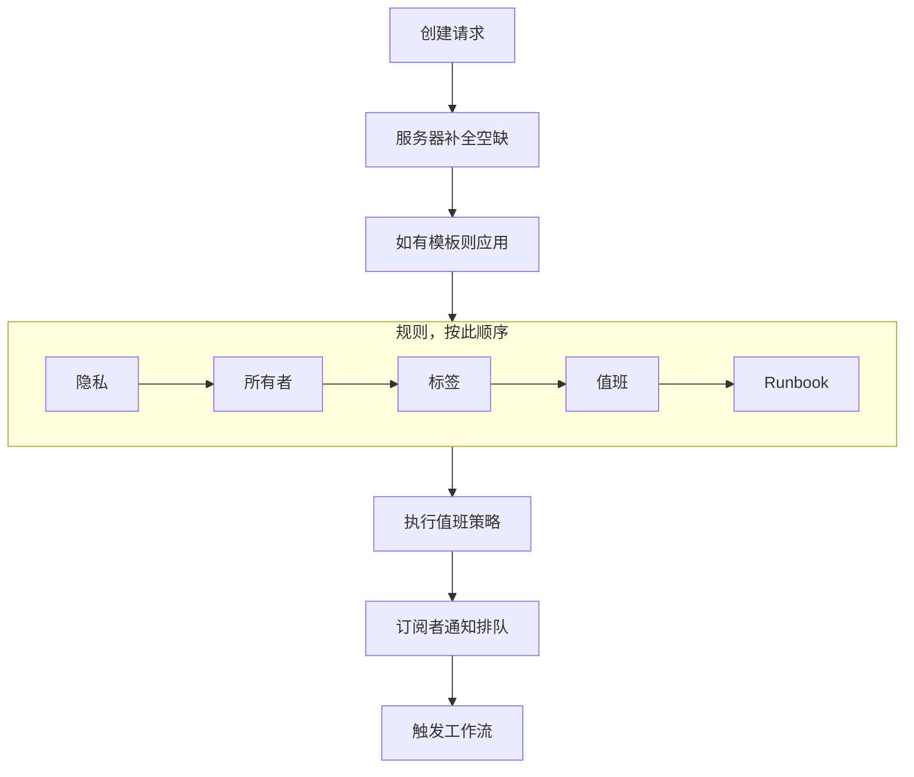
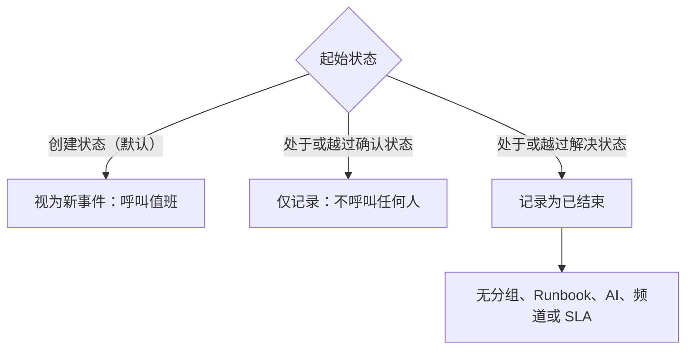

# 声明事件

声明事件会创建团队据以工作的记录：它获得一个编号、一个严重性和一个起始状态，它的值班策略会呼叫相关人员，并且——除非你另有指定——状态页订阅者也会得到通知。本页逐个字段介绍声明事件的五种方式，以及事件出现那一刻会发生什么。

:::cards
- [手动声明](#手动声明): 三步表单，逐个字段说明。
- [从模板声明](#从模板声明): 同一类事件，每次都预先填好。
- [从监视器条件声明](#从监视器条件自动声明): 让失败的检查替你创建。
- [通过 API 声明](#通过-api-声明): 从你自己的代码、脚本或其他工具。
:::

## 声明事件的五种方式

事件进入 OneUptime 的方式有五种，最终都落到同一个地方：`Incident` 表中的一行，带有严重性、当前状态和受影响资源列表。区别只在于由谁来填写字段——凌晨三点的你、一个已保存的模板、监视器的条件、调用 API 的你自己的代码，或者填写表单的团队外部人员。

| 如果你想……                                                   | 选择                                                                        |
| ------------------------------------------------------------ | --------------------------------------------------------------------------- |
| 手动创建事件，自己填写所有内容                               | **声明事件** 向导                                                           |
| 创建一类反复出现的事件，字段预先填好                         | **从模板创建**                                                              |
| 在监视器检查失败时自动创建                                   | 开启了 **当过滤器匹配时，声明事件。** 的监视器条件过滤器                     |
| 从你自己的代码、脚本或其他工具创建                           | `POST /api/incident`                                                        |
| 让团队外部的人通过链接报告问题                               | [表单](/docs/forms/index)                                                   |

五种方式写入的是同一个模型，因此探针创建的事件和响应者手动创建的事件看起来完全一样——只是服务器会在自动创建的事件上设置几个记账用的列。集成也会写入它：[Huntress](/docs/integrations/huntress) 会为其 SOC 发来的每份事件报告创建一个事件。

> [!TIP]
> 你也可以从告警声明事件：在告警列表、告警的页眉或告警的 **已关联事件** 页面上使用 **声明事件**，会打开同一个向导，按告警预先填好，并把它们关联到新事件。表单上默认勾选的复选框还会确认这些告警，让它们停止升级。参见 [关联的告警](/docs/incidents/linked-alerts)。

## 手动声明

**声明新事件** 表单分三步询问事件：**事件详情**、**受影响的资源** 和 **值班和角色**，然后显示一个供你检查的摘要。如果你的项目在创建时要求填写部分事件自定义字段，那么在 **受影响的资源** 之后会紧接着出现第四步 **详情**。

:::steps
1. 打开 **事件 → 所有事件**，点击 **事件** 列表右上角的 **声明事件**。表单从 **事件详情** 开始。
2. 输入 **标题** 并选择 **事件严重性**。表单的其余部分都是可选的。
3. 点击 **下一步** 走完剩余步骤，填上你现在知道的内容：监视器和其他资源、值班策略、角色。
4. 阅读摘要并点击 **声明事件**。你会进入新事件，它的 **事件 信息流** 开始记录。
:::

只有第一步有必填字段，另外还有管理员标记为 **创建时必填** 的自定义字段，它们会在 **详情** 步骤中询问。摘要之前的每一步都只有普通的 **下一步**，**声明事件** 位于最后一步的摘要上。赶时间时，填好 **事件详情**，其他步骤什么都不填直接点 **下一步** 即可：附加资源、添加值班策略和分配角色都可以稍后在事件自己的页面上完成。在字段中按 **Enter** 也会前进；在摘要之前它绝不会直接声明事件。

> [!TIP]
> 大多数事件用不到的选项，都折叠在各步骤末尾的 **更多字段** 标题下；点击即可展开。折叠时，标题会列出其中的内容，并显示每个已设置的选项及其值——例如由模板设置的，或由你正在据以声明的私密告警设置的——当其中有内容需要修正时，它会自动展开。摘要只在这些选项被设置时才列出它们——**通知状态页订阅者** 除外，它总是会被列出，并附上谁会收到通知。

**从资源自己的页面。** 在监视器、主机、服务、集群或大多数其他资源的 **事件** 选项卡上使用 **声明事件**，会打开同一个表单，并且该资源已在 **受影响的资源** 中选好，所以只需填写标题和严重性，事件也会显示在你出发的那个选项卡上。

:::details 哪些资源页面提供它，以及它会选中什么
在监视器、主机、Kubernetes、Proxmox、Ceph 或 Docker Swarm 集群、Docker 或 Podman 主机、vCenter、存储阵列、IoT 设备群、数据库或服务的 **事件** 选项卡上使用 **声明事件**，会打开同一个向导，该资源已在 **受影响的资源** 中选好（监视器放在 **监视器** 下，其他放在 **其他受影响的资源** 下），排在模板添加的任何内容之前。该选项卡上的 **从模板创建** 同样保留该资源。面包屑会经由该资源的选项卡返回；声明之后，你会像从事件列表声明时一样进入新事件。

库存项目的 **事件** 选项卡会选中该项目指向的主机、服务或 Kubernetes 集群，面包屑会经由那个资源的选项卡返回。资源 **警报** 选项卡上的 **创建警报** 也是同样的方式：从监视器出发时，它填写告警的 **监视器**；从其他资源出发时，填写 **其他受影响的资源**。

资源会以你自己的权限查找：如果你无法读取它，或者它已被删除，表单只会在什么都没选的情况下打开。
:::

### 第 1 步——事件详情

- **标题** —— 必填。一行摘要，所有人都会在列表、Slack，以及（如果事件可见）你的状态页上看到它。占位符：`Incident Title`。
- **事件严重性** —— 必填。项目中配置的严重性之一；新项目预置了 **Critical Incident**、**Major Incident** 和 **Minor Incident**。
- **描述** —— 可选，用 Markdown 编写。这是会显示在状态页上的字段，所以要为客户而不是为团队来写。你放入其中的图片，在事件于状态页上可见时对所有人显示，在隐藏时只对项目成员显示。之后可以在事件侧边菜单的 **描述** 中编辑。

**更多字段** 下有：

- **声明时间** —— 从你打开页面的那一刻开始。事件上的所有持续时间都从这个时间戳开始计算，所以如果你记录的是更早开始的事情，请把时间往前调。
- **初始状态** —— 可选，起初为空。留空时，事件从带有 `isCreatedState` 标志的状态开始，新项目中预置为 **Identified**——或者，从模板声明时，从模板的初始状态开始。只有在记录一个已经过了那个阶段（已确认或已解决）的事件时，才选择更靠后的状态。这样的事件不会呼叫任何人——参见 [声明时即已确认或已解决](#声明时即已确认或已解决)。
- **标签** —— 可选。标签把相关事件归为一组以便过滤，而权限按标签受限的团队只能看到带有其某个标签的事件。
- **私密事件** —— 复选框，默认关闭（`isPrivate`）。私密事件只对其所有者用户、所有者团队的成员、项目管理员和项目所有者可见——并且无论其他任何设置如何，它都会在所有状态页上隐藏，包括它被限定到的状态页。事件列表会用红色的 **Private** 徽章标记这些事件。

> [!NOTE]
> **告警和片段同样从你选择的状态开始。** **创建警报**，以及事件片段和告警片段列表上的 **创建片段**，在 **更多字段** 下也有同样的 **初始状态**。留空时，告警或片段从项目的创建状态开始。选择更靠后的状态，可以记录一个已经确认或解决的告警或片段：它从那个状态开始，状态时间线也从那里开始，记录为已解决的片段会立即被视为已解决。它的所有者不会因为这个初始状态而单独收到通知，事件片段的状态页订阅者会在片段创建时收到一次通知。以这种方式记录的告警或片段不会呼叫任何人，和事件一样：参见 [声明时即已确认或已解决](#声明时即已确认或已解决)。通过 API，同样的选择对应 `currentAlertStateId` 或 `currentIncidentStateId`——参见 [OneUptime API 参考](/docs/api-reference/api-reference)。

:::details 在 Markdown 编辑器中书写
描述——与备注、根本原因、补救以及富文本自定义字段一样——在 Markdown 编辑器中书写。它以可视模式打开，显示格式化后的文本；工具栏上的 **Markdown** 切换到 Markdown 模式，显示 Markdown 源码，**Visual** 则切换回来。在列表中，工具栏上的 **增加缩进** 和 **减少缩进**，或者 Tab 和 Shift+Tab，会把一项嵌套到上一项之下或再移出来；在没有可嵌套对象的位置以及列表之外，Tab 照常移动到下一个字段。在可视模式下，在一行的中间或末尾使用 **代码块**、**表格** 和 **任务列表**，会在光标处拆分该行，把新块放在单独的行上——在粗体词、链接或行内代码的边缘也是如此，不会留下空的格式——而在列表项中使用 **任务列表**，会把任务添加到该项所在的列表，而不是作为子任务。在 Markdown 模式下，**代码块** 和 **表格** 插入在光标处，所以先另起一行；**任务列表** 会把光标所在的行变成任务，**编号列表** 会让嵌套列表的每一层都从 1 开始编号。工具栏保持在一行：带编辑器的表单会在宽对话框中打开，所以在大多数屏幕上每个按钮都放得下；放不下时——在手机上或窄窗口中——放不下的按钮会按同样的顺序收进工具栏末尾的 **更多格式**（**⋯**）下，你在那里选择的每一项都会插入到光标原来所在的位置。在最窄的屏幕上，**Markdown** 开关也会移到它下面。

**撤销。** 在可视模式下，Ctrl+Z（Mac 上为 Cmd+Z）会从最新的开始逐个撤回你的更改——包括你输入的内容和编辑器自己的编辑：缩进或减少缩进、插入行中的块、带格式或块级的粘贴——Ctrl+Shift+Z（Cmd+Shift+Z）或 Ctrl+Y 会按同样的顺序恢复它们。在 Markdown 模式下，Ctrl+Z 会撤回缩进或减少缩进、列表按钮的更改和带格式的粘贴，但不会撤回 **代码块**、**表格** 和 **水平线** 按钮插入的内容。

**粘贴到其中。** 从 Word、Google Docs 或 OneUptime 页面（比如另一个事件的描述）粘贴，会保留列表及其嵌套、链接和格式，粘贴进来的 `•` 项目符号会变成真正的列表。只有图标的链接，例如 GitHub 上标题旁的锚点，会被去掉。在可视模式下，粘贴到一行中的代码或引用会拆分该行，成为独立的块；粘贴到列表项中的列表会加入该项所在的列表，而不是嵌套在其中——粘贴到按 Enter 留下的空项中时，会取代那个空项——而粘贴到列表项中的代码块、引用或表格会留在该项之内。在 Markdown 模式下，粘贴内容中会成为块的部分——代码、引用、列表、标题、多个段落——落在一行中间时，会单独成行，前后各留一个空行；粘贴在列表项行尾或单独的 `- ` 之后的列表，会以该项的缩进加入那个列表；作为纯文本复制的 Markdown 会原样插入在光标处。粘贴到代码块内部的任何内容都会保持复制时的原样。在跨越多个项目、段落或表格单元格的选区上粘贴，会像输入一样替换选区。在可视模式下，在表格单元格上粘贴或使用 **代码** 按钮会保留每个单元格和每一列，粘贴不会留下空的项目符号、引用或代码块；当选区结束于代码块内部时，只有那行代码的剩余部分会并入文本。

**从备注中复制。** 从备注或描述中复制的代码块，粘贴回来时仍是该语言的代码块；带换行符复制的一行代码也是如此，就像在 Chrome、Edge 和 Safari 中三击复制那样。从代码块中复制出的一个词或一行的一部分，会粘贴为行内代码。在 Chrome、Edge 和 Safari 中，从以表格形式绘制的代码视图（Kubernetes 资源的 YAML 选项卡、异常堆栈跟踪的各帧）中复制的行，会粘贴为纯文本并保留缩进。
:::

### 第 2 步——受影响的资源

监视器单独放在最前面，因为状态页是通过监视器看到事件的；监视器要变成的状态就紧挨在它下面。

- **监视器** —— 一个搜索框，用于附加事件影响的监视器；它的 **标签** 选项卡会一次性添加带有某个标签的所有监视器。当状态页列出事件的某个监视器时，它会显示该事件并通知其订阅者，所以决定哪些状态页得知此事的正是这些监视器（事件上的 `monitors`）。
- **将监视器状态更改为** —— 可选，只有在至少选了一个监视器后才会显示。选择一个监视器状态，应用于附加到此事件的每个监视器，这样声明事件和把监视器标记为降级就是一次操作而不是两次。从设置了状态的模板声明时，会从模板的状态开始，一选监视器就会显示。没有选中监视器时不会保存任何状态，包括模板的状态；移除最后一个监视器后该字段会消失，直到你再选一个，你之前的选择会回来。监视器的状态由列出它的每个状态页共享，所以如果在 **更多字段** 下选了状态页，表单会提醒你，这个变化也会显示在你没有选的页面上。
- **其他受影响的资源** —— 第二个搜索框，用于事件影响的其他一切：主机、Kubernetes 集群、Docker 和 Podman 主机、Proxmox、Ceph 和 Docker Swarm 集群、vCenter、存储阵列、IoT 设备群、数据库和服务——即事件自己的 **受影响的资源** 卡片所提供的、监视器之外的一切。在底层，这些是事件上各自独立的关系（`hosts`、`kubernetesClusters`、`dockerHosts`、`podmanHosts`、`services` 等），但表单把它们合并成一个选择器。

监视器可以说明它监视的是什么——**监视器 → 概览 → 已关联资源**，资源种类与 **其他受影响的资源** 相同。选择这样的监视器，它所关联的内容会立即添加到 **其他受影响的资源** 中，字段下方的一行会说明添加了什么。在声明之前移除你不需要的内容：只要你还停留在表单上，就不会再为该监视器重新添加任何内容，而移除监视器会保留它添加的内容。监视器来自模板或来自你据以声明的页面时也是如此，**创建警报** 和 **Schedule Maintenance** 中也一样。

之后编辑事件的 **受影响的资源** 卡片时，询问方式相同：**监视器**、有监视器时的 **将监视器状态更改为**，然后是 **其他受影响的资源**。保存一个不再有任何监视器的事件时，会保留它原有的状态。

**更多字段** 下有：

- **仅限这些状态页面** —— 可选。留空时，事件会显示在列出其监视器的每个状态页上，并通知它们的订阅者。在这里选择页面后，只会使用其中被选中的页面；**标签** 选项卡会一次性添加带有某个标签的所有页面。当选中的页面没有列出事件的任何监视器，或者事件是私密的（这会让它在所有状态页上隐藏）时，表单会发出警告。参见 [每个受众一个状态页](/docs/status-pages/one-status-page-per-audience)。
- **通知状态页订阅者** —— 复选框，默认开启。控制是否就事件的创建通知订阅者（`shouldStatusPageSubscribersBeNotifiedOnIncidentCreated`）。把它折叠在 **更多字段** 下不会改变它的作用：它仍然默认勾选，摘要也总会列出它。在它下方，以及提交前的摘要上，**Will notify** 会列出将得到通知的状态页，每个渠道附上“最多”订阅者数量，以及不会得到通知的页面和原因。当没有人会得到通知时（没有附加监视器、没有状态页列出这些监视器，或者页面还没有订阅者），它什么也不显示，只有当原因是事件的状态页范围时才会发出警告。在摘要上，**是** 旁边的 **预览** 会显示每个状态页的订阅者将收到的邮件，**发送测试邮件给我** 会把它发送到你自己的账户邮箱；参见 [订阅者与公告](/docs/status-pages/subscribers#事件)。对于你仍想记录下来的内部琐事，可以关闭它。这样事件默认就保持安静：它上面的新公开备注，以及概览页上的状态变更对话框（**确认**、**解决** 或选择其他状态），各自的 **通知状态页订阅者** 复选框都会以关闭状态开始。**状态时间线** 页面上的手动表单和事件列表中的批量 **更改状态** 操作仍然以开启状态开始。

> [!IMPORTANT]
> **即使觉得多余，也要附加监视器。** 事件与状态页之间的联系要经过事件的监视器：当状态页的某个资源是事件的监视器之一时，状态页会显示该事件并通知其订阅者。**仅限这些状态页面** 只能缩小这个列表，不能扩大它，而开启了 **仅显示限定到此页面的事件** 的状态页只会显示限定到它的事件。没有附加任何监视器的事件根本不会通知任何状态页订阅者。参见 [状态页资源与分组](/docs/status-pages/resources-and-groups)。

**Should be visible on status page?** 标志（`isVisibleOnStatusPage`）不在向导中；默认为 true。之后可以在事件侧边菜单的 **设置** 中更改它，在那里它的标签是 **在状态页面上可见**。

**先隐藏声明，稍后发布。** 创建时就在状态页上隐藏的事件不会通知任何订阅者，其通知状态显示为 **已跳过：在状态页面上隐藏**。之后打开 **在状态页面上可见** 时，编辑表单会提供 **通知订阅者此事件已创建**，因此“先隐藏声明、弄清影响范围、再发布”的流程仍然能通知到订阅者。事件未解决时它默认勾选，事件解决后默认不勾选，所以为存档而发布一个旧事件时，不会把它当成新事件来宣布。只有当事件在声明时开启了 **通知状态页订阅者** 且不是私密事件时，才会提供它——因此通过 [表单](/docs/forms/on-submit) 报告的事件不会提供它，因为这类事件是在关闭通知的情况下隐藏声明的。通过 API，在把 `isVisibleOnStatusPage` 设为 `true` 的更新中一并发送 `"miscDataProps": {"notifySubscribersOfIncidentCreatedOnPublish": true}`，或者自己把 `subscriberNotificationStatusOnIncidentCreated` 设回 `Pending`。事件隐藏期间发布的事后分析不需要复选框：打开 **在状态页面上可见** 时会发送一次，如 [订阅者与公告](/docs/status-pages/subscribers#事件) 所述。

### 详情——你的事件自定义字段

只有当至少一个事件自定义字段在 **事件 → 设置 → 自定义字段** 中开启了 **创建时显示**——或者，从模板声明时，模板的 **创建时的自定义字段** 要求填写某个字段——时，才会出现这一步。它按这些字段的 **顺序**（即在那个设置页面上拖动排定的顺序）询问它们，使用与类型相应的输入方式——下拉列表、数字、日期、是/否开关、长文本，或 Markdown 编辑器中的富文本。对于无法读取项目事件自定义字段的人，这一步也不会出现：在 OneUptime Cloud 上，这需要 **Growth** 或更高的套餐，以及可以查看事件自定义字段的角色。

- 标记为 **创建时必填** 的字段必须填写后才能声明。必填的是/否字段——比如一项确认——必须打开。
- 0 或保持关闭的开关也是答案，并会作为答案保存。
- 值从监视器自定义字段复制而来的字段，在事件有监视器时不会被询问，因为事件创建时会从监视器复制该值。
- 从模板声明时，这一步以模板的值开始，而这一步不询问的字段，其模板值保持不变。你在这一步清除的值会保持清除。不再适合其字段的模板值——比如后来被移除的下拉选项——会被略去，而不是拒绝创建事件。
- 从模板声明时，还会遵循模板的 **创建时的自定义字段**。被标记为 **必填** 或 **可选** 的字段即使项目在创建时不显示也会被询问，被标记为 **隐藏** 的字段不会被询问——该字段的模板值仍然适用——而保持 **默认** 的字段遵循它自己的 **创建时显示** 和 **创建时必填**。参见 [创建时的自定义字段](/docs/incidents/settings#创建时的自定义字段)。

只有仪表板会检查 **创建时必填**，模板的 **创建时的自定义字段** 也是如此。由监视器、API、Slack、Microsoft Teams 或 AI 创建的事件可以让字段留空，而且事件创建后，它的 **自定义字段** 页面上每个字段都保持可选，所以在故障中途修正一个值时，绝不会要求你填写其他所有字段。字段类型和设置参见 [自定义字段](/docs/incidents/settings#自定义字段)。

### 第 3 步——值班和角色

- **值班策略** —— 多选，选择此事件创建时要执行的值班策略。对应事件上的 `onCallDutyPolicies`。
- **分配事件角色** —— 项目定义的每个角色由谁担任，每个角色一张卡片。带有 **主要** 标记的角色如果留空，就归你：事件声明时由你担任，摘要中也会这样显示。只能由一人担任的角色在选定人选后会显示出来；可由多人担任的角色会保留其选择器。

这是把值班策略直接附加到事件上的唯一位置。严重性不携带值班策略——严重性是一个标签，它只能作为值班规则中的 *匹配条件* 影响呼叫。在 **事件 → 规则 → 值班规则** 中配置的规则，会在你这里选择的内容之上再加上它们的策略；最终执行的集合是两者的并集并去除重复。以更靠后的状态声明的事件不会执行其中任何一个——参见 [声明时即已确认或已解决](#声明时即已确认或已解决)。

角色本身在 **事件 → 设置 → 事件角色** 中配置。新项目有一个角色：事件指挥官；在那里添加 Responder、Communications Lead 或你的流程需要的其他角色。如果你没有为事件指挥官选择任何人，事件声明时就由你担任。

## 从模板声明

如果你一再声明同一形态的事件——同样的标题格式、同样的严重性、同样的值班策略——就把它保存为一个模板，然后从模板声明：

:::steps
1. 在 **事件** 列表上，点击 **从模板创建**（**声明事件** 旁边的描边按钮）。会打开一个 **从模板创建事件** 对话框，其中有一个 **选择事件模板** 下拉列表。
2. 选择一个模板。创建表单会以预填好的状态打开。
3. 修改这次不同的内容，然后像往常一样走完各步并声明。
:::

如果项目还没有模板，你会看到一个 **No Incident Templates** 对话框，其中的 **Create Template** 按钮会带你前往 **事件 → 设置 → 事件模板**。

模板通过它自己的四步向导构建——**模板信息**、**事件详情**、**受影响的资源**、**值班**——当项目有事件自定义字段时，在 **受影响的资源** 之后还有 **自定义字段** 和 **创建时的自定义字段** 步骤。模板的 **初始事件状态**、**所有者** 和 **标签** 位于 **事件详情** 末尾的 **更多字段** 下。**受影响的资源** 的询问方式与声明表单相同——**监视器**，然后是 **将监视器状态更改为**，然后是 **其他受影响的资源**，**仅限这些状态页面** 位于 **更多字段** 下——只是模板总会询问监视器状态：它也适用于从模板声明事件时所选的监视器。字段如下：

| 字段                            | 用途                                                   |
| ------------------------------- | ------------------------------------------------------ |
| **模板名称**                    | 在选择器中识别模板的名称。                             |
| **模板描述**                    | 写给未来的自己，说明何时使用它。                       |
| **标题**                        | 预填到事件上的标题。                                   |
| **描述**                        | 预填到事件上的 Markdown 描述。                         |
| **事件严重性**                  | 预填到事件上的严重性。                                 |
| **初始事件状态**                | 来自此模板的事件开始所处的状态。留空则为通常的起始状态。以已确认或已解决状态开始的事件不会呼叫任何人。 |
| **监视器**                      | 要附加的监视器。                                       |
| **将监视器状态更改为**          | 应用于事件监视器（包括声明时选择的监视器）的监视器状态。 |
| **其他受影响的资源**            | 要附加的主机、集群和服务。                             |
| **仅限这些状态页面**            | 事件被限定到的状态页。                                 |
| **值班策略**                    | 事件创建时要执行的策略。                               |
| **所有者**                      | 拥有由此模板创建的事件的人员和团队，从同一个列表中选择。 |
| **标签**                        | 应用于事件的标签。                                     |
| **自定义字段**                  | 事件自定义字段的值。                                   |
| **创建时的自定义字段**          | **详情** 步骤询问哪些自定义字段，以及哪些必须填写。    |

几条简单规则：

- 模板不能在模板列表中编辑——你先创建一个，然后打开它进行修改。
- 模板只会填写你留空的字段。在创建页面上，模板作为可以覆盖的预填内容应用；在服务器上——对于从模板声明的表单——只有当请求让某个字段保持 `undefined` 时，才会从模板填写该字段。调用方提供的任何内容总是优先。
- **详情** 步骤遵循模板的 **创建时的自定义字段**，如 [上文所述](#详情你的事件自定义字段)。
- 自定义字段值逐个字段合并。模板的值会填写事件声明时缺少的自定义字段；在 **详情** 步骤中设置的值，或在请求的 `customFields` 中发送的值，总是优先——包括 `0`、`false` 和 `null`。从监视器自定义字段复制的字段仍然取监视器的值。
- 现有模板的自定义字段值位于它的 **自定义字段** 卡片上，与它的其他卡片并列。
- 模板的 **所有者** 会在事件的 Slack 和 Microsoft Teams 频道存在之后再添加，因此邀请事件所有者加入新频道的通知规则也会邀请他们。在仪表板中从模板声明时，添加他们不会发出“你已被添加”的通知；带模板的 [表单](/docs/forms/on-submit) 会通知他们，并把事件的 **事件已创建** 通知推迟到他们被添加之后，这样通知会发给他们而不是项目所有者。

## 从监视器条件自动声明

大多数事件不应该需要人来输入。监视器的条件可以在过滤器匹配的那一刻声明事件：

:::steps
1. 打开监视器，在其侧边菜单中选择 **标准**，然后点击 **Edit Monitoring Criteria**。（新建监视器时，会在创建过程中询问同样的条件。）
2. 在应当声明事件的条件过滤器中，打开 **当过滤器匹配时，声明事件。**。会出现一个带有 **添加事件** 按钮的 **创建事件** 部分——一个条件过滤器可以声明多个事件。
3. 填写事件的字段（见下文）并保存。下次过滤器匹配时，事件就会被声明并呼叫它的值班策略。
:::

每个事件条目包含：

- **事件标题** —— 支持模板；占位符示例类似 `{{monitorName}} is down`。
- **严重程度** —— 必填。
- **事件描述** —— 同样支持模板。
- **值班 → 值班策略** —— 此事件创建时执行的策略。
- **事件角色** —— 事件上的每个角色由谁担任，在与声明表单上 **分配事件角色** 相同的卡片中选择，每个角色一张。当项目有事件角色时显示。
- **所有权和标签 → 所有者**（人员和团队，从同一个列表中选择）、**标签**。
- **更多字段 → 自动解决事件**（当条件不再匹配时自动解决事件）、**在状态页上显示事件**、**私密事件** 和 **补救备注**。

标题、描述和补救备注中可用的 `{{variable}}` 占位符完整列表，参见 [事件与告警模板](/docs/monitor/incident-alert-templating)。

以这种方式创建的事件会被服务器打上标记：设置 `isCreatedAutomatically`，`createdCriteriaId` 记录是哪个条件过滤器触发的，`createdByProbe` 记录是哪个探针发现的。除此之外，它们的一切行为都与手动声明的事件完全相同。

监视器声明的事件会关联到监视器所监视的对象：它的配置所指明的（主机监视器的主机、Kubernetes 监视器的集群、日志监视器的服务），以及它 **已关联资源** 下的一切。网站或 API 监视器的配置不指明任何基础设施，所以请把它关联到网站背后的集群、主机或数据库：这样它的事件就会出现在那些资源的页面上，OneUptime AI 可以在那里调查它们，集群或资源的 AI 修复也可以对它们生效（参见 [AI SRE](/docs/ai/ai-sre#which-incidents-a-clusters-fixes-act-on)）。监视器创建的告警也以同样的方式关联。

## 通过 API 声明

事件模型提供标准的 CRUD 端点，所以 `POST /api/incident` 就能创建事件。使用在 **项目设置 → 高级 → API 密钥** 中生成的 API 密钥进行身份验证，放在 `apikey` 请求头中发送——密钥本身标识了项目，所以你不需要单独传递项目 ID。

```bash
curl -X POST https://oneuptime.com/api/incident \
  -H "apikey: $ONEUPTIME_API_KEY" \
  -H "Content-Type: application/json" \
  -d '{
    "data": {
      "title": "Checkout latency above SLO",
      "description": "Investigating elevated p99 latency on the checkout service.",
      "incidentSeverityId": "<incident-severity-id>"
    }
  }'
```

请求体中有用的字段：

| 字段                     | 必填   | 说明                                                                                                                                                                                                                                        |
| ------------------------ | ------ | ------------------------------------------------------------------------------------------------------------------------------------------------------------------------------------------------------------------------------------------- |
| `title`                  | 是     | 事件的标题。                                                                                                                                                                                                                                |
| `incidentSeverityId`     | 是     | 项目的严重性之一。服务器会检查它是否与 API 密钥属于同一项目，如果不是则拒绝请求。                                                                                                                                                          |
| `declaredAt`             | 否     | 虽然表单要求填写，这里却是可选的。省略时服务器使用当前时间。                                                                                                                                                                               |
| `currentIncidentStateId` | 否     | 起始状态；省略时为创建状态。与严重性一样，会对照 API 密钥的项目进行检查。**将监视器状态更改为** 背后的监视器状态也适用同样的检查。                                                                                                        |
| `statusPages`            | 否     | 要将事件限定到的状态页 ID，必须都来自同一个项目。省略时会触达列出该事件监视器的每个状态页。`isScopedToStatusPages` 由它推算得出，为该字段发送的值会被忽略。参见 [每个受众一个状态页](/docs/status-pages/one-status-page-per-audience)。 |
| `customFields`           | 否     | 事件的自定义字段值，以各字段的名称为键。你发送的每个值都必须符合其字段——**数字** 字段要用数字，**下拉列表（单选）** 要用其中一个选项——否则请求会以指明该字段的 `400` 错误被拒绝。这里不检查 **创建时必填**。参见 [通过 API 设置自定义字段值](/docs/incidents/settings#通过-api-设置自定义字段值)。 |

API 密钥不能从模板声明：发送 `createdIncidentTemplateId` 的请求会被拒绝。这一列由 OneUptime 自己设置，用于通过 [表单](/docs/forms/on-submit) 报告的事件，以及工作流的 **Create One Incident** 步骤——它会根据其 **Incident Template** 设置中选择的模板进行声明（参见 [工作流组件](/docs/workflows/components)）。要通过 API 从模板声明，请从 `/api/incident-templates` 读取模板，并在请求中发送它的值。

相关端点有 `/api/incident-state`、`/api/incident-severity` 和 `/api/incident-state-timeline`。生成的 [API 参考](/reference) 给出了每个端点确切的请求和响应结构，包括监视器等关系字段的表示方式。

## 通过表单报告

第五种方式面向团队外部的人。表单是你以链接形式分享的页面：任何拿到链接的人都可以在没有 OneUptime 账号的情况下报告问题，每次提交都会声明一个事件。你决定表单询问什么——标题、描述、严重性、监视器、自定义字段、你自己的问题——以及答案如何变成事件：默认严重性、据以声明的事件模板，以及总要添加的监视器、标签、值班策略和所有者。

以这种方式报告的事件会在状态页上隐藏、并在关闭 **通知状态页订阅者** 的情况下声明，这样响应者可以在任何内容公开之前先进行分诊，一条私密备注会记录是谁报告的。表单是一个独立的产品，位于 **产品** 菜单的 **表单** 下，也可以安排维护事件；参见 [表单](/docs/forms/index)。

## 事件编号和前缀

每个事件都会从项目级计数器获得一个顺序编号，由服务器在创建时分配。编号保存在两列中：`incidentNumber`（原始整数）和 `incidentNumberWithPrefix`（你实际看到的）。没有配置前缀时，显示值为 `#42`。

:::steps
1. 前往 **事件 → 设置 → 编号前缀** 并点击 **更新**。
2. 在 **事件编号前缀** 中输入前缀。字段会在你输入时预览编号：`INC-` 会让它变成 `INC-42`。留空则保留默认的 `#`。
3. 点击 **保存更改**。此后声明的事件会使用新前缀；现有事件保留它们的编号。
:::

同一个对话框中还有用于片段编号的 **事件片段编号前缀**。前缀遵循的规则列在 [编号前缀](/docs/incidents/settings#编号前缀) 中。

编号显示在事件列表的第一列，链接到事件，并以 **事件编号** 显示在事件的 **概览** 上。

## 事件被声明的那一刻会发生什么

创建调用所做的不只是写入一行：



按顺序：

1. **服务器补全空缺。** `declaredAt` 默认为现在，当前状态默认为项目中带 `isCreatedState` 的状态，事件编号和带前缀的编号从项目计数器分配。
2. **应用模板**，当表单或工作流的 **Create One Incident** 步骤从模板声明事件时（`createdIncidentTemplateId`）——只填写调用方未定义的字段；调用方指定的状态优先于模板的状态。仪表板则是在发送请求之前，在表单中应用模板。
3. **运行隐私规则**，当匹配的规则如此指定时，把事件标记为私密。这是第一个运行的规则引擎，所以之后的一切都会看到正确的隐私设置。
4. **运行所有者规则**，添加匹配规则所指定的所有者用户和团队。
5. **运行标签规则**，添加与事件匹配的标签。
6. **运行值班规则。** **事件 → 规则 → 值班规则** 中每条条件匹配的已启用规则，都会把它的策略添加到事件上。没有优先顺序，也不会中途短路——所有匹配的规则都会触发，策略会去除重复。
7. **运行 Runbook 规则**，附加并启动匹配的 Runbook。参见 [Runbook 概览](/docs/runbooks/index)。
8. **执行值班策略。** 事件上的每个策略——在向导中选择的、从模板继承的或由规则添加的——都会以事件类型 `IncidentCreated` 并行执行。一个策略失败不会阻止其他策略。已归档的策略不会呼叫任何人：它在事件上的执行日志会说明，由于策略已归档，所以没有执行。声明时即已确认或已解决的事件不会执行其中任何一个；参见下文的 [声明时即已确认或已解决](#声明时即已确认或已解决)。
9. **订阅者通知排队**，前提是 **通知状态页订阅者** 保持开启，且事件在状态页上可见。发送由后台任务处理，而不是随你的请求同步进行，并发往事件所触达的状态页：列出其监视器的页面，经 **仅限这些状态页面** 缩小范围；如果事件未被限定，还会去掉那些只显示限定到自身的事件的页面。已归档的状态页不发送任何内容。进度显示在事件 **概览** 上的 **订阅者通知状态** 中：每个状态页上发送了什么、失败了什么，以及完成后的 **重试** 或 **重新发送**。参见 [订阅者与公告](/docs/status-pages/subscribers)。
10. **触发工作流。** **On Create Incident** 触发器会启动基于它构建的任何工作流。参见 [工作流概览](/docs/workflows/index)。

从这时起，事件就处于活动状态：它计入事件侧边菜单中的 **活动事件** 徽章（位于已解决状态之上的任何状态都算作活动），它会出现在带有其某个监视器的状态页上（如果你做了限定，则只出现在所选页面上），它的 **状态时间线** 开始记录。

### 声明时即已确认或已解决

选择一个更靠后的 **初始状态**——在表单上、通过模板的 **初始事件状态**，或者通过 API、Terraform 或工作流的 `currentIncidentStateId`——记录的是一个已经有人在处理或者已经结束的事件。它不会被当作新的紧急情况：



- **处于或越过确认状态** —— **已确认**，或在 **事件 → 设置 → 事件状态** 中放在它下面的任何状态——不会运行任何值班策略，因此不会呼叫任何人。事件仍会列出它的策略，包括你选择的和值班规则添加的，它的信息流会用一行说明原因：_No one was paged. This incident was created already acknowledged, so its on-call policy **Primary** was not run._ 如果有规则为它设置了 SLA，该 SLA 会以已响应的状态开始。下文中的其他一切照常运行，和任何新事件一样。
- **处于或越过解决状态** —— **已解决**，或放在它下面的任何状态——事件已经结束，所以在此基础上，任何应对进行中事件的东西都不会运行：
  - 它不会被归入片段，因为那可能会再次呼叫；
  - 不会有 Runbook 规则或自动补救规则作用于它；
  - OneUptime AI 不会调查它——它的 **AI Investigation** 卡片会说明它创建时就已解决，而下方的 **Ask OneUptime AI** 仍会回答关于它的问题；
  - 不会为它创建 Slack 或 Microsoft Teams 频道；
  - 无论 **将监视器状态更改为** 如何设置，它的监视器都会保持其状态并继续被监视；
  - 不会为它启动 SLA。
- **仍然会发生的事：** 隐私、所有者、标签和值班规则会运行，它的所有者会被添加并得知它已创建，**事件已创建** 条目会写入它的信息流并发布到你的规则所指定的 Slack 和 Microsoft Teams 频道，并且当 **通知状态页订阅者** 开启且事件显示在其状态页上时，状态页订阅者会得到通知。一个已经结束的事件，对他们来说仍然是新消息。

告警、告警片段和事件片段遵循同样的规则：创建时即已确认的不会呼叫任何人，创建时即已解决的也不会被分组、补救或由 AI 调查，也不会获得自己的频道。处于创建状态的事件或告警——默认情况，以及监视器创建的每一个——会像以前一样触发一切。

## 故障排除

:::details 声明失败，并要求添加创建状态
如果你的项目没有带 `isCreatedState` 标志的状态，创建调用会失败，并提示你从设置中添加一个创建状态。这通常只会发生在状态被大量编辑过的项目上——参见 [事件状态与严重级别](/docs/incidents/states-and-severities)。
:::

:::details 事件已声明，但没有状态页订阅者得到通知
按顺序检查：**通知状态页订阅者** 是否开启；事件是否至少附加了一个监视器，并且有状态页列出了该监视器；事件是否在状态页上可见且不是私密事件；以及该页面是否被 **仅限这些状态页面** 排除在外。事件 **概览** 上的 **订阅者通知状态** 会说明是哪一项阻止了它。
:::

:::details 包含我们自定义字段的详情步骤没有出现
只有当某个字段开启了 **创建时显示**，或者模板的 **创建时的自定义字段** 要求填写某个字段时，这一步才会显示，而且只对能读取项目事件自定义字段的人显示——在 OneUptime Cloud 上，这需要 **Growth** 或更高的套餐。
:::

## 接下来阅读

:::cards
- [事件状态与严重级别](/docs/incidents/states-and-severities): 状态标志的作用，以及如何添加你自己的状态。
- [事件备注、负责人与动态](/docs/incidents/notes-owners-and-feed): 公开备注、私密备注、所有者和活动信息流。
- [事件设置与自动化](/docs/incidents/settings): 模板、自定义字段、角色、规则和工作流触发器。
- [订阅者与公告](/docs/status-pages/subscribers): 谁会得知你刚声明的事件。
:::
