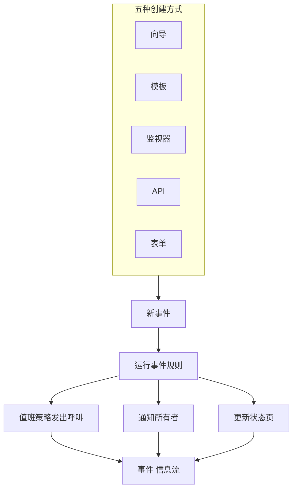
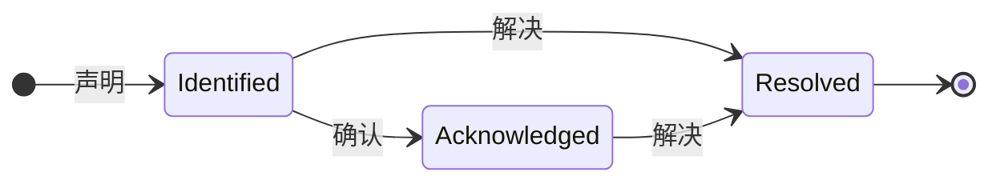

# 事件概览

事件是出问题时团队围绕着工作的那条记录：哪些东西受到影响、情况有多严重、响应进行到哪一步、由谁负责，以及整个过程中写下的一切。声明一个事件会呼叫正确的值班轮值、通知它的所有者，并且——如果你愿意——把故障发布到你的状态页上，让客户知道你已经在处理。

:::cards
- [声明事件](/docs/incidents/declaring-incidents): 手动、从模板、从监视器、通过 API，或者通过表单。
- [事件状态与严重级别](/docs/incidents/states-and-severities): 生命周期，以及确认和解决会做什么。
- [事件备注、负责人与动态](/docs/incidents/notes-owners-and-feed): 写给客户和团队的更新，以及谁会收到它们。
- [关联的告警](/docs/incidents/linked-alerts): 把一次故障引发的告警关联到解释它们的事件上。
- [事件设置与自动化](/docs/incidents/settings): 模板、自定义字段、角色、测量和规则。
:::

## 一览

- **独立的产品** —— 从顶栏的 **产品** 菜单打开 **事件**；列表位于 `/dashboard/{projectId}/incidents`。
- **三个预置状态** —— 每个新项目都会创建 **Identified**、**已确认** 和 **已解决**。你可以添加自己的状态；这三个预置状态可以改名、改颜色，但永远不能删除。
- **三个预置严重性** —— **Critical Incident**、**Major Incident** 和 **Minor Incident**。严重性是一个带颜色和顺序的标签，本身不带任何行为。
- **五种创建方式** —— **声明事件** 向导、**从模板创建**、监视器条件规则、`POST /api/incident`，或者任何拿到链接的人都能填写的 [表单](/docs/forms/index)。
- **按项目编号** —— 每个事件都会从项目级计数器获得一个事件编号，并带上项目的前缀显示：新项目中是 `INC-42`，没有前缀时是 `#42`。
- **两种备注** —— 给团队的私密备注（内部备注），以及给状态页订阅者的公开备注。
- **告警会关联到事件** —— 关联属于某个事件的告警，或者直接从告警声明事件（从告警列表或告警自己的页面），并在声明的同时确认这些告警。参见 [关联的告警](/docs/incidents/linked-alerts)。
- **设置位于事件之下，而不在项目设置中** —— 状态、严重性、模板、自定义字段和各个规则引擎都在 **事件 → 设置** 和 **事件 → 规则** 中。

## 工作原理

你可以在凌晨三点手动声明一个事件，也可以让监视器在其条件匹配的那一刻自动声明。无论哪种方式，事件都是同一个对象，走同样的生命周期，最后留下同样的记录。

### 1. 事件被声明

五条路径通向同一个对象：

- **手动** —— 在事件列表中点击 **声明事件**。这会打开 **声明新事件** 向导，共三步：**事件详情**、**受影响的资源**、**值班和角色**。第一步要求填写标题、严重性和描述，大多数事件用不到的内容都折叠在 **更多字段** 下。只有第一步有必须回答的内容：**下一步** 依次走完其余步骤，**声明事件** 位于最后的摘要页。
  - **从告警** —— 在选中的告警上或单个告警的页眉中使用 **声明事件**，会打开同一个向导，并按告警预先填好，把它们关联到新事件；除非你取消勾选，它还会确认这些告警，让它们停止升级。参见 [关联的告警](/docs/incidents/linked-alerts)。
- **从模板** —— 点击 **从模板创建** 并选择一个已保存的 **事件 模板**。模板会预先填写标题、描述、严重性、初始状态、资源、值班策略、所有者和标签。
- **从监视器** —— 启用了“声明事件”开关的监视器条件规则，会在过滤器匹配的那一刻自动创建事件。那里的标题和描述支持 `{{variable}}` 模板。
- **通过 API** —— 使用 API 密钥调用 `POST /api/incident`。服务器会替你填写 `declaredAt`、创建状态和事件编号。
- **通过表单** —— 团队外部的人填写你以链接形式分享的表单，无需 OneUptime 账号。事件在状态页上隐藏的情况下被声明；如果表单有事件模板，就按该模板创建。参见 [表单](/docs/forms/index)。

集成也会创建事件：[Huntress](/docs/integrations/huntress) 会把其 SOC 发来的每份事件报告变成一个事件，并呼叫你选择的值班策略。逐个字段的详细说明参见 [声明事件](/docs/incidents/declaring-incidents)。

### 2. 合适的人得到通知

事件创建时，OneUptime 会运行你配置的自动化：隐私规则、所有者规则、标签规则、值班规则和 Runbook 规则。附加到事件上的所有值班策略——无论是手动添加的、来自模板的，还是由匹配的值班规则合并进来的——都会并行执行。

所有者会通过各自在 **用户设置 → 通知设置** 中开启的渠道收到通知：电子邮件、短信、语音电话、推送、WhatsApp、Telegram、Slack、Microsoft Teams 或 webhook。如果事件完全没有所有者，通知会转给项目所有者，而不会被丢弃。

如果事件在状态页上可见并且启用了订阅者通知，订阅者也会得到通知：通知对象是列出该事件某个监视器的每个状态页的订阅者，或者只是你限定的那些页面的订阅者。如何为每类受众提供各自的状态页，参见 [每个受众一个状态页](/docs/status-pages/one-status-page-per-audience)。

> [!NOTE]
> 通知由每分钟运行一次的 cron 任务发送，因此会有最多约一分钟的延迟，而不是即时发送。

### 3. 团队处理事件

响应者确认事件、添加受影响的资源、关联属于它的告警、运行 Runbook、分配事件角色，并随时记下了解到的情况——给团队的私密备注、给客户的公开备注，等情况更清楚时再写 **根本原因** 和 **补救** 页面。他们做的一切都会记录在 **概览** 页面的 **事件 信息流** 中。

### 4. 事件被解决

点击 **解决** 会把事件移到已解决状态、在状态时间线上记下一笔、停止持续时间计时、交还事件占用的监视器，并把事件从它所显示的每个状态页的活动部分移除。为此不需要改动其他任何东西——状态页只显示处于已解决状态之上的状态中的事件。参见 [解决会做什么](/docs/incidents/states-and-severities#解决会做什么)。

之后你可以撰写事后分析，并可选择将其发布到状态页。

## 关键术语

本节的每个页面都会出现几个词。先把它们弄清楚。

| 术语                   | 含义                                                                                                                                                |
| ---------------------- | --------------------------------------------------------------------------------------------------------------------------------------------------- |
| **事件**               | 记录本身——标题、描述、严重性、当前状态、受影响的资源，以及响应过程中写在上面的一切。                                                                |
| **事件状态**           | 事件处在生命周期的哪个位置。一个属于项目的行，带有名称、颜色和 `order`，以及赋予其含义的标志。                                                      |
| **事件严重性**         | 情况有多严重。一个属于项目的行，带有名称、颜色和 `order`。纯粹是一种分类——产品中没有任何地方会特别对待某个严重性。                                  |
| **事件编号**           | 项目级计数器，显示为 `#42`，或带上你配置的前缀显示为 `INC-42`。                                                                                     |
| **受影响的资源**       | 你附加到事件上的监视器、主机、Kubernetes 集群、Docker 主机、服务和其他基础设施。                                                                     |
| **公开备注**           | 为状态页读者和订阅者写的更新，显示在状态页的时间线上。                                                                                              |
| **私密备注**           | 给响应团队的内部备注（`IncidentInternalNote` 模型），永远不会出现在状态页上。                                                                       |
| **所有者**             | 对事件负责的用户或团队。事件创建时、发布备注时以及状态变化时，所有者都会收到通知。                                                                  |
| **事件 信息流**        | 事件 **概览** 上只增不改的活动时间线，记录状态变化、备注、所有者变更、规则执行和通知。                                                              |
| **状态时间线**         | 记录事件在什么时间处于哪个状态、持续了多久——以及每次转换的订阅者通知状态。                                                                          |
| **关联的告警**         | 作为响应的一部分关联到事件的告警。一个告警可以关联到多个事件，并保持自己的状态。                                                                    |

## OneUptime 为每个项目预置的三个状态

创建项目时，OneUptime 会按以下顺序预置正好三个事件状态：

| 状态             | 顺序 | 颜色               | 含义                                                                      |
| ---------------- | ---- | ------------------ | ------------------------------------------------------------------------- |
| **Identified**   | 1    | 红色（`#fd625e`）  | 全新事件进入的状态，也就是创建状态。                                      |
| **已确认**       | 2    | 黄色（`#ffbf53`）  | 有人接手了事件并正在处理。                                                |
| **已解决**       | 3    | 绿色（`#2ab57d`）  | 事件已经结束。正是解决操作让它从状态页上撤下。                            |

名称只是标签——真正决定行为的是状态行上的三个布尔值：`isCreatedState`、`isAcknowledgedState` 和 `isResolvedState`。每个项目中，每个标志预期只由一个状态持有。

这个区别比听起来更重要：

- `isCreatedState` 决定新事件从哪里开始。如果创建时没有明确选择状态，OneUptime 会查找项目的创建状态并使用它。
- `isAcknowledgedState` 和 `isResolvedState` 标记确认状态和解决状态。事件的状态相对它们所处的位置，决定了事件页眉中的 **确认** 和 **解决** 按钮、事件 **概览** 上的两个统计卡片，以及侧边菜单中 **活动事件** 的计数徽章：处于确认状态或其后任一状态的事件视为已确认，处于解决状态或其后任一状态的事件视为已解决。
- **活动事件** 的定义纯粹是“当前状态位于解决状态之上”。因此，你在解决状态之上添加的自定义状态是活动的；放在它之后的状态则和解决状态一样，视为已解决。

> [!NOTE]
> 第一个预置状态的名称是 **Identified**，尽管产品中的一些描述仍然称它为创建状态。如果你在项目的状态列表中寻找“Created”，它就是名为 **Identified** 的那一行。

你可以在 **事件 → 设置 → 事件状态** 中添加自己的状态。新状态会被添加在解决状态的正上方，拖动行即可重新排序；**视为** 列显示每个状态中的事件被视为什么——未确认、已确认或已解决。三个带标志的状态带有 **内置** 标记：它们保持顺序且不能删除，但可以改名、改颜色和移动，这也是 UI 动态读取状态名称的原因。

顺序是强制执行的，不只是外观：事件不能移到顺序中位于当前状态之前的状态。完整细节见 [事件状态与严重级别](/docs/incidents/states-and-severities)。

## OneUptime 为每个项目预置的三个严重性

每个新项目还会获得三个严重性：

| 严重性                | 顺序 | 颜色                 | 含义                                                       |
| --------------------- | ---- | -------------------- | ---------------------------------------------------------- |
| **Critical Incident** | 1    | 栗色（`#b70400`）    | 对客户影响非常大，需要立即响应。                           |
| **Major Incident**    | 2    | 红色（`#fd625e`）    | 影响显著，通常需要立即响应。                               |
| **Minor Incident**    | 3    | 黄色（`#ffbf53`）    | 影响较小，通常在工作时间内处理。                           |

严重性只有 `name`、`description`、`color` 和 `order`，别无其他。没有标志，也没有任何代码路径会把“Critical Incident”与其他行区别对待。严重性是人进行分诊的方式，在编写值班规则时可以用作匹配条件——但选择一个严重性本身不会呼叫任何人。

在 **事件 → 设置 → 事件严重性** 中编辑或添加严重性。完整的预置描述见 [事件状态与严重级别](/docs/incidents/states-and-severities)。

## 事件在仪表板中的位置

从顶栏的 **产品** 菜单打开 **事件**。它的侧边菜单分为以下几个部分：

| 部分          | 在这里做什么                                                                                                                                                               |
| ------------- | -------------------------------------------------------------------------------------------------------------------------------------------------------------------------- |
| **概览**      | **所有事件** 和 **活动事件**——后者带有一个红色徽章，显示处于解决状态之上的状态中的事件数量。                                                                              |
| **片段**      | 事件片段，一个拥有自己页面的独立分组功能。                                                                                                                                 |
| **人工智能**  | **洞察**、**日志**、**设置**：OneUptime AI 从你的事件中学到了什么、为它们做过的一切，以及它可以自行做什么——包括决定调查和修复哪些事件的规则。参见 [AI SRE](/docs/ai/ai-sre)。 |
| **工作区**    | 本项目已连接的聊天工作区：**Slack**、**Microsoft Teams** 或两者，各自带有针对事件的通知规则。如果两者都未连接，这里是 **连接 Slack 或 Teams**，一个展示两者及其连接方法的页面。 |
| **集成**      | 会自行创建事件的工具：**Huntress**，它的事件报告会变成呼叫值班人员的事件。参见 [Huntress](/docs/integrations/huntress)。                                                   |
| **规则**      | 规则引擎：**分组规则**、**值班规则**、**所有者规则**、**Runbook 规则**、**隐私规则**、**标签规则**、**SLA 规则**、**Reminder Rules**。                                     |
| **设置**      | **事件状态**、**事件严重性**、**事件模板**、**备注模板**、**事后分析模板**、**自定义字段**、**事件角色**、**测量**、**已关联警报**、**编号前缀**。                         |

**概览** 和 **片段** 默认展开；**人工智能**、**工作区**、**集成**、**规则**、**设置** 和 **开发者** 默认折叠，因此菜单一打开就是你每天使用的列表。点击某个部分的标题即可展开，找到本文档其他地方提到的页面；当你位于某个部分的页面上时，该部分也会自动展开。事件配置不在项目设置中，全部都在这里。

事件列表本身显示 **事件编号**、**标题**、**状态**、**严重程度**、**受影响的资源**、**已声明**、**持续时间**、**标签** 和 **所有者**，并提供 **更改状态** 批量操作，一次关闭多个事件。

## 事件的各个页面显示什么

打开一个事件，它自己的侧边菜单会这样组织各个页面：

| 侧边菜单部分      | 页面                                                                                      |
| ----------------- | ----------------------------------------------------------------------------------------- |
| **概览**          | **概览**、**状态时间线**、**SLA**                                                         |
| **调查**          | **描述**、**根本原因**、**补救**、**运行手册**、**事后分析**、**已关联警报**              |
| **团队**          | **角色**、**值班执行**、**所有者**                                                        |
| **通知**          | **通知日志**、**AI 日志**——点击 **通知** 之前保持折叠                                     |
| **备注**          | **私人备注**、**公开备注**                                                                |
| **开发者**        | **Terraform**、**API**、**AI 助手**——点击 **开发者** 之前保持折叠                         |
| **高级**          | **自定义字段**、**设置**、**审计日志**、**删除事件**——点击 **高级** 之前保持折叠          |

各页面的内容：

- **概览** —— 一眼看清响应情况。页眉下方的统计卡片显示确认用时、解决用时和总 **持续时间**。页面最上方是 **AI Investigation** 卡片——OneUptime AI 发现了什么，或者它为什么没有开始——其下是 **事件 信息流**。旁边是 **Video Call** 卡片、**事件详情** 卡片（标题、严重性、标签、事件编号、声明时间、声明者、值班策略，以及底部一行小小的 **ID** 显示事件的 ID，点一下即可复制到剪贴板）、**事件角色**、**受影响的资源** 卡片和事件的自定义字段。如果项目有 [测量](/docs/incidents/settings#测量)，**事件详情** 下方的 **测量** 卡片会显示每项测量在此事件上的读数：**12 分钟**、**已进行 5 分钟**、**未达到**。
- **状态时间线** —— 事件经历过的每个状态，以及每次转换的 **开始**、**结束**、**持续时间** 和订阅者通知状态。**查看原因** 和 **查看日志** 解释每次变化发生的原因。
- **SLA** —— 此事件的 SLA 跟踪。
- **描述**、**根本原因**、**补救** —— 三个 Markdown 页面。显示在状态页上的是描述。
- **运行手册** —— 附加到此事件的 Runbook 执行。
- **事后分析** —— 复盘文档及其附件，可选择发布到状态页。**编辑事后分析备注** 会要求填写备注和附件，然后是 **在状态页上发布**；只有在它开启时，才会询问 **通知订阅者** 和 **事后分析发布于**，开启发布时后者会被设为当前时间。**Generate with AI** 为你起草备注，**应用模板**（项目有事后分析模板时显示）则从模板开始。订阅者只会在事后分析发布时收到一次通知：即状态页第一次显示它的时候，这需要开启 **在状态页上发布** 并写好备注。再次保存，或在发布状态下编辑，只会更新状态页而不通知任何人；从状态页撤下后再次发布，会再次通知他们。事件隐藏期间发布的事后分析，会在事件变为可见时发送。参见 [事后分析](/docs/status-pages/subscribers#事件)。
- **已关联警报** —— 关联到此事件的告警、每个告警的当前状态，以及是谁在何时关联的。告警有对应的 **已关联事件** 页面。参见 [关联的告警](/docs/incidents/linked-alerts)。
- **角色**、**值班执行**、**所有者** —— 谁在处理、哪些策略被触发、谁会收到通知。
- **通知日志**、**AI 日志**、**审计日志** —— 发送了什么、改变了什么。
- **私人备注** 和 **公开备注** —— 告诉了团队和客户什么。参见 [事件备注、负责人与动态](/docs/incidents/notes-owners-and-feed)。
- **自定义字段**、**设置**、**删除事件** —— **设置** 页面包含 **在状态页面上可见** 和 **私密事件**、将事件限定到部分状态页的 **状态页面范围** 卡片，以及 **Reminders** 卡片，其 **发送提醒** 开关一切换就会保存，并显示下一次提醒何时发出。

## 事件与 OneUptime 其他部分的关系

- **监视器发现问题；事件记录问题。** 监视器条件规则可以自动声明事件，并预先填写标题、严重性、值班策略、所有者、标签和补救备注。那里可用的变量参见 [事件与告警模板](/docs/monitor/incident-alert-templating)。
- **告警是信号；事件是响应。** 从任意一侧把事件所解释的告警关联到事件上；两个在新项目中默认开启的项目开关，会随事件一起确认和解决这些告警。参见 [关联的告警](/docs/incidents/linked-alerts)。
- **呼叫由值班策略完成。** 在声明向导的 **值班和角色** 步骤、模板上，或通过 **事件 → 规则 → 值班规则** 附加策略。每条匹配的规则都会触发——执行的集合是所有匹配项与直接附加项的并集，并去除重复。
- **Runbook 告诉人们该做什么。** Runbook 规则会在匹配的事件创建时自动附加一套流程，响应者也可以从事件中手动启动。参见 [Runbook 概览](/docs/runbooks/index)。
- **状态页告诉客户。** 当状态页列出事件的某个监视器、页面启用了事件、事件被标记为在状态页上可见，并且其当前状态位于解决状态之上时，事件就会出现在状态页的活动列表中。限定到部分状态页的事件只会显示在那些页面上。私密事件始终在所有状态页上隐藏。参见 [状态页概览](/docs/status-pages/index) 和 [每个受众一个状态页](/docs/status-pages/one-status-page-per-audience)。
- **工作流围绕它实现自动化。** **On Create Incident**、**On Update Incident** 和 **On Delete Incident** 触发器让你在事件生命周期之上构建无代码自动化。参见 [工作流概览](/docs/workflows/index)。

## 后续步骤

:::cards
- [声明事件](/docs/incidents/declaring-incidents): 逐个字段走完向导，或从模板、监视器或 API 声明。
- [事件状态与严重级别](/docs/incidents/states-and-severities): 添加自己的状态，并准确了解每个状态的作用。
- [状态页概览](/docs/status-pages/index): 事件如何触达你的客户。
- [订阅者与公告](/docs/status-pages/subscribers): 事件变化时谁会收到通知。
:::
