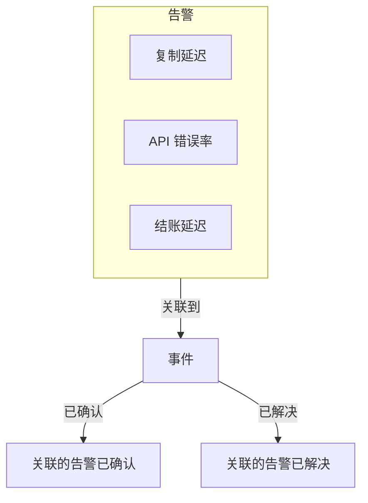
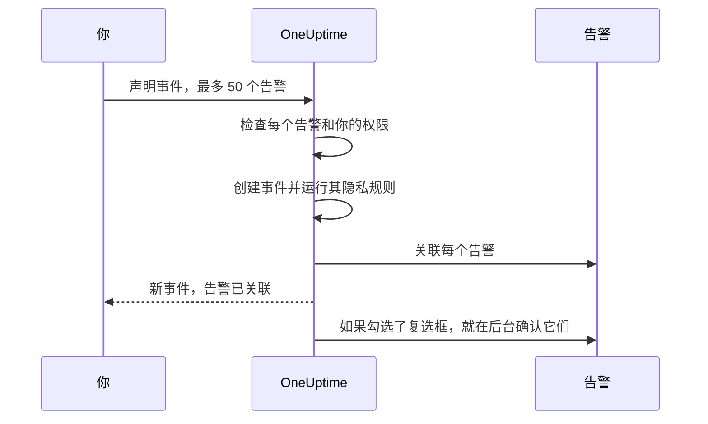

# 关联的告警

一次故障很少只引发一个告警。主数据库宕机时，复制延迟监视器会触发，API 错误率监视器会触发，结账延迟 SLO 开始消耗预算——三个告警，一个问题。把这些告警关联到事件上，就说明了这一点：事件是进行响应的地方，而每个告警都会显示是哪个事件解释了它。

关联只是关联。告警保留它自己的状态、所有者、值班策略、备注和信息流；事件也保留它自己的。关联不会合并或复制任何东西，单凭它本身也绝不会确认、解决或静音告警。（从告警声明新事件则不同：新事件会按这些告警预先填写，如 [下文所述](#从告警声明事件)，并且除非你取消勾选表单上的复选框，这些告警会在你声明时被确认，从而停止它们的升级——参见 [声明时确认告警](#声明时确认告警)。）两个在新项目中默认开启的项目开关，会在事件被确认和解决时，让关联的告警随之推进——参见 [下文](#让告警状态与事件保持同步)。

:::cards
- [把告警关联到事件](#从事件关联告警): 从事件、从告警，或一次关联多个。
- [从告警声明事件](#从告警声明事件): 一个新事件，一次性预填并关联好。
- [让告警状态保持同步](#让告警状态与事件保持同步): 随事件一起确认和解决告警。
- [权限](#权限): 谁可以关联，以及关联让他们能做什么。
:::

> [!TIP]
> 如果你来自 Opsgenie，这就是 OneUptime 版本的“把告警关联到事件”。

## 一览

- **多对多** —— 一个事件可以有任意数量的关联告警，一个告警也可以关联到多个事件。
- **三个关联入口** —— 事件的 **已关联警报** 页面、告警的 **已关联事件** 页面，以及主要告警列表上的 **关联到事件** 批量操作，每次最多 **50** 个告警。
- **从告警声明事件** —— 在告警列表、告警页眉或其 **已关联事件** 页面上使用 **声明事件**，会按告警预先填写一个新事件，并在创建时关联它们。表单上一个默认勾选的复选框还会确认它们，从而停止它们自己的值班升级。
- **两侧都有记录** —— 每次关联和取消关联都会在事件和告警上各写一条信息流条目，只是从告警声明的事件只会得到一条列出所有告警的条目。只有事件的条目会发布到 Slack 和 Microsoft Teams，并且私密告警或事件的标题永远不会写到另一侧。
- **告警状态跟随事件** —— 两个在新项目中都默认开启的项目开关，会在事件被确认和解决时确认和解决关联的告警。可在 **事件 → 设置 → 已关联警报** 中关闭其中任意一个。
- **可自动化** —— 关联是一种普通的 API 资源：`/api/incident-alert`。

## 工作原理

告警是信号：监视器的条件匹配了、SLO 开始消耗预算了、某条安全规则触发了。事件是针对一个问题的协同响应（参见 [事件概览](/docs/incidents/index)）。大多数问题会产生多个信号，而没有关联时，把它们与响应联系起来的只有某个人的记忆。



告警关联之后：

- 事件的响应者可以在一个列表中看到哪些告警属于它，以及每个告警处于什么状态。
- 打开其中某个告警的人会看到它已经在某个事件下被处理，而不会为同一次故障再声明第二个事件。
- 事件的信息流会记录每个告警是何时、由谁关联的，所以时间线能展示全貌是如何拼凑起来的。
- 开关开启时，确认事件会停止这些告警的值班升级，处理事件的人就不会再因为它的症状被重复呼叫。

## 关联如何工作

一个关联把一个告警连接到一个事件。关联是双向的——同一个关联会同时出现在事件的 **已关联警报** 页面和告警的 **已关联事件** 页面上。

- **一个告警可以关联到多个事件。** 一个共享依赖的故障可能是两个独立事件的症状。每个事件都会列出这个告警，告警也会列出这两个事件。
- **每一对只关联一次。** 把告警关联到它已经关联的事件，会以“This alert is already linked to this incident.”被拒绝——即使两个人在同一时刻关联同一对也是如此。
- **关联只能创建或删除，不能编辑。** 除了它的事件、它的告警、创建时间和创建者之外，关联没有任何自己的字段。要把告警移到另一个事件，先把它关联到新事件，再从旧事件取消关联。
- **关联限于项目之内。** 告警和事件必须属于同一个项目。

## 从事件关联告警

:::steps
### 打开事件的已关联警报页面

打开事件，在其侧边菜单的 **调查** 部分选择 **已关联警报**。表格列出已经关联到它的每个告警。

### 选择告警

点击 **关联警报**，从 **警报** 下拉列表中选择它。下拉列表最先列出最近的告警，每个都带编号——例如 `ALT-63: Checkout API is offline`——这样标题相同的告警（比如同一个监视器重复产生的告警）也能区分开。要查找较早的告警，直接输入：下拉列表会按标题搜索所有告警。

### 保存关联

在对话框中点击 **关联警报**。告警会出现在表格中，两侧的信息流都会记录这次关联。如果关联被拒绝，例如因为告警已经关联，对话框会保持打开并说明原因。
:::

| 列                  | 显示内容                                         |
| ------------------- | ------------------------------------------------ |
| **警报 #**          | 告警编号，例如 `#17` 或 `ALT-17`。               |
| **标题**            | 告警的标题，链接到该告警。                       |
| **当前状态**        | 告警自己的状态，例如 **已确认**。                |
| **关联时间**        | 告警被关联的时间。                               |
| **关联者**          | 是谁关联的。                                     |

每一行都有用于打开告警的 **查看警报** 和用于删除关联的 **取消关联**。

## 从告警关联事件

告警一侧与事件一侧相互对应。打开一个告警，在其侧边菜单的 **基础** 部分选择 **已关联事件**。表格列出该告警所关联的每个事件，包括事件编号、标题和当前状态，以及何时、由谁关联。

- **关联事件** 把这个告警关联到一个现有事件。它的下拉列表与事件一侧的一样：最近的事件排在前面，每个都带编号——例如 `INC-42: Checkout is down`——输入时会按标题搜索所有事件。
- **查看事件** 打开一个已关联的事件。
- **取消关联** 删除一个关联。
- **声明事件** 从这个告警开始一个新事件。同样的按钮也位于告警页眉中 **确认** 和 **解决** 的旁边。参见 [从告警声明事件](#从告警声明事件)。

## 一次关联多个告警

主要的告警列表为此提供了两个批量操作：**所有警报** 和 **活动警报**、首页上的活动告警，以及监视器、服务、主机、Kubernetes 集群、SLO 或任何其他拥有 **警报** 页面的资源的该页面。告警片段的 **成员警报** 列表没有这些操作——请改为在某个主要列表中选择告警。选中告警，然后选择：

- **关联到事件** —— 在 **事件** 下拉列表中选择事件，然后点击 **关联所选警报**。最近的事件排在前面并带有编号，输入时会按标题搜索所有事件。OneUptime 会关联每个选中的告警，并显示进度。已经关联到该事件的告警会算作完成而不是失败，所以重复执行这个操作也无妨。
- **声明事件** —— 打开一个按选中告警预先填写的新事件的声明表单。参见下一节。

两个操作每次最多处理 **50** 个告警。选得更多时它们会被禁用，并有提示说明原因。设置这个上限，是因为每个关联都会写入两侧的信息流，而通过 **关联到事件** 创建的每个关联还会发布到事件的 Slack 和 Microsoft Teams 频道——一次选中一千个告警会把它们淹没。

## 从告警声明事件

当一阵告警被证明是一个还没有人声明的事件时，就从这些告警声明它。有三个入口：

- 在某个主要告警列表中选择告警，然后选择 **声明事件**。
- 打开一个告警，点击其页眉中 **确认** 和 **解决** 旁边的 **声明事件**。告警被确认或解决之后，按钮依然在那里，所以你仍然可以事后为告警声明一个事件——比如为了对它进行事后分析。
- 打开某个告警的 **已关联事件** 页面，点击 **声明事件**。

三者都需要创建事件以及把告警关联到事件的权限。没有这些权限时，按钮会被锁定，其提示会指出缺少的权限。

无论使用哪个入口，你都会进入常规的 **声明新事件** 表单，告警会作为将要关联的对象列出，并且以下字段已预先填写：

| 字段                       | 预填内容                                                                                                                                                                                                                                                                               |
| -------------------------- | -------------------------------------------------------------------------------------------------------------------------------------------------------------------------------------------------------------------------------------------------------------------------------------- |
| **标题**                   | 一个告警时：它的标题。多个时：最严重告警的标题。                                                                                                                                                                                                                                       |
| **描述**                   | 一个告警时：它的描述。多个时：一个列表，每个告警一行，给出其编号和标题。                                                                                                                                                                                                               |
| **事件严重性**             | 最严重告警的严重性，转换为事件严重性。名称相同（忽略大小写）的事件严重性优先。否则，OneUptime 取严重性顺序中相同位置的事件严重性；如果你的事件严重性更少，就取最后一个。                                                                                                               |
| **受影响的资源**           | 所选告警的所有监视器、主机、Kubernetes 集群、Docker 主机、Podman 主机和服务的合集。监视器放在 **监视器** 下，其余放在 **其他受影响的资源** 下。其他资源，例如 SLO，或 VMware、Proxmox 和 Ceph 集群，不会被复制——如果事件影响到它们，请自行添加。 |
| **标签**                   | 所有选中告警的所有标签。                                                                                                                                                                                                                                                               |
| **私密事件**               | 只要有任一告警是私密的就开启。表单会说明这一点，并且告警的所有者会成为事件的所有者——见下文。                                                                                                                                                                                         |

“最严重”遵循你的告警严重性顺序：列表中的第一个告警严重性就是最严重的。使用每个项目一开始拥有的严重性时，**High** 告警会成为 **Critical Incident**，**Low** 告警会成为 **Major Incident**。

提交之前一切都可以编辑。**标签** 和 **私密事件** 位于表单第一步的 **更多字段** 下，其折叠的标题会在它们被设置时显示出来。

**已经有事件的告警会被标记。** 由于每个告警的页面上都有 **声明事件**，被同一次故障呼叫的两名响应者可能会各自声明。因此，列出告警的横幅会标记每个已经关联到事件的告警——“(already linked to Incident INC-42)”，并链接到那个事件——并根据已关联告警的数量添加一条措辞不同的说明：

- 全部告警，且只有一个：“This alert is already linked to an incident. If it is the same problem, update that incident instead of declaring another one.”
- 全部告警，且有多个：“These alerts are already linked to incidents. If it is the same problem, update that incident instead of declaring another one.”
- 只有其中一部分：“Some of these alerts are already linked to an incident. If it is the same problem, link the other alerts to that incident from the alerts list instead of declaring another one.”

事件链接会在新标签页中打开，所以你可以查看现有事件，而不会丢失已经在表单中填写的内容。这条说明只是提醒，而不是阻止，并且只会列出你有权查看的事件。

**值班策略不会被复制。** 告警在创建时已经运行了它们自己的值班策略，所以把它们复制到事件上会再次呼叫同一批人。事件的值班策略就是你在 **值班和角色** 步骤中选择的，加上你的事件值班规则所添加的——与任何其他事件完全一样。

**告警的监视器会被预填为受影响的监视器。** 与任何手动声明的事件一样，事件监视器的主动监视会暂停，直到事件被解决。如果某个监视器应当继续被检查，请在提交前从 **受影响的资源** 步骤的 **监视器** 中移除它。

**私密告警会产生私密事件。** 只要有任一告警是私密的，**私密事件** 就会以开启状态开始，列出告警的横幅也会这样说明。私密事件只对其所有者、Project Owners 和 Project Admins 可见，所以 OneUptime 会确保能看到这些告警的人也能看到事件：事件一旦声明，每个所声明告警的所有者——用户和团队都包括在内——都会被添加为事件的所有者，而且不会收到通知。他们会在事件的 Slack 和 Microsoft Teams 频道创建之后立即被添加，因此会像其他所有者一样被邀请进这些频道。和你声明的任何事件一样，你也是所有者。当事件隐私规则把新事件设为私密时，也会发生同样的事情。如果你在提交前关闭 **私密事件**，并且没有适用的隐私规则，事件就不是私密的，也不会复制所有者。



提交后，服务器会在创建任何东西之前检查这些告警：最多 50 个，每个都是本项目中你有权查看的告警，并且你必须有权把告警关联到事件。任何一项检查失败，请求都会被拒绝，不会创建事件——因此错误的告警 ID 永远不会耗掉一个事件编号。事件一旦存在——并且它的隐私规则已经运行，让关联知道它是否私密——每个告警都会在请求返回之前完成关联，所以事件的 **已关联警报** 页面上已经列出了它们。如果单个关联失败——比如因为告警恰好在前一刻被删除——事件仍然会被声明，其他告警仍然会被关联。

事件的信息流会得到一条列出这些告警的 **警报已关联** 条目，写在 **事件已创建** 之后，而不是每个告警一条——参见 [信息流、Slack 和 Microsoft Teams](#信息流slack-和-microsoft-teams)。

### 声明时确认告警

声明事件本身并不会让它的告警停止呼叫：告警的值班升级只有在告警本身被确认后才会停止。因此，当任何一个告警尚未被确认时，表单上的横幅会有一个默认勾选的复选框——一个告警时为 **Acknowledge this alert to stop its escalation**，多个时为 **Acknowledge these 3 alerts to stop their escalation**。如果其中一些已经被确认，它只会列出其余的告警，并说明已确认的保持原样。

保持勾选，那么在事件声明、告警关联之后：

- **告警会以你的身份被确认。** 每个告警都会移到你的告警 **已确认** 状态，就像你自己在它上面点击了 **确认** 一样：告警的 **状态时间线** 和信息流会写上你的名字，告警的所有者会收到通知，这次变化也会像任何其他告警状态变化一样发布到告警的 Slack 和 Microsoft Teams 频道。原因写作“Acknowledged because Incident INC-42 was declared from this alert.”——对于私密事件，则写作“Acknowledged because a private incident was declared from this alert.”，这样私密事件永远不会在告警的读者能看到的地方被提及。
- **它们自己的值班升级会在大约一分钟内停止。** 下一个升级步骤会看到一个已确认的告警并停止。已经发出的呼叫不会被撤回。
- **只有当提醒规则如此规定时，提醒才会停止。** 只有当告警的提醒规则把 **Stop Reminders When** 设为 **已确认** 时，告警的提醒才会在确认时停止；否则它们会一直持续到告警被解决。
- **告警片段会继续升级。** 如果某个告警属于一个通过自己的值班策略进行呼叫的片段，该片段会继续升级，直到片段本身被确认。
- **已经确认或解决的告警保持不动。** 与其他所有地方一样，状态按顺序比较，所以处于 **已确认** 之后某个自定义状态的告警被视为已确认，任何东西都绝不会被往回移。

取消勾选复选框，即可在不确认的情况下声明。只要告警将保持未确认——复选框未勾选或被锁定——表单就会这样说明：“Declaring the incident does not acknowledge the alert: it keeps escalating until it is acknowledged.”如果你确认了告警，却没有为事件选择值班策略，**值班和角色** 步骤的摘要会指出：“The alerts it is declared from are acknowledged too, so their own escalation stops. An alert episode they belong to keeps escalating until the episode is acknowledged, and an incident on-call rule, if any, may still page.”

**你需要有确认这些告警的权限。** 在声明时确认它们需要 **Create Alert State Timeline** 和 **Edit Alert**（在告警自己的页面上确认只需要前者：参见 [更改状态](/docs/permissions/index#更改状态)）：Project Owner、Project Admin、Project Member、Alert Admin 和 Alert Member 两者都有，而能够从告警声明事件的 Incident Admin 和 Incident Member 两者都没有。你在告警上的标签和所有者范围也必须包含每个将被确认的告警——只检查尚未确认的告警。已经确认或解决的告警不需要权限，也绝不会阻止声明。没有这些权限时，复选框会被锁定，提示会指出缺少的那个权限，而你仍然可以声明事件。服务器在创建任何东西之前，会对它将要确认的每个告警再检查一次：如果你不能确认其中某个，就不会创建事件，表单会说明原因——取消勾选复选框后再提交一次。

**项目需要一个已确认的告警状态。** 每个项目一开始都有一个。如果你的项目没有，就不会提供这个复选框。

告警会在关联之后立即在后台被确认，每次处理几个——最多同时 5 个——所以事件页面可能会在它们被确认之前稍早打开，而从许多告警声明时，最后的告警也不必排在其他所有告警之后等待。无法确认的告警——比如它在此期间被删除了——会被记录到日志中，绝不会阻止其他告警或事件；在此期间被别人确认或解决的告警，则保持对方留下的样子。

**当项目的关联告警开关开启时，可能改由开关来推动告警。** 如果事件一开始就以已确认或已解决的状态声明，而某个 [关联告警开关](#让告警状态与事件保持同步) 作用于该状态，那么开关会在关联时推动这些关联的告警，复选框则把这些告警交给开关处理，这样每个告警只有一个写入者。它们会以开关的方式被确认或解决——带着开关的原因，例如“Acknowledged because linked Incident INC-42 was acknowledged.”，即使事件是私密的，它也会以编号指明事件——不会记在你的名下，它们的所有者也不会收到通知。像往常一样以你的第一个事件状态声明，或者开关处于关闭状态时，每个告警都交给复选框处理。

### 通过 API 声明

`POST /api/incident` 在 `miscDataProps` 的 `alertIdsToLink` 中接受要关联的告警 ID，并在 `acknowledgeAlertsToLink` 中接受是否确认这些告警：

```bash
curl -X POST https://oneuptime.com/api/incident \
  -H "apikey: $ONEUPTIME_API_KEY" \
  -H "Content-Type: application/json" \
  -d '{
    "data": {
      "title": "Primary database unavailable",
      "incidentSeverityId": "<incident-severity-id>"
    },
    "miscDataProps": {
      "alertIdsToLink": ["<alert-id>", "<another-alert-id>"],
      "acknowledgeAlertsToLink": true
    }
  }'
```

`alertIdsToLink` 是一个包含 1 到 50 个告警 ID 的数组。重复项会被忽略，并且在事件创建之前适用与仪表板相同的检查。通过 API 不会预填任何内容——请发送你想要的标题、严重性和资源。API 密钥需要创建事件和把告警关联到事件的权限，并且必须能读取这些告警。API 密钥不是用户，所以用它创建的关联没有 **关联者**。请求体的其余部分参见 [声明事件](/docs/incidents/declaring-incidents)。

`acknowledgeAlertsToLink` 是可选的，不发送时为关闭。把它设为 `true`，即可像表单的复选框一样，在告警关联后确认它们——已经确认或解决的告警保持不动，也不需要权限。省略它或发送 `false`，即可在不确认它们的情况下声明。它会与告警 ID 一起在事件创建之前进行检查，在以下情况下请求会以 400 被拒绝：

- 它是 `true` 或 `false` 以外的任何值；
- 发送它时没有 `alertIdsToLink`；
- 项目没有已确认的告警状态；
- API 密钥无法确认每一个尚未确认的告警——这需要 **Create Alert State Timeline** 和 **Edit Alert**，以及包含每一个这些告警的标签范围。

API 密钥不是用户，所以用它确认的告警不会记在任何人名下，正如它的关联没有 **关联者** 一样。

## 通过 API 关联和取消关联

关联是位于 `/api/incident-alert` 的标准 CRUD 资源。要把告警关联到事件，就创建一个关联：

```bash
curl -X POST https://oneuptime.com/api/incident-alert \
  -H "apikey: $ONEUPTIME_API_KEY" \
  -H "Content-Type: application/json" \
  -d '{
    "data": {
      "incidentId": "<incident-id>",
      "alertId": "<alert-id>"
    }
  }'
```

要列出事件的关联告警，按 `incidentId` 查询。改为按 `alertId` 查询，则可以找到某个告警所关联的事件：

```bash
curl -X POST https://oneuptime.com/api/incident-alert/get-list \
  -H "apikey: $ONEUPTIME_API_KEY" \
  -H "Content-Type: application/json" \
  -d '{
    "query": { "incidentId": "<incident-id>" },
    "select": { "_id": true, "alertId": true, "createdAt": true },
    "limit": 50,
    "skip": 0
  }'
```

要取消关联，就按关联自己的 ID 删除它——是关联的 `_id`，而不是告警或事件的：

```bash
curl -X DELETE https://oneuptime.com/api/incident-alert/<link-id> \
  -H "apikey: $ONEUPTIME_API_KEY"
```

两个 ID 都是必需的。当告警或事件属于另一个项目，或者是你看不到的对象时，关联请求也会被拒绝。无论告警或事件是不存在还是只是对你隐藏，错误信息都一样，所以它永远不会泄露某个私密对象的存在。

同一个资源驱动着生成的工作流组件——**On Create Incident Alert** 在告警被关联时触发，**On Delete Incident Alert** 在取消关联时触发——以及 MCP 服务器的 Incident Alert 工具。完整的请求和响应结构见 [API 参考](/reference)。

## 取消关联

可以从任意一侧取消关联：在事件的 **已关联警报** 页面或告警的 **已关联事件** 页面的某一行上点击 **取消关联**，然后确认。要一次取消多个关联，选中这些行并选择批量 **取消关联** 操作。它只会删除关联——告警和事件本身不会被删除。

取消关联只删除关联，别无其他。告警和事件保持各自的状态，因事件而被确认或解决的告警也保持原样——告警状态永远不会往回走。两侧的信息流都会记录这次取消关联。

## 权限

关联在 [权限参考](/docs/permissions/reference) 的 **Incident** 组中有四个自己的细粒度权限：

| 权限                      | 允许的操作                                                                                                             | 包含它的角色                                                                                             |
| ------------------------- | ---------------------------------------------------------------------------------------------------------------------- | -------------------------------------------------------------------------------------------------------- |
| **Create Incident Alert** | 把告警关联到事件，包括从告警声明事件时。你还必须能够读取两者。                                                         | Project Owner, Project Admin, Project Member, Incident Admin, Incident Member, Alert Admin, Alert Member |
| **Delete Incident Alert** | 取消关联。                                                                                                             | Project Owner, Project Admin, Project Member, Incident Admin, Incident Member, Alert Admin, Alert Member |
| **Read Incident Alert**   | 查看 **已关联警报** 和 **已关联事件** 列表。                                                                           | 以上所有角色，外加 Viewer、Incident Viewer 和 Alert Viewer                                               |
| **Edit Incident Alert**   | 实际上什么也不能做——关联没有可以更改的字段。                                                                           | Project Owner, Project Admin, Project Member, Incident Admin, Incident Member, Alert Admin, Alert Member |

包含告警角色，是为了让处理告警的人能够关联告警；包含事件角色，是为了让处理事件的人也能这样做。两者单独都不够，因为只有在你能读取两侧时才会创建关联：

- **告警角色还需要事件的读取权限** —— 添加 Viewer、Incident Viewer 或 Read Incident。
- **事件角色还需要告警的读取权限** —— 添加 Viewer、Alert Viewer 或 Read Alert。

在此之上还有三条规则：

- **你必须能看到两侧。** 只有在你能读取告警和事件两者时，才会创建关联。私密告警和事件以及标签限制照常适用。
- **关联属于它的事件。** 你能否看到一个关联，取决于你对其事件的访问权限：事件上的标签限制和所有者范围同样适用于关联。
- **关联只需要告警的读取权限，而不需要编辑权限。** 当项目的关联告警开关开启时（新项目中默认如此），这就足以让一个关联确认或解决告警——参见 [谁会推动关联的告警](#谁会推动关联的告警)。

从告警声明事件还需要创建事件的权限，而在声明时确认其告警，需要对其中每个尚未确认的告警都有 **Create Alert State Timeline** 和 **Edit Alert**——参见 [声明时确认告警](#声明时确认告警)。在仪表板中，你缺少权限的操作会被锁定，其提示会指出缺少的权限。这也包括对另一侧的读取权限：如果你不能读取告警，**关联警报** 会被锁定；如果你不能读取事件，**关联事件** 和 **关联到事件** 会被锁定。角色、细粒度权限、标签和所有者范围如何组合，参见 [用户、团队与权限](/docs/permissions/index)。

## 信息流、Slack 和 Microsoft Teams

每次关联和取消关联都会写入两侧的信息流，记在做出更改的人名下：

| 变更        | 事件信息流                                   | 告警信息流                                          |
| ----------- | -------------------------------------------- | --------------------------------------------------- |
| 关联        | **警报已关联**（`AlertLinked`）              | **已关联到事件**（`LinkedToIncident`）              |
| 取消关联    | **警报已取消关联**（`AlertUnlinked`）        | **已取消与事件的关联**（`UnlinkedFromIncident`）    |

每条条目都以编号指明另一侧并链接到它，这样你就可以从事件的信息流跳到告警再跳回来。它也会给出另一侧的标题，除非那一侧是私密的：

- **私密告警的标题不会写入事件的条目**，因此也不会出现在 Slack 和 Microsoft Teams 中。条目写作，例如，“Linked Alert #12 (private alert) to Incident #5”。
- **私密事件的标题不会写入告警的条目**，条目写作“Linked to Incident #5 (private incident)”。

即使两者都是私密的也是如此，因为私密告警和私密事件可能有不同的所有者。打开关联的告警或事件，照常受其自身隐私的约束。

**只有事件的条目会到达 Slack 和 Microsoft Teams。** **警报已关联** 和 **警报已取消关联** 会发布到事件其他信息流更新所去的地方。告警一侧的条目留在仪表板中，所以一次关联只产生一条消息，而不是两条。这些频道的设置，参见 [Slack](/docs/workspace-connections/slack) 和 [Microsoft Teams](/docs/workspace-connections/microsoft-teams)。

**从告警声明事件只写一条条目，而不是每个告警一条。** 声明事件时创建的关联不会各自写入 **警报已关联** 条目。相反，一旦事件的 **事件已创建** 条目发出——并且事件自己的 Slack 和 Microsoft Teams 频道（如果你使用它们）已经创建——事件就会得到一条 **警报已关联** 条目：“Declared from 3 alerts:”，后面每个告警一行，列出其编号和标题（私密告警不含标题）。这就是发布到 Slack 和 Microsoft Teams 的唯一一条消息。每个告警仍然会得到它自己的 **已关联到事件** 条目。

两个信息流的 **按事件类型过滤** 对话框（位于每个信息流的 **⋯** 菜单中）都会列出这些事件类型，所以你可以像其他任何类型的条目一样显示或隐藏关联活动。关于事件信息流的更多内容，参见 [事件备注、负责人与动态](/docs/incidents/notes-owners-and-feed)。

## 让告警状态与事件保持同步

两个项目开关让事件带着它的关联告警一起前进。两者在新项目中都默认开启。在它们默认开启之前创建的项目会保留原来的设置，除非有人打开过，否则是关闭的。它们有自己的设置页面 **事件 → 设置 → 已关联警报**，在其 **已关联警报** 卡片上，每一个都是一个一切换就会保存的开关。只有 Project Owners 和 Project Admins 可以更改它们；对其他所有人，开关是锁定的，并会说明需要什么权限：

- **事件确认时确认已关联的警报** —— 当事件到达你的确认状态时，每个尚未确认的关联告警都会移到你的告警 **已确认** 状态。正是这一点停止了这些告警的值班升级：下一个升级步骤会看到一个已确认的告警，并在大约一分钟内停止。已经发出的呼叫不会被撤回。当告警的提醒规则把 **Stop Reminders When** 设为 **已确认** 时，告警提醒也会停止；否则它们会一直持续到告警被解决。
- **事件解决时解决已关联的警报** —— 当事件到达你的解决状态时，每个尚未解决的关联告警都会移到你的告警 **已解决** 状态，但仍关联着另一个尚未解决的事件的告警除外。那个告警会为另一个事件保持未解决——如果确认开关也开启，则处于已确认——并在它的最后一个事件被解决时解决。

两个开关都关闭时，关联不会改变告警状态的任何方面。关联的告警会停留在原处，直到有人推动它，它的值班策略会继续升级，它的提醒也会继续到来。唯一的例外是在保持表单复选框勾选的情况下从告警声明事件，这会在你声明时确认它们——参见 [声明时确认告警](#声明时确认告警)。

### 开关的行为

- **看顺序，不看名称。** “到达”意味着事件的当前状态在你的状态顺序中处于或越过了确认状态或解决状态。确认状态和解决状态之间的自定义状态，例如 **监控** 状态，被视为已确认。告警也以同样的方式比较，所以处于 **已确认** 之后某个自定义状态的告警已经被视为已确认。
- **绝不倒退。** 只有落后于目标状态的告警才会被推动。已经确认的告警不受确认开关影响，已解决的告警永远不会被触碰。
- **只开启确认开关时解决事件**，会确认关联的告警，因为已解决越过了已确认。
- **关联到一个已经确认或解决的事件**，会立即对新告警应用这些开关，就好像事件刚刚改变了状态一样。
- **重新打开事件不会重新打开它的告警。** 告警不能移到更早的状态。
- **只有当前状态才算数。** 向事件的 **状态时间线** 添加一条过去的条目——带有 **结束** 的那种——不会推动任何告警。
- **单凭关联绝不会改变告警的状态。** 两个开关都关闭时，事件永远不会推动它的告警。

告警会在事件之后立即在后台改变状态。每次变化都会经过告警自己的状态时间线，并带有诸如“Acknowledged because linked Incident INC-42 was acknowledged.”的原因，所以告警的 **状态时间线** 和信息流会显示它为什么被推动。告警的所有者不会因此收到状态变更通知，但这次状态变化会像任何其他告警状态变化一样发布到 Slack 和 Microsoft Teams。一个告警推动失败不会阻止其他告警。

### 谁会推动关联的告警

打开一个开关，就是有意把关联告警的状态交给事件：事件是进行响应的地方，所以主持事件的人也主持它的告警。从那时起：

- **能改变事件状态的人会推动它的关联告警。** 确认或解决事件会确认或解决它们。
- **能关联告警的人就能推动它。** 把告警关联到一个已经确认或解决的事件，会在关联时推动该告警。

两者都不需要编辑告警的权限。OneUptime 自己推动它们，而关联只需要告警的读取权限。因此，在确认开关开启时，任何能关联告警或改变事件状态的人，都可以确认他们能看到的任何告警——并停止它的值班升级；在解决开关开启时，他们还可以解决它。这就是为什么只有 Project Owners 和 Project Admins 可以更改这些开关。它们在新项目中是开启的，所以如果告警状态只应由能编辑告警的人更改，请关闭它们。

### 解决来自监视器的告警

对监视器的告警来说，确认总是安全的：已确认的告警仍然算作未解决，所以监视器会继续使用它，而不是再打开一个新的。

> [!WARNING]
> 解决则不同。如果在告警被解决时监视器仍然失败，监视器的下一次检查会打开一个新的告警——而这个新告警并没有关联到事件。如果你的事件经常在其监视器恢复之前就被解决，请关闭解决开关、只保留确认开关，或者只在监视器恢复正常后再解决事件。

## 删除告警和事件

- **删除告警** 会把它从它所关联的每个事件中移除。事件的其他方面保持不变。
- **删除事件** 会删除它的关联。告警的其他方面保持不变，并保留它们的状态。
- **删除项目** 会连同其他一切删除它的所有关联。

这些操作都不会写入 **警报已取消关联** 或 **已取消与事件的关联** 信息流条目——只有显式的取消关联才会。

## 后续步骤

:::cards
- [声明事件](/docs/incidents/declaring-incidents): 声明表单、模板、监视器条件和 API。
- [事件状态与严重级别](/docs/incidents/states-and-severities): 开关所对照的状态顺序。
- [事件设置与自动化](/docs/incidents/settings): 事件设置页面，已关联警报也在其中。
- [用户、团队与权限](/docs/permissions/index): 角色、细粒度权限和范围。
:::
