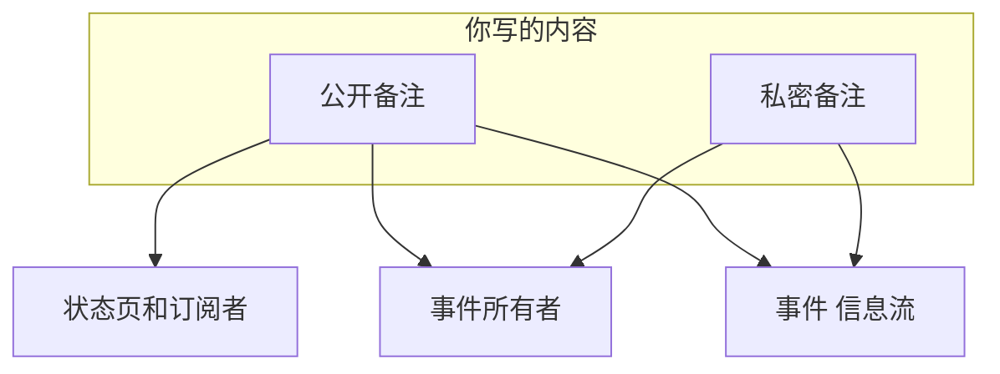
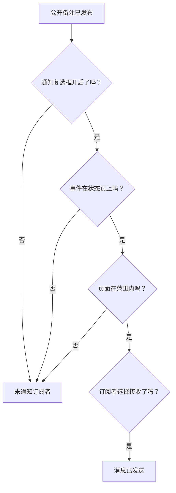

# 事件备注、负责人与动态

在你处理事件的过程中，每个事件都会积累一份书面记录：写给客户的更新、写给团队的工作备注，以及记录所发生一切的活动信息流。本页介绍如何撰写公开备注和私密备注、每种备注会触达谁、事件信息流，以及会被告知每一次变化的所有者。

:::cards
- [发布公开备注](#发布公开备注): 通过状态页和通知，把你知道的情况告诉客户。
- [订阅者何时收到通知](#公开备注何时真正触达订阅者): 公开备注要通过的检查，以及它的徽章。
- [事件信息流](#事件信息流): 所发生一切的时间线。
- [所有者](#所有者): 谁负责，以及他们会被告知什么。
:::

## 工作原理

你写的内容有一部分是给客户的——比如凌晨 02:14 发到状态页上、说明你已经找到那次有问题的部署的更新。其余的是给团队的——某人粘贴的堆栈跟踪、终于看明白的那张图、决定进行故障切换。OneUptime 把这两类读者分开，同时把两者都记录在事件上。

**公开备注** 会发布到你的状态页，并且可以通知订阅者。**私人备注**（`IncidentInternalNote` 模型）留在仪表板之内。两者之下是 **事件 信息流**——一条只增不改的时间线，记录事件上发生的一切——以及 **所有者** 列表，它决定谁会得到通知。

这一切都挂在事件的侧边菜单上：**备注 → 公开备注**、**备注 → 私人备注** 和 **团队 → 所有者**。信息流位于事件的 **概览** 页面。

## 公开备注与私密备注

这两种备注在仪表板中看起来相似，行为却截然不同。

|                          | 公开备注                                                            | 私密备注                                                        |
| ------------------------ | ------------------------------------------------------------------- | --------------------------------------------------------------- |
| 模型                     | `IncidentPublicNote`                                                | `IncidentInternalNote`                                          |
| 显示在状态页上           | 是，作为事件时间线的一部分                                          | 从不——状态页应用中没有任何东西会读取它们                        |
| 发布时间                 | `postedAt`，可以自己设置                                            | 无：按 `createdAt` 打时间戳和排序                               |
| 通知订阅者               | 当 **Notify status page subscribers** 开启时                        | 从不：它根本没有订阅者相关字段                                  |
| 附件可被谁获取           | 状态页访问者，通过状态页路由                                        | 仅限经过身份验证的仪表板 API                                    |
| 通知所有者               | 是                                                                  | 是                                                              |

**“私密”的真正含义。** 它的意思是“不发布到状态页”——而不是“只限一小部分人”。能读取事件的内置角色可以读取两种备注，所以能读取事件的人通常也能读取它的私密备注；在自定义角色中，它们是两个独立的权限：**Read Incident Status Page Note** 和 **Read Incident Internal Note**。如果你需要限制谁能看到事件本身，请使用事件上的 **私密事件** 标志（`isPrivate`），它会让事件在所有状态页上隐藏，并将其限制为事件的所有者用户、所有者团队的成员，以及项目管理员和所有者。

**所有者两种都能看到。** 通知所有者的任务会同时查询公开备注和私密备注。私密备注是对订阅者保密，而不是对响应人员保密。

| 如果你想……                                             | 选择             |
| ------------------------------------------------------ | ---------------- |
| 告诉客户你知道了什么，以及何时会有更多消息             | **公开备注**     |
| 补录一条你已经在别处发出的更新                         | **公开备注**     |
| 记录一个假设、你运行的命令或一条死胡同                 | **私密备注**     |
| 附上堆转储或内部仪表板截图                             | **私密备注**     |

## 发布公开备注

:::steps
### 打开公开备注

打开事件，在它的侧边菜单中选择 **备注 → 公开备注**。备注上方的编辑器会在你发布之前说明谁会读到这条备注：**Public · Visible on your status page**。

### 撰写更新

用 Markdown 撰写备注，或者从你的某个 **模板** 或 **Draft with AI** 开始。如果订阅者需要看到文件，就用 **Attach** 添加。

### 决定通知谁

保持 **Notify status page subscribers** 勾选以通知订阅者，或者取消勾选以静默发布。它下方的 **Will notify** 显示备注将触达哪些状态页，**预览** 显示他们将收到的邮件。

### 发布

点击 **Post update**，或按 Ctrl+Enter（Mac 上为 ⌘+Enter）。备注会出现在列表顶部，并带有一个跟踪其通知进度的徽章。
:::

同一个编辑器也可以从事件信息流 **操作** 菜单中的 **Add Public Note** 以对话框形式打开（参见 [事件信息流](#事件信息流)），所以无论从哪里写，备注的写法都一样。

| 控件                               | 用途                                                                                                                                          |
| ---------------------------------- | --------------------------------------------------------------------------------------------------------------------------------------------- |
| 备注正文                           | Markdown 正文。必填。                                                                                                                         |
| **模板**                           | 把你的某个备注模板放进备注，接在你已经输入的内容之后。参见 [备注模板](#备注模板)。                                                      |
| **Draft with AI**                  | 根据事件起草备注，供你编辑。参见 [用 AI 生成备注](#用-ai-生成备注)。                                                               |
| **Attach**                         | 在状态页上与订阅者共享的文件。可选。                                                                                                          |
| **Posted now**                     | 备注显示的发布时间：除非你在这里选择更早的时间，否则就是你发布的那一刻，按你当前的时区显示。                                                  |
| **Notify status page subscribers** | 复选框。默认开启，除非事件在声明时没有通知订阅者——这时它以关闭状态开始。关闭它即可静默发布。                                                |

**安静的事件保持安静。** 如果事件在声明时关闭了 **通知状态页订阅者**（或者是作为私密事件声明的），它的订阅者从未得知此事，所以公开备注不应该成为他们听到的第一条消息。在这样的事件上，复选框以关闭状态开始，下方有一行说明原因。你仍然可以勾选它，就这条备注通知订阅者。没有明确选择而发布的备注也遵循同样的规则：Slack 和 Microsoft Teams 中的备注、工作流，以及省略了 `shouldStatusPageSubscribersBeNotifiedOnNoteCreated` 的 API 请求。明确的 `true` 或 `false` 总会被保留。[计划维护事件](/docs/status-pages/subscribers#计划维护事件) 和 [事件片段](/docs/status-pages/subscribers) 上的公开备注遵循类似的规则，依据的是该维护事件或片段在创建时是否通知了订阅者；把片段设为私密不会影响这一点。

**查看备注将触达谁。** 当 **Notify status page subscribers** 处于勾选状态时，它下方的 **Will notify** 行会列出备注将发往的状态页，每个渠道附上“最多”订阅者数量，以及那些列出了事件监视器但不会得到通知的页面和原因。没有人会得到通知时它什么都不显示，除非事件在状态页上隐藏，或者原因是事件的状态页范围。它遵循事件的状态页范围，因此限定到两个站点页面的事件上的备注，会显示它将触达这两个页面。参见 [每个受众一个状态页](/docs/status-pages/one-status-page-per-audience)。

**查看他们将收到什么。** 在同一个复选框旁边，**预览** 会显示每个状态页的订阅者针对你正在撰写的备注将收到的邮件，以及它使用哪个模板、为什么使用。在备注有文字之前它保持灰色。**发送测试邮件给我** 只会把这封邮件发送到你自己的账户邮箱，不会发给其他任何人。参见 [订阅者与公告](/docs/status-pages/subscribers#事件)。

> [!TIP]
> **发布时间才是备注真正的时间戳。** 状态页按 `postedAt` 而不是你输入的时间对公开备注排序和显示——所以如果你要把 40 分钟前发出的一条更新补到状态页上，请选择 **Posted now** 并设置它实际发生的时间。如果备注通过 API（`/api/incident-public-note`）提交时没有带时间，OneUptime 会打上当前时间。

每条备注都会显示作者、发布时间、渲染后的 Markdown 及其附件，并在标题中显示它的订阅者通知进展到哪一步。**Search notes…** 按内容查找备注，信息流可以按最新优先或最早优先阅读。

## 发布私密备注

**备注 → 私人备注** 被有意设计得更简单。它是同一个编辑器，显示 **Private · Only your team can see this**，带有备注正文、**模板**、**Draft with AI**，以及用于发给事件响应团队的文件的 **Attach**。事件信息流 **操作** 菜单中的 **添加私密注释** 会以对话框形式打开它。通过 API，私密备注对应 `/api/incident-internal-note`。

没有发布时间，没有订阅者复选框——备注在创建时打上时间戳。

两种备注都在 Markdown 编辑器中撰写，它可以用 **增加缩进** 和 **减少缩进**——或 Tab 和 Shift+Tab——嵌套列表项，并保留你从 Word、Google Docs 或其他 OneUptime 页面粘贴内容中的列表、链接和格式。Ctrl+Z 会撤回缩进或减少缩进，在可视模式下还会按与你的输入一致的顺序撤回编辑器插入的块和粘贴。从备注中复制的代码块会粘贴回代码块，从中复制的一个词会粘贴为行内代码。参见 [声明事件](/docs/incidents/declaring-incidents#第-1-步事件详情)。

## 备注上的附件

两种备注都通过编辑器的 **Attach** 按钮接受文件附件，并且都会在备注正文下方显示附件列表，每个文件带有一个 **Download attachment** 链接。

区别在于谁能获取文件：

- **公开备注的附件** 可以被状态页访问者通过状态页路由下载，与备注本身一起。
- **私密备注的附件** 只能通过经过身份验证的仪表板 API 获取。它们没有状态页路由。

这使得附件与备注文本一样，要做出公开还是私密的决定。面向客户的时间线图片放在公开备注上；配置转储放在私密备注上。

图片也遵循同样的决定。你粘贴或拖放到备注中的图片，或用 **上传图片** 添加的图片，存储在事件所属的项目中并显示在备注内，谁能看到它取决于备注：

- **在私密备注中**——或在发布之前的公开备注中——图片只对以项目要求的方式登录的项目成员显示。其他任何人打开它的地址都看不到任何东西，就像那里没有图片一样。
- **在公开备注中**，图片对所有能看到这条备注的人显示：在状态页上，以及订阅者收到的邮件中。公开备注总是随它的事件一起显示，从不单独显示：当事件在状态页上隐藏或为私密时，其备注中的图片也只对项目成员显示。

每次上传一开始都是私密的，无论来自仪表板还是 API。只有当状态页所显示的某样东西包含该图片时，图片才对所有人可见：事件、片段或计划维护事件在状态页上显示期间的公开备注；从开始显示时起的公告；事件处于 **在状态页面上可见** 且非私密期间的事件描述；同样已在那里发布的事后分析；片段或计划维护事件在状态页上显示期间的描述（片段为私密时除外）；以及状态页自身的概览、分组和资源描述。一旦条件不再满足——事件被隐藏或设为私密、图片被编辑删除、备注或事件被删除——图片就会重新变为私密，除非状态页显示的其他内容中仍然包含它。表单的描述和感谢消息也以同样的方式在表单接受提交期间向所有人显示其中的图片。

通过 API、Terraform 或工作流读取备注时，只会列出读者可以打开的附件：备注所属项目的文件，以及公开文件。备注引用的来自其他项目的附件会被排除在列表之外，就像备注没有它一样。

## 用 AI 生成备注

编辑器有一个 **Draft with AI** 按钮，位于两个备注页面以及信息流的 **Add Public Note** 和 **添加私密注释** 对话框中。它把事件发送给你项目的 AI 提供方，并把生成的 Markdown 放进备注，你可以在发布前编辑——不会自动发布任何内容。

| 对话框                             | 撰写内容                                                             | 模板                                                              |
| ---------------------------------- | -------------------------------------------------------------------- | ----------------------------------------------------------------- |
| **Generate Public Note with AI**   | 面向客户的备注，基于对事件数据的分析。                               | **Status Update**、**Resolution Notice**、**Maintenance Update**  |
| **Generate Private Note with AI**  | 内部技术备注。                                                       | **Investigation Update**、**Technical Analysis**、**Shift Handoff** |

在按钮背后，仪表板会带着所选模板以及 `public` 或 `internal` 的备注类型，向 `/incident/generate-note-from-ai/{incidentId}` 发送请求。

发送的是事件的文本。其中嵌入的图片或文件——比如粘贴到描述中的截图——会被替换为一条简短的说明，例如 `[image omitted: PNG, 340 KB]`，并且每个文本字段都会被截断到 16,000 个字符，这样一次大段粘贴永远不会挤掉其余内容。事件本身保留它的图片。

## 备注模板

如果你的团队每次故障都要写同样的三条更新，就把它们保存一次。编辑器的 **模板** 菜单会在两个备注页面和信息流的备注对话框中列出它们，选择一个就会把它放进备注。

模板在公开备注和私密备注之间共享：一个模板列表同时服务两者，同一个模板可以插入任意一种备注。

模板中的占位符——`{{incident.title}}`、`{{incident.state}}`、`{{incident.customFields.impact}}` 以及 [备注模板](/docs/incidents/settings#备注模板) 中列出的其他占位符——会在你选择模板时用事件的当前值填充，无论是在备注页面上，还是在 **确认** 和 **解决** 对话框中。你已经输入的内容不会被改动，没有值的占位符保持原样。

> [!IMPORTANT]
> 发布公开备注之前，请先阅读填充后的备注：`{{incident.affectedStatusPages}}` 会列出事件触达的每一个状态页，而所有这些页面的订阅者都会读到它。

你在 **事件 → 设置 → 备注模板** 中管理模板——卡片标题为 **事件的公开或私密备注模板**，表单只有一页：**模板名称** 和 **模板描述**（两者都必填），然后是正文。在你还没有任何模板时，**模板** 菜单会这样说明，并链接到那里。

## 从 Slack 或 Microsoft Teams 发布备注

如果你连接了工作区，响应人员永远不必离开频道。Slack 和 Microsoft Teams 都提供添加备注的操作，它会打开一个带有 **Note Type** 下拉列表——**Public Note**（发布到状态页）或 **Private Note**（仅团队成员可见）——和 **Note** 文本框的对话框，并把结果直接写到事件上。

值得了解的三个细节：

- **防止重复** —— 每条备注都会记录它来自哪条 Slack 消息（`postedFromSlackMessageId`，格式为 `channel_id:message_ts`），所以多个人对同一条消息做出反应，只会生成一条备注，而不是五条。
- **备注会回显** —— 发布任何一种备注，也会向已连接的事件频道推送一条消息，因为备注的信息流条目在创建时启用了工作区通知。
- **以请求者的身份发布** —— 来自对话框或反应的备注会以该人员的 OneUptime 权限发布，所以需要该人员有权在事件上发布这种备注。被拒绝时，会告诉他们原因——在 Slack 中通过私信，在 Microsoft Teams 中在对话里（如果是反应，则在该消息的线程中）——并且不会发布任何内容。

## 公开备注何时真正触达订阅者

在开启 **通知状态页订阅者** 的情况下创建公开备注，并不能单凭这一点保证会发出邮件。备注必须通过一连串检查，每一次失败都会记录具体原因，而不是报错：

1. **通知状态页订阅者** 必须开启。如果没有开启，备注在创建的那一刻就会被标记为已跳过。在声明时没有通知订阅者的事件上，它以关闭状态开始。
2. 备注必须属于一个仍然存在的事件。
3. 事件必须至少附加一个监视器——没有监视器，就没有可以把备注路由过去的状态页资源。
4. 事件的 **在状态页面上可见** 标志（`isVisibleOnStatusPage`）必须为 true，并且事件不能是私密的（`isPrivate`）。无论该标志如何，私密事件都会在所有状态页上隐藏——参见 [让事件不出现在状态页上](/docs/incidents/states-and-severities#让事件不出现在状态页上)。
5. 事件触达的每个状态页都必须开启 **显示事件**（`showIncidentsOnStatusPage`）。它触达的页面是列出其监视器的页面，如果事件被限定到某些页面，则缩小到那些页面。没有被限定到任何页面的事件，会跳过那些只显示限定到自身的事件的页面。参见 [每个受众一个状态页](/docs/status-pages/one-status-page-per-audience)。
6. 每个订阅者都必须通过自己的偏好设置——没有退订，并且在页面允许订阅者选择时，订阅了此资源和 `Incident` 事件类型。

> [!NOTE]
> **通知不是即时的。** 发送通知的任务每分钟运行一次，所以从保存备注到邮件发出，预计最多会有一分钟左右。这就是备注上 **Notifying subscribers soon** 以及事件自身通知上 **Sending Soon** 的含义。

公开备注的标题用一个徽章跟踪整个过程。点击它可以看到通知的状态消息，说明发生了什么：

| 徽章                           | 含义                                                                                                                                              |
| ------------------------------ | ------------------------------------------------------------------------------------------------------------------------------------------------- |
| **Subscribers not notified**   | 没有发送任何内容：备注是在取消勾选 **通知状态页订阅者** 的情况下发布的，或者上述某道关卡关闭了。原因已被记录。                                    |
| **Notifying subscribers soon** | 已排队，等待发送任务的下一次运行。                                                                                                                |
| **Notifying subscribers**      | 任务正在处理订阅者列表。                                                                                                                          |
| **Subscribers notified**       | 已向每个订阅者发送消息。状态消息会按状态页列出每个渠道发送了多少条。                                                                              |
| **Notification failed**        | 并非每个订阅者都收到了发送，或者任务因错误而停止。状态消息会说明是哪一种。                                                                        |

**已发送就是已发送。** 任务会等待每一条消息：邮件或短信在邮件服务器或短信提供商接收后算作已发送，Slack、Microsoft Teams 或 webhook 消息在对端应答后算作已发送。被拒绝、出错或在 4 分钟内没有得到应答的消息算作失败，一次失败就会让徽章变为 **Notification failed**；其他订阅者仍会收到发送。这时状态消息类似于 `Not every subscriber was sent this notification: 2 of 61 messages failed. Site 03: 41 email sent. Site 07: 16 email, 2 SMS sent; 2 email failed.`“已发送”是 OneUptime 能看到的范围：邮件服务器之后仍可能退回邮件。

:::details 大型页面和长时间的发送
状态页的订阅者每次读取 10,000 个，直到全部触达，同时有 20 条消息在发送中。单个通知在 20 分钟后不再开始发送新消息：届时尚未触达的会被列出，并标记为 **Notification failed**。中途被打断的发送——它的服务器重启或停止响应——在处于 **Notifying subscribers** 状态 40 分钟后，也会被标记为 **Notification failed**，消息以 `Interrupted:` 开头，所以它永远不会一直停留在那里。参见 [订阅者与公告](/docs/status-pages/subscribers)。
:::

### 再次发送备注的通知

点击备注的通知徽章，查看发生了什么。通知失败的备注会提供 **重试通知**，通知已发出的备注会提供 **重新发送通知**。两者都会先询问：确认框会列出备注现在将触达的状态页，每个渠道附上“最多”数量，或者说明它不会触达任何人，并说明接下来会发生什么。两者都会把备注放回待处理状态，让下一次运行来处理，并把它发送到事件现在触达的每个状态页，包括已经收到的订阅者。如果你在备注发布后更改了事件被限定到的页面，它会发往现在限定的那些页面。在取消勾选 **通知状态页订阅者** 的情况下发布的备注两者都不提供，因为它本来就不打算发送；通知仍在排队或正在发送时，两者也都不提供。计划维护事件和事件片段上的公开备注只在失败后保留 **重试通知**。

再次发送备注的通知，会像发布它时一样把备注内容告诉每个订阅者，所以既需要发布会通知订阅者的公开备注的权限，也需要编辑公开备注的权限。通过 API，这就是仪表板所做的同一次更新，把 `subscriberNotificationStatusOnNoteCreated` 设回 `Pending`；对于没有这些权限的调用方、在没有通知订阅者的情况下发布的备注，以及备注通知正在发送期间，该请求会被拒绝。

:::details 事件“已创建”通知如何续发
只有事件的“已创建”通知会从中断处继续：它会记录已完整发送的状态页，事件 **概览** 上的 **重试** 会跳过这些页面。记录是按状态页而不是按订阅者保存的，所以在中途停下的页面会被完整地再发送一次，包括该页面上已经收到的订阅者。**重试** 确认框提供 **再次发送到每个状态页面，包括已送达的页面**，选择后它会变成 **重新发送到所有页面**；成功之后的 **重新发送** 会再次发送到每个页面。参见 [每个受众一个状态页](/docs/status-pages/one-status-page-per-audience#adding-status-pages)。
:::

### 编辑公开备注

**除非你要求，编辑公开备注是静默的。** 备注的编辑表单有一个 **将此更新通知订阅者** 复选框，每次都以未勾选状态开始。对于订阅者需要知道的修改，勾选它，他们就会收到编辑后的备注，并标记为更新；随后备注会在原有徽章旁显示第二个用于此次更新的徽章，失败后有它自己的 **重试通知**：

| 更新徽章                | 含义                                                |
| ----------------------- | --------------------------------------------------- |
| **更新排队中**          | 等待发送任务的下一次运行。                          |
| **正在发送更新**        | 任务正在处理订阅者列表。                            |
| **更新已发送**          | 已向每个订阅者发送编辑后的备注。                    |
| **更新发送失败**        | 并非每个订阅者都收到了发送。                        |
| **更新未发送**          | 被上述某道关卡拦下。                                |

已发送的更新不会再次提供：勾选复选框编辑备注以发送最新文本，或者重新发送备注本身。如果原始通知还没有发送，就不会单独发出更新——原始通知会带上这次编辑。如果它恰好正在发送，更新会等它完成后再发出。复选框和更新的 **重试通知** 需要与再次发送备注通知相同的权限；没有这些权限，你仍然可以编辑备注，只是不会通知任何人。参见 [订阅者与公告](/docs/status-pages/subscribers)。

订阅者实际收到的消息按状态页和渠道使用模板生成——电子邮件、短信、Slack 和 Microsoft Teams 各有针对 **Subscriber Incident Note Created** 事件的模板，变量包括状态页名称和 URL、详情链接、受影响的资源、事件严重性和标题、备注正文、事件的标签、受影响的状态页和自定义字段，以及每个订阅者的退订链接。默认的电子邮件、Slack 和 Microsoft Teams 消息还会列出标记为 **包含在订阅者通知中** 的事件自定义字段及其当前值。这些模板和渠道如何配置，参见 [订阅者与公告](/docs/status-pages/subscribers)。

## 事件信息流

**事件 信息流** 卡片位于事件 **概览** 页面左栏的底部。它按顺序讲述事件的经过：每个条目都有一个图标、引发它的人的头像和名字、一个相对时间戳（悬停时显示确切的本地时间），以及 Markdown 正文。默认情况下最新的条目在最上面。

有些条目带有额外细节——例如所有者通知会列出收到邮件的每个人，订阅者通知会列出它发往的每个状态页、每个渠道发送和失败的消息数量以及邮件发出时的主题，如果发送了内容，后面还会在 **Custom fields sent** 下列出它放入消息的自定义字段值。这些条目会显示一个 **More Information** 按钮，打开 **More Information** 面板。

卡片标题中还有一个 **操作** 菜单，让你不离开时间线就能采取行动：

- **Execute Runbook** —— 针对此事件启动一个 [Runbook](/docs/runbooks/index)。
- **执行值班策略** —— 按需呼叫一个策略。已归档的策略不会呼叫任何人：它在事件上的执行日志会说明由于策略已归档而没有执行。
- **Add Public Note** —— 以对话框形式打开 **公开备注** 页面的编辑器：写好备注，然后点击 **Post update**。模板、**Draft with AI**、附件、附带触达对象的 **Notify status page subscribers** 和 **预览** 一应俱全。备注以现在的时间发布；要补录，请选择 **Posted now**。
- **添加私密注释** —— 以对话框形式打开 **私人备注** 页面的编辑器：写好备注，然后点击 **Add note**。

对于不能撰写备注的人，两个备注操作都会被锁定，并指出缺少的权限。备注发布后，对话框会关闭，信息流会显示它。

其他一切都在旁边的 **⋯** 按钮后面——与表格卡片标题中的 **更多选项** 按钮相同——这样标题中显示的按钮尽可能少：

- **最新优先** / **最早优先** —— 阅读信息流的顺序。当前使用的那个会打勾，浏览器会为每个事件的信息流记住你的选择。
- **按事件类型过滤** —— 一个列出信息流事件类型的对话框，每种类型都带有其条目使用的图标，列表较长时还有搜索框。勾选要显示的类型，然后选择 **应用过滤器**；什么都不勾选时，显示所有事件类型。信息流处于过滤状态时，其上方的一个框会说明它显示了多少种事件类型，每种一个标签，并提供 **编辑过滤器** 和 **清除过滤器**。过滤器不会保存：离开事件后，它的信息流会再次显示全部内容。
- **刷新** —— 重新获取信息流。

> [!NOTE]
> **信息流只增不改，而且它不是你的审计日志。** API 允许创建和读取信息流条目，但不允许更新或删除它们，所以没有人能悄悄改写事件的历史。它也不是永久的：在计费的安装中，超过三年的信息流记录会被删除。如需持久记录谁改了什么，请使用事件侧边菜单中的 **高级 → 审计日志**。

## 信息流记录什么

信息流条目由事件服务本身、两个备注服务、状态时间线、所有者和成员变更、告警的关联和取消关联、规则引擎、值班执行、AI 调查和事后分析执行器，以及通知 cron 任务写入。事件类型包括：

- **事件本身** —— `IncidentCreated`、`IncidentUpdated`、`IncidentStateChanged`。`IncidentUpdated` 条目记录一次编辑改变了什么：标题、描述、根本原因、补救备注、标签、严重性、监视器及为其设置的状态，以及加入或移出事件范围的状态页。每个改变了的值都有一行，按原样保存的值则没有，所以保存一张什么都没改的卡片，或者 API 客户端或工作流把事件按原样写回，根本不会添加条目。读起来相同的文本就视为相同（行尾和前后空格除外），标签只要是同一组就视为相同，与顺序无关；被清空的值显示为已移除，移除所有标签显示为“All labels removed.”。告警的 **Alert updated** 条目也是同样的工作方式。
- **备注和文档** —— `PublicNote`、`PrivateNote`、`RootCause`、`RemediationNotes`、`PostmortemNote`。`PostmortemNote` 条目在事后分析的备注发生变化时写入，而不是每次保存事后分析时都写入。
- **人员** —— `OwnerUserAdded`、`OwnerTeamAdded`、`OwnerUserRemoved`、`OwnerTeamRemoved`、`IncidentMemberAdded`、`IncidentMemberRemoved`。
- **关联的告警** —— `AlertLinked` 和 `AlertUnlinked`，显示为 **警报已关联** 和 **警报已取消关联**。
- **通知** —— `OwnerNotificationSent`、`SubscriberNotificationSent`、`OnCallPolicy`、`OnCallNotification`。
- **自动化** —— `LabelRuleExecuted`、`OwnerRuleExecuted`、`PrivacyRuleExecuted`、`OnCallRuleExecuted`、`AutoRemediation`。
- **视频通话** —— `VideoCallStarted` 和 `VideoCallFailed`：为事件发起的通话及其加入链接，或提供方无法发起通话的原因。参见 [视频通话](/docs/workspace-connections/video-calls)。

每种类型都有自己的图标，所以你可以快速浏览一条很长的信息流，从闲聊中挑出状态变化。AI 生成的根本原因分析会被单独标记，并以受限的 Markdown 模式渲染。**事件已创建** 条目、记录新标题的条目，以及加入或离开片段的条目，会完全按输入的样子显示标题：它们会转义其中的 `\`、`[`、`]`、`*`、`_`、`~`、反引号和 \<，因此标题不会变成图片、原始 HTML、像 \<!here\> 这样的 Slack 提及、隐藏了目标的链接，或粗体、斜体或代码。标题中的地址仍会显示为指向该地址的链接。

关联告警也会记录在告警上。告警有自己的信息流，同样的变化在那里显示为 **已关联到事件**（`LinkedToIncident`）或 **已取消与事件的关联**（`UnlinkedFromIncident`），并写明事件。只有事件的 **警报已关联** 和 **警报已取消关联** 条目会发布到 Slack 和 Microsoft Teams，所以每次关联只会宣布一次。从告警声明的事件会得到一条列出所有告警的 **警报已关联** 条目，而不是每个告警一条，并且私密告警或事件的标题不会写入另一方的条目。参见 [关联的告警](/docs/incidents/linked-alerts)。

信息流尊重事件的隐私：对于私密事件，信息流的读取会和事件本身一样进行过滤。

## 所有者

所有者是对事件负责的人员和团队。事件发生的一切都会通知他们——正是有了他们，事件才不会在大家都以为别人在处理时被忽视。

打开事件侧边菜单中的 **团队 → 所有者**。**所有者** 卡片显示一个计数徽章，把所有者描述为对此事件负责、会收到变更通知的人员和团队，并显示类似“2 people · 1 team”的当前计数。所有者以重叠的头像显示；悬停在头像上会显示此人的电子邮件，或把该条目标记为 **团队**。

- 点击 **添加所有者**，打开一个带有搜索框的选择器，用于查找人员或团队。
- 点击头像上的移除控件，打开 **移除所有者** 确认框，然后点击 **移除**。
- 还没有所有者时，卡片会这样说明，并邀请你添加一位队友或一个团队，以便他们收到变更通知。

所有者用户和所有者团队是分开的记录——添加一个团队，会让该团队的每个成员在通知意义上都成为所有者，而无需逐个列出。通过 API，它们对应 `/api/incident-owner-user` 和 `/api/incident-owner-team`。

只有你项目自己的团队和成员才能成为所有者。选择器只提供他们，通过 API、Terraform 或工作流添加的所有者也遵循同样的规则：来自其他项目的团队，或不是项目成员的人，会被拒绝。

## 所有者如何被指派

进入所有者列表有四条途径：

- **来自事件模板** —— 模板带有 **所有者** 字段：拥有该事件、并会在事件创建或更新时收到通知的人员和团队，从与 **添加所有者** 相同的列表中选择。从模板创建事件时会预先填好他们，并在事件的 Slack 和 Microsoft Teams 频道存在之后添加，因此邀请事件所有者加入新频道的通知规则也会邀请他们。仪表板，以及选择了 **Incident Template** 的工作流 **Create One Incident** 步骤，添加他们时不会发出“你已被添加”的通知；带模板的 [表单](/docs/forms/on-submit) 会通知他们，并把事件的 **事件已创建** 通知推迟到他们被添加之后。参见 [声明事件](/docs/incidents/declaring-incidents)。
- **来自事件所有者规则** —— 匹配的规则在创建时自动添加所有者。
- **通过 API 创建时** —— 随创建调用传入的所有者用户和团队，会以同样的方式、在频道存在之后添加，并且不会发出“你已被添加”的通知。
- **手动** —— 在事件进行中的任何时候，使用 **所有者** 页面上的 **添加所有者** 控件。

重复添加同一个人是安全的；已经指派的所有者不会重复。

## 事件所有者规则

**事件所有者规则** 会在匹配的事件创建时自动指派所有者用户和团队——这是一层路由，让数据库事件无需任何人费心就落到数据库团队手上。它们位于 **事件 → 规则 → 所有者规则**，其余的事件自动化在 [事件设置与自动化](/docs/incidents/settings) 中介绍。

规则表单有两步——**匹配**，即事件必须满足的条件，然后是 **所有者**，即规则添加的内容：

- **所有者** —— **添加所有者** 会打开一个包含人员和团队的列表；逐个点击即可添加，用其标签上的 **×** 移除已选项。规则匹配时，每个被选中的人员和团队都会被添加为所有者，已经指派的所有者不会重复。
- **继承所有者**，折叠在 **所有者** 之下 —— 从相关实体指派所有者，而不是逐一列名。**从监视器继承所有者** 会让事件监视器的每个所有者都成为事件的所有者，**从主机继承所有者**、**从 Kubernetes 集群继承所有者**、**从 Docker 主机继承所有者**、**Inherit Owners From Podman Hosts** 和 **从服务继承所有者** 则对这些资源做同样的事。

新规则必须添加某个人：至少选择一个所有者，或打开一个 **继承所有者** 开关。API 和 Terraform 同样会拒绝不添加任何人的新规则。它的 **名称** 会根据你选择的所有者填写——或者，对于只做继承的规则，根据它的开关填写（_Inherit owners from monitors_）——直到你输入自己的名称。编辑规则时从不强制要求所有者，所以不添加任何内容的旧规则仍然可以改名或关闭；列表会把它标记为 **不添加任何内容**。参见 [标签与所有者规则](/docs/configuration/label-and-owner-rules)。

**更多字段** 下的 **通知所有者** 控制人们是否会得知。用于真正的路由时保持开启；如果要静默添加所有者，就关闭它——当规则只是为了记账方便而不是为了呼叫时很有用。

每次规则执行都会写入事件信息流，所以你总能分辨一个人是被规则添加的还是被人手动添加的。

## 所有者会收到哪些通知

有五个任务会通知所有者，每个每分钟运行一次：

| 通知                       | 时间                                                         | 邮件主题                                                       |
| -------------------------- | ------------------------------------------------------------ | -------------------------------------------------------------- |
| **事件已创建**             | 事件被声明时。                                               | `[New Incident {number}] - {title}`                            |
| **有备注发布**             | 发布了公开 *或* 私密备注时。                                 | `[Update Incident {number}] - {title}`                         |
| **状态已改变**             | 事件移到另一个状态时。                                       | `[{State} Incident {number}] - {title}`                        |
| **你已被添加**             | 你被添加为所有者时。                                         | `You have been added as the owner of Incident {number} - {title}` |
| **仍未解决**               | 一条提醒，由事件的下一次提醒时间驱动。                       | `[Reminder] Incident {number} is still {state} - {title}`      |

每条通知都会通过此人在 **用户设置 → 通知设置** 中开启的渠道发出——电子邮件、短信、语音电话、推送、WhatsApp、Telegram、Slack、Microsoft Teams 或 webhook——实际发送什么由这些设置决定。每个接收者都可以单独关闭其中每一项——每个用户的设置分别表述为向你发送事件已创建、备注已发布、状态已改变、所有者已添加、成员已指派以及仍未关闭提醒的通知。只想在状态变化时接到电话的人，可以恰好只设置这一项。状态变化意味着什么，参见 [事件状态与严重级别](/docs/incidents/states-and-severities)。

**没有所有者的事件也不会悄无声息。** 如果事件完全没有所有者，通知任务会转而通知项目的所有者，所以不会有任何遗漏。通过表单报告、且其模板带有所有者的事件，其 **事件已创建** 通知则会等待这些所有者。每个被通知的人还会被追加到相应的信息流条目中，所以事后你可以准确地看到告诉了谁、发到了哪个地址。

## 后续步骤

:::cards
- [事件设置与自动化](/docs/incidents/settings): 所有者规则、备注模板和其余的自动化。
- [订阅者与公告](/docs/status-pages/subscribers): 公开备注最终出现在哪里，以及谁会收到它们。
- [每个受众一个状态页](/docs/status-pages/one-status-page-per-audience): 事件的备注会触达哪些状态页。
- [事件状态与严重级别](/docs/incidents/states-and-severities): 驱动信息流半数内容的状态机。
:::
