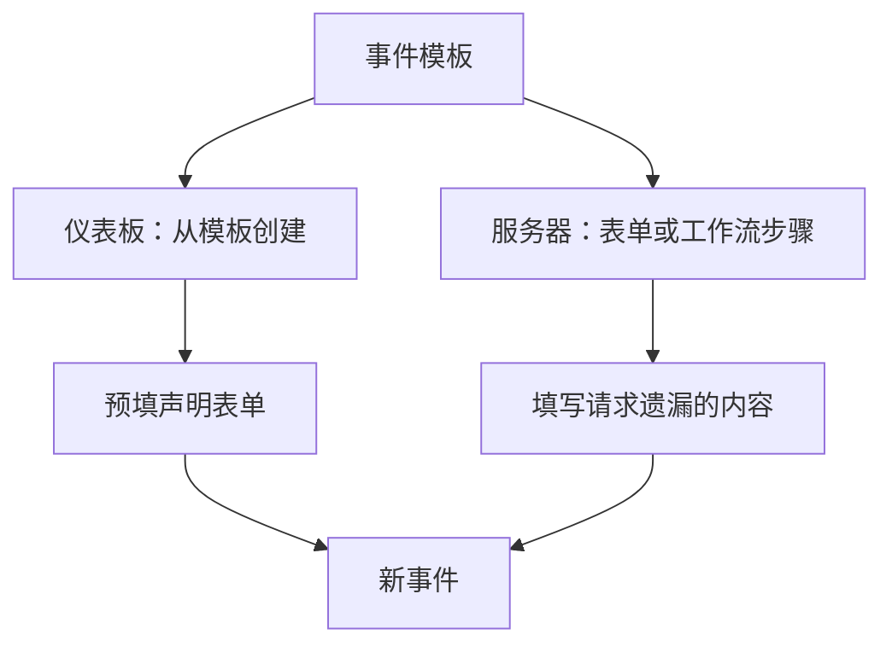
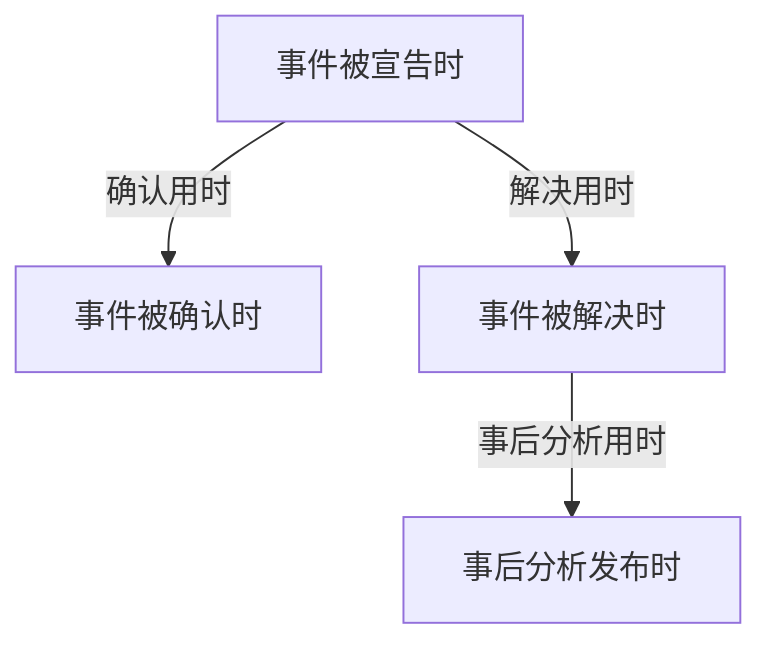
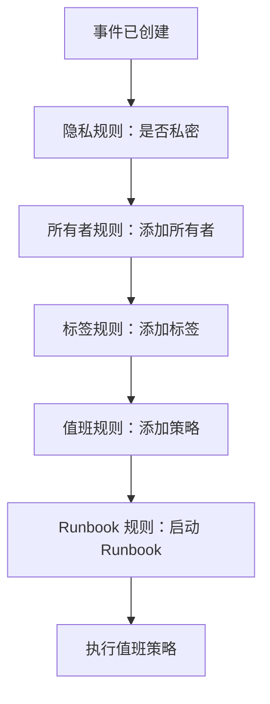

# 事件设置与自动化

事件配置位于 **事件** 之内，而不在 **项目设置** 中：状态和严重性、模板、自定义字段、角色、测量和编号前缀，以及作用于每个新事件的规则。本页是这些页面中每一个的参考，也说明了事件声明那一刻会自动运行的内容。

:::cards
- [事件模板](#事件模板): 每次都以预填好的方式声明同一类事件。
- [自定义字段](#自定义字段): 每个事件上都有你自己的字段，在声明时询问。
- [测量](#测量): 为每个事件计算确认、解决或缓解所用的时间。
- [规则](#事件创建时运行的规则): 自动设置所有者、标签、呼叫和片段。
:::

## 事件设置所在的位置

从顶栏的 **产品** 菜单打开 **事件**，然后展开其侧边菜单底部的 **设置**。**规则** 和 **设置** 都以折叠状态开始，所以要先展开它们，下面的页面才会出现。这里的一切都属于项目范围：模板、角色、自定义字段和规则属于一个项目，并适用于在其中声明的每个事件，路由以 `/dashboard/{projectId}/incidents/settings/` 开头。

| 页面                     | 在这里做什么                                                                                 |
| ------------------------ | -------------------------------------------------------------------------------------------- |
| **事件状态**             | 添加、重命名、改色和重新排序事件所经历的状态。                                               |
| **事件严重性**           | 添加、重命名、改色和重新排序严重性级别。                                                     |
| **事件模板**             | 预先填写整个事件——标题、描述、资源、值班策略、所有者、标签。                                 |
| **备注模板**             | 公开备注和私密备注的可复用文本。                                                             |
| **事后分析模板**         | 可复用的事后分析结构。                                                                       |
| **自定义字段**           | 定义出现在每个事件上的额外字段。                                                             |
| **事件角色**             | 定义你为响应者分配的角色，例如事件指挥官。                                                   |
| **测量**                 | 在每个事件上计算各项事情花了多长时间，比如确认用时或解决用时。                               |
| **已关联警报**           | 选择关联到事件的告警是否随事件一起确认和解决。新项目中两者都开启。                           |
| **编号前缀**             | 事件和片段编号前面的文本，例如 `INC-42` 中的 `INC-`。                                        |

OneUptime AI 自行做的事情不在这里设置：它有自己的部分 **事件 → 人工智能**，路由以 `/dashboard/{projectId}/incidents/ai/` 开头。它的 **设置** 页面可以开关调查新事件、自动修复新事件（在你打开之前保持关闭，修复所附带的修复拉取请求和缺失遥测拉取请求也归在它下面）以及起草事后分析，每个开关一切换就会保存；缩小调查和修复哪些事件范围的调查规则和自动补救规则，以及 AI 工作时遵守的可选限制，都折叠在 **更多设置** 下，在你设置之前都不会生效。旁边是 **洞察** 和 **日志**：AI 从你的事件中学到了什么，以及它做过的一切。参见 [AI SRE](/docs/ai/ai-sre)。

**事件状态** 和 **事件严重性** 在 [事件状态与严重级别](/docs/incidents/states-and-severities) 中有深入介绍——本页其余部分从 **事件模板** 开始。让团队外部的人报告事件的表单是一个独立的产品：参见 [表单](/docs/forms/index)。会自行创建事件的工具，例如 [Huntress](/docs/integrations/huntress)，在 **事件 → 集成** 下设置。

展开 **规则**，你会得到另外八个页面：**分组规则**、**值班规则**、**所有者规则**、**Runbook 规则**、**隐私规则**、**标签规则**、**SLA 规则** 和 **Reminder Rules**。它们在下文中介绍。

## 事件模板

事件模板是一个已保存的事件骨架。与其每次支付集群出问题时都重新输入同样的标题、同样的监视器列表和同样的值班策略，不如保存一次，然后从模板声明。

:::steps
1. 前往 **事件 → 设置 → 事件模板**（`/dashboard/{projectId}/incidents/settings/templates`）。卡片标题为 **事件模板**。
2. 点击 **创建事件 模板**。在 **模板信息** 中为模板命名，然后在 **事件详情** 中填写它要声明的事件：**标题**、**事件严重性** 和 **描述**。
3. 用 **下一步** 走过可选步骤——它影响的资源、它的自定义字段和它的值班策略——填写这类事件共有的内容。
4. 在最后一步点击 **创建事件 模板**。从此，事件列表上的 **从模板创建** 会提供这个模板。
:::

创建模板会引导你完成一个四步向导，当项目有事件自定义字段时还会多两步。只有前两步要求你必须回答：**下一步** 会走过它们之后的可选步骤，**创建事件 模板** 位于最后一步。

- **模板信息** —— **模板名称** 和 **模板描述**。它们命名的是模板本身，从不出现在事件上。
- **事件详情** —— **标题**、**描述**（Markdown）和 **事件严重性**。在 **更多字段** 下（折叠时标题会列出这三项并显示已设置的每一项）：
  - **初始事件状态** —— 从模板声明的事件开始所处的状态。它一开始为空，与声明表单一样，选项按状态顺序列出。如占位符所说，留空时它们从通常的起始状态开始：项目的创建状态，也就是每个新事件开始所处的状态。以某个状态保存的模板会保留该状态。
  - **所有者** —— 拥有从模板声明的事件的人员和团队。**添加所有者** 会打开一个同时包含两者的列表，与事件 **所有者** 页面上的列表相同；每个选择都显示为一个可以移除的标签。现有模板会在 **所有者** 卡片上显示它们。
  - **标签** —— 从模板声明的事件一开始带有的标签。
- **受影响的资源** —— 与声明表单相同：**监视器**，然后是 **将监视器状态更改为**，然后是用于主机、集群和服务的 **其他受影响的资源**，**仅限这些状态页面** 位于 **更多字段** 下。无论是否选择了监视器，模板总会询问 **将监视器状态更改为**：它也适用于从模板声明事件时所选的监视器，声明表单一选中第一个监视器就会显示它。现有模板的 **受影响的资源** 卡片以同样方式询问，并显示模板选择的状态，如果没有选择则显示 **监视器保持当前状态。**。**仅限这些状态页面** 会把从模板声明的事件限定到列出其监视器的部分状态页——一个 `Region East outage` 模板可以带上东部站点的页面。现有模板会在 **状态页面范围** 卡片上显示它，并提供 **编辑状态页面范围**。参见 [每个受众一个状态页](/docs/status-pages/one-status-page-per-audience)。
- **自定义字段** —— 仅当项目有事件自定义字段时：从此模板声明的事件一开始带有的值。这里提供每个字段，而不仅仅是 **详情** 步骤会询问的那些，并且没有一个是必填的。现有模板有一张 **自定义字段** 卡片用于修改它们。
- **创建时的自定义字段** —— 同样仅当项目有事件自定义字段时：从此模板声明事件时，**详情** 步骤询问其中哪些，以及哪些必须填写。现有模板有一张 **创建时的自定义字段** 卡片用于修改它们。参见 [创建时的自定义字段](#创建时的自定义字段)。
- **值班** —— **值班策略**，即从此模板创建的事件被声明时要执行的策略。

几条简单规则：

- 模板列表只显示 **名称** 和 **描述**。无法在列表中编辑或删除行——要修改模板，请打开它（`/dashboard/{projectId}/incidents/settings/templates/{modelId}`）。
- 每个能编辑模板的人都可以更改它的详情和受影响的资源，包括 **初始事件状态** 和 **将监视器状态更改为**：Project Owners、Project Admins 和 Project Members、Incident Admins 和 Incident Members，以及拥有 **Edit Incident Template** 的角色。
- 模板支持 JSON 导入和导出，因此你可以在项目之间移动模板。
- 没有模板时，列表会显示 **未找到事件模板**，其正下方是 **创建事件 模板**。
- 同样在没有模板时，事件列表上的 **从模板创建** 会打开一个 **No Incident Templates** 对话框，说明模板在哪里创建，其中的 **Create Template** 按钮会打开 **事件 → 设置 → 事件模板**。

### 模板如何被应用

有两条路径，它们的合并方式相同。



- **在仪表板中** —— 事件列表上的 **从模板创建** 按钮会打开 **选择事件模板** 选择器，声明页面从查询字符串参数 `incidentTemplateId` 读取模板，然后用模板及其所有者团队和所有者用户预填表单。它的 **详情** 步骤遵循模板的 [创建时的自定义字段](#创建时的自定义字段)。所有者会在事件的 Slack 和 Microsoft Teams 频道存在后成为事件的所有者，且不会收到通知，因此邀请事件所有者加入新频道的通知规则也会邀请他们。
- **在服务器上** —— 带有 **事件 模板** 的 [表单](/docs/forms/on-submit#the-incident-template)，以及选择了 **Incident Template** 的工作流 **Create One Incident** 步骤，会在服务器上从模板声明事件。该步骤以工作流所属项目的 Project Admin 身份读取模板，因此来自其他项目的模板或已被删除的模板会被拒绝；在不包含事件模板的套餐上，该步骤会被拒绝，并说明所需的套餐。与仪表板一样，模板的所有者会成为事件的所有者。参见 [工作流组件](/docs/workflows/components)。

在服务器上声明的事件会把模板记录在 `createdIncidentTemplateId` 中。只有 OneUptime 会设置这一列，用于指定了模板的表单或工作流步骤：API 密钥或已登录用户无法设置，发送 `createdIncidentTemplateId` 的请求会被拒绝。要通过 API 从模板声明，请从 `/api/incident-templates` 读取模板，并在请求中发送它的值。

> [!IMPORTANT]
> 重要的是合并规则：**模板只填写你未定义的字段**。标题、描述、事件严重性、初始事件状态、**将监视器状态更改为** 背后的监视器状态、监视器、主机、Kubernetes 集群、Docker 主机、Podman 主机、服务、值班策略、标签和状态页，只有在调用方或表单什么都没有提供时才会从模板复制。你明确设置的任何内容总是优先，包括状态：指定了状态的事件会从该状态开始，其余一切仍然取自模板，与仪表板一样。自定义字段值逐个字段合并：模板会填写事件声明时缺少的字段，而你设置的值——包括 `0`、`false` 和 `null`——优先于模板的值。

### 创建时的自定义字段

声明事件时 **详情** 步骤询问什么，由项目的设置决定：**创建时显示** 会询问某个字段，**创建时必填** 会让它成为必填。模板可以为从它声明的事件更改这两项。它的 **创建时的自定义字段** 卡片——以及同名的向导步骤——会按 **顺序** 列出每个事件自定义字段，每个字段一个设置：

| 设置           | 从此模板声明事件时                                                                                                                 |
| -------------- | ---------------------------------------------------------------------------------------------------------------------------------- |
| **默认**       | 字段遵循它自己的 **创建时显示** 和 **创建时必填**。选项会说明是哪一种，例如 **默认（必填）**。                                     |
| **必填**       | **详情** 步骤会询问该字段，并且必须填写。是/否字段必须打开。                                                                       |
| **可选**       | 该步骤会询问该字段，可以留空——即使项目要求它也是如此。                                                                             |
| **隐藏**       | 该步骤不询问该字段，即使项目显示或要求它也是如此。模板自身为它设置的值仍然会被应用。                                               |

在卡片上，模板设为 **必填**、**可选** 或 **隐藏** 的字段，还会在其类型下方显示项目对它的处理方式：**项目默认：必填**、**项目默认：可选** 或 **项目默认：不显示**。所有能看到该模板的人都能看到这些。

当某个模板的事件需要其他事件不需要的回答时——比如 `Customer data exposure` 模板上的客户等级——或者要把项目到处都会问的问题从不适合它的模板中去掉时，就可以使用它。

- **以模板变量为键。** 每个设置都存储在字段的 **模板变量** 之下，而它永远不会改变，所以重命名字段会保留它的设置。被删除后又以相同名称重新创建的字段会找回它的设置——这与表单的问题不同，表单按 ID 指代字段，所以被删除后重新创建的字段在重新添加之前不会被询问。
- **编辑和保存会重新读取。** 卡片上的 **编辑** 会重新读取字段和模板的设置，期间对话框中显示加载指示，**保存** 会再读取一次，并且只写入你在其中更改过的字段。因此，另一位管理员在此期间对其他字段所做的更改会被保留——包括他们为你的对话框打开期间创建的字段所做的设置——而你对此期间被删除的字段所做的更改不会被写入。之后卡片会按字段的实际情况列出它们。如果在你点击 **编辑** 时无法读取，对话框会说明原因，并提供 **重试** 而不是 **保存**；如果在你点击 **保存** 时无法读取，它会说明原因，不保存任何内容，并保留你的选择。
- **只有仪表板会应用它们。** 与 **创建时必填** 一样，这些设置只影响 **声明事件** 表单，别无其他。通过 API、工作流、监视器、Slack、Microsoft Teams 或 AI 声明的事件不受它们约束，[表单](/docs/forms/building) 会提出它们自己的问题。参见 [创建时必填只由仪表板检查](#创建时必填只由仪表板检查)。
- **从监视器自定义字段复制的字段**，在事件有监视器时仍然不会被询问，无论模板怎么设置。
- **任何能编辑事件模板的人都可以更改它们** —— 包括 Project Members 和 Incident Members——即使是 Project Admin 为整个项目设为 **创建时必填** 的字段也一样。项目范围的设置本身需要 Project Owner、Project Admin 或 **Edit Incident Custom Field** 权限。
- **它们随模板一起迁移。** 模板的 JSON 导出包含它们，在你导入的项目中，它们适用于具有相同 **模板变量** 的字段。

通过 API，它们是模板的 `customFieldSettings`：一个以每个字段的 **模板变量** 为键的对象，每个字段的值为 `Required`、`Optional`、`Hidden` 或 `Default`。

```json title="customFieldSettings"
{
  "customFieldSettings": {
    "impact": "Required",
    "affected_location": "Optional",
    "additional_information": "Hidden"
  }
}
```

没有列出的字段遵循它自己的设置，与 `Default` 一样。当某个键不是有效的 **模板变量**（小写字母、数字和下划线），或者某个值不是这四者之一时，请求会以 `400` 错误被拒绝。与任何字段都不匹配的键会被保留，但会被忽略。

## 备注模板

备注模板为响应者提供事件更新的现成文本，这样凌晨三点的状态页更新就不必由一个半睡半醒的人从头写起。

:::steps
1. 前往 **事件 → 设置 → 备注模板**（`/dashboard/{projectId}/incidents/settings/note-templates`）。卡片标题为 **事件的公开或私密备注模板**——一个模板库同时服务两种备注。
2. 点击 **创建事件 备注 模板**，填写它唯一的一页：**模板名称** 和 **模板描述**（两者都必填），然后是 **备注** 本身，用 Markdown 编写，同样必填：这是选择该模板时备注一开始的文本。
3. 保存。两个备注页面上的 **模板**，以及 **确认事件** 和 **解决事件** 对话框中的 **选择备注模板**，都会提供这个模板。
:::

与事件模板一样，行是创建和查看的，而不是在列表中直接编辑；要修改模板，请打开它。

**变量。** 备注模板可以包含变量，在选择模板时用事件的值填充，因此作者在发布之前就能看到——并且仍然可以修改——完成后的文本：

| 变量                                | 填充内容                                                           |
| ----------------------------------- | ------------------------------------------------------------------ |
| `{{incident.title}}`                | 事件的标题。                                                       |
| `{{incident.number}}`               | 它的编号，例如 `INC-42` 或 `#42`。                                 |
| `{{incident.severity}}`             | 它的严重性。                                                       |
| `{{incident.state}}`                | 它的当前状态。                                                     |
| `{{incident.startedAt}}`            | 它被声明的时间，按作者的时区显示，并注明时区。                     |
| `{{incident.labels}}`               | 它的标签，以逗号分隔。                                             |
| `{{incident.affectedStatusPages}}`  | 它显示并通知的、作者能看到的状态页。                               |
| `{{incident.customFields.<key>}}`   | 自定义字段的值，按字段的 **模板变量** 指定，**备注** 编辑器会在 **模板变量** 下按字段名称列出。 |

自定义字段以前写作 `{{customFields.<key>}}`；仍然使用这种写法的模板会以同样的方式填充。没有值或不在列表中的变量会原样保留，留给作者填写。值以文本形式放入：在发布的备注中，事件标题不会变成图片、HTML 或隐藏了目标的链接，不过其中的地址仍会显示为指向该地址的链接。**富文本（Markdown）** 自定义字段会按其 Markdown 原样放入。

> [!IMPORTANT]
> 自定义字段、标签和状态页变量会填入你团队自己的记录——每个自定义字段，无论是否标记了 **包含在订阅者通知中**——而且同一个模板库也服务公开备注，公开备注会显示在事件的状态页上，并通过邮件发送给它们的订阅者。发布公开备注之前，请先阅读填充后的文本。

**插入变量。** 你永远不需要手动输入变量名。**备注** 编辑器提供三种插入变量的方式，每种都会把变量放在光标所在的位置：

- **模板变量**，折叠在编辑器下方：展开即可看到每个变量及其填充内容——项目的事件自定义字段按名称列出——点击其中一个即可。
- 编辑器工具栏末尾的 **插入变量**：同样的列表，带有搜索框。
- 在备注中输入 `{{` 会在光标下方打开列表。继续输入以缩小范围，用方向键选择，按 Enter 或 Tab 插入变量；Escape 关闭列表。

同样的列表、按钮和 `{{` 也出现在其他带变量的模板中：SLA 规则的备注提醒、事件或告警分组规则的片段标题和描述、监视器规则的事件和告警描述以及补救备注、SLO 消耗率规则的模板，以及状态页的自定义订阅者通知模板。

备注模板会出现在你真正需要它们的地方：**确认事件** 和 **解决事件** 确认对话框都会在折叠于 **添加公开备注** 之下的 **公开备注** 字段上方提供 **选择备注模板**。公开备注和私密备注有何不同，参见 [事件备注、负责人与动态](/docs/incidents/notes-owners-and-feed)。

## 事后分析模板

事后分析模板是你在事件之后撰写的复盘文档的骨架——你的标题、你的提示、你的固定问题——让项目中的每次复盘都遵循同样的结构。

:::steps
1. 前往 **事件 → 设置 → 事后分析模板**（`/dashboard/{projectId}/incidents/settings/postmortem-templates`）。卡片标题为 **事后分析模板**。
2. 点击 **创建事件 事后分析 模板**，填写它唯一的一页：**模板名称** 和 **模板描述**（两者都必填），然后是正文本身 **事后分析模板**，用 Markdown 编写，同样必填。
3. 保存。现在每个事件的 **事后分析** 页面都会提供 **应用模板**。
:::

模板是从事件上应用的，而不是从设置中。打开一个事件，在其侧边菜单中选择 **事后分析**（`/dashboard/{projectId}/incidents/{incidentId}/postmortem`），然后使用 **应用模板**。这会打开一个带有 **选择模板** 下拉列表的 **应用事后分析模板** 对话框；选择一个模板后，它的正文会载入 **事后分析备注** 编辑器，你在保存之前可以编辑它。事件片段有同样的 **事后分析** 页面，并使用同一个模板库。只有项目中有事后分析模板时才会显示 **应用模板**；如果只有一个，它已经被选中。编辑器会以事件当前的事后分析打开，并把模板作为其备注，因此它是否在状态页上、何时发布以及它的附件都保持原样。

## 自定义字段

自定义字段让你在每个事件上携带自己的元数据——内部服务名称、变更工单引用、客户等级——并在每次声明事件时提出同样的问题，比如影响以及预计何时解决。

:::steps
1. 前往 **事件 → 设置 → 自定义字段**（`/dashboard/{projectId}/incidents/settings/custom-fields`）。页面标题为 **事件自定义字段**，按 **顺序** 列出字段，每个只显示其 **字段名称** 和 **字段类型**。
2. 点击 **创建事件 自定义 字段**，填写它的 **字段名称**、**字段描述** 和 **字段类型**——对于下拉类型，还要在类型下方填写它的选项。
3. 要在每次声明事件时询问该字段，请打开 **更多字段** 并开启 **创建时显示**；如果必须回答，再开启 **创建时必填**。
4. 保存，然后按住手柄把该行拖到字段应该列出的位置。字段行上的 **编辑** 会打开它的其余设置。
:::

创建字段时会在一页上询问它的 **字段名称**、**字段描述** 和 **字段类型**——对于下拉类型，还会在类型下方询问它的选项。新字段的值需要手动输入。其他一切都在 **更多字段** 下，无论创建还是编辑字段，它都以折叠状态开始；折叠时，标题会列出其中的内容并显示已设置的项。要改为创建一个从监视器自定义字段复制值的字段，请打开 **创建事件 自定义 字段** 旁边的 **更多** 菜单（**⋯**），选择 **创建映射的自定义字段**——参见 [从监视器复制的字段](#从监视器复制的字段)。

每个定义包含：

- **字段名称** —— 必填，至少两个字符。占位符建议一个类似 slug 的名称，例如 `internal-service`。
- **字段描述** —— 可选。
- **字段类型** —— 必填。它决定数据如何录入；类型列在下文中。下拉类型还需要列出它们的选项。
- **下拉选项** —— 出现在下拉列表中的值，每个都可以带一个可选的颜色：选项旁边的小按钮显示它的颜色，并打开与其他颜色字段相同的具名颜色，最前面是 **无颜色**，还有用于精确色值的 **自定义颜色**。按住选项行开头的手柄拖动，可以改变它的列出位置。事件已经有值之后，仍然可以添加、重命名和移除选项；参见 [更改下拉选项](#更改下拉选项)。
- **顺序** —— 字段在事件自定义字段中的位置：在事件的 **自定义字段** 页面上、在 **详情** 步骤中，以及在订阅者消息中。没有需要输入的数字：按住字段行开头的手柄上下拖动即可移动它，新字段会添加到末尾。当过滤器或搜索缩小了列表时，无法拖动。
- **创建时显示** —— 位于 **更多字段** 下。从仪表板声明事件时，在 **详情** 步骤中询问该字段（参见 [声明事件](/docs/incidents/declaring-incidents)）。事件模板可以为任何字段设置初始值，无论它在创建时是否显示，并且可以为从它声明的事件询问或略去某个字段——参见 [创建时的自定义字段](#创建时的自定义字段)。[表单](/docs/forms/building#custom-fields) 不遵循它：表单只询问添加到其中的字段。
- **创建时必填** —— 位于 **更多字段** 下，在 **创建时显示** 开启后提供。在该字段填写之前，**详情** 步骤不允许你声明事件，**布尔值** 字段必须打开。只有仪表板会检查这一点；参见 [创建时必填只由仪表板检查](#创建时必填只由仪表板检查)。
- **包含在订阅者通知中** —— 位于 **更多字段** 下。随事件的消息把该字段及其值发送给状态页订阅者：默认的电子邮件、Slack 和 Microsoft Teams 消息以及 webhook，但不包括短信。订阅者通常在你的团队之外，所以只对可以安全共享的字段开启它。参见 [订阅者与公告](/docs/status-pages/subscribers#事件)。
- **模板变量** —— 模板访问该字段所用的键，`{{incident.customFields.<key>}}`，用于备注模板和自定义订阅者通知模板。它在字段创建时由字段名称生成——小写字母、数字和下划线，所以 `Expected Resolution` 会变成 `expected_resolution`，当另一个字段已经使用该键时会追加 `_2`、`_3` 等——并且在字段重命名时不会改变。没有人手动设置它：API 会忽略为它发送的值。用较旧的 `{{customFields.<key>}}` 编写的模板仍然有效。你永远不需要去查它：放置它的编辑器——备注模板的 **备注**，以及状态页针对事件类事件的自定义订阅者通知模板——会在 **模板变量** 下按字段名称列出每个字段的变量。字段的 **编辑** 表单也会在 **更多字段** 底部以只读方式显示它，并带有一个复制按钮。

**顺序**、**创建时显示**、**创建时必填**、**包含在订阅者通知中** 和 **模板变量** 只存在于事件自定义字段上。监视器、告警、计划维护事件和其他资源的自定义字段没有这些。

定义存放在它们自己的模型中；值存放在事件本身的 `customFields` 列中。在单个事件上，你可以在事件侧边菜单的 **自定义字段**（`/dashboard/{projectId}/incidents/{incidentId}/custom-fields`）中填写它们，那里的字段按 **顺序** 列出。事件模板在它们自己的 `customFields` 中保存相同字段的值。

**一个值得了解的缺口。** 事件自定义字段定义是事件家族中唯一没有工作流触发器的部分——参见下文的工作流部分。

### 字段类型

| 字段类型                                   | 录入方式                                              | 适用于                                             |
| ------------------------------------------ | ----------------------------------------------------- | -------------------------------------------------- |
| **文本**                                   | 一行文本                                              | 变更工单引用、内部服务名称                         |
| **数字**                                   | 一个数字                                              | 以分钟计的预计时长、受影响的用户数                 |
| **布尔值**                                 | 是/否开关                                             | 一项确认、“面向客户”                               |
| **下拉列表（单选）**                       | 从列表中选一个选项                                    | 影响、区域                                         |
| **下拉列表（多选）**                       | 从列表中选多个选项                                    | 受影响的系统                                       |
| **日期**                                   | 一个日期                                              | 合同续签日期                                       |
| **日期和时间**                             | 一个日期和一天中的时间                                | 预计解决时间                                       |
| **长文本**                                 | 多行纯文本                                            | 受影响的用户或系统、补充信息                       |
| **富文本（Markdown）**                     | 带格式的文本，在带可视模式的 Markdown 编辑器中录入    | 带有链接和列表的临时解决方案                       |

**长文本** 和 **富文本（Markdown）** 可用于每种资源的自定义字段，而不仅仅是事件。富文本值按其编写时的 Markdown 存储。没有单选按钮或复选框组类型：请使用 **下拉列表（单选）**、**下拉列表（多选）** 或 **布尔值**。

### 创建时必填只由仪表板检查

**创建时必填** 只会拦住 **声明事件** 表单，别无其他。由监视器、API、Slack、Microsoft Teams 或 AI 打开的事件无法填写表单，所以它们创建时该字段为空。事件一旦存在，它的 **自定义字段** 页面上每个字段都保持可选，所以在故障中途修正一个值的响应者，绝不会被要求填写其他所有字段。请把它当作对声明事件的人的提示，而不是保证每个事件都有值。

模板的 [创建时的自定义字段](#创建时的自定义字段) 也是一样：它们只影响 **声明事件** 表单，别无其他。[表单](/docs/forms/building#required-questions) 是例外，因为服务器会在表单提交时检查表单的 **必填** 问题。

### 从监视器复制的字段

自定义字段可以从事件监视器的某个自定义字段中取值，而不必手动输入——比如你的监视器已经记录的区域或客户等级。要创建这样的字段，请打开 **创建事件 自定义 字段** 旁边的 **更多** 菜单（**⋯**），选择 **创建映射的自定义字段**。它会询问三项：

- **监视器字段** —— 要复制的监视器自定义字段。每一个都会被提供，各自在名称下方显示其类型。新字段会获得该类型以及下拉列表的选项，因此两者始终一致。
- **字段名称** —— 一开始为监视器字段的名称，直到你输入别的名称。
- **字段描述** —— 可选。

当事件带着监视器创建时会填入该值，并在监视器的值变化时保持更新。当事件的多个监视器持有不同的值时，单值字段保持不变，多选字段则获得所有值。复制永远不会清除值：没有监视器的事件会保留手动输入的内容，清除监视器的值也不会影响副本。事件有监视器之后，**详情** 步骤不会询问被复制的字段。

要让现有字段的值从监视器复制、更改它复制哪个监视器字段，或者改回手动输入，请打开字段行上的 **编辑**，使用 **更多字段** 下的 **值映射自**。告警和计划维护的自定义字段也可以用同样的方式从它们的监视器复制。

### 通过 API 设置自定义字段值

在 `POST /api/incident` 和事件更新中，`customFields` 是一个以每个字段的 **字段名称** 为键的对象：

```json title="customFields"
{
  "customFields": {
    "Impact": "Major",
    "Estimated Duration": 90,
    "Acknowledgement": true,
    "Expected Resolution": "2026-10-01T14:30:00.000Z"
  }
}
```

当用户或 API 密钥创建或更新事件时，请求设置或更改的每个值都必须符合其字段，否则请求会以 `400` 错误被拒绝，并指明字段以及发送的值：

| 字段类型                                                               | 接受的值                                                       |
| ---------------------------------------------------------------------- | -------------------------------------------------------------- |
| **文本**、**长文本**、**富文本（Markdown）**                           | 文本。数字、`true` 或 `false` 按发送时的样子存储。             |
| **数字**                                                               | 一个数字，或者是数字的文本，例如 `"42"`。                      |
| **布尔值**                                                             | `true` 或 `false`，或者文本 `"true"` 或 `"false"`。            |
| **日期**、**日期和时间**                                               | 一个日期，最好是 ISO 8601 文本。                               |
| **下拉列表（单选）**                                                   | 它的一个选项。                                                 |
| **下拉列表（多选）**                                                   | 它的选项列表，或者单独的一个选项。                             |

对于 **下拉列表（多选）**，拒绝消息会列出前 10 个不在其选项中的条目，以及还有多少个。

为了让现有集成继续工作，以下内容不做检查：

- **请求保持不变的值。** 当你保存其中一个值时，**自定义字段** 卡片会把所有值一起发回，所以在这些检查出现之前存储的值，或之后被移除的下拉选项，永远不会阻止你保存其他值。多选字段会保留它已有的条目。
- **不是事件自定义字段名称的键**，例如 [Jira 集成](/docs/integrations/jira) 写入的 `jiraIssueKey`。
- **空值。** `null` 或空字符串会清除字段。
- **从监视器自定义字段复制的值**，以及 OneUptime 自己进行的写入。
- **创建时必填。** API 从不要求填写字段。

表单或工作流的 **Create One Incident** 步骤从模板声明的事件（`createdIncidentTemplateId`）会以模板的自定义字段值开始，逐个字段合并在它所发送的值之下（参见 [模板如何被应用](#模板如何被应用)）。API 密钥不能从模板声明：发送 `createdIncidentTemplateId` 的请求会被拒绝。

### 重命名字段

值存储在字段名称之下，所以重命名字段必须移动它们。当你保存新的 **字段名称** 时，OneUptime 会在项目的每个事件和每个事件模板上把该字段的值移到新名称之下，并更新显示该字段或按其过滤的事件列表已保存视图。这次移动不会启动任何 **On Update Incident** 工作流，也不会改变任何事件的最后更新时间。字段的 **模板变量** 保持不变，因此使用它的备注模板、自定义订阅者通知模板和 webhook 集成会继续工作。

有两种重命名会被拒绝：重命名为另一个事件自定义字段已有的名称（比较时不区分大小写），以及会同时重命名多个字段的 API 请求。按字段旧名称读写值的工作流和 API 客户端需要改用新名称。

重命名之后，字段只持有它自己的值。删除字段会把它的值留在曾经拥有这些值的事件上，因此事件上可能仍然在新名称下持有来自已删除字段的值；重命名会清除这些值，而不是把它们显示为此字段的回答或发送给订阅者。所有事件和模板会一起移动：如果移动失败，它们都不会改变，字段保留旧名称，保存会报告错误，你只需重试即可。以已删除字段的名称 **新建** 的字段则不同：它会显示那个字段留下的值，并在开启 **包含在订阅者通知中** 后把它们发送给订阅者。

删除字段会把询问它的问题留在项目的每个 [表单](/docs/forms/building#custom-fields) 上，但这些问题不再被询问：表单构建器会把每个这样的问题标记出来，供你删除。以相同名称重新创建的字段是一个新字段，在有人把它添加到表单之前，表单不会询问它。事件模板会保留它们针对该字段的 **创建时的自定义字段** 设置。

### 更改下拉选项

**下拉列表（单选）** 或 **下拉列表（多选）** 字段的选项可以随时更改：打开字段行上的 **编辑**。事件存储的是它被赋予的选项的文本，所以一次更改对拥有某个选项的事件有什么影响，取决于更改的类型：

| 你对选项做的操作                    | 拥有该选项的事件会怎样                                                                                             |
| ----------------------------------- | ------------------------------------------------------------------------------------------------------------------ |
| **添加** 一个                       | 没有影响。从现在起它会作为选项提供。                                                                               |
| **重命名** 它（更改其文本）         | 它们显示新名称。在选项下方，表单会说明有多少个事件会这样变化。                                                     |
| **移除** 它（旁边的垃圾桶）         | 它们保留该值，显示为 _不再是选项_，除非你在 **不再是选项的值** 下为它们选择另一个选项。                            |
| 按住手柄 **拖动** 它                | 没有影响。只有选项的列出顺序会改变。                                                                               |

表单打开时会统计每个值有多少个事件拥有。**不再是选项的值** 会列出你移除的、仍有事件拥有的每个选项，以及事件拥有的、从来不是选项的每个值（比如通过 API 写入的值），每个都附上拥有它的事件数量。对每一个，你可以保持原样，或者选择这些事件应当改用的选项。**撤销** 会恢复你误删的选项。

保存时，被重命名的选项以及你为其选择了选项的值会被移动：在项目的每个事件和事件模板上，在按其过滤的事件列表已保存视图中，以及在 [表单模板](/docs/forms/building) 为该字段给出的回答中。与重命名字段一样，这次移动不会启动任何 **On Update Incident** 工作流，也不会改变任何事件的最后更新时间；如果失败，不会移动任何内容，字段保留旧的选项。按旧文本写入选项的工作流、API 客户端和 Terraform 配置需要改用新文本。

如果事件的值不再是其字段提供的选项，它会在事件的 **自定义字段** 页面和事件列表中显示该值，并标记为 _不再是选项_。编辑它的其他字段会保留该值；要更改它，请选择另一个选项。

其他每种资源的自定义字段也以同样的方式工作：监视器、告警、计划维护事件、状态页、值班策略、团队、团队成员和库存项目。重命名或添加监视器字段的选项，会对复制它的事件、告警和计划维护字段做同样的处理（参见 [从监视器复制的字段](#从监视器复制的字段)），因此它们会继续提供所复制的每个值。

通过 API，把新列表作为 `dropdownOptions` 发送，把重命名放在 `miscDataProps` 中：

```json
{
  "data": { "dropdownOptions": "Facility Alpha\nFacility B" },
  "miscDataProps": {
    "renamedDropdownOptions": [{ "from": "Facility A", "to": "Facility Alpha" }]
  }
}
```

每个 `to` 都必须是字段保存后的选项之一，每个 `from` 只能重命名一次。没有 `renamedDropdownOptions` 时，列表会改变，而每个已存储的值保持原样，在 Terraform 中更改 `dropdown_options` 时也是如此。

### Terraform

这些设置位于 `oneuptime_incident_custom_field` 资源上，分别为 `sort_order`、`show_on_create`、`is_required_on_create` 和 `include_in_subscriber_notifications`。`variable_key` 是只读的：它是字段创建时 OneUptime 生成的键。

省略 `sort_order` 时，新字段会排到列表末尾。给它一个另一个字段已经使用的数字，它会占据那个位置，挡在中间的字段依次后移一位。没有其他字段使用的数字会按你写的样子保留。

## 测量

测量是事件中两个时刻之间的时间。**确认用时** 是从事件被声明到有人确认它的时间；**解决用时** 从声明一直算到解决。测量只需设置一次，OneUptime 就会为每个事件——包括过去的事件——计算它并绘制成图表，让你看出团队是否越来越快。

前往 **事件 → 设置 → 测量**（`/dashboard/{projectId}/incidents/settings/measurements`），选择 **创建Incident Measurement**。每个定义都有一个 **名称**、一个 **起点** 和一个 **终点**。它永久的 **键** 会在你输入名称时由名称生成——“Time to Detect”得到 `time-to-detect`——所以没有需要填写的内容。要自己选择键，请在创建测量之前选择它旁边的 **编辑**。



告警和计划维护事件也有同样的功能，位于 **警报 → 设置 → 测量** 和 **计划维护 → 设置 → 测量**。下文的一切都适用于这三者，各自使用自己的时刻。

### 现成的测量

表单以 **您想测量什么？** 打开。选择其中一项，它的名称、描述和两个时刻都会被填好：**下一步** 会显示这些时刻，测量从最后这一步创建。

| 位置                      | 测量                                   | 开始于                                            | 结束于                                 |
| ------------------------- | -------------------------------------- | ------------------------------------------------- | -------------------------------------- |
| 事件                      | **确认用时**                           | 事件被宣告时                                      | 事件被确认时                           |
| 事件                      | **解决用时**                           | 事件被宣告时                                      | 事件被解决时                           |
| 事件                      | **事后分析用时**                       | 事件被解决时                                      | 事后分析发布时                         |
| 告警                      | **确认用时**                           | 警报创建时                                        | 警报被确认时                           |
| 告警                      | **解决用时**                           | 警报创建时                                        | 警报被解决时                           |
| 计划维护                  | **开始延迟**                           | 维护计划开始时                                    | 维护开始时                             |
| 计划维护                  | **超时**                               | 维护计划结束时                                    | 维护结束时                             |
| 计划维护                  | **维护时长**                           | 维护开始时                                        | 维护结束时                             |

选择 **其他** 可以自己挑选两个时刻。选择其中某一项时，你已经输入的名称会被保留。

### 选择两个时刻

第二步 **开始和结束** 有 **开始于** 和 **结束于**。每一项都用通俗的语言列出测量可以开始或结束的时刻。新测量从事件被声明时开始，所以大多数时候你只需要选择它在哪里结束。

| 时刻                                              | 何时发生                                                                     | 在 API 中的存储方式                                   |
| ------------------------------------------------- | ---------------------------------------------------------------------------- | ----------------------------------------------------- |
| **事件被宣告时**                                  | 事件在 OneUptime 中开始的时间：即它被创建的时间，除非有人设置了更早的时间。  | `Declared At`（`Timeline Start` 是同一时刻）          |
| **事件被确认时**                                  | 它到达你的确认状态或其后任一状态的时间（从一开始直接解决也算）。             | `State Role Entered`，角色 `Acknowledged`             |
| **事件被解决时**                                  | 它到达你的解决状态的时间。                                                   | `State Role Entered`，角色 `Resolved`                 |
| **事后分析发布时**                                | 事件的事后分析被发布的时间。                                                 | `Postmortem Posted At`                                |
| **事件进入您选择的状态时**                        | 你的任一事件状态。表单随后会询问是哪一个。                                   | `State Entered`，附带该状态                           |
| **影响开始**                                      | 客户最初受到影响的时间——见下文。                                             | `Impact Started At`                                   |
| **事件进入其第一个状态时**                        | 它到达新事件开始所处状态的时间，例如 Identified。                            | `State Role Entered`，角色 `Created`                  |
| **事件在 OneUptime 中创建时**                     | 通常与它被声明是同一时刻。                                                   | `Created At`                                          |

告警从 **警报创建时** 开始，没有事后分析；计划维护在 **维护开始时**、**维护结束时** 和 **维护完成时** 之外，还增加了计划窗口 **维护计划开始时** 和 **维护计划结束时**。

到达 **已确认** 或 **已解决** 取决于扮演该角色的状态，所以即使你重命名或替换了状态，它也能继续工作。**你选择的状态** 则固定于那一个状态。

### 更多字段

大多数测量从不需要更改的几个选项，折叠在 **开始和结束** 步骤末尾的 **更多字段** 下，并设为 API 也使用的默认值。折叠时，标题会列出它们并显示已更改的项。

- **如果开始发生不止一次** 和 **如果结束发生不止一次** 会针对到达某个状态的时刻出现。重新打开的事件可能会再次到达同一个状态。**使用第一次** 是默认值，与内置的事件计时一致；**使用最后一次** 则跟随重新打开的事件直到它最后一次经过。
- **时长显示单位** 是测量的图表所使用的单位。**自动** 是默认值：它按秒记录，图表会随着数字增大显示为秒、分钟、小时或天。**分钟**、**小时** 或 **天** 会让图表保持一个单位。每个数据点都以你选择的单位写入，更改单位会以新单位重写测量的数据点。
- **图表汇总** 是 **查看图表** 汇总多个事件的方式：默认是 **平均值**，也可以是 **中位数**、第 90、95 或 99 百分位数、**最长** 或 **最短**。
- **在事件页面上显示** 会把测量放进每个事件页面上的 **测量** 卡片中（见下文）。它默认开启；对于只想用图表展示的测量，可以关闭它。告警和计划维护中它分别叫 **在警报页面上显示** 和 **在维护事件页面上显示**。

编辑测量时会多出一个 **已启用** 开关：关闭它即可停止测量事件。已经记录的数字会被保留。

### 测量报告什么

| 状态               | 含义                                                                                      |
| ------------------ | ----------------------------------------------------------------------------------------- |
| **Recorded**       | 两个时刻都已发生。时长记录在事件上，并绘入图表。                                          |
| **待处理**         | 某个时刻尚未发生，但仍可能发生——事件仍未解决。                                            |
| **Not Applicable** | 某个时刻永远不会发生——状态被跳过了，或者时间从未被记录。                                  |
| **Invalid**        | 两个时刻都已发生，但结束早于开始。你记录的时间相互矛盾。                                  |

只有 **Recorded** 的值会成为图表上的数据点。被跳过的时刻什么都不写入，而不是写入零，所以它不会把平均值拉低。

**Invalid** 是值得关注的状态。当计算测量所依据的时间线有误时——例如结束比开始早 17 分钟——测量就会显示这个状态。这样做是有意的，比一个没人会质疑的看似合理的数字更显眼。

### 在每个事件的页面上

每个事件的页面会在 **事件详情** 正下方的 **测量** 卡片中显示它自己的测量，顺序与本设置页面上的列表相同。每一项都会说明它测量的是什么——**已声明 → 已确认**——以及它在此事件上的读数：

| 读数                                  | 何时出现                                                                                                                         |
| ------------------------------------- | -------------------------------------------------------------------------------------------------------------------------------- |
| 一个时长，例如 **4 分钟**             | 两个时刻都已发生（**Recorded**）。它以测量的单位显示：**自动** 的读法与页面上其他计时一样，为 **1 小时5 分钟**；**小时** 则读作 **1.5 小时**。 |
| **已进行 12 分钟**                    | 计时已经开始，而结束尚未发生。页面打开时它会持续递增。                                                                           |
| **尚未开始**                          | 开始尚未发生，或者是一个还在未来的时间，例如维护事件的计划开始时间。                                                             |
| **未达到**                            | 事件已解决，而测量等待的时刻始终没有到来——例如一个没有被确认就被解决的事件。                                                     |
| **未测量**                            | 某个时刻永远不会发生（**Not Applicable**），并附上原因，例如被跳过的状态。                                                       |
| **结束早于开始**                      | 记录的时间相互矛盾（**Invalid**），并附上两者相差多少。                                                                          |
| **尚未计算**                          | OneUptime 还没有为此事件计算它，例如刚创建测量之后。                                                                             |

更改了开始或结束的测量，会在每个事件上继续显示旧值，直到 OneUptime 重新计算它，图表也是如此。从事件页眉更改状态之后，卡片会在 OneUptime 计算出新值后立即显示它们，通常是马上。

告警和计划维护事件的页面上也有同样的卡片。对于维护事件，**未达到** 会在事件结束后出现。当没有任何已启用的测量开启 **在事件页面上显示** 时，或者对于无权读取测量的人，卡片不会显示。

### 影响开始时间，以及它为何为空

**影响开始时间** 是事件以及告警上的一个字段。它默认为空，OneUptime 从不填写它。它由询问影响何时开始的事件表单记录（参见 [表单](/docs/forms/index)），或者通过 API 记录。在它被记录之前，以 **影响开始** 为开始或结束的测量在该事件上没有数字。

这正是关键所在。`Declared At` 记录的是 OneUptime 得知的时间，对于由监视器触发的事件，这是条件被处理的时间——而不是影响开始的时间。如果“Time to Detect”的开始默认使用与其结束相同的时间戳，每个事件都会报告零，图表会显示“我们能即时发现问题”。一个空字段和一个 **Not Applicable** 的测量说的才是真话：没有人记录这件事是何时开始的。

### 修正错误的时间戳

每当其底层数据发生变化时——状态时间线条目被创建、编辑或删除，或者事件上的 `Impact Started At`、`Declared At` 或 `Postmortem Posted At` 被修正——每项测量都会从头重新计算。没有任何增量修补，所以不存在需要修复的过时值。

状态时间线条目上的 **开始** 字段是可编辑的。如果事件是在 09:12 被确认的，而条目写的是 09:29，修正这个条目，由它推导出的每项测量都会随之移动。

### 图表、API 和 Terraform

在测量上选择 **查看图表**，会在指标浏览器中打开它过去一个月的图表，按它自己的方式汇总。每个已启用的测量都会写入一个名为 `oneuptime.incident.measurement.<key>` 的指标，你也可以把它添加到任何仪表板。告警使用 `oneuptime.alert.measurement.<key>`，计划维护使用 `oneuptime.scheduled-maintenance.measurement.<key>`。列表的 **键** 列默认隐藏，显示每个测量的键。

定义是普通的 API 资源，所以 Terraform 提供程序以 `oneuptime_incident_measurement`、`oneuptime_alert_measurement` 和 `oneuptime_scheduled_maintenance_measurement` 管理它们。计算出的值是只读的，以数据源的形式提供。省略时，**更多字段** 下的选项采用与仪表板相同的默认值：`unit` 为 `seconds`（或 `minutes`、`hours`、`days`），`aggregation_type` 为 `Avg`（或 `P50`、`P90`、`P95`、`P99`、`Max`、`Min`），`start_state_occurrence` 和 `end_state_occurrence` 为 `First`（或 `Last`）。`show_on_incident_view`（`show_on_alert_view`、`show_on_scheduled_maintenance_view`）为 `true`。

**键** 是永久的，因为它是指标名称的一部分——更改它会让时间序列成为孤儿。你可以随意重命名测量；键保持不变。

通过 API 和 Terraform 也可以省略键：它由名称生成，当项目中另一个测量已经使用该键时会追加 `-2`、`-3` 等。你发送的键会按你写的样子保留。它必须由小写字母、数字和连字符组成，以字母或数字开头，最多 50 个字符，并且项目中不能有其他测量使用它。

### 从其他事件平台迁移

如果你来自一个使用声明式测量定义的工具，它们可以直接对应过来：

| 原平台的测量            | 在这里的设置方式                                                                                    |
| ----------------------- | --------------------------------------------------------------------------------------------------- |
| Time to Detect          | **其他**：**影响开始** → **事件被宣告时**                                                           |
| Time to Acknowledge     | 现成的 **确认用时**                                                                                 |
| Time to Mitigate        | **其他**：**事件被宣告时** → **事件进入您选择的状态时**，选择你添加在已确认和已解决之间的 **Mitigated** 状态 |
| Time to Resolve         | 现成的 **解决用时**                                                                                 |

Time to Mitigate 需要一个默认不存在的状态。在 **事件 → 设置 → 事件状态** 中添加它——新状态会被添加在解决状态的正上方，你可以把它拖到其他状态之间的任何位置。

> [!NOTE]
> **关于历史数据需要知道的一点。** 你今天创建的测量也会在后台为过去的事件计算：每个事件上的值以及它在图表上的数据点。更改测量的开始或结束位置，或者它的单位，会为每个事件重新计算。要保留旧的数字，请改为创建一个新的测量。

## 事件角色

事件角色是你在响应期间分配给人员的具名职责。在 **事件 → 设置 → 事件角色**（`/dashboard/{projectId}/incidents/settings/roles`）中定义它们。表格列出每个角色的名称和描述。

新项目一开始有一个角色 **事件指挥官**，即负责响应的人。OneUptime 会替你填补它：当你从仪表板声明事件而没有为该角色选择任何人时，你就成为它的事件指挥官；一个仍然没有事件指挥官的事件，会由第一个更改其状态的人担任，除非此人已经在该事件上担任其他角色。事件指挥官可以重命名，但不能删除，并且始终由一个人担任。它的 **删除** 是锁定的，并说明原因。

用 **创建事件 角色** 添加团队使用的其他角色，例如 Responder、Communications Lead 或 Scribe。表单只有一页：名称和描述，然后是折叠的 **更多字段**，其中有 **允许多个用户**、角色的图标和颜色。新角色的颜色已经选好，是列表中的角色尚未使用的颜色，图标是可选的，所以只有在要更改它们时才需要打开 **更多字段**。除非你开启 **允许多个用户**，否则每个事件中一个角色由一个人担任。由较早版本的 OneUptime 创建的项目一开始还有 Responder、Communications Lead 和 Observer。在你删除它们之前，它们会一直保留。

角色只是定义。你在每个事件上为它们分配人员——声明向导会在其 **值班和角色** 步骤中通过 **分配事件角色** 字段询问，每个事件的侧边菜单中都有一个 **角色** 页面。监视器的条件和事件分组规则可以提前为它们挑选人员。所有这些表单都用同样的卡片询问，每个角色一张：带有 **主要** 标记的角色是事件指挥官或另一个主要角色，只由一人担任的角色在选定人员后会去掉它的选择器。在事件的 **角色** 卡片上，可由多人担任的角色会提供 **Add More**。

## 编号前缀

每个事件都会从项目级计数器获得一个编号。没有前缀时显示为 `#42`；有前缀时显示为 `INC-42`。如果你的团队会把“INC-42”说出口，就让产品也这么说。新项目一开始事件使用 `INC-`，事件片段使用 `IE-`。

前往 **事件 → 设置 → 编号前缀**（`/dashboard/{projectId}/incidents/settings/number-prefix`）。**编号前缀** 卡片有一行 **事件** 和一行 **事件 片段**。每行显示它的前缀以及它生成的编号示例：`INC-`，然后是 **示例：** `INC-42`。没有前缀的项目显示 **无前缀** 和 `#42`。

:::steps
1. 点击 **更新**。**编辑编号前缀** 对话框会打开，其中有两个字段：**事件编号前缀**（占位符 `INC-`）和 **事件片段编号前缀**（占位符 `IE-`）。
2. 输入前缀。在每个字段下方，**预览：** 会在你输入时显示编号，因此你在保存 `OPS-` 之前就能看到 `OPS-42`。把字段留空即可恢复为 `#`。
3. 点击 **保存更改**。此后创建的事件和片段会使用新前缀。
:::

前缀：

- 最多 20 个字符；
- 使用字母（任何文字）、数字以及 `-` `_` `.` `/` `:` `#`——不能有空格，也不能有任何会被 Markdown、Slack 或 HTML 当作格式的内容；
- 不能以数字结尾，否则会与编号连在一起：`SEV1` 会让事件 42 变成 `SEV142`。

对话框会在你保存之前说明哪里有问题，API 也会拒绝同样的前缀。前缀两侧的空格会被去掉。

**新前缀会改变什么。** 只有在你保存之后创建的事件和片段才会使用新前缀。每个现有的事件都保留它被赋予的编号：带前缀的值作为 `incidentNumberWithPrefix` 存储在事件上，事件列表、事件页眉、通知以及事件的 Slack 和 Microsoft Teams 频道名称都使用它。计数器会继续：如果上一个事件是 `INC-41`，而你改用 `OPS-`，下一个就是 `OPS-42`。

Project Owners、Project Admins 和任何拥有 **Edit Project** 的人都可以更改前缀。其他所有人看到的前缀旁的 **更新** 按钮是锁定的。

告警和计划维护事件有同样的页面：用于告警和告警片段编号的 **警报 → 设置 → 编号前缀**（新项目中为 `ALT-` 和 `AE-`），以及用于维护事件编号的 **计划维护 → 设置 → 编号前缀**（`SM-`）。在这三者中，旧的 **更多设置** 地址（`…/settings/more`）仍然有效，并会打开 **编号前缀**。

## 关联告警开关

把告警关联到事件本身永远不会改变它们的状态。**事件 → 设置 → 已关联警报**（`/dashboard/{projectId}/incidents/settings/linked-alerts`）的 **已关联警报** 卡片上的两个项目开关，让事件带着它的关联告警一起推进：

- **事件确认时确认已关联的警报** —— 确认事件会确认每一个尚未确认的关联告警，从而停止这些告警的值班升级。
- **事件解决时解决已关联的警报** —— 解决事件会解决每一个尚未解决的关联告警，但仍关联着另一个尚未解决的事件的告警除外。

两者在新项目中都开启；在它们默认开启之前创建的项目会保留原来的设置。每个都是一切换就会保存的开关。只有 Project Owners 和 Project Admins 可以更改它们；对其他所有人，开关是锁定的，并会说明需要什么权限。状态按顺序比较，所以自定义状态也会被考虑；告警永远不会倒退，重新打开事件不会重新打开它的告警，而关联到一个已经确认或解决的事件的告警，会在关联时被同步。打开一个开关，就是把关联告警的状态交给事件：任何能改变事件状态的人，或者能把告警关联到一个已经确认或解决的事件的人，都会同时推动这些告警，而无需编辑告警的权限。[关联的告警](/docs/incidents/linked-alerts) 中有完整的规则，包括为什么解决一个其监视器仍在失败的告警，会让监视器再产生一个新的告警。

## 事件创建时运行的规则

**事件 → 规则** 包含八个规则引擎，**事件 → 人工智能 → 设置** 的 **更多设置** 下还有两个：**自动补救规则** 和 **调查规则**。它们都做同一件事——在事件创建的那一刻查看它，如果匹配就采取行动——但它们所做的事情不同，多条规则同时匹配时的处理方式也不同。



分组、SLA、提醒、调查和自动补救规则也会各自作用于新事件：参见下文的各条规则。

- **分组规则** —— 把相关事件归入片段。规则从列表顶部往下依次评估；拖动规则可以改变它的位置。下文有详细介绍。
- **值班规则** —— 为匹配的事件执行值班策略。下文有详细介绍。
- **所有者规则** —— 自动指派所有者。
- **Runbook 规则** —— 当事件匹配时启动一个 [Runbook](/docs/runbooks/index)。
- **自动补救规则**，位于 **人工智能** → **设置** 下 —— 在 **自动修复新事件** 开启时，修复哪些新事件以及如何修复：由 OneUptime AI 修复还是用规则的 Runbook 修复，修复前是否询问。没有规则时，每个新事件都会被修复。如果事件有排队中的 AI 调查，它们会在调查完成后运行，并带上调查的分析结果。
- **调查规则**，位于 **人工智能** → **设置** 下 —— OneUptime AI 调查哪些新事件。没有规则时，每个都会被调查。参见 [AI SRE](/docs/ai/ai-sre)。
- **隐私规则** —— 决定匹配的事件是否为私密。
- **标签规则** —— 自动添加标签。
- **SLA 规则** —— 跟踪响应时间和解决时间。规则从列表顶部往下依次评估；拖动规则可以改变它的位置。
- **Reminder Rules** —— 在事件仍未解决时定期提醒事件所有者。规则从列表顶部往下依次评估，第一条匹配的规则胜出；拖动规则可以改变它的位置。当事件的严重性或标签发生变化，或者其 **发送提醒** 开关被切换时，事件的规则会重新匹配，到下一次提醒的等待也会重新开始。保存事件已有的严重性和标签——每次保存 **事件详情** 卡片都会发送它们——不会改变它的下一次提醒。告警也以同样的方式工作。

> [!IMPORTANT]
> **顺序语义并不统一。** 分组规则、SLA 规则和 Reminder Rules 按顺序评估，它们的列表通过拖动来排序：新规则会添加到末尾。值班规则则不是——每条匹配的规则都会触发。不要假设一种模型适用于全部十种规则。

**值班规则**、**所有者规则**、**标签规则** 和 **隐私规则** 页面带有选项卡——一个 **Incident Rules** 选项卡和一个 **Episode Rules** 选项卡，各有自己的表格。除非你特别针对片段，否则请配置 **Incident Rules** 选项卡。**分组规则**、**Runbook 规则**、**自动补救规则**、**调查规则**、**SLA 规则** 和 **Reminder Rules** 都是单个表格。

所有者、标签和隐私规则只作用于规则存在之后创建的事件和片段。要把其中某条规则应用到已经存在的事件上，请在规则所在行、规则自己的页面或表格的批量操作中使用 **Run Now**——参见 [对现有资源运行规则](/docs/configuration/run-rules-now)。值班、Runbook、自动补救、调查、分组、SLA 和提醒规则不能针对现有事件运行。

**新规则以开启状态开始。** 创建规则时不会询问是否启用：它以启用状态开始，与通过 API 或 Terraform 创建的规则完全一样，表单上的其他每个开关也都按 API 会存储的方式开始——例如所有者规则上的 **通知所有者** 是开启的。要暂停一条规则而不删除它，请在其编辑表单上关闭 **已启用**；列表会为每条规则显示绿色的 **已启用** 或红色的 **已禁用** 徽章。分组规则是例外：它们的创建表单会显示已经开启的 **已启用** 开关。

**规则只能指定你项目的记录。** 规则所选择的监视器、标签、严重性、值班策略、角色和团队都属于你的项目，人员则是项目的成员——表单的选择器不会提供其他任何东西。通过 API、Terraform 或工作流保存的规则也遵循同样的要求：指定了其他项目的记录、不存在的记录或不是项目成员的人的规则会被拒绝，错误会指明字段和 ID。编辑规则时只检查这次编辑所添加的内容，所以指定了之后已离开项目的人的规则仍然可以保存。规则运行时，只会把你项目自己的团队添加为所有者，也只会呼叫你项目自己的值班策略。

## 事件标签与所有者规则

**事件 → 规则 → 标签规则** 为匹配的新事件附加标签，**所有者规则** 为它们添加所有者用户和团队。**警报 → 规则** 和 **计划维护 → 规则** 也有同样的两个页面，工作方式相同。创建规则需要两步：**匹配**，即事件必须满足的条件，然后是 **标签**（或 **所有者**），即规则添加的内容。它的 **名称** 会根据你的选择填写，直到你输入自己的名称，可选的 **描述**（以及所有者规则的 **通知所有者**）位于 **更多字段** 下。

**规则可以继承。** 在 **要添加的标签**（或 **所有者**）下，折叠的 **继承标签**（或 **继承所有者**）部分有六个开关，它们还会传递事件的监视器、主机、Kubernetes 集群、Docker 主机、Podman 主机和服务的标签（或所有者）。会继承的规则可以让 **要添加的标签** 留空，此时它以所继承的对象命名（_Inherit labels from monitors, hosts_）；既不指定也不继承任何东西的新规则无法保存——无论是通过表单、API 还是 Terraform。**Episode Rules** 选项卡上的片段规则没有继承开关。

**不添加任何内容的旧规则**——在 OneUptime 询问它们添加什么之前保存的规则——仍然可以重命名、关闭或删除，列表会把每一条标记为 **不添加任何内容**。[标签与所有者规则](/docs/configuration/label-and-owner-rules) 逐步介绍了该表单。

## 事件分组规则

**事件 → 规则 → 分组规则**（`/dashboard/{projectId}/incidents/settings/grouping-rules`）会把相关事件放进一个片段。当数据库宕机、20 个监视器在五分钟内各自打开事件时，一条规则可以把这 20 个事件全部放进一个片段，让你的团队一起确认和解决。**警报 → 规则 → 分组规则** 对告警做同样的事。

**从模板开始。** 没有分组规则的项目会在空列表的位置看到四条现成的规则；有了规则之后，卡片上的 **从模板创建** 会打开同样的四条。**添加规则** 只需一次点击就能保存一条——已启用，位于列表末尾，适用于每个新事件。之后可以像编辑任何其他规则一样编辑它。

| 模板                                                 | 分组方式                                                   | 时间窗口    |
| ---------------------------------------------------- | ---------------------------------------------------------- | ----------- |
| **将同一监视器的事件分组**                           | 每个监视器一个片段                                         | 30 分钟     |
| **将同时发生的事件分组**                             | 一个共享片段，不论是哪个监视器                             | 10 分钟     |
| **按严重程度对事件分组**                             | 每个严重性一个片段                                         | 30 分钟     |
| **将重复出现的同一事件分组**                         | 每个事件标题一个片段，忽略数字和大小写                     | 1 小时      |

**或者回答两个问题。** **创建自定义规则**，或者卡片的创建按钮，会打开一个一开始就能正常工作的规则表单：

- **分组** —— **事件分组依据**：**监视器**、**全部归在一起**、**严重程度**、**标题** 或 **自定义**。自定义会增加一个 **分组依据** 步骤，其中有支撑这些答案的五个开关（监视器、严重性、事件标题、事件标签和监视器标签；标签按其完整集合分组）。**仅对相近时间内到达的事件分组** 默认开启：只有当事件在片段上一个事件的时间窗口内到达时，才会加入该片段。关闭后，匹配的事件会持续加入未解决的片段，直到它被解决。**名称** 会跟随答案，直到你输入自己的名称，**已启用** 处于开启状态。
- **哪些事件** —— 缩小规则范围的条件。留空则对每个新事件进行分组。

规则能做的其他一切，都折叠在 **分组** 步骤末尾的 **更多字段** 下，分为三组：**值班与归属**（规则打开片段时要执行的值班策略、**片段所有者** 和片段角色分配）、**片段生命周期**（重新打开最近解决的片段、在解决片段前等待，以及解决安静下来的片段——每一项都是一个带分钟数的开关）和 **详情**（规则的描述、片段标题和描述模板、在状态页上显示片段，以及片段标签）。折叠时，标题会列出其中包含的内容，规则使用的每个设置都是一个说明其设定值的标签——“On-Call Duty Policies: 2”、“Reopen recently resolved episodes: 30 minutes”——所以编辑规则时永远不会隐藏它在做什么。展开它不会增加步骤：**创建事件分组规则** 位于最后一步 **哪些事件** 上。告警表单没有状态页或片段角色设置。

列表的 **分组** 列说明每条规则做什么——“One episode per monitor”、“New incidents join while they arrive within 30 minutes of the last one”——并为开启的每个生命周期设置、它执行的值班策略以及在状态页上显示片段附上说明。**匹配条件** 显示它适用于哪些事件，**状态** 显示它是否开启。

**片段所有者** 是一个用于人员和团队的选择器，通过 **添加所有者** 打开。你选择的每个人员和团队都会成为规则所打开的每个片段的所有者：列在片段的 **所有者** 页面上，并像任何其他所有者一样收到通知。只能选择你项目的团队和成员，API 也会拒绝指定了其他项目的团队或非成员的规则。之后离开项目的人会被跳过，邀请仍在等待中的人会成为其加入之后打开的片段的所有者。所有者适用于你保存之后规则打开的片段；它之前打开的片段保留现有的所有者。

:::details 保存了默认受理人的规则
在表单开始询问所有者之前保存的规则，可能仍然带有一个默认团队和用户，也就是表单以前以 Default Assign To Team 和 Default Assign To User 询问的内容。OneUptime 中没有任何地方显示过这个默认受理人，所以它并没有让任何人承担责任。编辑这样的规则时，折叠的 **更多字段** 标题上会说明这一点——一个 **默认受理人** 标签，以及其下一句请你处理它的话——展开后，**片段所有者** 下方会出现一行写明他们的 **默认受理人**：**添加为所有者** 会让他们成为此后规则所打开片段的所有者，**移除** 会删除旧设置。两者都在你保存时生效。在有人这样做之前，规则会保留它：API 仍然以 `defaultAssignToUser` 和 `defaultAssignToTeam` 返回它，每个新片段在它指向一个成员和你项目的一个团队时，仍然以 `assignedToUser` 和 `assignedToTeam` 带着它，但它不会让任何人成为所有者，也不会向任何人发送通知。
:::

## 事件值班规则

**事件 → 规则 → 值班规则**（`/dashboard/{projectId}/incidents/settings/on-call-rules`）是让呼叫自动化的地方。卡片 **事件值班规则** 描述的是在匹配的事件创建时自动执行值班策略的规则。该页面有两个选项卡：**Incident Rules** 和 **Episode Rules**。

创建表单有三步：

:::steps
1. **基本信息** —— **名称**（占位符建议类似“任何数据库事件都呼叫数据库团队”这样的名称）和 **描述**。规则以启用状态开始；它的编辑表单会增加 **已启用** 开关，列表会为每条规则显示绿色的 **已启用** 或红色的 **已禁用** 徽章。
2. **匹配条件** —— 规则的 **条件**。每个条件选择一个判断依据——**监视器**、**事件 严重性**、**事件标签**、**监视器标签**、**事件标题**、**事件描述**、**监视器名称** 或 **监视器描述**——一个运算符和一个值，读起来就像一句话：“如果 **事件标题** 包含 `database`”、“并且 **监视器标签** 包含 _Production_ 中的任一项”。
3. **值班策略** —— 此规则执行的策略。
:::

### 匹配如何判定

页面自身带有的规则值得牢记：

- 有两个或更多条件时，你可以选择 **匹配全部**（每个条件都必须为真）或 **匹配任一**（一个就够）。没有条件的规则匹配每个事件。
- 列表类判断依据——**监视器**、**事件 严重性**、**事件标签**、**监视器标签**——对你选择的值使用 **包含任一**、**包含全部** 或 **不包含任何**。
- 文本类判断依据——事件的标题和描述、其监视器的名称和描述——不区分大小写地使用 **包含**、**不包含**、**等于**、**不等于**、**开头为** 或 **结尾为**，或者对不区分大小写的正则表达式或 `*` 通配符使用 **匹配模式** / **不匹配模式**。新的文本条件以 **包含** 开始。
- **所有匹配的规则都会触发。** 没有优先级，也不会中途短路。
- 实际执行的策略集合，是每条匹配规则的策略与手动或通过模板附加到事件上的任何策略的并集，并去除重复，所以每个策略最多运行一次。

> [!NOTE]
> 严重性只在这里是匹配条件，其他地方都不是。事件严重性上没有值班字段——选择“Critical Incident”本身不会呼叫任何人。如果你想让严重性驱动呼叫，请编写一条基于严重性匹配的值班规则。

## 直接附加值班策略

规则并不是唯一的途径。每个事件都带有自己的值班策略列表，表现为声明向导 **值班和角色** 步骤以及事件模板 **值班** 步骤上的 **值班策略** 字段。字段描述说得很直白：这些是此事件创建时要执行的值班策略。

事件创建时，OneUptime 会运行标签规则，然后是值班规则（它们会把匹配的策略合并进事件的列表），然后是 Runbook 规则——如果得到的列表不为空，就执行其中的每个策略。这些执行并行运行、彼此独立地完成，所以一个策略失败不会阻止其他策略。每次执行都会标记触发它的事件以及“事件已创建”通知事件类型。

要查看发生了什么，请打开事件，在其侧边菜单中选择 **值班执行**（`/dashboard/{projectId}/incidents/{incidentId}/on-call-policy-execution-logs`）。

## 用工作流驱动事件

事件的工作流触发器不是手写的——OneUptime 从数据模型生成它们，所以事件家族中的每个模型都会获得以模型单数名称命名的 **On Create X**、**On Update X** 和 **On Delete X** 组件。最主要的三个是 **On Create Incident**、**On Update Incident** 和 **On Delete Incident**。你可以在 `/dashboard/{projectId}/workflows` 的 **Add Trigger** 面板中，在 **OneUptime resources** → **Incident** 下找到它们；前两个也位于 **Popular** 下。

同样的生成机制还为配置本身提供了触发器：**On Create Incident State**、**On Update Incident Severity**、**On Create Incident Template**、**On Create Incident Note Template**、**On Create Incident State Timeline**、**On Create Incident Public Note**、**On Create Incident Internal Note**、**On Create Incident On-Call Rule**、**On Create Incident Role**、**On Create Incident Member** 等。每个模型还会获得对应的操作组件——**Find One Incident**、**Create One Incident**、**Update One Incident**、**Delete One Incident** 及其多行版本——所以名称相似的触发器和操作会并排出现在同一个类别中。**On Create Incident** 启动工作流；**Create One Incident** 创建一个事件。

连接这些组件时需要注意的几个细节：

- **On Update X** 接受一个可选参数 **Listen on**，把触发器限定为更改了特定字段的更新，无论改成了什么：关闭开关或清空字段也算。以原有值保存的字段不算更改，所以每次保存都会把它发回的编辑表单不会唤醒工作流。留空则在任何更改时触发。如果更新到达时没有记录哪些字段发生了变化，过滤会被跳过，工作流照样运行。
- **On Create X** 和 **On Update X** 都接受一个必填参数 **Select Fields**；**On Delete X** 不接受任何参数。
- 三者都只提供一个 **Success** 输出端口，并且每个都接受一个 ID 参数，所以你可以针对一条记录手动运行工作流。
- 名称来自模型的单数名称，而不是它的表名——这就是为什么你会看到 **On Create Incident Team Owner** 和 **On Create Incident User Owner**，而不是表名式的名称。
- 事件自定义字段定义没有触发器。这个模型是事件家族中唯一禁用了工作流的成员。

构建工作流的其余部分，参见 [创建工作流](/docs/workflows/authoring) 和 [工作流变量](/docs/workflows/variables)。

## 接下来阅读

:::cards
- [声明事件](/docs/incidents/declaring-incidents): 声明时模板、自定义字段和角色出现在哪里。
- [事件状态与严重级别](/docs/incidents/states-and-severities): 状态和严重性设置页面，以及各标志的作用。
- [关联的告警](/docs/incidents/linked-alerts): 关联告警开关对事件的告警做了什么。
- [工作流概览](/docs/workflows/index): 在事件触发器之上实现自动化。
:::
