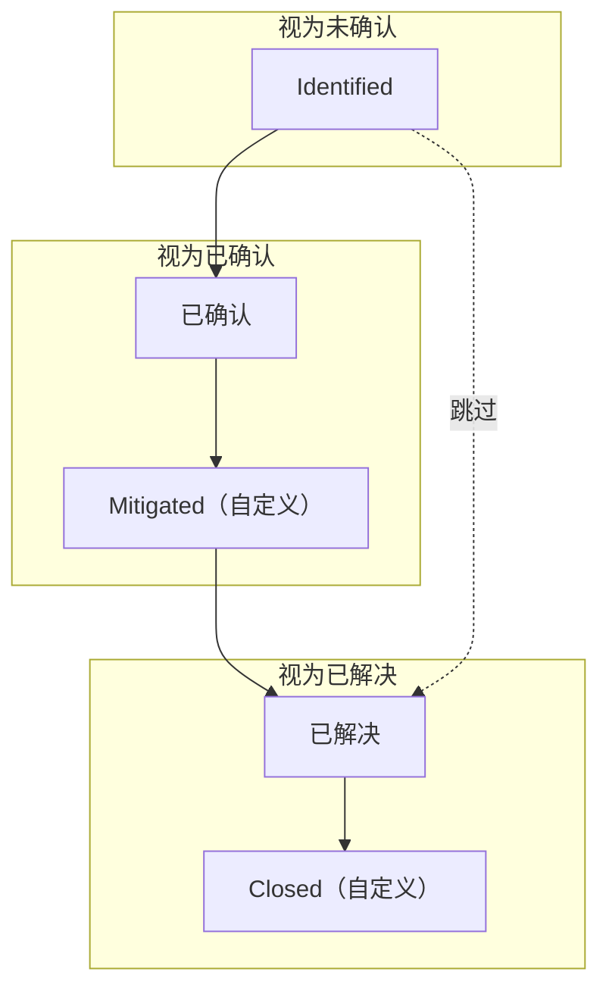
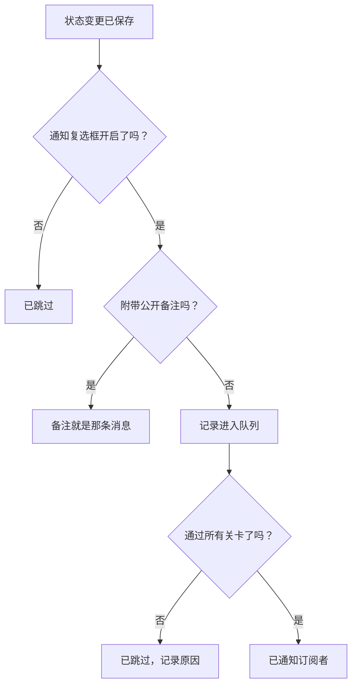

# 事件状态与严重级别

每个事件都带有两种分类：**状态** 表示它在响应中所处的位置，**严重性** 表示它有多严重。本页说明每个状态的作用、如何添加自己的状态，以及严重性如何排序——面向配置事件的人，或者想知道某个事件为什么呼叫了（或没有呼叫）、解决了（或没有解决）、出现在（或没有出现在）状态页上的人。

:::cards
- [添加自己的状态](#添加自己的状态): 为你的响应流程建模，并查看每个状态被视为什么。
- [确认会做什么](#确认会做什么): 呼叫停止，SLA 被标记为已响应。
- [解决会做什么](#解决会做什么): 交还监视器，关闭 SLA。
- [通知订阅者](#把状态变更告诉状态页订阅者): 状态变化在状态页得知之前要通过的关卡。
:::

## 工作原理

在仪表板中，状态和严重性看起来很像——两者在事件列表上都显示为彩色徽章，在任何选择它们的地方都显示为名称前的彩色圆点，两者都是可以改名和改颜色的项目级列表。但它们的作用截然不同。

状态驱动行为。状态行上的三个布尔标志，加上状态的顺序，决定哪些事件算作活动、事件页眉上出现哪些按钮、SLA 时钟何时停止，以及事件何时从状态页上撤下。严重性本身什么都不驱动——它们是描述影响的标签，其他规则可以基于它们进行匹配。

`IncidentState` 模型有 `name`、`description`、`color` 和 `order`，外加三个布尔值：`isCreatedState`、`isAcknowledgedState` 和 `isResolvedState`。产品对状态所做的一切都基于这些布尔值和 `order`——从不基于状态的名称。这就是为什么你可以把 **已解决** 改名为“Closed”而不会有任何问题：标志随行一起走。

`IncidentSeverity` 模型只有 `name`、`description`、`color` 和 `order`。没有标志。OneUptime 中没有任何东西会单凭严重性就把 **Critical Incident** 与 **Minor Incident** 区别对待——严重性只在你让某样东西指向它时才起作用，例如值班规则上的 **事件 严重性** 匹配条件。

几条简单规则：

- **用严重性来传达影响** —— 它显示在事件列表和事件 **概览** 上，并且是声明事件时的必填字段。
- **用状态来为流程建模** —— 也就是你实际经历的响应步骤，按你经历它们的顺序排列。
- **不要用状态来表达紧急程度** —— 名为“Critical”的状态不会呼叫任何人。做这件事的是严重性加上一条值班规则。

> [!TIP]
> 这两个列表都在项目创建时预置，并且都在 **事件 → 设置** 下编辑。事件侧边菜单的这一部分默认是折叠的，所以在寻找它们之前先展开 **设置**。

## 预置状态

项目创建时会按以下顺序创建三个状态。预置是幂等的——只有在同名状态尚不存在时才会添加。

| 状态             | `order` | 标志                  | 颜色      | 含义                                               |
| ---------------- | ------- | --------------------- | --------- | -------------------------------------------------- |
| **Identified**   | `1`     | `isCreatedState`      | `#fd625e` | 新事件进入的状态。                                 |
| **已确认**       | `2`     | `isAcknowledgedState` | `#ffbf53` | 有人接手了事件。                                   |
| **已解决**       | `3`     | `isResolvedState`     | `#2ab57d` | 事件已经结束，不再算作活动。                       |

> [!NOTE]
> 第一个状态的名称是 **Identified**，尽管产品中的一些描述仍然称它为“创建”状态。当文档或提示说“创建状态”时，指的是带有 `isCreatedState` 的那个状态——在新项目中就是 **Identified**。

## 每个状态标志实际做什么

| 标志                  | 用途                                                                                                                                                                                                 |
| --------------------- | ---------------------------------------------------------------------------------------------------------------------------------------------------------------------------------------------------- |
| `isCreatedState`      | 没有人选择状态时事件获得的状态。如果项目中没有状态带有此标志，创建事件会失败，并给出错误提示，要求你从设置中添加一个创建状态。                                                                     |
| `isAcknowledgedState` | 标记项目的确认状态：**确认** 会把事件移到这里，确认统计卡片也以它命名。处于该状态、其后任一状态或已解决的事件都是已确认的——不再为它提供 **确认**，值班不再为它发出呼叫，它的 SLA 被标记为已响应。 |
| `isResolvedState`     | 标记项目的解决状态：**解决** 会把事件移到这里，解决统计卡片显示的就是它。处于该状态或其后任一状态的事件都是已解决的——它会离开 **活动事件** 和状态页的活动部分，它的 SLA 被标记为已解决。         |

每个项目中，每个标志预期只由一个状态持有——查找时会取顺序中的第一个。三个带标志的状态在设置页面上带有 **内置** 标记；把鼠标悬停在上面（或用 Tab 移到上面），可以读到 OneUptime 会用这个状态做什么。它们可以改名、改颜色和拖动，但是：

- **它们保持顺序。** 创建状态在确认状态之前，确认状态在解决状态之前。会打破这一点的拖动——比如把 **已解决** 拖到 **已确认** 之上——会被拒绝，行会回到原位，页面会说明原因。
- **它们不能被删除。** 它们的 **删除** 仍在行菜单中，但处于锁定状态，并附有原因。批量删除会跳过它们，并把它们列为未删除。API 也会拒绝删除项目最后一个创建、确认或解决状态。

由于 UI 动态读取状态名称，重命名一个状态会改变你在各处看到的内容——统计卡片（使用预置名称时为 **Acknowledged in** 和 **Resolved in**）、自定义状态的 **将事件标记为“…”** 确认框，以及事件列表上的徽章，都会跟随你给这一行起的名字。

## 添加自己的状态

你添加的状态，是预置的三个状态没有命名的响应步骤：“Investigating”、“Mitigated”、“Monitoring”、“Closed”。

:::steps
### 打开状态列表

前往 **事件 → 设置 → 事件状态**。**事件 状态** 卡片按顺序列出你的状态，每个一行：用于拖动的手柄、颜色和名称、处于该状态的事件 **视为** 什么，以及它的描述。标题下方的一句话说得很清楚：事件只会沿这个列表向下移动。

### 创建状态

点击卡片页眉中的 **创建事件状态**，填写表单（字段见下文）。新状态会被添加在 **解决状态的正上方**——大多数状态都应该在这个位置，绝不会被放在它下面，因为在那里它会悄无声息地被视为已解决。

### 拖到合适的位置

用手柄拖动一行来移动它。新的顺序在你放下时就会保存；没有需要输入的顺序编号。用键盘时，聚焦手柄，按空格键，用方向键移动，再按一次空格键。**视为** 列会在你放下行时更新。
:::

**编辑** 打开与创建相同的表单。状态的 ID 位于行菜单的 **显示 ID** 下。

| 字段            | 必填   | 作用                                                                                                                                                                                                                                                               |
| --------------- | ------ | ------------------------------------------------------------------------------------------------------------------------------------------------------------------------------------------------------------------------------------------------------------------ |
| **名称**        | 是     | 至少两个字符。占位符的示例类似“Investigating”。                                                                                                                                                                                                                   |
| **描述**        | 否     | 自由文本，说明事件在什么时候处于这个状态。                                                                                                                                                                                                                         |
| **颜色**        | 是     | 表单打开时就已选好：列表中还没有任何状态使用的颜色，所以新状态绝不会和它上面的状态一样是红色。可以从一排具名颜色（红色、橙色、青柠色、绿色、蓝绿色、蓝色、靛蓝色、紫色、品红色、粉色）中另选一个，或者用 **自定义颜色** 设定一个精确的品牌色，例如 `#fd625e`。 |

颜色会给状态的徽章以及每个状态选择器中名称前的圆点着色：声明表单和模板表单、**更改状态** 批量操作、页眉的状态菜单，以及规则和过滤条件。这些选择器都会按本页给出的顺序列出状态。

你不能在这个表单中设置三个标志——它们属于预置的行。因此你添加的状态是一个不带标志的状态，这带来三个值得提前考虑的后果：

- **它所处的位置决定它被视为什么。** **视为** 列会显示这一点，并随你的拖动而变化：在确认状态之上，处于该状态的事件为 **未确认**；从确认状态往下，它被视为 **已确认**，因此值班策略会停止对它升级；从解决状态往下，它被视为 **已解决**，因此状态页不再把它显示为活动。
- **位于解决状态之上时，它让事件保持活动。** **活动事件** 包含当前状态位于解决状态之上的事件，所以添加在那里的状态会让事件留在活动列表和侧边栏计数中。拖到解决状态之下的状态在各处都被视为已解决——活动列表、状态页、提醒和 SLA——而把事件从 **已解决** 移入其中并不算第二次解决。
- **你从页眉的菜单中把事件移入其中。** 页眉的按钮只有 **确认** 和 **解决**；自定义状态位于它们旁边 **⋯** 菜单中的 **Change state to** 下，那里列出当前状态之后的每一个状态。它的确认框标题为 **将事件标记为“`<state name>`”**，提交按钮为 **标记为“`<state name>`”**。

> [!TIP]
> 一种常见的做法是在确认状态和解决状态之间放一个缓解步骤——创建“Mitigated”，它会落在 **已确认** 之后、**已解决** 的正上方，被视为已确认。若要在任何人确认事件之前加一个分诊步骤，就把它拖到 **已确认** 之上。

## 顺序是真正的约束，而不是显示偏好

顺序在写入状态变更时就会强制执行，而不仅仅是在绘制列表时：

- **回退的转换会被拒绝。** 把事件移到顺序中位于当前状态之前的状态，会失败并给出指明两个状态的错误。
- **重新选择当前状态会被拒绝。** 把事件设置为它已经所处的状态，会以“Incident state cannot be same as previous state.”失败。
- **补录的行不能与相邻行重复。** 插入一条与其后一行状态相同的时间线行，同样会被拒绝。
- **页眉按钮跟随带标志状态在顺序中的位置。** **确认** 和 **解决** 是否提供，取决于当前状态在按顺序排列的列表中所处的位置。放在解决状态 *之后* 的自定义状态永远不会显示 **解决** 按钮，因为处于该状态的事件已经被视为已解决。

所以，添加状态时，要把它放在事件真正会经过的位置。顺序放错不只是看起来奇怪——它会让转换变得不可能。把一个状态往后移，会在你放下的那一刻改变已经处于该状态的事件被视为什么。

通过 API 和 Terraform，顺序就是 `order` 列：数字小的在前。创建时没有指定数字的状态会放在解决状态的正上方；创建或更新时指定了数字的状态会占据那个位置，挡在中间的状态依次后移一位。没有被其他状态占用的数字会按写入的样子保留，因此由 Terraform 管理的状态读回时就是它被赋予的那个数字。

## 预置严重性

项目创建时会按以下顺序创建三个严重性，最严重的在前：

| 严重性                | `order` | 颜色      | 预置描述                                                                                                                                                                                  |
| --------------------- | ------- | --------- | ----------------------------------------------------------------------------------------------------------------------------------------------------------------------------------------- |
| **Critical Incident** | `1`     | `#b70400` | Issues causing very high impact to customers. Immediate response is required. Examples include a full outage, or a data breach.                                                          |
| **Major Incident**    | `2`     | `#fd625e` | Issues causing significant impact. Immediate response is usually required. We might have some workarounds that mitigate the impact on customers. Examples include an important sub-system failing. |
| **Minor Incident**    | `3`     | `#ffbf53` | Issues with low impact, which can usually be handled within working hours. Most customers are unlikely to notice any problems. Examples include a slight drop in application performance. |

声明事件时严重性是必填的，监视器条件中的每个事件规格也都必须填写它，所以每个事件——无论手动还是自动——都带着严重性而来。声明流程参见 [声明事件](/docs/incidents/declaring-incidents)，由监视器驱动的路径参见 [事件与告警模板](/docs/monitor/incident-alert-templating)。

## 编辑严重性

前往 **事件 → 设置 → 事件严重性**。与状态页面的形式相同——每个严重性一行，最严重的在前，拖动一行来改变它的等级；**创建事件严重性** 会在末尾（最不严重的位置）添加一个，表单中有 **名称**、**描述** 和 **颜色**，颜色和状态表单一样已经选好。

在 OneUptime 比较严重性的任何地方，等级都很重要：片段采用其中最严重事件的严重性，监视器建议中的 Critical 和 Warning 会对应到你的第一个和第二个严重性。

与状态的两点不同：

- **没有删除保护。** 任何严重性都可以删除，包括三个预置的严重性。
- **没有可继承的标志，也没有“视为”。** 新的严重性与预置的完全一样——它是一个带颜色和等级的标签。

严重性不只是用于描述的地方：在 **事件 → 规则 → 值班规则** 中，规则的 **事件 严重性** 字段是一个匹配条件。在那里列出 **Critical Incident**，就是表达“任何严重事件都呼叫数据库团队”的方式——值班策略存在于规则上，而不是严重性上。

**更改事件的严重性**——在事件 **事件详情** 卡片的 **编辑** 中、通过 API 或 Terraform（`incidentSeverityId`）、通过工作流或通过 AI 工具——无论以哪种方式发送，都会做同样的四件事：事件信息流会添加一条写明新严重性的 **Incident updated** 条目，事件的 SLA 截止时间会重新计算，它的提醒规则会重新匹配，事件指标会计入一次严重性变更。保存事件已有的严重性则不会做其中任何一件事，所以只编辑事件的标题，其 SLA 截止时间、提醒和严重性变更计数都保持不变。告警的严重性在其信息流条目和提醒方面也是同样的工作方式。

## 推动事件经过各个状态

事件改变状态有四种方式：

| 方式                | 位置                                                                                        | 询问内容                                                                                                                                                                                                     |
| ------------------- | ------------------------------------------------------------------------------------------- | ------------------------------------------------------------------------------------------------------------------------------------------------------------------------------------------------------------ |
| **页眉按钮**        | 事件的页眉：**确认** 和 **解决**，以及其 **⋯** 菜单中的 **Change state to**                 | 一个简短的确认框——**确认事件** 或 **解决事件**——带有 **通知状态页订阅者**，以及折叠在 **添加公开备注** 下的可选 **公开备注** 和它的 **选择备注模板** 选择器（当项目有备注模板时）。 |
| **状态时间线**      | 事件侧边菜单中的 **状态时间线**                                                             | 手动添加的一行，带有 **事件状态**、**开始** 和 **通知状态页订阅者**。                                                                                                                                       |
| **批量更改**        | 在事件列表中对选中项使用 **更改状态**                                                       | 一个页面，包含状态、**通知状态页订阅者** 以及同样折叠起来的 **添加公开备注**。                                                                                                                              |
| **自动**            | 监视器条件，或你自己的代码                                                                  | 启用了 **自动解决事件** 的条件会在条件不再满足时解决其事件。API 通过在 `/api/incident-state-timeline` 创建一行来改变状态。                                                                                 |

如果当前状态在确认状态之前，页眉会提供 **确认** 和 **解决**；如果在两者之间，只提供 **解决**。确认还会停止该事件的所有值班升级。

所有这些方式都会写入一条时间线记录。状态变更还会做几件你不必要求的事：它会在事件信息流中发布一条条目，在事件还没有事件指挥官时指派一位，并更新 SLA 时钟。重新打开已解决的事件，会从重新打开的时间开始一条新的 SLA 记录。

## 确认会做什么

从事件进入你的确认状态、其后的任一状态——你放在 **已确认** 之下的 **Mitigated** 或 **Investigating** 状态——或者解决状态的那一刻起，事件就是已确认的，无论是通过上述四种方式中的哪一种移动的。状态设置页面上的 **视为** 列会显示是哪些状态。一旦被确认：

- **不再提供确认。** 事件页眉中没有，移动应用中没有（按钮和滑动操作都没有），Slack 或 Microsoft Teams 中没有，OneUptime MCP 服务器的 `acknowledge_incident` 也没有。如果仍然尝试确认——从值班页面、Slack 或 Teams——会以“Incident is already acknowledged.”（或“Incident is already resolved.”）被拒绝，而不是把它沿列表往回移。
- **值班停止为它发出呼叫。** 在同事已经确认或推进事件之后才确认自己呼叫的响应者，其呼叫会被确认，事件保持原位。
- **SLA 被标记为已响应**，时间为第一次这样的移动；继续经过后续状态会保留这个时间。
- **确认用时计到那第一次移动为止** —— 事件 **概览** 上的统计卡片、**Time to Acknowledge** 指标、在 **事件被确认时** 结束的测量，以及 Slack 和 Microsoft Teams 摘要中的 MTTA。从 **Identified** 直接移到 **Investigating** 的事件在那时就被确认了；直接解决的事件在解决时被确认。
- **已确认过滤器**——例如仪表板事件列表小组件上的——会显示处于你的确认状态及其后任一状态、但尚未解决的事件。

告警和片段使用你的告警状态，遵循同样的规则。

## 解决会做什么

当事件从你的解决状态之上的状态移入解决状态，或其后的任一状态时，事件就被解决了——无论是通过上述四种方式中的哪一种移动的。每次解决都会：

- **交还事件占用的监视器。** 以未解决状态声明的事件会占用它的监视器：如果它指定了 **将监视器状态更改为** 的状态，就会把监视器置于该状态；如果是手动声明的，还会暂停它们的监视。在它未解决期间的编辑——添加监视器或更改该状态——也会让它占用这些监视器。解决会恢复它们的监视并让它们恢复正常运行，除非另一个未解决的事件仍在占用它们，从此该事件不再占用任何东西。因此，声明时即已解决的事件不会交还任何东西，重新打开之后的第二次解决也不会：其间监视器获得的状态——来自探针、维护或手动设置——会保留下来。
- **将 SLA 标记为已解决**，并且在开启 OneUptime AI 事后分析草稿时，起草一份事后分析。

从 **已解决** 继续移到其后的状态——比如 **Closed**——不算第二次解决：上述内容都不会再次运行，也不会开始新的 SLA。在 OneUptime 开始记录这一点之前声明的事件，会像以前一样在下一次解决时交还它的监视器。

## 状态时间线

事件侧边菜单中的 **状态时间线** 页面，是事件经历过的每个状态的审计记录。该页面上的卡片标题为 **状态时间线**，按最新优先排序。

| 列                                 | 显示内容                                                                                                                                                                                                                                                       |
| ---------------------------------- | -------------------------------------------------------------------------------------------------------------------------------------------------------------------------------------------------------------------------------------------------------------- |
| **事件状态**                       | 一个带有状态名称和颜色的彩色徽章。                                                                                                                                                                                                                             |
| **开始**                           | 事件进入此状态的时间。                                                                                                                                                                                                                                         |
| **结束**                           | 离开的时间。当前状态显示 `Currently Active`。                                                                                                                                                                                                                  |
| **持续时间**                       | 在此状态中停留的时间，当前状态计算到现在。                                                                                                                                                                                                                     |
| **订阅者通知状态**                 | 此次变更的状态页通知是已发送、已跳过还是仍待处理，带有 **更多详情** 链接，并且——发送失败时——提供 **重试** 操作。**重试** 会把状态变更重新发送到事件当前触达的每个状态页，包括已经收到的订阅者。                                                               |

每一行有两个操作：

- **查看原因** —— 打开一个 **根本原因** 对话框，呈现随该状态变更记录的 Markdown。
- **查看日志** —— 打开一个说明状态为何变化的对话框，其中有 **事件状态日志** 查看器。

在仪表板中，时间线行可以添加和删除，但不能编辑；事件始终至少保留一行。通过 API，可以修正行的 `startsAt`，从时间线计算出的每项测量都会随之更新。

> [!WARNING]
> 删除错误的行会改写事件的历史，所以要把它当作修正工具，而不是清理习惯。

## 活动事件列表

**事件 → 活动事件** 是你值班期间盯着的列表。它的定义只有一个条件：事件的当前状态位于你的解决状态之上——即顺序中第一个带有 `isResolvedState` 标志的状态。其他一概不考虑——不考虑严重性，不考虑存在时长，也不考虑是否有人确认过。

侧边菜单项带有一个使用同一查询的红色计数徽章，所以徽章和列表始终一致。没有可显示的内容时，页面会这样说明。

实际的后果是：你在解决状态之上添加的自定义状态会让事件留在这个列表中——“Mitigated”不等于“完成”——而放在它之后的状态会像解决状态一样把事件移出列表。告警和片段以各自的状态遵循同样的规则，侧边菜单计数、提醒、状态页和移动应用都会读取它。

## 把状态变更告诉状态页订阅者

状态变更可以通知你的状态页订阅者，但要经过几道关卡。理解它们可以省去大量“为什么没有人收到通知”的排查。

通知按每条时间线记录通过 **通知状态页订阅者**（`shouldStatusPageSubscribersBeNotified`）请求，也就是状态变更对话框和手动时间线表单上的复选框。在状态变更对话框中，如果事件声明时没有通知订阅者，它会以关闭状态开始。同一个复选框还决定对话框中的公开备注是否会通知任何人。它关闭时，记录会以“已跳过”状态和一段说明保存。它开启时，记录进入队列，由后台任务处理——该任务每分钟运行一次，所以送达很快但不是即时的。

**进入队列的记录在以下任一情况成立时会被跳过：**

- **新状态是创建状态。** 声明事件时已经通知过订阅者，所以第一条时间线记录有意不发送第二条消息。
- **事件没有附加任何监视器。** 没有资源，就没有可以把事件映射过去的状态页。
- **事件在状态页上不可见**（`isVisibleOnStatusPage` 已关闭）。
- **状态页关闭了事件显示**（`showIncidentsOnStatusPage` 已关闭）。这是按状态页判断的——显示同一监视器的其他页面仍会收到通知。
- **状态页不在事件的范围内。** 通过 **仅限这些状态页面** 限定到部分状态页的事件，只会通知列出其监视器的页面中的那些页面，而开启了 **仅显示限定到此页面的事件** 的页面，永远不会收到未限定到它的事件的通知。这同样是按状态页判断的。参见 [每个受众一个状态页](/docs/status-pages/one-status-page-per-audience)。

**还有一件会改变结果的事。** 如果你在 **通知状态页订阅者** 开启时，在状态变更对话框（**添加公开备注** 下）或 **更改状态** 批量操作中写了 **公开备注**，时间线记录会被标记为已通知而不是进入队列，其状态消息会说明是由备注传达的。真正送到订阅者手中的是备注本身，所以他们只收到一条消息而不是两条。只含空格的备注不会被发布，记录会照常进入队列。计划维护的状态变更也是同样的工作方式。普通状态变更消息背后的事件类型是 `Subscriber Incident State Changed`。

**备注会说明事件现在的状态。** 因为备注是唯一的那条消息，它会在每个渠道上写明新状态，就像状态变更消息原本会做的那样：邮件主题为 `[Resolved Incident] <title>`，详情中显示一个带状态颜色的 **Status** 行；短信写着 `Incident <title> on <status page> is Resolved.`；Slack 和 Microsoft Teams 消息带有一行 `**Status:** Resolved`；webhook 的 `IncidentNoteCreated` 载荷在 `data` 中带有 `incidentState`。单独发布的备注保持它通常的消息，编辑产生的更新通知也是如此。

**发布备注需要单独的权限。** 更改状态和发布公开备注是不同的权限（自定义角色中的 **Create Incident State Timeline** 和 **Create Incident Status Page Note**；内置的事件和项目角色两者都有）。更改状态不需要编辑事件的权限：参见 [更改状态](/docs/permissions/index#更改状态)。可以更改事件状态但不能发布公开备注的人，在对话框和 **更改状态** 批量操作中都不会看到 **添加公开备注**。他们通过 API 发送的带备注的状态变更会被整体拒绝，并附上说明状态未被更改及其原因的消息，因此绝不会把一次变更记录为由一条从未发布的备注所通知。去掉备注，变更就能通过。告警、告警片段和事件片段则在状态变更时提供私密备注（**添加私密备注**），其工作方式相同：发布它需要备注自身的权限（自定义角色中的 **Create Alert Internal Note**、**Create Alert Episode Internal Note** 或 **Create Incident Episode Internal Note**；内置的告警、事件和项目角色都有），没有该权限的人发送的带私密备注的状态变更会被整体拒绝，状态不会改变。

**已发送意味着每个订阅者都已收到发送。** 任务会等待每条消息，按状态页和渠道统计发送成功或失败，记录的状态消息会列出这些计数。只要有一条消息失败，或者一次发送超时或被中断，记录就会变为 **失败**。参见 [订阅者与公告](/docs/status-pages/subscribers)。

谁会收到这些消息以及模板如何选择，参见 [订阅者与公告](/docs/status-pages/subscribers)。

## 让事件不出现在状态页上

事件是否出现在公开页面上，由四件独立的事情决定，四者必须同时为真：

- 状态页本身的 **显示事件**（`showIncidentsOnStatusPage`）。
- 事件上的 **在状态页面上可见**（`isVisibleOnStatusPage`）——事件 **设置** 页面上的一个开关。它默认为 true，不在声明向导中；监视器条件可以通过 **在状态页上显示事件** 设置它。隐藏声明的事件在创建时不会通知任何订阅者；之后你打开这个开关时，编辑表单会提供 **通知订阅者此事件已创建**。参见 [声明事件](/docs/incidents/declaring-incidents)。
- **页面在事件的触达范围内。** 页面列出了事件的某个监视器，并且如果事件被限定到部分状态页，该页面是其中之一。开启了 **仅显示限定到此页面的事件** 的页面只显示限定到它的事件。参见 [每个受众一个状态页](/docs/status-pages/one-status-page-per-audience)。
- **当前状态位于解决状态之上。** 正是这一点把事件从活动部分移除：状态页查询会取当前状态位于你的解决状态之上的事件，因此解决状态及其后的任何状态都会把事件撤下。你不需要归档或关闭任何东西——解决它，它就进入历史。

**私密事件永远不会出现。** 打开 **私密事件** 会让事件在所有状态页上隐藏，无论上述开关如何，并且只有它的所有者以及项目管理员和所有者能访问它。它的任何信息都不会送达状态页订阅者：无论是它的创建、状态变更、公开备注还是事后分析。它为私密时，其描述、事后分析、自定义字段和公开备注中的图片不会对所有人可见。

两个开关保持同步，因此事件的 **设置** 页面始终如实反映状态页的行为：

- 把事件设为私密，会同时关闭 **在状态页面上可见**。
- 在事件仍为私密时打开 **在状态页面上可见**，它会保持关闭。要发布一个私密事件，请关闭 **私密事件** 并打开 **在状态页面上可见**——一次保存完成，或先后进行均可。

无论事件以何种方式写入，这都成立：仪表板、API、Terraform、工作流、监视器、事件模板或隐私规则。以文本形式发送的值，例如 `"true"`，与 `true` 同样对待。对多个事件打开 **在状态页面上可见** 的一次写入——例如工作流的 **Update Many**——会显示非私密的事件，而让所有私密事件保持隐藏。每个事件都按写入到达它时的状态来判断，所以同一时刻到达的隐私变更绝不会被覆盖：事件永远不会被保存为既私密又可见。以私密方式创建的事件在创建时即为隐藏，也不会通知任何订阅者它已创建。

**片段遵循同样的规则。** 私密的事件片段无论其 **在状态页面上可见** 开关如何设置，都会在所有状态页上隐藏，它的订阅者也不会听到任何关于它的消息。在片段的 **设置** 页面上，开关会这样说明，并在片段为私密期间保持关闭。私密事件永远不会把它的片段带到状态页上：片段只能通过非私密的事件出现在页面上。

:::details 从没有这些规则的版本升级
在这些规则之前就以私密方式保存、但 **在状态页面上可见** 仍开启的事件和片段，会在升级时关闭该开关。不会向任何人发送任何内容。这类事件或片段曾经让所有人可见的图片，除非状态页显示的其他内容中仍包含它们，否则会重新变为私密。状态页不显示的事件、片段和计划维护事件的公开备注中的图片也是如此，它们以前一直对所有人可见。
:::

页面保留多少已解决的历史，是状态页的设置，而不是事件的设置。页面上的监视器如何决定哪些事件会出现，参见 [状态页资源与分组](/docs/status-pages/resources-and-groups)。

## 后续步骤

:::cards
- [声明事件](/docs/incidents/declaring-incidents): 声明时选择起始状态和严重性。
- [事件备注、负责人与动态](/docs/incidents/notes-owners-and-feed): 发布随状态变更一起发出的公开备注。
- [事件设置与自动化](/docs/incidents/settings): 测量状态之间的时间，并在规则中匹配严重性。
- [订阅者与公告](/docs/status-pages/subscribers): 谁会收到状态变更发出的消息。
:::
