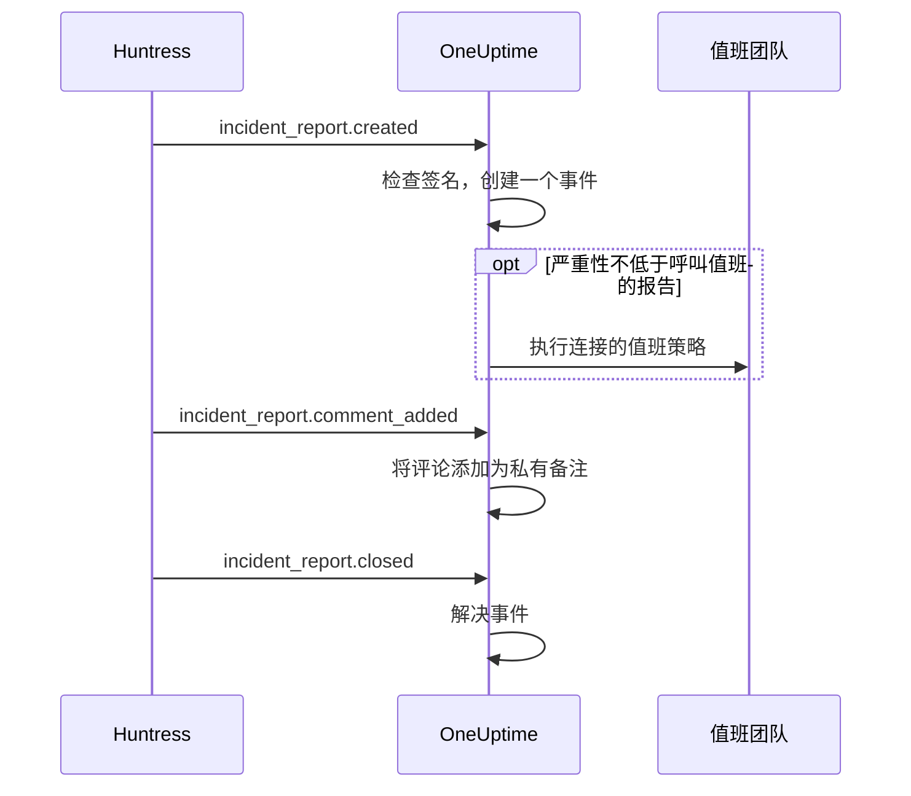

# Huntress 集成

为 Huntress 事件报告呼叫你的值班团队。当 Huntress SOC 针对某个终端或身份发送事件报告时，OneUptime 会为它创建一个事件，使用你选择的严重性，呼叫你选择的值班策略，并在 Huntress 中关闭该报告时解决事件。

此集成是**入站**的：Huntress 会把事件报告的每个事件发送到 OneUptime 提供的 Webhook URL，并用端点的签名密钥签名。OneUptime 从不调用 Huntress，因此不需要 Huntress API 密钥。

:::cards
- [工作原理](#工作原理)：OneUptime 如何处理报告的每个事件。
- [设置步骤](#设置集成)：在 OneUptime 中连接，在 Huntress 中添加端点，保存其签名密钥，发送测试。
- [设置](#设置)：呼叫、严重性、组织、标签和解决。
- [故障排除](#故障排除)：连接的错误是什么意思，以及该改什么。
:::

## 工作原理

Huntress 会在报告发出时、有人评论时以及报告关闭时发送事件报告的事件。每个事件都包含完整的报告。

1. **检查。** 请求必须用端点的签名密钥签名，且签名时间不早于到达前五分钟。其他请求都会被拒绝，连接页面会说明原因。
2. **创建一个事件。** 报告的第一个事件会创建一个以报告命名的事件，例如 `Huntress: Incident on DESKTOP-01 (Acme Corp)`。事件描述包含报告摘要、在 Huntress 中的严重性、组织、受影响的主机或身份、Huntress 发现的指标，以及指向 Huntress 中该报告的链接。同一报告之后的事件，以及 Huntress 重新发送的投递，都会找到这个事件：一份报告绝不会创建两个事件。
3. **呼叫。** 事件以连接为该报告的 Huntress 严重性指定的事件严重性创建。当该严重性不低于**呼叫值班的报告**时，会执行连接的**值班策略**。
4. **跟进报告。** 在 Huntress 中添加的评论会成为事件上的私有备注。当报告被关闭或驳回时，事件会被解决。

这样创建的事件永远不会显示在状态页上。你的事件规则（值班、负责人、标签和隐私规则）会像对待其他事件一样适用于它们。

## 开始之前

- 在 OneUptime 中具有 **Project Owner** 或 **Project Admin** 角色。成员、查看者和事件角色可以查看连接及其收到的报告，但不能修改。
- 在 Huntress 中具有 **Account Admin** 角色：只有账户管理员可以添加 Webhook。
- 一个要呼叫的值班策略。没有策略时，报告会创建事件但不呼叫任何人，除非有事件值班规则匹配它们。
- 自托管安装需要 Huntress 能从互联网通过 HTTPS 访问的 OneUptime：Huntress 只向 `https://` URL 发送 Webhook。

## 设置集成

:::steps
### 在 OneUptime 中连接 Huntress

打开**事件 → 集成 → Huntress**（`/dashboard/{projectId}/incidents/integrations/huntress`）。事件侧边菜单中的**集成**部分默认是折叠的，请先展开它。点击**连接 Huntress**。

选择要呼叫的**值班策略**。随后**呼叫值班的报告**会询问哪些报告呼叫它们，默认是**高和严重报告**。其他设置都带着默认值放在**更多字段**中（参见[设置](#设置)）。点击**连接 Huntress**。连接页面随即打开，上面的**连接 Huntress**卡片会带你完成接下来的三个步骤。

### 在 Huntress 中添加 Webhook 端点

在连接页面上点击**复制 Webhook URL**。URL 形如 `https://oneuptime.com/api/huntress/webhook/<connection-id>`；自托管安装的 URL 以你自己的主机开头。

在 Huntress 中打开右上角的菜单，选择 **Integrations**。点击 **Add an Integration**，选择 **Webhooks**，然后点击 **Add Endpoint**。粘贴 URL，开启 **Incident Reports**，然后保存。让 **Escalations**、**Platform Actions** 和 **Account Notices** 保持关闭：OneUptime 会接收这些事件，但不做任何处理。

### 保存端点的签名密钥

在 Huntress 中打开端点的菜单 (⋯)，选择 **View Signing Secret**。完整复制它：它以 `whsec_` 开头。在连接页面上点击**保存签名密钥**，粘贴后点击**保存签名密钥**。密钥会被加密，且不会再次显示。

在保存密钥之前，OneUptime 会拒绝发往该 URL 的所有请求。Huntress 稍后会重新发送被拒绝的事件，所以现在被拒绝的事件之后仍会到达。

### 发送测试

在 Huntress 中打开端点的菜单 (⋯)，选择 **Send Test**。几秒钟内，连接页面上的卡片会变为**连接**，状态为**正在接收报告**。

> [!NOTE]
> 无论测试包含什么，连接都会显示它已到达。包含事件报告的测试会像其他报告一样创建事件，如果足够严重，还会呼叫值班人员。
:::

## 设置

**连接 Huntress**只询问呼叫谁以及针对哪些报告。其他设置都带着适合大多数团队的默认值放在**更多字段**中。之后要修改设置，请在连接的**设置**卡片上点击**编辑设置**。

| 设置 | 作用 | 默认值 |
| --- | --- | --- |
| **值班策略** | 报告足够严重时执行的策略。留空则创建事件但不呼叫任何人。 | 无 |
| **呼叫值班的报告** | 哪些报告呼叫这些策略：**仅严重报告**、**高和严重报告**或**所有报告**。无论如何，每份报告都会创建事件。 | **高和严重报告** |
| **名称** | 连接在 OneUptime 中的名称。 | `Huntress` |
| **严重报告的严重性**、**高报告的严重性**、**低报告的严重性** | 每种 Huntress 严重性创建事件时使用的事件严重性。 | 你最高的三个事件严重性，按顺序 |
| **仅限这些组织** | 其报告会创建事件的 Huntress 组织，每行一个组织名称或 ID。名称不区分大小写。 | 空：所有组织 |
| **标签** | 除了以报告所属组织命名的标签外，添加到每个事件的标签。 | 无 |
| **Huntress 关闭报告时解决** | 当报告在 Huntress 中被关闭或驳回时解决事件。关闭此项时，改为在事件上添加一条私有备注说明。 | 开启 |

### 严重性

Huntress 会给每份事件报告三种严重性之一。除非你为某种严重性选择了事件严重性，否则报告会按照**事件 → 设置 → 事件严重性**中列出的事件严重性顺序创建事件：

| Huntress 严重性 | Huntress 的含义 | 事件严重性 |
| --- | --- | --- |
| Critical | 攻击者正在直接操作、危险的恶意软件或正在进行的入侵，需要立即遏制。 | 最高的 |
| High | 需要紧急处置的已确认恶意软件，或需要采取行动的身份泄露。 | 第二 |
| Low | 潜在有害程序、恶意软件残留以及较早的身份相关发现。 | 第三 |

严重性较少的项目会对其余的使用最低的严重性。没有严重性的报告按高处理。如果你选择的严重性被删除，则重新按顺序决定。

### 组织

每个事件都会得到一个以报告所属 Huntress 组织命名的标签，例如 _Acme Corp_。一个连接会接收你 Huntress 账户中所有组织的报告，**仅限这些组织**可以缩小范围。

> [!TIP]
> 要呼叫每个客户自己的团队，请让连接的**值班策略**留空，并为每个组织添加一条事件值班规则，例如“如果**事件标签**包含任一 _Acme Corp_”，执行该客户的策略。参见[事件值班规则](/docs/incidents/settings#事件值班规则)。

## 连接页面上的报告

连接的**事件报告**列表按从新到旧显示 Huntress 发送的每份报告：受影响的主机或身份、在 Huntress 中的严重性和状态，以及**结果**。

| 结果 | 发生了什么 |
| --- | --- |
| **已创建事件** | 该报告创建了一个事件。**查看事件**可打开它；**已呼叫值班**表示连接呼叫了它的策略。 |
| **事件已解决** | Huntress 关闭了报告，其事件已解决。 |
| **已跳过：未关注的组织** | 报告所属的组织不在**仅限这些组织**中。 |
| **已跳过：已在 Huntress 中关闭** | OneUptime 第一次收到该报告时，它已经关闭。 |

被跳过的报告在你之后修改设置时仍然保持跳过。当**Huntress 关闭报告时解决**关闭时，已关闭的报告会保留**已创建事件**的结果。

## 安全

- **只接受签名的请求。** OneUptime 会将 Huntress 发送的 `svix-id`、`svix-timestamp` 和 `svix-signature` 请求头与原样到达的请求正文进行校验。未用已保存密钥签名，或签名时间前后相差超过五分钟的请求都会被拒绝。
- **密钥始终保密。** 它被加密存储，API 从不返回它，也不会再次显示。连接页面上的**替换签名密钥**可以保存另一个密钥，例如新端点的密钥。
- **URL 是地址，不是密码。** 它指向连接；只有用端点密钥签名的请求才会被处理。
- **每个连接一个端点。** 每个连接都有自己的 URL 和密钥。要接收第二个 Huntress 账户的报告，请再连接一次。

## 改用邮件

Huntress 也会通过邮件发送事件报告，[入站邮件监控](/docs/monitor/incoming-email-monitor)可以根据这些邮件创建事件，例如当主题包含 `Critical Incident Report` 时。但它把邮件当作一个监控的状态：在它的事件处于打开状态时，下一份报告不会再创建事件，而且事件是按监控的条件解决，而不是在 Huntress 关闭报告时解决。Huntress 连接为每份报告创建一个事件，并随报告一起解决每个事件，因此更推荐使用它。连接开始接收报告后，请停止把邮件发送到监控，否则每份报告都会呼叫两次。

## 故障排除

当 OneUptime 拒绝请求时，连接页面会在**上一个请求被拒绝**下显示原因。在 Huntress 中，端点菜单 (⋯) 里的 **View Delivery Attempts** 会列出每次投递以及 OneUptime 的响应。

:::details "A request arrived but was refused, because no signing secret is saved for this connection yet"
保存端点的签名密钥：参见[设置集成](#设置集成)。Huntress 会重新发送被拒绝的请求。
:::

:::details "The request's signature does not match the signing secret"
保存的密钥不是这个端点的。每个端点都有自己的密钥：在 Huntress 中打开端点的菜单 (⋯)，选择 **View Signing Secret**，完整复制后用**替换签名密钥**保存。
:::

:::details "The request was signed more than five minutes from now"
Huntress 与你的 OneUptime 服务器的时钟相差超过五分钟，或者该请求是重放的旧请求。如果是自托管安装，请检查服务器的时钟是否准确。
:::

:::details "No Huntress connection has this address."
连接已被删除，或者 Huntress 中端点的 URL 不是该连接的 URL。在连接页面上点击**复制 Webhook URL**，然后把 URL 重新粘贴到 Huntress 的端点中。
:::

:::details "This project has no incident severities, so a Huntress report cannot open an incident"
在**事件 → 设置 → 事件严重性**中添加一个严重性。Huntress 会重新发送该报告。
:::

:::details 没有呼叫任何人
低于**呼叫值班的报告**的报告会创建事件但不呼叫。在**事件报告**列表中，报告结果下方的**已呼叫值班**表示连接进行了呼叫。事件的**值班执行**页面会显示每个策略做了什么。
:::

## 后续步骤

:::cards
- [事件值班规则](/docs/incidents/settings#事件值班规则)：按标签呼叫每个组织自己的团队。
- [事件状态与严重级别](/docs/incidents/states-and-severities)：排列 Huntress 报告使用的严重性顺序。
- [升级规则](/docs/on-call/escalation-rules)：决定呼叫谁，以及何时转到下一步。
- [集成概述](/docs/integrations/index)：你可以连接的其他工具。
:::
