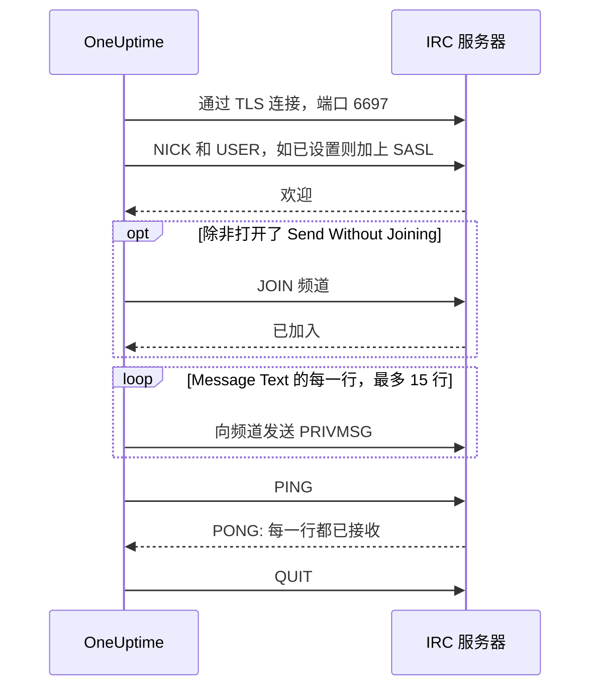

# IRC 集成

把事件更新发到任意 IRC 网络的频道：Libera.Chat、OFTC 或你自己的服务器。

IRC 没有 Webhook，所以 OneUptime 的工作流步骤 **Send Message to IRC** 会像普通 IRC 客户端一样，自己连接到服务器。不需要安装任何东西，也不需要注册应用。此集成为**出站**模式：OneUptime 只往频道里发消息，不会读取频道里的对话。

:::cards
- [工作原理](#工作原理): 步骤的一次运行如何与服务器对话。
- [设置](#设置集成): 服务器和频道、密码，然后是工作流：从模板创建或从零开始。
- [提示](#提示): 不加入频道直接发送、SASL、长消息和集中触发。
- [故障排查](#故障排查): 步骤的错误是什么意思，以及该改什么。
:::

## 工作原理

步骤每次运行时，都会像 IRC 客户端那样与 IRC 服务器进行一段简短的对话，然后断开。

1. **连接。** 步骤通过 TLS 连接到端口 `6697`，并校验服务器的证书。
2. **注册。** 除非你设置了别的 **Nickname**，它会以 `OneUptime` 注册；填写了 **SASL Username** 和 **SASL Password** 时，它会用 SASL 登录。
3. **加入。** 除非打开了 **Send Without Joining**，它会加入频道；频道有密钥时会带上 **Channel Key**。
4. **发送。** **Message Text** 的每一行都作为一条单独的 IRC 消息发出，即一条 `PRIVMSG`。
5. **确认。** IRC 从不告诉你"已送达"，所以步骤会发送一个 `PING` 并等待服务器的 `PONG`。服务器按顺序应答，所以到那时，对消息的任何拒绝都已经到达。
6. **退出。** 它离开服务器。

服务器接收了每一行后，步骤走 **成功** 输出。当服务器无法连接，或服务器拒绝了连接、昵称、密码、频道或消息时，步骤走 **错误** 输出，并在服务器给出原因时原样转述。

## 开始之前

- 在 OneUptime Cloud 上，需要 **Growth** 或更高的套餐：工作流及其变量都包含在内。没有计费的自托管安装没有套餐限制。
- 一个能构建工作流的角色：**Project Owner**、**Project Admin** 或 **Workflow Admin**。
- 如果 IRC 网络要求登录，还需要该网络上的账号。Libera.Chat 对来自部分云和 VPN 地址的连接要求登录。

## 设置集成

:::steps
### 选择服务器和频道

决定消息发往哪里：服务器的主机名，例如 `irc.libera.chat`，以及频道，例如 `#your-channel`。

- **IRC Server** 只填主机名，别的都不要：不要 `ircs://`，也不要端口。步骤通过 TLS 连接到端口 `6697`。如果你的服务器在其他端口上提供 TLS，请在 **更多字段** 下的 **Port** 中设置。
- **Channel** 必须是频道。在这里填写昵称会被拒绝，所以步骤绝不会误把消息私发给某个人。

服务器必须是 OneUptime 允许连接的。环回地址（`localhost`、`127.0.0.1`）、链路本地地址和云元数据地址总是被拒绝。在 OneUptime Cloud 上，位于私有网络地址的服务器也会被拒绝。自托管安装可以连接自己网络中的 IRC 服务器，除非 `DATA_SOURCE_BLOCK_PRIVATE_ADDRESSES` 设为 `true`。

### 把密码保存为机密变量

如果你的服务器、网络和频道都不需要密码，可以跳过这一步。否则，把每个密码保存为机密的[全局变量](/docs/workflows/variables#全局变量)。这样工作流里保存的是变量名而不是密码，改密码也只需改一处。

| 设置                | 何时填写                                         | 变量示例              |
| ------------------- | ------------------------------------------------ | --------------------- |
| **Server Password** | 连接时服务器或你的 bouncer 要求密码。            | `IRC_SERVER_PASSWORD` |
| **SASL Password**   | 网络要求你登录账号。**SASL Username** 填账号名。 | `IRC_SASL_PASSWORD`   |
| **Channel Key**     | 频道设有密钥（模式 `+k`）。                      | `IRC_CHANNEL_KEY`     |

保存方法：打开 **工作流 → 全局变量**，点击 **创建工作流 变量**。在 **名称** 中填入名称，点击 **下一步**。把密码粘贴到 **内容** 中，打开 **密钥**，再点击 **创建工作流 变量**。运行日志中，机密变量的值会显示为 `[REDACTED]`。

### 构建工作流

可以从模板开始，它会替你建好整个工作流，也可以从零开始。

:::tabs
@tab 从模板创建
1. 打开 **工作流**，点击 **创建工作流**。
2. 在 **搜索模板…** 中输入 `IRC`，点击 **Tell IRC when an incident opens**，再点击 **使用此模板**。
3. 保留名称 **Notify IRC on new incident** 或修改它，然后点击 **下一步**。
4. 填写 **IRC Server** 和 **IRC Channel**，点击 **创建工作流**。

工作流会在 **生成器** 中打开，包含三个步骤：**On Create Incident**；**Send Message to IRC**，用两行发布事件的编号、标题、严重程度和状态；以及接在其 **错误** 输出上的 **日志** 步骤，用来记录消息为何没有送达。服务器和频道保存为工作流变量 `ircServer` 和 `ircChannel`。如果你在上一步保存了密码，点击 **Send Message to IRC**，打开 **更多字段**，用各设置的 **{ }** 按钮选择对应的变量。
@tab 从零开始
1. 打开 **工作流**，点击 **创建工作流**，选择 **从零开始**，给工作流命名，然后点击 **创建工作流**。
2. 在 **生成器** 中点击 **Choose what starts this workflow**，在 **Popular** 下选择 **On Create Incident**。点击该触发器，在 **Select Fields** 中选择消息要显示的事件字段，例如标题。
3. 点击 **添加组件**，搜索 `irc`，点击 **Send Message to IRC**。把触发器的 **成功** 输出连到这个步骤。
4. 点击新步骤，填写 **IRC Server**、**Channel** 和 **Message Text**。**Message Text** 中的 **{ }** 按钮可以插入事件的字段，例如标题。
5. 如果你在上一步保存了密码，打开 **更多字段**。在 **Server Password**、**SASL Password** 或 **Channel Key** 中点击 **{ }**，在 **Global variables** 下选择变量。在 **SASL Username** 中填入你的账号名。
:::

### 开启并测试

打开 **生成器** 顶部的 **已启用** 开关。从现在起，每个新事件都会发布到频道。

如果想在不新建事件的情况下测试，点击 **运行工作流**，在 **事件 ID** 中填入一个已有事件的 ID。事件页面上会显示它的 ID。点击 **Run Workflow Manually**，再用 **Run** 确认。**工作流运行** 面板会跟踪这次运行：IRC 步骤的日志会说明发送了多少行，例如 `Sent 2 lines to #your-channel.`，消息也会出现在频道里。如果步骤走了 **错误**，它的日志会说明原因：参见[故障排查](#故障排查)。
:::

## 提示

- **不加入频道直接发送。** 大多数频道只接收成员的消息（模式 `+n`），所以步骤会先加入频道再发送，发完立即离开。设为 `-n` 的频道接收外部消息：在 **更多字段** 下打开 **Send Without Joining**，频道就看不到步骤进进出出。
- **用 SASL 登录。** 在使用 SASL 的网络上，比如 Libera.Chat，填写 **SASL Username** 和 **SASL Password** 来登录你的账号。Libera.Chat 对来自部分云和 VPN 地址的连接要求这样做。参见 [Libera.Chat 的 SASL 指南](https://libera.chat/guides/sasl)。
- **注意 15 行的上限。** **Message Text** 的每一行都是一条单独的 IRC 消息，过长的行会被拆分以便放下，空行会被跳过。一条消息最多以 15 行 IRC 消息发出：更长的会被截断，最后一行会说明这一点。前四行立即发出，其余每秒一行，这是 IRC 客户端的节奏，所以 15 行大约需要 11 秒。
- **把集中触发合并成一条消息。** 每次运行都是一个单独的连接，而 IRC 网络会限制同一地址连接的频率。短时间内大量运行可能会被拒绝，原因类似 `Reconnecting too fast`，并像其他拒绝一样走 **错误**。如果工作流可能每分钟触发很多次，就把要说的内容合并成一条消息，或者通过你自己的服务器发送。
- **用 IRC 自己的代码设置格式。** IRC 没有 Markdown，所以文本会按输入的原样发送。IRC 的格式代码，比如粗体和颜色，都可以使用。
- **没有 TLS 的服务器。** 只有在服务器不提供 TLS 时才打开 **Disable TLS**：此时步骤连接到端口 `6667`，任何密码都会以明文发送。如果要信任由你自己的证书颁发机构签发的服务器证书，自托管安装应改为设置 `NODE_EXTRA_CA_CERTS`。
- **换一个昵称。** 除非你设置了 **Nickname**，消息都来自 `OneUptime`。如果昵称已被占用，步骤会加上下划线或数字。

## 故障排查

当步骤走 **错误** 时，运行日志会说明原因，那句话的开头会是下面之一。

:::details "The IRC server refused the connection"
服务器或你的 bouncer 拒绝了连接，消息末尾是它给出的原因。服务器需要密码时，消息里会这样说：填写 **Server Password**，或检查它。
:::

:::details "SASL sign-in failed"
网络拒绝了账号或密码。检查 **SASL Username** 和 **SASL Password**。
:::

:::details "Could not join #your-channel"
频道拒绝了步骤加入，原因见消息内容。设有密钥的频道需要在 **Channel Key** 中填写密钥。
:::

:::details "Could not send to #your-channel"
服务器拒绝了这条消息，原因见错误消息。如果打开了 **Send Without Joining**，频道可能只接收成员的消息：请关闭它。
:::

:::details "The TLS certificate of the IRC server … is not trusted"
服务器的证书不在 OneUptime 信任的范围内。自托管安装可以用 `NODE_EXTRA_CA_CERTS` 信任自己的证书颁发机构。只有在服务器不提供 TLS 时才打开 **Disable TLS**。
:::

## 后续步骤

:::cards
- [组件 → IRC](/docs/workflows/components#irc): 步骤的每项设置，以及各输出的含义。
- [变量](/docs/workflows/variables#全局变量): 机密的全局变量，以及步骤如何使用它们。
- [运行记录](/docs/workflows/runs-and-logs): 查看工作流每次运行都做了什么。
- [集成概述](/docs/integrations/index): 出站模式，以及你可以连接的其他工具。
:::
