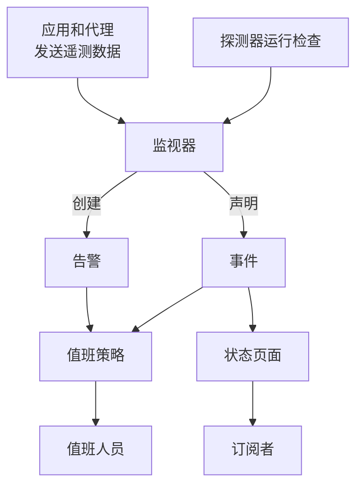

# 核心概念

OneUptime 有很多产品，但它们都建立在几个概念之上：项目、监视器、事件和告警、值班、状态页面以及遥测。本页用几句话解释每个概念，展示它们之间的联系，并链接到详细介绍它们的页面。读过一遍之后，文档中的其他页面都会更容易理解。

:::cards
- [项目和人员](#项目和人员): 一切存放在哪里，以及谁能做什么。
- [监视器和探测器](#监视器和探测器): OneUptime 如何发现问题。
- [事件和告警](#事件和告警): 团队开展工作所依据的记录。
- [值班](#值班): 呼叫谁、如何呼叫，以及下一个是谁。
:::

## 各部分如何联系

问题在 OneUptime 中沿着一个方向流动。探测器和你自己的遥测数据为监视器提供输入。监视器的条件决定何时出了问题，以及要打开什么：事件、告警，或两者兼有。值班策略就此呼叫相关人员，状态页面则把事件告知你的客户。

## 项目和人员

**项目** 包含一切：监视器、事件、值班策略、状态页面、遥测数据和设置。大多数公司只需要一个，也有一些公司为每个环境或业务部门各建一个。你在一个项目中创建的内容，在另一个项目中不可见。

你的 **账户** 独立于项目。一个账户使用一个邮箱和密码，可以属于任意数量的项目；使用左上角的项目选择器在它们之间切换。请参阅 [您的账户](/docs/introduction/your-account)。

人员通过 **团队** 加入项目，团队的权限决定其成员可以做什么。每个新项目一开始都有三个团队：包含你在内的 Owners，以及 Admin 和 Members。在 OneUptime Cloud 上，每个项目都有自己的套餐。

:::cards
- [用户、团队与权限](/docs/permissions/index): 邀请成员并决定他们可以做什么。
:::

## 监视器和探测器

**监视器** 检查你运行的某一样东西，并判断它是否正常工作。大多数监视器由 **探测器** 来检查：探测器是按计划运行检查的机器，例如请求页面、调用 API、ping 主机或查询数据库。OneUptime Cloud 在多个区域运行探测器，自托管安装运行自己的探测器，你也可以在自己的网络内添加自定义探测器。其他监视器则读取你发送的内容：来自应用的遥测数据，或者服务器、Kubernetes 集群和其他基础设施上的代理所报告的数据。

监视器的 **条件** 决定每个结果意味着什么。条件按顺序检查，第一个匹配的条件可以改变监视器的状态、声明事件、创建告警，或三者都做。每个新项目都有三种监视器状态：**运行正常**、**性能下降** 和 **离线**。

:::cards
- [创建监视器](/docs/monitor/create-monitor): 选择类型，说明要检查什么以及多久检查一次。
- [自定义探针](/docs/probe/custom-probe): 检查只有你自己的网络才能访问的内容。
:::

## 事件和告警

两者都记录一个问题，也都可以呼叫值班人员。区别在于问题影响的是谁。

| | 事件 | 告警 |
| --- | --- | --- |
| **是什么** | 影响用户的问题，例如服务中断或变慢 | 需要团队在用户受影响之前调查的问题 |
| **在状态页面上** | 可以显示，并通知订阅者 | 从不显示 |
| **初始状态** | **Identified**、**已确认**、**已解决** | **Identified**、**已确认**、**已解决** |
| **初始严重性** | Critical Incident、Major Incident、Minor Incident | **High**、**Low** |

确认表示已经有人在处理，并阻止值班策略呼叫下一级。解决则将其关闭。你可以添加自己的状态和严重性，并把告警关联到它们最终被证明所属的事件。

**片段** 将相关的事件或相关的告警归为一组，让团队把它们作为一个整体处理。分组规则决定哪些属于同一组。

:::cards
- [事件概览](/docs/incidents/index): 事件如何被声明、处理和解决。
- [关联的告警](/docs/incidents/linked-alerts): 把一次故障引发的告警关联到它的事件。
:::

## 值班

**值班策略** 决定针对事件或告警呼叫谁，以及没人响应时下一个呼叫谁。它的 **升级规则** 就是它的级别：每一级先呼叫其人员，然后等待有人确认，再呼叫下一级。一个级别可以呼叫人员、团队或 **值班计划**，值班计划是一种轮换，随时都知道谁在值班。

如何联系每个人由他们自己决定。在 **用户设置** 中，每个人都保存了 OneUptime 可以联系他们的方式，例如邮件、短信、电话、推送通知、Slack 或 Microsoft Teams，以及被呼叫时使用其中哪些方式。

:::cards
- [升级规则](/docs/on-call/escalation-rules): 逐级呼叫人员，直到有人响应。
- [值班计划](/docs/on-call/schedules): 轮换、层级和交接。
:::

## 状态页面和维护

**状态页面** 向客户展示你的服务是否正常工作。你选择它显示哪些监视器，并使用客户能理解的名称。当其中某个监视器上有活动事件时，页面会显示它，其 **订阅者** 会通过邮件、短信、Slack、Microsoft Teams 或 Webhook 收到通知。状态页面可以是公开的，也可以只对你允许的人开放。

**计划维护** 提前公布计划中的工作。一个维护事件会依次经历 **已计划**、**进行中**、**已结束** 和 **已完成**，显示它的状态页面会告知访问者和订阅者。

:::cards
- [状态页概览](/docs/status-pages/index): 创建状态页面并决定它显示什么。
- [订阅者与公告](/docs/status-pages/subscribers): 通知谁，以及何时通知。
:::

## 遥测

**遥测** 是你的系统发送给 OneUptime 的内容：日志、指标、追踪、异常和性能剖析。应用通过 OpenTelemetry 发送，OneUptime 的代理则从主机、Kubernetes 集群、Docker 主机和其他基础设施发送。每个发送方都使用一个 **摄取密钥**，它在 **项目设置 → 遥测与 APM → 摄取密钥** 下创建。你可以搜索遥测数据、在仪表板上绘制图表，并用遥测监视器监控它；遥测监视器会像其他监视器一样产生事件和告警。

:::cards
- [OpenTelemetry](/docs/telemetry/open-telemetry): 从你的应用发送日志、指标和追踪。
- [日志监控](/docs/monitor/logs-monitor): 当日志中出现某种模式时收到通知。
:::

## 自动化与 AI

- **工作流** 在发生某些事情时运行操作，例如在声明事件时向 Slack 发帖。
- **运行手册** 把响应流程变成团队可以手动或自动执行的步骤。
- **OneUptime AI** 调查新的事件和告警，并把发现发布到它们的时间线上；**Ask AI** 回答关于你项目的问题。新项目默认开启 AI；**项目设置 → 人工智能 → AI Features** 下的 **启用 AI** 开关可以把它全部关闭。

:::cards
- [工作流概览](/docs/workflows/index): 通过触发器和组件自动执行操作。
- [AI SRE](/docs/ai/ai-sre): OneUptime AI 如何调查事件和告警。
:::

## 标签和所有者

**标签** 是你添加到监视器、事件、状态页面和大多数其他资源上的标记，用于筛选和分组。团队的权限可以限定在带有某些标签的资源上。**所有者** 是对某个资源负责的人员和团队：当该资源发生情况时，他们会收到通知。标签规则和所有者规则会自动为新资源添加标签和所有者。

:::cards
- [标签与所有者规则](/docs/configuration/label-and-owner-rules): 自动为新资源添加标签并分配所有者。
:::

## 后续步骤

:::cards
- [快速开始](/docs/introduction/quickstart): 在十五分钟内把这些概念付诸实践。
- [首页与快捷键](/docs/introduction/home): 在仪表板中找到每个产品。
- [创建监视器](/docs/monitor/create-monitor): 你的第一个监视器，逐个字段讲解。
- [事件概览](/docs/incidents/index): 监视器声明事件之后会发生什么。
:::
