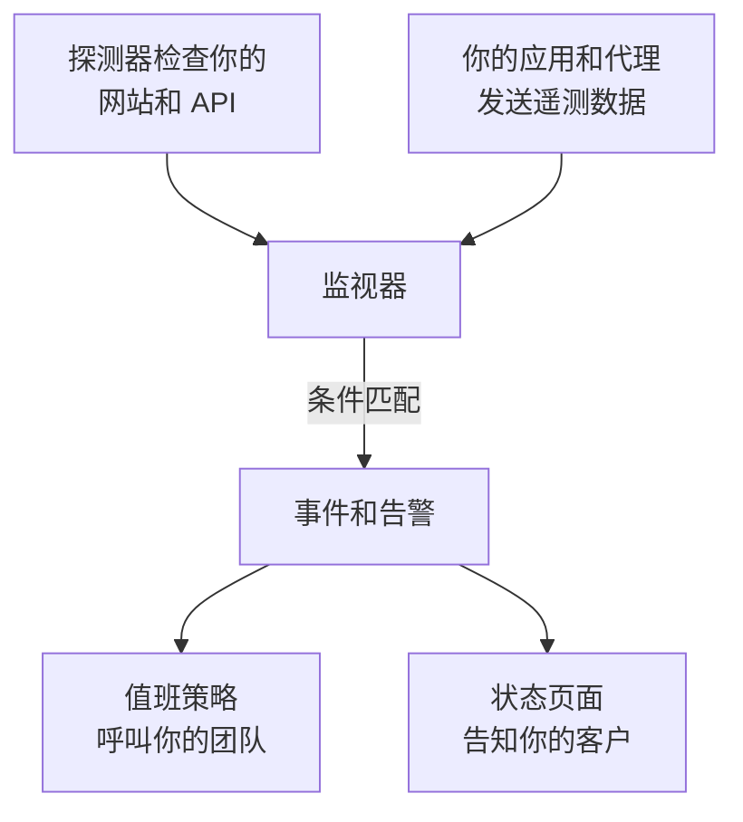

# 入门指南

OneUptime 是一个开源的可观测性平台。它检查你的网站、API 和服务器是否正常工作，收集你的应用发送的日志、指标和追踪，在出现故障时呼叫值班人员，并通过状态页面告知你的客户。这一切都在同一个产品中完成，因此发现问题的工具也正是呼叫你团队的工具。你可以使用 OneUptime Cloud，也可以在自己的服务器上运行它。

从这里开始：

:::cards
- [快速开始](/docs/introduction/quickstart): 监控一个网站，在它出故障时收到呼叫，并发布一个状态页面。
- [核心概念](/docs/introduction/core-concepts): 其他一切所依赖的几个概念，以及它们之间的联系。
- [首页与快捷键](/docs/introduction/home): 在仪表板中找到方向，以及帮你少点几下的按键。
- [您的账户](/docs/introduction/your-account): 你的个人资料、密码、通行密钥和双因素身份验证。
:::

## OneUptime 如何协同工作

一切都从你要关注的对象开始。监视器按计划检查它，或读取它发送的遥测数据。当监视器的条件匹配时，OneUptime 会声明事件或创建告警，呼叫值班人员，并在你需要时把事件显示在状态页面上。

- **事件** 是影响用户的问题。它可以呼叫值班人员，并显示在你的状态页面上。
- **告警** 是需要团队在用户察觉之前调查的问题。它同样可以呼叫值班人员，但从不显示在状态页面上。

[核心概念](/docs/introduction/core-concepts) 用几句话解释每个部分。

## 浏览文档

文档的组织方式与侧边栏相同，共九个部分。选择你需要的部分。

### 监控

:::cards
- [监视器](/docs/monitor/create-monitor): 从全球各地的探测器检查网站、API、端口、DNS、NTP 服务器、证书等。
- [基础设施监视器](/docs/monitor/server-monitor): 监控服务器、Kubernetes、Docker、VMware、网络设备和存储。
- [遥测监视器](/docs/monitor/logs-monitor): 根据你发送的日志、指标、追踪、异常和性能剖析发出告警。
- [SLO](/docs/slo/introduction): 跟踪可靠性目标、错误预算和消耗速率。
- [探测器](/docs/probe/custom-probe): 从你自己的网络内部运行检查。
- [当 OneUptime 未接收到数据时](/docs/monitor/when-oneuptime-is-not-receiving): 为什么 OneUptime 一侧的数据缺口永远不会算作你的停机时间。
:::

### 事件响应

:::cards
- [事件](/docs/incidents/index): 声明、协调和解决事件，并保留完整的时间线。
- [值班](/docs/on-call/schedules): 轮换、升级规则，以及何时呼叫谁。
- [状态页面](/docs/status-pages/index): 通过公开或私有的状态页面让客户了解情况。
- [工作区连接](/docs/workspace-connections/slack): 在 Slack 和 Microsoft Teams 中处理事件。
:::

### 可观测性

:::cards
- [遥测](/docs/telemetry/open-telemetry): 使用 OpenTelemetry 发送日志、指标和追踪，并进行搜索。
- [基础设施代理](/docs/telemetry/kubernetes-agent): 为 Kubernetes、主机、Docker、Proxmox、VMware 等安装代理。
- [云](/docs/telemetry/cloud-environments): 观测 ECS、Cloud Run、Azure Container Apps 和其他托管平台。
- [AI 可观测性](/docs/telemetry/ai-llm-observability): 跟踪你的 AI 的对话，并在它回答得不好时收到通知。
- [安全](/docs/telemetry/security-events): 收集安全事件和威胁情报。
- [真实用户监控](/docs/rum/index): 借助 Core Web Vitals 和会话回放，衡量真实用户的体验。
- [仪表板](/docs/dashboards/index): 用你的指标、日志和监视器构建仪表板。
- [资产清单](/docs/inventory/overview): 查看 OneUptime 所知道的每个服务、主机和设备。
:::

### 自动化与 AI

:::cards
- [运行手册](/docs/runbooks/index): 把响应流程变成团队可以执行的步骤。
- [表单](/docs/forms/index): 让任何人通过表单报告问题，表单会创建一个事件。
- [工作流](/docs/workflows/index): 在 OneUptime 中发生某些事情时自动执行操作。
- [AI](/docs/ai/ai-sre): 让 OneUptime AI 调查事件和告警，并向它询问你的系统。
:::

### 集成

:::cards
- [集成](/docs/integrations/index): 连接 Jira、ServiceNow、Grafana、Datadog、Huntress、SIEM 工具、Discord、Telegram、IRC 等。
:::

### 开发者

:::cards
- [API 参考](/docs/api-reference/api-reference): 通过 REST API 自动化 OneUptime。
- [CLI](/docs/cli/index): 从终端和 CI 管理 OneUptime。
- [Terraform 提供程序](/docs/terraform/index): 以代码方式管理监视器、状态页面和值班。
:::

### 管理

:::cards
- [用户与权限](/docs/permissions/index): 邀请成员、组织团队，并控制他们可以做什么。
- [身份](/docs/identity/sso): 通过 SAML 或 OIDC 单点登录登录，并通过 SCIM 预配用户。
- [配置](/docs/configuration/label-and-owner-rules): 自动为资源添加标签并分配所有者。
- [电子邮件](/docs/emails/smtp): 通过你自己的 SMTP 服务器发送 OneUptime 的邮件。
- [移动和桌面应用](/docs/mobile-desktop-apps/index): 在 iOS、Android、macOS、Windows 和 Linux 上接收呼叫并响应。
:::

### 自托管

:::cards
- [安装](/docs/installation/docker-compose): 安装、规划规模并升级你自己的 OneUptime。
- [自托管部署](/docs/self-hosted/architecture): 你自己的安装的架构、集成和企业版功能。
:::

## 从其他工具迁移

### 带上你现有的配置

**项目设置 → 从其他工具导入** 会读取你在其他工具中的配置，使用 API 密钥，对于 Uptime Kuma 则使用文件。它会显示找到的内容，并创建你勾选的项目。其他工具中的任何内容都不会改变，再次运行导入也绝不会重复创建任何东西。

| 迁移来源 | OneUptime 读取的内容 |
| --- | --- |
| [Opsgenie](/docs/moving-to-oneuptime/opsgenie) | 用户、团队、排班、升级和服务 |
| [PagerDuty](/docs/moving-to-oneuptime/pagerduty) | 用户、团队、排班、升级策略和服务 |
| [incident.io](/docs/moving-to-oneuptime/incident-io) | 用户、团队、排班、升级路径、服务和事件设置 |
| [Splunk On-Call](/docs/moving-to-oneuptime/splunk-on-call) | 用户、团队、轮换和升级策略 |
| [Grafana OnCall](/docs/moving-to-oneuptime/grafana-oncall) | 用户、团队、排班和升级链 |
| [UptimeRobot](/docs/moving-to-oneuptime/uptimerobot) | 监视器和公开状态页面 |
| [Atlassian Statuspage](/docs/moving-to-oneuptime/atlassian-statuspage) | 页面、其组件和分组，以及邮件订阅者 |
| [Better Stack](/docs/moving-to-oneuptime/better-stack) | 监视器、心跳、状态页面和邮件订阅者 |
| [Pingdom](/docs/moving-to-oneuptime/pingdom) | 正常运行时间检查 |
| [StatusCake](/docs/moving-to-oneuptime/statuscake) | 正常运行时间、SSL 和心跳检查 |
| [Uptime Kuma](/docs/moving-to-oneuptime/uptime-kuma) | 监视器，来自备份或指标页面 |

### OneUptime 可以替代什么

| 能力 | 作用 | 可替代的工具 |
| --- | --- | --- |
| 正常运行时间监控 | 从全球各地检查可用性和响应时间。 | Pingdom、UptimeRobot |
| 状态页面 | 向客户展示你的服务的当前状态和历史。 | Atlassian Statuspage |
| 事件管理 | 从头到尾处理事件，包括备注、所有者和时间线。 | incident.io |
| 值班与告警 | 安排值班班次，并持续升级直到有人响应。 | PagerDuty、Opsgenie |
| 日志管理 | 收集、搜索和可视化日志。 | Loggly |
| 工作流 | 自动执行操作，并把 OneUptime 连接到你已在使用的工具。 | Zapier |
| 应用性能监控 | 跟踪链路追踪、响应时间、吞吐量和错误率。 | New Relic、Datadog |
| 错误跟踪 | 将异常连同堆栈跟踪和上下文一起分组。 | Sentry |

## 后续步骤

:::cards
- [快速开始](/docs/introduction/quickstart): 设置你的第一个监视器、值班策略和状态页面。
- [核心概念](/docs/introduction/core-concepts): 学习其他所有页面都会用到的术语。
- [首页与快捷键](/docs/introduction/home): 在仪表板中找到任何页面、设置或操作。
- [Docker Compose](/docs/installation/docker-compose): 在你自己的服务器上运行 OneUptime。
:::
