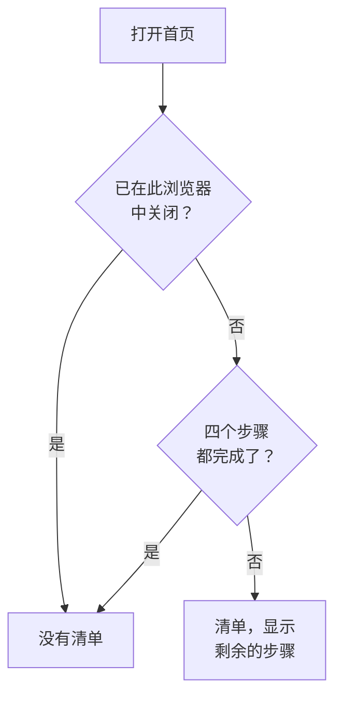

# 首页与快捷键

首页是你在项目中看到的第一个页面。它让你一眼就知道现在是否有需要你处理的事情，并引导新项目完成初始设置。本页介绍首页显示的内容、如何在仪表板中找到任何产品、页面或操作，以及能让你少在菜单中来回的键盘快捷键。

:::cards
- [首页显示的内容](#首页显示的内容): 欢迎清单、五个磁贴和活动事件。
- [四处浏览](#四处浏览): 产品菜单，以及每个页面顶部的栏。
- [搜索](#搜索页面设置或操作): 输入名称即可找到任何页面、设置或操作。
- [键盘快捷键](#键盘快捷键): 按两个键即可前往首页、监视器或事件。
:::

## 首页显示的内容

在顶部栏中打开 **首页**，或在任意位置按 `g` 再按 `h`。首页从上到下显示：

1. **欢迎使用 OneUptime 👋**：新项目的清单，完成之前一直显示。
2. 五个磁贴，统计需要关注的内容。
3. **活动事件**：所有尚未解决的事件。

### 欢迎清单

清单引导你完成项目发挥作用之前需要的四件事。每个步骤都会打开完成它的页面，并在项目具备它所要求的内容时自动勾选。

| 步骤 | 完成条件 | 打开 |
| --- | --- | --- |
| **创建您的第一个监视器** | 项目中有一个监视器。 | **创建监视器** 表单；对于不能创建监视器的人，则是 **监视器** 列表。 |
| **发布状态页面** | 项目中有一个状态页面。 | **状态页面** |
| **邀请您的团队** | 除你之外，项目中还有其他人，或已邀请了其他人。 | **用户** |
| **设置值班策略** | 项目中有一个值班策略。 | **值班** |

在步骤下方，**OneUptime 如何运作** 按问题流经的顺序展示四个核心产品：**监视器**、**事件与警报**、**值班** 和 **状态页面**。点击其中一个即可打开。

四个步骤全部完成后，清单就会消失。要提前隐藏它，请点击 **关闭**。关闭会在此浏览器中针对此项目被记住；步骤打开的所有内容仍然在 **产品** 菜单中。

### 磁贴

每个磁贴统计某样东西，告诉你它是否需要你处理，并打开数字背后的列表。

| 磁贴 | 统计内容 | 计数为零时 |
| --- | --- | --- |
| **活跃事件** | 尚未解决的事件 | **一切正常** |
| **活跃警报** | 尚未解决的告警 | **一切正常** |
| **无法运行的监视器** | 状态不属于运行正常类状态的监视器。已归档的监视器不计入。 | **全部运行正常** |
| **进行中的维护** | 正在进行的计划维护事件 | **暂无进行中** |
| **有风险的 SLO** | 已开启且有风险或已用完错误预算的 SLO | **预算健康** |

计数大于零时显示 **需要关注**，维护和 SLO 磁贴上则分别显示 **进行中** 和 **预算正在消耗**。还没有监视器的项目会在监视器磁贴上看到 **还没有监视器**，没有 SLO 的项目会看到 **还没有 SLO**：空项目并不等同于健康的项目。此时这两个磁贴会打开 **监视器** 和 **SLOs** 列表，你可以在那里创建第一个。

### 首页的侧边菜单

首页旁边的侧边菜单包含相同的列表，每个都带有计数：

| 部分 | 页面 |
| --- | --- |
| **事件** | **活动事件** 和 **活动片段** |
| **警报** | **活动警报** 和 **活动片段** |
| **监视器** | **无法运行** |
| **计划事件** | **进行中** |

片段将相关的事件或告警归为一组，让你把它们作为一个整体处理。请参阅 [核心概念](/docs/introduction/core-concepts#事件和告警)。

## 四处浏览

OneUptime 中的一切都在顶部栏的 **产品** 下。菜单把各个分组列为同一个列表中的行，并且打开时总是展开第一个分组，即基础：监控、事件、警报、值班、状态页面、计划维护和 SLOs。其他每个分组（可观测性、AI、代码、资源、基础设施、仪表板与自动化和设置）都折叠为同一列表中的一行。每一行列出该分组包含的产品，并说明有多少个。点击一行即可展开或折叠它，也可以用方向键移到该行并按 **Enter**。

- **搜索能找到一切。** 在菜单的搜索框中输入，即可按名称、按功能，或按 `k8s`、`RUM` 这样的常用词找到任何产品。搜索也会查找折叠的分组。
- **从你所在的位置开始。** 你当前所在页面的分组会自动展开，最近打开的产品会列在顶部。
- **你的选择会保留。** 菜单会在你的浏览器中记住你展开或折叠了其他哪些分组。即使你折叠过基础分组，每次打开菜单时它都会重新展开。
- **在手机上**，菜单按钮以同样的方式列出产品：基础分组在顶部展开，其他每个分组都是一行，轻点即可展开。

### 顶部的栏

每个页面的顶部有两条栏。

| 位置 | 内容 |
| --- | --- |
| 左上 | 项目选择器：切换到你的另一个项目，或创建新项目。 |
| 右上 | **搜索** 和 **Ask AI**、显示当前需要你处理的事项（活动事件和告警、你正在值班的值班策略、待处理的邀请）的通知铃铛、**帮助**，以及你的头像，它会打开你的 [账户](/docs/introduction/your-account) 菜单。 |
| 其下方 | 左侧是 **首页** 和 **产品**，右侧是 **用户设置**：OneUptime 在此项目中联系你的方式。 |

**帮助** 会打开本文档（**文档**）和 **Keyboard shortcuts** 列表，并提供邮件和 Slack 支持。在手机等窄屏上，为节省空间，**搜索**、**Ask AI** 和 **帮助** 会被隐藏；铃铛和你的头像会保留。

## 搜索页面、设置或操作

按 **Cmd+K**（Mac）或 **Ctrl+K**（Windows 和 Linux），或点击顶部栏中的搜索图标，然后开始输入。搜索可以找到：

- **菜单中的每个页面**，按菜单给它的名称：API 密钥、危险区域、值班计划、事件严重性、你自己的通知方式。每个结果都会显示它所在的位置，例如 *项目设置 › 高级*，因此同名页面（事件、告警和监视器中的自定义字段）很容易区分。
- **操作**，按你想做的事：声明事件、创建监视器，或者打开危险区域的 Delete Project。会更改内容的操作只提供给有权执行它的人。
- **你的监视器、事件、告警、状态页面和值班策略**，按名称。

搜索会按你的本意理解你输入的内容：

- 大小写、重音符号、空格和连字符都不影响结果：*on-call*、*on call* 和 *oncall* 会找到相同的页面，单词顺序也不限。
- 它知道许多页面的其他叫法（英文）：*pager* 或 *escalation* 对应值班策略，*rota* 对应值班计划，*2fa* 对应双因素身份验证，*delete project* 对应危险区域。
- 加上产品名称可以缩小搜索范围：*incident custom fields* 会找到事件的自定义字段页面。
- 即使有小的拼写错误，例如 *incidnet*，在没有完全匹配的结果时，仍然能找到你想要的内容。

搜索框为空时，搜索会列出你最近打开的页面、操作和产品。

## 键盘快捷键

在仪表板的任意位置按 `?` 可查看所有快捷键，也可以打开 **帮助** 并选择 **Keyboard shortcuts**。在 Mac 上，`Mod` 是 Command 键；在 Windows 和 Linux 上，它是 Ctrl 键。

| 按键 | 作用 |
| --- | --- |
| `Mod` + `K` | 打开命令面板：搜索任何页面、设置或操作。 |
| `Mod` + `I` | 就你正在查看的内容询问 AI。 |
| `/` | 搜索此页面上的列表。 |
| `?` | 显示键盘快捷键。 |
| `Esc` | 关闭对话框或面板。 |

### 前往某个产品

按 `g`，然后按一个字母，即可直接前往某个产品。请在按下 `g` 后 1.5 秒内按下字母。

| 按键 | 前往 |
| --- | --- |
| `g` 然后 `h` | 首页 |
| `g` 然后 `m` | 监控 |
| `g` 然后 `i` | 事件 |
| `g` 然后 `a` | 警报 |
| `g` 然后 `o` | 值班 |
| `g` 然后 `s` | 状态页面 |
| `g` 然后 `e` | 计划维护 |
| `g` 然后 `d` | 仪表板 |
| `g` 然后 `l` | 日志 |
| `g` 然后 `t` | 跟踪 |

快捷键不会妨碍你。在字段中输入时，`?`、`/` 和 `g` 不起作用；对话框打开时，任何按键都不会离开当前页面，因此误按一个键不会让你丢失填了一半的表单。其他任何产品，只需用 `Mod` + `K` 搜索即可到达。

## 后续步骤

:::cards
- [快速开始](/docs/introduction/quickstart): 一步步完成欢迎清单。
- [您的账户](/docs/introduction/your-account): 你的个人资料、登录安全、语言和主题。
- [询问 AI](/docs/ai/ask-ai): Ask AI 能为你回答什么、做什么。
- [核心概念](/docs/introduction/core-concepts): 监视器、事件、告警和值班分别是什么。
:::
