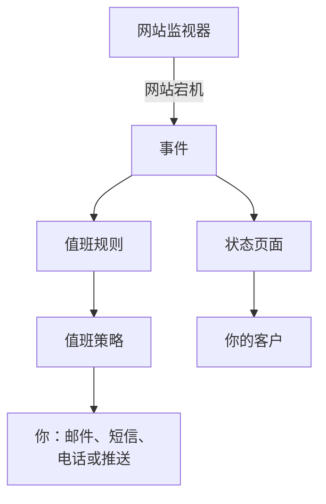

# 快速开始

本指南带你在大约十五分钟内，从一个新账户走到一套可用的配置：一个每五分钟检查一次网站的监视器，一个在网站宕机时呼叫你的值班策略，以及一个告知客户的状态页面。它按照项目首页上的 **欢迎使用 OneUptime 👋** 清单进行。

## 开始之前

- **一个账户。** 在 OneUptime Cloud 上，前往 [oneuptime.com](https://oneuptime.com/accounts/register) 注册，并打开发给你的邮件中的链接。在你自己的安装上，在浏览器中打开它并注册：第一个账户会成为主管理员。要安装 OneUptime，请参阅 [Docker Compose](/docs/installation/docker-compose)。
- **一个要监控的网站。** 任何通过 HTTP 或 HTTPS 应答的地址都可以，例如你公司的主页。

## 创建项目

OneUptime 中的一切都位于项目中：你的监视器、事件、值班策略、状态页面，以及处理它们的人员。

:::steps
### 开始一个新项目

第一次登录时，OneUptime 会显示 **没有项目**。点击 **创建新项目**。如果已有人邀请你加入某个项目，请改为在同一页面上接受邀请。

### 为它命名

输入 **项目名称**，例如你公司的名称。在 OneUptime Cloud 上，下一步会要求你选择一个套餐。

### 创建它

点击 **创建项目**。项目首页随即打开，顶部是 **欢迎使用 OneUptime 👋** 清单。
:::

## 监控你的网站

:::steps
### 打开创建监视器

在清单中点击 **创建您的第一个监视器**。你也可以从 **产品** 菜单打开 **监视器**，然后点击 **创建监视器**。

### 选择网站

在 **监视器类型** 下选择 **网站**。输入 **名称**，例如 `Website`，然后点击 **下一步**。

### 输入地址

在 **网站 URL** 中输入网站的完整地址，例如 `https://example.com`。OneUptime 会为你添加条件：当网站没有应答或返回错误时，监视器会变为 **离线** 并声明事件。点击 **下一步**。

### 创建监视器

保留已选的 **探测器**，以及 **监控间隔** 为 **每 5 分钟**，然后点击 **创建监视器**。监视器页面随即打开，探测器开始检查你的网站。
:::

要在保存前试运行检查，请在第二步点击 **测试监视器**。其他所有监视器类型都在 [创建监视器](/docs/monitor/create-monitor) 中介绍。

## 在网站宕机时收到呼叫

目前，没有所有者的事件会通过邮件发送给项目的所有者，其中也包括你。要在有人响应之前一直被呼叫，请创建一个值班策略，并让每个事件都呼叫它。

:::steps
### 创建值班策略

在清单中点击 **设置值班策略**，或从 **产品** 菜单打开 **值班**。点击 **创建值班策略** 并输入 **名称**。在 **首先通知谁？** 下点击 **添加响应人**，选择你自己。点击 **创建值班策略**。

### 为每个事件呼叫它

从 **产品** 菜单打开 **事件**，在侧边菜单中展开 **规则** 并选择 **值班规则**。点击 **创建Incident On-Call Rule**，输入 **名称** 并点击 **下一步**。将 **匹配条件** 留空，使规则匹配所有事件，然后点击 **下一步**。在 **值班策略** 下选择你的策略，然后点击 **创建Incident On-Call Rule**。

### 选择联系你的方式

你的登录邮箱已经是联系你的一种方式。若还想通过短信或电话联系你，请在顶部栏下方的栏中打开 **用户设置**，前往 **通知方式**，在 **Direct Contact** 选项卡上，把你的号码添加到 **电话号码 用于短信通知** 或 **用于电话通知的电话号码** 下。点击 **验证** 并输入 OneUptime 发给你的验证码。经过验证的号码会立即用于值班呼叫。
:::

> [!NOTE]
> 新项目中的短信和电话呼叫默认关闭。项目所有者、Billing Admin 或拥有 Manage Billing 权限的人，可以在 **项目设置 → 通知 → 通知设置** 下的 **通知渠道** 卡片中打开它们。

关于更多级别、轮换以及每个级别等待多久，请参阅 [升级规则](/docs/on-call/escalation-rules) 和 [值班计划](/docs/on-call/schedules)。

## 发布状态页面

:::steps
### 创建状态页面

在清单中点击 **发布状态页面**，或从 **产品** 菜单打开 **状态页面**。点击 **创建状态页面**，输入 **名称**，例如 `Acme Status`，然后点击 **创建状态页面**。

### 添加你的监视器

打开新的状态页面。在其侧边菜单的 **资源** 下选择 **监视器**；在启用了监视器组的项目中，它显示为 **资源**。点击 **添加监视器**，选择你的网站监视器，然后点击 **添加监视器**。这一行会向访问者显示监视器的名称；如有需要，可以在 **显示名称** 中修改。

### 打开页面

在侧边菜单中选择 **概览**。**Status Page Preview URL** 卡片链接到你的状态页面：打开它，你的网站会显示为运行正常。
:::

新的状态页面是公开的：任何拥有其地址的人都可以打开它。要使用你自己的域名、徽标和颜色，请参阅 [状态页品牌与域名](/docs/status-pages/branding-and-domains)。

## 邀请你的团队

在清单中点击 **邀请您的团队**，或从 **产品** 菜单的 **设置** 下打开 **用户**。点击 **邀请用户**，输入对方的 **电子邮件**，并选择一个 **团队**：默认选中的是成员团队。点击 **邀请**。OneUptime 会通过邮件向对方发送邀请，而团队决定对方可以做什么。请参阅 [用户、团队与权限](/docs/permissions/index)。

## 试一试

声明一个测试事件，看看整条链路如何运作。

:::steps
### 声明测试事件

打开 **事件** 并点击 **声明事件**。输入 **标题**，例如 `Test incident`，选择 **事件严重性**，然后点击 **下一步**。在 **监视器** 下选择你的网站监视器，这样事件就会显示在你的状态页面上。一直点击 **下一步** 直到摘要，然后点击 **声明事件**。

### 观察结果

一两分钟内，你的值班策略会呼叫你，事件也会显示在你的状态页面上。

### 解决它

在事件页面上点击 **解决**。呼叫停止，事件从你的状态页面上消失。
:::

> [!WARNING]
> 在你解决测试事件之前，任何打开你状态页面的人都会看到它。请在分享页面地址之前进行测试。

## 故障排查

:::details 我没有收到呼叫
打开事件，在其侧边菜单中选择 **值班执行**：它会显示你的策略是否运行，以及呼叫了谁。如果没有运行，请检查你的值班规则是否已启用并指定了该策略。如果运行了，请检查 **用户设置 → 通知方式** 下的方式是否已验证。
:::

:::details 事件没有显示在我的状态页面上
当事件的某个监视器在状态页面上时，状态页面才会显示该事件。请检查事件的受影响资源中是否列出了你的监视器，以及该监视器是否在状态页面上。
:::

:::details 监视器显示离线，但我的网站正常
打开监视器，查看探测器收到了什么。请参阅 [网站监控](/docs/monitor/website-monitor) 的故障排查部分。
:::

## 后续步骤

:::cards
- [核心概念](/docs/introduction/core-concepts): 你刚刚设置的内容背后的概念。
- [值班计划](/docs/on-call/schedules): 与团队分担值班。
- [状态页品牌与域名](/docs/status-pages/branding-and-domains): 让状态页面体现你的品牌。
- [OpenTelemetry](/docs/telemetry/open-telemetry): 从你的应用发送日志、指标和追踪。
:::
