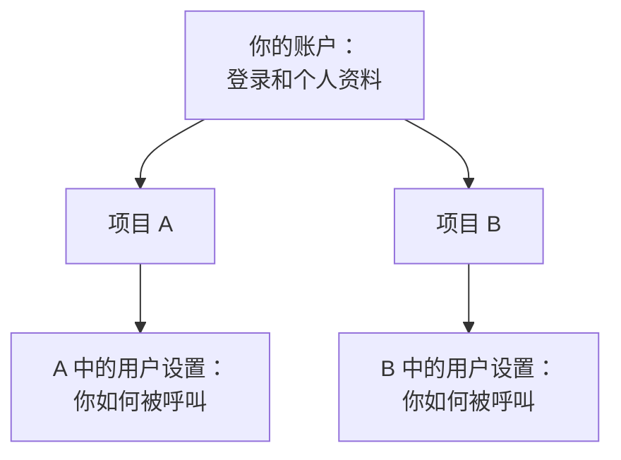

# 您的账户

你的账户是 OneUptime 认识你的方式：你用来登录的邮箱和密码、你的姓名和时区，以及保护你登录的措施。一个账户可以属于多个项目，这些设置会跟随你进入每一个项目。OneUptime 如何联系你、何时呼叫你，则在每个项目的 **用户设置** 中设置。

:::cards
- [你的个人资料](#你的个人资料): 你的姓名、邮箱、时区和头像。
- [安全登录](#安全登录): 你的密码、通行密钥和双因素身份验证。
- [你的项目](#你的项目): 切换项目、创建项目和接受邀请。
- [用户设置](#每个项目为你保存的内容): OneUptime 在每个项目中如何联系你。
:::

## 用户菜单

点击仪表板右上角你的头像。

| 菜单项 | 作用 |
| --- | --- |
| **个人资料** | 打开 **用户配置**：你的姓名、邮箱、时区、头像和登录安全。 |
| **管理员设置** | 打开 Admin Dashboard。只有自托管安装的主管理员才能看到它。 |
| **深色主题** | 将仪表板切换为深色主题。在深色主题下，该项显示为 **浅色主题**。 |
| **登出** | 让你退出登录。 |

**用户配置** 有自己的侧边菜单。**基础** 包含 **概览** 和 **头像**。**安全** 和 **危险区域** 是折叠的：点击分组的标题即可展开。

## 你的个人资料

:::steps
### 打开你的个人资料

点击右上角你的头像，然后选择 **个人资料**。**概览** 页面会打开并显示 **基本信息** 卡片：你的姓名、邮箱和时区。

### 编辑你的信息

点击 **编辑用户**，修改你需要的内容：

- **电子邮件**：你用来登录的地址。如果你修改了它，需要重新验证新地址。
- **全名**：你的团队在 OneUptime 各处看到的名字。
- **时区**：仪表板显示和读取时间所用的时区，也用于发给你的通知中的时间。

点击 **保存更改**。

### 添加头像

选择 **头像**，点击 **Update Profile Picture** 并上传图片。它会显示在你的用户菜单中，以及人员列表中你的名字旁边。
:::

> [!NOTE]
> 你第一次在某个浏览器上登录时，OneUptime 会把该浏览器的时区保存到你的个人资料中。如果你之后在浏览器时区不同的地方登录，仪表板会询问是否要 **更新时区**。关闭询问后，对于该时区它不会再问。

## 安全登录

在 **用户配置** 的侧边菜单中展开 **安全**。它有三个页面。

| 页面 | 用途 |
| --- | --- |
| **密码管理** | 设置新密码。 |
| **Passkeys** | 无需密码即可登录，使用指纹、面容、屏幕锁或安全密钥。 |
| **Two-factor authentication** | 在密码之后要求第二步：来自应用的验证码，或安全密钥。 |

### 更改密码

:::steps
1. 打开 **安全 → 密码管理**。
2. 在 **密码** 中输入新密码，并在 **确认密码** 中再输入一次。密码长度至少为 6 个字符。
3. 点击 **更新密码**。
:::

### 添加通行密钥

:::steps
1. 打开 **安全 → Passkeys** 并点击 **Add Passkey**。
2. 为它取一个你认得出的名字，例如你的设备或密码管理器的名称，然后点击 **Create Passkey**。
3. 按照浏览器的提示保存通行密钥。
:::

下次在登录页面上选择 **使用通行密钥登录**。

### 开启双因素身份验证

双因素身份验证在你使用密码登录时生效。先添加第二步，再开启它。

:::steps
### 添加身份验证器应用

打开 **安全 → Two-factor authentication**。在 **Authenticator apps** 下添加一个应用并为它命名。用 1Password、Google Authenticator 或 Microsoft Authenticator 等应用扫描二维码，输入它显示的 6 位验证码，然后点击 **Verify and finish**。如果想改用 USB 或 NFC 密钥，请在 **Security keys** 下添加。

### 保存备用码

你第一次添加应用、密钥或通行密钥时，OneUptime 会显示 **Your backup codes**。如果你丢失了应用或密钥，每个备用码可以让你登录一次。复制或下载它们，勾选表示你已保存的复选框，然后点击 **完成**。

### 开启它

在页面顶部点击 **Enable two-factor authentication** 并确认。卡片现在显示 **已启用**。从你下一次使用密码登录开始，OneUptime 会要求第二步。
:::

> [!TIP]
> 备用码快用完了？同一页面上的 **Regenerate codes** 会给你一组新的备用码，旧的备用码会立即失效。

## 你的项目

你可以属于任意数量的项目。仪表板左上角的项目选择器会列出它们：选择一个即可切换。

- **创建项目**：打开项目选择器并点击 **创建新项目**。在自托管安装上，管理员可以把创建项目的权限仅保留给管理员。
- **接受邀请**：有人邀请你时，右上角的铃铛会显示待处理的邀请，并打开 **项目邀请**。你可以在那里 **接受** 或 **Reject**。
- **离开项目**：请管理该项目用户的人，在项目的 **用户** 页面上使用 **从项目中移除** 将你移除。

## 每个项目为你保存的内容

**用户设置** 位于顶部栏下方那条栏的右侧，只属于你，并且每个项目各有一份。在你值班的每个项目中都打开它。

| 页面 | 用途 | 了解更多 |
| --- | --- | --- |
| **设置清单** | 引导你完成下面的所有内容，并显示还剩哪些要做。 | |
| **通知方式** | OneUptime 可以联系你的邮箱、电话号码、应用和 Webhook。你的登录邮箱会自动添加。 | |
| **值班规则** | 值班策略呼叫你时，使用哪种方式，以及多久之后使用。 | [升级规则](/docs/on-call/escalation-rules) |
| **通知设置** | 你通过哪个渠道接收关于事件、告警、监视器等的哪些更新。 | |
| **邮件偏好设置** | 你收到多少邮件：逐封发送，还是汇总发送。 | [通知汇总](/docs/emails/notification-rollup) |
| **值班日志** | 发给你的每一次呼叫，以及它的结果。 | |
| **来电号码** | 来电策略拨打给你的号码。 | [来电策略](/docs/on-call/incoming-call-policy) |
| **日历订阅** | 你在 Google 日历、Apple 日历或 Outlook 中的值班班次。 | [日历订阅源](/docs/on-call/calendar-feeds) |

## 语言和主题

两者都保存在你的浏览器中，而不是账户中，因此在其他浏览器或设备上需要重新设置。

- **语言**：仪表板以你浏览器的语言启动。要更改语言，请使用任意页面底部的语言菜单。本文档在顶部有自己的语言菜单。
- **主题**：在用户菜单中选择 **深色主题**。仪表板默认以浅色主题启动。

## 删除你的账户

打开 **危险区域 → 删除账户**。只有当你不属于任何项目时才能删除账户：该页面会列出你仍然所在的项目。先离开这些项目，然后点击 **删除账户** 并确认。删除账户是永久性的，无法撤销。

## 故障排查

:::details 我没有收到验证地址的邮件
再次登录会发送一个新链接：也请检查你的垃圾邮件文件夹。如果无法登录，请使用登录页面上的 **忘记密码？** 链接。重置链接同样会验证你的地址。
:::

:::details 我丢失了身份验证器应用
在登录的第二步，选择 **无法使用身份验证器？** 并输入你的一个备用码。然后打开 **安全 → Two-factor authentication** 并添加你的新应用。如果没有备用码，请让你的 OneUptime 安装的管理员为你的账户重置双因素身份验证。
:::

:::details 仪表板中的时间差了一个小时
仪表板使用你个人资料中的 **时区** 显示时间，而不是你电脑的时区。请在 **用户配置 → 概览** 中检查。
:::

## 后续步骤

:::cards
- [首页与快捷键](/docs/introduction/home): 在仪表板中找到方向。
- [升级规则](/docs/on-call/escalation-rules): 值班策略如何呼叫你。
- [用户、团队与权限](/docs/permissions/index): 是什么决定了你在项目中可以做什么。
- [SSO](/docs/identity/sso): 通过你公司的身份提供商登录。
:::
