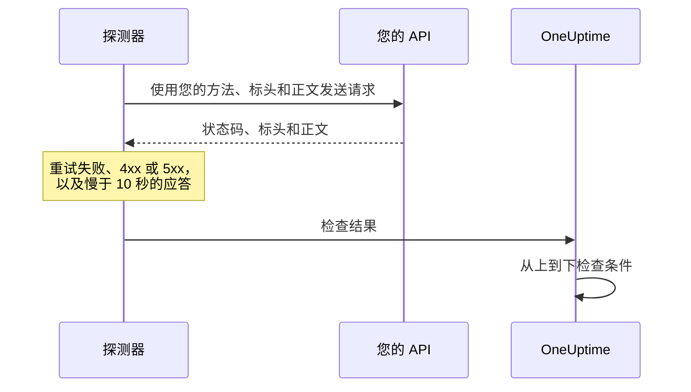

# API 监控

API 监视器按计划使用您选择的方法、标头和正文调用 HTTP 端点，并检查返回的内容：状态码、响应时间、标头和正文。可用于 REST、JSON 和 GraphQL 端点、健康检查，以及您的用户所依赖的任何调用。

:::cards
- [创建监视器](#创建-api-监视器): 在控制台中完成六个步骤。
- [配置选项](#配置选项): 方法、标头、正文、重定向、证书、超时和重试。
- [监控标准](#监控标准): 开箱即用时，什么算正常、什么算宕机。
- [故障排查](#故障排查): 本应通过的检查失败时。
:::

## 工作原理

每次检查时，探测器发送请求，跟随所有重定向，并记录状态码、响应时间、标头和正文。失败、超时、返回 `4xx` 或 `5xx` 状态，或耗时超过 10 秒的请求会被重试，最多重试您允许的次数。然后 OneUptime 用监视器的条件评估结果。



失去自身网络连接的探测器不会报告任何结果，因此它无法将您的 API 标记为离线。

## 开始之前

- **可以创建监视器的角色**：Project Owner、Project Admin、Project Member、Monitor Admin 或 Monitor Member，或者拥有 Create Monitor 权限的自定义角色。
- **能够访问该 API 的探测器。** 每个新监视器都会选中您项目的默认探测器。如果 API 前面有防火墙，请放行 [OneUptime Cloud 探测器 IP 地址](/docs/configuration/ip-addresses)。私有网络中的 API 需要在该网络内运行、并被允许访问私有地址的 [自定义探测器](/docs/probe/custom-probe)：请参阅 [私有网络访问](/docs/self-hosted/private-network-access)。
- **存为监视器密钥的凭据。** 如果 API 需要密钥或令牌，请先将其存储为 [监视器密钥](/docs/monitor/monitor-secrets)，这样监视器只保存对它的引用。

## 创建 API 监视器

:::steps
### 开始创建新监视器

前往 **监视器**，点击 **创建监视器**。在 **监视器类型** 下选择 **API**。

### 命名

输入 **名称**，例如 `Orders API`，然后点击 **下一步**。

### 输入请求

在 **API URL** 中输入端点的完整 URL，例如 `https://api.example.com/health`。选择 **API 请求类型**（除非您更改，否则为 **GET**）。要添加标头或正文，请展开 **更多字段** 并填写 **请求标头** 和 **请求正文（JSON 格式）**。

### 测试

点击 **测试监视器**，在 **选择探测器** 中选择一个探测器，然后点击 **运行测试**。**监视器测试结果** 会显示 API 的应答。

### 检查条件

**监视器条件** 从 [默认标准](#默认标准) 开始：API 没有应答或返回错误时为离线，返回任何 `2xx` 或 `3xx` 状态时为在线。要同时检查 API 返回的内容，请添加一个筛选器，然后点击 **下一步**。

### 选择探测器并创建

保留或修改 **探测器** 和 **监控间隔**（初始为 **每 5 分钟**），然后点击 **创建监视器**。监视器页面随即打开。
:::

## 配置选项

### API URL

要调用的端点，以包含协议的完整 URL 表示，例如 `https://api.example.com/v1/health`。您可以用 `{{monitorSecrets.NAME}}` 的形式在 URL 中放入 [监视器密钥](/docs/monitor/monitor-secrets)。

### 动态 URL 占位符

当 API 前面有 CDN 或缓存代理时，探测器可能从缓存而不是您的服务器得到应答。要绕过缓存，请在 URL 中添加占位符；探测器每次检查时都会把它替换为新值。

| 占位符 | 替换为 | 示例值 |
| --- | --- | --- |
| `{{timestamp}}` | 当前 Unix 时间（秒） | `1719500000` |
| `{{random}}` | 由 32 个十六进制字符组成的随机唯一字符串 | `3f2b8c1d9e7a4b6c8d0e1f2a3b4c5d6e` |

带占位符的 URL：

```text
https://api.example.com/health?cb={{timestamp}}
```

相隔五分钟的两次检查中，探测器请求的内容：

```text
https://api.example.com/health?cb=1719500000
https://api.example.com/health?cb=1719500300
```

`{{random}}` 的用法相同：`https://api.example.com/health?nocache={{random}}`。

### API 请求类型

要发送的 HTTP 方法。默认为 **GET**；其他方法有 **POST**、**PUT**、**PATCH**、**DELETE** 和 **HEAD**。如果 **HEAD** 请求得到 `4xx` 或 `5xx` 状态，探测器会改用 `GET` 重新发送。

### 更多字段

这些设置收起在 **更多字段** 中。收起的标题会列出它们，并显示您更改过哪些。

| 字段 | 默认值 | 作用 |
| --- | --- | --- |
| **请求标头** | 无 | 要发送的标头，以名称和值成对填写。每个标头点击一次 **添加Request Header**。 |
| **请求正文（JSON 格式）** | 无 | 作为正文发送的 JSON 对象，通常与 **POST**、**PUT** 或 **PATCH** 一起使用。必须是有效的 JSON。 |
| **不跟随重定向** | 关 | 判断第一个响应，而不是跟随重定向。请参阅 [下文](#不跟随重定向)。 |
| **允许自签名证书** | 关 | 对监视器自身的主机名跳过 TLS 证书验证。 |
| **使用客户端证书 (mTLS)** | 关 | 出示客户端证书和私钥。请参阅 [客户端证书 (mTLS)](#客户端证书-mtls)。 |
| **请求超时（秒）** | `60` | 每次尝试等待的时间。最长为 60 秒。 |
| **失败时重试** | 探测器默认值，通常为 `3` | 失败的尝试要重试多少次。最多为 3。请参阅 [重试和超时](#重试和超时)。 |

请求标头和请求正文可以使用 [监视器密钥](/docs/monitor/monitor-secrets)，例如值为 `Bearer {{monitorSecrets.ApiKey}}` 的 `Authorization` 标头。

#### 不跟随重定向

默认情况下，探测器会跟随重定向（`301`、`302`、`303`、`307` 和 `308`），最多 10 次，并判断最终得到的响应。打开 **不跟随重定向** 即可改为判断重定向响应本身。[默认标准](#默认标准) 将重定向响应视为在线。

跟随重定向时：

- `303`，或者对 `POST` 应答的 `301` 或 `302`，会像浏览器一样把请求变成不带正文的 `GET`。
- 您的请求标头只发送到 URL 自身的源（相同的协议、主机和端口）。重定向到其他源时不带这些标头。
- 如果请求仍带有正文，或者方法不是 `GET` 或 `HEAD`，重定向到其他源会使检查失败。
- **允许自签名证书** 会跟随停留在监视器自身主机名上的重定向。重定向到其他主机名时照常验证。

#### 客户端证书 (mTLS)

如果 API 要求双向 TLS，请打开 **使用客户端证书 (mTLS)** 并填写：

| 字段 | 填写内容 |
| --- | --- |
| **客户端证书 (PEM)** | 要出示的 PEM 编码客户端证书。 |
| **客户端私钥 (PEM)** | 与之匹配的 PEM 编码私钥。 |
| **客户端私钥密码** | 可选。仅当私钥已加密时填写的密码。 |

这相当于 curl 的 `--cert` 和 `--key` 参数：

```bash
curl --cert client.crt --key client.key https://api.example.com/health
```

要让密钥不出现在监视器的设置中，请将证书和密钥存储为 [监视器密钥](/docs/monitor/monitor-secrets)，并在这些字段中输入 `{{monitorSecrets.NAME}}`。密钥在服务器上填入，它们的值永远不会出现在控制台中。

只有当请求停留在 URL 的源上时，才会出示客户端证书。重定向到其他源之后，探测器会在没有证书的情况下继续。

#### 重试和超时

**失败时重试** 统计的是第一次尝试 _之后_ 的重试次数，因此 `0` 只运行一次检查，`2` 最多运行三次。留空时使用探测器的默认值：3，除非探测器的 `PROBE_MONITOR_RETRY_LIMIT` 另有设置。探测器在两次尝试之间等待一秒，每次尝试都有完整的 **请求超时（秒）**。

这些失败会被重试：连接错误、超时、`4xx` 和 `5xx` 响应，以及慢于 10 秒的响应。以下失败不会重试，因为再试也无法改变结果：无效或被阻止的 URL、超过 10 次的重定向，以及大于 512 KiB 的响应。

## 监控标准

条件决定 API 何时算作在线、性能下降或离线，以及是否因此声明事件或创建警报。每个条件检查一个或多个筛选器：

| 筛选器 | 条件 | 检查内容 |
| --- | --- | --- |
| **Is Online** | **是**、**否** | API 是否有应答，无论状态码是什么。 |
| **响应状态码** | **Equal To**、**Not Equal To**、**Greater Than**、**Less Than**、**Greater Than Or Equal To**、**Less Than Or Equal To** | HTTP 状态码。 |
| **响应时间（毫秒）** | **Greater Than**、**Less Than**、**Greater Than Or Equal To**、**Less Than Or Equal To** | 请求所用的时间，包括重定向。 |
| **响应主体** | **包含**、**Not Contains** | 响应正文中的文本。匹配区分大小写。 |
| **Response Header** | **包含**、**Not Contains** | 响应中是否有此名称的标头。以小写输入名称，例如 `x-request-id`。 |
| **Response Header Value** | **包含**、**Not Contains** | 某个标头的值是否恰好是此值，以小写比较，例如 `application/json`。 |
| **JavaScript Expression** | **Evaluates To True** | 针对响应的表达式。请参阅 [JavaScript 表达式](/docs/monitor/javascript-expression)。 |
| **Is Request Timeout** | **是**、**否** | 请求是否在每次尝试中都超时。 |

JSON 响应以紧凑形式检查，键和值之间没有空格。要用 **响应主体** 查找 `"status": "ok"`，请输入 `"status":"ok"`。

**添加条件** 会添加一个已按其筛选器命名的条件，例如 _Response Time (in ms) is above 3000_。在您输入自己的名称之前，名称会随筛选器变化。描述是可选的：要添加描述，请打开条件的 **设置**。

有两个或更多筛选器时，**匹配条件** 决定是 **全部** 筛选器都必须匹配，还是 **任意** 一个匹配即可。条件的 **操作** 决定它做什么：更改监视器状态、创建警报、声明事件，或其中任意几项。

### 默认标准

新的 API 监视器以两个条件开始，因此无需任何更改即可工作：

- **离线** — API 没有应答，或返回 `400` 及以上（或低于 `200`）的状态码。监视器被标记为 **离线** 并创建事件。API 恢复后，事件会自行解决。
- **在线** — API 返回任何 `2xx` 或 `3xx` 状态码，例如 `200`、`201`、`202` 或 `204`。监视器被标记为 **运行正常**。

在条件列表中，它们以监视器命名：_Check if (name) is offline_ 和 _Check if (name) is online_。

因此，返回 `201 Created` 或 `204 No Content` 的端点都算作正常。如果对您来说只有一个状态码表示健康，请在监视器的 **配置 → 标准** 页面上修改这两个条件：例如在线条件中使用 **响应状态码** / **Equal To** / `200`，离线条件中使用 **Not Equal To** / `200`，替换各自原有的两个状态码筛选器。要同时检查 API 返回的内容，请在离线条件中添加 **响应主体** 或 **JavaScript Expression** 筛选器。

条件从上到下检查，第一个匹配的条件决定接下来发生什么。

没有条件匹配时，监视器回到它的默认状态：**运行正常**，除非您在条件下方的 **更多字段** 中选择了其他状态。收起的 **更多字段** 标题会显示是哪个状态。

在 OneUptime 更改这些默认值之前创建的监视器保留创建时的条件，只把 `200` 视为在线。通过 API 或 Terraform 创建的监视器使用您发送的条件。

### 在一段时间内评估

**在一段时间内评估此条件** 是筛选器下方的复选框，适用于 **Is Online**、**响应状态码** 和 **响应时间（毫秒）**。打开它即可判断过去一段时间内的检查，而不只是最近一次：在 **评估** 中选择聚合方式，在 **在过去（分钟）** 中选择 2 到 60 分钟的时间窗口。

| 聚合 | 匹配条件 |
| --- | --- |
| **平均值**、**总和**、**Maximum Value**、**Minimum Value** | 该数值在整个窗口内满足条件。仅限数值筛选器。 |
| **All Values** | 窗口内的每次检查都满足条件。 |
| **Any Value** | 窗口内至少有一次检查满足条件。 |

**All Values** 只有在窗口真正被数据覆盖后才会匹配。刚创建的监视器，或者检查已不再被记录的监视器，没有足够的历史来说明过去 N 分钟的情况，因此条件会等待，而不是根据手头仅有的一个读数匹配。**Any Value** 用于“只要有一次检查超出阈值就立即告诉我”，并且仍会立即触发。

**如果无数据** 决定在窗口无法支撑条件时发生什么：

| 选项 | 会发生什么 | 适用于 |
| --- | --- | --- |
| **Ignore**（默认） | 条件不匹配。 | 普通的阈值告警。 |
| **触发器** | 缺失的数据本身被视为问题。 | 沉默本身就是故障的检查。 |
| **Treat As Zero** | 将窗口按单个零值比较。 | 没有事件确实意味着零的计数器。 |

### 示例条件

| 目标 | 筛选器 | 条件 | 值 |
| --- | --- | --- | --- |
| API 变慢时标记为性能下降 | **响应时间（毫秒）** | **Greater Than** | `1000` |
| 健康检查报告问题时为离线 | **响应主体** | **Not Contains** | `"status":"ok"` |
| 同样的检查，从解析后的 JSON 中读取 | **JavaScript Expression** | **Evaluates To True** | `"{{responseBody.status}}" !== "ok"` |
| `POST` 只接受 `201` | **响应状态码** | **Equal To** | `201` |

## 故障排查

:::details API 会应答我的请求，但监视器显示离线
探测器得到的应答与您不同。事件的根本原因，以及监视器上的 **监视日志**，会显示探测器看到的内容。请检查探测器是否发送了 API 期望的内容：方法、`Authorization` 标头和正文。API 前面的防火墙或限流器也可能阻止探测器：请放行 [OneUptime Cloud 探测器 IP 地址](/docs/configuration/ip-addresses)。
:::

:::details 监视器按原样发送 `{{monitorSecrets.NAME}}`
监视器无法使用该密钥，或者名称不匹配。关于谁可以使用密钥，请参阅 [监控密钥](/docs/monitor/monitor-secrets)。
:::

:::details 检查失败并显示 "unsafe cross-origin redirect"
API 把带有正文、或方法不是 `GET` 或 `HEAD` 的请求重定向到了其他源，而探测器不会转发这类请求。让监视器指向 API 重定向到的 URL，或者打开 **不跟随重定向** 并检查重定向本身。
:::

:::details 检查失败并显示 "Remote response exceeded the allowed size."
探测器最多读取响应的 512 KiB，而这个响应更大。调用返回内容更少的端点，例如使用更小的分页大小。
:::

## 后续步骤

:::cards
- [JavaScript 表达式](/docs/monitor/javascript-expression): 检查 JSON 响应深处的字段。
- [监控密钥](/docs/monitor/monitor-secrets): 让 API 密钥和令牌不出现在监视器设置中。
- [网站监控](/docs/monitor/website-monitor): 检查网页而不是端点。
- [事件与告警模板](/docs/monitor/incident-alert-templating): 把响应细节放进事件和警报标题。
:::
