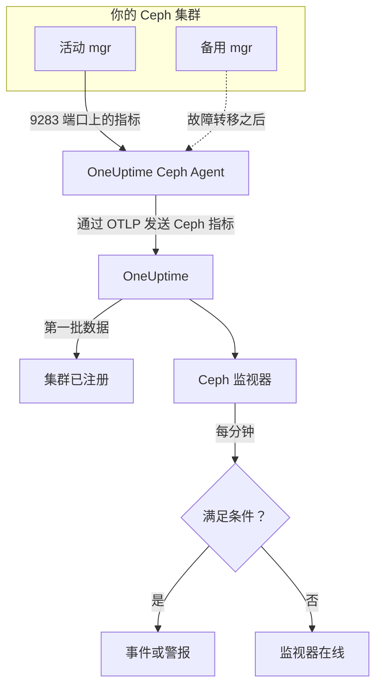

# Ceph 监控

Ceph 监视器负责监视一个 Ceph 集群（健康状态、健康检查、mon 仲裁、OSD、存储池和归置组），并在健康状态下降、OSD 宕机或容量不足的那一刻通知你。它读取由 Ceph mgr 的 `prometheus` 模块导出、由 OneUptime Ceph Agent 收集的 `ceph_*` 指标，因此不会从外部探测任何东西。

:::cards
- [创建监视器](#创建-ceph-监视器): 在仪表板中完成的六个步骤。
- [模板](#预置警报模板): 23 个现成的警报，涵盖健康状态、OSD、归置组和容量。
- [健康检查](#健康检查序列): 按名称对任意 Ceph 健康检查发出警报。
- [指标](#收集的指标): 监视器可以据以发出警报的每个 `ceph_*` 序列。
:::

## 工作原理

Ceph mgr 的 `prometheus` 模块在 9283 端口上提供集群的指标。OneUptime Ceph Agent 每 30 秒抓取一次每个 mgr 守护进程（活动的 mgr 会响应，备用 mgr 在接管之前不返回任何内容），保留 Ceph 自己的标签（`ceph_daemon`、`pool_id`），并通过 OTLP 把指标发送到 OneUptime，附上集群名称 `ceph.cluster.name`。第一批数据到达时，集群即完成注册。

Ceph 监视器绑定到一个集群。它每分钟对该集群的指标运行一次查询，并把结果与其条件进行比较。



## 开始之前

- 在集群上**启用 mgr 的 `prometheus` 模块**：

  ```bash
  ceph mgr module enable prometheus
  ```

- 在一台能通过 9283 端口访问每个 mgr 守护进程的机器上**安装 Ceph Agent**，并在 `CEPH_MGR_ENDPOINTS` 中列出所有守护进程。安装方法见 [Ceph 代理指南](/docs/telemetry/ceph)。
- **确认集群已注册。** 首次抓取大约一分钟后，它会以代理的 `CEPH_CLUSTER_NAME` 为名称，出现在**产品 → 基础设施 → Ceph → 所有集群**下。
- **要使用健康检查警报**，请运行 Ceph Quincy 或更高版本。更早的版本不会导出 `ceph_health_detail`。

## 创建 Ceph 监视器

:::steps
### 新建监视器

前往**监视器**，点击**创建监视器**。

### 选择 Ceph

在**监视器类型**下点击**更多监视器类型**，然后在**基础设施**下选择 **Ceph**，或在搜索框中输入 `ceph`。输入**名称**（它会用于事件和警报的标题），然后点击**下一步**。

### 选择集群

在 **Ceph Monitor Configuration** 下，从 **Ceph Cluster** 中选择集群。所有发送过数据的集群都在列表中。

### 选择要监视的内容

从三个选项卡中选择一个：

- **Quick Setup**：点击一个[模板](#预置警报模板)。模板会设置指标、过滤器、聚合、时间范围和阈值，并用自己的条件替换下面的条件。之后仍可以修改**时间范围**。
- **Custom Metric**：从 **Ceph Metric** 中选择一个指标，然后设置**聚合**和**时间范围**。**OSD** 和 **Pool ID** 可以把范围缩小到一个守护进程或一个存储池。
- **高级**：在**选择指标**下自己构建查询和公式，例如用 `ceph_cluster_total_used_bytes / ceph_cluster_total_bytes` 计算已用容量比例。用 **Group by** 指定 `ceph_daemon` 或 `pool_id`，即可分别判断每个守护进程或存储池。

### 检查条件

打开**监视器条件**下的每个条件，检查其**指标**、**聚合**、**条件**和 **Threshold**。模板会自动填写这些内容。使用 **Custom Metric** 或**高级**时，监视器从[默认条件](#默认条件)开始，而默认条件只会注意到指标降到零，所以请设置自己的阈值。

### 创建监视器

点击**创建监视器**。OneUptime 会打开监视器的页面，并每分钟评估一次。它产生的事件和警报也会列在集群的**事件**和**警报**页面上。
:::

> [!TIP]
> 要一次设置多个模板，请从**产品 → 基础设施 → Ceph** 打开集群，然后进入 **Recommendations**。选择所需的模板和要呼叫的人，OneUptime 会为每个模板创建一个监视器。

## 监视器设置

| 字段 | 选项卡 | 作用 |
| --- | --- | --- |
| **Ceph Cluster** | 全部 | 必填。把每个查询限定到 `resource.ceph.cluster.name`。 |
| **OSD** | Custom Metric、高级 | 可选。与 `ceph_daemon` 标签精确匹配，例如 `osd.3`。 |
| **Pool ID** | Custom Metric、高级 | 可选。与 `pool_id` 标签精确匹配，例如 `2`。 |
| **Ceph Metric** | Custom Metric | [目录](#收集的指标)中的一个指标。 |
| **聚合** | Custom Metric | 样本的合并方式：**平均值**、**最大值**、**最小值**、**总和**或**计数**。初始值为该指标的常用聚合。 |
| **时间范围** | 全部 | 查询读取的滚动窗口，从 **Past 1 Minute** 到 **Past 365 Days**。新监视器从 **Past 1 Minute** 开始；模板会设置自己的值。 |
| **选择指标** | 高级 | 查询构建器：**指标**、**Aggregate by**、**Filter by attributes**、**Group by**，以及用于组合查询的**添加指标**和**添加公式**。 |

存储池的数据序列只带有 `pool_id` 标签：存储池的名称只存在于 `ceph_pool_metadata` 中。请按 `pool_id` 过滤和分组存储池序列，需要名称时再到 `ceph_pool_metadata` 中查找。

### 健康检查序列

`ceph_health_detail` 导出的是**每个活动健康检查一个序列**，带有 `name`（例如 `OSD_NEARFULL` 或 `RECENT_CRASH`）和 `severity` 标签。序列只在其检查触发期间存在，所以没有序列就表示健康。要对任意 Ceph 健康检查发出警报，请按其 `name` 过滤，在**最大值**高于 `0` 时触发，并把**如果无数据**设为 **Treat As Zero**，在 `0` 时恢复——健康检查模板正是这样构建的。`ceph_daemon_health_metrics` 以同样的方式按守护进程工作，以 `type` 标签（例如 `SLOW_OPS`）和 `ceph_daemon` 为键。

## 预置警报模板

**Quick Setup** 提供 23 个模板，涵盖集群健康状态、OSD、归置组和容量。每个模板都会构建一个完整的监视器——查询、标签过滤器、分组、一个触发条件和一个恢复条件。阈值只是起点，可以编辑。

除非表格另有说明，模板读取过去 5 分钟的数据。只有当条件在窗口内的每一分钟都成立时才会触发；带阈值的条件要回到阈值另一侧 10% 处才会恢复，这样在边界附近徘徊的值不会来回抖动。**严重程度**是选择器中显示的标签；模板创建的事件和警报，会以你项目中最严重的事件严重程度和警报严重程度开始。

### 集群健康状态模板

| 模板 | 严重程度 | 监视内容 | 触发条件 | 恢复条件 |
| --- | --- | --- | --- | --- |
| Cluster Health Error | 严重 | `ceph_health_status`，Max，过去 1 分钟 | 2 或以上：`HEALTH_ERR` | 低于 1.8：`HEALTH_WARN` 或更好 |
| Cluster Health Warning | Warning | `ceph_health_status`，Max | 1 或以上：`HEALTH_WARN` 或更差 | 低于 0.9：`HEALTH_OK` |
| Monitor Quorum Degraded | 严重 | `ceph_mon_quorum_status`，按 `ceph_daemon` 取 Min，过去 1 分钟 | 某个 mon 降到 1 以下，退出仲裁。每个 mon 一个事件 | 回到 1 |
| Slow Operations | Warning | `ceph_healthcheck_slow_ops`，Max | 高于 0：集群的 `SLOW_OPS` 检查处于活动状态 | 为 0 |
| Daemon Slow Operations | Warning | `type = SLOW_OPS` 的 `ceph_daemon_health_metrics`，按 `ceph_daemon` 取 Max | 高于 0。每个 OSD 或 mon 一个事件 | 序列消失 |
| Daemon Crash | 严重 | `name = RECENT_CRASH` 的 `ceph_health_detail`，Max | 检查处于活动状态：存在未归档的守护进程崩溃。mgr 没有 `ceph_crash_*` 指标，所以这是唯一的崩溃信号 | 崩溃已归档 |
| Monitor Clock Skew | Warning | `name = MON_CLOCK_SKEW` 的 `ceph_health_detail`，Max | 检查处于活动状态：mon 的时钟偏差超过允许值（默认 0.05 秒） | 检查消失 |
| Monitor Disk Critically Low | 严重 | `name = MON_DISK_CRIT` 的 `ceph_health_detail`，Max | 检查处于活动状态：mon 数据库磁盘的可用空间低于 5%（默认值） | 检查消失 |
| Monitor Disk Space Low | Warning | `name = MON_DISK_LOW` 的 `ceph_health_detail`，Max | 检查处于活动状态：可用空间低于 30%（默认值） | 检查消失 |

### OSD 模板

| 模板 | 严重程度 | 监视内容 | 触发条件 | 恢复条件 |
| --- | --- | --- | --- | --- |
| OSD Down | 严重 | `ceph_osd_up`，按 `ceph_daemon` 取 Min | 某个 OSD 降到 1 以下。每个 OSD 一个事件 | 回到 1 |
| OSD Out | Warning | `ceph_osd_in`，按 `ceph_daemon` 取 Min | 某个 OSD 降到 1 以下：被标记为退出数据分布 | 回到 1 |
| OSD High Latency | Warning | `ceph_osd_apply_latency_ms`，按 `ceph_daemon` 取 Avg | 高于 100 ms。每个 OSD 一个事件 | 不高于 90 ms |
| OSD Slow Heartbeats | Warning | `name = OSD_SLOW_PING_TIME_FRONT` 和 `name = OSD_SLOW_PING_TIME_BACK` 的 `ceph_health_detail`，Max | 任一检查处于活动状态：公共网络或集群网络上的心跳变慢。mgr 不导出 ping 时间指标 | 两个检查都消失 |

### 归置组模板

| 模板 | 严重程度 | 监视内容 | 触发条件 | 恢复条件 |
| --- | --- | --- | --- | --- |
| Inactive Placement Groups | 严重 | `ceph_pg_total` − `ceph_pg_active`，按 `pool_id` 取 Max | 高于 0：PG 无法处理 I/O，发往它们的客户端请求会挂起。每个存储池一个事件 | 为 0 |
| Degraded Placement Groups | Warning | `ceph_pg_degraded`，按 `pool_id` 取 Max | 高于 0：对象的副本数少于配置值 | 为 0 |
| Undersized Placement Groups | Warning | `ceph_pg_undersized`，按 `pool_id` 取 Max | 高于 0：PG 映射到的 OSD 少于其副本数 | 为 0 |
| Damaged Placement Groups | 严重 | `name = PG_DAMAGED` 和 `name = OSD_SCRUB_ERRORS` 的 `ceph_health_detail`，Max | 任一检查处于活动状态：清洗（scrub）发现了损坏或读取错误 | 两个检查都消失 |

### 容量模板

| 模板 | 严重程度 | 监视内容 | 触发条件 | 恢复条件 |
| --- | --- | --- | --- | --- |
| Cluster Near Full | Warning | `ceph_cluster_total_used_bytes` ÷ `ceph_cluster_total_bytes` × 100 | 高于 85%，即 Ceph 默认的 nearfull 比例 | 不高于 76.5% |
| Cluster Full | 严重 | 同一比例 | 高于 95%，即 Ceph 默认的 full 比例，此时整个集群停止写入 | 不高于 85.5% |
| Pool Near Full | Warning | `ceph_pool_stored` ÷ (`ceph_pool_stored` + `ceph_pool_max_avail`) × 100，按 `pool_id` | 高于存储池可容纳量的 85%。每个存储池一个事件 | 不高于 76.5% |
| OSD Nearfull | Warning | `name = OSD_NEARFULL` 的 `ceph_health_detail`，Max | 检查处于活动状态：某个 OSD 超过 nearfull 阈值（默认 85%）。单个 OSD 会远早于集群平均值被写满 | 检查消失 |
| OSD Backfillfull | Warning | `name = OSD_BACKFILLFULL` 的 `ceph_health_detail`，Max | 检查处于活动状态：向该 OSD 的回填被拒绝（默认 90%），恢复停滞 | 检查消失 |
| OSD Full | 严重 | `name = OSD_FULL` 的 `ceph_health_detail`，Max，过去 1 分钟 | 检查处于活动状态：某个 OSD 达到 full 阈值（默认 95%），写入被拒绝 | 检查消失 |

- **宕机和仲裁模板使用最小值**，因此一个宕机的 OSD 或一个退出仲裁的 mon 就会触发它们，而不会被健康的多数掩盖。
- **计数和健康检查模板使用最大值**，因此一次异常的抓取就足够了。
- **PG 和存储池序列按存储池划分**：没有集群级的指标，所以这些模板按 `pool_id` 分组，并为每个存储池打开一个事件。
- **容量比例**对两边都取**总和**。两边来自同一次 mgr 抓取，所以结果是真实的百分比。**Inactive Placement Groups** 则按存储池取**最大值**，因为在减法中求和会把多次抓取累加起来。
- **健康检查模板**在检查消失时恢复：它们的恢复条件把缺失的序列计为 0。

有些警报没有模板。PG 不均衡需要跨序列的统计，而条件无法计算这种统计。容量预测需要增长拟合，这由集群的仪表板来绘制。磁盘故障预测和清洗滞后没有 mgr 指标，而 NVMe-oF、RBD 镜像和 cephadm 需要其他导出器。

## 收集的指标

代理每 30 秒抓取一次每个 mgr 守护进程，并保留 Ceph 自己的标签，因此按守护进程的序列带有 `ceph_daemon`（`osd.3`、`mon.a`），按存储池的序列带有 `pool_id`。

### 集群健康状态指标

| 指标 | 单位 | 说明 |
| --- | --- | --- |
| `ceph_health_status` | — | 整体健康状态：0 = `HEALTH_OK`，1 = `HEALTH_WARN`，2 = `HEALTH_ERR`。 |
| `ceph_health_detail` | 计数 | 每个**活动**健康检查一个序列，带有 `name` 和 `severity` 标签。仅限 Quincy 及更高版本。 |
| `ceph_healthcheck_slow_ops` | 计数 | `SLOW_OPS` 检查报告的 OSD 和 mon 慢操作。 |
| `ceph_daemon_health_metrics` | 计数 | 按守护进程的健康指标，以 `type`（例如 `SLOW_OPS`）和 `ceph_daemon` 为键。 |
| `ceph_mon_quorum_status` | 计数 | mon 在仲裁中时为 1，按 `ceph_daemon`（例如 `mon.a`）。 |
| `ceph_mon_metadata` | 计数 | mon 元数据，始终为 1。求和即可统计 mon 数量。 |
| `ceph_cluster_total_bytes` | 字节 | 总原始容量。 |
| `ceph_cluster_total_used_bytes` | 字节 | 已使用的原始容量。 |

### OSD 指标

| 指标 | 单位 | 说明 |
| --- | --- | --- |
| `ceph_osd_up` | 计数 | OSD 处于 up 状态时为 1，按 `ceph_daemon`（例如 `osd.3`）。 |
| `ceph_osd_in` | 计数 | OSD 在数据分布中时为 1。 |
| `ceph_osd_apply_latency_ms` | ms | 把操作应用到后端存储所用的时间。 |
| `ceph_osd_commit_latency_ms` | ms | 把操作提交到日志或 WAL 所用的时间。 |
| `ceph_osd_stat_bytes` | 字节 | OSD 设备的原始容量。 |
| `ceph_osd_stat_bytes_used` | 字节 | OSD 上已使用的原始字节数。与总量比较，可以发现不均衡或接近写满的 OSD。 |
| `ceph_osd_numpg` | 计数 | OSD 上的归置组。 |
| `ceph_osd_metadata` | 计数 | OSD 元数据（主机名、设备类别、版本），始终为 1。求和即可统计 OSD 数量。 |

### 存储池指标

| 指标 | 单位 | 说明 |
| --- | --- | --- |
| `ceph_pool_stored` | 字节 | 存储池中存储的用户数据。 |
| `ceph_pool_max_avail` | 字节 | 考虑到存储池的复制或纠删码配置后，仍可写入该存储池的字节数。 |
| `ceph_pool_objects` | 计数 | 存储池中的对象。 |
| `ceph_pool_rd` | 操作数 | 存储池上的读取操作。累计计数器。 |
| `ceph_pool_wr` | 操作数 | 存储池上的写入操作。累计计数器。 |
| `ceph_pool_rd_bytes` | 字节 | 从存储池读取的字节数。累计计数器。 |
| `ceph_pool_wr_bytes` | 字节 | 写入存储池的字节数。累计计数器。 |
| `ceph_pool_metadata` | 计数 | 存储池元数据，始终为 1——唯一把 `pool_id` 映射到名称的序列。 |

### 归置组指标

每个 `ceph_pg_*` 序列都按存储池划分，带有 `pool_id` 标签；对所有存储池求和即可得到集群级的数量。

| 指标 | 单位 | 说明 |
| --- | --- | --- |
| `ceph_pg_total` | 计数 | 存储池中的归置组。 |
| `ceph_pg_active` | 计数 | 处于 `active` 状态、能够处理 I/O 的 PG。 |
| `ceph_pg_clean` | 计数 | 处于 `clean` 状态、已完全复制的 PG。 |
| `ceph_pg_degraded` | 计数 | 处于 `degraded` 状态的 PG。 |
| `ceph_pg_undersized` | 计数 | 处于 `undersized` 状态的 PG。 |
| `ceph_num_objects_degraded` | 计数 | 副本数少于配置值的对象。 |
| `ceph_num_objects_misplaced` | 计数 | 不在 CRUSH 期望位置上的对象。数据是安全的，只是位置不对。 |

## 监控条件

条件把监视器的某个查询或公式与阈值进行比较。Ceph 监视器的条件没有**过滤器类型**：每条规则都检查指标值，并包含以下字段。

| 字段 | 作用 |
| --- | --- |
| **指标** | 要检查的查询或公式，按其变量名指定。 |
| **聚合** | 窗口中的值如何变成一个结果：**平均值**、**总和**、**Maximum Value**、**Minimum Value**、**All Values**（每个值都必须满足）或 **Any Value**（一个就够）。 |
| **条件** | **Greater Than**、**Less Than**、**Greater Than Or Equal To**、**Less Than Or Equal To** 或 **Equal To**，或者异常条件：**Anomalously High**、**Anomalously Low** 或 **Anomalous**。 |
| **Threshold** | 要比较的值。如果指标有单位，旁边会有一个单位列表。异常条件下不显示。 |
| **灵敏度** | 仅限异常条件。**Low**（4σ）、**Medium**（3σ，默认）或 **High**（2σ）。 |
| **基线窗口** | 仅限异常条件。14 天（默认）、28 天、60 天或 90 天的历史。 |
| **如果无数据** | 位于**更多字段**下。窗口中没有样本时的处理方式：**Ignore**（默认）、**Treat As Zero** 或**触发器**。 |

异常条件把每个值与基线中一周内同一时段的值进行比较。在基线窗口积累足够的历史之前，它们保持 "Learning" 状态，不会产生任何东西。

每个条件还规定匹配时要做什么：更改监视器状态、创建警报或宣布事件。条件从上到下依次检查，第一个匹配的条件决定结果。

### 默认条件

不是从模板构建的监视器以两个条件开始：

| 顺序 | 条件 | 匹配时机 | 然后 |
| --- | --- | --- | --- |
| 1 | Check if _监视器名称_ is offline | 第一个查询的任一值为 `0` | 把监视器标记为**离线**，并宣布事件 "_监视器名称_ is offline"，该事件会在监视器恢复时自动解决。 |
| 2 | Check if _监视器名称_ is online | 任一值大于 `0` | 把监视器标记为**运行正常**。 |

这些默认条件适用的 Ceph 指标很少：集群健康时 `ceph_health_status` 为 0。请选择一个模板，或设置自己的条件。

> [!IMPORTANT]
> 静默不匹配任何条件：停止发送数据的集群会让监视器保持原状。要在数据停止时收到通知，请在某个条件上把**如果无数据**设为**触发器**。

## 故障排除

:::details 集群不在 Ceph Cluster 列表中
集群会根据代理的数据自动注册。检查代理是否正在运行并发送数据（参见 [Ceph 代理指南](/docs/telemetry/ceph)），以及是否设置了 `CEPH_CLUSTER_NAME`。
:::

:::details mgr 故障转移后指标停止
代理必须抓取**每个** mgr 守护进程，而不仅是活动的那个：备用 mgr 在接管之前不返回任何内容。在 `CEPH_MGR_ENDPOINTS` 中列出每个 mgr。
:::

:::details ceph_health_status 为 1，但没有任何触发
检查条件使用的是 **Greater Than Or Equal To** `1`，而不是 **Greater Than**，并且监视器的**时间范围**至少覆盖一次 30 秒的抓取。
:::

:::details 健康检查模板从不触发
监视 `ceph_health_detail` 的模板——Daemon Crash、Monitor Clock Skew、OSD Nearfull、OSD Backfillfull、OSD Full、两个 mon 磁盘模板、Damaged Placement Groups 和 OSD Slow Heartbeats——需要 Quincy 或更高版本的 mgr `prometheus` 模块。在检查处于活动状态时，确认该序列存在：

```bash
curl http://ACTIVE_MGR:9283/metrics | grep ceph_health_detail
```

健康检查序列（包括 `ceph_daemon_health_metrics`）只在检查触发期间存在，因此集群健康时找不到它们是正常的。
:::

:::details ceph_pool_wr_bytes 之类的计数器只增不减
存储池 I/O 序列是累计计数器，而条件比较的是原始值：没有速率运算符，查询构建器中的 **Convert to per-second rate** 只改变图表。可以把它们画成速率，或用公式对其增长发出警报，例如同一计数器的**最大值**查询减去**最小值**查询。
:::

## 后续步骤

:::cards
- [Ceph 代理](/docs/telemetry/ceph): 安装和升级此监视器读取的代理。
- [Proxmox 监控](/docs/monitor/proxmox-monitor): 监视使用该存储的 Proxmox VE 集群。
- [存储阵列监控](/docs/monitor/storage-array-monitor): 适用于 Pure Storage 阵列的同类监视器。
- [事件](/docs/incidents/index): 条件宣布事件之后会发生什么。
:::
