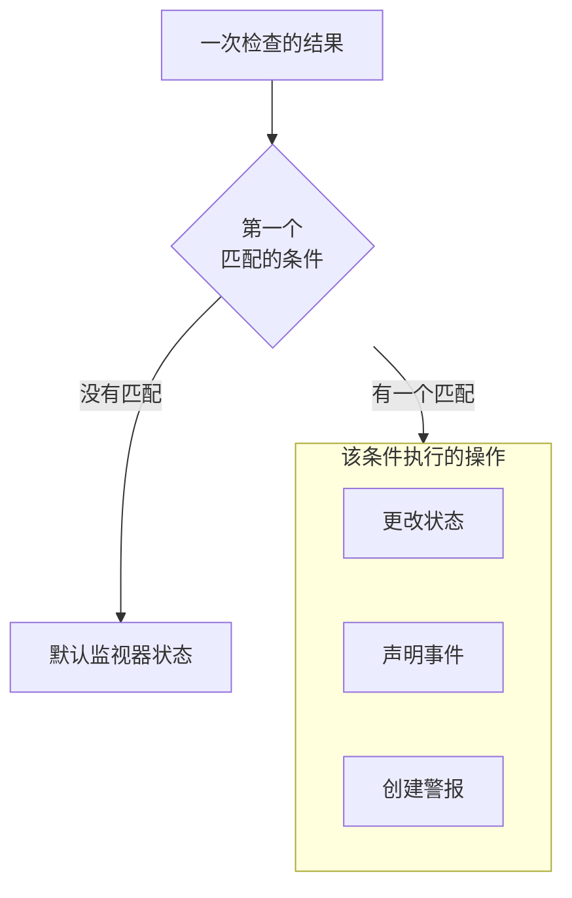

# 创建监视器

监视器会检查您运行的对象，例如网站、API、主机或 Kubernetes 集群，并在它停止工作时通知您。**创建监视器** 先问要监控什么，再问要检查什么，最后问多久检查一次。除了类型、名称和要检查的对象，其余内容都以适合大多数监视器的默认值开始。

> [!NOTE]
> 要创建监视器，您需要 Project Owner、Project Admin、Project Member、Monitor Admin 或 Monitor Member 角色，或者拥有 Create Monitor 权限的自定义角色。

## 监视器信息

第一步询问要监控什么，以及监视器叫什么名字。

:::steps
### 打开创建监视器

前往 **监视器**，点击 **创建监视器**。表单在第一步 **监视器信息** 上打开。

### 选择监视器类型

第一个问题是 **监视器类型**：您想监控什么？

- 最常创建的六种类型排在最前面：**网站**、**API**、**Ping**、**端口**、**SSL Certificate**，以及用于 cron 任务和 webhook 心跳的 **Incoming Request**。
- **更多监视器类型** 会按类别列出所有其他类型，例如 **基础设施**（Kubernetes、Docker、主机）和 **遥测**（日志、指标、追踪）。由您自己设置状态的监视器 **Manual** 位于 **其他** 下。
- 也可以在搜索框中输入。它认识您平时使用的词，例如 `k8s`、`postgres`、`heartbeat` 或 `tls`，按 **Enter** 即选中第一个结果。

选中的类型会收起为一行。点击 **更改** 可以选择其他类型；在选择过程中按 **Escape** 会保留原来的类型。

### 为监视器命名

填写 **名称**。它会用在警报和事件标题中。**描述** 和 **标签** 是可选的，位于 **更多字段** 中。

**Manual** 监视器不需要其他内容，因此 **创建监视器** 就在这一步。对于其他任何类型，请点击 **下一步**。
:::

## 标准

第二步询问要检查什么，并决定什么算作问题。

:::steps
### 输入要检查的对象

这一步从要检查的对象开始。对于网站，就是它的 URL，输入框中会显示示例；其他类型会要求填写主机、查询、集群或日志筛选条件。大多数监视器从不更改的设置（例如超时和重试）收起在 **更多字段** 中。

对于由探测器检查的监视器，**测试监视器** 会在保存前运行一次检查：在 **选择探测器** 中选择一个探测器，然后点击 **运行测试**。结果会在 **监视器测试结果** 中打开。

### 检查条件

下方的 **监视器条件** 决定监视器何时更改状态、声明事件或创建警报。新监视器以适合大多数监视器的条件开始，每个条件都收起为一行，说明它检查什么、做什么。例如，当网站没有响应或返回错误状态码时，新的网站监视器会被标记为离线并声明事件。

点击某个条件即可展开并修改。**添加条件** 会添加一个已展开、可以直接填写的条件。要更改顺序，请拖动条件左侧的手柄。

### 进入下一步

点击 **下一步**。在您点击 **下一步** 之前，这一步不会把任何内容标记为缺失。
:::

### 如何评估条件

每次检查的结果会从上到下经过各个条件，第一个匹配的条件决定接下来发生什么。该条件可以更改监视器的状态、声明事件、创建警报，或三者的任意组合。没有条件匹配时，监视器显示其 **默认监视器状态**，它在条件下方的 **更多字段** 中设置（除非您选择其他状态，否则为 **运行正常**）。

设置为自动解决的事件和警报（默认条件就是如此）会在其条件不再匹配时自行解决。由多个探测器检查的监视器只有在探测器意见一致时才会改变：默认情况下，每个已启用且已连接的探测器都必须得到相同的结果。要减少所需的数量，请在监视器的 **配置 → 探测器与间隔** 页面上设置 **探测器一致性**。

## 探测器与间隔

由探测器检查的监视器以这一步结束：网站、API、Ping、IP、端口、SSL Certificate、DNS、DNSSEC、NTP、域名、SQL Query、Database Health、Synthetic Monitor、Custom JavaScript Code 和 External Status Page。**探测器** 是运行检查的机器，您项目的默认探测器已预先选中。**监控间隔** 从 **每 5 分钟** 开始。

:::steps
### 选择探测器

保留已选中的 **探测器**，或选择其他探测器。没有探测器的监视器永远不会被检查。要检查私有网络中的对象，请在该网络内运行 [自定义探测器](/docs/probe/custom-probe) 并在这里选择它。

### 选择检查频率

选择 **监控间隔**，从 **每分钟** 到 **每周**。Synthetic Monitor、Custom JavaScript Code 和 SSL Certificate 监视器只提供 5 分钟或更长的间隔。

### 完成创建

点击 **创建监视器**。新监视器的页面随即打开。以后要更改它的探测器或间隔，请在该页面上打开 **配置 → 探测器与间隔**。
:::

除 Manual 以外的其他所有类型都在 **标准** 这一步创建。

## 从模板或链接开始

监视器模板，以及 OneUptime 中其他地方（指标图表、网络设备或检测规则上）用于创建监视器的链接，会打开已选好类型、其余内容也已填好的 **创建监视器**。点击 **更改** 可以选择其他类型。模板自己的表单使用相同的类型选择器：请参阅 [监视器模板](/docs/monitor/monitor-templates)。

每种监视器类型都有自己的页面，介绍其设置、默认条件和示例。接下来可以看看：

:::cards
- [网站监控](/docs/monitor/website-monitor): 检查页面是否加载，以及它返回什么。
- [API 监控](/docs/monitor/api-monitor): 使用方法、标头和正文调用端点。
- [监视器模板](/docs/monitor/monitor-templates): 从一个配置创建许多监视器，并让它们保持一致。
- [事件](/docs/incidents/index): 监视器声明事件之后会发生什么。
:::
