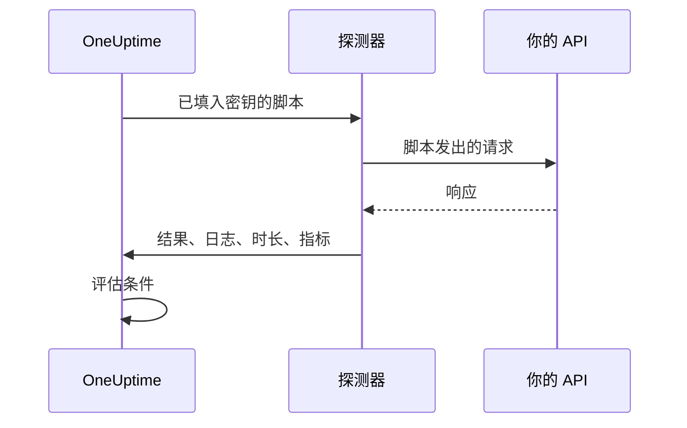

# 自定义代码监控

自定义代码监视器按计划从探测器运行你编写的 JavaScript 脚本。用它来完成其他监视器类型无法表达的检查：先登录再调用需要认证的 API、多步骤的事务，或者根据多个响应计算出的值。如果脚本抛出异常，检查就会失败；脚本返回的内容可供你的条件和事件模板使用。

:::cards
- [创建监视器](#创建自定义代码监视器): 编写脚本，并选择运行它的探测器。
- [编写脚本](#编写脚本): 从一个可直接运行的多步骤 API 检查开始。
- [使用密钥](#使用监控密钥): 不把密码和令牌写进脚本。
- [记录自定义指标](#自定义指标): 把脚本计算出的任何数字绘制成图表。
:::

## 工作原理

每次检查时，探测器都会在一个隔离的 JavaScript 沙箱中运行你的脚本，监控密钥已经预先填入。脚本调用它需要的一切，然后返回结果或抛出错误。探测器上报结果、脚本的日志消息、运行时长以及记录的指标，OneUptime 再据此评估你的条件。



沙箱不是 Node.js：没有 `require`、`process`、`fetch`，也没有文件系统，只有[下面列出的模块](#脚本中可用的模块)。

## 开始之前

- 一个能访问脚本所调用的每个端点的 **探测器**。对于你网络内部的端点，请使用[自定义探测器](/docs/probe/custom-probe)。
- 要调用私有地址（例如 `10.0.0.5`），探测器必须允许这样做：在该探测器上设置 `PROBE_ALLOW_PRIVATE_NETWORK_MONITORS=true`。环回地址、链路本地地址和云元数据地址始终会被拒绝。请参阅 [私有网络访问](/docs/self-hosted/private-network-access)。
- 脚本需要的所有密码、API 密钥和令牌，都应保存为 [监控密钥](/docs/monitor/monitor-secrets)。

## 创建自定义代码监视器

:::steps
### 开始一个新监视器

进入 **监视器**，点击 **创建监视器**。在 **监视器类型** 下点击 **更多监视器类型**，然后在 **Synthetic Monitoring** 下选择 **Custom JavaScript Code**，或在搜索框中输入 `script`。输入 **名称**，然后点击 **下一步**。

### 添加脚本

在 **JavaScript 代码** 编辑器中编写脚本。可以从[下面的示例](#编写脚本)开始。

### 测试

点击 **测试监视器**，从探测器运行一次脚本并查看结果。

### 检查条件

监视器一开始有两个条件：脚本失败时变为离线并宣布一个事件，没有失败时变为在线。你可以修改它们或添加自己的条件（参见[条件](#条件)），然后点击 **下一步**。

### 选择探测器并创建

选择能访问你的端点的 **探测器** 和 **监控间隔**（自定义代码监视器提供 5 分钟或更长的间隔），然后点击 **创建监视器**。
:::

## 编写脚本

脚本是一个 `async` 函数的函数体：你可以在顶层使用 `await`，用 `return` 返回结果，用 `throw` 让检查失败。下面的示例先登录，再用拿到的令牌调用一个端点，如果响应不符合预期就失败：

```javascript title="Custom code monitor script"
// 1. Log in. axios rejects a 4xx or 5xx response, which fails the check.
const login = await axios.post("https://api.example.com/v1/login", {
  username: "monitoring@example.com",
  password: "{{monitorSecrets.ApiPassword}}",
});

// 2. Call an endpoint that needs the token.
const orders = await axios.get("https://api.example.com/v1/orders?limit=10", {
  headers: { Authorization: `Bearer ${login.data.token}` },
  timeout: 10000,
});

// 3. Fail the check when the data is wrong, not only when the request fails.
if (!Array.isArray(orders.data.items)) {
  throw new Error("The orders endpoint returned no items");
}

console.log(`Fetched ${orders.data.items.length} orders`);

// 4. Return what the criteria and incident templates should see.
return {
  data: orders.data.items.length,
};
```

| 目的 | 做法 | OneUptime 记录的内容 |
| --- | --- | --- |
| 上报结果 | 用任意 JSON 值 `return { data: ... }` | **结果**。只保留 `data` 属性：`return 5` 不会记录任何结果。 |
| 让检查失败 | `throw new Error("...")` | **脚本错误**，默认条件会把它变成事件。 |
| 留下痕迹 | `console.log(...)` | **日志消息**，每次运行最多 1,000 条。 |

要查看一次运行，请打开监视器的 **概览**：**监视器摘要** 卡片显示探测器、执行时间和错误，**显示更多详情** 会显示结果、脚本错误和日志消息。**监视日志** 中有以往检查的相同摘要。

> [!NOTE]
> 这个沙箱中的 `axios` 不会跟随重定向，其请求也不会经过探测器上配置的代理。请直接请求最终的 URL。

## 使用监控密钥

在脚本中的任何位置用 `{{monitorSecrets.NAME}}` 引用密钥。OneUptime 会在脚本到达探测器之前，把引用替换为密钥的值，并且是纯文本。因此，要把密钥当作字符串使用时请用引号括起来，要当作数字或布尔值使用时则不加引号：

```javascript
// Used as a string: wrap it in quotes.
const apiKey = "{{monitorSecrets.ApiKey}}";

// Used as a number or a boolean: leave it bare.
const retryLimit = {{monitorSecrets.RetryLimit}};
const verbose = {{monitorSecrets.Verbose}};

// Check the secret was filled in without logging the secret itself.
console.log(apiKey.length > 0);
```

包含引号的密钥值会破坏它周围的字符串。监视器无权使用的引用会按原样留在脚本中。如何创建密钥并选择哪些监视器可以使用它，请参阅 [监控密钥](/docs/monitor/monitor-secrets)。

## 自定义指标

你可以在脚本中用 `oneuptime.captureMetric()` 函数记录自定义指标。这些指标存储在 OneUptime 中，可以通过 Metric Explorer 在仪表板上绘制成图表。

```javascript
oneuptime.captureMetric(name, value, attributes);
```

| 参数 | 类型 | 说明 |
| --- | --- | --- |
| `name` | string，必填 | 指标名称（例如 `"api.response.time"`）。保存时会自动加上 `custom.monitor.` 前缀。 |
| `value` | number，必填 | 指标的数值。不是数字的值会被忽略。 |
| `attributes` | object，可选 | 用于补充上下文的键值对。会记录字符串、数字和布尔值（数字和布尔值以文本形式存储，因为指标属性是维度而不是测量值）。其他类型的值会被忽略。 |

### 示例

```javascript
const response = await axios.get("https://api.example.com/health");

// Capture a simple metric
oneuptime.captureMetric("api.response.time", response.data.latency);

// Capture a metric with attributes
oneuptime.captureMetric("api.queue.depth", response.data.queueDepth, {
  region: "us-east-1",
  environment: "production",
});

return {
  data: response.data,
};
```

记录之后，这些指标会以 `custom.monitor.api.response.time` 这样的名称出现在 Metric Explorer 中，也会出现在监视器 **指标** 页面的 **自定义指标** 下。OneUptime 会给每个数据点加上监视器和探测器，因此你可以绘制图表、设置告警，并按监视器、探测器或你提供的任何自定义属性筛选。

### 限制

| 限制 | 值 | 超出限制时 |
| --- | --- | --- |
| 每次脚本执行的指标数 | 100 | 后续调用被忽略。 |
| 指标名称长度 | 200 个字符 | 名称被截断。 |
| 每个指标的属性数 | 50 | 多余的属性被丢弃。 |
| 属性键长度 | 200 个字符 | 键被截断。 |
| 属性值长度 | 1000 个字符 | 值被截断。 |

### 保留的属性键

有些属性名称属于 OneUptime 自己，脚本无法写入。如果你的脚本设置了其中之一，该属性会被丢弃（指标本身仍会记录），并且会在 OneUptime 服务器日志中写入一条指出该键名的警告。它们是：

- 监视器的标识：`monitorId`、`projectId`、`monitorName`、`probeName`、`probeId`、`isCustomMetric`。
- `oneuptime.` 或 `resource.` 命名空间中的所有内容，它们承载 OneUptime 在接收数据时打上的标识符。
- 资源标识属性：`service.name`、`host.name`、`k8s.cluster.name`、`iot.fleet.name`、`proxmox.cluster.name`、`vmware.vcenter.name`、`ceph.cluster.name`、`storage.array.name` 和 `docker.swarm.cluster.name`。

这些名称不只是标签：OneUptime 会把它们读回，当作数据点属于哪个资源的声明。带有 `service.name: payments-api` 的指标会出现在该服务的指标选项卡上；如果你之后创建按 `service.name` 分组的指标监视器，它的告警会关联到该服务、呼叫该服务的负责人，并在该服务的维护窗口期间保持静默。要把监视器与服务或主机关联起来，请改用监视器自己的标签。

## 条件

自定义代码监视器的条件可以检查：

| 过滤器类型 | 检查内容 | 过滤条件 |
| --- | --- | --- |
| **错误** | 脚本抛出的错误（如果有）。 | 包含、Not Contains、Equal To、Not Equal To、Is Empty、Is Not Empty |
| **Result Value** | 脚本返回的 `data`。如果它是数字，就按数字比较。 | 同上，另加 Greater Than、Less Than、Greater Than Or Equal To、Less Than Or Equal To、是、否 |
| **执行时间（毫秒）** | 脚本运行了多长时间。 | 数值比较 |

默认条件在 **错误** 为空时将监视器标记为在线，不为空时标记为离线，并附带一个事件，脚本再次成功时该事件会自动解决。在事件和告警模板中，这次运行可以用 `{{result}}`、`{{scriptError}}`、`{{logMessages}}` 和 `{{executionTimeInMs}}` 引用：请参阅 [事件与告警模板](/docs/monitor/incident-alert-templating)。

### 根据返回的数据告警

脚本作为 `data` 返回的内容就是监视器的 **Result Value**，条件可以对它进行比较，例如 _Result Value is Equal To `UP`_。

当 `data` 是对象或数组时，在 Result Value 过滤器上填写 **字段路径（可选）**，即可只比较其中一个字段而不是整个值。嵌套字段用点号，数组元素用 `[n]`：

```javascript
const response = await axios.get("https://api.example.com/health");

return {
  data: {
    status: response.data.status, // "UP"
    cpu_busy_percent: response.data.cpu, // 42
    healthy: response.data.healthy, // true
    checks: response.data.checks, // [{ name: "db", latency: 12 }]
  },
};
```

| 字段路径 | 比较的值 | 条件示例 |
| --- | --- | --- |
| `status` | `"UP"` | Not Equal To `UP` |
| `cpu_busy_percent` | `42` | Greater Than `90` |
| `healthy` | `true` | 否 |
| `checks[0].latency` | `12` | Greater Than `500` |

要检查的每个字段各添加一个过滤器；每个过滤器都可以有自己的条件和值。

- 要比较整个值（例如脚本只返回一个数字或字符串），请把字段路径留空。
- Greater Than、Less Than 和其他数值条件只匹配数字，因此请把字段返回为 `42`，而不是 `"42"`。是和否只匹配布尔值。
- 返回数据中不存在的字段（缺失的键，或超出数组末尾的索引）按空值比较：**Is Empty** 会匹配它，其他条件都不会。
- 名称中包含点号的字段无法通过路径访问。
- 在 Terraform 中，过滤器的 `custom_code_monitor_options` 用于设置字段路径：请参阅 [监控步骤](/docs/terraform/monitor-steps#comparing-one-field-of-a-scripts-result)。

## 脚本中可用的模块

| 名称 | 说明 |
| --- | --- |
| `axios` | 基于 Promise 的 HTTP 客户端：可以调用 `axios(...)`，或 `axios.get`、`post`、`put`、`patch`、`delete`、`head`、`options`、`request` 和 `create`。请求和响应的大小有限制（各 10 MB），不跟随重定向，也不使用探测器的代理。 |
| `crypto` | `createHash` 和 `createHmac`（先调用一次 `update()`，再调用 `digest()`）、`randomBytes`、`randomInt` 和 `randomUUID`。它不是 Node.js 的 `crypto` 模块：没有加密算法和签名。 |
| `http`、`https` | 只有它们的 `Agent` 类，用于传给 `axios`，例如 `httpsAgent: new https.Agent({ rejectUnauthorized: false })`。没有 `request` 或 `get`。 |
| `console.log` | 记录用于调试的数据。只有 `console.log`，没有 `console.error` 等其他方法。 |
| `oneuptime.captureMetric` | 记录自定义指标。请参阅[自定义指标](#自定义指标)。 |
| `setTimeout`、`clearTimeout`、`sleep(ms)` | 在脚本中等待。延迟永远不会超过脚本的超时时间。 |

## 注意事项

- **超时。** 运行超过 60 秒的脚本会被停止，检查失败并报告 "Script execution timed out"。在自托管的探测器上，可以用 `PROBE_CUSTOM_CODE_MONITOR_SCRIPT_TIMEOUT_IN_MS` 修改该限制。
- **内存。** 每次运行都有自己的沙箱，内存上限为 128 MB。
- **重定向。** `axios` 不跟随重定向，因此会重定向的 URL 会导致请求失败。请使用最终的 URL。

## 故障排除

:::details 检查失败并报告 "Script execution timed out"
脚本运行时间超过了时间限制。给每个请求设置自己的 `timeout`（毫秒），这样慢的端点会很快失败，并给出指明它的错误。
:::

:::details 请求以 301 或 302 状态失败
这里的 `axios` 不跟随重定向。请把 URL 改为重定向后的目标地址。
:::

:::details 对内部地址的请求被拒绝
探测器不允许私有网络地址。在你网络内部的探测器上设置 `PROBE_ALLOW_PRIVATE_NETWORK_MONITORS=true`，并从该探测器运行监视器，请参阅 [私有网络访问](/docs/self-hosted/private-network-access)。
:::

:::details 密钥没有被填入
监视器无权使用该密钥，或者引用中的名称与密钥名称不完全一致。请参阅 [监控密钥](/docs/monitor/monitor-secrets)。
:::

## 后续步骤

:::cards
- [合成监控](/docs/monitor/synthetic-monitor): 驱动真实浏览器，而不是调用 API。
- [监控密钥](/docs/monitor/monitor-secrets): 保存脚本使用的凭据。
- [事件与告警模板](/docs/monitor/incident-alert-templating): 把脚本的结果和日志放进事件。
:::
