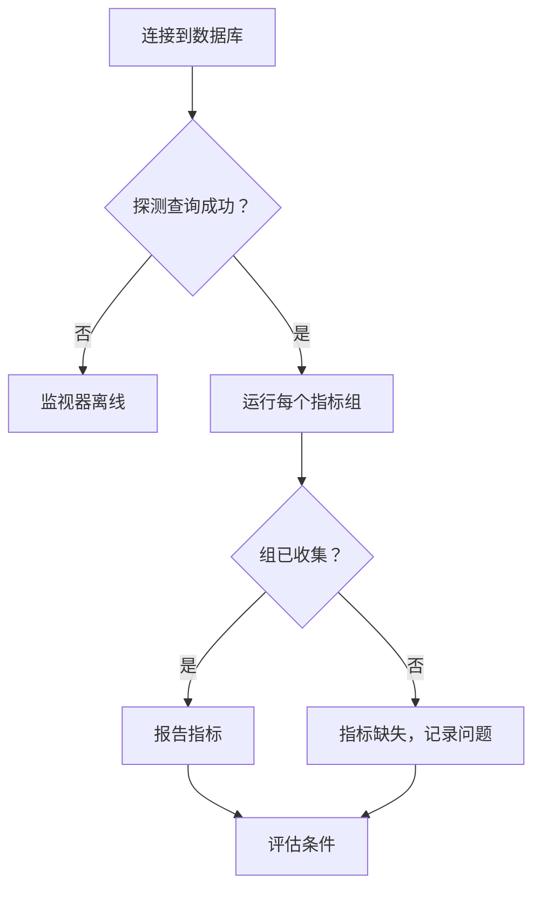

# 数据库健康监控

Database Health 监视器按计划连接到 PostgreSQL、MySQL 或 Microsoft SQL Server，并报告服务器自身的健康信号——连接余量、被阻塞的会话、复制延迟、缓存命中率、数据库大小、事务 ID 回卷，以及另外三十多项——这样你就可以像在网站宕机时收到警报那样，针对这些信号设置警报。

你不需要编写 SQL。探测器按数据库引擎运行一组固定的只读目录查询，并报告少量带名称的数值。

:::cards
- [创建监控用户](#创建监控用户): 每种引擎需要的权限。这是最重要的一步。
- [创建监视器](#创建-database-health-监视器): 让探测器指向数据库，并选择要收集的内容。
- [收集的指标](#收集的指标): 每个序列，以及报告它的引擎。
- [设置条件](#设置条件): 针对连接、阻塞、延迟和回卷发出警报。
:::

## Database Health 还是 SQL Query？

这两种数据库监视器类型回答不同的问题，设计上就是配合使用的。

| | Database Health | [SQL Query](/docs/monitor/sql-monitor) |
|---|---|---|
| 回答的问题 | “数据库本身健康吗？” | “我的数据符合预期吗？” |
| 查询 | 内置，按引擎区分，只读 | 你自己的 |
| 报告内容 | 带名称的数值指标（参见[收集的指标](#收集的指标)） | 行数、标量值、第一行、执行时间 |
| 典型警报 | 已用连接超过 90% | 最近五分钟内取消的订单超过 50 个 |
| 所需权限 | 读取统计信息/DMV——参见[创建监控用户](#创建监控用户) | 对查询涉及的表的 `SELECT` |

如果想针对业务条件发出警报，请使用 SQL Query 监视器。如果想在业务条件还没机会出错之前，就知道服务器的连接快要耗尽，请使用这个监视器。

## 支持的数据库

| 数据库 | 默认端口 |
|---|---|
| **PostgreSQL** | `5432` |
| **MySQL** | `3306` |
| **Microsoft SQL Server** | `1433` |

Azure SQL Database 和 Azure SQL Managed Instance 以 **Microsoft SQL Server** 的身份连接。它们需要的权限不同——参见[创建监控用户](#创建监控用户)。

使用相同线路协议的 PostgreSQL 兼容和 MySQL 兼容引擎通常也能工作，但它们提供的统计视图可能更少；这时受影响的指标会被报告为不可用，而不会被收集。只有上面三种引擎经过官方测试。

你的应用、集群和主机使用的每个数据库（这三种引擎以及许多其他引擎）都有自己的页面，展示其引擎指标、日志以及调用它的服务：参见[数据库](/docs/telemetry/databases)。如果 Database Health 监视器连接的主机和端口是某个数据库的端点之一，该监视器的警报和事件也会出现在那个数据库的页面上（参见[数据库上的警报](/docs/telemetry/databases#alerts-on-a-database)）。

## 工作原理

每次检查时，探测器会：

1. 用你配置的凭据连接到数据库。
2. 运行一个轻量的探测查询。**这是唯一一条失败后会让监视器离线的语句。**
3. 逐个运行每个已启用的[指标组](#指标组)的目录查询，每个查询都有语句超时。
4. 报告收集到的数值，并为每个未能收集的组附上一条说明及原因。



发送到 OneUptime 的只有带名称的数值聚合。查询文本、表中的行和模式名称都不会离开你的网络——这些查询读取的是引擎自己的统计视图（`pg_stat_activity`、`performance_schema.global_status`、`sys.dm_exec_sessions` 等），从不读取你的数据。

由于检查从探测器发起，数据库只需要能被探测器访问。把[自定义探测器](/docs/probe/custom-probe)放在你的网络内部，OneUptime 就完全不需要通往数据库的路由。

## 开始之前

- 一个能通过网络访问数据库主机和端口的**探测器**。如果数据库可以从互联网访问，就使用 OneUptime 托管的探测器；否则，在你的网络内部使用[自定义探测器](/docs/probe/custom-probe)。
- 一个按下一节创建的**监控用户**，以及它的连接信息。

## 创建监控用户

**这是最重要的一步。** 监视器读取的统计视图是普通登录名无权查看的，而权限不足的登录名并不总会报错失败——在 PostgreSQL 上，它会给出错误的答案。请创建一个专用登录名，只授予下面这些权限，不多也不少。

### PostgreSQL

```sql
CREATE USER oneuptime_health WITH PASSWORD 'a-strong-password';
GRANT CONNECT ON DATABASE mydb TO oneuptime_health;
-- The one grant that matters. Without it, see the note below.
GRANT pg_monitor TO oneuptime_health;
```

`pg_monitor` 是一个内置角色（PostgreSQL 10 及更高版本），授予对统计视图和监控视图的读取权限。它不授予对你的表的任何访问权限。

> [!IMPORTANT]
> **为什么 `pg_monitor` 在 PostgreSQL 上不可省略。** 没有它，`pg_stat_activity` 不会失败——查询会成功，但只返回监控会话自己的那一行。于是，即使服务器实际上已经着火，连接数也会一直显示 `1`，被阻塞的会话显示 `0`，复制延迟显示 `0`。因此，探测器会在运行这些查询**之前**检查登录名是否是 `pg_monitor`（或 `pg_read_all_stats`）的成员，或者是超级用户。如果都不是，探测器会把 Connections、Activity 和 Locks 组报告为不可用，并附上你需要的 `GRANT`。什么都不报告才是诚实的答案；报告 `1` 不是。

在无法使用 `pg_monitor` 的托管服务上，`pg_read_all_stats` 覆盖相同的视图。在 Amazon RDS 上，不需要 `GRANT rds_superuser`——`GRANT pg_monitor TO oneuptime_health;` 以 `rds_superuser` 成员的身份即可执行。

### MySQL

```sql
CREATE USER 'oneuptime_health'@'%' IDENTIFIED BY 'a-strong-password';
-- INNODB_TRX (open transactions, longest query) and replication status.
GRANT PROCESS, REPLICATION CLIENT ON *.* TO 'oneuptime_health'@'%';
-- Status counters, server variables, and lock waits.
GRANT SELECT ON performance_schema.* TO 'oneuptime_health'@'%';
-- Database size: information_schema.TABLES only shows tables the login can see.
GRANT SELECT ON mydb.* TO 'oneuptime_health'@'%';
FLUSH PRIVILEGES;
```

MySQL 的 `performance_schema` 必须启用（`performance_schema = ON`，自 5.6 起为默认值）。如果它被关闭，Connections、Throughput 和 Locks 组会被报告为不可用，解决办法是重启服务器，而不是授予权限。

### Microsoft SQL Server 和 Azure SQL Managed Instance

```sql
-- A server-level grant only runs while the current database is master.
USE master;
CREATE LOGIN oneuptime_health WITH PASSWORD = 'a-strong-password';
-- Every DMV the monitor reads. On SQL Server 2022 and later,
-- VIEW SERVER PERFORMANCE STATE alone is also enough.
GRANT VIEW SERVER STATE TO oneuptime_health;

USE mydb;
CREATE USER oneuptime_health FOR LOGIN oneuptime_health;
```

如果在其他任何数据库中运行，`GRANT VIEW SERVER STATE` 会失败并返回 Msg 4621：“Permissions at the server scope can only be granted when the current database is master”。

> [!WARNING]
> **只有表的读取权限是不够的。** 只能读取数据的登录名（`db_datareader` 或任何其他“读取权限”角色）可以连接，也能拿到数据库大小，但仅此而已。SQL Server 会以 `The user does not have permission to perform this action.`（Msg 297）拒绝监视器读取的视图。它前面的那条消息说明了被拒绝的是什么：服务器视图（包括事务日志空间和 tempdb 可用空间）对应 Msg 300 `VIEW SERVER STATE`（在 2022 上为 `VIEW SERVER PERFORMANCE STATE`），复制视图对应 Msg 262 `VIEW DATABASE STATE`（在 2022 上为 `VIEW DATABASE PERFORMANCE STATE`）。监视器保持在线，报告 Connections、Activity、Throughput、Locks、Storage 和 Replication 组缺少权限，并在它们旁边显示上面的 `GRANT`。`VIEW SERVER STATE` 可以覆盖所有这些组。
>
> 有两个视图不会拒绝：缺少该权限时，`sys.dm_exec_sessions` 和 `sys.dm_exec_requests` 会悄悄地只显示监视器自己的会话。监视器从不单独读取它们，总是和一个会拒绝的视图一起读取，因此缺少权限永远不会被记录成“1 个连接”。

### Azure SQL Database

Azure SQL Database 没有服务器级权限——`GRANT VIEW SERVER STATE` 在那里会失败——因此同样的视图改由数据库级权限打开。在 `master` 中创建登录名，在你要监控的数据库中为它创建用户，并在那个数据库中授予权限，而不是在 `master` 中：

```sql
-- Connected to master, as the server admin:
CREATE LOGIN oneuptime_health WITH PASSWORD = 'a-strong-password';

-- Connected to the monitored database:
CREATE USER oneuptime_health FOR LOGIN oneuptime_health;
GRANT VIEW DATABASE STATE TO oneuptime_health;
```

对于 vCore 数据库和 S2 及以上的 DTU 数据库，这就足够了。在 **Basic、S0 和 S1** 上，以及**弹性池**中的任何数据库上，无论数据库权限如何，Azure 只允许服务器管理员、Microsoft Entra 管理员或 `##MS_ServerStateReader##` 服务器角色的成员读取这些视图。这时，服务器管理员还要把登录名加入该角色：

```sql
-- Connected to master, as the server admin:
ALTER SERVER ROLE ##MS_ServerStateReader## ADD MEMBER oneuptime_health;
```

`##MS_ServerStateReader##` 在所有服务层级上都有效，因此如果 `VIEW DATABASE STATE` 不够用，它也是后备方案。新的角色成员身份可能需要几分钟才能生效，并且只对新连接有效；探测器每次检查都会打开新连接。

包含的数据库用户（在被监控的数据库中用 `CREATE USER oneuptime_health WITH PASSWORD = '...'` 创建、没有登录名的用户）在 S2 及以上可以配合 `VIEW DATABASE STATE` 使用，但不能加入 `##MS_ServerStateReader##`：服务器角色只接受登录名。要把包含的用户移到该角色中，请删除它（`DROP USER oneuptime_health;`），然后按上面的语句操作。

探测器通过 `SERVERPROPERTY('EngineEdition')` 而不是版本来识别 Azure SQL Database——无论实际运行的是什么，Azure SQL Database 都会报告 `12.0.2000.8`，看起来就像 SQL Server 2014。因此，监视器的 **Engine** 显示为 `Azure SQL Database 12.0.2000.8`，缺少的权限会显示为上面的 Azure 语句，而绝不会显示为 `VIEW SERVER STATE`。

- **在 Azure SQL Database 上不收集复制信息。** Azure SQL Database 没有 `sys.dm_hadr_database_replica_states`，因此 Replication 组在那里会被跳过，而不是每次检查都报告失败。Azure 自己的副本视图（`sys.dm_database_replica_states`、`sys.dm_geo_replication_link_status`）目前还不读取。
- **连接按数据库计算。** 使用 `VIEW DATABASE STATE` 时，Azure SQL Database 只显示被监控数据库的会话，所以 Connections 统计的是该数据库，而不是逻辑服务器。请分别监控你关心的每个数据库。
- **在弹性池中，TempDB Free Space 是整个池的值。** 池中的数据库共享同一个 tempdb。

## 创建 Database Health 监视器

:::steps
### 新建监视器

前往**监视器**，点击**创建监视器**。在**监视器类型**下点击**更多监视器类型**，然后在 **Database Monitoring** 下选择 **Database Health**，或在搜索框中输入 `health`。输入**名称**，然后点击**下一步**。

### 输入连接信息

选择 **Database Type**，然后填写主机、端口、数据库名称以及监控用户的凭据。请把密码作为[监视器密钥](#用监视器密钥保存密码)引用，而不是直接输入。每个字段都在[配置](#配置)中有说明。

### 选择要收集的内容

除非有理由关闭某个组，否则让 **Metric Groups** 下的所有组保持开启——参见[指标组](#指标组)。

### 测试连接

点击**测试监视器**，在保存前运行一次检查，并查看它收集到了什么。

### 确定条件

检查监视器初始带有的条件，并添加你自己的条件——参见[设置条件](#设置条件)。然后点击**下一步**。

### 选择探测器并创建

选择能访问数据库的**探测器**和一个**监控间隔**，然后点击**创建监视器**。
:::

## 配置

| 字段 | 填写内容 |
|---|---|
| **Database Type** | PostgreSQL、MySQL 或 Microsoft SQL Server。选择类型会设置默认端口，并决定运行哪些查询。 |
| **主机** | 探测器可以访问的数据库主机（例如 `db.internal`）。 |
| **端口** | 数据库端口。 |
| **数据库名称** | 要连接的数据库。数据库范围的指标（大小、缓存命中率、溢出到临时文件）针对这个数据库报告；服务器范围的指标（连接、运行时间、复制）针对整个服务器报告——Azure SQL Database 除外，在那里只统计被监控数据库的连接。 |
| **Use Windows Integrated Authentication** | 仅限 Microsoft SQL Server。使用探测器进程的身份进行身份验证，而不是用户名和密码。参见 SQL Query 监视器页面上的 [Windows 集成身份验证](/docs/monitor/sql-monitor)——设置方法完全相同。 |
| **用户名** | 监控用户。除非使用 Windows 集成身份验证，否则必填。 |
| **密码** | 密码。请用 `{{monitorSecrets.name}}` 引用[监视器密钥](/docs/monitor/monitor-secrets)，而不是以明文输入（参见[使用监视器密钥](#用监视器密钥保存密码)）。 |
| **Use SSL/TLS** | 通过 TLS 连接。启用后，对于自签名证书，可以关闭 **Verify server certificate**。 |
| **Metric Groups** | 要运行的组：Connections、活动、Throughput、Locks and Blocking、存储、Replication 和维护。默认全部开启；参见[指标组](#指标组)。监视器的详细信息中将它们列为 **Collected Metric Groups**。 |

### 更多字段

| 字段 | 默认值 | 最大值 | 限制的内容 |
|---|---|---|---|
| **Connection Timeout (ms)** | `10000` | `30000` | 建立连接时等待的时长。 |
| **Statement Timeout (ms)** | `10000` | `60000` | 每条目录查询的时间上限。 |

语句超时的默认值有意比 SQL Query 监视器更严：在健康的服务器上，这些查询几毫秒就会返回，所以如果 `pg_stat_activity` 花了十秒，有用的信号是“这台服务器有麻烦了”，而不是再多等一会儿。超过最大值的值会被降到最大值。

## 用监视器密钥保存密码

要让密码永远不以明文形式存储在监视器上：

:::steps
1. 前往**监视器 → 设置 → 密钥**，创建一个[监视器密钥](/docs/monitor/monitor-secrets)。
2. 为它命名（例如 `dbPassword`），并授予这个监视器访问权限。
3. 在监视器的**密码**字段中输入 `{{monitorSecrets.dbPassword}}`。
:::

密钥在配置交给探测器之前于服务器端解析。主机、用户名和数据库名称字段也接受同样的引用。凭据绝不会被写入日志、监视器动态或警报模板。

## 指标组

组是你开启或关闭的单位，也是报告缺少权限的单位。设置组是为了让缺少一个权限只损失一个组，而不是整个监视器。一个组的语句逐条运行，因此一个组可能只被部分收集：这时它会同时出现在 `collectedGroups` 和 `unavailableGroups` 中。常见的情况是没有 `VIEW SERVER STATE` 的登录名在 SQL Server 上的 Storage 组——数据库大小会被收集，日志空间和 tempdb 可用空间则不会。

| 组 | 收集的内容 | 需要 |
|---|---|---|
| Connections | 连接数、配置的上限、中止的连接、服务器运行时间 | PostgreSQL：`pg_monitor`。MySQL：`performance_schema`。SQL Server：`VIEW SERVER STATE` |
| Activity | 运行时间最长的查询、打开时间最长的事务、打开的事务 | PostgreSQL：`pg_monitor`。MySQL：`PROCESS`。SQL Server：`VIEW SERVER STATE` |
| Throughput | 事务、查询、缓存命中率、磁盘读写、I/O 时间 | PostgreSQL：除 `CONNECT` 外无需其他权限。MySQL：`performance_schema`。SQL Server：`VIEW SERVER STATE` |
| Locks | 被阻塞的会话、锁等待、死锁、表锁等待 | PostgreSQL：`pg_monitor`。MySQL：`performance_schema`。SQL Server：`VIEW SERVER STATE` |
| Storage | 数据库大小、溢出到临时文件、日志空间、tempdb 可用空间 | PostgreSQL：除 `CONNECT` 外无需其他权限。MySQL：对该数据库的 `SELECT`。SQL Server：数据库大小无需权限；日志空间和 tempdb 可用空间需要 `VIEW SERVER STATE` |
| Replication | 已连接的副本、以秒和字节计的复制延迟、非活动槽、恢复状态 | PostgreSQL：`pg_monitor`。MySQL：`REPLICATION CLIENT`。SQL Server：`VIEW SERVER STATE`；在 Azure SQL Database 上不收集 |
| Maintenance | 距事务 ID 回卷的余量、死元组、从未被 autovacuum 处理过的表、检查点 | PostgreSQL：`pg_monitor` |

在 Azure SQL Database 上，凡是此表写着 `VIEW SERVER STATE` 的地方，都应理解为 `VIEW DATABASE STATE`——在 Basic、S0、S1 和弹性池上则是 `##MS_ServerStateReader##`。参见 [Azure SQL Database](#azure-sql-database)。

关闭一个组是静默的：没有指标，没有收集问题，也没有警报。在两种情况下这样做是对的：

- **你拿不到权限。** 关闭该组后，收集问题就不会在每次检查时重复出现。
- **查询开销太大。** 在 MySQL 上，**存储**是常见的候选：数据库大小来自对 `information_schema.TABLES` 求和，在有数万张表的模式上这并不便宜，而且每次检查都会运行。把它关闭，或者把这个监视器改为五分钟的间隔。

取消选择所有组并不能让监视器什么都不收集——空列表会被规范化回所有组，因此监视器永远不可能以悄悄什么都不收集的状态被保存。

## 无法收集指标时会发生什么

**缺少权限永远不会让监视器离线。** 这是这种监视器类型最重要的行为，值得准确说明。

| 失败的环节 | 监视器状态 | 你会看到 |
|---|---|---|
| **连接**或探测查询——凭据错误、连接被拒绝、TLS 失败、连接超时 | **离线** | `Database Is Online` 为 false，你为它关联的事件和值班策略会被触发。 |
| **某个组**——缺少权限、`performance_schema` 被禁用、语句超时 | **保持在线** | 该组未能读取的指标是**缺失的**，而不是零。图表上不会画线，针对这些序列的阈值都不会匹配，也不会由它们产生事件。这次检查会记录一个收集问题，写明组、原因以及（如果有的话）需要运行的确切 `GRANT`；它显示在监视器摘要中，并计入 **Metric Groups Failed**。 |
| **引擎根本无法提供某个指标**——标准 MySQL 没有死锁计数器；SQL Server 默认不限制连接上限，因此“已用百分比”没有意义 | **保持在线** | 该指标只是不存在。这**不是**收集问题，不计入 Metric Groups Failed，也不需要修复。参见[收集的指标](#收集的指标)中的 Engines 列。 |

缺失就是缺失。未测量的值永远不会报告为 `0`，因为满是编造的零的图表比空缺更糟——空缺至少你看得见。

> [!TIP]
> 要在失去可见性时收到警报，请使用 `Database Collection Error`，或针对 **Metric Groups Failed** 设置阈值。把两者都设为警报而不是事件：被撤销的权限应该开工单处理，而不是呼叫值班人员。

### "The user does not have permission to perform this action"

这是 SQL Server 针对能连接但无法读取服务器状态视图的登录名给出的消息（Msg 297）。它始终意味着缺少权限，绝不意味着数据库出了故障。SQL Server 会把它作为第二条消息发送，前一条消息会写明被拒绝的权限，监视器会同时显示这两条：例如 `VIEW SERVER STATE permission was denied on object 'server', database 'master'. The user does not have permission to perform this action.` 旁边会显示针对探测器所连接平台的修复语句：

- **SQL Server 或 Azure SQL Managed Instance**——`GRANT VIEW SERVER STATE TO oneuptime_health;`，在 `master` 中运行（监视器将其显示为 `GRANT VIEW SERVER STATE TO [<monitoring_login>]; -- run in master`）。
- **Azure SQL Database**——`GRANT VIEW DATABASE STATE TO oneuptime_health;`，在被监控的数据库中运行；在 Basic、S0、S1 和弹性池上，则改为加入 `##MS_ServerStateReader##`。参见 [Azure SQL Database](#azure-sql-database)。

在此期间，数据库大小仍会被持续收集，因为它是 Storage 组中唯一任何登录名都能读取的指标。

## 收集的指标

八个类别，共四十一个序列。Engines 列出的是真正能提供该序列的引擎；在其他任何引擎上，该序列都不存在。Group 是该序列所属的收集组，也就是你开关的单位，以及会一起降级的单位。

### 可用性

| 指标 | 序列 | Group | Engines |
|---|---|---|---|
| **Uptime** (s) | `oneuptime.monitor.database.uptime.seconds` | Connections | PostgreSQL, MySQL, SQL Server |
| **Metric Groups Failed** | `oneuptime.monitor.database.metric.groups.failed` | Connections | PostgreSQL, MySQL, SQL Server |

### 连接

| 指标 | 序列 | Group | Engines |
|---|---|---|---|
| **Connections** | `oneuptime.monitor.database.connections.total` | Connections | PostgreSQL, MySQL, SQL Server |
| **Active Connections** | `oneuptime.monitor.database.connections.active` | Connections | PostgreSQL, MySQL, SQL Server |
| **Maximum Connections** | `oneuptime.monitor.database.connections.max` | Connections | PostgreSQL, MySQL |
| **Connections Used** (%) | `oneuptime.monitor.database.connections.used.percent` | Connections | PostgreSQL, MySQL |
| **Idle In Transaction** | `oneuptime.monitor.database.connections.idle.in.transaction` | Connections | PostgreSQL |
| **Aborted Connects** | `oneuptime.monitor.database.connections.aborted.total` | Connections | MySQL |

### 吞吐量

| 指标 | 序列 | Group | Engines |
|---|---|---|---|
| **Transactions** | `oneuptime.monitor.database.transactions.total` | Throughput | PostgreSQL, SQL Server |
| **Queries** | `oneuptime.monitor.database.queries.total` | Throughput | MySQL, SQL Server |
| **Slow Queries** | `oneuptime.monitor.database.queries.slow.total` | Throughput | MySQL |
| **Rollback Ratio** (%) | `oneuptime.monitor.database.rollback.percent` | Throughput | PostgreSQL |
| **Longest Running Query** (s) | `oneuptime.monitor.database.query.longest.seconds` | Activity | PostgreSQL, MySQL, SQL Server |
| **Longest Open Transaction** (s) | `oneuptime.monitor.database.transaction.longest.seconds` | Activity | PostgreSQL, MySQL, SQL Server |
| **Open Transactions** | `oneuptime.monitor.database.transaction.open.count` | Activity | MySQL |

### 锁与阻塞

| 指标 | 序列 | Group | Engines |
|---|---|---|---|
| **Blocked Sessions** | `oneuptime.monitor.database.sessions.blocked` | Locks | PostgreSQL, MySQL, SQL Server |
| **Lock Waits** | `oneuptime.monitor.database.locks.waiting` | Locks | PostgreSQL, MySQL, SQL Server |
| **Deadlocks** | `oneuptime.monitor.database.deadlocks.total` | Locks | PostgreSQL, SQL Server |
| **Table Lock Waits** | `oneuptime.monitor.database.table.locks.waited.total` | Locks | MySQL |

标准 MySQL 不提供任何形式的死锁计数器，所以 Deadlocks 只存在于 PostgreSQL 和 SQL Server 上。

### 缓存与 I/O

| 指标 | 序列 | Group | Engines |
|---|---|---|---|
| **Cache Hit Ratio** (%) | `oneuptime.monitor.database.cache.hit.percent` | Throughput | PostgreSQL, MySQL, SQL Server |
| **Disk Reads** | `oneuptime.monitor.database.disk.reads.total` | Throughput | PostgreSQL, MySQL, SQL Server |
| **Disk Writes** | `oneuptime.monitor.database.disk.writes.total` | Throughput | MySQL, SQL Server |
| **I/O Read Time** (ms) | `oneuptime.monitor.database.io.read.time.ms` | Throughput | PostgreSQL, SQL Server |
| **I/O Write Time** (ms) | `oneuptime.monitor.database.io.write.time.ms` | Throughput | PostgreSQL, SQL Server |
| **Page Life Expectancy** (s) | `oneuptime.monitor.database.page.life.expectancy.seconds` | Throughput | SQL Server |
| **Memory Grants Pending** | `oneuptime.monitor.database.memory.grants.pending` | Throughput | SQL Server |

只有在 `track_io_timing` 开启时，PostgreSQL 才会测量 I/O 读写时间。它默认是关闭的，这时 PostgreSQL 会把两者都报告为 `0`——所以在 PostgreSQL 上，这两个序列一直是零通常意味着“没有测量”，而不是“很快”。这是服务器设置，不是权限问题。

### 存储空间

| 指标 | 序列 | Group | Engines |
|---|---|---|---|
| **Database Size** (字节) | `oneuptime.monitor.database.size.bytes` | Storage | PostgreSQL, MySQL, SQL Server |
| **Temp Bytes Written** (字节) | `oneuptime.monitor.database.temp.bytes.total` | Storage | PostgreSQL |
| **Temp Disk Tables** | `oneuptime.monitor.database.temp.disk.tables.total` | Storage | MySQL |
| **Log Space Used** (%) | `oneuptime.monitor.database.log.space.used.percent` | Storage | SQL Server |
| **TempDB Free Space** (字节) | `oneuptime.monitor.database.tempdb.free.bytes` | Storage | SQL Server |

### 复制

| 指标 | 序列 | Group | Engines |
|---|---|---|---|
| **Connected Replicas** | `oneuptime.monitor.database.replica.count` | Replication | PostgreSQL, SQL Server |
| **Replication Lag** (s) | `oneuptime.monitor.database.replication.lag.seconds` | Replication | PostgreSQL, MySQL |
| **Replication Lag (Bytes)** (字节) | `oneuptime.monitor.database.replication.lag.bytes` | Replication | PostgreSQL, SQL Server |
| **Is In Recovery** | `oneuptime.monitor.database.is.in.recovery` | Replication | PostgreSQL |
| **Inactive Replication Slots** | `oneuptime.monitor.database.replication.slots.inactive` | Replication | PostgreSQL |

复制指标从监视器所连接的那一端报告。把一个监视器指向主库，可以看到已连接的副本和发送队列；为每个备库各指向一个监视器，可以看到该备库实际落后了多少。

即使副本已经远远落后，空闲主库上以秒计的延迟仍显示为零，因为没有写入任何新内容。**Replication Lag (Bytes)** 没有这个盲区，所以请对两者都设置警报。

### 维护

| 指标 | 序列 | Group | Engines |
|---|---|---|---|
| **Transaction ID Used** (%) | `oneuptime.monitor.database.transaction.id.used.percent` | Maintenance | PostgreSQL |
| **Dead Tuples** | `oneuptime.monitor.database.dead.tuples` | Maintenance | PostgreSQL |
| **Tables Never Autovacuumed** | `oneuptime.monitor.database.tables.never.autovacuumed` | Maintenance | PostgreSQL |
| **Requested Checkpoints** | `oneuptime.monitor.database.checkpoints.requested.total` | Maintenance | PostgreSQL |
| **Timed Checkpoints** | `oneuptime.monitor.database.checkpoints.timed.total` | Maintenance | PostgreSQL |

> [!IMPORTANT]
> **Transaction ID Used** 值得在你创建的每个 PostgreSQL 监视器上设置一条条件。它达到 100% 时，PostgreSQL 会拒绝所有写入，恢复需要在数据库停机的情况下以单用户模式执行 vacuum，而几乎没人关注它。请在远未到悬崖时就发出警报——对大多数工作负载来说，80% 还留有好几天的余量。

以 `total` 结尾的计数器是自服务器启动以来的累计值。比较两个时间点才能得到速率；单个值只有和它自己的历史相比才有意义，而且服务器重启时会归零（**Uptime** 会告诉你何时重启过）。

## 设置条件

| 过滤器类型 | 检查的内容 |
|---|---|
| **Database Is Online** | 数据库是否可访问，以及探测查询是否成功。这是监视器创建时自带的离线条件，也是唯一反映可访问性的检查。 |
| **Database Metric** | 选择一个指标，然后进行比较：Greater Than、Less Than、Greater Than Or Equal To、Less Than Or Equal To、Equal To 或 Not Equal To。指标选择器只提供所选引擎能产生的指标，所以你无法构建一个永远不会满足的条件（有一个例外：为 Microsoft SQL Server 提供的 Replication 指标在 Azure SQL Database 上从不收集）。如果某次检查没有收集到该指标——组失败了，或者引擎不报告它——过滤器不会匹配，也不会作为“false”匹配：它会被跳过。权限问题不会呼叫任何人。 |
| **Database Collection Error** | 这次检查的收集问题摘要，每个不可用的组一条“组: 消息”。在它不为空时发出警报，可以发现可见性的丢失；也可以用 Contains 盯住某个特定的组。 |
| **JavaScript Expression** | 完全控制。参见 [JavaScript 表达式](/docs/monitor/javascript-expression)。 |

阈值是整数。请写 `90`，而不是 `90.5`——百分比和秒数都按整数比较。

**Database Is Online** 和 **Database Metric** 可以在一段时间内检查：勾选**在一段时间内评估此条件**，然后在**评估**中选择如何评估这些值（例如 **All Values**），并填写**在过去（分钟）**。在一段时间内评估时，过滤器的**如果无数据**设置决定缺失值的含义；请保持为 **Ignore**，这样缺少权限仍然不会呼叫任何人。

### JavaScript 表达式变量

对于 Database Health 监视器，表达式可以访问：

| 变量 | 类型 | 说明 |
|---|---|---|
| `isOnline` | boolean | 连接和探测查询是否都成功 |
| `engineVersion` | string | 服务器报告的版本字符串（在 SQL Server 上是原始的 `ProductVersion`；监视器摘要会在旁边写明平台） |
| `connectionError` | string | 经过清理的连接错误，没有错误时为空 |
| `collectedGroups` | array | 本次检查中产生了值的组 |
| `unavailableGroups` | array | 有语句未能收集的组，每个都带有原因和修复方法。部分收集的组会同时出现在两个列表中 |
| `metrics` | object | 以序列名称为键的已收集值；未收集的序列不存在 |

```javascript
{{isOnline}} === true && {{collectedGroups}}.length >= 5
```

要在表达式中读取某个指标，请对整个 `metrics` 对象使用下标——序列名称中带有点，因此不能放在花括号里：

```javascript
{{metrics}}['oneuptime.monitor.database.connections.used.percent'] > 90
```

要对单个指标设置阈值，请使用 **Database Metric** 而不是表达式：它会替你解析序列，只提供你的引擎能产生的指标，并在值未被收集时跳过检查，而不是拿空值去比较。

### 示例：PostgreSQL 主库

| 顺序 | 条件 | 过滤器 |
|---|---|---|
| 1 | **离线** | `Database Is Online` 为 `false`。 |
| 2 | **性能下降** | `Database Metric` → Connections Used 大于 `90`，用 All Values 在 5 分钟内评估，这样单次尖峰不会呼叫任何人。 |
| 3 | **性能下降** | `Database Metric` → Transaction ID Used 大于 `80`。 |
| 4 | **性能下降** | `Database Metric` → Blocked Sessions 在 5 分钟内大于 `0`。 |
| 5 | **Online** | `Database Is Online` 为 `true`。 |

条件按从上到下的顺序评估，第一个匹配的条件生效，所以请把警报条件放在前面，把健康条件放在最后。

为离线条件关联一个值班策略，而由 **Metric Groups Failed** 或 `Database Collection Error` 派生的条件都保持为警报，不关联值班策略。

## 注意事项

- **查询在每次检查时运行。** 它们在设计上开销很低，但“开销低”是相对于间隔而言的。对拥有数千个会话的服务器使用一分钟的间隔，会带来比你想要的更多的 `pg_stat_activity` 扫描；对于容量类指标，五分钟就足够了。
- **让监视器指向你关心的数据库。** 大小、缓存命中率和溢出到临时文件是按数据库计算的。连接、运行时间和复制是按服务器计算的，从该实例上的任何数据库读取都相同。
- **每个实例一个监视器，而不是每个数据库一个**，除非你确实需要按数据库查看大小和缓存指标——否则只会成倍增加服务器范围的查询，却得不到新信息。Azure SQL Database 是例外：它按数据库报告连接，所以在那里请监控每个数据库。
- **针对速率而不是计数器发出警报。** 以 `total` 结尾的值只增不减，所以在它上面设置“大于”阈值只会触发一次，然后永远不会恢复。请把它画成图表，或在一个时间窗口内进行比较。
- **优先使用监视器密钥，而不是明文密码。** 这样凭据在静态存储时保持加密，也永远不会显示在监视器上。
- **监视器从不写入。** 每个查询都是对统计视图的读取——在 PostgreSQL 上位于只读事务中，在 MySQL 上位于只读会话中。它无法读取的内容会报告为缺失的指标，绝不会报告为故障。

## 故障排除

:::details 监视器离线，但数据库正常运行
离线表示探测器无法连接，或者探测查询失败：从探测器无法访问主机或端口、登录被拒绝、TLS 失败，或者连接超时。监视器摘要会显示错误。请确认探测器能够访问数据库（OneUptime 托管的探测器需要公网地址；否则请使用[自定义探测器](/docs/probe/custom-probe)），检查用户名和密码或其监视器密钥，并在使用自签名证书时关闭 **Verify server certificate**。然后点击**测试监视器**再检查一次。
:::

:::details PostgreSQL 上缺少 Connections、Activity 和 Locks
登录名既不是 `pg_monitor` 也不是 `pg_read_all_stats` 的成员，也不是超级用户，因此探测器会跳过这些组，而不是记录错误的数值。按 [PostgreSQL](#postgresql) 中的说明运行 `GRANT pg_monitor TO oneuptime_health;`。
:::

:::details MySQL 上缺少 Connections、Throughput 和 Locks
要么登录名缺少对 `performance_schema` 的 `SELECT`，要么服务器上的 `performance_schema` 被关闭了；监视器摘要会显示 MySQL 的消息。如果是缺少权限，请运行 [MySQL](#mysql) 中的语句。被关闭的 `performance_schema` 需要在服务器配置中设置 `performance_schema = ON` 并重启。
:::

:::details PostgreSQL 上的 I/O Read Time 和 I/O Write Time 始终为 0
只有在 `track_io_timing` 开启时 PostgreSQL 才会测量它们，而它默认是关闭的。请在服务器配置或托管服务的参数组中开启它，才能看到真实的值。这不是缺少权限。
:::

:::details 每次检查 Metric Groups Failed 都大于 0
有一个组在任何检查中都无法收集，所以同一个收集问题不断重复。监视器摘要会写明组、原因以及修复它的 `GRANT`。运行这条授权；如果拿不到权限，就在 **Metric Groups** 中关闭该组，让问题不再重复出现。
:::

## 后续步骤

:::cards
- [SQL 查询监控](/docs/monitor/sql-monitor): 在服务器健康之外，针对你自己的查询结果发出警报。
- [数据库](/docs/telemetry/databases): 在一个页面上查看每个数据库的指标、日志和调用方。
- [监控密钥](/docs/monitor/monitor-secrets): 加密保存监控用户的密码。
- [自定义探针](/docs/probe/custom-probe): 访问你网络内部的数据库。
:::
