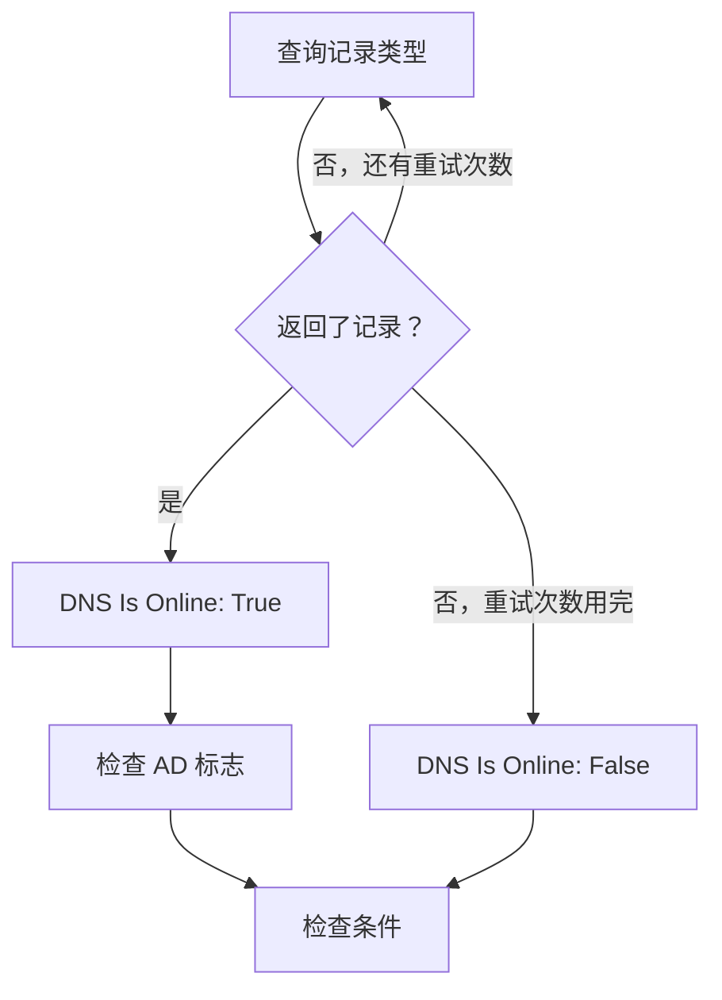

# DNS 监控

DNS 监视器按计划查询一条 DNS 记录并检查应答：名称能否解析、解析速度如何，以及记录的内容是什么。用它在用户察觉之前发现 DNS 故障、被更改或消失的记录，或者缓慢的解析器。

:::cards
- [创建监视器](#创建-dns-监视器): 在控制台中完成六个步骤。
- [配置选项](#配置选项): 名称、记录类型和 DNS 服务器。
- [监控标准](#监控标准): 解析、记录、响应时间和 DNSSEC。
- [故障排查](#故障排查): 监视器和 `dig` 的结果不一致时。
:::

## 工作原理

每次检查时，探测器向 DNS 服务器查询一个名称的一种记录类型，例如 `example.com` 的 `A` 记录。当服务器返回至少一条该类型的记录时，名称即为在线。失败、超时或没有返回记录的查询会在一秒后重试，最多重试您设置的次数。然后探测器询问一个验证型解析器，应答是否带有 DNSSEC 的 authenticated data（AD）标志，OneUptime 再用监视器的条件评估结果。



失去自身网络连接的探测器不会报告任何结果，因此它无法将您的 DNS 标记为离线。

## 开始之前

- **可以创建监视器的角色**：Project Owner、Project Admin、Project Member、Monitor Admin 或 Monitor Member，或者拥有 Create Monitor 权限的自定义角色。
- **能够访问该 DNS 服务器的探测器。** 每个新监视器都会选中您项目的默认探测器。要查询私有网络中的 DNS 服务器（例如内部解析器），请使用该网络内的 [自定义探测器](/docs/probe/custom-probe)。

## 创建 DNS 监视器

:::steps
### 开始创建新监视器

前往 **监视器**，点击 **创建监视器**。在 **监视器类型** 下点击 **更多监视器类型**，然后在 **DNS Monitoring** 下选择 **DNS**。

### 命名

输入 **名称**，例如 `example.com A records`，然后点击 **下一步**。

### 输入查询

输入要查询的 **域名**，例如 `example.com`，并选择它的 **记录类型**。要查询特定服务器，请在 **DNS 服务器（可选）** 中输入它；留空则使用探测器自己的解析器。

### 测试

点击 **测试监视器**，在 **选择探测器** 中选择一个探测器，然后点击 **运行测试**。**监视器测试结果** 会显示探测器收到的记录。

### 检查条件

**监视器条件** 从 [默认标准](#默认标准) 开始：名称无法解析时为离线，能解析时为在线。要检查记录的内容，请添加 **DNS Record Value** 筛选器，然后点击 **下一步**。

### 选择探测器并创建

保留或修改 **探测器** 和 **监控间隔**（初始为 **每 5 分钟**），然后点击 **创建监视器**。监视器页面随即打开。
:::

## 配置选项

| 字段 | 默认值 | 要填写的内容 |
| --- | --- | --- |
| **域名** | 无 | 要查询的名称，例如 `example.com` 或 `_sip._tcp.example.com`。对于 `PTR` 记录，填写反向名称，例如 `34.216.184.93.in-addr.arpa`。 |
| **记录类型** | `A` | 要查询的记录类型。参见 [记录类型](#记录类型)。 |
| **DNS 服务器（可选）** | 探测器的解析器 | 改为查询的 DNS 服务器，例如 `8.8.8.8` 或 `ns1.example.com`。所有记录类型（包括 `CAA`）都向它查询。 |
| **端口**（在 **更多字段** 下） | `53` | **DNS 服务器（可选）** 中服务器的端口。DNSSEC 检查也查询同一端口。 |
| **超时（ms）**（在 **更多字段** 下） | `5000` | 等待应答的时间，单位为毫秒。 |
| **重试**（在 **更多字段** 下） | `3` | 第一次尝试失败后的重试次数。`0` 表示只尝试一次。 |

### 记录类型

**DNS Record Value** 条件会把您输入的文本与探测器写出的每条记录进行比较，因此请使用以下格式：

| 记录类型 | 包含内容 | 值的格式（用于条件） |
| --- | --- | --- |
| `A` | IPv4 地址 | `93.184.216.34` |
| `AAAA` | IPv6 地址 | `2606:2800:220:1:248:1893:25c8:1946` |
| `CNAME` | 此名称作为别名所指向的名称 | `example.net` |
| `MX` | 邮件服务器 | `10 mail.example.com`（优先级，然后是服务器） |
| `NS` | 域名服务器 | `ns1.example.com` |
| `TXT` | 文本，例如 SPF 和验证记录 | `v=spf1 include:_spf.example.com ~all` |
| `SOA` | 区域的起始授权（start of authority） | `ns1.example.com hostmaster.example.com 2024010101 7200 3600 1209600 3600`（服务器、联系人、序列号、refresh、retry、expire、最小 TTL） |
| `PTR` | 地址反向指向的名称（反向 DNS） | `server1.example.com` |
| `SRV` | 服务 | `10 5 5060 sip.example.com`（优先级、权重、端口、目标） |
| `CAA` | 允许为该名称签发证书的证书颁发机构 | `0 letsencrypt.org`（标志，然后是颁发机构） |

拆分成多个字符串的 `TXT` 记录会被拼接为一个值。

## 监控标准

条件决定名称何时算作在线、性能下降或离线，以及是否因此声明事件或创建警报。每个条件检查一个或多个筛选器：

| 筛选器 | 条件 | 检查内容 |
| --- | --- | --- |
| **DNS Is Online** | **是**、**否** | 查询是否返回了至少一条该类型的记录。 |
| **DNS Response Time (in ms)** | **Greater Than**、**Less Than**、**Greater Than Or Equal To**、**Less Than Or Equal To** | 查询所用的时间。 |
| **DNS Record Exists** | **是**、**否** | 是否返回了该类型的任何记录。 |
| **DNS Record Value** | **包含**、**Not Contains**、**Starts With**、**Ends With**、**Equal To**、**Not Equal To** | 记录的值。只要有一条记录匹配，筛选器即匹配。 |
| **DNSSEC Is Valid** | **是**、**否** | 验证型解析器是否在应答上设置了 AD 标志。 |

只要 _任意一条_ 记录匹配，**DNS Record Value** 就会匹配。有多条 `A` 记录时，只要其中一条是该地址，**Equal To** `93.184.216.34` 就会匹配；只要其中一条不是该地址，**Not Equal To** 就会匹配。

**DNSSEC Is Valid** 会在 **DNS 服务器（可选）** 中服务器的 **端口** 上查询它；该字段为空时，则查询 Google Public DNS（`8.8.8.8`）。因此您设置的服务器应当能够验证 DNSSEC。当探测器无法执行此检查时，该筛选器没有值，两种情况都不匹配。要全面检查已签名的区域，请使用 [DNSSEC 监控](/docs/monitor/dnssec-monitor)。

有两个或更多筛选器时，**匹配条件** 决定是 **全部** 筛选器都必须匹配，还是 **任意** 一个匹配即可。条件的 **操作** 决定它做什么：更改监视器状态、创建警报、声明事件，或其中任意几项。

### 默认标准

新的 DNS 监视器以两个条件开始：

- **离线** — 经过所有重试后，名称仍无法解析，或没有该类型的记录。监视器被标记为 **离线**，并创建名为“_monitor name_ is offline”的事件。名称再次能够解析时，事件会自行解决。
- **在线** — 名称能够解析。监视器被标记为 **运行正常**。

条件从上到下检查，第一个匹配的条件决定接下来发生什么。没有条件匹配时，监视器显示其默认状态：**运行正常**，除非您在条件下方的 **更多字段** 中选择了其他状态。

### 在一段时间内评估

**在一段时间内评估此条件** 是筛选器下方的复选框，适用于 **DNS Is Online** 和 **DNS Response Time (in ms)**。打开它即可判断过去一段时间内的检查，而不是最近一次：在 **评估** 中选择聚合方式，在 **在过去（分钟）** 中选择 2 到 60 分钟的时间窗口。

| 聚合 | 匹配条件 |
| --- | --- |
| **平均值**、**总和**、**Maximum Value**、**Minimum Value** | 该数值在整个窗口内满足条件。仅限 **DNS Response Time (in ms)**。 |
| **All Values** | 窗口内的每次检查都满足条件。 |
| **Any Value** | 窗口内至少有一次检查满足条件。 |

**All Values** 只有在窗口真正被数据覆盖后才会匹配。刚创建的监视器，或者检查已不再被记录的监视器，没有足够的历史来说明过去 N 分钟的情况，因此条件会等待，而不是根据手头仅有的一个读数匹配。**Any Value** 用于“只要有一次检查超出阈值就立即告诉我”，并且仍会立即触发。

**如果无数据** 决定在窗口无法支撑条件时发生什么：

| 选项 | 会发生什么 | 适用于 |
| --- | --- | --- |
| **Ignore**（默认） | 条件不匹配。 | 普通的阈值告警。 |
| **触发器** | 缺失的数据本身被视为问题。 | 沉默本身就是故障的检查。 |
| **Treat As Zero** | 将窗口按单个零值比较。 | 没有事件确实意味着零的计数器。 |

### 示例条件

| 目标 | 筛选器 | 条件 | 值 |
| --- | --- | --- | --- |
| 名称不再能解析时为离线 | **DNS Is Online** | **否** | — |
| 名称唯一的 `A` 记录变化时发出警报 | **DNS Record Value** | **Not Equal To** | `93.184.216.34` |
| `MX` 记录指向您的域名之外时发出警报 | **DNS Record Value** | **Not Contains** | `example.com` |
| DNS 变慢时标记为性能下降 | **DNS Response Time (in ms)** | **Greater Than** | `500` |
| DNSSEC 验证失败时发出警报 | **DNSSEC Is Valid** | **否** | — |

## 故障排查

:::details 监视器显示离线，但我这边名称能解析
探测器查询了另一台服务器，或查询了另一种记录类型。请检查 **记录类型**：只有 `CNAME`、或只有 `AAAA` 记录的名称没有 `A` 记录。用 `dig` 向同一台服务器查询并比较：

```bash
dig @8.8.8.8 example.com A
```
:::

:::details 正确的地址明明存在，Not Equal To 条件却触发了
只要有一条记录匹配，**DNS Record Value** 就会匹配。有多条记录时，只要其中一条不同，**Not Equal To** 就会触发。要检查某个特定值是否在记录之中，请利用条件的顺序，因为第一个匹配的条件生效：

1. 将默认的离线条件保留在最上方：**DNS Is Online** / **否**。
2. 在其下方添加一个 **DNS Record Value** / **Equal To** / 期望值 的条件，将监视器标记为 **运行正常**。
3. 再在其下方添加一个 **DNS Is Online** / **是** 的条件，将监视器标记为 **离线** 并声明事件。它只匹配不含该值的应答。
:::

:::details DNSSEC Is Valid 从不匹配
**DNS 服务器（可选）** 中的服务器不验证 DNSSEC，因此从不设置 AD 标志；或者探测器无法执行该检查。将该字段留空即可用 `8.8.8.8` 验证，或者使用 [DNSSEC 监控](/docs/monitor/dnssec-monitor)。
:::

## 后续步骤

:::cards
- [DNSSEC 监控](/docs/monitor/dnssec-monitor): 验证已签名区域的信任链。
- [域名监控](/docs/monitor/domain-monitor): 关注域名的注册和到期。
- [自定义探针](/docs/probe/custom-probe): 从您自己的网络查询内部 DNS 服务器。
- [事件概览](/docs/incidents/index): 监视器声明事件之后会发生什么。
:::
