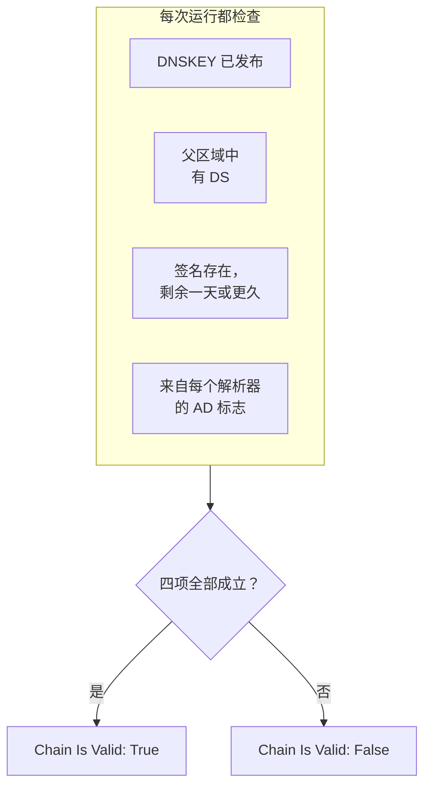

# DNSSEC 监控

DNSSEC 监视器检查已签名的 DNS 区域是否仍能通过验证：它是否发布了自己的密钥、父区域是否为它担保、它的签名是否未过期，以及验证型解析器是否接受它。用它在解析器开始为您的域名返回 `SERVFAIL` 之前，发现断裂的信任链。

:::cards
- [创建监视器](#创建-dnssec-监视器): 在控制台中完成六个步骤。
- [检查哪些内容](#工作原理): 一条有效信任链背后的各项检查。
- [监控标准](#监控标准): 信任链有效性、密钥、DS 记录、签名、解析器和域名服务器。
- [最佳实践](#最佳实践): 行之有效的阈值和解析器。
:::

## 工作原理

每次检查时，探测器针对该区域运行一组 DNS 查询：

| 查询 | 查询对象 | 能告诉您什么 |
| --- | --- | --- |
| `DNSKEY` | **解析器** 中的第一个解析器 | 区域是否发布了它的签名密钥。 |
| `DS` | **解析器** 中的第一个解析器 | 父区域是否为该区域发布了 delegation signer 记录。 |
| `SOA`（附带 DNSSEC 记录） | **解析器** 中的第一个解析器 | 区域的记录是否已签名（为其 `SOA` 记录签名的 `RRSIG`），以及最早过期的签名何时过期。 |
| `A`（附带 DNSSEC 验证） | **解析器** 中的每个解析器 | 每个验证型解析器是否接受该区域；解析器用 authenticated data（AD）标志表明这一点。 |
| `NS`，然后 `SOA` | 第一个解析器，然后是它列出的每个权威域名服务器 | 每个域名服务器是否提供相同的 SOA 序列号。仅当 **检查域名服务器一致性** 打开时进行。 |

验证型解析器会从根开始自上而下检查信任链，因此 AD 标志表明整条链都成立。以下各项全部成立时，信任链即算作有效：

剩余时间不足一天的签名已被视为失效，因此您最多可以在解析器开始拒绝该区域的一天前得到通知。如果某次检查发现信任链断裂或域名服务器不同步，它会在一秒后重新运行，最多重试您设置的次数，然后 OneUptime 才用监视器的条件评估结果。一次尝试中的所有查询共享一个期限，为 **超时（ms）** 的三倍；用完时间的尝试报告的是超时，而不是对区域的判定。

## 开始之前

- **可以创建监视器的角色**：Project Owner、Project Admin、Project Member、Monitor Admin 或 Monitor Member，或者拥有 Create Monitor 权限的自定义角色。
- **一个已签名的区域。** 区域必须已签名，并且已通过您的注册商在父区域中发布其 DS 记录。
- **来自探测器的出站 DNS**，发往您列出的解析器；为了检查域名服务器一致性，还要发往该区域的权威域名服务器。每个新监视器都会选中您项目的默认探测器。

## 创建 DNSSEC 监视器

:::steps
### 开始创建新监视器

前往 **监视器**，点击 **创建监视器**。在 **监视器类型** 下点击 **更多监视器类型**，然后在 **DNS Monitoring** 下选择 **DNSSEC**。

### 命名

输入 **名称**，例如 `example.com DNSSEC`，然后点击 **下一步**。

### 输入区域

在 **区域（域名）** 中输入要验证的区域，例如 `example.com`。保留 **解析器** 的默认值，或用逗号分隔列出您自己的解析器。除非您的网络阻止向任意服务器发送 DNS，否则请保持 **检查域名服务器一致性** 为打开状态。

### 测试

点击 **测试监视器**，在 **选择探测器** 中选择一个探测器，然后点击 **运行测试**。**监视器测试结果** 会显示每项检查的发现。

### 检查条件

**监视器条件** 从 [默认标准](#默认标准) 开始：信任链断裂时为离线，有效时为在线。要在签名过期之前收到警告，请添加一个条件（参见 [最佳实践](#最佳实践)），然后点击 **下一步**。

### 选择探测器并创建

保留或修改 **探测器** 和 **监控间隔**（初始为 **每 5 分钟**），然后点击 **创建监视器**。监视器页面随即打开。
:::

## 配置选项

| 字段 | 默认值 | 要填写的内容 |
| --- | --- | --- |
| **区域（域名）** | 无 | 要验证的区域，例如 `example.com`。 |
| **解析器** | `1.1.1.1, 8.8.8.8, 9.9.9.9` | 要查询的验证型解析器，用逗号分隔。每一个都必须返回 AD 标志，信任链才算有效。 |
| **检查域名服务器一致性** | 打开 | 直接查询每个权威域名服务器，并比较它们的 SOA 序列号。如果您的网络阻止向任意服务器发出 DNS，请将其关闭。 |
| **签名过期警告（天数）**（在 **更多字段** 下） | `7` | 随监视器一起保存。**DNSSEC Signature Expires In Days** 筛选器使用您在条件中给出的值，因此请在条件中设置阈值。 |
| **超时（ms）**（在 **更多字段** 下） | `10000` | 等待每个 DNS 查询的时间，单位为毫秒。一次尝试总共最多可能耗时这个值的三倍。 |
| **重试**（在 **更多字段** 下） | `3` | 第一次尝试失败后的重试次数。`0` 表示只尝试一次。 |

## 监控标准

条件决定区域何时算作在线、性能下降或离线，以及是否因此声明事件或创建警报。每个条件检查一个或多个筛选器：

| 筛选器 | 条件 | 检查内容 |
| --- | --- | --- |
| **DNSSEC Chain Is Valid** | **是**、**否** | 上述四项检查全部成立：密钥已发布、父区域中有 DS、签名存在且剩余一天或更久，以及每个解析器都返回 AD 标志。 |
| **DNSSEC DNSKEY Record Exists** | **是**、**否** | 区域至少发布了一条 DNSKEY 记录。 |
| **DNSSEC DS Record Exists At Parent** | **是**、**否** | 父区域为该区域发布了 DS 记录。 |
| **DNSSEC Signature Expires In Days** | **Greater Than**、**Less Than**、**Greater Than Or Equal To**、**Less Than Or Equal To** | 距最早过期的签名（RRSIG）过期还剩的整天数。 |
| **DNSSEC Resolver Consensus (AD Flag)** | **是**、**否** | **解析器** 中的每个解析器都返回 AD 标志。 |
| **DNSSEC Nameservers Are Consistent** | **是**、**否** | 每个权威域名服务器都以相同的 SOA 序列号应答。在 **检查域名服务器一致性** 关闭期间始终为 **是**。 |

有两个或更多筛选器时，**匹配条件** 决定是 **全部** 筛选器都必须匹配，还是 **任意** 一个匹配即可。条件的 **操作** 决定它做什么：更改监视器状态、创建警报、声明事件，或其中任意几项。

### 默认标准

新的 DNSSEC 监视器以两个条件开始：

- **信任链断裂** — **DNSSEC Chain Is Valid** 为 **否**。监视器被标记为 **离线**，并创建名为“_monitor name_ DNSSEC chain is broken”的事件。信任链再次有效时，事件会自行解决。
- **信任链有效** — 监视器被标记为 **运行正常**。

条件从上到下检查，第一个匹配的条件决定接下来发生什么。没有条件匹配时，监视器显示其默认状态：**运行正常**，除非您在条件下方的 **更多字段** 中选择了其他状态。

默认条件本身不会关注签名过期或域名服务器一致性。请像下面这样为它们添加条件。

### 示例条件

| 目标 | 筛选器 | 条件 | 值 |
| --- | --- | --- | --- |
| 信任链断裂时为离线（默认条件之一） | **DNSSEC Chain Is Valid** | **否** | — |
| 在签名过期之前发出警告 | **DNSSEC Signature Expires In Days** | **Less Than** | `7` |
| 发现丢失了 DS 记录的委派 | **DNSSEC DS Record Exists At Parent** | **否** | — |
| 发现意见不一致的解析器 | **DNSSEC Resolver Consensus (AD Flag)** | **否** | — |
| 发现不同步的域名服务器 | **DNSSEC Nameservers Are Consistent** | **否** | — |

## 最佳实践

1. **选择始终可以访问的解析器。** 每个解析器都必须返回 AD 标志，信任链才算有效，因此探测器无法访问的解析器会在重试用完后让检查失败。默认值 `1.1.1.1`、`8.8.8.8` 和 `9.9.9.9` 由三家不同的运营方运行，这还能发现在一个解析器上通过验证、在另一个解析器上却通不过的区域。
2. **在签名过期之前收到警告。** 签名工具会在签名到期之前为区域重新签名，因此临近过期的签名意味着重新签名已经停止。添加一个 **DNSSEC Signature Expires In Days** / **Less Than** / `7` 的条件来创建警报，再添加一个值为 `2` 的条件来声明事件。由于第一个匹配的条件生效，请把两者都拖到将信任链标记为有效的条件上方，并把 `2` 天的条件放在前面。选择低于签名工具重新签名前通常为签名保留的时长的阈值，这样在重新签名正常时它们会保持安静。
3. **监控每个已签名的区域。** 包括顶点域名、已签名的子域名，以及委派给其他运营方的任何区域。
4. **保持域名服务器一致性检查为打开状态，** 并为它添加一个条件。它能发现已停止从主服务器同步区域传送的辅助服务器，而仅靠 DNSSEC 验证可能会漏掉这一点。

## 故障排查

:::details 信任链被报告为断裂，但区域用 `dig` 能通过验证
**解析器** 中的某个解析器没有返回 AD 标志：它从探测器无法访问，或者它不验证 DNSSEC。**监视器测试结果** 和每次检查摘要中的 **Resolver Checks** 表会显示每个解析器的应答和错误。移除探测器无法访问的解析器，只列出验证型解析器。
:::

:::details 刚做完更改，域名服务器就被报告为不一致
区域更改后，辅助服务器可能会在一段时间内落后于主服务器。检查摘要中的 **Nameserver Consistency** 表会显示每个域名服务器的 SOA 序列号。如果某一台一直落后，说明该辅助服务器已停止同步区域传送。如果每个域名服务器都显示错误，探测器可能被阻止直接查询它们：请关闭 **检查域名服务器一致性**。
:::

:::details 检查报告超时
一次尝试中的所有查询共享 **超时（ms）** 的三倍时间。缓慢或无法访问的解析器会耗尽这段时间；请将它从 **解析器** 中移除，或调高超时。
:::

## 后续步骤

:::cards
- [DNS 监控](/docs/monitor/dns-monitor): 检查名称能否解析，以及其记录的内容。
- [域名监控](/docs/monitor/domain-monitor): 关注域名的注册和到期。
- [SSL 证书监控](/docs/monitor/ssl-certificate-monitor): 关注该域名上提供的证书。
- [事件概览](/docs/incidents/index): 监视器声明事件之后会发生什么。
:::
