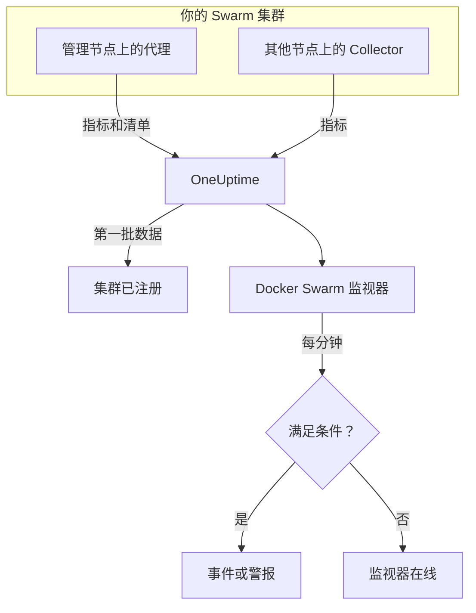

# Docker Swarm 监控

Docker Swarm 监视器监控 Swarm 集群中服务任务背后的容器，在任务重启、负载过高或内存耗尽时通知你。它读取 OneUptime Docker Swarm 代理发送的容器指标，因此不会从外部探测任何东西：安装代理，然后根据模板或你自己的查询创建监视器。

:::cards
- [创建监视器](#创建-docker-swarm-监视器): 在仪表板中完成六个步骤。
- [模板](#现成的警报模板): 四个现成的警报，每个任务一个事件。
- [指标](#收集的指标): 可用于警报的容器指标。
- [过滤器](#监视器设置): 把监视器限定到某个服务、任务或镜像。
:::

## 工作原理

OneUptime Docker Swarm 代理运行在一个管理节点上。它的 Collector 每 30 秒从该节点的 Docker 守护进程读取容器统计信息，并给每批数据打上集群名称 `docker.swarm.cluster.name`。旁边一个小型清单轮询器每 5 分钟从 Swarm API 读取集群的节点、服务和任务。第一批数据会把集群注册到 OneUptime 中。

Collector 只能看到它所在节点上的容器。要获取每个节点的指标，请在每个节点上以相同的 `DOCKER_SWARM_CLUSTER_NAME` 运行 Collector。

Docker Swarm 监视器绑定到一个集群。它每分钟对这个集群的容器指标运行查询，并把结果与条件进行比较。

## 开始之前

- **安装 Docker Swarm 代理**，装在管理节点上。[Docker Swarm 代理指南](/docs/telemetry/docker-swarm) 介绍了安装和升级，以及如何在其他节点上运行 Collector。
- **确认集群已注册。** 第一批数据到达后，它会以代理的 `DOCKER_SWARM_CLUSTER_NAME` 命名，出现在 **产品 → 基础设施 → Docker Swarm → 所有集群** 下。

## 创建 Docker Swarm 监视器

:::steps
### 开始新的监视器

进入 **监视器** 并点击 **创建监视器**。

### 选择 Docker Swarm

在 **监视器类型** 下点击 **更多监视器类型**，然后在 **基础设施** 下选择 **Docker Swarm**，或在搜索框中输入 `swarm`。输入 **名称**（它会用在事件和警报标题中），然后点击 **下一步**。

### 选择集群

在 **Docker Swarm Monitor Configuration** 下，从 **Docker Swarm Cluster** 中选择集群。发送过数据的每个集群都在列表中。

### 选择要监控的内容

选择三个选项卡之一：

- **Quick Setup** – 点击一个 [模板](#现成的警报模板)。它会设置指标、聚合、时间范围和阈值，并用自己的条件替换下面的条件。你仍然可以更改 **时间范围**。
- **Custom Metric** – 从 **Docker Swarm Metric** 中选择一个指标，然后设置 **聚合** 和 **时间范围**。[过滤器](#监视器设置) 可以把范围缩小到部分任务。
- **高级** – 在 **选择指标** 下自己构建查询和公式。使用 **Group by** `resource.container.name` 可以单独评判每个任务。

### 检查条件

打开 **监视器条件** 下的每个条件，检查其 **指标**、**聚合**、**条件** 和 **Threshold**。模板会填好这些内容。使用 **Custom Metric** 或 **高级** 时，监视器从 [默认条件](#默认条件) 开始，这些条件只会注意到指标降到零，所以请设置你自己的阈值。

### 创建监视器

点击 **创建监视器**。OneUptime 会打开监视器的页面，并每分钟评估一次。它打开的事件和警报也会列在集群的 **事件** 和 **警报** 页面上。
:::

> [!TIP]
> 要一次设置多个模板，请从 **产品 → 基础设施 → Docker Swarm** 打开集群，然后进入 **Recommendations**。选择你需要的模板和要呼叫的人，OneUptime 会为每个模板创建一个监视器。

## 监视器设置

| 字段 | 选项卡 | 作用 |
| --- | --- | --- |
| **Docker Swarm Cluster** | 全部 | 必填。把每个查询限定在 `resource.docker.swarm.cluster.name`。这是代理打上的唯一资源属性，所以监视器不会添加 `container.runtime` 或 `host.name` 过滤器。 |
| **服务名称** | Custom Metric、高级 | 可选。与 `docker.swarm.service.name` 完全匹配，例如 `web`。 |
| **节点名称** | Custom Metric、高级 | 可选。与 `docker.swarm.node.name` 完全匹配，例如 `swarm-node-1`。 |
| **容器名称** | Custom Metric、高级 | 可选。与 `resource.container.name` 完全匹配。任务的容器命名为 `<service>.<slot>.<taskid>`，例如 `web.1.abc123`。 |
| **容器镜像** | Custom Metric、高级 | 可选。与 `resource.container.image.name` 完全匹配，例如 `nginx:latest`。 |
| **Docker Swarm Metric** | Custom Metric | [目录](#收集的指标) 中的一个指标。 |
| **聚合** | Custom Metric | 样本的合并方式：**平均值**、**最大值**、**最小值**、**总和** 或 **计数**。初始值为该指标通常的聚合方式。 |
| **时间范围** | 全部 | 查询读取的滚动窗口，从 **Past 1 Minute** 到 **Past 365 Days**。新监视器从 **Past 1 Minute** 开始；模板会设置自己的值。 |
| **选择指标** | 高级 | 查询构建器：**指标**、**Aggregate by**、**Filter by attributes**、**Group by**，以及用于组合查询的 **添加指标** 和 **添加公式**。 |

> [!WARNING]
> 随附的代理目前还不会设置 `docker.swarm.service.name` 或 `docker.swarm.node.name`，所以填写了 **服务名称** 或 **节点名称** 的监视器找不到数据。请改为按 **容器镜像** 缩小范围，或按 `resource.container.name` 分组。

## 现成的警报模板

**Quick Setup** 提供四个模板。每个模板都会构建一个完整的监视器：一个按 `resource.container.name` 分组的查询、一个触发的条件和一个恢复的条件。每个任务都单独评判，并有自己的事件和警报，其根本原因会列出受影响的任务及其值。阈值只是起点，你可以编辑。

除非表中另有说明，条件只有在其窗口的每一分钟都成立时才会触发，并在越过阈值 10% 处恢复，这样在边界附近徘徊的值不会来回跳动。

| 模板 | 严重程度 | 监控内容 | 触发时机 | 恢复时机 |
| --- | --- | --- | --- | --- |
| Task Down (Low Uptime) | 严重 | `container.uptime`，按任务取 Min，最近 1 分钟 | 任意值低于 60 秒 | 每个值都不低于 66 秒 |
| High Task CPU Usage | Warning | `container.cpu.utilization`，按任务取 Avg，最近 5 分钟 | 高于 80（单个核心的 %） | 不高于 72 |
| High Task Memory Usage | Warning | `container.memory.percent`，按任务取 Avg，最近 5 分钟 | 高于 85% | 不高于 76.5% |
| High Task Process Count | Warning | `container.pids.count`，按任务取 Max，最近 5 分钟 | 高于 500 | 不高于 450 |

**严重程度** 是选择列表中显示的标签。模板创建的事件和警报从项目中最严重的事件和警报严重程度开始；请在条件中更改它们。

> [!NOTE]
> **Task Down (Low Uptime)** 模板只要有一个“年轻”的样本就会触发，因为重启是一个事件，而不是一个水平。Swarm 会给替代任务一个新容器，也就是一个新序列，所以模板查找的是运行时间不足一分钟，而不是 0。部署或扩容也会触发它，当新任务的运行时间超过一分钟后就会清除。终止后没有被替换的任务不发送任何数据，因此无法被捕捉。

## 收集的指标

代理的 Collector 使用 OpenTelemetry `docker_stats` 接收器，所以这些指标就是标准的容器指标，每个任务容器一个序列。没有 `docker_swarm_*` 指标：节点、服务和任务作为清单跟踪，显示在集群的 **服务**、**任务**、**节点** 及相关页面上。

### CPU

| 指标 | 单位 | 说明 |
| --- | --- | --- |
| `container.cpu.utilization` | % | 任务容器的 CPU 利用率，100% 表示一个完整的 CPU 核心。 |

### 内存

| 指标 | 单位 | 说明 |
| --- | --- | --- |
| `container.memory.usage.total` | 字节 | 任务容器使用的内存。 |
| `container.memory.percent` | % | 已用内存占容器限制的百分比；服务没有设置限制时，占节点总内存的百分比。 |

### 网络

| 指标 | 单位 | 说明 |
| --- | --- | --- |
| `container.network.io.usage.rx_bytes` | 字节 | 任务容器接收的字节数。生命周期计数器。 |
| `container.network.io.usage.tx_bytes` | 字节 | 任务容器发送的字节数。生命周期计数器。 |

### 容器

| 指标 | 单位 | 说明 |
| --- | --- | --- |
| `container.pids.count` | 计数 | 任务容器内的进程。突然上升可能意味着 fork 炸弹或泄漏。 |
| `container.uptime` | 秒 | 任务容器已运行的时间。被重新调度或重启的任务会从 0 开始一个新容器。 |

每个序列都把容器的身份作为资源属性携带：`resource.container.name`（`<service>.<slot>.<taskid>`）、`resource.container.image.name` 和 `resource.docker.swarm.cluster.name`。

## 监控条件

条件把监视器的某个查询或公式与阈值进行比较。Docker Swarm 监视器的条件没有 **过滤器类型**：每条规则都用以下字段检查指标值。

| 字段 | 作用 |
| --- | --- |
| **指标** | 要检查的查询或公式，按其变量名指定。 |
| **聚合** | 窗口中的值如何变成一个结果：**平均值**、**总和**、**Maximum Value**、**Minimum Value**、**All Values**（每个值都必须匹配）或 **Any Value**（一个就够）。 |
| **条件** | **Greater Than**、**Less Than**、**Greater Than Or Equal To**、**Less Than Or Equal To** 或 **Equal To**，或者异常条件：**Anomalously High**、**Anomalously Low** 或 **Anomalous**。 |
| **Threshold** | 用于比较的值。如果指标有单位，旁边会有单位列表。异常条件下不显示。 |
| **灵敏度** | 仅限异常条件。**低**（4σ）、**中**（3σ，默认）或 **高**（2σ）。 |
| **基线窗口** | 仅限异常条件。14 天（默认）、28、60 或 90 天的历史。 |
| **如果无数据** | 位于 **更多字段** 下。窗口中没有样本时的处理方式：**Ignore**（默认）、**Treat As Zero** 或 **触发器**。 |

异常条件会把每个值与基线中一周的同一小时进行比较。在基线窗口积累足够的历史之前，它们会保持在“Learning”状态，不产生任何结果。

每个条件还会说明匹配时要做什么：更改监视器状态、创建警报或宣布事件。条件按从上到下的顺序检查，第一个匹配的条件决定结果。

### 默认条件

不是从模板构建的监视器会以两个条件开始：

| 顺序 | 条件 | 匹配时机 | 结果 |
| --- | --- | --- | --- |
| 1 | Check if _monitor name_ is offline | 第一个查询的任意值为 `0` | 将监视器标记为 **离线**，并宣布事件“_monitor name_ is offline”，监视器恢复后该事件会自动解决。 |
| 2 | Check if _monitor name_ is online | 任意值大于 `0` | 将监视器标记为 **运行正常**。 |

> [!IMPORTANT]
> 静默不匹配任何一个条件：停止发送数据的集群会让监视器保持原样。要在数据停止时收到通知，请在某个条件上把 **如果无数据** 设为 **触发器**。OneUptime 自身未接收数据的时间永远不算作无数据：窗口中包含这类时间的检查会改为等待，详见 [OneUptime 未接收数据时](/docs/monitor/when-oneuptime-is-not-receiving)。

## 故障排除

:::details 集群不在 Docker Swarm Cluster 列表中
集群会根据代理的数据自动注册。请检查代理是否在管理节点上运行、是否设置了 `DOCKER_SWARM_CLUSTER_NAME`，以及集群是否列在 **产品 → 基础设施 → Docker Swarm → 所有集群** 下。[Docker Swarm 代理指南](/docs/telemetry/docker-swarm) 中有需要在节点上执行的检查。
:::

:::details 只有部分任务有指标
Collector 读取的是它所在节点的 Docker 守护进程，所以只能看到该节点上的任务。请在每个节点上以相同的 `DOCKER_SWARM_CLUSTER_NAME` 运行 Collector。
:::

:::details 按服务或节点过滤的监视器找不到数据
**服务名称** 和 **节点名称** 匹配的是 `docker.swarm.service.name` 和 `docker.swarm.node.name`，而随附的代理不会设置它们。清空这两项并按 **容器镜像** 缩小范围，或按 `resource.container.name` 分组。
:::

:::details 所有任务都显示为一个序列
像模板那样，按资源属性 `resource.container.name` 分组。不带前缀的 `container.name` 什么也匹配不到，所以所有任务会合并成一个名称为空的序列。
:::

## 后续步骤

:::cards
- [Docker Swarm 代理](/docs/telemetry/docker-swarm): 安装和升级本监视器读取的代理。
- [Docker 监控](/docs/monitor/docker-monitor): 监控单台 Docker 主机的容器。
- [事件概览](/docs/incidents/index): 条件宣布事件之后会发生什么。
- [值班计划](/docs/on-call/schedules): 决定任务出问题时呼叫谁。
:::
