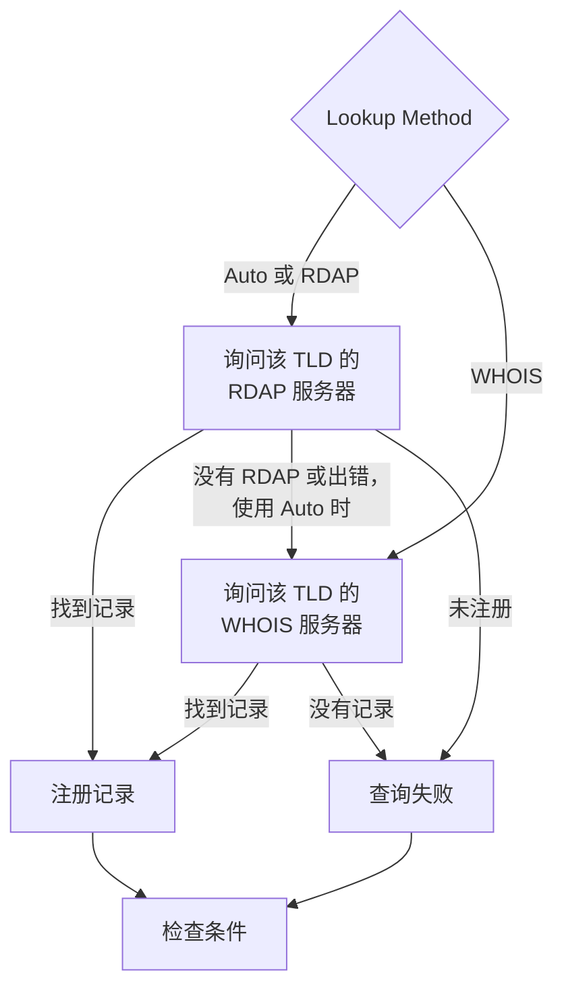

# 域名监控

域名监视器按计划读取您域名的注册记录，跟踪其到期日期、注册商、域名服务器和状态码，并在域名过期之前提醒您。请为您的网站、API 和电子邮件所依赖的每个域名使用它：注册一旦过期，它们会同时全部中断。

:::cards
- [创建监视器](#创建域名监视器): 在控制台中完成六个步骤。
- [查询方式](#查询方式): RDAP、WHOIS，以及为什么默认使用 **Auto**。
- [默认标准](#默认标准): 无需设置，提前 30 天发出过期警告。
- [故障排查](#故障排查): 已停用的 WHOIS 服务器、代理和缺失的日期。
:::

## 工作原理

每次检查时，探测器根据 **Lookup Method** 通过 RDAP 或 WHOIS 查询域名的注册记录，并将查到的内容规范化：到期日期、注册商、域名服务器和状态码。查询失败时会重试，最多重试您设置的次数。然后 OneUptime 用监视器的条件评估该记录。

如果查询无法得到注册数据（因为该 TLD 的服务已停用，或域名未注册），监视器会被报告为 **离线**，并在监视器的探测器响应中显示原因，而不是带着空的到期日期被报告为正常。回答“此域名可用”的注册局（例如 DENIC 的 `Status: free`）会被视为 **未注册**，而不是正常的记录。

国际化域名两种形式都可以接受：`münchen.de` 在查询前会被转换为其 A 标签（`xn--mnchen-3ya.de`）。

## 开始之前

- **可以创建监视器的角色**：Project Owner、Project Admin、Project Member、Monitor Admin 或 Monitor Member，或者拥有 Create Monitor 权限的自定义角色。
- **探测器到注册局的出站访问。** 每个新监视器都会选中您项目的默认探测器；[自定义探测器](/docs/probe/custom-probe) 需要能够访问：

| 目标 | 协议 | 用途 |
| --- | --- | --- |
| `https://data.iana.org/rdap/dns.json` | HTTPS，端口 443 | IANA 的 RDAP 引导注册表，说明每个 TLD 的 RDAP 服务器在哪里。获取一次并缓存 24 小时。 |
| 各注册局的 RDAP 服务器 | HTTPS，端口 443 | RDAP 查询。 |
| WHOIS 服务器 | TCP 端口 43 | WHOIS 查询。 |

RDAP 请求遵循探测器的 `HTTP_PROXY_URL` / `HTTPS_PROXY_URL` / `NO_PROXY` 设置。WHOIS 通过原始套接字运行，不遵循这些设置。如果探测器无法访问 `data.iana.org`，**Auto** 会回退到 WHOIS，并在五分钟后再次尝试 IANA。

## 创建域名监视器

:::steps
### 开始创建新监视器

前往 **监视器**，点击 **创建监视器**。在 **监视器类型** 下点击 **更多监视器类型**，然后在 **Basic Monitoring** 下选择 **域名**。

### 命名

输入 **名称**，例如 `example.com registration`，然后点击 **下一步**。

### 输入域名

输入 **域名**，例如 `example.com`。除非有理由，否则请将 **Lookup Method** 保持为 **Auto**（参见 [查询方式](#查询方式)）。

### 测试

点击 **测试监视器**，在 **选择探测器** 中选择一个探测器，然后点击 **运行测试**。**监视器测试结果** 会显示探测器读取的注册记录，以及是 RDAP 还是 WHOIS 做出了应答。

### 检查条件

**监视器条件** 从 [默认标准](#默认标准) 开始：注册已过期或无法读取时为离线，30 天内过期时发出警报。如有需要可修改，然后点击 **下一步**。

### 选择探测器并创建

保留或修改 **探测器** 和 **监控间隔**（初始为 **每 5 分钟**），然后点击 **创建监视器**。监视器页面随即打开。
:::

## 配置选项

| 字段 | 默认值 | 要填写的内容 |
| --- | --- | --- |
| **域名** | 无 | 已注册的域名，例如 `example.com`。粘贴的地址也可以：`https://example.com/pricing` 会被读作 `example.com`。 |
| **Lookup Method** | **Auto** | **Auto**、**RDAP** 或 **WHOIS**。参见 [查询方式](#查询方式)。 |
| **超时（ms）**（在 **更多字段** 下） | `10000` | 等待每次注册查询的时间，单位为毫秒。 |
| **重试**（在 **更多字段** 下） | `3` | 第一次尝试失败后的重试次数。`0` 表示只尝试一次。 |

每次失败的查询都会重试，两次尝试之间暂停一秒。即使注册局回答域名未注册，或者它没有注册服务，也会重试，以防这个回答只是一次临时故障。只有格式错误的域名会立即报告，不进行查询。

超时适用于每个请求，而不是整个检查：一次先尝试 RDAP、再回退到 WHOIS 的 **Auto** 检查，耗时可能是两倍甚至更长。

### 查询方式

注册数据可以通过两种协议读取，哪一种可用取决于 TLD。

| 方式 | 行为 |
| --- | --- |
| **Auto** | 默认。TLD 发布了 RDAP 服务时使用 RDAP；没有发布，或 RDAP 查询失败时，回退到 WHOIS。 |
| **RDAP** | 仅使用 RDAP。如果 TLD 没有发布 RDAP 服务，会以明确的错误失败。 |
| **WHOIS** | 仅使用 WHOIS。 |

**RDAP**（[RFC 9083](https://www.rfc-editor.org/rfc/rfc9083)）是 ICANN 强制要求的 WHOIS 替代方案。每个 TLD 的权威服务器通过 [IANA 的引导注册表](https://www.rfc-editor.org/rfc/rfc9224) 查找，因此在注册局迁移时也能保持正确。每个 gTLD 都会发布一个。当 TLD 的 RDAP 服务器表示域名未注册时，**Auto** 会把它当作答案，不再询问 WHOIS。

**WHOIS** 没有对应的发现机制——客户端随附一张从 TLD 到 WHOIS 主机的固定映射表，而这些表会过时。Identity Digital 的每个 TLD（`.digital`、`.email`、`.life`、`.today`、`.zone` 以及另外约 290 个）仍映射到一个已停用的主机，该主机现在对每个查询都只返回字面文本 `TLD is not supported.`，而不是记录。对于许多根本不发布 RDAP 服务的 ccTLD（例如 `.io`、`.co`、`.de`、`.ch` 和 `.jp`），WHOIS 仍是唯一的选择。

## 监控标准

条件决定域名何时算作正常或有问题，以及是否因此声明事件或创建警报。每个条件检查一个或多个筛选器：

| 筛选器 | 条件 | 检查内容 |
| --- | --- | --- |
| **Is Online** | **是**、**否** | 注册查询本身是否成功。 |
| **Is Request Timeout** | **是**、**否** | 查询是否在每次尝试中都超时。 |
| **Domain Expires In Days** | **Greater Than**、**Less Than**、**Greater Than Or Equal To**、**Less Than Or Equal To** | 距注册过期的天数，向上取整到整天。 |
| **Domain Is Expired** | **是**、**否** | 到期日期是否已过。 |
| **Domain Registrar** | **包含**、**Not Contains**、**Starts With**、**Ends With**、**Equal To**、**Not Equal To** | 注册商的名称。 |
| **Domain Name Server** | **包含**、**Not Contains**、**Starts With**、**Ends With**、**Equal To**、**Not Equal To** | 域名的域名服务器。只要其中任意一个匹配即匹配。 |
| **Domain Status Code** | **包含**、**Not Contains**、**Starts With**、**Ends With**、**Equal To**、**Not Equal To** | 域名的 EPP 状态码。只要其中任意一个匹配即匹配。 |

无论是哪种协议应答，状态码都会规范化为它们的 EPP 名称（`clientTransferProhibited`），因此当 **Auto** 在 RDAP 和 WHOIS 之间切换时，条件仍能继续匹配。注册商的 _名称_ 取决于应答服务发布的内容，在两种协议之间可能略有不同，因此对于 **Domain Registrar** 条件，请优先使用 **包含** 而不是 **Equal To**。

日期会规范化为 ISO 8601。注册局以无法解析的格式发布的日期会被省略而不是存储，这样到期条件就无法判断、也不会匹配，而不是一直悄悄地回答“未过期”。

有两个或更多筛选器时，**匹配条件** 决定是 **全部** 筛选器都必须匹配，还是 **任意** 一个匹配即可。条件的 **操作** 决定它做什么：更改监视器状态、创建警报、声明事件，或其中任意几项。

### 默认标准

新的域名监视器以三个条件开始，因此无需任何设置就能在注册过期之前提醒您：

1. **域名检查失败** — 注册已过期，或无法读取其注册数据。监视器被标记为 **离线**，并创建名为“_monitor name_ domain check failed”的事件。注册再次能够读取并且有效时，事件会自行解决。
2. **域名即将过期** — 注册尚未过期，但将在 30 天内过期。会创建名为“_monitor name_ domain expires soon”的 **警报**。
3. **域名未过期** — 监视器被标记为 **运行正常**。

“即将过期”的提醒是警报，而不是事件：它不会显示在您的状态页上，除非您为它添加值班策略，否则不会呼叫任何人，也不会改变监视器的状态。它使用您项目的第二个警报严重程度，在新项目中为 **Low**。续期出现在注册记录中后，警报会自行解决。不发布到期日期的注册局不会给提醒任何依据，因此提醒保持安静。

条件从上到下检查，第一个匹配的条件决定接下来发生什么。因此“即将过期”位于“未过期”之上：即将过期的域名尚未过期，所以会同时匹配两者。

要更早收到提醒，请修改“即将过期”条件中 **Domain Expires In Days** 筛选器的值，例如改为 `60`。要改为呼叫某人，请打开该条件的 **操作**：打开 **当过滤器匹配时，声明事件。** 或者保留警报，并在 **值班策略** 下为它添加值班策略。

:::details 为在此提醒出现之前创建的监视器添加提醒
在 OneUptime 添加此提醒之前创建的监视器没有“即将过期”条件。要添加它：

1. 在监视器上打开 **配置 → 标准**，然后点击 **编辑监控条件**。
2. 点击 **添加条件**。将其筛选器设为 **Domain Is Expired** / **否**，点击 **添加过滤器**，并将第二个设为 **Domain Expires In Days** / **Less Than Or Equal To** / `30`。将 **匹配条件** 保持为 **全部**（有两个筛选器后，它会出现在筛选器下方）。
3. 在 **操作** 下打开 **当过滤器匹配时，创建警报。** 并保持 **当过滤器匹配时，更改监视器状态。** 关闭，使它创建警报而不改变监视器状态。
4. 将新条件拖到把监视器标记为在线的条件上方，然后保存。
:::

### 示例条件

| 目标 | 筛选器 | 条件 | 值 |
| --- | --- | --- | --- |
| 域名在 30 天内过期时发出警报（默认条件之一） | **Domain Expires In Days** | **Less Than Or Equal To** | `30` |
| 域名过期时为离线 | **Domain Is Expired** | **是** | — |
| 无法读取注册时为离线 | **Is Online** | **否** | — |
| 域名服务器变化时发出警报 | **Domain Name Server** | **Not Contains** | `ns1.example.com` |
| 域名的转移锁定被解除时发出警报 | **Domain Status Code** | **Not Contains** | `clientTransferProhibited` |

只要 _任意一个_ 值匹配，**Domain Name Server** 和 **Domain Status Code** 就会匹配，因此只要有一个域名服务器或一个状态码不包含该文本，**Not Contains** 就会匹配。

## 最佳实践

1. **给自己留出续期时间** — 默认提醒在过期前 30 天发出。如果续期需要审批或耗时较长的付款，请提高到 60 天。
2. **覆盖查询失败的情况** — 在离线条件中加入 **Is Online** / **否** 筛选器，避免把无法读取的注册误认为正常。新监视器的默认条件中已包含它；在它加入之前创建的监视器需要手动添加。要扛过偶尔对探测器限速的 WHOIS 服务器，请在该筛选器下勾选 **在一段时间内评估此条件**，并选择 **All Values**：这样只有当窗口内的每次查询都失败时，域名才会离线。
3. **监控所有关键域名** — 包括主域名、单独注册的子域名，以及用于电子邮件或 API 的任何域名。
4. **跟踪注册商变更** — 添加一个 **Domain Registrar** / **Not Contains** / 您的注册商名称 的条件，以发现未经授权的转移。

## 故障排查

:::details WHOIS 服务器“answered without any registration data”
该 TLD 的 WHOIS 主机已停用、正在对探测器限速，或暂时出现故障。已停用的主机（例如 Identity Digital 的 TLD 仍映射到的那台）每次都回答 `TLD is not supported.`。如果在 **Lookup Method** 为 **WHOIS** 时故障持续存在，请切换到 **Auto**，让探测器在有 RDAP 服务的地方读取该 TLD 的 RDAP 服务。
:::

:::details 检查失败，提示“No RDAP service is published”
监视器使用的是 **RDAP**，而该 TLD 没有发布 RDAP 服务，许多 ccTLD 都是如此。请将 **Lookup Method** 切换为会回退到 WHOIS 的 **Auto**。
:::

:::details 域名被报告为未注册
注册局回答该域名可用。请检查拼写，并确认您输入的是已注册的域名（例如 `example.com`），而不是子域名。
:::

:::details 代理后面的探测器上查询失败
RDAP 会经过探测器的代理设置，WHOIS 不会。请为 WHOIS 放行出站 TCP 端口 43，或者对发布了 RDAP 服务的 TLD 使用 **Auto** 或 **RDAP**。
:::

:::details 到期日期为空，到期条件从不触发
注册局没有发布到期日期，或者以无法解析的格式发布。没有日期，到期条件就无法判断，因此保持安静。**Is Online** 仍会告诉您记录能否被读取。
:::

## 后续步骤

:::cards
- [SSL 证书监控](/docs/monitor/ssl-certificate-monitor): 在该域名上的证书过期之前收到提醒。
- [DNS 监控](/docs/monitor/dns-monitor): 检查域名的记录能否解析，以及其内容。
- [DNSSEC 监控](/docs/monitor/dnssec-monitor): 验证已签名区域的信任链。
- [升级规则](/docs/on-call/escalation-rules): 决定警报和事件呼叫谁。
:::
