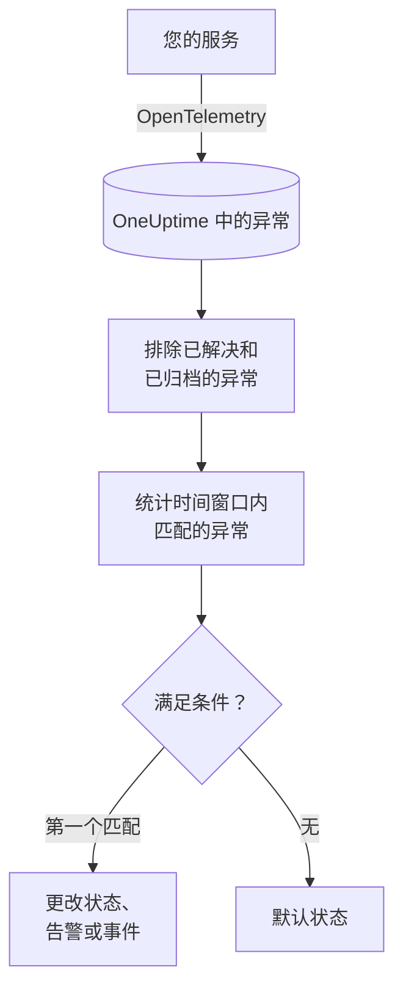

# 异常监控

异常监视器在一个时间窗口内统计您的服务报告给 OneUptime、且与您的过滤器（消息、异常类型、环境、服务）匹配的异常。当计数满足您的条件时，它会更改监视器的状态、创建告警或声明事件。可以用它对生产环境中任何新的崩溃、某一种异常类型，或错误的突然增加告警。

:::cards
- [创建监视器](#创建异常监视器): 选择要统计的异常以及何时告警。
- [环境](#环境): 把监视器限定在 `production`。
- [如何评估](#如何评估): 统计什么，以及解决一个异常会带来什么。
- [条件](#条件): 条件和默认值。
:::

## 工作原理



OneUptime 每分钟统计一次与监视器过滤器匹配、且在其时间窗口内发生的异常，并排除您已标记为已解决或已归档的异常。它把这个计数从上到下与监视器的条件比较，第一个匹配的条件决定发生什么。如果没有条件匹配，监视器会回到默认状态。

## 开始之前

- 您的服务通过 OpenTelemetry 把异常发送到 OneUptime。请参阅 [OpenTelemetry](/docs/telemetry/open-telemetry)。
- 若要把监视器限定在某个环境，您的服务必须设置资源属性 `deployment.environment`。

## 创建异常监视器

:::steps
### 开始创建新监视器

前往 **监视器**，点击 **创建监视器**。

### 选择 Exceptions

在 **监视器类型** 下点击 **更多监视器类型**，然后在 **遥测** 下选择 **异常**，或在搜索框中输入 `exceptions`。输入 **名称**，然后点击 **下一步**。

### 选择要统计的异常

在 **异常监视器配置** 中设置 **过滤异常消息**、**异常类型**、**Environments**、**监视器异常（时间）**。留空的过滤器匹配所有异常。过滤器下方的 **异常预览** 显示它们当前匹配的异常。

### 缩小范围（可选）

打开 **更多字段**，按遥测服务或基础设施实体过滤，或者也统计已解决和已归档的异常。

### 设置条件

**监视器条件** 卡片一开始有两个条件：有任何异常匹配时离线并创建事件；没有匹配时在线。请把它们改成您想告警的情况（请参阅 [条件](#条件)）。

### 创建监视器

点击 **创建监视器**。监视器会在其 **概览** 页面打开，第一次评估在一分钟内运行。
:::

## 查询内容

| 字段 | 匹配什么 | 默认值 |
| --- | --- | --- |
| **过滤异常消息** | 消息包含此文本的异常，不区分大小写。 | 空：所有异常 |
| **异常类型** | 属于这些类型之一的异常，用逗号分隔，例如 `TypeError, NullReferenceException`。类型名称必须完全匹配。 | 空：所有类型 |
| **Environments** | 来自这些环境之一的异常，用逗号分隔（请参阅 [环境](#环境)）。 | 空：所有环境 |
| **监视器异常（时间）** | 最近 5 秒到最近 24 小时内的异常。 | **最近 1 分钟** |
| **按遥测服务过滤**（在 **更多字段** 中） | 来自所选任一服务的异常。 | 空：所有服务 |
| **Filter by Infrastructure Entity**（在 **更多字段** 中） | 来自所选任一主机、Pod、容器及其他实体的异常。 | 空：所有实体 |
| **包含已解决的异常**（在 **更多字段** 中） | 同时统计已标记为已解决的异常。 | 关闭 |
| **包含已归档的异常**（在 **更多字段** 中） | 同时统计已归档的异常。 | 关闭 |

异常必须匹配您设置的所有过滤器才会被计数。

### 环境

环境来自每个异常上的 OpenTelemetry 资源属性 `deployment.environment`，与异常浏览器用 `env:production` 过滤的值相同。输入一个环境，或用逗号分隔输入多个；当异常的环境与其中任何一个匹配时，它就会被计数。

匹配是精确的，并且区分大小写：`production` 不匹配 `Production` 或 `prod`。设置此过滤器后，没有环境的异常不会被计数。留空则统计所有环境的异常，包括没有环境的异常。

环境过滤器会与其他所有过滤器组合，因此限定于某个遥测服务和 `production` 的监视器，只会统计该服务的生产环境异常。

通过 API 创建监视器时，请把步骤的 `exceptionMonitor` 中的 `environments` 设为环境名称列表：

```json
{
  "exceptionMonitor": {
    "telemetryServiceIds": [],
    "environments": ["production"],
    "exceptionTypes": [],
    "message": "",
    "includeResolved": false,
    "includeArchived": false,
    "lastXSecondsOfExceptions": 300
  }
}
```

## 如何评估

- **每分钟。** 异常监视器不由探测器检查，因此没有可设置的间隔，也没有 **探测器与间隔** 页面。
- **统计发生次数，而不是异常类型。** 每当匹配的异常在 **监视器异常（时间）** 内发生一次，监视器就计数一次。一个异常抛出 40 次就计为 40。
- **已解决和已归档的异常会被排除。** 除非您开启 **包含已解决的异常** 或 **包含已归档的异常**，否则您已标记为已解决或已归档的异常的发生不会被计数。因此，把异常标记为已解决可能会关闭它打开的事件。已解决的异常再次发生时，会自动变回未解决并重新被计数。
- **没有异常就是计数 0。**
- **OneUptime 自身的停机不算沉默。** 只要时间窗口中包含 OneUptime 自身未接收数据的时间（正在重启、升级或追赶积压），检查就会等待：状态不会改变，也不会打开或解决任何事件或告警。请参阅 [OneUptime 未接收数据时](/docs/monitor/when-oneuptime-is-not-receiving)。
- **条件从上到下。** 第一个匹配的条件决定结果，因此请把最严重的放在最前面。

每次状态变化及其原因都会记录在监视器的 **状态时间线** 上。

## 条件

异常监视器的条件只有一个 **过滤器类型**：**Exception Count**，即窗口内匹配的异常数量。选择一个 **过滤条件** 和一个 **值**。

| 过滤条件 | 当异常数量…时匹配 |
| --- | --- |
| **Greater Than** | 高于该值 |
| **Greater Than Or Equal To** | 等于或高于该值 |
| **Less Than** | 低于该值 |
| **Less Than Or Equal To** | 等于或低于该值 |
| **Equal To** | 正好等于该值 |
| **Not Equal To** | 不等于该值 |

异常数量没有异常条件：没有可以与之比较的基线。

新的异常监视器从以下条件开始：

| 条件 | 过滤器 | 效果 |
| --- | --- | --- |
| Check if … has exceptions | **Exception Count** **Greater Than** `0` | 将监视器标记为离线并声明事件，事件会自动解决 |
| Check if … has no exceptions | **Exception Count** **Equal To** `0` | 将监视器标记为在线 |

## 实例：只看生产环境的异常

您希望 API 在生产环境中抛出异常时都创建事件，而对 staging 不做任何处理。您把 **Environments** 设为 `production`，把 **监视器异常（时间）** 设为 **最近 5 分钟**，并保留默认条件。在最近五分钟内：

| 异常 | 环境 | 状态 | 是否计数？ |
| --- | --- | --- | --- |
| `TypeError` × 3 | `production` | 活跃 | 是：3 |
| `TypeError` × 40 | `staging` | 活跃 | 否：其他环境 |
| `TimeoutError` × 2 | 无 | 活跃 | 否：没有环境 |
| `NullReferenceException` × 4 | `production` | 发生后已解决 | 否：已解决 |

**Exception Count** 为 3，因此 **Greater Than** `0` 匹配：监视器变为离线并声明事件。当五分钟内没有任何活跃的生产环境异常时，在线条件匹配，事件会自行解决。

## 故障排查

:::details 浏览器中能看到异常，但监视器计数为 0
把 **Environments** 的值与浏览器的 `env:` 过滤器比较：匹配是精确的且区分大小写，设置过滤器后没有环境的异常会被排除。然后检查这些异常是否已解决或已归档。打开监视器的 **标准** 页面（在 **配置** 下），点击 **Edit Monitoring Criteria**：**异常预览** 会显示过滤器匹配的内容。
:::

:::details 我解决异常后，事件也解决了
这是预期行为。已解决的异常不会被计数，因此计数下降，条件不再匹配。如果该异常再次发生，它会变回未解决并重新被计数。若要无论如何都统计它们，请开启 **包含已解决的异常**。
:::

:::details 异常类型过滤器什么都不匹配
**异常类型** 会与报告异常时使用的类型名称（例如 `TypeError`）精确比较。请从异常浏览器中复制类型。
:::

## 后续步骤

:::cards
- [跟踪监控](/docs/monitor/traces-monitor): 对失败的 Span 和端点告警。
- [日志监控](/docs/monitor/logs-monitor): 对日志量和日志内容告警。
- [事件与告警模板](/docs/monitor/incident-alert-templating): 编写有用的告警标题和描述。
- [OpenTelemetry](/docs/telemetry/open-telemetry): 把异常发送到 OneUptime。
:::
