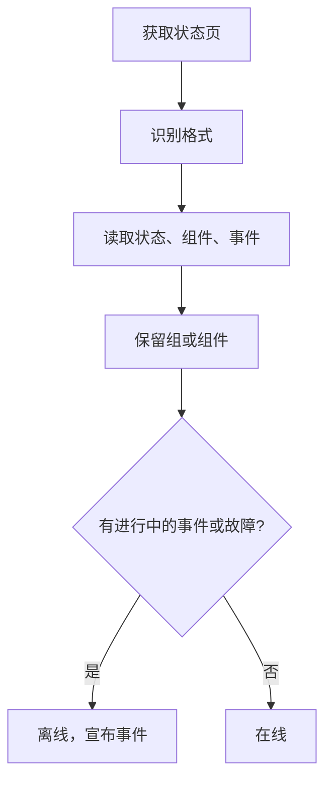

# 外部状态页监控

外部状态页监视器会关注你所依赖的服务（AWS、GCP、Azure、GitHub、OpenAI、Anthropic 等众多服务）的公开状态页，并在该服务商报告故障或性能下降时向你告警。用它在服务商报告上游问题的第一时间得知，并把这些问题与你自己的问题区分开。

:::cards
- [创建监视器](#创建外部状态页监视器): 粘贴状态页 URL，并选择要关注的内容。
- [限定范围](#配置选项): 只关注一个组件组或一个组件。
- [条件](#监控条件): 默认情况下什么算作宕机。
- [常用状态页](#常用状态页-url): 大多数团队所依赖服务的 URL。
:::

## 工作原理

每次检查时，探测器会获取状态页，识别它使用的格式，并读取整体状态、组件和进行中的事件。如果你把监视器限定到某个组件组或组件，就只计算这些内容。然后由条件决定监视器是在线还是离线。

可以用它来：

- 监控你的应用所依赖的第三方服务的可用性
- 在上游服务商发生故障时收到告警
- 跟踪各个组件的状态
- 把监控限定到单个组件组（例如只关注 OpenAI 的 "APIs"），这样页面上其他无关的事件就不会触发你的监视器
- 在性能下降影响用户之前发现它
- 把你自己的事件与上游服务商的问题关联起来

## 支持的服务商

| 服务商 | 说明 |
| ------------------------ | ---------------------------------------------------------------------- |
| **Auto**（默认） | 自动识别状态页格式 |
| **Atlassian Statuspage** | 由 Atlassian Statuspage 提供的状态页（JSON API） |
| **incident.io** | 由 incident.io 提供的状态页（例如 `https://status.openai.com`） |
| **RSS** | 提供 RSS 订阅源的状态页 |
| **Atom** | 提供 Atom 订阅源的状态页 |

### 自动识别

设置为 **Auto** 时，OneUptime 会按以下顺序自动识别状态页格式：

1. 首先尝试 incident.io 状态页 API（`/proxy/<host>`）。
2. 接着尝试 Atlassian Statuspage JSON API（`/api/v2/status.json`、`/api/v2/components.json` 和 `/api/v2/incidents/unresolved.json`）。
3. 如果都失败，就尝试把页面解析为 RSS 或 Atom 订阅源。
4. 最后的兜底是一次基本的 HTTP 可达性检查。

> [!NOTE]
> 之所以先检查 incident.io，是因为一些 incident.io 状态页（例如 `https://status.openai.com`）还暴露了一个功能有限、兼容 Atlassian 的端点，其中省略了组件组和进行中的事件。先检查 incident.io 可以确保使用更丰富、包含分组信息的数据。

当你明确选择的服务商失败时，也会退回到可达性检查。它只告诉你页面是否有响应（返回 `2xx` 或 `3xx` 即为在线），不会报告任何组件或事件。

## 创建外部状态页监视器

:::steps
### 开始一个新监视器

进入 **监视器**，点击 **创建监视器**。在 **监视器类型** 下点击 **更多监视器类型**，然后在 **Basic Monitoring** 下选择 **External Status Page**，或在搜索框中输入 `statuspage`。输入 **名称**，然后点击 **下一步**。

### 输入状态页 URL

输入 **状态页 URL**。除非你知道格式，否则请把 **提供商** 保留为 **Auto**。

### 如有需要，限定范围

打开 **更多字段**，输入 **Component Group Filter (Optional)**（例如 `APIs`），以及 **组件名称过滤器（可选）** 来关注单个组件（如果设置了组，则在该组内）。

### 测试

点击 **测试监视器** 获取一次页面，查看它找到的服务商、组件和事件。

### 检查条件

条件这一步从[默认条件](#默认条件)开始，当服务商报告范围内有进行中的事件或故障时，它们会把监视器标记为离线。如有需要可以修改，然后点击 **下一步**。

### 选择探测器并创建

选择 **探测器** 和 **监控间隔**（初始为 **每 5 分钟**），然后点击 **创建监视器**。
:::

## 配置选项

| 选项 | 填写内容 | 默认值 |
| --- | --- | --- |
| **状态页 URL** | 状态页的 URL。对于由 Atlassian Statuspage 和 incident.io 提供的站点，通常是根 URL（例如 `https://status.example.com`）。对于 RSS/Atom 订阅源，请直接输入订阅源的 URL。 | — |
| **提供商** | **Auto** 表示自动识别格式；如果你知道格式，可选择 **Atlassian Statuspage**、**incident.io**、**RSS** 或 **Atom**。 | **Auto** |
| **Component Group Filter (Optional)** | 监视器限定到的组。位于 **更多字段** 下。 | 所有组 |
| **组件名称过滤器（可选）** | 要关注的组件。位于 **更多字段** 下。 | 范围内的所有组件 |
| **超时（ms）** | 等待状态页的最长时间。位于 **更多字段** 下。 | `10000`（10 秒） |
| **重试** | 第一次尝试失败后重试的次数，每次间隔一秒；`0` 表示只尝试一次。位于 **更多字段** 下。 | `3`（最多 4 次尝试） |

### Component Group Filter

如果状态页把组件分成了组，你可以把监视器限定到单个组。例如，在 `https://status.openai.com` 上输入 `APIs`，就会把监视器限定到 OpenAI 的 API 服务。

设置了组件组后，**进行中的事件数** 和 **整体状态** 只根据该组中的组件计算：影响无关组（例如 ChatGPT）的事件不会触发限定到 "APIs" 组的监视器。

**Atlassian Statuspage** 和 **incident.io** 服务商支持按组件组过滤。RSS 和 Atom 订阅源不提供组件组。

### 组件名称过滤器

如果状态页报告了多个组件，你可以指定一个组件名称，只监控该组件。过滤器会匹配名称中包含你输入内容的任何组件，不区分大小写：`actions` 会匹配名为 "Actions" 的组件。

如果同时设置了组件组，组件名称过滤器会在该组 **之内** 应用，让你可以锁定大组中的单个组件。两个过滤器都没有指定时，会监控范围内的所有组件。对于 RSS 或 Atom 订阅源，名称过滤器会与订阅源中各条目的标题进行匹配。

> [!WARNING]
> 什么都匹配不到的过滤器看起来是健康的：范围内没有组件，就没有任何东西能报告故障。请对照状态页检查拼写，并用 **测试监视器** 查看过滤器保留了什么。

## 监控条件

你可以配置条件，根据以下内容决定外部服务何时被视为在线或离线：

| 过滤器类型 | 检查内容 | 过滤条件 |
| --- | --- | --- |
| **External Status Page Is Online** | 状态页是否可访问并返回状态数据 | 是 或 否 |
| **External Status Page Overall Status** | 页面报告的整体状态 | Equal To、Not Equal To、包含、Not Contains、Starts With、Ends With |
| **External Status Page Component Status** | 范围内组件的状态（遵循组件组 / 组件名称过滤器）：运行正常、Under Maintenance、Degraded Performance、Partial Outage、Major Outage 或 Full Outage | Equal To、Not Equal To、包含、Not Contains、Starts With、Ends With |
| **External Status Page Active Incidents** | 状态页上当前进行中的事件数（设置了过滤器时限定到该组件组 / 组件） | Equal To、Not Equal To 以及数值比较 |
| **External Status Page Response Time (in ms)** | 获取状态页数据所花的时间 | Greater Than、Less Than、Greater Than Or Equal To、Less Than Or Equal To |

整体状态就是页面上写的内容，因此其取值因服务商而异：Atlassian Statuspage 报告它自己的描述，例如 `All Systems Operational`；订阅源报告 `operational` 或 `degraded_performance`；可达性检查报告 `reachable` 或 `unreachable`。这些比较区分大小写。要针对故障告警，**External Status Page Active Incidents** 和 **External Status Page Component Status** 通常更可靠。

对于 RSS 或 Atom 订阅源，最近 24 小时内的条目算作进行中的事件：RSS 条目按发布日期，Atom 条目按更新日期。

### 默认条件

默认情况下，OneUptime 会根据状态页真正重要的内容生成条件，即进行中的事件和组件健康状况，而不仅仅是可达性：

| 条件 | 过滤器 | 效果 |
| --- | --- | --- |
| Offline | 以下 **任意** 一项：页面不在线；范围内至少有一个进行中的事件；范围内有组件报告 Degraded Performance、Partial Outage、Major Outage 或 Full Outage | 把监视器标记为离线并宣布一个事件，该事件会在条件不再匹配时自动解决 |
| Online | 以下 **全部** 成立：页面在线；范围内没有进行中的事件 | 把监视器标记为在线 |

由于进行中的事件数和组件状态都遵循组件组 / 组件名称过滤器，这些默认条件会自动只针对你关心的组件。

## 模板变量

从外部状态页监视器创建事件或告警时，你可以在标题、描述和修复说明中使用这些变量（参见 [事件与告警模板](/docs/monitor/incident-alert-templating)）：

| 变量 | 说明 |
| ------------------------- | ------------------------------------------------------------------------------- |
| `{{isOnline}}`            | 状态页是否在线（true/false） |
| `{{responseTimeInMs}}`    | 响应时间，单位为毫秒 |
| `{{failureCause}}`        | 失败原因（如果有） |
| `{{overallStatus}}`       | 整体状态指示值 |
| `{{activeIncidentCount}}` | 进行中的事件数（如果有过滤器，则限定在过滤器范围内） |
| `{{componentStatuses}}`   | 组件状态的 JSON 数组（`name`、`status`、`description`、`groupName`） |
| `{{provider}}`            | 识别出的服务商（Atlassian Statuspage、incident.io、RSS、Atom）；可达性检查之后为空 |
| `{{componentGroup}}`      | 监视器限定到的组件组（如果有） |
| `{{componentName}}`       | 监视器限定到的组件（如果有） |

## 常用状态页 URL

下面列出了一些常用服务的状态页。其中许多使用 Atlassian Statuspage 或 incident.io，因此 **Auto** 服务商会自动识别它们。既不基于这两者、也不是订阅源的页面只会进行可达性检查；对于这类页面，如果服务商发布了 RSS 或 Atom 订阅源，请改为监控该订阅源。

| 服务 | 状态页 URL |
| ---------------------------- | --------------------------------------------- |
| AWS                          | `https://health.aws.amazon.com/health/status` |
| Google Cloud Platform        | `https://status.cloud.google.com`             |
| Microsoft Azure              | `https://status.azure.com`                    |
| GitHub                       | `https://www.githubstatus.com`                |
| OpenAI                       | `https://status.openai.com`                   |
| Anthropic                    | `https://status.anthropic.com`                |
| Cloudflare                   | `https://www.cloudflarestatus.com`            |
| Datadog                      | `https://status.datadoghq.com`                |
| PagerDuty                    | `https://status.pagerduty.com`                |
| Twilio                       | `https://status.twilio.com`                   |
| Stripe                       | `https://status.stripe.com`                   |
| Slack                        | `https://status.slack.com`                    |
| Atlassian (Jira, Confluence) | `https://status.atlassian.com`                |
| Vercel                       | `https://www.vercel-status.com`               |
| Netlify                      | `https://www.netlifystatus.com`               |
| DigitalOcean                 | `https://status.digitalocean.com`             |
| Heroku                       | `https://status.heroku.com`                   |
| MongoDB Atlas                | `https://status.cloud.mongodb.com`            |
| Fastly                       | `https://status.fastly.com`                   |
| New Relic                    | `https://status.newrelic.com`                 |
| Sentry                       | `https://status.sentry.io`                    |
| CircleCI                     | `https://status.circleci.com`                 |

## 最佳实践

- **使用 Auto 服务商** —— 除非你知道确切的格式，自动识别适用于大多数状态页。
- **限定到组件组** —— 如果你只依赖服务商的一部分（例如只依赖 OpenAI 的 "APIs"），这样无关的事件就不会产生噪音。
- **监控特定组件** —— 适用于你只依赖某些服务的情况。
- **与你自己的监视器结合使用** —— 把外部状态页监视器与你自己的 API 和网站监视器搭配使用。两者同时宕机时，上游状态页能更快地指向根本原因。

## 故障排除

:::details 监视器离线了，但事件涉及的是我没有使用的那部分服务
用 **Component Group Filter**、**组件名称过滤器** 或两者来限定监视器的范围。这样进行中的事件数和组件状态就只计算范围内的内容。
:::

:::details 即使在故障期间，监视器也从不离线
可能是过滤器什么都没匹配到（这看起来是健康的），也可能是页面只进行了可达性检查。运行 **测试监视器**，检查它找到的服务商和组件。
:::

:::details Auto 选错了格式，或者找不到任何组件
把 **提供商** 设置为你知道该页面所使用的那一个。对于 RSS 或 Atom 订阅源，请输入订阅源本身的 URL，而不是状态页的 URL。
:::

:::details 无法访问内部状态页
除非允许，否则探测器会拒绝私有网络地址。在你网络内部的探测器上设置 `PROBE_ALLOW_PRIVATE_NETWORK_MONITORS=true`，请参阅 [私有网络访问](/docs/self-hosted/private-network-access)。
:::

## 后续步骤

:::cards
- [事件与告警模板](/docs/monitor/incident-alert-templating): 把服务商的状态放进事件标题。
- [API 监控](/docs/monitor/api-monitor): 在服务商状态之外检查你自己的端点。
- [创建监视器](/docs/monitor/create-monitor): 所有监视器类型共有的步骤。
:::
