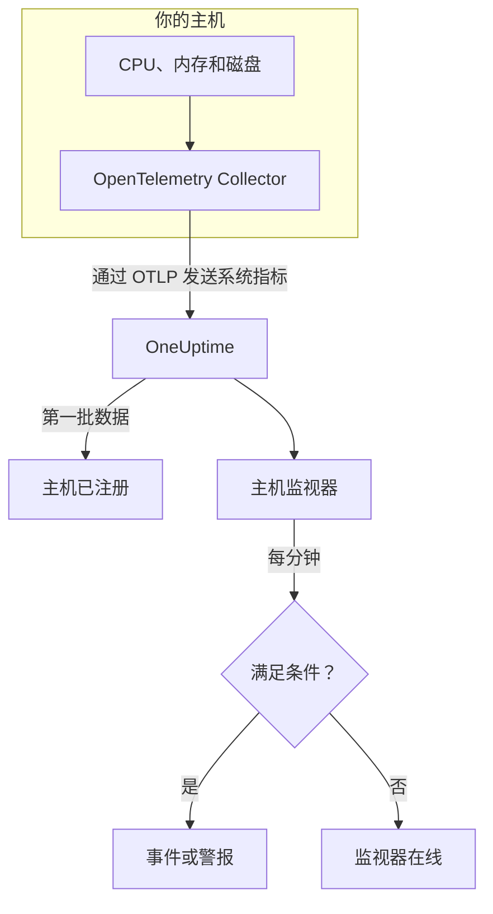

# 主机监控

主机监视器监控一台机器的 CPU、内存、磁盘、负载和进程，并在它饱和或即将写满时通知你。它读取 OpenTelemetry Collector 从主机发送的 `system.*` OpenTelemetry 指标，也就是 **主机** 产品显示的同一份数据，因此不会从外部探测任何东西。

:::cards
- [创建监视器](#创建主机监视器): 在仪表板中完成六个步骤。
- [模板](#现成的警报模板): 五个现成的警报，覆盖 CPU、内存、磁盘、负载和进程。
- [指标](#收集的指标): 可用于警报的主机指标及其单位。
- [主机还是 Server / VM？](#主机监视器还是-server-vm-监视器): 两种机器监视器该用哪一个。
:::

## 工作原理

主机上运行着带有 `hostmetrics` 接收器的 OpenTelemetry Collector。它每 30 秒读取主机的 CPU、内存、磁盘、网络、负载和进程数据，并通过 OTLP 发送到 OneUptime。来自某台主机的第一批数据会把它注册到 **主机** 下。

主机监视器绑定到一台主机。它每分钟对这台主机的指标运行查询，并把结果与条件进行比较。

### 主机监视器还是 Server / VM 监视器？

OneUptime 有两种用于机器的监视器。它们可以在同一台主机上同时运行。

| | 主机监视器 | Server / VM 监视器 |
| --- | --- | --- |
| **代理** | 带有 `hostmetrics` 接收器的 OpenTelemetry Collector | OneUptime 基础设施代理 |
| **数据** | `system.*` 和 `process.*` OpenTelemetry 指标，与 **主机** 页面绘制的图表相同 | 代理推送给监视器的状态报告 |
| **条件** | 对任意指标查询或公式设置阈值或异常检测 | 内置检查，例如 CPU、内存和磁盘使用率 |
| **设置** | 安装 Collector；主机会自动注册 | 创建监视器，然后把它的密钥交给代理 |

如果主机已经在发送 OpenTelemetry 数据，或者你希望从同一个 Collector 获取日志和更丰富的指标，请使用主机监视器。另一种监视器参见 [服务器 / 虚拟机监控](/docs/monitor/server-monitor)。

## 开始之前

- **在主机上运行 OpenTelemetry Collector**，并启用 `hostmetrics` 接收器。[主机 OpenTelemetry Collector](/docs/telemetry/host-otel-collector) 涵盖 Linux、macOS 和 Windows，**产品 → 基础设施 → 主机 → 文档** 提供现成的配置。
- **开启利用率指标。** `system.cpu.utilization`、`system.memory.utilization` 和 `system.filesystem.utilization` 在接收器中是可选的，而 CPU、内存和文件系统模板都需要它们。仪表板提供的配置会开启它们。
- **确认主机已注册。** 第一批数据到达后，它会以其 `host.name` 命名，出现在 **产品 → 基础设施 → 主机 → 所有主机** 下。

## 创建主机监视器

:::steps
### 开始新的监视器

进入 **监视器** 并点击 **创建监视器**。

### 选择主机类型

在 **监视器类型** 下点击 **更多监视器类型**，然后在 **基础设施** 下选择 **主机**。输入 **名称**（它会用在事件和警报标题中），然后点击 **下一步**。

### 选择要监控的主机

在 **Host Monitor Configuration** 下，从 **主机** 中选择机器。发送过数据的每台主机都在列表中。

### 选择要监控的内容

选择三个选项卡之一：

- **Quick Setup** – 点击一个 [模板](#现成的警报模板)。它会设置指标、聚合、时间范围和阈值，并用自己的条件替换下面的条件。你仍然可以更改 **时间范围**。
- **Custom Metric** – 从 **Host Metric** 中选择一个指标，然后设置 **聚合** 和 **时间范围**。
- **高级** – 在 **选择指标** 下自己构建查询和公式，例如按 `state` 过滤或按 `mountpoint` 分组。

### 检查条件

打开 **监视器条件** 下的每个条件，检查其 **指标**、**聚合**、**条件** 和 **Threshold**。模板会填好这些内容。使用 **Custom Metric** 或 **高级** 时，监视器从 [默认条件](#默认条件) 开始，这些条件只会注意到指标降到零，所以请设置你自己的阈值。

### 创建监视器

点击 **创建监视器**。OneUptime 会打开监视器的页面，并每分钟评估一次。它打开的事件和警报也会列在主机的 **事件** 和 **警报** 页面上。
:::

> [!TIP]
> 要一次设置多个模板，请从 **产品 → 基础设施 → 主机** 打开主机，然后进入 **Recommendations**。选择你需要的模板和要呼叫的人，OneUptime 会为每个模板创建一个监视器。

## 监视器设置

| 字段 | 选项卡 | 作用 |
| --- | --- | --- |
| **主机** | 全部 | 必填。把每个查询限定在该主机的 `resource.host.name`。 |
| **Host Metric** | Custom Metric | [目录](#收集的指标) 中的一个指标，按 CPU、内存、磁盘、网络、负载和进程分组。 |
| **聚合** | Custom Metric | 样本的合并方式：**平均值**、**最大值**、**最小值**、**总和** 或 **计数**。初始值为该指标通常的聚合方式。 |
| **时间范围** | 全部 | 查询读取的滚动窗口，从 **Past 1 Minute** 到 **Past 365 Days**。新监视器从 **Past 1 Minute** 开始；模板会设置自己的值。 |
| **选择指标** | 高级 | 查询构建器：**指标**、**Aggregate by**、**Filter by attributes**、**Group by**，以及用于组合查询的 **添加指标** 和 **添加公式**。 |

## 现成的警报模板

**Quick Setup** 提供五个模板。每个模板都会构建一个完整的监视器：一个查询、一个触发的条件和一个恢复的条件。阈值只是起点，你可以编辑。

条件只有在其窗口的每一分钟都成立时才会触发，并在越过阈值 10% 处恢复，这样在边界附近徘徊的值不会来回跳动。

| 模板 | 严重程度 | 监控内容 | 触发时机 | 恢复时机 |
| --- | --- | --- | --- | --- |
| High CPU Utilization | Warning | `user` 和 `system` 状态的 `system.cpu.utilization`，相加后以百分比显示，最近 5 分钟 | 高于 80% | 不高于 72% |
| High Memory Utilization | Warning | `used` 状态的 `system.memory.utilization`，以百分比显示，最近 5 分钟 | 高于 85% | 不高于 76.5% |
| High Filesystem Usage | 严重 | `system.filesystem.utilization`，按 `mountpoint` 和 `device` 取 Max，以百分比显示，最近 5 分钟 | 高于 90% | 不高于 81% |
| High Load Average (1m) | Warning | `system.cpu.load_average.1m`，Avg，最近 5 分钟 | 高于 4 | 不高于 3.6 |
| High Process Count | Warning | `system.processes.count`，Max，最近 5 分钟 | 高于 2000 | 不高于 1800 |

**严重程度** 是选择列表中显示的标签。模板创建的事件和警报从项目中最严重的事件和警报严重程度开始；请在条件中更改它们。

- **CPU** 是繁忙时间（`user` 加 `system`），与主机 **概览** 图表中的数字相同。不包括 iowait 和 steal。
- **内存** 不计缓冲区和页缓存，所以主要被缓存占用的主机不会触发它。
- **文件系统** 为每个挂载点打开一个事件。只读的伪文件系统（例如 snap 的 `squashfs` 挂载或 macOS 的 `devfs`）总是 100% 已满；请在 Collector 的 `filesystem` 抓取器中排除它们。
- **平均负载** 是原始的运行队列长度，没有除以核心数：4 在 2 核主机上意味着饱和，在 32 核主机上则很平常，所以在大型主机上请调高它。
- **进程数** 比较的是最大的单个进程状态（`running`、`sleeping`、…），而不是主机的总数，因此它与进程列表对不上。进程抓取器只在 Linux 上报告。

## 收集的指标

**Host Metric** 列表提供以下指标。每个指标都带有 `resource.host.name`，监视器用它把查询限定到一台主机。

> [!IMPORTANT]
> 利用率指标是 0 到 1 之间的比率，而不是百分比：在原始指标上设置阈值时，80% 要写成 `0.8`。模板用公式换算成百分比，所以它们的阈值是 80、85 和 90。

### CPU

| 指标 | 单位 | 说明 |
| --- | --- | --- |
| `system.cpu.utilization` | 比率 | 每个 `state`（`user`、`system`、`idle`、…）所占的 CPU 时间比例。请按 `state` 过滤：所有状态的平均值永远达不到有用的阈值。 |
| `process.cpu.utilization` | 比率 | 主机上每个进程的 CPU 利用率。 |

### 内存

| 指标 | 单位 | 说明 |
| --- | --- | --- |
| `system.memory.utilization` | 比率 | 每个 `state`（`used`、`free`、`cached`、…）所占的物理内存比例。要看已用内存，请按 `state = used` 过滤。 |
| `system.memory.usage` | 字节 | 内存使用量，单位为字节。 |

### 磁盘

| 指标 | 单位 | 说明 |
| --- | --- | --- |
| `system.filesystem.utilization` | 比率 | 每个文件系统已用容量的比例，按 `mountpoint` 和 `device` 区分。 |
| `system.filesystem.usage` | 字节 | 文件系统使用量，单位为字节。 |

### 网络

| 指标 | 单位 | 说明 |
| --- | --- | --- |
| `system.network.io` | 字节 | 接收和发送的字节数。生命周期计数器。 |

### 负载

| 指标 | 单位 | 说明 |
| --- | --- | --- |
| `system.cpu.load_average.1m` | 计数 | 最近 1 分钟的平均负载。 |
| `system.cpu.load_average.5m` | 计数 | 最近 5 分钟的平均负载。 |
| `system.cpu.load_average.15m` | 计数 | 最近 15 分钟的平均负载。 |

### 进程

| 指标 | 单位 | 说明 |
| --- | --- | --- |
| `system.processes.count` | 计数 | 主机上的进程，每个进程 `status` 一个序列。 |

**高级** 中的查询构建器列出主机发送的所有指标，而不仅仅是这些。

## 监控条件

条件把监视器的某个查询或公式与阈值进行比较。主机监视器的条件没有 **过滤器类型**：每条规则都用以下字段检查指标值。

| 字段 | 作用 |
| --- | --- |
| **指标** | 要检查的查询或公式，按其变量名指定。 |
| **聚合** | 窗口中的值如何变成一个结果：**平均值**、**总和**、**Maximum Value**、**Minimum Value**、**All Values**（每个值都必须匹配）或 **Any Value**（一个就够）。 |
| **条件** | **Greater Than**、**Less Than**、**Greater Than Or Equal To**、**Less Than Or Equal To** 或 **Equal To**，或者异常条件：**Anomalously High**、**Anomalously Low** 或 **Anomalous**。 |
| **Threshold** | 用于比较的值。如果指标有单位，旁边会有单位列表。异常条件下不显示。 |
| **灵敏度** | 仅限异常条件。**低**（4σ）、**中**（3σ，默认）或 **高**（2σ）。 |
| **基线窗口** | 仅限异常条件。14 天（默认）、28、60 或 90 天的历史。 |
| **如果无数据** | 位于 **更多字段** 下。窗口中没有样本时的处理方式：**Ignore**（默认）、**Treat As Zero** 或 **触发器**。 |

异常条件会把每个值与基线中一周的同一小时进行比较。在基线窗口积累足够的历史之前，它们会保持在“Learning”状态，不产生任何结果。

每个条件还会说明匹配时要做什么：更改监视器状态、创建警报或宣布事件。条件按从上到下的顺序检查，第一个匹配的条件决定结果。

### 默认条件

不是从模板构建的监视器会以两个条件开始：

| 顺序 | 条件 | 匹配时机 | 结果 |
| --- | --- | --- | --- |
| 1 | Check if _monitor name_ is offline | 第一个查询的任意值为 `0` | 将监视器标记为 **离线**，并宣布事件“_monitor name_ is offline”，监视器恢复后该事件会自动解决。 |
| 2 | Check if _monitor name_ is online | 任意值大于 `0` | 将监视器标记为 **运行正常**。 |

> [!IMPORTANT]
> 静默不匹配任何一个条件：停止发送数据的主机会让监视器保持原样。要在主机变得静默时收到通知，请在某个条件上把 **如果无数据** 设为 **触发器**。OneUptime 自身未接收数据的时间永远不算作无数据：窗口中包含这类时间的检查会改为等待，详见 [OneUptime 未接收数据时](/docs/monitor/when-oneuptime-is-not-receiving)。

## 故障排除

:::details 主机不在 主机 列表中
主机会根据 Collector 的数据自动注册，这需要 `host.name` 和主机的操作系统类型，两者都来自 Collector 的 `resourcedetection` 处理器。请检查 Collector 是否在运行，以及主机是否列在 **产品 → 基础设施 → 主机 → 所有主机** 下。[主机 OpenTelemetry Collector](/docs/telemetry/host-otel-collector) 介绍了相关配置。
:::

:::details CPU 或内存阈值从不触发
利用率指标是最大值为 `1.0` 的比率，所以手动输入的阈值 `80` 永远不会被越过：请使用 `0.8`，或者从会换算成百分比的模板开始。同时请按 `state` 过滤：CPU 用 `user` 和 `system`，内存用 `used`。所有状态的平均值会停留在 1 除以状态数附近。
:::

:::details 事件在错误的主机上触发
监视器用等于所选主机的 `resource.host.name` 来限定每个查询。报告相同 `host.name` 的多台主机会合并成一个序列，所以请为每台主机设置唯一的名称。
:::

:::details High Filesystem Usage 在一个总是满的挂载点上触发
只读的伪文件系统（例如 `/snap` 下 snap 的 `squashfs` 环回挂载，或 macOS 的 `devfs`）按设计就是 100% 已满，永远不会恢复。请把它们从 Collector 的 `filesystem` 抓取器中排除。
:::

## 后续步骤

:::cards
- [主机 OpenTelemetry Collector](/docs/telemetry/host-otel-collector): 安装并配置本监视器读取的 Collector。
- [服务器 / 虚拟机监控](/docs/monitor/server-monitor): 由代理推送数据的机器监视器。
- [指标监控](/docs/monitor/metrics-monitor): 跨主机和服务，对任何指标发出警报。
- [事件概览](/docs/incidents/index): 条件宣布事件之后会发生什么。
:::
