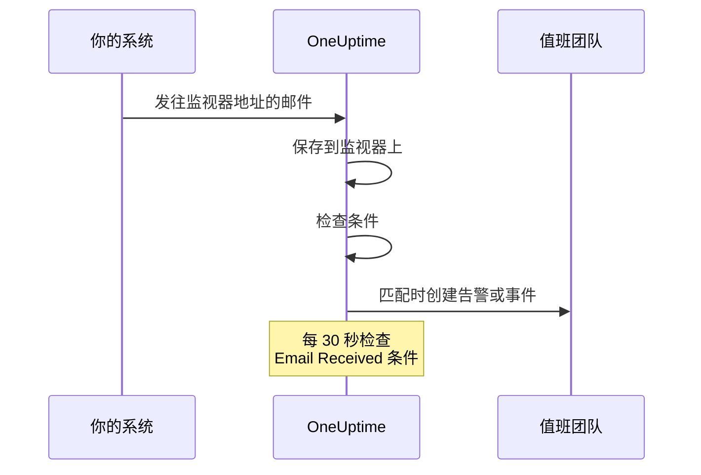

# 入站邮件监控

入站邮件监视器为你提供一个只属于该监视器的电子邮件地址。任何能发送邮件的东西（备份作业、遗留系统、云服务商的告警）都可以把结果发到这里，OneUptime 会按你的条件检查每一封邮件，把监视器标记为宕机、打开事件或创建告警，并在"一切正常"的通知到达时解决它们。

:::cards
- [创建监视器](#创建入站邮件监视器): 获取一个地址，并让发送方指向它。
- [验证地址](#在发送方处验证地址): 在监视器上阅读发送方的确认邮件。
- [编写条件](#可用的过滤器类型): 按主题、发件人或正文匹配，或在邮件不再到达时告警。
- [在告警中使用邮件](#模板变量): 把主题和正文放进标题和描述。
:::

## 工作原理

邮件是推送模式：你的系统发送，OneUptime 接收。每封邮件到达时都会按监视器的条件检查。查找 *本应* 到达的邮件的条件还会按计划每 30 秒检查一次。



1. 创建入站邮件监视器时，OneUptime 会为它分配一个唯一的电子邮件地址。
2. 发往该地址的每封邮件都会保存在监视器上，并从上往下按条件评估；第一个匹配的条件说了算。
3. 匹配的条件可以更改监视器的状态、创建告警并宣布事件。打开了 **自动解决事件** 的事件，或打开了 **自动解决警报** 的告警，会在之后另一个条件匹配时被解决，例如把监视器标记为在线的那个条件。

## 创建入站邮件监视器

:::steps
### 开始一个新监视器

进入 **监视器**，点击 **创建监视器**。

### 选择 Incoming Email

在 **监视器类型** 下点击 **更多监视器类型**，然后在 **Inbound Monitoring** 下选择 **Incoming Email**，或在搜索框中输入 `email`。输入 **名称**，然后点击 **下一步**。

### 检查条件

**标准** 这一步从[默认条件](#开箱即得的内容)开始，邮件中提到 `error` 时它们会把监视器标记为离线。点击某个条件可以修改它，或点击 **添加条件** 添加一个。常见配置请参阅[配置示例](#配置示例)。

### 创建监视器

点击 **创建监视器**。监视器会在 **概览** 页面打开，在第一封邮件到达之前，**Incoming Email Address** 卡片会显示该地址和一个复制按钮。

### 向该地址发送邮件

配置你的系统把通知发送到这个地址。如果发送方要求先确认地址，请参阅[在发送方处验证地址](#在发送方处验证地址)。
:::

> [!NOTE]
> 该地址包含监视器的密钥，因此只有能编辑监视器的人才能看到它。其他人看到的是设置详情已被隐藏。

## 电子邮件地址格式

每个入站邮件监视器都有一个如下格式的唯一地址：

```text
monitor-{secret-key}@{inbound-domain}
```

密钥是一个 UUID，例如 `monitor-3f2b8c1e-5d4a-4f6b-9a7c-2e1d0b9f8a6c@inbound.yourdomain.com`。第一封邮件到达后，该地址会继续显示在监视器 **概览** 页面的 **Inbound email address** 卡片中，旁边是最后一封邮件到达的时间。监视器的 **文档** 页面也会显示它。

## 重置或自定义电子邮件地址

进入监视器的 **设置** 选项卡。**Incoming Email Address** 卡片显示当前地址，并提供两种替换它的方式：

| 操作 | 作用 | 适用场景 |
| --- | --- | --- |
| **Reset Address** | 为监视器分配一个新的、随机生成的 `monitor-{secret-key}@{inbound-domain}` 地址。如果监视器有自定义地址，重置会删除它。执行前会要求你确认。 | 地址已泄露，或者你想切断所有向它发送邮件的来源。 |
| **Customize Address** | 让你选择 @ 前面的部分，例如 `nightly-backups@{inbound-domain}`。在 **Address name** 中输入它（可以输入名称，也可以粘贴完整地址），然后点击 **Save Address**。 | 你想要一个大家一看就认得的地址。 |

两种操作最后都会显示新地址和一个复制按钮。

> [!WARNING]
> **旧地址会立即失效**：发往它的邮件会被忽略，因此请更新每一个向此监视器发送邮件的系统。

自定义地址规则：

- 3 到 64 个字符：小写字母、数字、点（`.`）、连字符（`-`）和下划线（`_`），不能连续出现两个点。必须以字母或数字开头和结尾。大写输入会自动转为小写。
- 域名始终是服务器的入站邮件域名。
- 名称不能已被另一个监视器使用。服务器上的所有项目共享入站域名，因此名称必须在所有项目中唯一。
- `monitor-{id}` 和 `workflow-{id}` 形式的名称保留给生成的地址。属于域名本身的邮箱名称也被保留：`abuse`、`admin`、`administrator`、`hostmaster`、`mailer-daemon`、`noc`、`postmaster`、`root`、`security` 和 `webmaster`。

自定义地址和生成的地址一样都是凭据：任何知道它的人都能发送由此监视器评估的邮件。生成的地址实际上无法猜到，但简短、显而易见的名称则可以。如果这对你很重要，请选择一个难以猜测的名称。

API 用户也可以通过 Monitor API 在已有的监视器上做同样的事：把 `incomingEmailCustomLocalPart` 设为名称即可使用自定义地址，设为 `null` 则回到生成的地址。重置就是在同一次更新中写入新的 `incomingEmailSecretKey`，并把 `incomingEmailCustomLocalPart` 设为 `null`。

## 在发送方处验证地址

有些服务在有人证明能读取某个新地址的邮件之前，不会向它发送告警。它们会先发送一封验证邮件，这封邮件会像其他邮件一样到达监视器。阅读方法如下：

:::steps
### 把地址添加到服务中

把监视器的地址添加到服务中并保存。该服务会发送验证邮件。

### 打开最新的邮件

在 OneUptime 中打开监视器。在其 **概览** 页面上，**监视器摘要** 卡片显示最新的邮件。确认 **从**（发件人）和 **主题** 属于这封验证邮件，然后点击 **显示更多详情**。

### 复制验证码或链接

验证码或链接位于 **邮件正文 (文本)** 中。**邮件正文 (HTML)** 显示的是 HTML 源码，因此如果你从那里复制链接，请把其中的每个 `&amp;` 改成 `&`。

### 完成验证

按照邮件的说明完成验证。
:::

如果之后又收到了另一封邮件，卡片就不再显示验证邮件。请打开 **监视日志**，在 **电子邮件** 列中按主题找到验证邮件，并点击该行的 **查看摘要**。

> [!IMPORTANT]
> **你的条件也会看到它。** 验证邮件会像其他邮件一样被评估。像 "if you received this in error" 这样的措辞会匹配默认的 `error` 条件，把监视器标记为离线。为避免这种情况，请在验证期间关闭监视器 **设置** 页面上 **监控** 卡片中的 **检查此监视器**（会要求你确认）。关闭了监控的监视器仍会记录邮件，**监视器摘要** 卡片也仍会显示它。但它不会评估任何内容，因此这封邮件不会在 **监视日志** 中留下一行：请在另一封邮件到达之前阅读它。完成后，点击监视器页面顶部横幅中的 **打开监控**，或者把开关重新打开。

**验证属于地址本身。** 如果你[重置或自定义地址](#重置或自定义电子邮件地址)，服务会看到一个新的收件人，你需要重新验证。

### Azure Monitor 操作组

从 2026 年 7 月起，Azure 正逐步推行一项要求：操作组中每个新的 **Email** 收件人都必须通过一次性验证码验证。在验证之前，操作组不会向该地址发送任何告警或测试通知。

:::steps
1. 在操作组中添加一个使用监视器地址的 **Email** 通知，并保存操作组。Azure 会从 `azure-noreply@microsoft.com` 这样的 Microsoft 地址发送验证邮件。
2. 按上述方法在监视器上阅读它，并在保存操作组后的 30 分钟内按其说明操作。如果验证码过期，请打开操作组并选择 **Resend**。
3. 打开操作组并选择 **Test** 发送一条测试通知。它会像真正的告警一样到达监视器，因此也能显示你的条件是否匹配 Azure 的邮件。
:::

验证对同一 Azure 租户中的所有操作组有效，因此每个地址只需验证一次。

### Amazon SNS

对 SNS 主题的电子邮件订阅在确认之前收不到任何内容。创建订阅时，Amazon SNS 会向该地址发送一封确认邮件。按上述方法在监视器上阅读它，并在浏览器中打开其中的 **Confirm subscription** 链接。SNS 会删除 48 小时内未确认的订阅；如果发生这种情况，请重新创建订阅。

## 开箱即得的内容

新的入站邮件监视器创建时带有两个读取邮件正文的条件：

| 条件 | 过滤器类型 | 过滤条件 | 值 | 效果 |
| -------- | ----------- | ---------------- | ------- | -------------------------------------------- |
| Offline  | Email Body  | 包含 | `error` | 把监视器标记为离线，打开一个事件 |
| Online   | Email Body  | Not Contains | `error` | 把监视器标记为在线 |

这适合作业或第三方工具通过邮件报告自身结果的常见情况：正文中提到 `error` 的邮件会让监视器下线，下一封不含该词的邮件会让监视器恢复在线并解决事件。正文匹配不区分大小写，因此 `Error` 和 `ERROR` 也会匹配。

请把值改成你的发送方实际写的内容（`FAILED`、`exit code 1` 等）。

> [!NOTE]
> 这些默认条件 **不是** 死人开关：邮件不再到达时，这里的任何条件都不会触发。只读取主题、发件人、正文或收件人的条件只在邮件到达时评估，其他时候都不会。如果你希望在静默时收到告警，请添加一个 **Email Received** / **Not Recieved In Minutes** 条件，参见[示例 3](#示例-3心跳监视器没有邮件-告警)。

## 可用的过滤器类型

你可以基于以下邮件字段创建条件：

| 过滤器类型 | 说明 |
| ------------------------- | ----------------------------------------------------------------------------------- |
| **邮件主题** | 入站邮件的主题行 |
| **Email From Address** | 发件人的电子邮件地址：只有地址本身，小写，不含显示名称 |
| **Email Body** | 邮件正文的纯文本部分 |
| **Email To Address** | 收件人的电子邮件地址 |
| **Email Received** | 基于邮件接收时间的条件 |
| **JavaScript Expression** | 必须求值为 true 的自定义 JavaScript 表达式 |

在任何条件读取邮件之前，监视器自己的地址都会被遮盖，因此在 **Email To Address**、**邮件主题** 和 **Email Body** 中它显示为 `[REDACTED]`。

## 过滤条件

### 字符串过滤器（主题、发件人、正文、收件人）

| 过滤条件 | 说明 | 示例 |
| ---------------- | ----------------------------------------- | ---------------------------------- |
| **包含** | 字段包含指定文本 | 主题包含 "CRITICAL" |
| **Not Contains** | 字段不包含指定文本 | 主题不包含 "TEST" |
| **Equal To** | 字段与指定文本完全一致 | 发件人等于 "alerts@service.com" |
| **Not Equal To** | 字段与指定文本不一致 | 主题不等于 "OK" |
| **Starts With** | 字段以指定文本开头 | 主题以 "[ALERT]" 开头 |
| **Ends With** | 字段以指定文本结尾 | 主题以 "- Production" 结尾 |
| **Is Empty** | 字段为空 | 正文为空 |
| **Is Not Empty** | 字段有内容 | 主题不为空 |

所有这些比较都不区分大小写。值为空的过滤器永远不会匹配。

### 基于时间的过滤器（Email Received）

仪表板把这些条件拼写为 "Recieved"。

| 过滤条件 | 说明 | 示例 |
| --------------------------- | ----------------------------------- | -------------------------------- |
| **Recieved In Minutes** | 在 X 分钟内收到了邮件 | 30 分钟内收到邮件 |
| **Not Recieved In Minutes** | X 分钟内没有收到邮件 | 60 分钟内没有收到邮件 |

从未收到过邮件的监视器会把创建时间当作最后一封邮件。

### JavaScript Expression

| 过滤条件 | 说明 |
| --------------------- | ------------------------------------- |
| **Evaluates To True** | 表达式返回一个真值 |

表达式在一个没有绑定任何邮件字段的沙箱中运行，因此它无法读取触发此次检查的邮件的主题、发件人、正文或收件人。要按邮件内容匹配，请使用 **邮件主题**、**Email From Address**、**Email Body** 和 **Email To Address** 过滤器类型。

## 配置示例

每个示例都是一对条件。一个条件包含过滤器、一个 **匹配条件**（其过滤器的 **全部** 或 **任意**），以及动作：更改监视器状态、创建告警、宣布事件。在告警或事件的 **更多字段** 下打开 **自动解决警报**（或 **自动解决事件**），这样第二个条件就会解决第一个条件打开的内容。

### 示例 1：对严重邮件创建告警

| 条件 | 过滤器 | 匹配条件 | 动作 |
| --- | --- | --- | --- |
| 严重邮件 | **邮件主题** 包含 `CRITICAL`；**邮件主题** 包含 `ALERT`；**邮件主题** 包含 `ERROR` | **任意** | 把状态改为离线；创建告警 |
| 恢复邮件 | **邮件主题** 包含 `RESOLVED`；**邮件主题** 包含 `RECOVERED` | **任意** | 把状态改为在线 |

把严重条件放在第一位：条件从上往下检查，第一个匹配的条件说了算。

### 示例 2：监控特定发件人

| 条件 | 过滤器 | 匹配条件 | 动作 |
| --- | --- | --- | --- |
| 作业失败 | **Email From Address** Equal To `monitoring@legacy-system.com`；**邮件主题** 包含 `Failed` | **全部** | 把状态改为离线；宣布事件 |
| 作业成功 | **Email From Address** Equal To `monitoring@legacy-system.com`；**邮件主题** 包含 `Success` | **全部** | 把状态改为在线 |

### 示例 3：心跳监视器（没有邮件 = 告警）

| 条件 | 过滤器 | 动作 |
| --- | --- | --- |
| 邮件迟到 | **Email Received** Not Recieved In Minutes `60` | 把状态改为离线；创建告警 |
| 邮件已到达 | **Email Received** Recieved In Minutes `60` | 把状态改为在线 |

第一个条件在 60 分钟内没有邮件到达时触发，适合会发送完成邮件的计划作业或批处理。第二个条件在邮件一到达就解决告警。OneUptime 自身未在接收邮件的分钟不计入这 60 分钟，详见 [OneUptime 未接收数据时](/docs/monitor/when-oneuptime-is-not-receiving)。

## 使用场景

| 使用场景 | 监视器的作用 |
| --- | --- |
| 遗留系统集成 | 把旧系统只通过邮件发出的告警变成 OneUptime 事件，并在恢复邮件到达时解决它们。 |
| 第三方服务 | 接收来自云服务商（AWS、GCP、Azure）、安全扫描器、备份工具的通知以及证书到期警告。 |
| 计划作业 | 在完成邮件迟到，或作业通过邮件报告失败时告警。 |
| 告警汇总 | 收集来自 Nagios、Zabbix 或其他工具的邮件告警，让 OneUptime 成为管理它们的唯一地方。 |

## 模板变量

此监视器创建的告警和事件的标题、描述和修复说明中可以使用这些变量。条件的告警和事件表单在 **模板变量** 下列出了它们，[事件与告警模板](/docs/monitor/incident-alert-templating) 介绍了语法。

| 变量 | 说明 |
| --------------------- | ----------------------------------------------------------------- |
| `{{emailSubject}}`    | 收到的邮件的主题 |
| `{{emailFrom}}`       | 发件人的电子邮件地址 |
| `{{emailTo}}`         | 邮件发给了谁，此监视器自己的地址会被遮盖 |
| `{{emailBody}}`       | 邮件的纯文本正文 |
| `{{emailReceivedAt}}` | 邮件的接收时间，为 UTC 的 ISO 8601 时间戳 |

- **标题中每个变量只取一行。** 在标题中，每个变量会被截断为最多 150 个字符的一行，原本更长时以 `...` 结尾。标题不能超过 500 个字符，标题过长的告警或事件根本不会被创建，因此引用整封邮件会让监视器无法对长邮件告警。描述和修复说明会得到完整的值。
- **此监视器的地址会被遮盖。** 该地址的作用相当于密码，因此会在保存邮件之前被遮盖，`{{emailTo}}` 显示为 `monitor-[REDACTED]@{inbound-domain}`（自定义地址则为 `[REDACTED]@{inbound-domain}`）。
- **缺失邮件的检查使用最后一封邮件。** 当 **Email Received** 条件因为邮件没有按时到达而打开告警时，这些变量描述的是监视器收到的最后一封邮件。如果还没有收到任何邮件，它们为空。

## 监视器摘要视图

监视器收到邮件后，其 **概览** 页面上的 **监视器摘要** 卡片会显示最新的一封：

- **最后收到邮件时间**：最近一封邮件的接收时间
- **从**：最后一封邮件的发件人
- **主题**：最后一封邮件的主题行

点击 **显示更多详情** 查看其余内容：

- **邮件标头**：最后一封邮件的完整标头
- **邮件正文 (文本)**：纯文本正文
- **邮件正文 (HTML)**：HTML 正文，以 HTML 源码显示而不是渲染后的效果

### 更早的邮件

卡片只显示最新的邮件。监视器评估的每封邮件也会写入 **监视日志**：**电子邮件** 列显示其主题和发件人，该行的 **查看摘要** 会像卡片一样显示整封邮件。关闭了监控的监视器不评估任何内容，因此它收到的邮件不会留下任何行。如果你的某个条件检查 **Email Received**，监视器每次检查缺失邮件时也会写入一行。在这些行中，**电子邮件** 列显示 "Scheduled check"，其 **查看摘要** 显示检查时最新的邮件，如果还没有邮件到达则显示 "No email yet"。监视日志默认保留一天。在自托管服务器上，管理员可以通过 Admin Dashboard 设置中的 **监视器日志保留期（天）** 修改它。

## 自托管设置

如果你自托管 OneUptime，需要配置一个入站邮件提供商。目前支持：

- **SendGrid Inbound Parse** - 设置说明请参阅 [SendGrid 入站邮件](/docs/self-hosted/sendgrid-inbound-email)

在完成设置之前，监视器的地址卡片会提示入站邮件尚未配置。

## 注意事项

- **电子邮件地址安全**：监视器的电子邮件地址相当于密码：任何知道它的人都能向监视器发送邮件。不要公开分享它，一旦泄露，请在监视器的 **设置** 选项卡中重置它。
- **邮件大小**：OneUptime 接受最大 50 MB 的入站邮件（含附件）。附件不会被保存，只保存它们的名称、类型和大小。
- **处理时间**：邮件是异步处理的。从发送邮件到创建告警之间可能有几秒的延迟。
- **不区分大小写**：所有字符串比较（包含、Equal To 等）都不区分大小写。
- **纯文本**：邮件正文条件读取的是邮件的纯文本部分。只以 HTML 发送的邮件对条件来说正文为空，因此它不包含 `error`，默认条件会把监视器标记为在线。

## 故障排除

### 收不到邮件

1. 确认电子邮件地址正确（检查是否有拼写错误）。
2. 检查发送方是否在等待你验证地址。Azure Monitor 操作组和 Amazon SNS 在新地址验证之前不会向它发送任何内容。请参阅[在发送方处验证地址](#在发送方处验证地址)。
3. 检查邮件是否被垃圾邮件过滤器拦截。
4. 确认你的入站邮件提供商配置正确。
5. 检查 OneUptime 日志中是否有错误消息。

### 没有创建告警

1. 确认你的条件与邮件内容匹配。记住，监视器自己的地址显示为 `[REDACTED]`，而只有 HTML 的邮件正文为空。
2. 检查监控是否已打开：监视器的 **设置** 页面，**监控** 卡片。
3. 打开 **监视日志**，点击该邮件所在行的 **查看摘要**，看看条件读到了什么。
4. 检查条件的顺序：第一个匹配的条件说了算。

### 告警没有被解决

1. 确认你的解决条件与恢复邮件匹配。
2. 检查打开告警的那个条件中是否打开了 **自动解决警报**（或 **自动解决事件**）。
3. 确认恢复邮件发往的是同一个监视器地址。

## 后续步骤

:::cards
- [事件与告警模板](/docs/monitor/incident-alert-templating): 把邮件的主题和正文放进告警。
- [入站请求监控](/docs/monitor/incoming-request-monitor): 改用 HTTP 接收心跳和 Webhook。
- [SendGrid 入站邮件](/docs/self-hosted/sendgrid-inbound-email): 在自托管服务器上设置入站邮件。
:::
