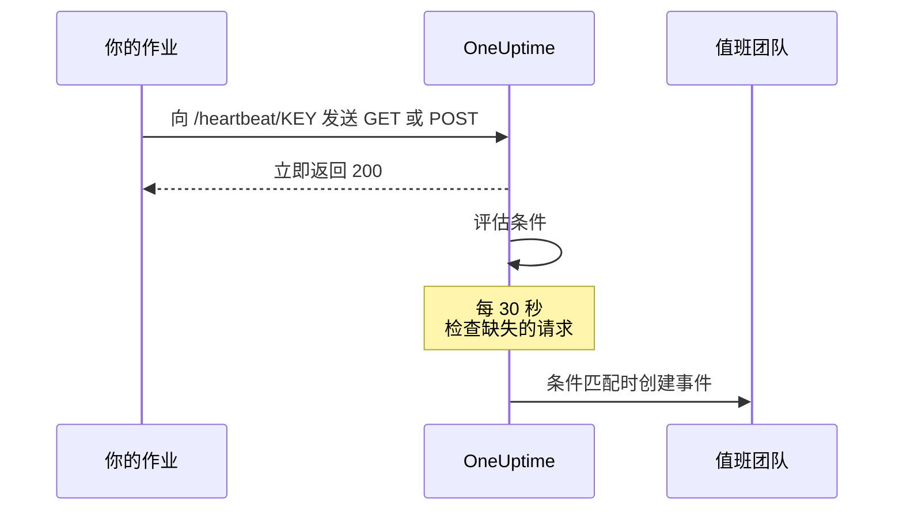
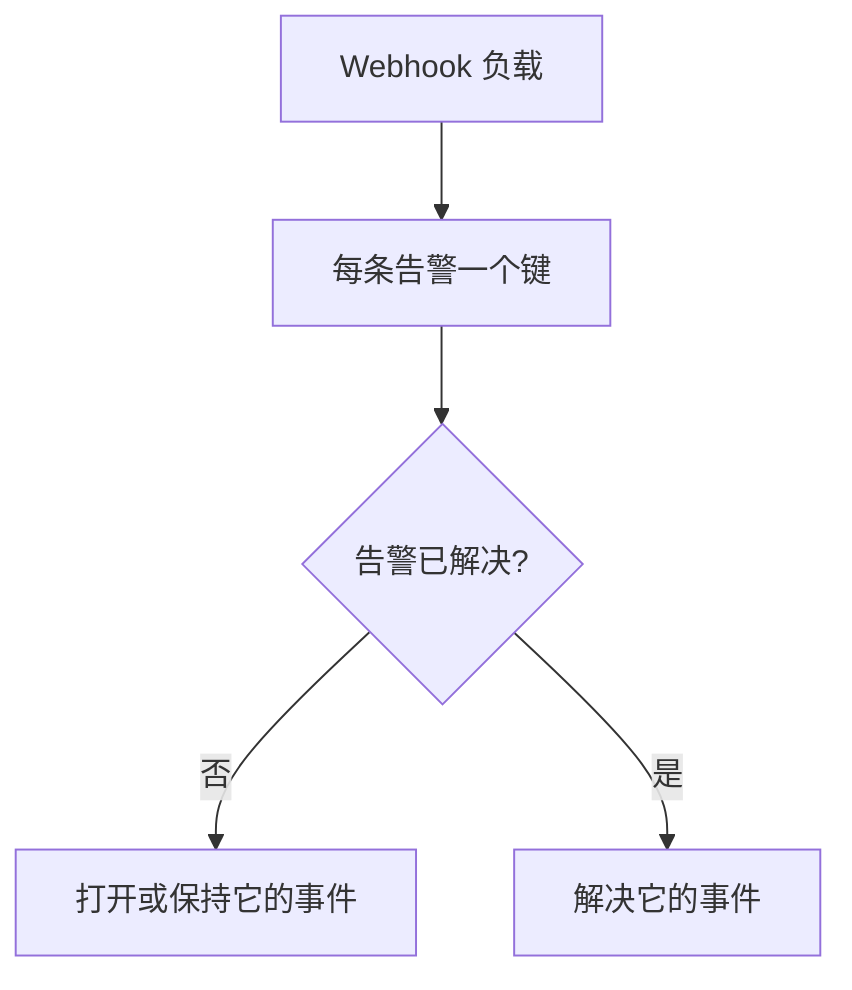

# 入站请求监控

入站请求监视器为你提供一个 URL，其他系统可以向它发送 HTTP 请求。OneUptime 会按你的条件评估每一个请求，并可以更改监视器状态、宣布事件、呼叫值班人员。

它承担两种不同的职责：

- **心跳监控** —— cron 作业、工作进程或设备按计划调用该 URL，当调用不再到达时 OneUptime 创建一个事件。
- **接收来自其他系统的告警** —— Prometheus Alertmanager、Grafana，或任何能够 POST JSON 的系统把告警推送进来，OneUptime 把每一条告警变成一个事件，带值班升级，并在恢复时自动解决。

两者使用同一种监视器类型。区别在于你配置的条件。

:::cards
- [创建监视器](#创建入站请求监视器): 几步就能拿到一个心跳 URL。
- [发送心跳](#发送心跳): 从 curl、cron、Node.js、Python 或 Go 发送。
- [调用停止时告警](#10-分钟内没有心跳则标记为离线死人开关): 把监视器变成一个死人开关。
- [接收告警](#接收来自其他系统的告警): Alertmanager 或 Grafana 的每条告警对应一个事件。
:::

## 工作原理

没有任何东西从外部检查你的系统：你的系统调用监视器的 URL，OneUptime 立即应答，然后按监视器的条件评估这个请求。检查请求是否 *不再* 到达的条件还会每 30 秒在后台重新检查一次，因此静默也能触发事件。



可以用它来：

- 监控 cron 作业和计划任务
- 确认后台工作进程正在运行
- 监控防火墙后无法从外部访问的服务
- 接收来自 Prometheus Alertmanager、Grafana 及其他告警系统的告警
- 跟踪任何支持 HTTP 的系统发来的心跳信号

## 创建入站请求监视器

:::steps
### 开始一个新监视器

进入 **监视器**，点击 **创建监视器**。

### 选择 Incoming Request

在 **监视器类型** 下选择 **Incoming Request**，它是顶部的常用类型之一。输入 **名称**，然后点击 **下一步**。

### 检查条件

**标准** 这一步从[默认条件](#开箱即得的内容)开始。对于心跳，点击 **添加条件**，给新条件设置一个 **Incoming Request** / **Not Recieved In Minutes** 过滤器，让它把状态改为离线并宣布一个事件，同时打开 **自动解决事件**。然后把它拖到列表顶部，原因请参阅[条件示例](#条件示例)。

### 创建监视器

点击 **创建监视器**。监视器会在 **概览** 页面打开，**Send the first heartbeat** 卡片显示带复制按钮的 **Heartbeat URL** 和一条 `curl` 命令示例。

### 发送第一个请求

配置你的服务向该 URL 发送请求（参见[发送心跳](#发送心跳)）。第一个请求到达后，这张卡片会让位给监视器的历史记录，一张 **Heartbeat URL** 卡片会显示 URL 以及最后一个请求到达的时间。
:::

> [!NOTE]
> URL 中包含监视器的密钥，因此只有能编辑监视器的人才能看到它。你随时可以在监视器的 **文档** 页面上再次找到它，该页面位于侧边菜单的 **配置** 部分。

## 请求 URL

你的监视器有一个如下格式的唯一 URL：

```text
https://oneuptime.com/heartbeat/YOUR_SECRET_KEY
```

如果是自托管，请把 `https://oneuptime.com` 替换为你的 OneUptime 实例的 URL。

向这个 URL 发送 **GET** 或 **POST** 请求。HEAD 也会被接受并按 GET 处理；PUT、PATCH 和 DELETE 返回 404。路径中的密钥是唯一的凭据，不需要任何请求头或令牌。查询字符串会被忽略：把条件要读取的内容放在请求体或请求头中发送。

> [!WARNING]
> 任何知道这个 URL 的人都能把监视器标记为健康，因此要把它当作秘密对待。如果它泄露了，请打开监视器的 **设置** 页面，点击 **重置传入请求密钥**，然后更新每一个发送方。你发送的每个请求头都会保存在监视器上，任何能查看监视器的人都能看到：不要在发往这个端点的请求头中携带 API 密钥或令牌。

> [!IMPORTANT]
> OneUptime 会立即以一个空 JSON 对象（`{}`）返回 `200`，并通过队列处理请求。这个响应在任何校验之前就已写出，因此 `200` **并不** 表示请求已被接受：错误的密钥、已删除的监视器和已禁用的监视器同样会返回 `200`。请查看监视器自己的时间线，确认请求确实到达。

### 发送请求体

如果你想引用请求体中的字段（事件标题中的 `{{requestBody.status}}`、事件分组中的 JSON 路径，或 JavaScript 表达式条件），请发送 `Content-Type: application/json`。本文档通篇都假定使用这种格式。请求体必须是 JSON 对象或数组：格式错误的 JSON，或者像 `"error"` 这样的单个值，会以 `500` 拒绝。

| 内容类型 | 条件和模板看到的内容 |
| --- | --- |
| `application/json` | 解析后的 JSON。 |
| `application/x-www-form-urlencoded` | 解析后的表单。带方括号的键会嵌套（`alerts[0][status]=firing`），每个值都是字符串。 |
| 其他任何类型，或没有 | 空请求体（`{}`），因此对 `requestBody` 的任何引用都得不到值。 |

最多接受 50 MB 的请求体；更大的会以 `413` 拒绝。不要用 `Content-Encoding: gzip` 压缩请求体：那样它不会以 JSON 形式保存，其中的路径也无法解析。

### 发送心跳

每个示例发送一个请求。把 `YOUR_SECRET_KEY` 替换为你的监视器 URL 中的密钥。

:::tabs
@tab curl
```bash
# Simple GET request
curl https://oneuptime.com/heartbeat/YOUR_SECRET_KEY

# POST request with a JSON body
curl -X POST https://oneuptime.com/heartbeat/YOUR_SECRET_KEY \
  -H "Content-Type: application/json" \
  -d '{"status": "healthy", "version": "1.2.3"}'
```
@tab Cron
```bash
# Send a heartbeat every 5 minutes
*/5 * * * * curl -fsS https://oneuptime.com/heartbeat/YOUR_SECRET_KEY > /dev/null

# Or ping only when the job succeeds, so a failed run counts as a missed heartbeat
0 2 * * * /usr/local/bin/backup.sh && curl -fsS https://oneuptime.com/heartbeat/YOUR_SECRET_KEY > /dev/null
```
@tab Node.js
```javascript title="heartbeat.mjs"
// Node.js 18 or later: fetch is built in. Run with `node heartbeat.mjs`.
const response = await fetch(
  "https://oneuptime.com/heartbeat/YOUR_SECRET_KEY",
  {
    method: "POST",
    headers: { "Content-Type": "application/json" },
    body: JSON.stringify({ status: "healthy", version: "1.2.3" }),
  },
);

console.log(response.status); // 200
```
@tab Python
```python title="heartbeat.py"
# Python 3, standard library only. Run with `python3 heartbeat.py`.
import json
import urllib.request

request = urllib.request.Request(
    "https://oneuptime.com/heartbeat/YOUR_SECRET_KEY",
    data=json.dumps({"status": "healthy", "version": "1.2.3"}).encode(),
    headers={"Content-Type": "application/json"},
    method="POST",
)

with urllib.request.urlopen(request, timeout=10) as response:
    print(response.status)  # 200
```
@tab Go
```go title="heartbeat.go"
// Run with `go run heartbeat.go`.
package main

import (
	"bytes"
	"fmt"
	"net/http"
)

func main() {
	body := []byte(`{"status": "healthy", "version": "1.2.3"}`)

	resp, err := http.Post(
		"https://oneuptime.com/heartbeat/YOUR_SECRET_KEY",
		"application/json",
		bytes.NewReader(body),
	)
	if err != nil {
		panic(err)
	}
	defer resp.Body.Close()

	fmt.Println(resp.StatusCode) // 200
}
```
@tab PowerShell
```powershell
# Windows PowerShell 5.1 or PowerShell 7
Invoke-RestMethod -Method Post `
  -Uri "https://oneuptime.com/heartbeat/YOUR_SECRET_KEY" `
  -ContentType "application/json" `
  -Body '{"status": "healthy", "version": "1.2.3"}'
```
:::

## 监控条件

你可以配置条件，决定何时把服务视为在线、性能下降或离线。每个条件过滤器都有一个 **过滤器类型**（看什么）、一个 **过滤条件**（怎么比较）和一个 **值**。

### 开箱即得的内容

新的入站请求监视器创建时带有两个读取请求体的条件：

| 条件 | 过滤器类型 | 过滤条件 | 值 | 效果 |
| -------- | ------------ | ---------------- | ------- | -------------------------------------------- |
| Offline  | 请求主体 | 包含 | `error` | 把监视器标记为离线，打开一个事件 |
| Online   | 请求主体 | Not Contains | `error` | 把监视器标记为在线 |

这适合发送方在负载中报告自身健康状况的常见情况：请求体中提到 `error` 的请求会让监视器下线，下一个不含该词的请求会让监视器恢复在线并解决事件。完全没有请求体的请求算作"不包含 `error`"，因此单纯的心跳调用会让监视器保持在线。

请把值改成你的发送方实际发出的内容（`"status":"firing"`、`FAILED` 等）：匹配是对整个请求体（包括键）进行区分大小写的子串查找，因此 `{"error":null}` 也会匹配 `error`。

> [!NOTE]
> 这些默认条件 **不是** 死人开关：请求不再到达时，这里的任何条件都不会触发。如果你希望在静默时收到告警，请按下文所述添加一个 **Incoming Request** / **Not Recieved In Minutes** 条件。

### 可用的过滤器类型

| 过滤器类型 | 检查内容 | 说明 |
| --------------------- | ------------------------------------------------------ | -------------------------------------------------------------------------------------------- |
| Incoming Request | 是否在某个时间窗口内收到了请求 | 唯一一个在什么都没到达时也能触发的检查 |
| 请求主体 | 请求的主体 | 子串匹配。对象请求体按紧凑的 JSON 比较 |
| Request Header | 请求头的名称 | 与完整的请求头名称精确匹配，不区分大小写 |
| Request Header Value | 请求头的值 | 与完整的请求头值精确匹配，不区分大小写 |
| JavaScript Expression | 任何基于 `requestBody` 和 `requestHeaders` 的表达式 | 最灵活的选项，请参阅 [JavaScript 表达式](/docs/monitor/javascript-expression) |

### 过滤条件

每种过滤器类型都有自己的一组条件：

| 过滤器类型 | 条件 |
| --- | --- |
| **Incoming Request** | **Recieved In Minutes** —— 在指定的分钟数内收到了请求。**Not Recieved In Minutes** —— 在指定的分钟数内没有收到请求。（仪表板就是这样拼写的。） |
| **请求主体**、**Request Header**、**Request Header Value** | **包含** 和 **Not Contains** |
| **JavaScript Expression** | **Evaluates To True** |

> [!NOTE]
> 请求头的名称和值会转为小写后，与完整的名称或值比较，而不是子串匹配：`application/json` 不匹配 `application/json; charset=utf-8`。只有 **请求主体** 做子串匹配。你的代理或 OneUptime 自己的负载均衡器添加的请求头（`x-forwarded-for`、`x-real-ip`）也会被保存。

对象请求体按不含空格的紧凑 JSON 比较，因此 **请求主体** / **包含** 过滤器必须写成 `"status":"firing"`：从格式化过的负载中复制 `"status": "firing"` 永远不会匹配。

### 条件示例

#### 10 分钟内没有心跳则标记为离线（死人开关）

| 字段 | 值 |
| --- | --- |
| **过滤器类型** | Incoming Request |
| **过滤条件** | Not Recieved In Minutes |
| **值** | `10` |

#### 根据请求体内容标记为性能下降

| 字段 | 值 |
| --- | --- |
| **过滤器类型** | 请求主体 |
| **过滤条件** | 包含 |
| **值** | `"status":"degraded"` |

> [!IMPORTANT]
> 把死人开关放在默认条件 **之上**。条件从上往下检查，第一个匹配的条件说了算。后台检查会重新读取最后一个请求，因此默认的在线条件（"Request Body Not Contains `error`"）会一直匹配它，排在它下面的条件永远轮不到。**添加条件** 会把条件加到底部：请把它拖上去。

> [!WARNING]
> 只有当监视器至少有一个条件检查 **Incoming Request** 时，它才会在后台被重新评估。条件只检查请求主体、Request Header 或 JavaScript 表达式的监视器，只在请求到达时评估，其他时候都不会，因此它永远不会自行下线。如果你需要心跳缺失的告警，就需要一个 **Incoming Request** 条件。

后台检查按整分钟计数，在经过的时间 *超过* 该值时触发："Not Recieved In Minutes: 10" 大约在最后一个请求之后 11 分钟触发（检查每 30 秒运行一次）。从未收到过请求的监视器会把创建时间当作最后一个请求，因此同样的条件放在一个全新的监视器上，即使发送方从未接入，也会在创建后大约 11 分钟触发。只有 OneUptime 正在接收数据的分钟才计入该值：OneUptime 自身重启、升级或追赶积压期间的分钟不计入，详见 [OneUptime 未接收数据时](/docs/monitor/when-oneuptime-is-not-receiving)。

## 接收来自其他系统的告警

Alertmanager、Grafana 和类似的工具会 POST 一份描述一条或多条告警的 JSON 文档。默认情况下，一个条件只打开 **一个** 事件，因此一个携带五条告警的负载只会产生一个事件。事件分组改变了这一点：它从负载中提取一个值，并 **为每个不同的值打开一个单独的事件**，这些事件可以同时处于打开状态。



### 打开事件分组

:::steps
1. 打开条件并展开 **设置**。
2. 打开 **Group incidents and alerts by a payload field**。
3. 填写 **Open a separate incident for each…**。如果希望每个事件自动解决，还要填写 **Auto-resolve each incident when…** 下的字段和值（见下文）。然后保存监视器。
:::

| 字段 | 示例 | 作用 |
| ---------------------------------- | ---------------------------------------- | ---------------------------------------------------------------------- |
| Open a separate incident for each… | `requestBody.alerts[*].labels.alertname` | 用其不同的值把事件分开的路径 |
| Field that signals recovery | `requestBody.alerts[*].status` | 用于判断某条告警已恢复所检查的路径 |
| Value that means recovered | `resolved` | 表示已恢复的确切值 |
| Max incidents per request | `100`（默认） | 安全上限，避免取值很多的字段打开无数个事件 |

### 路径语法

路径必须以字面前缀 `requestBody.` 开头。没有这个前缀的路径（如 `alerts[*].labels.alertname`）什么都匹配不到，而且不会提示。`{{ }}` 包裹是可选的：`requestBody.status` 和 `{{requestBody.status}}` 行为相同。

- `[*]` 会展开一个数组：每个 **不同** 的值一个事件。产生相同值的两个元素会合并为一个事件，该事件的状态（触发中/已解决）取自 **第一个** 匹配的元素。**一个路径中只有第一个 `[*]` 是通配符**；`requestBody.groups[*].alerts[*].name` 什么都匹配不到。
- `[0]` 和 `[last]` 选择单个元素，并且可以跟在 `[*]` 后面。
- 对象和数组值、空字符串以及 null 会被跳过。`0` 和 `false` 是有效的键。
- 请求体必须是 JSON 对象；顶层是数组的负载不会被分组。

### 解决由事件驱动

一个 Webhook 只描述该负载中的内容，因此 OneUptime 绝不会因为某个键不再出现就解决它的事件。只有当负载明确表示该键已恢复时，事件才会被解决。以下两点必须同时成立：

1. **Field that signals recovery** 和 **Value that means recovered** 已设置并与负载匹配。比较是精确且区分大小写的：`Resolved` 不匹配 `resolved`。
2. 条件的事件打开了 **自动解决事件**，该选项位于事件表单的 **更多字段** 下。没有它，匹配的恢复事件会被忽略，事件保持打开。（告警和 **自动解决警报** 同理。）默认的离线条件一开始就打开了它；你自己添加到条件中的事件一开始是关闭的。

**Max incidents per request** 限制的是提取，而不仅是创建。超出上限的键对恢复判断同样不可见，因此在一个不同键数量超过上限的负载中，超出上限部分报告 `resolved` 的告警不会关闭它的事件。

> [!NOTE]
> 当一个监视器收到请求的速度快于 OneUptime 评估它们的速度时，OneUptime 会评估最新的请求并跳过中间的请求，因此一波突发的 Webhook 可能让某条触发中或已解决的告警得不到评估。在自托管服务器上，在 OneUptime 应用的环境中设置 `INCOMING_REQUEST_INGEST_COALESCE_ENABLED=false`，即可单独评估每一个请求。

> [!WARNING]
> 如果 **Field that signals recovery** 包含 `[*]`，而 **Open a separate incident for each…** 不包含，那么什么都不会被解决。要么两者都用 `[*]`，要么都不用。不带 `[*]` 的恢复路径会针对整个负载求值，因此负载层级的 `status: resolved` 会解决该负载中的每一个键，包括自身状态仍在触发中的告警。

### 为事件命名

分组键会以 **路径最后一段** 命名的变量形式提供给事件和告警模板：

| 路径 | 变量 |
| ---------------------------------------- | ----------------- |
| `requestBody.alerts[*].labels.alertname` | `{{alertname}}`   |
| `requestBody.alerts[*].fingerprint`      | `{{fingerprint}}` |
| `requestBody.commonLabels.severity`      | `{{severity}}`    |

完整的负载也同时可用，因此事件标题用 `{{alertname}}`、描述引用 `{{requestBody.commonAnnotations.summary}}`，两者都可行。请参阅 [事件与告警模板](/docs/monitor/incident-alert-templating)。

> [!WARNING]
> 变量名是 OneUptime 用来把恢复事件匹配到已打开事件的身份的一部分。把分组路径改成最后一段不同的路径后，所有在旧路径下仍然打开的事件都会成为孤儿：它们无法再自动解决，必须手动关闭。

`[*]` **只** 在这两个分组路径字段中有效。在其他地方它不会被解析，而未解析的占位符会被 **原样** 输出，而不是置空：标题 `{{requestBody.alerts[*].labels.alertname}}` 显示时仍带着花括号。标题 `{{requestBody.alerts[0].annotations.summary}}` 能解析，但始终读取负载中的第一条告警，而不是为其打开该事件的那一条。请优先使用分组变量加上负载中共享的 `commonAnnotations` 字段。

### 完整示例

完整的 Alertmanager 配置请参阅 [Prometheus Alertmanager](/docs/integrations/prometheus-alertmanager)。Grafana 请参阅 [Grafana](/docs/integrations/grafana)。

## 最佳实践

1. **合理设置时间窗口** —— 如果你的 cron 作业每 5 分钟运行一次，就把 "Not Recieved In Minutes" 阈值设为 10–15 分钟，以容忍偶尔的延迟，并把这个条件放在第一位。
2. **携带有意义的数据** —— 在请求体中发送状态信息，以便设置更细粒度的条件。
3. **使用带 `Content-Type: application/json` 的 POST** —— 所有读取请求体内容的功能都依赖于它。
4. **不要在一个监视器上混用两种职责** —— 接收事件驱动告警的监视器没有固定的节奏，因此在它上面设置 "Not Recieved In Minutes" 条件会来回抖动。请为死人开关使用单独的监视器。
5. **监控监控本身** —— 确保发送请求的服务妥善处理错误，不让失败的请求悄无声息。

## 故障排除

:::details 我的发送方收到了 200，但监视器上什么都没有
`200` 是在校验请求之前发出的，因此它不能证明请求已被接受。确认 URL 中的密钥与监视器的 **Heartbeat URL** 一致，并且监视器没有被禁用。然后查看监视器的时间线，看请求是否到达。
:::

:::details 心跳停止后监视器从不下线
只有 **Incoming Request**（**Not Recieved In Minutes**）条件能察觉静默。如果没有就添加一个，并把它拖到默认条件之上：默认的在线条件在每次后台检查时都会匹配最后一个请求，而第一个匹配的条件说了算。
:::

:::details 请求主体过滤器从不匹配
发送 `Content-Type: application/json`，并把值写成紧凑的 JSON：`"status":"firing"`，冒号后面没有空格。没有 JSON 或表单内容类型时，请求体不会被解析。
:::

:::details Request Header 过滤器从不匹配
请求头的名称和值是整体比较的。请给出完整的值，例如 `application/json; charset=utf-8`，而不是其中一部分。
:::

:::details 发送方收到 500
请求声明了 `Content-Type: application/json`，但请求体不是 JSON 对象或数组。请发送有效的 JSON，或使用其他内容类型。
:::

## 后续步骤

:::cards
- [Prometheus Alertmanager](/docs/integrations/prometheus-alertmanager): 完整的入站告警配置。
- [Grafana](/docs/integrations/grafana): 同样的配置，用于 Grafana 告警。
- [事件与告警模板](/docs/monitor/incident-alert-templating): 标题和描述中可用的所有变量。
- [JavaScript 表达式](/docs/monitor/javascript-expression): 表达式语法和引号规则。
:::
