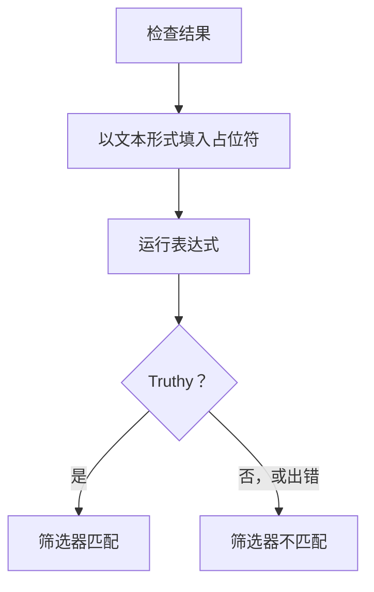

# JavaScript 表达式

**JavaScript Expression** 条件筛选器用一行 JavaScript 而不是固定的比较来判断监视器的条件是否满足。当内置筛选器无法表达条件时使用它——例如 JSON 响应深处的某个字段、两个值之间的比较，或用 `&&` 和 `||` 组合的多项检查。

:::cards
- [工作原理](#工作原理): 先填入占位符，再运行表达式。
- [变量](#各监视器类型的变量): 每种监视器类型提供的内容。
- [示例](#示例): 适用于 API、入站请求和数据库的表达式。
- [引号规则](#引号规则): 几乎每个人都会犯的错误。
:::

## 工作原理

表达式运行之前，其中的每个 `{{variable}}` 占位符都会被替换为监视器最近一次检查中的值——以纯文本形式。然后结果作为 JavaScript 运行。如果它得到一个真值（truthy），筛选器就匹配；其他任何结果（包括错误）都表示不匹配。



由于占位符以文本形式替换，`{{responseBody.item}}` 会变成原始值。字符串必须用引号括起来才是 JavaScript 字符串；数字或布尔值则不需要——参见 [引号规则](#引号规则)。表达式在 OneUptime 服务器上的隔离沙箱中运行。

## 添加 JavaScript Expression 筛选器

:::steps
### 打开条件

在监视器上打开 **配置 → 标准** 并点击 **编辑监控条件**，或者使用 **创建监视器** 的 **标准** 步骤。在您要修改的条件中操作，或者点击 **添加条件** 新建一个。

### 添加筛选器

在 **过滤器** 下点击 **添加过滤器**，将其 **过滤器类型** 设为 **JavaScript Expression**。**过滤条件** 为 **Evaluates To True**。

### 编写表达式

在 **值** 中输入表达式，使用 [该监视器类型的变量](#各监视器类型的变量)。筛选器下方的链接 **Read documentation for using JavaScript expressions here.** 会打开本页面。

### 保存

保存监视器。筛选器会在监视器的下一次检查时评估。
:::

## 各监视器类型的变量

JavaScript 表达式适用于 Website、API、Incoming Request、Incoming Email、SQL Query 和 Database Health 监视器。

### 网站和 API 监视器

| 变量 | 说明 | 类型 |
| --- | --- | --- |
| `responseBody` | 响应正文。如果响应正文是 JSON，会被解析；否则（例如 HTML 或 XML）是字符串。 | `string` 或 `JSON` |
| `responseHeaders` | 响应标头，名称为小写。 | `Dictionary<string>` |
| `responseStatusCode` | 响应状态码。 | `number` |
| `responseTimeInMs` | 响应时间，单位为毫秒。 | `number` |
| `isOnline` | 监视器是否将该响应视为在线。 | `boolean` |

### 入站请求监视器

| 变量 | 说明 | 类型 |
| --- | --- | --- |
| `requestBody` | 请求正文。 | `string` 或 `JSON` |
| `requestHeaders` | 请求标头，名称为小写。 | `Dictionary<string>` |

### SQL 查询监视器

| 变量 | 说明 | 类型 |
| --- | --- | --- |
| `rowCount` | 查询返回的行数。 | `number` |
| `scalarValue` | 第一行的第一列。 | 任意 |
| `firstRow` | 第一行，以列/值对的形式。 | `JSON` |
| `executionTimeInMs` | 查询所用的时间，单位为毫秒。 | `number` |
| `queryError` | 查询错误（如果有）。 | `string` |
| `isOnline` | 数据库是否可以访问且查询成功。 | `boolean` |

### 数据库健康监视器

`isOnline`、`engineVersion`、`connectionError`、`collectedGroups`、`unavailableGroups` 和 `metrics`。请参阅数据库健康监控页面上的 [JavaScript 表达式变量](/docs/monitor/database-health-monitor#javascript-表达式变量)。

### 入站邮件监视器

该筛选器可用，但没有绑定任何邮件字段：表达式无法读取主题、发件人、正文或收件人。请改用邮件筛选器类型——参见 [入站邮件监控](/docs/monitor/incoming-email-monitor#可用的过滤器类型)。

## 示例

下面每一行都是一个完整的表达式。对于如下的 JSON 响应正文：

```json
{
  "item": "hello",
  "count": 3,
  "items": [{ "name": "hello" }]
}
```

| 表达式 | 何时匹配 |
| --- | --- |
| `"{{responseBody.item}}" === "hello"` | `item` 字段为 `hello`。 |
| `{{responseBody.count}} > 2` | `count` 字段大于 2。 |
| `"{{responseBody.items[0].name}}" === "hello"` | `items` 的第一个元素的名称为 `hello`。 |
| `{{responseStatusCode}} === 200 && {{responseTimeInMs}} < 500` | 状态为 200，且响应用时不到半秒。 |
| `/hel+o/.test("{{responseBody.item}}")` | `item` 字段匹配一个正则表达式。 |
| `"{{responseHeaders.content-type}}".startsWith("application/json")` | 响应是 JSON。标头名称为小写。 |

用 `&&` 和 `||` 组合条件，并用括号分组：

```javascript
({{responseStatusCode}} === 200 || {{responseStatusCode}} === 204) && {{responseTimeInMs}} < 1000
```

对于以 `Content-Type: application/json` 接收 `{"status": "degraded", "region": "eu"}` 的入站请求监视器：

```javascript
"{{requestBody.status}}" === "degraded" && "{{requestBody.region}}" === "eu"
```

对于查询返回计数的 SQL 查询监视器，在计数过高或查询过慢时发出警报：

```javascript
{{scalarValue}} > 50 || {{executionTimeInMs}} > 2000
```

对于数据库健康监视器，通过对整个 `metrics` 对象做索引来读取某个指标——序列名称中包含点，因此不能放在花括号内：

```javascript
{{metrics}}['oneuptime.monitor.database.connections.used.percent'] > 90
```

## 引号规则

`{{var}}` 会被替换为值，以文本形式。要比较字符串，请用引号括起来，例如 `"{{responseBody.item}}" === "hello"`；要比较数字，则不加引号，例如 `{{responseStatusCode}} === 200`。

| 值类型 | 写法 | 示例 |
| --- | --- | --- |
| 字符串 | 加引号 | `"{{responseBody.status}}" === "ok"` |
| 数字 | 不加引号 | `{{responseTimeInMs}} < 500` |
| 布尔值 | 不加引号 | `{{isOnline}} === true` |
| 对象或数组 | 不加引号，然后做索引 | `{{responseHeaders}}['content-type']` |

需要注意三点：

- **单独一个加了引号的占位符永远为真。** 当字段为 `false` 时，`"{{responseBody.healthy}}"` 是非空字符串 `"false"`。请进行比较：`"{{responseBody.healthy}}" === "true"`，或者不加引号：`{{responseBody.healthy}} === true`。
- **值不会被转义。** 包含双引号或换行符的值会让字符串提前结束，表达式随之失败。要在 HTML 页面中查找文本，请改用 **响应主体** 筛选器。
- **不存在的路径会保持原样。** 如果检查结果中没有这样的字段，`{{responseBody.item}}` 会原样留在表达式中，这通常是语法错误——因此筛选器不匹配。

## 限制

表达式有 5 秒的运行时间。耗时更长或抛出错误的表达式不匹配，错误会写入 OneUptime 服务器日志。

## 故障排查

:::details 表达式从不匹配
先检查引号：没有加引号的字符串占位符会变成一个裸词，这是语法错误，而错误永远不会匹配。然后检查该路径是否存在于检查结果中——不存在的路径的占位符不会被填入。
:::

:::details 表达式总是匹配
单独一个加了引号的占位符是非空字符串，永远为 truthy。请将它与某个值进行比较。
:::

## 后续步骤

:::cards
- [事件与告警模板](/docs/monitor/incident-alert-templating): 在事件标题和描述中使用相同的占位符。
- [API 监控](/docs/monitor/api-monitor): 检查 HTTP 端点及其响应。
- [入站请求监控](/docs/monitor/incoming-request-monitor): 评估其他系统发送给您的请求。
:::
