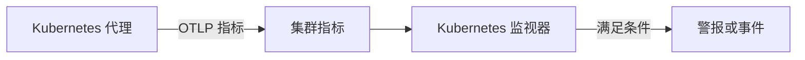

# Kubernetes 监控

Kubernetes 监视器根据 OneUptime Kubernetes 代理从集群发送的指标发出警报，涵盖节点、Pod、容器、工作负载、自动扩缩器和控制平面。你可以从现成的警报模板开始，选择单个指标，或编写自己的查询，然后设置打开警报或事件的阈值。

:::cards
- [安装代理](/docs/monitor/kubernetes-agent): 一条 Helm 命令即可把集群接入 OneUptime。
- [创建监视器](#创建-kubernetes-监视器): 选择集群，然后选择模板、指标或查询。
- [警报模板](#现成的警报模板): 十七个现成的警报，从 CrashLoopBackOff 到 etcd。
- [条件](#监控条件): 静态阈值和异常检测。
:::

## 工作原理

代理通过 OTLP 把集群的指标发送到 OneUptime，每条都带有集群名称（`k8s.cluster.name`，即 chart 的 `clusterName`）。来自新名称的第一批数据会把集群注册到 **Kubernetes** 下，此后就可以在 Kubernetes 监视器中选择该集群。监视器每分钟在其 **时间范围** 内查询这些指标，进行聚合，并把结果与条件进行比较。

## 开始之前

- 集群中运行着 OneUptime Kubernetes 代理。参见 [Kubernetes 代理(Helm 安装)](/docs/monitor/kubernetes-agent)；安装后几分钟，集群就会出现在 **Kubernetes** 下。
- 对于控制平面模板（**etcd No Leader**、**API Server Request Saturation**、**Scheduler Backlog**）：需要代理的控制平面抓取，即 `controlPlane.enabled`。托管集群（EKS、GKE、AKS）不公开这些端点，因此在那里这些监视器永远收不到数据。

## 创建 Kubernetes 监视器

:::steps
### 开始新的监视器

进入 **监视器** 并点击 **创建监视器**。在 **更多监视器类型** 下选择 **Kubernetes**，或在搜索框中输入 `k8s`。

### 选择集群

在 **Kubernetes集群** 中选择它。列表中包含代理报告过的所有集群。

### 选择要监控的内容

使用以下三个选项卡之一：

| 选项卡 | 你要选择的内容 |
| --- | --- |
| **Quick Setup** | 一个 [现成的警报模板](#现成的警报模板)。它会填好指标、范围、时间范围和条件；你仍然可以更改 **时间范围**。 |
| **Custom Metric** | [指标目录](#指标目录) 中的一个指标，然后是它的 **资源范围**、过滤器、**聚合**（平均值、最大值、最小值、总和或计数）和 **时间范围**。 |
| **高级** | **资源范围**、过滤器和 **时间范围**，以及在 **选择指标** 下编写的你自己的指标查询和公式，并附带结果的实时图表。 |

### 设置条件

设置监视器何时改变状态，以及何时打开警报或事件，参见 [监控条件](#监控条件)。模板已经填好了这些内容：请检查阈值、严重程度和值班策略。

### 保存监视器

完成表单并保存。监视器会出现在 **监视器** 下，从第一次评估起，它的状态就按你的条件变化。
:::

## 配置选项

### 资源范围和过滤器

**资源范围** 设置评估指标的层级，并决定表单显示哪些过滤器。所有过滤器都是可选的。

| 范围 | 监控对象 | 过滤器 |
| --- | --- | --- |
| 集群 | 整个集群 | — |
| 命名空间 | 某个命名空间中的资源 | **命名空间** |
| 工作负载 | Deployment、StatefulSet、DaemonSet、Job 或 CronJob | **命名空间**、**工作负载名称** |
| 节点 | 集群中的一个节点 | **节点名称** |
| Pod | 一个 Pod | **命名空间**、**Pod 名称** |

### 时间范围

**时间范围** 是每次评估监视器时指标查询覆盖的窗口，从 **Past 1 Minute** 到 **Past 365 Days**。较短的窗口（1 到 15 分钟）适合发出警报；较长的窗口可以平滑噪声较大的指标。

### 指标查询和公式

在 **高级** 选项卡上，每个查询都指定一个指标、其值的聚合方式以及可选的属性过滤器。**公式** 用算术把多个查询组合起来，例如节点利用率模板会用使用量除以可分配容量。

## 指标目录

**Custom Metric** 选项卡按资源类型分组提供以下指标：

| 类别 | 指标 |
| --- | --- |
| Pod | Pod CPU Usage, Pod Memory Usage, Pod Phase (Code), Pod Filesystem Usage, Pod Memory Limit Utilization, Pod CPU Limit Utilization, Pod Network I/O (Cumulative, Both Directions) |
| 节点 | Node CPU Usage, Node Allocatable CPU, Node Memory Usage, Node Filesystem Usage, Node Allocatable Memory, Node Ready Condition, Node Filesystem Available |
| 容器 | Container Restarts, Container CPU Limit, Container CPU Request, Container Memory Limit, Container Memory Request, Container Ready |
| 工作负载 | Deployment Available Replicas, Deployment Desired Replicas, DaemonSet Misscheduled Nodes, DaemonSet Ready Nodes, StatefulSet Ready Replicas, Job Failed Pods, Job Successful Pods |
| HPA | HPA Current Replicas, HPA Desired Replicas, HPA Max Replicas, HPA Min Replicas |
| 控制平面 | etcd Has Leader, API Server In-Flight Requests, Scheduler Pending Pods |

> [!NOTE]
> **Pod CPU Usage** 和 **Node CPU Usage** 的单位是核心而不是百分比：`0.18` 表示 0.18 个核心。**Pod Phase (Code)** 指标是一个代码（1 Pending、2 Running、3 Succeeded、4 Failed、5 Unknown），请用最大值或最小值聚合，切勿使用总和。只有在代理的控制平面抓取开启时，才会收到控制平面指标。

## 监控条件

### 评估的内容

这些监视器始终评估 **Metric Value**，即所配置的指标查询或公式的值。条件表单中没有过滤器类型选择器；它显示 **指标**、**聚合**、**条件** 和 **Threshold**。

### 聚合类型

| 聚合 | 说明 |
| --- | --- |
| 平均值 | 时间窗口内的平均值 |
| 总和 | 所有值的总和 |
| Maximum Value | 时间窗口内的最高值 |
| Minimum Value | 时间窗口内的最低值 |
| All Values | 所有值都必须满足条件 |
| Any Value | 至少有一个值满足即可 |

### 条件类型

静态阈值与你输入的 **Threshold** 进行比较：**Greater Than**、**Less Than**、**Greater Than Or Equal To**、**Less Than Or Equal To** 和 **Equal To**。

基于基线的异常检测不需要阈值。选择以下条件之一后，表单会改为显示 **灵敏度** 和 **基线窗口**：

| 条件 | 当值出现以下情况时匹配 |
| --- | --- |
| **Anomalously High** | 高于预期范围 |
| **Anomalously Low** | 低于预期范围 |
| **Anomalous** | 向任一方向偏离预期范围 |

每个样本都会与按 **基线窗口**（默认 14 天；可选 28、60 或 90 天）构建的、一周中同一小时的基线进行比较。**灵敏度** 决定预期范围的宽度：**低 (4σ — 仅限严重偏差)**、默认的 **中 (3σ — 推荐)**，或 **高 (2σ — 噪声较大，适用于非常稳定的服务)**。在积累到至少所选基线窗口长度的指标历史之前，异常条件会保持在“Learning”状态，不会产生警报。

**更多字段** 下的 **如果无数据** 决定查询在窗口内没有返回任何内容时的处理方式：**Ignore**（默认）不匹配，**触发器** 把静默视为问题，**Treat As Zero** 按零进行比较。OneUptime 自身未接收数据的时间永远不算作无数据：窗口中包含这类时间的检查会改为等待，详见 [OneUptime 未接收数据时](/docs/monitor/when-oneuptime-is-not-receiving)。

## 现成的警报模板

**Quick Setup** 选项卡按类别列出这些模板。每个模板会填写两个条件：一个在条件成立时把监视器标记为离线并打开事件和警报，另一个在条件消除后让监视器恢复在线。

| 模板 | 类别 | 触发时机 | 严重程度 |
| --- | --- | --- | --- |
| CrashLoopBackOff Detection | 工作负载 | 自 Pod 创建以来，某个容器重启超过 5 次 | 严重 |
| Pod Stuck in Pending | 正在调度 | 在 15 分钟窗口的每个样本中，都有某个 Pod 处于 Pending 阶段 | Warning |
| Node Not Ready | 节点 | 某个节点报告 NotReady | 严重 |
| High Node CPU Utilization | 节点 | 节点的平均 CPU 使用量超过其可分配 CPU 的 90% | Warning |
| High Node Memory Utilization | 节点 | 节点的平均内存使用量超过其可分配内存的 85% | Warning |
| Deployment Replica Mismatch | 工作负载 | Deployment 的可用副本数在 15 分钟内一直少于期望值 | Warning |
| Job Failures | 工作负载 | 某个 Job 有失败的 Pod | Warning |
| etcd No Leader | 控制平面 | etcd 没有选出的领导者 | 严重 |
| API Server Request Saturation | 控制平面 | API 服务器在整个窗口内持有 200 个或更多正在处理的请求 | 严重 |
| Scheduler Backlog | 正在调度 | 调度器的待处理 Pod 队列在 5 分钟内一直不为空 | Warning |
| High Node Disk Usage | 存储 | 节点的文件系统使用率超过 90% | Warning |
| DaemonSet Misscheduled Nodes | 工作负载 | DaemonSet 在不再匹配其节点选择器、亲和性或容忍度的节点上运行 Pod | Warning |
| High Node CPU Request Commitment | 节点 | 节点上容器的 CPU 请求总和超过其可分配 CPU 的 90% | Warning |
| High Node Memory Request Commitment | 节点 | 节点上容器的内存请求总和超过其可分配内存的 90% | Warning |
| HPA Saturated at Max Replicas | 工作负载 | HPA 运行在其 `maxReplicas` 的 90% 或以上 | 严重 |
| Pod Memory Saturating Container Limit | 工作负载 | Pod 使用了超过其容器内存限制的 90% | 严重 |
| Pod CPU Saturating Container Limit | 工作负载 | Pod 使用了超过其容器 CPU 限制的 90% | Warning |

基于单个对象指标的模板会分别评估每个节点、Pod、Deployment、Job、DaemonSet 或 HPA，因此有多个不健康 Pod 的集群会为每个 Pod 创建一个事件，而不是为整个集群只创建一个。

> [!NOTE]
> **CrashLoopBackOff Detection** 模板读取的是容器在当前 Pod 中的累计重启次数，而不是速率。一个陷入崩溃循环后又恢复的容器，会让警报一直保持打开，直到它的 Pod 被替换。

### 捕捉原因，而不仅仅是症状

节点级模板（High Node CPU Utilization、High Node Memory Utilization、Node Not Ready、Pod Stuck in Pending）在资源耗尽链条的*末端*触发，此时集群已经处于降级状态。有三个模板在链条的*起点*触发，而解决办法通常就在那里：

- **Pod Memory Saturating Container Limit** 和 **Pod CPU Saturating Container Limit** 捕捉紧贴自身限制运行的工作负载。超过内存限制会立即被 OOMKill；超过 CPU 限制会让内核对 Pod 进行节流，使它在不报任何错误的情况下变慢。两者都是 CrashLoopBackOff 和无法解释的延迟的常见原因。
- **HPA Saturated at Max Replicas** 捕捉已经没有余量的自动扩缩器。每个 Pod 限制过低的工作负载会被节流或终止，这又会推高 HPA 据以扩缩的那个指标，于是自动扩缩器不断添加同样资源不足的副本，直到触及上限。解决办法是提高限制；提高 `maxReplicas` 只会让情况更糟。

在每个运行自动扩缩工作负载的命名空间中同时启用它们：这种组合能区分“确实需要更多容量”和“每个 Pod 的资源不足”。

> [!NOTE]
> 两个 Pod 限制模板用 Pod 的使用量除以其各容器限制的**总和**，因此带有 sidecar 的 Pod 也能被正确测量。kubelet 报告的 Pod 内存包含可回收的页缓存，所以大量读写文件的工作负载可能在内存模板上一直处于高位，却从未被 OOMKill：应把它理解为“接近限制”，而不是“即将被终止”。

## 故障排除

:::details 集群不在 Kubernetes集群 列表中
集群会根据代理的数据自动注册，使用安装代理时设置的 `clusterName`。请检查代理的 Pod 是否在运行，以及集群是否列在 **产品 → 基础设施 → Kubernetes → 所有集群** 下。[Kubernetes 代理(Helm 安装)](/docs/monitor/kubernetes-agent) 介绍了安装方法以及没有数据到达时应检查的内容。
:::

:::details 控制平面模板从不触发
**etcd No Leader**、**API Server Request Saturation** 和 **Scheduler Backlog** 读取的指标只有代理的控制平面抓取才会收集。请在代理的 Helm 值中开启 `controlPlane.enabled`；它默认是关闭的。托管集群（EKS、GKE、AKS）不公开这些端点，因此在这些集群上这些监视器永远收不到数据。
:::

:::details CPU 阈值从不触发
**Pod CPU Usage** 和 **Node CPU Usage** 的单位是核心而不是百分比，所以阈值 `80` 表示 80 个核心。请以核心为单位设置阈值，或者从比较百分比的 **High Node CPU Utilization** 或 **Pod CPU Saturating Container Limit** 开始。
:::

:::details Pod 恢复后 CrashLoopBackOff Detection 仍保持打开
模板读取的是容器在当前 Pod 中的累计重启次数，因此一旦超过 5，这个数字就不会再回落。当 Pod 被替换时（例如重新部署、驱逐或排空节点），警报才会解决。
:::

## 后续步骤

:::cards
- [Kubernetes 代理(Helm 安装)](/docs/monitor/kubernetes-agent): 使用 Helm 安装、升级和调优代理。
- [Kubernetes 代理](/docs/telemetry/kubernetes-agent): 命名空间过滤器、控制平面指标、日志严重程度过滤器和 AI 代理。
- [指标监控](/docs/monitor/metrics-monitor): 对任何指标发出警报，包括代理的自定义指标和 eBPF 指标。
- [事件与告警模板](/docs/monitor/incident-alert-templating): 把超出阈值的 Pod 或节点写进事件标题。
:::
