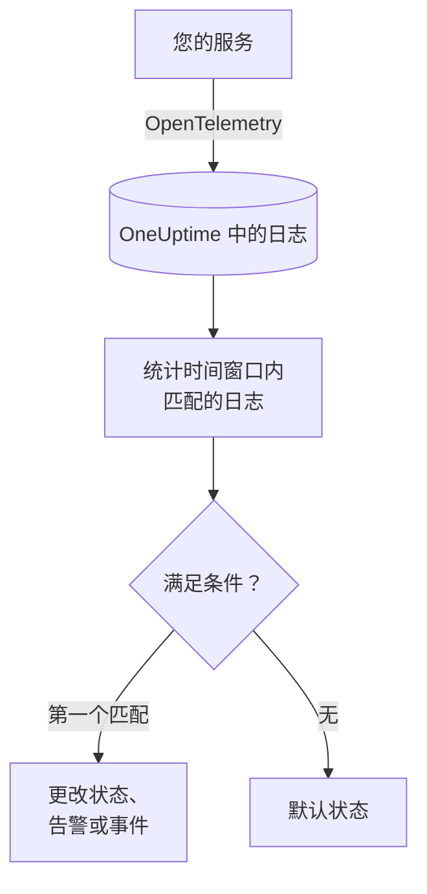
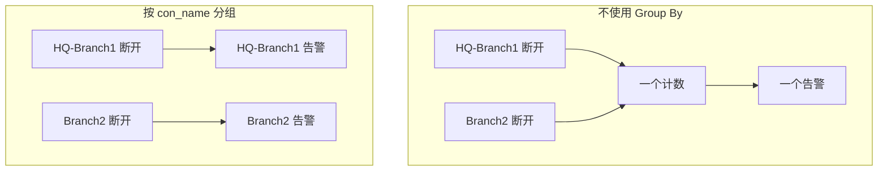

# 日志监控

日志监视器在一个时间窗口内统计您的服务发送到 OneUptime、且与您的过滤器（文本、严重程度、服务、属性）匹配的日志。当计数满足您的条件时，它会更改监视器的状态、创建告警或声明事件。可以用它发现错误激增、某条特定的错误消息，或已经停止写日志的服务。

:::cards
- [创建监视器](#创建日志监视器): 选择要统计的日志以及何时告警。
- [如何评估](#如何评估): 时间窗口、计数和一分钟的周期。
- [条件](#条件): 阈值、异常检测和默认值。
- [按分组告警](#按分组告警group-by): 每个隧道、用户或接口一个告警。
:::

## 工作原理



OneUptime 每分钟统计一次与监视器过滤器匹配、且在其时间窗口内到达的日志。它把这个计数从上到下与监视器的条件比较，第一个匹配的条件决定发生什么。如果没有条件匹配，监视器会回到默认状态。

## 开始之前

- 您的服务通过 OpenTelemetry（或 OneUptime 接收的其他日志源）把日志发送到 OneUptime。请参阅 [OpenTelemetry](/docs/telemetry/open-telemetry)。
- 若要按日志行中的某个值（例如隧道名称或用户名）过滤或分组，请先用 [日志管道](/docs/telemetry/log-pipelines) 把它变成属性。

## 创建日志监视器

:::steps
### 开始创建新监视器

前往 **监视器**，点击 **创建监视器**。

### 选择 Logs

在 **监视器类型** 下点击 **更多监视器类型**，然后在 **遥测** 下选择 **日志**，或在搜索框中输入 `logs`。输入 **名称**，然后点击 **下一步**。

### 选择要统计的日志

在 **日志监视器配置** 中设置 **包含此文本的监视器日志**、**监视器日志（时间）**、**日志严重程度**。留空的过滤器匹配所有日志。过滤器下方的 **日志预览** 显示它们当前匹配的日志。

### 缩小范围（可选）

打开 **更多字段**，按遥测服务、基础设施实体或属性过滤。若要每个隧道、用户或接口各收到一个告警，而不是整个监视器只有一个，请在 **Group by Attributes** 中添加该属性（请参阅 [按分组告警](#按分组告警group-by)）。

### 设置条件

**监视器条件** 卡片一开始有两个条件：没有日志匹配时离线并创建事件；至少有一条匹配时在线。请把它们改成您想告警的情况（请参阅 [条件](#条件)）。

### 创建监视器

点击 **创建监视器**。监视器会在其 **概览** 页面打开，第一次评估在一分钟内运行。
:::

## 查询内容

| 字段 | 匹配什么 | 默认值 |
| --- | --- | --- |
| **包含此文本的监视器日志** | 正文包含此文本的日志，不区分大小写。 | 空：所有日志 |
| **监视器日志（时间）** | 最近 5 秒到最近 24 小时内的日志。 | **最近 1 分钟** |
| **日志严重程度** | 具有所选任一严重程度的日志。 | 空：所有严重程度 |
| **Group by Attributes** | 不是过滤器：对这些属性值的每种组合分别计数。 | 空：一个计数 |
| **按遥测服务过滤**（在 **更多字段** 中） | 来自所选任一服务的日志。 | 空：所有服务 |
| **Filter by Infrastructure Entity**（在 **更多字段** 中） | 来自所选任一主机、Pod、容器及其他实体的日志。 | 空：所有实体 |
| **按属性过滤**（在 **更多字段** 中） | 属性满足所有条件的日志。每个条件都有自己的运算符，例如“等于”或“包含”。 | 空：无条件 |

日志必须匹配您设置的所有过滤器才会被计数。

### 日志严重程度

每条日志都以七种严重程度之一存储。对于 OpenTelemetry 日志，严重程度来自日志的严重程度编号，因此请按严重程度选择，而不是按日志记录器打印的文本选择：

| 严重程度 | OpenTelemetry 严重程度编号 |
| --- | --- |
| **跟踪** | 1–4 |
| **Debug** | 5–8 |
| **Information** | 9–12 |
| **Warning** | 13–16 |
| **错误** | 17–20 |
| **Fatal** | 21–24 |
| **未指定** | 其他所有值 |

## 如何评估

- **每分钟。** 日志监视器不由探测器检查，因此没有可设置的间隔，也没有 **探测器与间隔** 页面。
- **每次评估一个数字。** 监视器统计与所有过滤器匹配、且在评估前的 **监视器日志（时间）** 内到达的日志。设为 **最近 5 分钟** 时，每次评估回看五分钟，因此相邻评估的窗口会重叠。
- **没有日志就是计数 0。** 停止写日志的服务计数为 0，而默认的离线条件正是在找这种情况。
- **OneUptime 自身的停机不算沉默。** 只要时间窗口中包含 OneUptime 自身未接收数据的时间（正在重启、升级或追赶积压），检查就会等待：状态不会改变，也不会打开或解决任何事件或告警。请参阅 [OneUptime 未接收数据时](/docs/monitor/when-oneuptime-is-not-receiving)。
- **条件从上到下。** 第一个匹配的条件决定结果，因此请把最严重的放在最前面。分组的监视器工作方式不同：它会对每个分组检查所有条件（请参阅 [条件的评估方式不同](#条件的评估方式不同)）。

每次状态变化及其原因都会记录在监视器的 **状态时间线** 上。

## 条件

日志监视器的条件只有一个 **过滤器类型**：**Log Count**，即窗口内匹配的日志数量。选择一个 **过滤条件**，如果是阈值条件，再填写 **值**。

| 过滤条件 | 当日志数量…时匹配 |
| --- | --- |
| **Greater Than** | 高于该值 |
| **Greater Than Or Equal To** | 等于或高于该值 |
| **Less Than** | 低于该值 |
| **Less Than Or Equal To** | 等于或低于该值 |
| **Equal To** | 正好等于该值 |
| **Anomalously High** | 高于每周这个时段的预期范围 |
| **Anomalously Low** | 低于该范围 |
| **Anomalous** | 向任一方向超出该范围 |

异常条件没有 **值**。请选择 **灵敏度**（Low、默认的 Medium 或 High）以及 14 天（默认）、28 天、60 天或 90 天的 **基线窗口**。OneUptime 把计数换算成每分钟的速率，并与该窗口内每周的同一时段比较。基线只涵盖监视器的服务和严重程度，不包括其文本和属性过滤器。在每周这个时段积累足够的历史之前，条件仍在学习，不会触发。

新的日志监视器从以下条件开始：

| 条件 | 过滤器 | 效果 |
| --- | --- | --- |
| Check if … is offline | **Log Count** **Equal To** `0` | 将监视器标记为离线并声明事件，事件会自动解决 |
| Check if … is online | **Log Count** **Greater Than** `0` | 将监视器标记为在线 |

> [!TIP]
> 若要针对错误而不是沉默告警，请把 **日志严重程度** 设为 **错误**，并把离线条件改为 **Log Count** **Greater Than** 窗口内您能容忍的错误数量。

## 实例：错误激增

您希望在结账服务五分钟内记录超过 50 条错误时创建事件：

- **日志严重程度**：**错误**
- **监视器日志（时间）**：**最近 5 分钟**
- **按遥测服务过滤**：`checkout`
- 条件 1：**Log Count** **Greater Than** `50`：将监视器标记为离线并声明事件
- 条件 2：**Log Count** **Less Than Or Equal To** `50`：将监视器标记为在线

连续四次评估：

| 时间 | 最近 5 分钟的错误日志 | 匹配的条件 | 发生了什么 |
| --- | --- | --- | --- |
| 10:00 | 12 | 2 | 监视器在线。 |
| 10:01 | 64 | 1 | 监视器变为离线，并声明事件。 |
| 10:02 | 81 | 1 | 保持离线。事件已经打开，因此不会声明第二个。 |
| 10:06 | 9 | 2 | 监视器恢复在线，并且由于 **自动解决事件** 已开启，事件会自行解决。 |

由于窗口重叠，一次错误爆发结束后，计数在最多五分钟内仍然偏高。对于需要更快恢复的监视器，请使用更短的窗口。

## 按分组告警（Group By）

**Group by Attributes** 把日志监视器的计数拆分为每种不同属性值组合各一个计数（每个 IPsec 隧道、每个 VPN 用户、每个防火墙接口各一个），并对每个分组分别评估条件。它相当于指标监视器的 [Group By](/docs/monitor/metrics-monitor#按序列告警group-by) 在日志上的对应功能。

### 每个分组一个告警

没有 Group By 时，监视已终止 IPsec 隧道的监视器只是整个监视器的一个计数，并发出 **整个监视器一个告警**。在该告警打开期间，第二条隧道断开不会带来任何新内容：监视器已经在告警了。

按隧道名称设置 Group By 后，隧道 `HQ-Branch1` 的终止会打开它自己的告警，十分钟后隧道 `Branch2` 的终止会在旁边打开 **第二个独立告警**。



### 独立解决

每个分组的告警或事件各自独立解决。一旦某个分组不再满足条件（`HQ-Branch1` 在时间窗口内不再记录终止），它的告警就会解决，而 `Branch2` 的告警会一直打开，直到 `Branch2` 也停止为止。一个分组的恢复绝不会关闭另一个分组的告警。

日志监视器看到的是事件，而不是状态：只要某个分组在整个时间窗口内没有记录任何满足条件的内容，它的告警就会解决，无论隧道是否已恢复。

### 示例：每条 Sophos IPsec 隧道一个告警

这里假设防火墙的 syslog 行由不带目标前缀的 [Key=Value 解析器](/docs/telemetry/log-pipelines#keyvalue-parser) 拆分为属性，因此隧道名称就是属性 `con_name`：

```text
log_component="IPSec" con_name="HQ-Branch1" status="Terminated" message="IPSec Connection HQ-Branch1 between 10.171.4.117 and 10.171.4.118 for Child HQ-Branch1 terminated."
```

:::steps
1. 创建一个 **日志** 监视器。
2. 将 **包含此文本的监视器日志** 设为 `terminated`，将 **监视器日志（时间）** 设为 **最近 5 分钟**。
3. 在 **更多字段** 下添加属性过滤器 `log_component` = `IPSec`。
4. 在 **Group by Attributes** 下添加 `con_name`。
5. 添加一个使用过滤器 **Log Count** **Greater Than** `0` 的条件，用于创建标题为 `IPsec tunnel {{con_name}} terminated` 的告警或事件。
:::

现在，每条记录了终止的隧道都会收到自己的告警（`IPsec tunnel HQ-Branch1 terminated`、`IPsec tunnel Branch2 terminated`），每个告警各自独立解决。

### 标题和描述中的分组值

每个 Group By 属性的值都是告警或事件的标题、描述和修复说明中的 [模板变量](/docs/monitor/incident-alert-templating)，与指标序列的标签一样：按 `con_name` 分组即可使用 `{{con_name}}`。带点号的键会被当作路径读取，因此 `sophos.con_name` 对应 `{{sophos.con_name}}`。如果标题中还没有体现分组，分组会被追加到标题后（`IPsec tunnel terminated - Con Name: HQ-Branch1`），而 `{{seriesResourceSuffix}}` 和 `{{seriesResourceSummary}}` 的用法与指标监视器相同。

### 分组如何计数

- 最多 10 个属性。它们值的每种不同组合就是一个分组。
- 缺少某个 Group By 属性的日志，会以该属性的 **空值** 计数，因此没有该属性的日志会自成一个分组，其告警不会为该属性显示任何值。如果所有告警到达时都没有分组值，请检查属性的键：带目标前缀的日志管道会把 `con_name` 存为 `sophos.con_name`。
- 超过 256 个字符的分组值会被截断为 256 个字符。
- 每次检查最多评估 **100 个分组**：日志最多的 100 个。如果匹配的分组更多，其余分组会在该次检查中被跳过，并记录一条警告；请收窄监视器的过滤器以覆盖它们。

### 条件的评估方式不同

- **所有条件都会被评估**，与分组的指标监视器一样，因此不同分组可以同时满足不同的条件。满足两个条件的分组仍然只会收到一个告警，来自第一个条件；所以请按从最严重到最不严重的顺序排列条件。
- **只有在时间窗口内记录过内容的分组才存在。** 因此 **Equal To 0** 和 **Less Than** 条件只会对至少记录过一次的分组触发；若要在日志完全不再到达时告警，请使用不带 Group By 的监视器。
- **异常检测**（**Anomalously High**、**Anomalously Low**、**Anomalous**）不按分组评估（其基线涵盖整个监视器），因此这些过滤器在分组的监视器上永远不会匹配。
- 监视器的状态跟随任一分组满足的第一个条件。当没有任何分组满足任何条件时，监视器回到默认状态。

## 故障排查

:::details 监视器离线，但我的服务正在写日志
计数为 0，说明过滤器与服务发送的任何日志都不匹配。打开监视器的 **标准** 页面（在 **配置** 下），点击 **Edit Monitoring Criteria**：**日志预览** 会显示过滤器当前选中的内容。最常见的原因是按日志记录器打印的文本而不是严重程度编号选择了严重程度（请参阅 [日志严重程度](#日志严重程度)）、服务或属性过滤器不匹配，以及时间窗口短于服务两条日志之间的间隔。
:::

:::details 出现了激增，但没有任何告警
条件从上到下检查，第一个匹配的条件决定结果。如果在您预期的条件之上有一个宽泛的条件，例如 **Log Count** **Greater Than** `0`，它会先匹配并阻止其余条件。请把最严重的条件放在最上面。
:::

:::details 异常条件从不触发
它仍在学习：它所比较的每周时段还没有足够的历史。在设置了 **Group by Attributes** 的监视器上，异常条件永远不会匹配；请在那里使用阈值。
:::

:::details 分组告警到达时没有分组值
缺少 Group By 属性的日志会以空值计数。请在日志浏览器中检查键的确切名称：带目标前缀的日志管道会把 `con_name` 存为 `sophos.con_name`。
:::

## 后续步骤

:::cards
- [日志管道](/docs/telemetry/log-pipelines): 把日志行拆分为可用于过滤和分组的属性。
- [事件与告警模板](/docs/monitor/incident-alert-templating): 把分组值和计数放进标题和描述。
- [指标监控](/docs/monitor/metrics-monitor): 按主机或按容器对指标告警。
- [跟踪监控](/docs/monitor/traces-monitor): 以同样的方式对失败的 Span 告警。
:::
