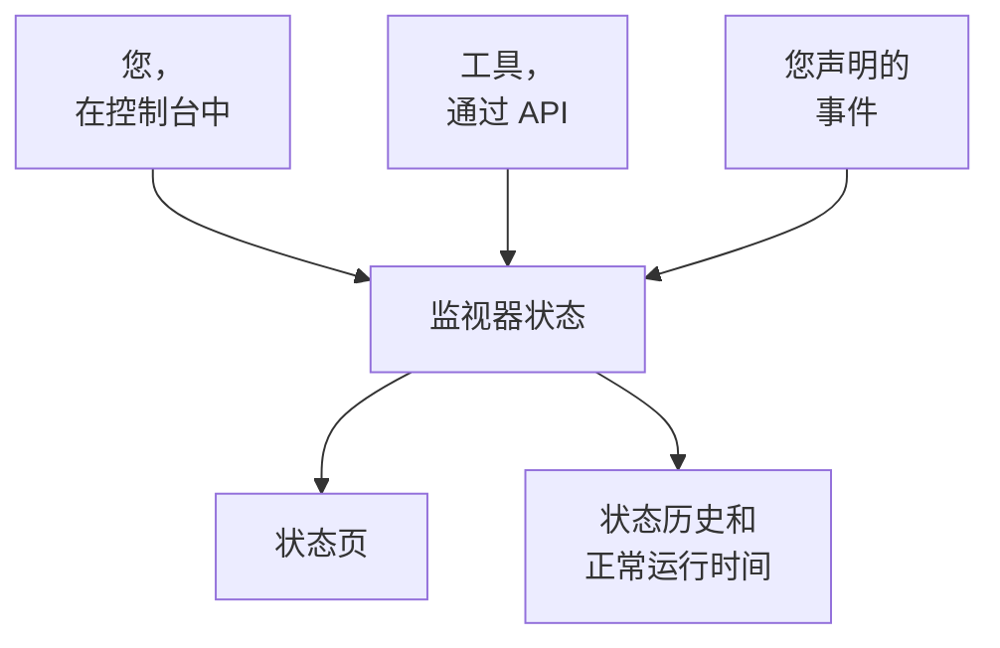

# 手动监控

手动监视器没有自动检查：它的状态就是您在控制台中或通过 API 设置的状态。用它在状态页和事件中表示 OneUptime 无法自行检查的东西——第三方依赖、物理系统、业务流程。

:::cards
- [创建一个](#创建手动监视器): 在控制台中只需一步。
- [更改其状态](#更新状态): 在控制台中，或通过 API 从您自己的工具更改。
- [事件和警报](#事件和警报): 在同一步中声明事件并设置状态。
:::

## 何时使用手动监视器

| 使用场景 | 说明 |
| --- | --- |
| 第三方服务 | 跟踪您依赖但无法直接监控的外部服务的状态。 |
| 物理基础设施 | 表示没有网络监控的硬件或物理系统。 |
| 业务流程 | 跟踪影响服务状态的非技术流程。 |
| 由 API 驱动的状态 | 让您自己的工具通过 OneUptime API 设置状态。 |
| 状态页占位 | 在状态页上显示在 OneUptime 之外管理的组件。 |

发布了状态页的提供商不需要它：[外部状态页监控](/docs/monitor/external-status-page-monitor) 会替您跟踪那个页面。

## 工作原理

手动监视器没有监控间隔、探测器或条件。它的状态保持为您设置的样子，直到您、通过 API 的工具，或您声明的事件更改它——新的状态会显示在监视器出现的每个地方。



每次更改都是监视器 **状态时间线** 上的一个条目，因此它的正常运行时间和状态历史会像其他监视器一样被保留。手动监视器不是活动监视器，因此在 OneUptime Cloud 上它不会给您的账单增加任何费用。

## 创建手动监视器

:::steps
### 开始创建新监视器

前往 **监视器**，点击 **创建监视器**。

### 选择 Manual

在 **监视器类型** 下点击 **更多监视器类型**，然后在 **其他** 下选择 **Manual**。

### 命名并创建

输入 **名称**（如果需要，也可以在 **更多字段** 下输入 **描述**），然后点击 **创建监视器**。手动监视器不需要其他任何内容，因此从这第一步就会创建。
:::

## 更新状态

### 在控制台中

:::steps
1. 打开监视器，在其侧边菜单中点击 **状态时间线**。
2. 点击 **创建监视器 状态 事件**。
3. 选择 **监视器状态**。**开始** 为现在；如果更改发生得更早，请设置一个更早的时间。
4. 点击 **创建监视器 状态 事件**。新状态会立即显示在监视器上，以及列出它的每个状态页上。
:::

### 通过 API

将新状态作为监视器状态事件发送，并在 `ApiKey` 标头中放入您项目的 [API 密钥](/docs/api-reference/api-reference)：

```bash
curl -X POST https://oneuptime.com/api/monitor-status-timeline \
  -H "ApiKey: $ONEUPTIME_API_KEY" \
  -H "Content-Type: application/json" \
  -d '{"data": {"monitorId": "<monitor id>", "monitorStatusId": "<monitor status id>"}}'
```

- `monitorId` 是监视器的 ID：点击其页面上的 **ID** 行即可复制。
- `monitorStatusId` 是要设置的状态：在 **监视器 → 设置 → 监视器状态** 中，在该状态所在的行选择 **显示 ID**。
- `startsAt` 是可选的。省略时，更改从现在开始。
- 在自托管安装中，请把请求发送到您自己的主机，而不是 `oneuptime.com`。

发送监视器已有的状态会被拒绝，返回 `Monitor Status cannot be same as previous status.`，并且不会记录任何内容，因此每次运行都会上报的工具可以忽略这个响应。

## 事件和警报

在任何选择监视器的地方，手动监视器都可以像其他监视器一样被选择：

- 声明事件，并在 **监视器** 下选择该监视器。使用 **将监视器状态更改为**，声明事件时也会设置监视器的状态；解决事件时，监视器会恢复为运行正常，除非它上面还有另一个未关闭的事件。参见 [声明事件](/docs/incidents/declaring-incidents#第-2-步受影响的资源)。
- 为它创建警报，用于您的团队需要处理、但无需告知客户的问题。
- 将它添加到状态页，向客户展示您手动关注的依赖项。

## 后续步骤

:::cards
- [创建监视器](/docs/monitor/create-monitor): 会替您执行检查的监视器类型。
- [外部状态页监控](/docs/monitor/external-status-page-monitor): 改为自动跟踪提供商的状态页。
- [状态页概览](/docs/status-pages/index): 向客户显示监视器的状态。
:::
