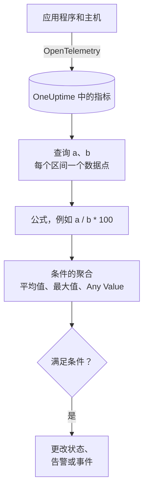

# 指标监控

指标监视器查询您的应用程序和基础设施发送到 OneUptime 的指标，在需要比率或总量时用公式组合它们，并在一个滚动时间范围内把结果与您的条件比较。可以用它监控请求速率、错误率、队列深度、CPU、内存和磁盘（任何数值序列）；分组后，每台主机或每个容器各有一个告警。

:::cards
- [创建监视器](#创建指标监视器): 查询、公式、时间范围和条件。
- [如何评估](#如何评估): 数据点、公式和条件的聚合。
- [实例](#实例不断增长的队列): 同一组数据在每种聚合下的结果。
- [按序列告警](#按序列告警group-by): 每台主机、每个容器或每个挂载点一个告警。
:::

## 工作原理

OneUptime 每分钟在监视器的时间范围内运行它的每个指标查询。查询在每个时间区间返回一个数据点，公式按区间逐个组合查询。然后，每个条件把它所检查的查询或公式的数据点归约为一个结果（平均值、最大值，或对每个点的检验），并与其阈值比较。

## 开始之前

- 您的应用程序或基础设施通过 OpenTelemetry 把指标发送到 OneUptime。请参阅 [OpenTelemetry](/docs/telemetry/open-telemetry)。
- 了解指标的名称，以及您想要过滤或分组的属性。**指标** 和 **Group by** 列表只提供 OneUptime 已收到的名称和属性。

## 创建指标监视器

:::steps
### 开始创建新监视器

前往 **监视器**，点击 **创建监视器**。

### 选择 Metrics

在 **监视器类型** 下点击 **更多监视器类型**，然后在 **遥测** 下选择 **指标**，或在搜索框中输入 `metrics`。输入 **名称**，然后点击 **下一步**。

### 选择时间范围

在 **指标监视器配置** 中选择 **时间范围**：每次评估回看多远。它默认为 **Past 1 Minute**。

### 添加指标查询

在 **选择指标** 下选择一个 **指标** 以及用 **Aggregate by** 聚合它的方式。打开 **Filters & grouping** 可以按属性过滤，或用 **Group by** 分组。点击 **添加指标** 添加另一个查询，或点击 **添加公式** 组合它们。查询下方的图表会预览该时间范围，让您看到条件将要检查的值。

### 设置条件

在 **监视器条件** 中，每个条件选择要检查的 **指标**（查询或公式）、它的 **聚合**、一个 **条件** 和一个 **Threshold**。新监视器初始拥有的条件请参阅 [条件](#条件)。

### 创建监视器

点击 **创建监视器**。监视器会在其 **概览** 页面打开，第一次评估在一分钟内运行。
:::

## 查询内容

### 指标查询

| 字段 | 作用 | 默认值 |
| --- | --- | --- |
| **指标** | 要查询的指标。 | 必填 |
| **Aggregate by** | 每个时间区间中的值如何合并为一个数据点：平均值、总和、Min、Max、计数，或某个百分位（P50、P75、P90、P95 或 P99）。 | 平均值 |
| **Filter by attributes**（在 **Filters & grouping** 中） | 只保留属性满足这些条件的序列。 | 无过滤 |
| **Group by**（在 **Filters & grouping** 中） | 这些属性的每个唯一值一个序列（请参阅 [按序列告警](#按序列告警group-by)）。 | 一个序列 |

每个查询和公式都会按添加的顺序获得一个变量（`a`、`b`、`c` 等）。

### 公式

公式用 `+`、`-`、`*`、`/`、`%`、`^` 和括号，按区间逐个组合查询变量。变量前面可以加 `$`，也可以不加：

- `a / b * 100`：`a` 占 `b` 的比例，以百分比表示
- `a + b`：两个指标相加
- `a - b`：两者之差

### 滚动时间窗口

**时间范围** 决定每次评估回看多远：**Past 1 Minute**、**Past 5 Minutes**、**Past 10 Minutes**、**Past 15 Minutes**、**Past 30 Minutes**、**Past 1 Hour**、**Past 2 Hours**、**Past 3 Hours**、**Past 6 Hours**、**Past 12 Hours**、**Past 1 Day**、**Past 2 Days**、**Past 3 Days**、**Past 7 Days**、**Past 14 Days**、**Past 30 Days**、**Past 60 Days**、**Past 90 Days**、**Past 180 Days** 或 **Past 365 Days**。

范围越长，每个时间区间越宽，一个数据点代表的时间就越长：

| 时间范围 | 每个数据点代表 |
| --- | --- |
| Past 1 Minute 到 Past 3 Hours | 1 分钟 |
| Past 6 Hours、Past 12 Hours | 5 分钟 |
| Past 1 Day | 15 分钟 |
| Past 2 Days、Past 3 Days | 30 分钟 |
| Past 7 Days | 1 小时 |
| Past 14 Days、Past 30 Days | 1 天 |
| Past 60 Days 到 Past 180 Days | 1 周 |
| Past 365 Days | 1 个月 |

## 如何评估

- **每分钟。** 指标监视器不由探测器检查，因此没有可设置的间隔，也没有 **探测器与间隔** 页面。
- **先查询，后公式。** 每个查询按其 **Aggregate by**，在时间范围的每个时间区间返回一个数据点。公式根据查询的数据点逐个区间计算。
- **然后是条件的聚合。** 每个条件把其 **指标** 的数据点归约为与阈值比较的值：

| 聚合 | 条件检查的对象… |
| --- | --- |
| 平均值 | 数据点的平均值 |
| 总和 | 数据点的总和 |
| Maximum Value | 最高的数据点 |
| Minimum Value | 最低的数据点 |
| All Values | 每个数据点：所有点都必须满足条件 |
| Any Value | 每个数据点：只要有一个点满足条件即可 |

- **条件从上到下。** 在没有 Group By 的监视器上，第一个匹配的条件决定结果，因此请把最严重的放在最前面。分组的监视器会对每个序列检查所有条件（请参阅 [条件的评估方式不同](#条件的评估方式不同)）。
- **没有数据不等于零。** 当查询在时间范围内没有返回数据点时，条件按其 **更多字段** 下 **如果无数据** 的设置处理：**Ignore**（默认：条件不匹配）、**Treat As Zero** 或 **触发器**。
- **OneUptime 自身的停机不算沉默。** 只要时间范围中包含 OneUptime 自身未接收数据的时间（正在重启、升级或追赶积压），检查就会等待：无论 **如果无数据** 如何设置，状态都不会改变，也不会打开或解决任何事件或告警。请参阅 [OneUptime 未接收数据时](/docs/monitor/when-oneuptime-is-not-receiving)。

## 条件

这些监视器始终评估 **Metric Value**：所配置的指标查询或公式的聚合值。条件表单没有过滤器类型选择器，它显示 **指标**、**聚合**、**条件** 和 **Threshold**。如果指标有单位，请在阈值旁边选择单位。

| 条件 | 当值…时匹配 |
| --- | --- |
| **Greater Than** | 高于阈值 |
| **Greater Than Or Equal To** | 等于或高于阈值 |
| **Less Than** | 低于阈值 |
| **Less Than Or Equal To** | 等于或低于阈值 |
| **Equal To** | 正好等于阈值 |
| **Anomalously High** | 高于每周这个时段的预期范围 |
| **Anomalously Low** | 低于该范围 |
| **Anomalous** | 向任一方向超出该范围 |

异常条件没有阈值。表单改为显示 **灵敏度**（Low、默认的 Medium 或 High）和 **基线窗口**（默认 14 天，或 28、60、90 天），并把每个数据点与根据该窗口构建的每周同一时段的基线比较。在每周这个时段积累足够的历史之前，条件仍在学习，不会产生告警。

新的指标监视器在第一个查询上有两个条件，聚合都是 **Any Value**：

| 条件 | 条件 | 效果 |
| --- | --- | --- |
| Check if … is offline | **Equal To** `0` | 将监视器标记为离线并声明事件，事件会自动解决 |
| Check if … is online | **Greater Than** `0` | 将监视器标记为在线 |

> [!NOTE]
> 离线条件在上报的值为 0 时触发，而不是在沉默时触发。若要在指标不再到达时告警，请把它的 **如果无数据** 设为 **触发器**。

## 实例：不断增长的队列

您希望结账队列持续很深时创建事件。查询 `a` 是仪表 `checkout.queue.depth`，**Aggregate by** 为 Max，**时间范围** 为 **Past 5 Minutes**。一次评估看到以下五个一分钟的数据点：

| 分钟 | 10:01 | 10:02 | 10:03 | 10:04 | 10:05 |
| --- | --- | --- | --- | --- | --- |
| `a` | 640 | 980 | 1,500 | 1,620 | 1,100 |

**指标** 为 `a`、**条件** 为 **Greater Than**、**Threshold** 为 `1000` 的条件，在每种 **聚合** 下给出不同的答案：

| 聚合 | 与 1,000 比较的值 | 匹配？ |
| --- | --- | --- |
| 平均值 | 1,168 | 是 |
| 总和 | 5,840 | 是 |
| Maximum Value | 1,620 | 是 |
| Minimum Value | 640 | 否 |
| All Values | 640、980、1,500、1,620、1,100 | 否：有两个点不高于 1,000 |
| Any Value | 640、980、1,500、1,620、1,100 | 是：1,500 高于 1,000 |

**平均值** 会对持续的积压告警，并忽略单独一分钟的深队列；**All Values** 会等到范围内每一分钟都很深；**Any Value** 在第一个深队列的分钟就告警。

## 按序列告警（Group By）

在指标查询上设置 **Group by**，会把该查询拆分为每个唯一属性值一个序列（每台主机、每个容器、每个挂载点各一个），设置了 Group By 的监视器会独立评估每个序列。这一个设置就是“整个集群不健康”和“`prod-db-01` 不健康”之间的区别。

### 每个分组一个告警

把 Group By 设为 `host.name` 后，监视五十台主机的磁盘使用率监视器会 **为每台超过阈值的主机各发出一个告警（或事件）**。主机 A 磁盘写满会打开它自己的告警；十分钟后主机 B 写满，会在旁边打开第二个独立告警。

没有 Group By 时，同一个监视器只是一个标量：查询把所有主机合并为一个数字，监视器发出 **整个监视器一个告警**。在该告警打开期间，第二台主机超过阈值不会产生任何结果（监视器已经在告警，没有新的告警可发），值班工程师永远不会知道主机 B 的情况。**设置 Group By 才能获得按主机的告警。** 如果您希望按主机、按容器或按挂载点接到呼叫，就设置它。

### 独立解决

每个分组的告警都跟踪自己的分组。当主机 A 回落到阈值以下时，它的告警会自行解决，而主机 B 的告警会一直打开，直到主机 B 恢复。一个分组的恢复绝不会关闭另一个分组的告警。

### 条件的评估方式不同

- **分组的监视器会评估所有条件。** 因此不同严重级别可以同时在不同分组上触发：把“Critical：大于 95”放在“Warning：大于 80”之上时，在同一次检查中，96% 的主机会打开严重告警，而 85% 的主机会打开警告告警。同时超过两个级别的主机仍然只会收到一个告警，来自第一个匹配的条件，所以 **请按从最严重开始的顺序排列条件**。
- **未分组的监视器在第一个匹配的条件处停止。** 只有那一个条件会触发，这也是要把告警条件放在健康条件之上的另一个原因：放在最前面的宽泛健康条件几乎在每次检查时都会匹配，使它下面的告警条件永远得不到评估。

| 主机 | 磁盘使用率 | Critical (> 95) | Warning (> 80) | 发出的告警 |
| --- | --- | --- | --- | --- |
| `prod-db-01` | 96% | 是 | 是 | Critical |
| `prod-db-02` | 85% | 否 | 是 | Warning |
| `prod-db-03` | 40% | 否 | 否 | 无 |

### 选择用于分组的属性

请按一个真正能区分出您会为之呼叫某人的独立对象的属性来分组：整个集群的主机指标用主机属性，容器指标用容器或 Pod 属性，文件系统或磁盘 I/O 指标用挂载点或设备属性，网络指标用接口属性。**Group by** 下拉列表中填充的是您的采集器实际发送的属性，所以请从列表中选择，而不是手动输入键。

不要对已经是整个系统单一标量的指标分组（整个集群的主节点标志、调度器积压，或单主机监视器上那台主机的 CPU）。对这类指标分组只会得到一个序列，除了告警标题之外什么都不会改变。

分组属性的值也可以在告警或事件的标题、描述和修复说明中作为 [模板变量](/docs/monitor/incident-alert-templating) 使用：按 `host.name` 分组后，标题可以写成 `Disk almost full on {{host.name}}`。

## 故障排查

:::details 图表显示超出阈值，但监视器没有告警
先检查条件的 **聚合**：**All Values** 只有在时间范围内每个数据点都超过阈值时才匹配，而 **平均值** 会把短暂的尖峰抹平。然后检查条件的 **指标** 是否是您想要的查询或公式（`a` 不是公式 `c`），以及阈值是否是您以为的单位。
:::

:::details 指标不再到达，但什么都没发生
没有数据点的时间范围并不等于值 0。当 **如果无数据** 保持默认的 **Ignore** 时，条件不会匹配。在条件的 **更多字段** 下把它设为 **触发器**，即可对沉默告警。
:::

:::details 整个集群只收到一个告警
查询没有 **Group by**，所以所有主机被合并为一个数字。请按主机、容器或挂载点属性对查询分组（请参阅 [按序列告警](#按序列告警group-by)）。
:::

:::details 异常条件从不触发
它仍在学习：它所比较的每周时段在 **基线窗口** 内还没有足够的历史。
:::

## 后续步骤

:::cards
- [事件与告警模板](/docs/monitor/incident-alert-templating): 把主机和值放进告警标题。
- [日志监控](/docs/monitor/logs-monitor): 按分组对日志量和日志内容告警。
- [主机监控](/docs/monitor/host-monitor): 为您的主机提供现成的 CPU、内存和磁盘检查。
- [OpenTelemetry](/docs/telemetry/open-telemetry): 把指标发送到 OneUptime。
:::
