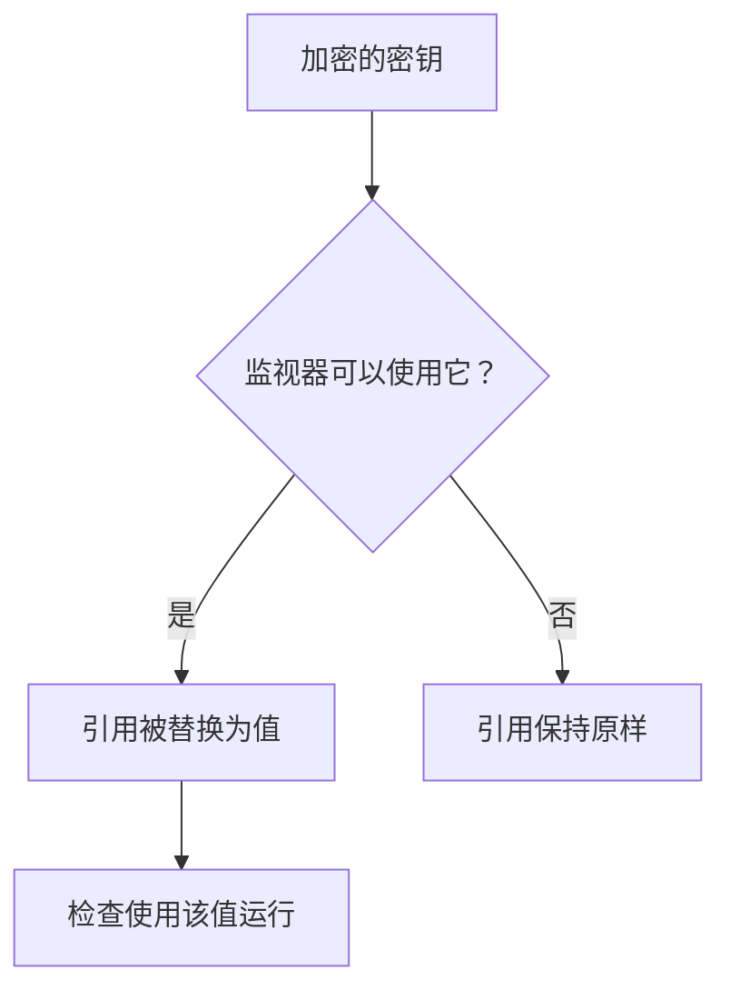

# 监控密钥

监视器密钥让监视器所需的密码、API 密钥和令牌不必写在监视器本身中。您只需加密保存一次值，选择哪些监视器可以使用它，然后在监视器需要的地方以 `{{monitorSecrets.NAME}}` 引用它。

:::cards
- [添加密钥](#添加密钥): 保存一个值，并选择谁可以使用它。
- [选择访问权限](#选择哪些监视器可以使用密钥): 所有监视器、特定监视器或带标签的监视器。
- [使用密钥](#使用密钥): `{{monitorSecrets.NAME}}` 在哪里有效。
:::

## 密钥如何到达监视器

密钥以加密形式存储，保存后不会再显示。在 OneUptime 把监视器交给探测器之前，它会把监视器可以使用的每个引用替换为解密后的值；监视器不能使用的引用则保持原样。

运行检查的探测器会收到该值，因此使用密钥的监视器应在您信任的探测器上运行：OneUptime 自己的探测器，或者您自己运行的 [自定义探测器](/docs/probe/custom-probe)。

## 开始之前

- **Growth 套餐或更高**，适用于 OneUptime Cloud。自托管安装没有套餐。
- **可以管理密钥的角色**：Project Owner、Project Admin，或者拥有 Create Monitor Secret 权限的自定义角色。

## 管理密钥

### 添加密钥

:::steps
1. 前往 **监视器 → 设置 → 密钥**，点击 **创建监视器 秘密**。
2. 输入 **名称** 和 **密钥值**。名称是您引用时使用的，例如 `ApiKey`。它只能包含字母、数字、连字符（`-`）和下划线（`_`），并且同一项目中的两个密钥不能同名。
3. 在 **访问** 步骤中选择哪些监视器可以使用它（参见下一节），然后点击 **创建监视器 秘密**。
:::

> [!IMPORTANT]
> 密钥经过加密并安全存储。密钥值保存后不会再显示——不会出现在表格中、编辑表单中，也不会通过 API 返回。如果您丢失了该值，需要从它的来源重新获取并再次设置。要轮换密钥，请使用其所在行的 **更新密钥值** 按钮；无需删除后重新创建。

### 选择哪些监视器可以使用密钥

每个密钥都有三种访问选项之一：

| 选项 | 哪些监视器可以使用该密钥 | 适用于 |
| --- | --- | --- |
| **所有监视器** | 项目中的每个监视器，包括您以后创建的监视器。 | 许多监视器共用的凭据。 |
| **特定监视器** | 仅限您选择的监视器。这是默认选项，在这些选项出现之前创建的密钥也是这样工作的。 | 用于一个或少数几个监视器的凭据。 |
| **带标签的监视器** | 至少拥有您所选标签之一的监视器。给监视器添加其中一个标签即可让它获得访问权限，移除该标签后，监视器在下次运行时失去访问权限。 | 用于随时间变化的一组监视器的凭据。 |

您可以随时通过密钥所在行的 **编辑** 更改选项。只会保留所选选项对应的列表：切换到 **所有监视器** 会清空密钥的监视器列表和标签列表，在 **特定监视器** 和 **带标签的监视器** 之间切换会清空您切换前的那个列表。

密钥永远不会提供给其他项目中的监视器。

> [!WARNING]
> 任何可以编辑能使用某个密钥的监视器的人，都可以把该密钥发送到监视器连接的任何地方。使用 **所有监视器** 时，这包括项目中所有可以创建或编辑监视器的人。使用 **带标签的监视器** 时，还包括所有可以给监视器添加其中某个标签的人。

通过 API 时，访问选项是 `monitorAccess` 字段：`All Monitors`、`Specific Monitors` 或 `Monitors With Labels`。`monitors` 和 `labels` 字段保存相应的列表。创建时未指定 `monitorAccess` 的密钥会得到 `Specific Monitors`。

### 使用密钥

要使用密钥，请在接受密钥的字段中写入 `{{monitorSecrets.SECRET_NAME}}`。例如，请求标头 `Authorization: Bearer {{monitorSecrets.ApiKey}}` 会发送 `ApiKey` 密钥的值。

以下监视器类型和字段接受密钥：

| 监视器类型 | 字段 |
| --- | --- |
| API | URL、请求标头和正文，以及客户端证书、私钥和密码短语（mTLS） |
| 网站 | URL，以及客户端证书、私钥和密码短语（mTLS） |
| Ping, IP, 端口, NTP, SSL Certificate | 要检查的主机或 URL |
| DNS | 域名和 DNS 服务器 |
| DNSSEC, 域名 | 域名 |
| SQL Query | 主机、数据库名称、用户名、密码和查询 |
| Database Health | 主机、数据库名称、用户名和密码 |
| External Status Page | 状态页 URL |
| Synthetic Monitor, Custom JavaScript Code | 脚本 |
| Network Device | SNMP 团体字符串，以及 SNMPv3 的认证密钥和隐私密钥 |

密钥会在 Synthetic Monitor 或 Custom JavaScript Code 监视器的脚本运行之前填入，因此脚本中诸如 `{{monitorSecrets.ApiKey}}` 的引用在执行时就是解密后的值。

如果监视器引用了它不能使用的密钥，该引用会保持原样，不会被替换为值。

在保存监视器之前对其进行测试时，只会填入对 **所有监视器** 可用的密钥，因为新监视器还不在任何列表中，也还没有标签。保存监视器后，测试会使用该监视器可以使用的每个密钥。

## 故障排查

:::details 监视器按字面发送了 `{{monitorSecrets.NAME}}`
监视器不能使用该密钥，或者名称不匹配。请通过密钥所在行的 **编辑** 检查其访问选项，并确认引用中的名称与密钥名称完全一致。
:::

:::details 测试新监视器时没有填入密钥
监视器保存之前，只会填入对 **所有监视器** 可用的密钥。保存监视器后再测试一次。
:::

:::details 某个字段忽略了密钥
只有上表中的字段接受密钥。在其他任何字段中，`{{monitorSecrets.NAME}}` 会按原样发送。
:::

## 后续步骤

:::cards
- [API 监控](/docs/monitor/api-monitor): 在请求标头中发送密钥。
- [合成监控](/docs/monitor/synthetic-monitor): 在浏览器脚本中使用密钥。
- [SQL 查询监控](/docs/monitor/sql-monitor): 让数据库密码保持加密。
:::
