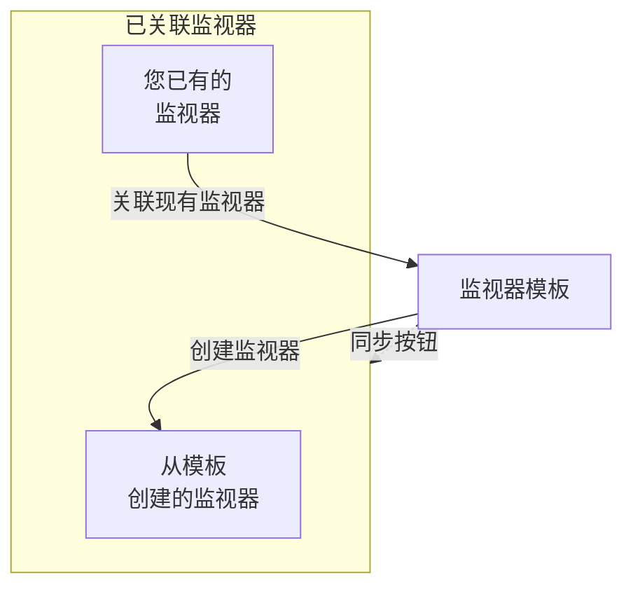

# 监视器模板

监视器模板是一份保存好的监视器配置（类型、条件、间隔、标签和自定义字段默认值），您可以一键从中创建监视器。从模板创建或关联到模板的监视器会保持连接：修改模板，然后把更改同步到所有这些监视器。当许多监视器应以相同方式工作时使用模板，例如每个服务上相同的健康检查，或者生产环境和预发布环境中相同的 API 检查。

:::cards
- [创建模板](#创建模板): 四个步骤，与创建监视器相同。
- [从模板创建监视器](#从模板创建监视器): 一键创建，或关联您已有的监视器。
- [同步更改](#将更改同步到已关联的监视器): 每个同步按钮复制的内容。
- [保留每个监视器自己的值](#保留每个监视器自己的值): 防止目标地址或标头被同步覆盖。
:::

## 模板的工作原理

模板本身不监控任何内容。监视器从模板创建或关联到模板，模板页面会将它们列为 **已关联监视器**。修改模板后，在您同步之前，这些监视器不会发生任何变化：每个同步按钮会把模板的一部分复制到每个已关联的监视器上，而您保护的字段会保留每个监视器自己的值。



## 开始之前

- **可以创建模板的角色**：Project Owner、Project Admin、Project Member、Monitor Admin 或 Monitor Member，或者拥有 Create Monitor Template 权限的自定义角色。修改模板需要相同的角色，或 Edit Monitor Template 权限。
- **更新已关联监视器的权限。** 同步会以您的身份写入每个已关联的监视器，并跳过您的权限未覆盖的监视器。

## 创建模板

:::steps
### 打开模板列表

前往 **监视器 → 设置 → 模板**，点击 **创建监视器 模板**。

### 为模板命名

在 **模板信息** 中输入 **模板名称**（例如 `Production API Health`）和 **模板描述**，然后点击 **下一步**。

### 设置监视器默认值

在 **监视器默认值** 中，用与创建监视器相同的选择器选择 **监视器类型**。可以选择填写 **默认监视器名称**；留空时，每个监视器会以它监控的资源命名。**默认监视器描述** 和 **标签** 位于 **更多字段** 中。点击 **下一步**。

### 设置条件和间隔

在 **标准** 中填写要检查的对象和条件，与 [创建监视器](/docs/monitor/create-monitor#标准) 中相同。顶部的 **Template sync settings** 卡片可以让字段不被同步覆盖（参见 [保留每个监视器自己的值](#保留每个监视器自己的值)）。对于由探测器检查的监视器类型，最后一步 **间隔** 会询问 **监控间隔**。在最后一步点击 **创建监视器 模板**。
:::

模板会添加到列表中。打开它即可看到它的页面，每个部分都有一张卡片：**模板信息**、**监视器默认值**、**监控条件**、**监控间隔**（含 **最小探测器一致数**）、**标签**、**Custom Field Defaults**（当项目有监视器自定义字段时）和 **已关联监视器**。每个部分都在自己的卡片上修改，例如使用 **编辑标准** 或 **编辑间隔**。

## 从模板创建监视器

- **新监视器。** 在列表中模板所在的行点击 **创建监视器**，或在模板页面上点击 **从模板创建监视器**。**创建监视器** 打开时已填好模板的类型和设置；修改需要的内容，然后创建。新监视器会关联到该模板。
- **您已有的监视器。** 在 **已关联监视器** 中点击 **关联现有监视器** 并选择它们。在您同步之前，它们会保留自己的设置。

在 **Custom Field Defaults** 中设置的自定义字段值会写入从该模板创建的每个监视器，包括自动导入规则和警报策略从中创建的监视器。

## 将更改同步到已关联的监视器

编辑模板只会更改模板本身。要把更改复制到已关联的监视器上，请使用您所修改卡片上的同步按钮。每个按钮都会写明它影响的监视器数量，例如 **Sync Criteria to 3 Linked Monitors**；没有任何关联时按钮显示为灰色。同步无法撤销。

| 按钮 | 复制到每个已关联监视器的内容 | 保持不变的内容 |
| --- | --- | --- |
| **将标准同步到已关联的监控** | 条件以及步骤设置（例如目标地址和请求选项），受保护的字段除外 | 监控间隔、最小探测器一致数、名称、描述、标签和自定义字段值 |
| **将间隔同步到已关联的监控** | 监控间隔和最小探测器一致数 | 条件、名称、描述、标签和自定义字段值 |
| **将标签同步到已关联的监控** | 仅标签 | 其他所有内容 |
| **Sync Custom Fields to Linked Monitors** | 模板设置了默认值的自定义字段，替换每个监视器原有的值 | 模板留空的自定义字段，以及其他所有内容 |

要同步单个监视器，请在 **已关联监视器** 中该监视器所在的行点击 **从模板同步**。这会复制条件和步骤设置（受保护的字段除外）、监控间隔、最小探测器一致数和标签，而监视器的名称、描述和自定义字段值保持不变。**从模板取消关联** 会断开监视器与模板的连接；监视器保留自己的设置。

同步后，摘要会显示更新了多少个监视器。**部分同步** 表示一些已关联的监视器仍是之前的配置，通常是因为您的权限未覆盖它们。

## 保留每个监视器自己的值

除非您保护这些字段，否则条件同步还会复制步骤设置，例如目标地址、请求标头和超时。保护某个字段，即可让每个已关联的监视器保留该字段自己的值。

:::steps
### 打开该模板

前往 **监视器 → 设置 → 模板** 并打开该模板。

### 编辑它的条件

在 **监控条件** 卡片上点击 **编辑标准**。

### 保护字段

在 **Template sync settings** 中，勾选要在已关联监视器上保留的每个字段旁边的 **Do not sync this field**。

### 保存

保存更改。**监控条件** 卡片以及每次同步的确认框都会列出受保护的字段。

### 同步

使用 **将标准同步到已关联的监控**，或在单个已关联的监视器上使用 **从模板同步**。
:::

例如，在 API 模板上保护 **Monitor destination** 和 **Request headers**。生产环境和预发布环境的监视器会保留各自的 URL 和标头，同时都会收到模板更新后的条件和其他未受保护的设置。

可用的选项取决于监视器类型，包括目标地址和端口、HTTP 请求选项、数据库连接、DNS 设置、基础设施选择器和遥测查询。相关的凭据（例如客户端证书及其私钥）会一起保留。

### 排除项的行为

- 勾选的字段会保留每个现有监视器的当前值，包括空值或未设置的值。请求标头和其他集合会完整保留。
- 未勾选的字段会继续从模板同步。取消勾选受保护的字段并保存，下次同步时就会复制模板中的值。
- 排除项同时适用于批量同步和单个同步。它们保存在模板上，而不是在每次同步时单独选择。
- 新监视器仍以模板中的字段值开始。排除项只影响向现有监视器的同步。
- 条件总是会同步。仅同步条件时，监控间隔、标签和其他监视器级别的设置保持不变。
- 现有模板在您配置之前没有字段排除项。Network Device 监视器会继续自动保留它们自己的设备绑定。

对于有多个步骤的模板，受保护的值按步骤 ID 匹配。单独创建的单步骤监视器也可以接收单步骤模板。如果某个受保护的步骤无法匹配，同步会在任何监视器更新之前被拒绝，因此新增或重新排序的步骤不会意外复制另一个步骤的目标地址或凭据。

> [!IMPORTANT]
> 在更改已保存模板的监视器类型（使用 **编辑监视器默认值**）之前，请先在 **编辑标准** 中清除不适用于新类型的排除项。模板的所有排除项都必须存在于它的监视器类型中。

## 通过 API 配置

每个模板步骤都在其 `MonitorStep.value` 对象中接受一个 `doNotSyncFields` 数组。对于 API 监视器，可以这样保护它的目标地址和整个标头集合：

```json title="monitorSteps (excerpt)"
{
  "_type": "MonitorSteps",
  "value": {
    "monitorStepsInstanceArray": [
      {
        "_type": "MonitorStep",
        "value": {
          "id": "<step id>",
          "doNotSyncFields": ["monitorDestination", "requestHeaders"]
        }
      }
    ]
  }
}
```

省略该数组或将其设为 `[]`，即可同步所有受支持的步骤设置。不受支持的字段名称，以及不适用于模板监视器类型的字段，都会被拒绝。同步由模板的数组控制；已关联监视器上的任何此类元数据都不会覆盖它。

:::details 按监视器类型列出的 doNotSyncFields 字段名称
| 监视器类型 | 字段名称 |
| --- | --- |
| 网站、API、Ping、IP、端口、SSL Certificate、NTP | `monitorDestination`, `requestTimeoutInMs`, `retryCount` |
| 仅 API | `requestHeaders`, `requestType`, `requestBody` |
| 网站和 API | `doNotFollowRedirects`, `allowSelfSignedCertificates`, `tlsClientAuthentication`（客户端证书、密钥和密码一起） |
| 端口、NTP | `monitorDestinationPort` |
| Synthetic Monitor、Custom JavaScript Code | `customCode` |
| Synthetic Monitor | `browserTypes`, `screenSizeTypes`, `retryCountOnError` |
| DNS | `dnsMonitor.queryName`, `dnsMonitor.recordType`, `dnsMonitor.resolver`（DNS 服务器和端口一起）, `dnsMonitor.timeout`, `dnsMonitor.retries` |
| 域名 | `domainMonitor.domainName`, `domainMonitor.lookupMethod`, `domainMonitor.timeout`, `domainMonitor.retries` |
| DNSSEC | `dnssecMonitor.domainName`, `dnssecMonitor.resolvers`, `dnssecMonitor.checkNameserverConsistency`, `dnssecMonitor.signatureExpiryWarningDays`, `dnssecMonitor.timeout`, `dnssecMonitor.retries` |
| SQL Query | `sqlMonitor.connection`, `sqlMonitor.connectionTimeoutInMs`, `sqlMonitor.statementTimeoutInMs`, `sqlMonitor.query`, `sqlMonitor.maxRows` |
| Database Health | `databaseMonitor.connection`, `databaseMonitor.connectionTimeoutInMs`, `databaseMonitor.statementTimeoutInMs`, `databaseMonitor.enabledMetricGroups` |
| External Status Page | `externalStatusPageMonitor.statusPageUrl`, `externalStatusPageMonitor.provider`, `externalStatusPageMonitor.components`, `externalStatusPageMonitor.timeout`, `externalStatusPageMonitor.retries` |
| 日志、Security Events、追踪、AI / LLM、指标、异常 | `logMonitor`, `securityEventsMonitor`, `traceMonitor`, `llmMonitor`, `metricMonitor`, `exceptionMonitor`（监视器的整个配置） |

基础设施监视器（Kubernetes、Docker、主机、Podman、Proxmox、Docker Swarm、Ceph、存储阵列、IoT Device）可以保护它们的资源选择器、筛选条件、指标查询和查询时间窗口。这些名称列在该类型模板的 **Template sync settings** 中。
:::

## 故障排查

:::details 同步显示“部分同步”
一些已关联的监视器没有更新，通常是因为您的权限未覆盖它们。请让能够更新所有已关联监视器的人重新运行同步。
:::

:::details 同步失败并显示 "a template step cannot be matched to an existing monitor step"
某个受保护的字段无法匹配到其中一个监视器上的步骤，因此同步在更改任何监视器之前就停止了。为模板的步骤设置与监视器步骤相同的 ID，或者对单步骤监视器使用单步骤模板。
:::

:::details 同步按钮显示为灰色
还没有任何监视器关联到该模板。从模板创建一个监视器，或在 **已关联监视器** 中点击 **关联现有监视器**。
:::

:::details 保存失败并显示 "Unsupported do not sync field"
`doNotSyncFields` 中的某个名称不是该模板监视器类型的字段。请对照上面的字段名称检查它。
:::

## 后续步骤

:::cards
- [创建监视器](/docs/monitor/create-monitor): 模板所填写的表单。
- [API 监控](/docs/monitor/api-monitor): API 模板所携带的设置。
- [监控密钥](/docs/monitor/monitor-secrets): 在多个监视器之间共享凭据而无需复制。
- [Terraform 监控步骤](/docs/terraform/monitor-steps): 以代码管理监视器及其步骤。
:::
