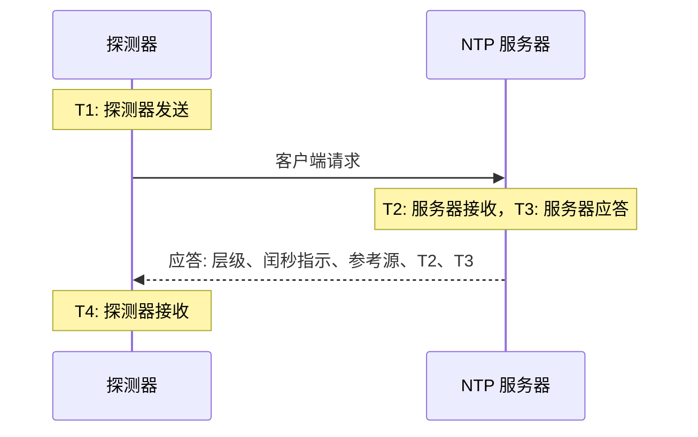

# NTP 监控

NTP 监视器检查时间服务器是否在 UDP 端口 123 上应答并提供准确的时间：它是否已同步、层级是否合理，以及它的时钟是否与探测器的时钟一致。可用于您自己运行的时间服务器，例如数据中心里的 GPS 时钟或您的机器所同步的内部服务器，也可用于您所依赖的公共服务器。

:::cards
- [创建监视器](#创建-ntp-监视器): 在控制台中完成六个步骤。
- [检查读取的内容](#检查读取的内容): 层级、时钟偏差、闰秒指示以及应答中的其他内容。
- [监控标准](#监控标准): 可达性、同步状态、层级和偏差。
- [故障排查](#故障排查): 服务器正常运行，但监视器显示的结果不同时。
:::

## 工作原理

每次检查时，探测器从一个随机的本地端口向服务器的 UDP 端口发送一个 SNTP 客户端请求（NTP 版本 4，客户端模式），并等待应答。只有对该请求的真实应答才算数：探测器在请求的发送时间戳中放入 64 个随机位，并忽略任何没有原样返回这些位、比 NTP 数据包短或不是服务器模式的数据包。对之前某次检查的过期应答或伪造的应答，永远不会让一台已宕机的服务器看起来仍然存活。

根据这四个时间戳，探测器计算出 **时钟偏差**，即 ((T2 − T1) + (T3 − T4)) / 2：服务器的时钟与探测器的时钟相差多少。偏差为正表示服务器的时钟偏快。该公式假设请求和应答所用的时间相同，因此如果路径在一个方向上慢得多，偏差最多可能偏离往返时间的一半。

> [!NOTE]
> 偏差是相对于探测器自身的时钟测量的。OneUptime Cloud 的探测器会保持时钟同步。在 [自定义探测器](/docs/probe/custom-probe) 上，也请使用 chrony 或 systemd-timesyncd 保持主机时钟同步，否则偏差告警反映的可能是探测器而不是服务器的问题。

已应答的服务器不会被再次询问，即使它的应答中没有准确的时间。无应答、端口被拒绝和 DNS 查询失败都会用新的请求重试。当服务器完全没有应答时，探测器还会跟踪到它的路由，并将结果附加为 **Network Path at Time of Failure**。失去自身网络连接的探测器不会报告任何结果，因此它无法将您的服务器标记为离线。

## 开始之前

- **可以创建监视器的角色**：Project Owner、Project Admin、Project Member、Monitor Admin 或 Monitor Member，或者拥有 Create Monitor 权限的自定义角色。
- **能够访问服务器 UDP 端口 123 的探测器。** 任何探测器都可以检查公共时间服务器。对于私有网络中的服务器，请在该网络内使用 [自定义探测器](/docs/probe/custom-probe)。服务器前面的防火墙必须放行来自 [OneUptime Cloud 探测器 IP 地址](/docs/configuration/ip-addresses) 或您的自定义探测器的 UDP 流量，而不仅仅是 TCP。

## 创建 NTP 监视器

:::steps
### 开始创建新监视器

前往 **监视器** 并点击 **创建监视器**。在 **监视器类型** 下，在搜索框中输入 `ntp` 并选择 **NTP**。它也列在 **更多监视器类型** 的网络分组中。

### 命名

输入 **名称**，例如 `GPS 时间服务器`，然后点击 **下一步**。

### 输入服务器

在 **NTP 服务器** 中输入服务器的主机名或 IP 地址，例如 `time.example.com` 或 `192.168.1.10`。请求会发送到端口 123。要使用其他端口，请展开 **更多字段** 并设置 **端口**。

### 测试

点击 **测试监视器**，在 **选择探测器** 中选择一个探测器，然后点击 **运行测试**。**监视器测试结果** 会显示服务器是否应答、是否已同步、它的层级以及它的时钟偏差有多大。

### 检查条件

**监视器条件** 从 [默认标准](#默认标准) 开始：服务器不提供准确时间时为离线，提供时为在线。如有需要可修改，然后点击 **下一步**。

### 选择探测器并创建

保留或修改 **探测器** 和 **监控间隔**（初始为 **每 5 分钟**），然后点击 **创建监视器**。监视器页面随即打开。
:::

## 配置选项

| 字段 | 默认值 | 填写内容 |
| --- | --- | --- |
| **NTP 服务器** | 无 | 服务器，例如 `time.example.com`、`192.168.1.10` 或 `2001:db8::123`。只填写主机，不要带 `udp://`。写在主机后面的端口（例如 `time.example.com:1123`）会代替 **端口** 使用。 |
| **端口**（在 **更多字段** 中） | `123` | 服务器应答 NTP 的 UDP 端口，范围为 `1` 到 `65535`。留空则为 `123`。 |
| **请求超时（秒）**（在 **更多字段** 中） | `5` | 一次尝试等待应答的时间，包括 DNS 查询。最长为 60 秒。 |
| **失败时重试**（在 **更多字段** 中） | 探测器默认值，通常为 `3` | 对没有得到应答的尝试重试的次数。最多为 3。 |

**失败时重试** 统计的是第一次尝试 _之后_ 的重试次数，因此 `0` 只运行一次检查，`2` 最多运行三次，每次尝试之间暂停一秒。留空时使用探测器的默认值：3，除非探测器的 `PROBE_MONITOR_RETRY_LIMIT` 另有设置。

## 检查读取的内容

监视器页面显示每个探测器的最新一次检查：

| 字段 | 含义 |
| --- | --- |
| **已同步** | 服务器是否以层级 1 到 15 应答，闰秒指示中没有告警，并且应答中带有真实的时间戳。 |
| **时钟偏差** | 服务器的时钟与探测器的时钟相差多少，以及偏向哪个方向。健康的服务器在几毫秒以内。 |
| **层级** | 服务器距离参考时钟有多少跳：拥有自己的 GPS 或原子钟源的服务器为 1，与层级 1 服务器同步的服务器为 2，依此类推。16 表示未同步。 |
| **参考源** | 服务器同步的对象：层级 1 时是 `GPS`、`PPS` 或 `NIST` 这样的源名称，从层级 2 开始是上游服务器的地址。 |
| **闰秒指示** | 没有待处理的闰秒时为 0，当天结束时将增加或减少一个闰秒时为 1 或 2，服务器表示其时钟未同步时为 3。 |
| **根离散度** | 服务器自己估计的其时间可能偏离真实时间的程度。服务器无法连接到它的源时，这个值会不断增大。当根延迟的一半加上这个值超过 1.5 秒时，ntpd 就不再信任该服务器。 |
| **根延迟** | 从服务器到其参考时钟的往返时间。 |
| **响应时间** | 从探测器发送请求到收到应答的时间，不含 DNS 查询。 |
| **服务器时间** | 服务器发送应答时的时钟。 |

拒绝提供时间的服务器会改为发送 **kiss-o'-death**：一个层级为 0、带有四个字母代码的应答。最常见的代码有 `RATE`（服务器限制探测器的频率）、`DENY` 和 `RSTR`（服务器的访问规则拒绝探测器）以及 `INIT`（服务器尚未同步）。检查会显示该代码，并将服务器视为已应答但未同步。

## 监控标准

标准决定服务器何时算作在线、降级或离线，以及是否因此宣布事件或创建告警。每个标准检查一个或多个筛选器：

| 筛选器 | 条件 | 检查内容 |
| --- | --- | --- |
| **NTP Is Online** | **是**、**否** | 服务器是否用 NTP 应答回复了探测器的请求。kiss-o'-death 也算应答。 |
| **NTP Is Synchronized** | **是**、**否** | 已应答的服务器是否提供已同步的时间。服务器没有应答时不检查此筛选器；这种情况请使用 **NTP Is Online**。 |
| **NTP Stratum** | **Greater Than**、**Greater Than Or Equal To**、**Less Than**、**Less Than Or Equal To**、**Equal To**、**Not Equal To** | 服务器的层级。kiss-o'-death 的 0 按 16（未同步）计算。 |
| **NTP Clock Offset (in ms)** | **Greater Than**、**Less Than**、**Greater Than Or Equal To**、**Less Than Or Equal To** | 服务器的时钟与探测器的时钟相差多少，不分方向。 |
| **NTP Response Time (in ms)** | **Greater Than**、**Less Than**、**Greater Than Or Equal To**、**Less Than Or Equal To** | 从请求到应答的时间。 |
| **NTP Root Dispersion (in ms)** | **Greater Than**、**Less Than**、**Greater Than Or Equal To**、**Less Than Or Equal To** | 服务器自己估计的最大误差。 |

有两个或更多筛选器时，**匹配条件** 决定必须 **全部** 匹配，还是 **任意** 一个匹配即可。标准的 **操作** 决定它做什么：更改监视器状态、创建告警、宣布事件，或这些的任意组合。

### 默认标准

新的 NTP 监视器从两个标准开始：

- **离线** — 服务器没有应答、未同步，或者它的时钟与探测器的时钟相差 `1000` ms 或更多。监视器被标记为 **离线**，并创建一个名为"_监视器名称_ is not serving good time"的事件。当服务器重新提供准确时间时，事件会自动解决。
- **在线** — 服务器有应答、已同步，并且它的时钟与探测器的时钟相差不到 `1000` ms。监视器被标记为 **运行正常**。

标准从上到下检查，第一个匹配的标准决定结果。以错误时间应答的服务器会被有意视为宕机：每个跟随它的客户端也会采用这个时间。

### 在一段时间内评估

**在一段时间内评估此条件** 是每个 NTP 筛选器下方的复选框。开启后，会根据过去一段时间内的检查而不是最新一次检查来判断：在 **评估** 中选择聚合方式，在 **在过去（分钟）** 中选择 2 到 60 分钟的时间窗口。只有服务器应答的检查才有层级、偏差和根离散度，因此一段完全无应答的时间窗口对这些筛选器没有数据，此时由 **如果无数据** 决定结果。

### 标准示例

| 目标 | 筛选器 | 条件 | 值 |
| --- | --- | --- | --- |
| GPS 服务器退回到网络源时告警 | **NTP Stratum** | **Greater Than** | `1` |
| 时钟漂移时告警 | **NTP Clock Offset (in ms)** | **Greater Than** | `100` |
| 服务器的误差上限变大时告警 | **NTP Root Dispersion (in ms)** | **Greater Than** | `500` |
| 应答变慢时告警 | **NTP Response Time (in ms)** | **Greater Than** | `1000` |

## 故障排查

:::details 服务器正常运行，但监视器显示它没有应答
请求或应答在途中被丢弃了。允许 TCP 但不允许 UDP 的防火墙、没有包含探测器地址的 ntpd `restrict` 或 chrony `allow` 规则，或者只在内部接口上监听的服务器，都会出现这种情况。**Network Path at Time of Failure** 会显示路由到达了哪里。请放行探测器，或者从网络内的 [自定义探测器](/docs/probe/custom-probe) 检查该服务器。
:::

:::details 监视器显示服务器拒绝了请求
主机回复说该 UDP 端口上没有任何服务在监听（ICMP port unreachable）：NTP 服务已停止，或者在另一个端口上监听。请启动该服务，或者把 **端口** 设置为它实际使用的端口。
:::

:::details 服务器以 kiss-o'-death 应答
`RATE` 表示服务器在限制探测器的频率。探测器每次检查只询问一次，因此延长 **监控间隔**，或在服务器的限制中豁免探测器的地址，即可解决。`DENY` 和 `RSTR` 表示服务器的访问规则拒绝了探测器。`INIT` 和 `STEP` 表示服务器尚未同步，这在服务器启动后的几分钟内是正常的。
:::

:::details 同一个探测器上的所有 NTP 监视器都显示相近的偏差
偏差来自探测器的时钟，而不是服务器的时钟。请检查探测器的主机是否保持时钟同步，或者在其他探测器上运行这些监视器。
:::

:::details 偏差在每次检查之间跳动
探测器离服务器较远，或者路径在一个方向上比另一个方向慢。请使用离服务器更近的探测器，或者使用 **在一段时间内评估此条件** 和 **平均值** 根据几分钟内的偏差来判断。
:::

## 后续步骤

:::cards
- [Ping 监控](/docs/monitor/ping-monitor): 检查主机本身是否可达。
- [端口监控](/docs/monitor/port-monitor): 检查同一主机上的 TCP 服务。
- [自定义探针](/docs/probe/custom-probe): 检查您自己网络中的时间服务器。
- [事件与告警模板](/docs/monitor/incident-alert-templating): 将层级和偏差放进事件标题。
:::
