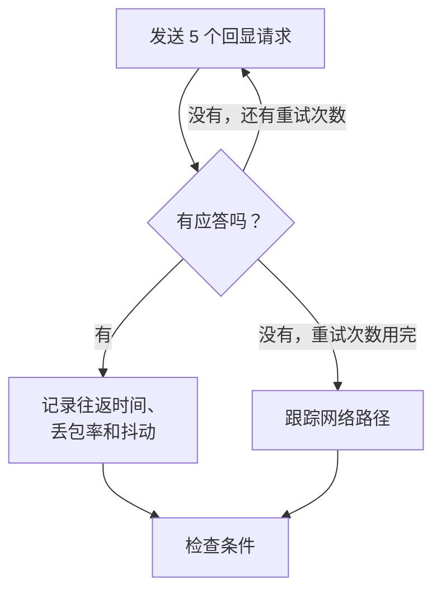

# Ping 监控

Ping 监视器检查主机是否应答 ping（ICMP 回显请求），并测量往返时间、丢包率和抖动。可用于服务器、路由器、防火墙，以及其他可以通过主机名或 IP 地址访问的设备。

:::cards
- [创建监视器](#创建-ping-监视器): 在控制台中完成六个步骤。
- [配置选项](#配置选项): 主机、超时和重试。
- [监控标准](#监控标准): 可达性、延迟、丢包率和抖动。
- [故障排查](#故障排查): 主机正常运行，但监视器显示离线时。
:::

## 工作原理

每次检查时，探测器向主机发送五个回显请求。只要至少有一个应答返回，主机就是在线的，探测器会把平均往返时间记录为响应时间，同时记录丢包率、抖动以及最快和最慢的应答。如果没有任何应答返回，探测器会重试，最多重试您允许的次数。然后 OneUptime 用监视器的条件评估结果。

检查失败时，探测器还会跟踪到主机的路由并查找它的名称，然后把发现的内容作为 **Network Path at Time of Failure** 附加到结果中，让您看到路由在哪里中断。

> [!NOTE]
> 有些托管服务商会在探测器所运行的机器上阻止 ICMP。完全无法发送 ping 的探测器会改为检查主机的 TCP 端口 `80`，因此监视器仍能说明主机是否可达。这时不会测量丢包率和抖动。

失去自身网络连接的探测器不会报告任何结果，因此它无法将您的主机标记为离线。

## 开始之前

- **可以创建监视器的角色**：Project Owner、Project Admin、Project Member、Monitor Admin 或 Monitor Member，或者拥有 Create Monitor 权限的自定义角色。
- **能够访问该主机的探测器**，并且沿途允许 ICMP。每个新监视器都会选中您项目的默认探测器。如果主机前面有防火墙，请放行来自 [OneUptime Cloud 探测器 IP 地址](/docs/configuration/ip-addresses) 的 ICMP 回显请求。私有网络中的主机需要在该网络内运行的 [自定义探测器](/docs/probe/custom-probe)。

## 创建 Ping 监视器

:::steps
### 开始创建新监视器

前往 **监视器**，点击 **创建监视器**。在 **监视器类型** 下选择 **Ping**。

### 命名

输入 **名称**，例如 `Core router`，然后点击 **下一步**。

### 输入主机

在 **主机名或 IP 地址** 中输入要 ping 的主机名或 IPv4、IPv6 地址，例如 `example.com` 或 `192.168.1.1`。只输入主机，不要带 `http://` 或端口。

### 测试

点击 **测试监视器**，在 **选择探测器** 中选择一个探测器，然后点击 **运行测试**。**监视器测试结果** 会显示探测器看到的往返时间和丢包率。

### 检查条件

**监视器条件** 从 [默认标准](#默认标准) 开始：主机没有应答时为离线，有应答时为在线。如有需要可修改，然后点击 **下一步**。

### 选择探测器并创建

保留或修改 **探测器** 和 **监控间隔**（初始为 **每 5 分钟**），然后点击 **创建监视器**。监视器页面随即打开。
:::

## 配置选项

| 字段 | 默认值 | 填写内容 |
| --- | --- | --- |
| **主机名或 IP 地址** | 无 | 要 ping 的主机，例如 `example.com`、`192.168.1.1` 或 `2001:db8::1`。主机名在每次检查时都会解析，因此监视器会跟随 DNS 的变化。 |
| **请求超时（秒）**（在 **更多字段** 中） | `60` | 每次尝试等待应答的时间。最长为 60 秒。 |
| **失败时重试**（在 **更多字段** 中） | 探测器默认值，通常为 `3` | 失败的尝试要重试多少次。最多为 3。 |

**失败时重试** 统计的是第一次尝试 _之后_ 的重试次数，因此 `0` 只运行一次检查，`2` 最多运行三次。留空时使用探测器的默认值：3，除非探测器的 `PROBE_MONITOR_RETRY_LIMIT` 另有设置。包括超时在内的每次失败都会重试，两次尝试之间暂停一秒。应答耗时超过 10 秒的成功检查也会再检查一次。

如果要监视固定的 IP 地址而从不使用主机名，可以改用 [IP 监控](/docs/monitor/ip-monitor)。它运行相同的检查。

## 监控标准

条件决定主机何时算作在线、性能下降或离线，以及是否因此声明事件或创建警报。每个条件检查一个或多个筛选器：

| 筛选器 | 条件 | 检查内容 |
| --- | --- | --- |
| **Is Online** | **是**、**否** | 是否至少有一个回显请求得到了应答。 |
| **响应时间（毫秒）** | **Greater Than**、**Less Than**、**Greater Than Or Equal To**、**Less Than Or Equal To** | 应答的平均往返时间。 |
| **Packet Loss (in %)** | **Greater Than**、**Less Than**、**Greater Than Or Equal To**、**Less Than Or Equal To** | 五个回显请求中没有得到应答的比例。 |
| **Jitter (in ms)** | **Greater Than**、**Less Than**、**Greater Than Or Equal To**、**Less Than Or Equal To** | 一次检查中所发数据包往返时间的标准差。 |
| **Is Request Timeout** | **是**、**否** | ping 是否在每次尝试中都超时。 |

有两个或更多筛选器时，**匹配条件** 决定是 **全部** 筛选器都必须匹配，还是 **任意** 一个匹配即可。条件的 **操作** 决定它做什么：更改监视器状态、创建警报、声明事件，或其中任意几项。

### 默认标准

新的 Ping 监视器以两个条件开始：

- **离线** — 在所有重试之后，主机仍没有应答任何回显请求，或者完全无法访问。监视器被标记为 **离线**，并创建名为 “_monitor name_ is offline” 的事件。主机再次应答后，事件会自行解决。
- **在线** — 主机有应答。监视器被标记为 **运行正常**。

条件从上到下检查，第一个匹配的条件决定接下来发生什么。没有条件匹配时，监视器显示它的默认状态：**运行正常**，除非您在条件下方的 **更多字段** 中选择了其他状态。

### 在一段时间内评估

**在一段时间内评估此条件** 是筛选器下方的复选框，适用于 **Is Online**、**响应时间（毫秒）**、**Packet Loss (in %)** 和 **Jitter (in ms)**。打开它即可判断过去一段时间内的检查，而不只是最近一次：在 **评估** 中选择聚合方式，在 **在过去（分钟）** 中选择 2 到 60 分钟的时间窗口。

| 聚合 | 匹配条件 |
| --- | --- |
| **平均值**、**总和**、**Maximum Value**、**Minimum Value** | 该数值在整个窗口内满足条件。仅限数值筛选器。 |
| **All Values** | 窗口内的每次检查都满足条件。 |
| **Any Value** | 窗口内至少有一次检查满足条件。 |

**All Values** 只有在窗口真正被数据覆盖后才会匹配。刚创建的监视器，或者检查已不再被记录的监视器，没有足够的历史来说明过去 N 分钟的情况，因此条件会等待，而不是根据手头仅有的一个读数匹配。**Any Value** 用于“只要有一次检查超出阈值就立即告诉我”，并且仍会立即触发。

**如果无数据** 决定在窗口无法支撑条件时发生什么：

| 选项 | 会发生什么 | 适用于 |
| --- | --- | --- |
| **Ignore**（默认） | 条件不匹配。 | 普通的阈值告警。 |
| **触发器** | 缺失的数据本身被视为问题。 | 沉默本身就是故障的检查。 |
| **Treat As Zero** | 将窗口按单个零值比较。 | 没有事件确实意味着零的计数器。 |

### 示例条件

| 目标 | 筛选器 | 条件 | 值 |
| --- | --- | --- | --- |
| 主机不可达时为离线 | **Is Online** | **否** | — |
| 延迟高时告警 | **响应时间（毫秒）** | **Greater Than** | `200` |
| 链路丢包严重时将主机标记为性能下降 | **Packet Loss (in %)** | **Greater Than** | `20` |
| 连接不稳定时告警 | **Jitter (in ms)** | **Greater Than** | `30` |

要只在延迟持续偏高时告警，请为响应时间筛选器打开 **在一段时间内评估此条件**，并选择 **5** 分钟内的 **All Values**。

## 故障排查

:::details 主机正常运行，但监视器显示离线
主机或它前面的防火墙没有应答来自探测器的 ICMP 回显请求。许多服务器和云网络默认会丢弃 ping。请放行来自探测器的 ICMP 回显请求，或者改用 [端口监控](/docs/monitor/port-monitor) 监视主机上的服务。失败检查上的 **Network Path at Time of Failure** 会显示路由到达了哪里。
:::

:::details 检查失败，并对该主机显示 "This probe could not resolve"
探测器的 DNS 服务器不认识该主机名。请检查名称，或者改为输入 IP 地址。只在您的网络内部才能解析的名称，需要在那里运行的 [自定义探测器](/docs/probe/custom-probe)。
:::

:::details 丢包率和抖动为空
运行检查的探测器无法发送 ping，因此改为检查 TCP 端口 `80`，这种方式两者都不测量。请在允许发送 ICMP 的探测器上运行监视器。
:::

## 后续步骤

:::cards
- [IP 监控](/docs/monitor/ip-monitor): 监视固定的 IPv4 或 IPv6 地址。
- [端口监控](/docs/monitor/port-monitor): 检查主机上的服务，而不只是主机本身。
- [自定义探针](/docs/probe/custom-probe): ping 您自己网络中的主机。
- [事件](/docs/incidents/index): 监视器声明事件之后会发生什么。
:::
