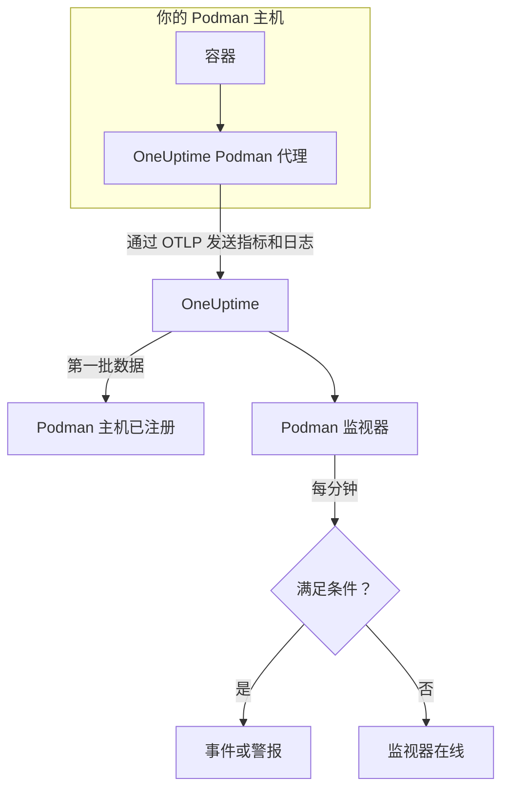

# Podman 监控

Podman 监视器监控一台 Podman 主机上的容器，在容器负载过高、内存耗尽或反复重启时通知你。它读取 OneUptime Podman 代理从主机发送的指标，因此不会从外部探测任何东西：安装代理，然后根据模板或你自己的查询创建监视器。

:::cards
- [创建监视器](#创建-podman-监视器): 在仪表板中完成六个步骤。
- [模板](#现成的警报模板): 五个现成的警报，每个容器一个事件。
- [指标](#收集的指标): 代理收集的内容，以及每个指标的含义。
- [日志](#收集的日志): 容器日志，以及它们所需的日志驱动。
:::

## 工作原理

OneUptime Podman 代理以容器形式在主机上运行。它每 30 秒通过 Podman 兼容 Docker 的 API 套接字读取容器统计信息，跟踪容器的日志文件，并通过 OTLP 把两者都发送到 OneUptime。来自某台主机的第一批数据会把它注册到 OneUptime 中。

Podman 监视器绑定到一台主机。它每分钟对这台主机的容器指标运行查询，并把结果与条件进行比较。



## 开始之前

- **安装 Podman 代理**，装在主机上。[Podman 代理指南](/docs/telemetry/podman-host) 介绍了安装、升级和检查方法。代理需要位于 `/run/podman/podman.sock` 的 Podman API 套接字。
- **确认主机已注册。** 第一批数据到达后，它会以代理的 `PODMAN_HOST_NAME` 命名，出现在 **产品 → 基础设施 → Podman → 所有主机** 下。
- **如需容器日志**，请使用 `k8s-file` 日志驱动运行容器。参见 [日志驱动要求](#日志驱动要求)。

## 创建 Podman 监视器

:::steps
### 开始新的监视器

进入 **监视器** 并点击 **创建监视器**。

### 选择 Podman Container

在 **监视器类型** 下点击 **更多监视器类型**，然后在 **基础设施** 下选择 **Podman Container**，或在搜索框中输入 `podman`。输入 **名称**（它会用在事件和警报标题中），然后点击 **下一步**。

### 选择主机

在 **Podman Monitor Configuration** 下，从 **Podman Host** 中选择主机。发送过数据的每台主机都在列表中。

### 选择要监控的内容

选择三个选项卡之一：

- **Quick Setup** – 点击一个 [模板](#现成的警报模板)。它会设置指标、聚合、时间范围和阈值，并用自己的条件替换下面的条件。你仍然可以更改 **时间范围**。
- **Custom Metric** – 从 **Podman Metric** 中选择一个指标，然后设置 **聚合** 和 **时间范围**。**容器名称** 和 **容器镜像** 可以把范围缩小到部分容器。
- **高级** – 在 **选择指标** 下自己构建查询和公式。使用 **Group by** `resource.container.name` 可以单独评判每个容器。

### 检查条件

打开 **监视器条件** 下的每个条件，检查其 **指标**、**聚合**、**条件** 和 **Threshold**。模板会填好这些内容。使用 **Custom Metric** 或 **高级** 时，监视器从 [默认条件](#默认条件) 开始，这些条件只会注意到指标降到零，所以请设置你自己的阈值。

### 创建监视器

点击 **创建监视器**。OneUptime 会打开监视器的页面，并每分钟评估一次。它打开的事件和警报也会列在主机的 **事件** 和 **警报** 页面上。
:::

> [!TIP]
> 要一次设置多个模板，请从 **产品 → 基础设施 → Podman** 打开主机，然后进入 **Recommendations**。选择你需要的模板和要呼叫的人，OneUptime 会为每个模板创建一个监视器。

## 监视器设置

| 字段 | 选项卡 | 作用 |
| --- | --- | --- |
| **Podman Host** | 全部 | 必填。把每个查询限定在该主机的 `resource.host.name`。OneUptime 还会给每个查询加上 `resource.container.runtime = podman`。 |
| **Podman Metric** | Custom Metric | 代理目录中的一个指标，按 CPU、内存、网络、块 I/O 和容器分组。 |
| **容器名称** | Custom Metric、高级 | 可选。与 `resource.container.name` 完全匹配，例如 `my-container`。 |
| **容器镜像** | Custom Metric、高级 | 可选。与 `resource.container.image.name` 完全匹配，例如 `nginx:latest`。 |
| **聚合** | Custom Metric | 样本的合并方式：**平均值**、**最大值**、**最小值**、**总和** 或 **计数**。初始值为该指标通常的聚合方式。 |
| **时间范围** | 全部 | 查询读取的滚动窗口，从 **Past 1 Minute** 到 **Past 365 Days**。新监视器从 **Past 1 Minute** 开始；模板会设置自己的值。 |
| **选择指标** | 高级 | 查询构建器：**指标**、**Aggregate by**、**Filter by attributes**、**Group by**，以及用于组合查询的 **添加指标** 和 **添加公式**。 |

## 现成的警报模板

**Quick Setup** 提供五个模板。每个模板都会构建一个完整的监视器：一个按 `resource.container.name` 分组的查询、一个触发的条件和一个恢复的条件。每个容器都单独评判，并有自己的事件和警报。阈值只是起点，你可以编辑。

条件只有在其窗口的每一分钟都成立时才会触发，并在越过阈值 10% 处恢复，这样在边界附近徘徊的值不会来回跳动。

| 模板 | 严重程度 | 监控内容 | 触发时机 | 恢复时机 |
| --- | --- | --- | --- | --- |
| High Container CPU Usage | Warning | `container.cpu.utilization`，按容器取 Avg，最近 5 分钟 | 高于 80（单个核心的 %） | 不高于 72 |
| High Container Memory Usage | Warning | `container.memory.percent`，按容器取 Avg，最近 5 分钟 | 高于 85% | 不高于 76.5% |
| High Container Restart Count | 严重 | `container.restarts`，按容器取 Max，最近 5 分钟 | 累计重启超过 5 次 | 4.5 或更少 |
| High Container Process Count | Warning | `container.pids.count`，按容器取 Max，最近 5 分钟 | 高于 500 | 不高于 450 |
| Container Restarted (Low Uptime) | 严重 | `container.uptime`，按容器取 Min，最近 1 分钟 | 低于 120 秒 | 不低于 132 秒 |

**严重程度** 是选择列表中显示的标签。模板创建的事件和警报从项目中最严重的事件和警报严重程度开始；请在条件中更改它们。

两个百分比模板使用 **平均值**：它们的指标本来就是每个容器的百分比，所以一分钟的平均值就是持续的读数。重启次数和进程数使用 **最大值**，只要有一个样本越界就是信号。

> [!NOTE]
> `container.cpu.utilization` 就是 `podman stats` 输出的数字：100% 是一个完整的 CPU 核心，而不是容器的全部 CPU 配额。分配了多个核心的容器在健康时也会远高于 100，所以要为这类容器调高阈值。

> [!NOTE]
> `container.restarts` 是 Podman 维护的累计总数，而不是窗口内的重启次数。因此 **High Container Restart Count** 模板会一直保持打开，直到重新创建容器、计数被重置为止。

> [!CAUTION]
> `container.uptime` 只存在于正在运行的容器。停止后一直保持停止的容器不发送任何数据，所以 **Container Restarted (Low Uptime)** 模板捕捉的是重启和重新部署，而不是永久关闭。设计为运行不到两分钟的容器，在其整个生命周期内都会处于警报状态。

没有 CPU 节流模板。代理收集的节流指标只会增长，“曾经被节流”这种警报触发一次后就永远不会清除。这两个指标仍会被收集，所以你可以为它们绘制图表。

## 收集的指标

代理每 30 秒使用 OpenTelemetry `docker_stats` 接收器，指向 Podman 兼容 Docker 的套接字 `/run/podman/podman.sock`。每个容器的指标都把它的身份作为资源属性携带：`resource.container.name`、`resource.container.image.name`、`resource.container.id`、`resource.container.runtime`（`podman`）和 `resource.host.name`。

### CPU

| 指标 | 说明 |
| --- | --- |
| `container.cpu.utilization` | 容器的 CPU 利用率，100% 表示一个完整的 CPU 核心。 |
| `container.cpu.usage.total` | 容器启动以来使用的 CPU 时间，单位为纳秒。生命周期计数器。 |
| `container.cpu.throttling_data.throttled_time` | 容器被其 CPU 限制节流的纳秒数。生命周期计数器。 |
| `container.cpu.throttling_data.throttled_periods` | 容器启动以来的节流周期数。生命周期计数器。 |

### 内存

| 指标 | 说明 |
| --- | --- |
| `container.memory.usage.total` | 正在使用的内存，单位为字节。 |
| `container.memory.usage.limit` | 内存限制，单位为字节。 |
| `container.memory.percent` | 内存使用量占容器限制的百分比；容器没有限制时，占主机内存的百分比。 |

### 网络

| 指标 | 说明 |
| --- | --- |
| `container.network.io.usage.rx_bytes` | 接收的字节数。生命周期计数器。 |
| `container.network.io.usage.tx_bytes` | 发送的字节数。生命周期计数器。 |

### 块 I/O

| 指标 | 说明 |
| --- | --- |
| `container.blockio.io_service_bytes_recursive.read` | 从块设备读取的字节数。 |
| `container.blockio.io_service_bytes_recursive.write` | 写入块设备的字节数。 |

### 容器

| 指标 | 说明 |
| --- | --- |
| `container.uptime` | 容器启动以来的秒数。只有正在运行的容器会报告它。 |
| `container.restarts` | 容器重启的次数。累计总数。 |
| `container.pids.count` | 容器中的任务数。cgroup 的 pids 控制器既统计进程也统计线程。 |

**Podman Metric** 列表还提供 `container.cpu.usage.percpu`、`container.memory.rss`、`container.memory.cache` 和网络数据包计数器。随附的代理配置不会开启它们，所以在使用之前请先查看主机的 **指标** 页面。`container.cpu.throttling_data.throttled_periods` 不在列表中；请从 **高级** 查询它。

## 监控条件

条件把监视器的某个查询或公式与阈值进行比较。Podman 监视器的条件没有 **过滤器类型**：每条规则都用以下字段检查指标值。

| 字段 | 作用 |
| --- | --- |
| **指标** | 要检查的查询或公式，按其变量名指定。 |
| **聚合** | 窗口中的值如何变成一个结果：**平均值**、**总和**、**Maximum Value**、**Minimum Value**、**All Values**（每个值都必须匹配）或 **Any Value**（一个就够）。 |
| **条件** | **Greater Than**、**Less Than**、**Greater Than Or Equal To**、**Less Than Or Equal To** 或 **Equal To**，或者异常条件：**Anomalously High**、**Anomalously Low** 或 **Anomalous**。 |
| **Threshold** | 用于比较的值。如果指标有单位，旁边会有单位列表。异常条件下不显示。 |
| **灵敏度** | 仅限异常条件。**低**（4σ）、**中**（3σ，默认）或 **高**（2σ）。 |
| **基线窗口** | 仅限异常条件。14 天（默认）、28、60 或 90 天的历史。 |
| **如果无数据** | 位于 **更多字段** 下。窗口中没有样本时的处理方式：**Ignore**（默认）、**Treat As Zero** 或 **触发器**。 |

异常条件会把每个值与基线中一周的同一小时进行比较。在基线窗口积累足够的历史之前，它们会保持在“Learning”状态，不产生任何结果。

每个条件还会说明匹配时要做什么：更改监视器状态、创建警报或宣布事件。条件按从上到下的顺序检查，第一个匹配的条件决定结果。

### 默认条件

不是从模板构建的监视器会以两个条件开始：

| 顺序 | 条件 | 匹配时机 | 结果 |
| --- | --- | --- | --- |
| 1 | Check if _monitor name_ is offline | 第一个查询的任意值为 `0` | 将监视器标记为 **离线**，并宣布事件“_monitor name_ is offline”，监视器恢复后该事件会自动解决。 |
| 2 | Check if _monitor name_ is online | 任意值大于 `0` | 将监视器标记为 **运行正常**。 |

> [!IMPORTANT]
> 静默不匹配任何一个条件：停止发送数据的主机会让监视器保持原样。要在数据停止时收到通知，请在某个条件上把 **如果无数据** 设为 **触发器**。OneUptime 自身未接收数据的时间永远不算作无数据：窗口中包含这类时间的检查会改为等待，详见 [OneUptime 未接收数据时](/docs/monitor/when-oneuptime-is-not-receiving)。

## 收集的日志

代理还会跟踪每个容器的 `ctr.log` 文件，并把每一行作为 OpenTelemetry 日志记录发送，包含：

| 字段 | 值 |
| --- | --- |
| `resource.host.name` | 主机，来自 `PODMAN_HOST_NAME`。 |
| `resource.container.id` | 完整的容器 ID。 |
| `resource.container.runtime` | 始终为 `podman`。 |
| `attributes["log.iostream"]` | `stdout` 或 `stderr`。 |
| `severityText` / `severityNumber` | 如果行中有级别，就从级别关键字中读取（`[ERROR]`、`app.INFO:`、`{"level":"warn"}`、`level=error`）。没有级别的行根据其流确定：`stderr` 为 `ERROR`，`stdout` 为 `INFO`。 |
| `body` | 容器写入的行。以空白或右括号开头的行（例如堆栈跟踪的帧）会接到上一行。 |
| `time` | Podman 为该行记录的时间戳。 |

日志会显示在主机的 **日志** 页面和每个容器的页面上。

### 日志驱动要求

代理读取 Podman 的 `k8s-file` 日志驱动写入 `/var/lib/containers/storage/overlay-containers/*/userdata/ctr.log` 的文件。rootful Podman 默认使用 `journald`，它改为写入 systemd 日志，所以没有可读取的文件：

| 驱动 | 代理看到的内容 |
| --- | --- |
| `k8s-file`（或 Podman 以相同方式处理的 `json-file`） | 每一行。 |
| `journald` | 什么也看不到：日志在 systemd 日志中。 |
| `none` | 什么也看不到：日志被丢弃。 |

指标不依赖日志驱动：容器使用 `journald` 的主机仍然会报告指标，只是它的 **日志** 页面保持为空。

检查容器的驱动以及 Podman 的默认值：

```bash
podman inspect <container> --format '{{.HostConfig.LogConfig.Type}}'
podman info --format '{{.Host.LogDriver}}'
```

切换到 `k8s-file`。Podman 在创建容器时确定其日志驱动，所以更改后要重新创建每个容器，重启会保留旧的驱动。

:::tabs
@tab podman run
使用该驱动启动容器：

```bash
podman run --log-driver k8s-file ... <image>
```

要切换现有容器，请删除它后重新运行：

```bash
podman rm -f <container>
podman run --log-driver k8s-file ... <image>
```
@tab Podman Compose
为每个服务设置驱动：

```yaml title="docker-compose.yml"
services:
  my-app:
    image: my-app:latest
    logging:
      driver: "k8s-file"
      options:
        max-size: "100m"
```

然后重新创建服务：

```bash
podman compose up -d --force-recreate <service>
```
@tab containers.conf
让 `k8s-file` 成为此后创建的每个容器的默认值，在 `/etc/containers/containers.conf`（rootful）或 `~/.config/containers/containers.conf`（rootless）中设置：

```toml title="containers.conf"
[containers]
log_driver = "k8s-file"
```

然后删除并重新创建每个容器。
:::

## 故障排除

:::details 主机不在 Podman Host 列表中
主机会根据代理的数据自动注册。请检查代理容器是否在运行、Podman 的 API 套接字是否已启用，以及主机是否列在 **产品 → 基础设施 → Podman → 所有主机** 下。[Podman 代理指南](/docs/telemetry/podman-host) 中有需要在主机上执行的检查。
:::

:::details 指标能到达，但日志页面是空的
这些容器几乎肯定在使用 `journald`。把你需要其日志的容器切换到 `k8s-file`（参见 [日志驱动要求](#日志驱动要求)），然后重新创建它们。
:::

:::details 代理记录“no files match the configured criteria”
代理查找 `/var/lib/containers/storage/overlay-containers/*/userdata/ctr.log`，但什么也没找到。原因可能是：主机上没有容器使用 `k8s-file`；代理对 `/var/lib/containers/storage` 的挂载缺失或为空；或者代理和容器以不同模式运行，rootless 容器把存储放在 rootful 路径覆盖不到的位置，反之亦然。
:::

:::details 数据以错误的主机名到达
OneUptime 通过 `resource.host.name` 识别主机，代理从 `PODMAN_HOST_NAME` 获取它。在第一批数据之后更改 `PODMAN_HOST_NAME` 会创建第二台主机，而不是重命名第一台，并且监视器仍绑定到创建时使用的名称。
:::

:::details CPU 警报从不触发
像 **High Container CPU Usage** 模板那样，按 `resource.container.name` 对查询分组，以便单独评判每个容器。在繁忙主机上对所有容器取平均值，会被空闲的容器拉低。请记住 100% 表示一个完整的核心，所以允许使用多个核心的容器需要更高的阈值。
:::

:::details 重启次数警报始终不清除
`container.restarts` 是累计总数，所以它不会自己回落到阈值以下。先修复根本原因，然后重新创建容器以重置计数，或者调高阈值。
:::

## 后续步骤

:::cards
- [Podman 代理](/docs/telemetry/podman-host): 安装、升级本监视器读取的代理并排查其问题。
- [Docker 监控](/docs/monitor/docker-monitor): 适用于 Docker 主机的同类监视器。
- [事件概览](/docs/incidents/index): 条件宣布事件之后会发生什么。
- [值班计划](/docs/on-call/schedules): 决定容器出问题时呼叫谁。
:::
