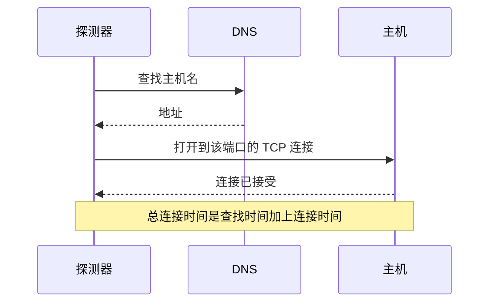

# 端口监控

端口监视器检查主机是否在某个端口上接受 TCP 连接，并测量建立连接所需的时间。可用于不使用 HTTP 的服务，或者您不想检查其 HTTP 的服务：数据库、邮件服务器、SSH、消息代理等。

:::cards
- [创建监视器](#创建端口监视器): 在控制台中完成六个步骤。
- [连接计时](#连接计时): DNS、TCP 和总时间分别测量什么。
- [监控标准](#监控标准): 可达性和连接时间。
- [故障排查](#故障排查): 服务正常运行，但监视器显示离线时。
:::

## 工作原理

每次检查时，如果您提供的是主机名，探测器会先查找它，然后打开到该端口的 TCP 连接。连接一被接受，端口就是在线的；随后探测器不发送任何内容就关闭连接。被拒绝或超时的连接会被重试，最多重试您允许的次数。然后 OneUptime 用监视器的条件评估结果。

探测器只打开 TCP 连接：只在 UDP 上监听的服务（例如 SNMP 代理）无法用端口监视器检查。

检查失败时，探测器还会跟踪到主机的路由并查找它的名称，然后把发现的内容作为 **Network Path at Time of Failure** 附加到结果中，让您看到路由在哪里中断。失去自身网络连接的探测器不会报告任何结果，因此它无法将您的服务标记为离线。

## 开始之前

- **可以创建监视器的角色**：Project Owner、Project Admin、Project Member、Monitor Admin 或 Monitor Member，或者拥有 Create Monitor 权限的自定义角色。
- **能够访问该端口的探测器。** 每个新监视器都会选中您项目的默认探测器。如果服务前面有防火墙，请允许 [OneUptime Cloud 探测器 IP 地址](/docs/configuration/ip-addresses) 连接到该端口。私有网络中的服务（例如数据库）需要在该网络内运行的 [自定义探测器](/docs/probe/custom-probe)。

## 创建端口监视器

:::steps
### 开始创建新监视器

前往 **监视器**，点击 **创建监视器**。在 **监视器类型** 下选择 **端口**。

### 命名

输入 **名称**，例如 `Orders database`，然后点击 **下一步**。

### 输入主机和端口

在 **主机名或 IP 地址** 中输入端口所在的主机，例如 `db.example.com` 或 `10.0.0.12`。在 **端口** 中输入端口号，例如 `5432`。

### 测试

点击 **测试监视器**，在 **选择探测器** 中选择一个探测器，然后点击 **运行测试**。**监视器测试结果** 会显示连接是否打开，以及每个部分花了多长时间。

### 检查条件

**监视器条件** 从 [默认标准](#默认标准) 开始：端口不接受连接时为离线，接受时为在线。如有需要可修改，然后点击 **下一步**。

### 选择探测器并创建

保留或修改 **探测器** 和 **监控间隔**（初始为 **每 5 分钟**），然后点击 **创建监视器**。监视器页面随即打开。
:::

## 配置选项

| 字段 | 默认值 | 填写内容 |
| --- | --- | --- |
| **主机名或 IP 地址** | 无 | 主机，例如 `example.com`、`192.168.1.1` 或 `2001:db8::1`。只输入主机，不要带 `http://`。 |
| **端口** | 无 | 要连接的 TCP 端口，范围为 `1` 到 `65535`。 |
| **请求超时（秒）**（在 **更多字段** 中） | `60` | 一次尝试可以花费的时间，包括 DNS 查找和 TCP 连接。最长为 60 秒。 |
| **失败时重试**（在 **更多字段** 中） | 探测器默认值，通常为 `3` | 失败的尝试要重试多少次。最多为 3。 |

**失败时重试** 统计的是第一次尝试 _之后_ 的重试次数，因此 `0` 只运行一次检查，`2` 最多运行三次。留空时使用探测器的默认值：3，除非探测器的 `PROBE_MONITOR_RETRY_LIMIT` 另有设置。包括超时在内的每次失败都会重试，两次尝试之间暂停一秒。耗时超过 10 秒的成功连接也会再检查一次。

常用端口：

| 端口 | 服务 |
| --- | --- |
| `22` | SSH |
| `25` | SMTP |
| `80` | HTTP |
| `443` | HTTPS |
| `3306` | MySQL |
| `5432` | PostgreSQL |
| `6379` | Redis |
| `27017` | MongoDB |

> [!NOTE]
> 许多托管服务商会阻止出站 SMTP。在无法发送 ping 的探测器上（探测器正是借此发现自己运行在这样的服务商那里），超时的端口 `25` 检查会被视为在线。要可靠地检查邮件服务器的端口 `25`，请在允许连接到该端口的 [自定义探测器](/docs/probe/custom-probe) 上运行监视器。

## 连接计时

对于主机名，探测器分两个阶段测量检查：

| 阶段 | 从 | 到 |
| --- | --- | --- |
| **DNS 查找** | 检查开始 | 第一次 TCP 连接尝试 |
| **TCP 连接** | 第一次 TCP 连接尝试 | 连接被接受，包括在 IPv6 和 IPv4 地址之间回退所花的时间 |

**Total Connection Time (DNS + TCP)** 从检查开始一直计算到连接被接受。它也是端口监视器的响应时间，因此使用响应时间的现有条件、警报和图表都能继续工作。

当目标是 IP 地址时，不需要 DNS 查找，因此会省略该阶段。在有分阶段计时之前的检查结果只显示总连接时间。

## 监控标准

条件决定端口何时算作在线、性能下降或离线，以及是否因此声明事件或创建警报。每个条件检查一个或多个筛选器：

| 筛选器 | 条件 | 检查内容 |
| --- | --- | --- |
| **Is Online** | **是**、**否** | 端口是否接受了连接。 |
| **Total Connection Time (DNS + TCP) (in ms)** | **Greater Than**、**Less Than**、**Greater Than Or Equal To**、**Less Than Or Equal To** | 整个连接时间，对于主机名还包括 DNS 查找。 |
| **Port DNS Lookup Time (in ms)** | **Greater Than**、**Less Than**、**Greater Than Or Equal To**、**Less Than Or Equal To** | 第一次 TCP 尝试之前的 DNS 查找。当目标是 IP 地址时没有值。 |
| **Port TCP Connect Time (in ms)** | **Greater Than**、**Less Than**、**Greater Than Or Equal To**、**Less Than Or Equal To** | 从第一次 TCP 尝试到连接被接受，包括 IPv6 和 IPv4 之间的回退。 |
| **Is Request Timeout** | **是**、**否** | DNS 查找或 TCP 连接是否在每次尝试中都超过了超时时间。 |

当目标是 IP 地址时，DNS 查找条件没有可评估的内容。对于必须同时适用于主机名和 IP 地址的条件，请使用总时间或 TCP 连接时间。

有两个或更多筛选器时，**匹配条件** 决定是 **全部** 筛选器都必须匹配，还是 **任意** 一个匹配即可。条件的 **操作** 决定它做什么：更改监视器状态、创建警报、声明事件，或其中任意几项。

### 默认标准

新的端口监视器以两个条件开始：

- **离线** — 在所有重试之后，端口仍不接受连接。监视器被标记为 **离线**，并创建名为 “_monitor name_ is offline” 的事件。端口再次接受连接后，事件会自行解决。
- **在线** — 端口接受连接。监视器被标记为 **运行正常**。

条件从上到下检查，第一个匹配的条件决定接下来发生什么。没有条件匹配时，监视器显示它的默认状态：**运行正常**，除非您在条件下方的 **更多字段** 中选择了其他状态。

### 在一段时间内评估

**在一段时间内评估此条件** 是筛选器下方的复选框，适用于 **Is Online**、**Total Connection Time (DNS + TCP) (in ms)**、**Port DNS Lookup Time (in ms)** 和 **Port TCP Connect Time (in ms)**。打开它即可判断过去一段时间内的检查，而不只是最近一次：在 **评估** 中选择聚合方式，在 **在过去（分钟）** 中选择 2 到 60 分钟的时间窗口。

| 聚合 | 匹配条件 |
| --- | --- |
| **平均值**、**总和**、**Maximum Value**、**Minimum Value** | 该数值在整个窗口内满足条件。仅限数值筛选器。 |
| **All Values** | 窗口内的每次检查都满足条件。 |
| **Any Value** | 窗口内至少有一次检查满足条件。 |

**All Values** 只有在窗口真正被数据覆盖后才会匹配。刚创建的监视器，或者检查已不再被记录的监视器，没有足够的历史来说明过去 N 分钟的情况，因此条件会等待，而不是根据手头仅有的一个读数匹配。**Any Value** 用于“只要有一次检查超出阈值就立即告诉我”，并且仍会立即触发。

**如果无数据** 决定在窗口无法支撑条件时发生什么：

| 选项 | 会发生什么 | 适用于 |
| --- | --- | --- |
| **Ignore**（默认） | 条件不匹配。 | 普通的阈值告警。 |
| **触发器** | 缺失的数据本身被视为问题。 | 沉默本身就是故障的检查。 |
| **Treat As Zero** | 将窗口按单个零值比较。 | 没有事件确实意味着零的计数器。 |

### 示例条件

| 目标 | 筛选器 | 条件 | 值 |
| --- | --- | --- | --- |
| 端口关闭时为离线 | **Is Online** | **否** | — |
| 连接缓慢时告警 | **Total Connection Time (DNS + TCP) (in ms)** | **Greater Than** | `500` |
| 连接缓慢时将服务标记为性能下降 | **Total Connection Time (DNS + TCP) (in ms)** | **Greater Than** | `200` |
| DNS 缓慢时告警 | **Port DNS Lookup Time (in ms)** | **Greater Than** | `100` |
| TCP 握手缓慢时告警 | **Port TCP Connect Time (in ms)** | **Greater Than** | `250` |

## 故障排查

:::details 服务正常运行，但监视器显示离线
探测器无法打开连接：防火墙丢弃了它，服务只在私有接口上监听，或者端口不对。事件的根本原因，以及监视器上的 **监视日志**，会显示错误，**Network Path at Time of Failure** 会显示路由到达了哪里。请在防火墙上放行探测器，或者在该网络内使用 [自定义探测器](/docs/probe/custom-probe)。
:::

:::details DNS 查找时间总是为空
目标是 IP 地址，因此没有需要查找的内容。请改用 **Total Connection Time (DNS + TCP) (in ms)** 或 **Port TCP Connect Time (in ms)**。
:::

:::details 我需要检查 UDP 服务
端口监视器只打开 TCP 连接。对于 DNS 服务器，请使用 [DNS 监控](/docs/monitor/dns-monitor)；对于 UDP 端口 123 上的时间服务器，请使用 [NTP 监控](/docs/monitor/ntp-monitor)。两者都会发送真实的查询。
:::

## 后续步骤

:::cards
- [Ping 监控](/docs/monitor/ping-monitor): 检查主机本身是否可达。
- [SSL 证书监控](/docs/monitor/ssl-certificate-monitor): 检查 TLS 端口上的证书。
- [数据库健康监控](/docs/monitor/database-health-monitor): 不止于开放的端口，监视数据库的健康状况。
- [自定义探针](/docs/probe/custom-probe): 检查您自己网络中的端口。
:::
