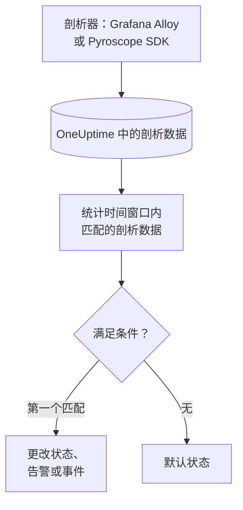

# 性能剖析监控

性能剖析监视器在一个时间窗口内统计您的服务发送到 OneUptime、且与您的过滤器（剖析类型、服务、属性）匹配的持续剖析数据。当计数满足您的条件时，它会更改监视器的状态、创建告警或声明事件。它的主要用途是发现某个服务不再发送剖析数据。

> [!IMPORTANT]
> 仪表板中的 **创建监视器** 不提供 Profiles：它的过滤器还没有表单。请按下文所述，通过 [API](/docs/api-reference/api-reference) 或 [Terraform](/docs/terraform/monitor-steps) 创建性能剖析监视器。创建后，您可以在仪表板中监视器的 **标准** 页面查看和编辑它的条件；它的过滤器只能通过 API 或 Terraform 更改。

:::cards
- [创建监视器](#创建性能剖析监视器): 通过 API 或 Terraform 发送的配置。
- [查询内容](#查询内容): 剖析类型、服务、属性和时间窗口。
- [条件](#条件): 可以使用的条件。
- [实例](#实例剖析数据不再到达): 知道某个服务何时停止发送剖析数据。
:::

## 工作原理



OneUptime 每分钟统计一次与监视器过滤器匹配、且在其时间窗口内开始的剖析数据。它把这个计数从上到下与监视器的条件比较，第一个匹配的条件决定发生什么。如果没有条件匹配，监视器会回到默认状态。

## 开始之前

- 您的服务通过 Grafana Alloy（eBPF）或 Pyroscope SDK 把持续剖析数据发送到 OneUptime。请参阅 [持续性能分析](/docs/telemetry/profiles)。
- 您有可以创建监视器的 API 密钥，或者已设置好 OneUptime 的 Terraform provider。
- 您知道要监视的每个遥测服务的 ID，以及它发送的剖析类型，例如 `cpu`、`wall`、`alloc_objects`、`alloc_space` 或 `goroutine`。

## 创建性能剖析监视器

:::steps
### 选择要统计的内容

编写步骤的 `profileMonitor` 配置。下面的配置统计一个服务在最近五分钟内的 CPU 剖析数据：

```json
{
  "profileMonitor": {
    "telemetryServiceIds": [],
    "profileTypes": ["cpu"],
    "profileType": "",
    "attributes": {},
    "lastXSecondsOfProfiles": 300
  }
}
```

把服务的 ID 放入 `telemetryServiceIds`，或者把列表留空以统计所有服务的剖析数据。[查询内容](#查询内容) 介绍了每个字段。

### 创建监视器

通过 [API](/docs/api-reference/api-reference) 或 [Terraform](/docs/terraform/monitor-steps) 创建一个监视器类型为 `Profiles` 的监视器，其步骤包含此配置和至少一个条件。在 Terraform 中，把配置作为步骤的 `profile_monitor` 属性传入，用 `jsonencode()` 编写。

### 在仪表板中检查

从 **监视器** 打开监视器。第一次评估在一分钟内运行，一旦有条件匹配，状态就会改变。
:::

## 查询内容

| 字段 | 匹配什么 | 默认值 |
| --- | --- | --- |
| `profileTypes` | 属于这些类型之一的剖析数据，精确匹配，例如 `cpu`。 | 空：所有类型 |
| `profileType` | 类型包含此文本的剖析数据，不区分大小写。设置后会忽略 `profileTypes`。 | 空 |
| `telemetryServiceIds` | 来自这些遥测服务之一的剖析数据。 | 空：所有服务 |
| `entityKeys` | 来自这些主机、Pod、容器及其他基础设施实体之一的剖析数据。 | 空：所有实体 |
| `attributes` | 属性具有这些值的剖析数据。 | 空：无条件 |
| `lastXSecondsOfProfiles` | 在评估前这么多秒内开始的剖析数据。 | 无：请始终设置它，否则会统计所有已存储的剖析数据，计数永远不会降到 0 |

剖析数据必须匹配您设置的所有过滤器才会被计数。

## 如何评估

- **每分钟。** 性能剖析监视器不由探测器检查，因此没有可设置的间隔，也没有 **探测器与间隔** 页面。
- **每次评估一个数字。** 监视器统计与所有过滤器匹配、且在 `lastXSecondsOfProfiles` 内开始的剖析数据。剖析器按固定间隔上传，所以请给时间窗口留出容纳多次上传的余地。
- **没有剖析数据就是计数 0。** 剖析器停止上传的服务计数为 0。
- **OneUptime 自身的停机不算沉默。** 只要时间窗口中包含 OneUptime 自身未接收数据的时间（正在重启、升级或追赶积压），检查就会等待：状态不会改变，也不会打开或解决任何事件或告警。请参阅 [OneUptime 未接收数据时](/docs/monitor/when-oneuptime-is-not-receiving)。
- **条件从上到下。** 第一个匹配的条件决定结果，因此请把最严重的放在最前面。

每次状态变化及其原因都会记录在监视器的 **状态时间线** 上。

## 条件

性能剖析监视器的条件只有一个过滤器 **Profile Count**：窗口内匹配的剖析数据数量。将它与一个值比较：

| 过滤条件 | 当剖析数据数量…时匹配 |
| --- | --- |
| **Greater Than** | 高于该值 |
| **Greater Than Or Equal To** | 等于或高于该值 |
| **Less Than** | 低于该值 |
| **Less Than Or Equal To** | 等于或低于该值 |
| **Equal To** | 正好等于该值 |
| **Not Equal To** | 不等于该值 |

剖析数据数量没有异常条件：没有可以与之比较的基线。

## 实例：剖析数据不再到达

结账服务运行着一个上传 CPU 剖析数据的 Pyroscope SDK。您希望它们停止五分钟时创建事件：

- `profileTypes`：`["cpu"]`，`telemetryServiceIds`：结账服务，`lastXSecondsOfProfiles`：`300`
- 条件 1：**Profile Count** **Equal To** `0`：将监视器标记为离线并声明事件
- 条件 2：**Profile Count** **Greater Than** `0`：将监视器标记为在线

只要 SDK 在上传，每次评估都会统计到一些剖析数据，条件 2 让监视器保持在线。当服务在没有 SDK 的情况下部署后，计数会在最后一次上传五分钟后降到 0，条件 1 匹配并声明事件。修复后的第一次上传让计数重新高于 0，如果该事件开启了 **自动解决事件**，事件会自行解决。

## 故障排查

:::details 监视器计数为 0，但 OneUptime 中能看到剖析数据
把过滤器与您看到的剖析数据比较：`profileTypes` 必须与类型完全匹配，`telemetryServiceIds` 必须包含正确的服务 ID。`lastXSecondsOfProfiles` 太短也可能正好落在两次上传之间。
:::

:::details 创建监视器 中没有 Profiles
这是预期行为：仪表板还没有性能剖析监视器过滤器的表单。请按 [创建性能剖析监视器](#创建性能剖析监视器) 中所述，通过 API 或 Terraform 创建。
:::

## 后续步骤

:::cards
- [持续性能分析](/docs/telemetry/profiles): 从 Grafana Alloy 或 Pyroscope SDK 发送剖析数据。
- [监控步骤](/docs/terraform/monitor-steps): 从 Terraform 传入步骤配置。
- [跟踪监控](/docs/monitor/traces-monitor): 对失败的 Span 告警。
- [指标监控](/docs/monitor/metrics-monitor): 对 CPU、内存和其他指标告警。
:::
