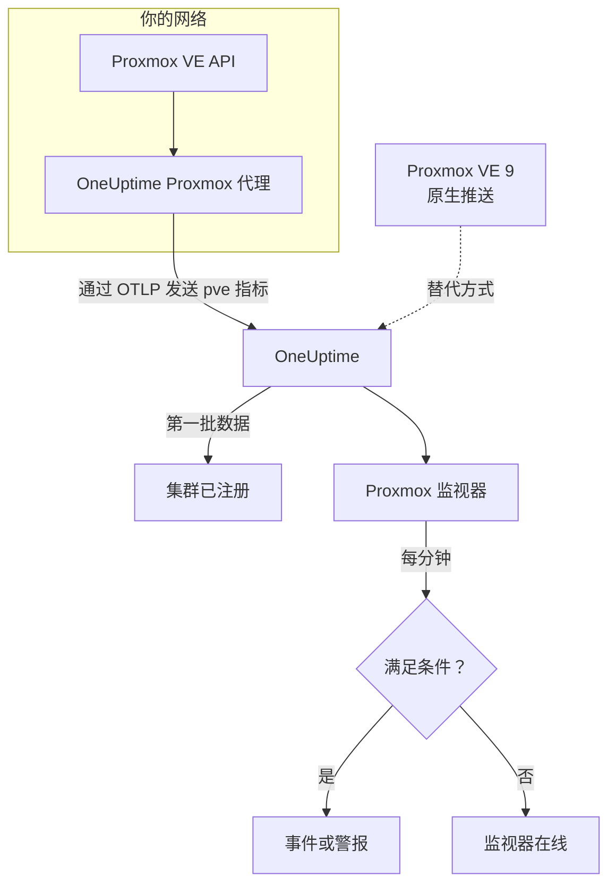

# Proxmox 监控

Proxmox 监视器监控一个 Proxmox VE 集群（它的节点、虚拟机和 LXC 容器、存储、HA 状态、备份作业覆盖情况和存储复制），并在节点离线、来宾停止或存储即将写满时通知你。它读取 OneUptime Proxmox 代理收集的 `pve_*` 指标，因此不会从外部探测任何东西。

:::cards
- [创建监视器](#创建-proxmox-监视器): 在仪表板中完成六个步骤。
- [模板](#现成的警报模板): 十一个现成的警报，每个节点、来宾或卷一个事件。
- [资源标识](#资源标识): 如何指定单个节点、来宾或存储卷。
- [指标](#收集的指标): 监视器可以据以报警的每个 `pve_*` 序列。
:::

## 工作原理

OneUptime Proxmox 代理运行在一台能访问 Proxmox VE API 的机器上。它每 30 秒使用集群和节点收集器抓取 prometheus-pve-exporter，给每个序列标上它所描述的资源，并把指标通过 OTLP 发送到 OneUptime，同时打上集群名称 `proxmox.cluster.name`。第一批数据会注册该集群。Proxmox VE 9 及更高版本也可以改为原生推送指标，无需安装任何东西；参见 [原生推送](#proxmox-ve-原生推送)。

Proxmox 监视器绑定到一个集群。它每分钟对这个集群的指标运行查询，并把结果与条件进行比较。

## 开始之前

- **安装 Proxmox 代理**，装在能访问 Proxmox VE API 的地方，并使用只读 API 令牌。[Proxmox 代理指南](/docs/telemetry/proxmox) 介绍了令牌、安装和原生推送。
- **确认集群已注册。** 首次抓取后大约一分钟，它会以代理的 `PROXMOX_CLUSTER_NAME` 命名，出现在 **产品 → 基础设施 → Proxmox → 所有集群** 下。

## 创建 Proxmox 监视器

:::steps
### 开始新的监视器

进入 **监视器** 并点击 **创建监视器**。

### 选择 Proxmox

在 **监视器类型** 下点击 **更多监视器类型**，然后在 **基础设施** 下选择 **Proxmox**，或在搜索框中输入 `proxmox`。输入 **名称**（它会用在事件和警报标题中），然后点击 **下一步**。

### 选择集群

在 **Proxmox Monitor Configuration** 下，从 **Proxmox Cluster** 中选择集群。发送过数据的每个集群都在列表中。

### 选择要监控的内容

选择三个选项卡之一：

- **Quick Setup** – 点击一个 [模板](#现成的警报模板)。它会设置指标、过滤器、聚合、时间范围和阈值，并用自己的条件替换下面的条件。你仍然可以更改 **时间范围**。
- **Custom Metric** – 从 **Proxmox Metric** 中选择一个指标，然后设置 **聚合** 和 **时间范围**。[过滤器](#监视器设置) 可以把范围缩小到某类资源或单个资源。
- **高级** – 在 **选择指标** 下自己构建查询和公式，例如由 `pve_memory_usage_bytes / pve_memory_size_bytes` 得出内存百分比。使用 **Group by** `id` 可以单独评判每个资源。

### 检查条件

打开 **监视器条件** 下的每个条件，检查其 **指标**、**聚合**、**条件** 和 **Threshold**。模板会填好这些内容。使用 **Custom Metric** 或 **高级** 时，监视器从 [默认条件](#默认条件) 开始，这些条件只会注意到指标降到零，所以请设置你自己的阈值。

### 创建监视器

点击 **创建监视器**。OneUptime 会打开监视器的页面，并每分钟评估一次。它打开的事件和警报也会列在集群的 **事件** 和 **警报** 页面上。
:::

> [!TIP]
> 要一次设置多个模板，请从 **产品 → 基础设施 → Proxmox** 打开集群，然后进入 **Recommendations**。选择你需要的模板和要呼叫的人，OneUptime 会为每个模板创建一个监视器。

## 监视器设置

| 字段 | 选项卡 | 作用 |
| --- | --- | --- |
| **Proxmox Cluster** | 全部 | 必填。把每个查询限定在 `resource.proxmox.cluster.name`。 |
| **资源范围** | Custom Metric、高级 | 可选。**节点**、**Guest (VM / container)**、**存储** 或 **集群**，与 `pve.scope` 完全匹配。 |
| **PVE ID** | Custom Metric、高级 | 可选。与 `pve.id` 完全匹配：节点名称（`pve1`）、VMID（`100`）或 `<node>/<storage>`（`pve1/local`）。与范围搭配可以指定单个资源。 |
| **节点名称** | Custom Metric、高级 | 可选。只匹配节点自身的序列（`pve.scope = node` 和 `pve.id`）。它无法选中该节点上的来宾或存储。 |
| **Guest ID** | Custom Metric、高级 | 可选。与原始 `id` 标签完全匹配，例如 `qemu/100` 或 `lxc/101`。设置后会忽略其他过滤器。 |
| **Proxmox Metric** | Custom Metric | [目录](#收集的指标) 中的一个指标。 |
| **聚合** | Custom Metric | 样本的合并方式：**平均值**、**最大值**、**最小值**、**总和** 或 **计数**。初始值为该指标通常的聚合方式。 |
| **时间范围** | 全部 | 查询读取的滚动窗口，从 **Past 1 Minute** 到 **Past 365 Days**。新监视器从 **Past 1 Minute** 开始；模板会设置自己的值。 |
| **选择指标** | 高级 | 查询构建器：**指标**、**Aggregate by**、**Filter by attributes**、**Group by**，以及用于组合查询的 **添加指标** 和 **添加公式**。 |

## 资源标识

每个序列都带有一个数据点标签 `id`，指明它所属的 Proxmox 资源：

| `id` 值 | 资源 |
| --- | --- |
| `node/<name>` | 集群节点，例如 `node/pve1`。 |
| `qemu/<vmid>` | QEMU 虚拟机，例如 `qemu/100`。 |
| `lxc/<vmid>` | LXC 容器，例如 `lxc/101`。 |
| `storage/<node>/<storage>` | 节点上的存储卷，例如 `storage/pve1/local`。 |

有两个例外：复制序列（`pve_replication_*`）在 `id` 中携带复制**作业**的 ID（例如 `100-0`），而集群级的 `pve_not_backed_up_total` 根本没有 `id`。

过滤器按相等匹配，而不是按前缀匹配，所以代理还会把 `id` 拆成三个可供过滤的属性。模板依赖这些属性：

| 属性 | 取值 | 对于 `qemu/100` |
| --- | --- | --- |
| `pve.scope` | `node`、`guest`、`storage`、`cluster`（`qemu` 和 `lxc` 都是 `guest`） | `guest` |
| `pve.type` | `node`、`qemu`、`lxc`、`storage` | `qemu` |
| `pve.id` | `id` 中第一个 `/` 之后的全部内容（`pve1`、`100`、`pve1/local`） | `100` |

按 `pve.scope` 或 `pve.type` 过滤可选出一类资源，按 `pve.id` 或 `id` 过滤可选出单个资源，按 `id` 分组则可以单独评判每个资源。

## 现成的警报模板

**Quick Setup** 提供 11 个模板。每个模板都会构建一个完整的监视器：查询、属性过滤器、分组、一个触发的条件和一个恢复的条件。大多数按 `id` 分组，所以每个节点、来宾、卷或作业都有自己的事件和警报。阈值只是起点，你可以编辑。

除非表中另有说明，模板读取最近 5 分钟的数据。条件只有在其窗口的每一分钟都成立时才会触发，阈值条件在越过阈值 10% 处恢复，这样在边界附近徘徊的值不会来回跳动。

| 模板 | 严重程度 | 监控内容 | 触发时机 | 恢复时机 |
| --- | --- | --- | --- | --- |
| Node Offline | 严重 | `pve.scope = node` 的 `pve_up`，按 `id` 取 Min | 低于 1 | 等于 1 |
| Guest Down | Warning | `pve.scope = guest` 的 `pve_up` 和 `pve_onboot_status`，按 `id` 取 Min | `pve_onboot_status` 为 1 时 `pve_up` 低于 1 | `pve_up` 恢复为 1，或关闭开机启动 |
| Cluster Quorum at Risk | 严重 | `pve.scope = node` 的 `pve_up` ÷ `pve_node_info` × 100（两者都取总和）：在线节点所占比例 | 50% 或更低 | 高于 55% |
| High Node CPU Usage | Warning | `pve.scope = node` 的 `pve_cpu_usage_ratio`，按 `id` 取 Avg | 高于 0.9（节点核心的 90%） | 不高于 0.81 |
| High Node Memory Usage | Warning | `pve.scope = node` 的 `pve_memory_usage_bytes` ÷ `pve_memory_size_bytes` × 100，按 `id` | 高于 85% | 不高于 76.5% |
| High Guest CPU Usage | Warning | `pve.scope = guest` 的 `pve_cpu_usage_ratio`，按 `id` 取 Avg，最近 15 分钟 | 整整 15 分钟都高于 0.95（其 vCPU 的 95%） | 不高于 0.855 |
| Storage Near Full | Warning | `pve.scope = storage` 的 `pve_disk_usage_bytes` ÷ `pve_disk_size_bytes` × 100，按 `id` | 高于 85% | 不高于 76.5% |
| Container Root Disk Near Full | Warning | 针对 `pve.type = lxc` 的同一磁盘比率，按 `id` | 高于 90% | 不高于 81% |
| HA Resource in Error State | 严重 | `state = error` 的 `pve_ha_state`，按 `id` 取 Max | 高于 0 | 等于 0 |
| Guest Not Backed Up | Warning | `pve_not_backed_up_total`，Max（整个集群一个序列） | 高于 0 | 等于 0 |
| Replication Failing | 严重 | `pve_replication_failed_syncs`，按 `id`（作业 ID）取 Max | 高于 0 | 等于 0 |

**严重程度** 是选择列表中显示的标签。模板创建的事件和警报从项目中最严重的事件和警报严重程度开始；请在条件中更改它们。

- **停机类模板使用最小值**，所以只要有一次抓取时资源处于停机状态就会触发，而不会被资源正常运行的那些抓取掩盖。
- **Guest Down** 模板只关注设置为开机启动的来宾，所以你特意停止的来宾永远不会呼叫任何人。
- **Cluster Quorum at Risk** 模板是一种近似：pve-exporter 没有 corosync 指标，所以它统计在线的节点。
- **High Guest CPU Usage** 模板比节点模板阈值更高、反应更慢：来宾本来就应该用满它的 vCPU，所以只有一直降不下来的来宾才会呼叫人。
- **比率公式** 对两边都取 **总和**。两边来自同一次抓取，所以结果是真实的百分比。
- **Container Root Disk Near Full** 模板不包括 QEMU 虚拟机：没有 QEMU 来宾代理时，它们的磁盘使用量读数为 0。
- **Guest Not Backed Up** 模板只覆盖备份作业的成员关系。pve-exporter 不报告备份是否运行或成功；要列出这些来宾，请按 `id` 对 `pve_not_backed_up_info` 分组。
- **复制陈旧度**（当前时间减去最后一次同步）无法用于报警，因为条件不支持时间运算。集群的 **概览** 页面会显示它；请改用 **Replication Failing** 报警。

### Proxmox VE 原生推送

Proxmox VE 9 及更高版本可以通过内置的 OpenTelemetry 指标服务器推送指标，无需安装任何东西，参见 [Proxmox 代理指南](/docs/telemetry/proxmox)。OneUptime 会把推送转换成相同的 `pve_*` 序列，所以目录以及 CPU、内存和存储模板都能配合它使用。

**Node Offline** 和 **Cluster Quorum at Risk** 同样可用：每个节点只推送自己的状态，所以停止报告的节点会被仍然存活的节点报告为停机（`pve_up` = 0），参见 [节点停止报告时](/docs/telemetry/proxmox#when-a-node-stops-reporting)。**Guest Down**、**HA Resource in Error State**、**Guest Not Backed Up** 和 **Replication Failing** 需要只有代理才会收集的数据。

## 收集的指标

代理每 30 秒使用集群和节点两类收集器抓取 prometheus-pve-exporter，这也覆盖了导出器的 `backup-info` 和 `replication` 收集器（两者默认都开启）。

### 可用性

| 指标 | 单位 | 说明 |
| --- | --- | --- |
| `pve_up` | — | 节点或来宾处于启动或运行状态时为 1，否则为 0。 |
| `pve_uptime_seconds` | 秒 | 节点或来宾的运行时间。 |
| `pve_version_info` | 计数 | 标签中的 Proxmox VE 版本。始终为 1。 |

### 节点

| 指标 | 单位 | 说明 |
| --- | --- | --- |
| `pve_node_info` | 计数 | 节点元数据，始终为 1。求和可统计正在报告的节点数。 |
| `pve_cpu_usage_ratio` | 比率 | 已用 CPU 占可用 CPU 的比率（0–1）。 |
| `pve_cpu_usage_limit` | 核心 | 可用 CPU，单位为核心。对于来宾，是它的 vCPU。 |
| `pve_memory_usage_bytes` | 字节 | 正在使用的内存。 |
| `pve_memory_size_bytes` | 字节 | 总内存。 |

CPU 和内存序列也会针对每个来宾报告，使用 `qemu/*` 和 `lxc/*` ID。

### 来宾

| 指标 | 单位 | 说明 |
| --- | --- | --- |
| `pve_guest_info` | 计数 | 标签中的来宾元数据（名称、节点、类型 `qemu` 或 `lxc`）。始终为 1。 |
| `pve_network_receive_bytes` | 字节 | 来宾接收的字节数。生命周期计数器。 |
| `pve_network_transmit_bytes` | 字节 | 来宾发送的字节数。生命周期计数器。 |
| `pve_disk_read_bytes` | 字节 | 来宾从磁盘读取的字节数。生命周期计数器。 |
| `pve_disk_write_bytes` | 字节 | 来宾写入磁盘的字节数。生命周期计数器。 |
| `pve_onboot_status` | 计数 | 来宾在节点启动时启动则为 1。设置了此项却处于停止状态的来宾，通常意味着计划外停机。 |

### 存储

| 指标 | 单位 | 说明 |
| --- | --- | --- |
| `pve_disk_usage_bytes` | 字节 | 磁盘或存储上已用的字节数。对于 QEMU 来宾，除非安装了 QEMU 来宾代理，否则读数为 0。 |
| `pve_disk_size_bytes` | 字节 | 磁盘或存储的总大小。 |
| `pve_storage_info` | 计数 | 存储元数据，始终为 1。求和可统计存储卷数量。 |

### HA

| 指标 | 单位 | 说明 |
| --- | --- | --- |
| `pve_ha_state` | — | 每个 HA 资源的每种 HA 状态（`started`、`stopped`、`error`、…）各一个序列，在其当前状态上为 1。要针对某个状态报警，请按 `state` 标签过滤。 |

### 备份

来自导出器的集群级 `backup-info` 收集器。它们只报告备份**作业**的覆盖情况：

| 指标 | 单位 | 说明 |
| --- | --- | --- |
| `pve_not_backed_up_total` | 计数 | 不在任何备份作业中的来宾。整个集群一个序列，没有 `id`。 |
| `pve_not_backed_up_info` | 计数 | 每个未被覆盖的来宾一个序列，始终为 1，带有来宾的 `id` 标签。来宾加入备份作业后它就会消失。 |

### 复制

来自导出器的节点级 `replication` 收集器。只有当集群有复制作业时这些序列才存在，并在 `id` 中携带作业 ID：

| 指标 | 单位 | 说明 |
| --- | --- | --- |
| `pve_replication_failed_syncs` | 计数 | 连续失败的同步尝试次数。大于 0 表示副本正在变得陈旧。 |
| `pve_replication_duration_seconds` | 秒 | 最近一次同步花费的时间。 |
| `pve_replication_last_sync_timestamp_seconds` | 秒 | 最近一次**成功**同步的 Unix 时间。 |
| `pve_replication_last_try_timestamp_seconds` | 秒 | 最近一次**尝试**的 Unix 时间。比最近一次同步更新，说明最新的尝试失败了。 |
| `pve_replication_next_sync_timestamp_seconds` | 秒 | 下一次计划同步的 Unix 时间。 |
| `pve_replication_info` | 计数 | 标签中的作业元数据（类型、源、目标、来宾）。始终为 1。 |

## 监控条件

条件把监视器的某个查询或公式与阈值进行比较。Proxmox 监视器的条件没有 **过滤器类型**：每条规则都用以下字段检查指标值。

| 字段 | 作用 |
| --- | --- |
| **指标** | 要检查的查询或公式，按其变量名指定。 |
| **聚合** | 窗口中的值如何变成一个结果：**平均值**、**总和**、**Maximum Value**、**Minimum Value**、**All Values**（每个值都必须匹配）或 **Any Value**（一个就够）。 |
| **条件** | **Greater Than**、**Less Than**、**Greater Than Or Equal To**、**Less Than Or Equal To** 或 **Equal To**，或者异常条件：**Anomalously High**、**Anomalously Low** 或 **Anomalous**。 |
| **Threshold** | 用于比较的值。如果指标有单位，旁边会有单位列表。异常条件下不显示。 |
| **灵敏度** | 仅限异常条件。**低**（4σ）、**中**（3σ，默认）或 **高**（2σ）。 |
| **基线窗口** | 仅限异常条件。14 天（默认）、28、60 或 90 天的历史。 |
| **如果无数据** | 位于 **更多字段** 下。窗口中没有样本时的处理方式：**Ignore**（默认）、**Treat As Zero** 或 **触发器**。 |

异常条件会把每个值与基线中一周的同一小时进行比较。在基线窗口积累足够的历史之前，它们会保持在“Learning”状态，不产生任何结果。

每个条件还会说明匹配时要做什么：更改监视器状态、创建警报或宣布事件。条件按从上到下的顺序检查，第一个匹配的条件决定结果。

### 默认条件

不是从模板构建的监视器会以两个条件开始：

| 顺序 | 条件 | 匹配时机 | 结果 |
| --- | --- | --- | --- |
| 1 | Check if _monitor name_ is offline | 第一个查询的任意值为 `0` | 将监视器标记为 **离线**，并宣布事件“_monitor name_ is offline”，监视器恢复后该事件会自动解决。 |
| 2 | Check if _monitor name_ is online | 任意值大于 `0` | 将监视器标记为 **运行正常**。 |

> [!IMPORTANT]
> 静默不匹配任何一个条件：停止发送数据的集群会让监视器保持原样。要在数据停止时收到通知，请在某个条件上把 **如果无数据** 设为 **触发器**。OneUptime 自身未接收数据的时间永远不算作无数据：窗口中包含这类时间的检查会改为等待，详见 [OneUptime 未接收数据时](/docs/monitor/when-oneuptime-is-not-receiving)。

## 故障排除

:::details 集群不在 Proxmox Cluster 列表中
集群会根据代理的数据自动注册。请检查代理是否在运行并发送数据（参见 [Proxmox 代理指南](/docs/telemetry/proxmox)），以及是否设置了 `PROXMOX_CLUSTER_NAME`。
:::

:::details 缺少来宾指标
来宾序列来自导出器的集群收集器，随附配置用抓取参数 `cluster=1` 开启它。如果你更改过收集器配置，请恢复它。
:::

:::details High Node CPU Usage 从不触发
模板按 `id` 对 `pve_cpu_usage_ratio` 取平均值，所以每个节点都单独检查。如果你构建了自己的查询，请按 `id` 分组：对所有节点取平均值会被空闲的节点拉低。
:::

:::details 已从集群移除的节点仍不断触发 Node Offline
在 Proxmox VE 原生推送下，被移出集群的节点看起来和宕机的节点一样：它停止了报告，所以仍然存活的节点会一直把它报告为停机。打开该节点的页面并点击 **Remove Node**，节点就会消失，其警报也会解决。否则它会保持离线最多 7 天。代理没有这个问题：它会询问集群，而集群已不再列出该节点。
:::

:::details 缺少备份或复制指标
`pve_not_backed_up_*` 来自导出器的 `backup-info` 收集器，`pve_replication_*` 来自它的 `replication` 收集器。两者默认都开启，并由随附配置的抓取参数 `cluster=1` 和 `node=1` 覆盖。如果你运行自己的导出器，请检查没有关闭它们。只有当集群有存储复制作业时，`pve_replication_*` 才存在。
:::

:::details 像 pve_network_receive_bytes 这样的计数器只增不减
网络和磁盘 I/O 序列是生命周期计数器，而条件比较的是原始值：没有速率运算符，查询构建器中的 **Convert to per-second rate** 只改变图表。请以速率形式绘制它们的图表，或者用公式对它们的增长报警，例如用同一计数器的 **最大值** 查询减去 **最小值** 查询。
:::

## 后续步骤

:::cards
- [Proxmox 代理](/docs/telemetry/proxmox): 安装代理，或设置原生推送。
- [Ceph 监控](/docs/monitor/ceph-monitor): 监控 Proxmox 集群背后的 Ceph 存储。
- [VMware 监控](/docs/monitor/vmware-monitor): 适用于 vSphere 的同类监视器。
- [事件概览](/docs/incidents/index): 条件宣布事件之后会发生什么。
:::
