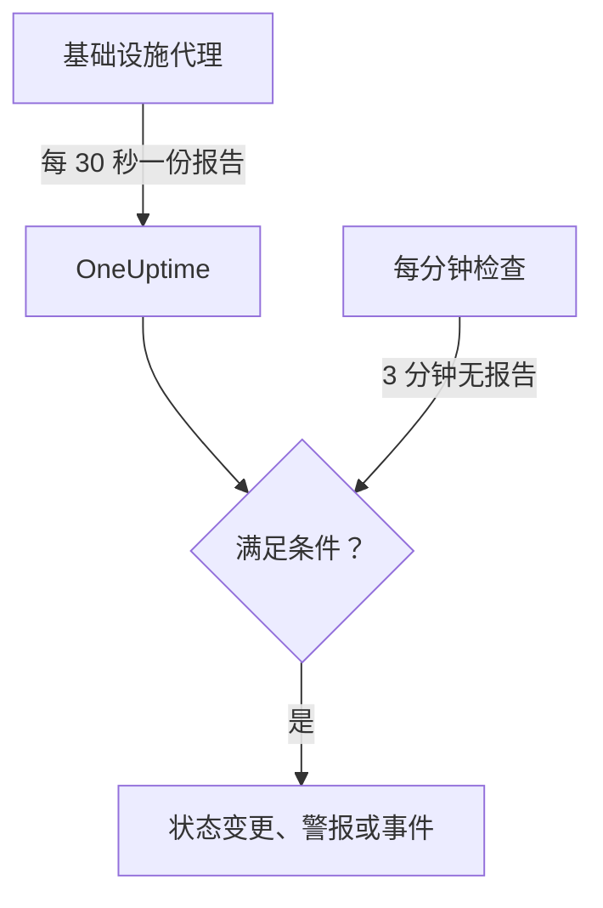

# 服务器 / 虚拟机监控

Server / VM 监视器通过 OneUptime 基础设施代理（`oneuptime-infrastructure-agent`）监控一台机器。这个代理是一个小型服务，每 30 秒向 OneUptime 报告一次 CPU、内存、磁盘、负载、网络和正在运行的进程。本页介绍如何将代理连接到 Server / VM 监视器、代理报告哪些内容，以及如何编写判断服务器在线或离线的条件。

> [!IMPORTANT]
> **创建监视器** 中已不再提供 **Server / VM**。你已有的 Server / VM 监视器会继续工作，本页的所有内容都适用于它们。要监控新的服务器，请改为创建 [主机监视器](/docs/monitor/host-monitor)：它根据 [主机 OpenTelemetry Collector](/docs/telemetry/host-otel-collector) 发送的主机指标发出警报。

:::cards
- [连接代理](#连接代理): 安装代理，提供监视器的密钥，然后启动它。
- [代理报告的内容](#代理报告的内容): CPU、内存、磁盘、负载、网络和进程。
- [监控条件](#监控条件): 决定服务器何时算作在线或离线。
- [故障排除](#故障排除): 代理不报告，或监视器始终不进入离线状态。
:::

## 工作原理

代理作为系统服务运行。它每 30 秒收集一份报告，用监视器的密钥签名后发送到你的 OneUptime URL。OneUptime 将这些数值存为监视器的指标，并用监视器的条件检查报告。

静默会单独检查。OneUptime 每分钟会重新评估所有 3 分钟或更长时间没有报告的 Server / VM 监视器的 **Is Online** 条件；静默时间超过其条件允许范围（默认 3 分钟）的服务器会被视为离线。没有 **Is Online** 条件的监视器不会仅仅因为代理静默而被标记为离线。只有 OneUptime 正在接收数据的时间才计入这段静默：OneUptime 自身重启、升级或追赶积压的时间不计入，详见 [OneUptime 未接收数据时](/docs/monitor/when-oneuptime-is-not-receiving)。



## 开始之前

- 项目中有一个 Server / VM 监视器。
- 编辑监视器的权限。密钥以及包含密钥的设置命令只对能编辑监视器的人显示。
- 服务器上的 root 权限（Linux、macOS）或管理员权限（Windows）。代理会把自己安装为系统服务。
- 服务器能通过 HTTPS 出站访问你的 OneUptime URL，可以直接访问，也可以通过 HTTP 代理。

## 连接代理

下面的命令使用 `https://oneuptime.com` 和 `YOUR_SECRET_KEY`。监视器自己的设置命令中已经填好了你的 OneUptime URL 和监视器的密钥，所以请尽量从监视器中复制。

:::steps
### 打开监视器的设置命令

进入 **监视器**，打开 Server / VM 监视器并选择 **文档**。**Set up your Server Monitor (Linux/Mac)** 和 **Set up your Server Monitor (Windows)** 卡片中有这个监视器的命令。在代理首次报告之前，监视器的 **概览** 中也会显示这些命令。

### 安装代理

:::tabs
@tab Linux
```bash
curl -sSL https://oneuptime.com/docs/static/scripts/infrastructure-agent/install.sh | sudo bash
```
@tab macOS
```bash
curl -sSL https://oneuptime.com/docs/static/scripts/infrastructure-agent/install.sh | sudo bash
```
@tab Windows
1. 从 [最新的 GitHub 版本](https://github.com/OneUptime/oneuptime/releases/latest) 下载代理：x64 使用 `oneuptime-infrastructure-agent_windows_amd64.zip`，ARM64 使用 `oneuptime-infrastructure-agent_windows_arm64.zip`。
2. 解压 zip 文件。其中包含 `oneuptime-infrastructure-agent.exe`。
3. 在解压到的文件夹中以管理员身份打开 **命令提示符**。
:::

安装脚本会下载适用于你的操作系统和处理器（x86-64 或 ARM64）的最新版本，并把 `oneuptime-infrastructure-agent` 二进制文件放到 `$HOME/bin`。在自托管部署中，脚本由你自己的 OneUptime URL 提供。

### 将其连接到监视器

:::tabs
@tab Linux
```bash
sudo oneuptime-infrastructure-agent configure --secret-key=YOUR_SECRET_KEY --oneuptime-url=https://oneuptime.com
```
@tab macOS
```bash
sudo oneuptime-infrastructure-agent configure --secret-key=YOUR_SECRET_KEY --oneuptime-url=https://oneuptime.com
```
@tab Windows
```shell
oneuptime-infrastructure-agent configure --secret-key=YOUR_SECRET_KEY --oneuptime-url=https://oneuptime.com
```
:::

`configure` 会把密钥和 URL 保存到代理的配置文件中，并把代理安装为系统服务。两个参数都是必需的。在自托管部署中，请把 `https://oneuptime.com` 换成你自己的 URL。

如果服务器通过代理服务器访问互联网，请添加 `--proxy-url`：

```bash
sudo oneuptime-infrastructure-agent configure --proxy-url=http://proxy.example.com:8080 --secret-key=YOUR_SECRET_KEY --oneuptime-url=https://oneuptime.com
```

### 启动代理

:::tabs
@tab Linux
```bash
sudo oneuptime-infrastructure-agent start
```
@tab macOS
```bash
sudo oneuptime-infrastructure-agent start
```
@tab Windows
```shell
oneuptime-infrastructure-agent start
```
:::

启动时，代理会向 OneUptime 验证密钥，并立即发送第一份报告。

### 检查它是否在报告

运行 `sudo oneuptime-infrastructure-agent status`（Windows 上不需要 `sudo`），它会输出 `Service is running`。在 OneUptime 中，第一份报告到达后，监视器的 **概览** 不再显示设置命令，**指标** 选项卡开始绘制服务器的图表。
:::

## 代理参考

### 命令

| 命令 | 作用 |
| --- | --- |
| `configure --secret-key=<key> --oneuptime-url=<url>` | 保存设置并把代理安装为系统服务。添加 `--proxy-url=<url>` 可通过代理服务器发送报告。 |
| `start` | 启动服务。在运行 `configure` 之前它会拒绝启动。 |
| `stop` | 停止服务。 |
| `restart` | 重启服务。 |
| `status` | 输出服务是正在运行还是已停止。 |
| `logs` | 输出代理日志的最后 100 行。`-n <lines>` 输出其他行数，`-f` 持续跟踪新行。 |
| `uninstall` | 移除服务并删除代理的配置文件。 |
| `help` | 列出命令。 |

在 Linux 和 macOS 上用 `sudo` 运行，在 Windows 上从管理员身份的 **命令提示符** 运行。要更改已配置代理的密钥、URL 或代理服务器，请先运行 `stop` 和 `uninstall`，再重新运行 `configure` 和 `start`。

### 文件

| 文件 | Linux 和 macOS | Windows |
| --- | --- | --- |
| 配置 | `/etc/oneuptime-infrastructure-agent/config.json` | `%PROGRAMDATA%\oneuptime-infrastructure-agent\config.json` |
| 日志 | `/var/log/oneuptime-infrastructure-agent/oneuptime-infrastructure-agent.log` | `%PROGRAMDATA%\oneuptime-infrastructure-agent\oneuptime-infrastructure-agent.log` |

当代理无法写入这些目录时，会改用 `~/.oneuptime-infrastructure-agent/`。环境变量 `ONEUPTIME_AGENT_CONFIG_PATH` 和 `ONEUPTIME_AGENT_LOG_PATH` 可以显式设置其中任一路径。

## 代理报告的内容

每份报告都包含服务器的主机名，以及：

| 方面 | 报告内容 |
| --- | --- |
| CPU | 使用率（%）、核心数、每个核心的使用率，以及在 user、system、idle、I/O 等待、steal、nice、IRQ 和软 IRQ 中花费的时间 |
| 内存 | 总内存、已用、空闲和可用内存，缓冲区和缓存，使用率（%），以及交换空间的总量、已用、空闲和使用率（%） |
| 磁盘 | 每个已挂载磁盘的挂载路径、设备、文件系统、总空间、已用空间和空闲空间、使用率（%）、读写的字节数和操作数，以及 I/O 时间 |
| 负载 | 1 分钟、5 分钟和 15 分钟的平均负载 |
| 网络 | 每个接口发送和接收的字节数与数据包数、进出方向的错误和丢包；以及已建立和正在监听的连接 |
| 主机 | 操作系统、平台和版本、内核版本和架构、运行时间、启动时间、虚拟化和进程数 |
| 进程 | 每个正在运行的进程：名称、PID、命令、CPU（%）、内存、状态、线程、用户和启动时间 |

操作系统不提供的值会被省略。监视器的 **指标** 选项卡会绘制可用性、CPU、内存、磁盘使用量和磁盘 I/O、平均负载、交换空间、网络流量和错误、连接、运行时间以及进程数的图表。

## 监控条件

条件决定监视器何时在线、降级或离线，以及何时创建警报或事件。条件中的每个过滤器都有 **过滤器类型**、**过滤条件**，大多数类型还有一个值。

| 过滤器类型 | 检查内容 | 过滤条件 |
| --- | --- | --- |
| Is Online | 代理最近是否报告过（默认是最近 3 分钟内） | 是, 否 |
| CPU Usage (in %) | 总体 CPU 使用率 | Greater Than, Less Than, Greater Than Or Equal To, Less Than Or Equal To |
| Memory Usage (in %) | 已用内存 | 与 CPU 相同 |
| Disk Usage (in %) | **磁盘路径** 中指定磁盘的使用率 | 与 CPU 相同 |
| Swap Usage (in %) | 已用交换空间 | 与 CPU 相同 |
| CPU IO Wait (in %) | CPU 时间中等待 I/O 的比例 | 与 CPU 相同 |
| Load Average (1 minute) | 最近 1 分钟的平均负载 | 与 CPU 相同 |
| Load Average (5 minute) | 最近 5 分钟的平均负载 | 与 CPU 相同 |
| Load Average (15 minute) | 最近 15 分钟的平均负载 | 与 CPU 相同 |
| Server Process Name | 是否有使用此名称的进程在运行（不区分大小写） | Is Executing, Is Not Executing |
| Server Process Command | 是否有命令行与此完全一致的进程在运行（不区分大小写） | Is Executing, Is Not Executing |
| Server Process PID | 是否有此 PID 的进程在运行 | Is Executing, Is Not Executing |

**磁盘路径** 接受挂载点或设备，例如 `/`、`/mnt/data`、`C:\` 或 `/dev/sda1`；留空时为 `/`。输入 `*` 可检查代理报告的所有磁盘：每个超过阈值的磁盘都会获得单独的警报，因此第二个磁盘写满时不会被第一个磁盘未关闭的警报掩盖。

### 按时间段评估

**在一段时间内评估此条件** 是条件表单上的一个独立复选框，而不是过滤条件。它适用于 **Is Online** 和所有数值型过滤器类型。启用后，比较的不再是最近一次检查的值，而是一个聚合值：在 **评估** 中选择（平均值、总和、Maximum Value、Minimum Value、All Values、Any Value），时间窗口由 **在过去（分钟）** 设置。对于 **Is Online** 过滤器，这个窗口就是服务器被视为离线之前代理可以保持静默的时长。

**All Values** 只有在窗口确实被数据覆盖时才会匹配。刚创建的监视器，或检查不再被记录的监视器，没有足够的历史来判断最近 N 分钟的情况，因此条件会等待，而不是根据仅有的一个读数匹配。**Any Value** 用于“只要有一次检查越过阈值就立即通知我”，它仍然会立即触发。

**如果无数据** 控制窗口无法支撑条件时会发生什么：

| 如果无数据 | 行为 | 适用场景 |
| --- | --- | --- |
| **Ignore**（默认） | 条件不匹配。 | 普通的阈值警报。 |
| **触发器** | 把缺少数据本身视为问题。 | 心跳式检查，静默本身就是故障。 |
| **Treat As Zero** | 把窗口当作单个零来比较。 | 计数器，“没有事件”确实意味着零。 |

> [!TIP]
> CPU 和负载经常出现短暂的峰值。请使用 **平均值** 或 **All Values** 在几分钟内评估它们，而不是根据单份报告发出警报。

### 条件示例

| 目标 | 过滤器类型 | 过滤条件 | 值 |
| --- | --- | --- | --- |
| 代理停止报告时将服务器标记为离线 | Is Online | 否 | — |
| CPU 使用率超过 90% 时发出警报 | CPU Usage (in %) | Greater Than | `90` |
| 根磁盘使用率超过 85% 时发出警报 | Disk Usage (in %)，**磁盘路径** `/` | Greater Than | `85` |
| 任何磁盘使用率超过 85% 时发出警报，每个磁盘一个警报 | Disk Usage (in %)，**磁盘路径** `*` | Greater Than | `85` |
| 内存使用率超过 80% 时发出警报 | Memory Usage (in %) | Greater Than | `80` |
| nginx 停止运行时发出警报 | Server Process Name | Is Not Executing | `nginx` |

## 故障排除

:::details 代理不报告
- 检查服务是否在运行：`sudo oneuptime-infrastructure-agent status`。
- 查看它的日志：`sudo oneuptime-infrastructure-agent logs -n 50`。出现 `Metrics successfully pushed to OneUptime server` 这一行，说明报告已送达。
- 代理在启动时验证密钥，如果 OneUptime 拒绝，会记录 `Secret key is invalid` 并退出。请把密钥与监视器 **设置** 页面中 **重置服务器监视器密钥** 下的密钥进行比较。
- 确保服务器能通过 HTTPS 访问你的 OneUptime URL，并且没有防火墙阻止出站连接。
:::

:::details `sudo` 提示找不到命令
安装脚本会把二进制文件放到运行脚本的用户的 `$HOME/bin` 中，并输出所用的目录。请用完整路径运行代理，例如 `sudo /root/bin/oneuptime-infrastructure-agent configure ...`。若要改为安装到系统路径中的目录，请给脚本传入 `-b`：

```bash
curl -sSL https://oneuptime.com/docs/static/scripts/infrastructure-agent/install.sh | sudo bash -s -- -b /usr/local/bin
```
:::

:::details `start` 提示找不到服务配置
尚未运行 `configure`，或者 `uninstall` 删除了它的配置。请使用密钥和 URL 运行 `configure`，然后运行 `start`。
:::

:::details 服务器宕机时监视器始终不进入离线状态
只有 **Is Online** 条件会把静默的服务器标记为离线。添加一个 **过滤条件** 为 **否** 的条件，并设置它要切换到的监视器状态。
:::

:::details 报告无法通过代理服务器
- 检查传给 `--proxy-url` 的代理 URL 和端口。
- 确保代理服务器允许连接到你的 OneUptime URL。
- 要更改代理服务器，请运行 `stop` 和 `uninstall`，然后使用新的 `--proxy-url` 运行 `configure`，再运行 `start`。
:::

## 后续步骤

:::cards
- [主机监控](/docs/monitor/host-monitor): 用于新服务器的监视器，基于 OpenTelemetry 主机指标。
- [主机 OpenTelemetry Collector](/docs/telemetry/host-otel-collector): 从 Linux、macOS 和 Windows 发送主机指标和日志。
- [事件与告警模板](/docs/monitor/incident-alert-templating): 在事件标题中加入 CPU、内存、磁盘和进程的详细信息。
:::
