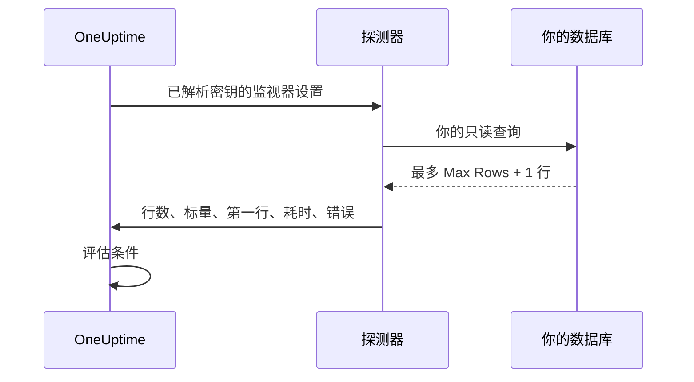

# SQL 查询监控

SQL 查询监视器按计划从探测器运行一条只读 SQL 查询，并根据结果告警：返回的行数、一个标量值、查询耗时，或者查询错误。它专为"运行一条查询并打开一个事件"的场景而设计，例如在最近五分钟内取消的订单数激增、队列表变得过大，或者某条关键记录消失时告警。

:::cards
- [创建只读用户](#创建只读用户): 监视器应使用的数据库登录账号。
- [创建监视器](#创建-sql-查询监视器): 连接一个探测器并输入查询。
- [编写查询](#编写查询): 把要告警的值放在第一列。
- [设置条件](#设置条件): 按计数、数值、慢查询或错误告警。
:::

## 工作原理

每次检查时，探测器连接到你的数据库，在只读上下文中运行你的查询，最多读回有限数量的行，然后向 OneUptime 上报一份精简的投影。随后监视器的条件会针对这份投影进行评估。

由于查询是从你网络内部的探测器运行的，OneUptime 永远不需要直接连接你的数据库，完整的结果集也永远不会离开探测器：上报回来的只是结果的一小份有限投影。



探测器只上报：

| 值 | 含义 |
|---|---|
| **Row Count** | 查询返回的行数（受 Max Rows 限制）。 |
| **标量值** | 第一行的第一列。对于 `SELECT COUNT(*)` 这类查询，这就是最自然的值。 |
| **First Row** | 以列和值的键值对表示的第一行，在检查摘要中作为上下文显示。 |
| **Execution Time** | 检查花费的时间（毫秒），包括建立连接，而不仅是查询。 |
| **查询错误** | 查询失败时经过清理的错误消息。 |

完整的结果集永远不会发送到 OneUptime，因此客户数据不会被复制到 OneUptime 的存储中。

## 支持的数据库

| 数据库 | 默认端口 |
|---|---|
| **PostgreSQL** | `5432` |
| **MySQL** | `3306` |
| **Microsoft SQL Server** | `1433` |

使用相同线路协议和 SQL 方言的 MySQL 兼容和 PostgreSQL 兼容引擎通常也可以使用，但官方只测试上面这三种引擎。

如果监视器连接的主机和端口是 [数据库](/docs/telemetry/databases) 页面上某个数据库的端点之一，它的告警和事件也会出现在该数据库的页面上（参见 [数据库上的告警](/docs/telemetry/databases#alerts-on-a-database)）。以监控密钥引用形式给出的主机不会被匹配。

## 安全模型

在生产数据库上运行客户提供的查询是敏感操作，因此 SQL 查询监视器在设计上就是只读的，并叠加了多层控制：

| 控制 | 作用 |
|---|---|
| **最小权限数据库用户**（主要控制） | 始终使用一个专用的只读数据库用户连接，该用户只能访问查询所需的表。这是最重要的控制，请参阅 [创建只读用户](#创建只读用户)。 |
| **只读执行** | 在 PostgreSQL 和 MySQL 上，探测器会打开一个 `READ ONLY` 事务，无论查询文本是什么，都会拒绝任何写入（包括可写的 CTE）。Microsoft SQL Server 没有只读事务，因此探测器在一个总会回滚的事务中运行。 |
| **单条语句、白名单查询** | 查询必须是以 `SELECT`、`WITH`、`VALUES` 或 `TABLE` 开头的单条语句。堆叠语句（`SELECT 1; DROP TABLE …`）以及 `INSERT`、`UPDATE`、`DELETE`、`DROP`、`EXEC` 和 `INTO` 等写入或 DDL 关键字，会在探测器建立连接之前被拒绝。这项检查只是安全网，不是边界：边界是只读用户。 |
| **语句超时** | 每条查询都有硬性时间限制。运行过久的查询会被取消。 |
| **行数受限** | 最多只读回 Max Rows 行（外加一行，用于检测截断），从而限制探测器的内存和数据量。 |
| **凭据脱敏** | 数据库错误在存储前会经过清理：密码、主机、用户名、数据库名以及任何连接字符串都会被隐去，因此凭据绝不会泄露到错误消息中。 |

## 开始之前

- 一个能通过网络访问你数据库主机和端口的 **探测器**。可以是 OneUptime 托管的探测器（如果你的数据库可以从互联网访问），也可以是运行在你网络内部的[自定义探测器](/docs/probe/custom-probe)。
- 一个 **只读数据库用户** 和连接信息（主机、端口、数据库名称、用户名、密码），或者在使用 SQL Server 集成身份验证时，一个只读的 Windows 或域身份。

## 创建只读用户

始终使用专用的只读用户连接。以管理员身份运行适合你所用引擎的语句，并把 `orders` 替换为你的数据库：

:::tabs
@tab PostgreSQL
```sql
-- PostgreSQL
CREATE USER oneuptime_ro WITH PASSWORD 'a-strong-password';
GRANT CONNECT ON DATABASE orders TO oneuptime_ro;
GRANT USAGE ON SCHEMA public TO oneuptime_ro;
GRANT SELECT ON ALL TABLES IN SCHEMA public TO oneuptime_ro;
-- Include tables created in the future:
ALTER DEFAULT PRIVILEGES IN SCHEMA public GRANT SELECT ON TABLES TO oneuptime_ro;
```
@tab MySQL
```sql
-- MySQL
CREATE USER 'oneuptime_ro'@'%' IDENTIFIED BY 'a-strong-password';
GRANT SELECT ON orders.* TO 'oneuptime_ro'@'%';
FLUSH PRIVILEGES;
```
@tab Microsoft SQL Server
```sql
-- Microsoft SQL Server
CREATE LOGIN oneuptime_ro WITH PASSWORD = 'a-strong-password';
USE orders;
CREATE USER oneuptime_ro FOR LOGIN oneuptime_ro;
ALTER ROLE db_datareader ADD MEMBER oneuptime_ro;
```
:::

如需更严格的授权，只授予该用户对查询所读取的表的 `SELECT` 权限。

## 创建 SQL 查询监视器

:::steps
### 开始一个新监视器

进入 **监视器**，点击 **创建监视器**。在 **监视器类型** 下点击 **更多监视器类型**，然后在 **Database Monitoring** 下选择 **SQL Query**，或在搜索框中输入 `query`。输入 **名称**，然后点击 **下一步**。

### 输入连接信息

选择 **Database Type**（端口会切换为该引擎的默认端口），然后填写主机、数据库名称和只读用户的凭据。不要直接输入密码，而是以[监控密钥](#为密码使用监控密钥)的形式引用它。每个字段都在[配置](#配置)中说明。

### 输入查询

在 **SQL Query** 中输入一条只读语句（参见[编写查询](#编写查询)）。

### 测试

点击 **测试监视器**，在保存之前从探测器运行一次查询。

### 设置条件

检查监视器初始带有的条件并添加你自己的条件（参见[设置条件](#设置条件)）。然后点击 **下一步**。

### 选择探测器并创建

选择能访问数据库的 **探测器** 和 **监控间隔**，然后点击 **创建监视器**。
:::

## 配置

| 字段 | 填写内容 |
|---|---|
| **Database Type** | PostgreSQL、MySQL 或 Microsoft SQL Server。选择类型会设置默认端口。 |
| **主机** | 探测器可以访问的数据库主机（例如 `db.internal`）。 |
| **端口** | 数据库端口。 |
| **数据库名称** | 要在其上运行查询的数据库。 |
| **Use Windows Integrated Authentication** | 仅限 Microsoft SQL Server。使用运行探测器的账户进行身份验证，而不是使用 SQL 用户名和密码。请参阅 [Windows 集成身份验证](#windows-集成身份验证)。 |
| **用户名** | 一个只读的最小权限数据库用户。 |
| **密码** | 数据库密码。我们强烈建议用 `{{monitorSecrets.name}}` 引用一个 [监控密钥](/docs/monitor/monitor-secrets)，而不是以纯文本输入密码（参见[为密码使用监控密钥](#为密码使用监控密钥)）。 |
| **SQL Query** | 要运行的只读查询（参见[编写查询](#编写查询)）。 |
| **Use SSL/TLS** | 启用后通过 TLS 连接。启用后，如果数据库使用自签名证书，你可以关闭 **Verify server certificate**。 |

### 更多字段

| 字段 | 默认值 | 最大值 | 限制内容 |
|---|---|---|---|
| **Connection Timeout (ms)** | `10000` | `30000` | 等待建立连接的时间。 |
| **Statement Timeout (ms)** | `15000` | `60000` | 查询可运行时间的硬性上限。 |
| **Max Rows** | `100` | `1000` | 从数据库读回的行数上限。 |

超过最大值的值会被降为最大值。

### Windows 集成身份验证

对于 Microsoft SQL Server，启用 **Use Windows Integrated Authentication** 即可使用探测器进程的身份打开受信任的连接。在此模式下，用户名和密码字段会被忽略，也不会传给驱动程序。由于探测器需要一个受你的域信任的身份，请为这种身份验证模式使用自托管的探测器。

| 探测器运行在 | 需要设置的内容 |
|---|---|
| **Windows** | 以一个拥有只读 SQL Server 登录名的域账户运行探测器服务。 |
| **Linux 或 macOS** | 为 SQL Server 所在的域配置 Kerberos，并给探测器进程一张有效的票据（例如通过 keytab）。官方的 Linux 探测器镜像包含 Microsoft ODBC Driver 18、unixODBC 和 Kerberos 客户端。把 Kerberos 配置和票据缓存挂载到容器中，确保探测器进程可以读取，如果它们不在默认位置，请设置 `KRB5_CONFIG` 或 `KRB5CCNAME`。 |

运行探测器的主机上需要安装 Microsoft ODBC Driver for SQL Server。官方探测器镜像自带 **ODBC Driver 18**。当你运行自托管或自定义的探测器时，探测器会自动检测并使用主机上注册的最新版本 `ODBC Driver N for SQL Server`（例如已安装的是 Driver 17 就用 Driver 17），不一定非要是 Driver 18。要固定使用某个驱动程序，请在探测器上把环境变量 `SQL_SERVER_ODBC_DRIVER` 设置为准确的驱动程序名称（例如 `ODBC Driver 17 for SQL Server`）。

SQL Server 必须有合适的 `MSSQLSvc` 服务主体名称，探测器与域控制器的时钟必须同步，并且探测器必须能通过该服务主体名称所覆盖的主机名解析并访问 SQL Server。只给受信任的身份授予监控查询所需的数据库权限。

## 编写查询

查询必须是 **一条只读语句**。它必须以 `SELECT`、`WITH`、`VALUES` 或 `TABLE` 之一开头。允许末尾有分号；不允许多条语句。写入和 DDL 关键字在查询中的任何位置都会被拒绝，包括 `INTO`，所以 `SELECT … INTO` 也会被拒绝。

探测器在每次检查时都会检查查询，而不是在保存时。违反这些规则的查询仍然可以保存，但之后的每次检查都会失败并报告 "Only read-only queries are allowed (must start with SELECT, WITH, VALUES, or TABLE)."，默认条件会让监视器离线。

让查询保持轻量、范围明确：它们会在每次检查时运行，因此优先使用有索引的列和较窄的时间窗口。下面的查询统计最近五分钟内取消的订单：

:::tabs
@tab PostgreSQL
```sql
-- Count recent cancellations (PostgreSQL)
SELECT COUNT(*) AS cancelled
FROM orders
WHERE status = 'CANCELLED'
  AND created_at > NOW() - INTERVAL '5 minutes';
```
@tab MySQL
```sql
-- The same idea on MySQL
SELECT COUNT(*) AS cancelled
FROM orders
WHERE status = 'CANCELLED'
  AND created_at > NOW() - INTERVAL 5 MINUTE;
```
@tab Microsoft SQL Server
```sql
-- The same idea on Microsoft SQL Server
SELECT COUNT(*) AS cancelled
FROM orders
WHERE status = 'CANCELLED'
  AND created_at > DATEADD(minute, -5, GETDATE());
```
:::

> [!TIP]
> 对于 `COUNT(*)` 这类查询，计数既可以作为 **Row Count** 获得（值为 `1`，因为只返回一行），也可以作为 **标量值** 获得（即来自第一列的计数本身）。要按"有多少"告警，请与 **标量值** 比较。

## 为密码使用监控密钥

为了让数据库密码永远不以纯文本形式存储在监视器上，请创建一个 [监控密钥](/docs/monitor/monitor-secrets)，并在密码字段中引用它：

:::steps
1. 进入 **监视器 → 设置 → 密钥**，创建一个监控密钥。
2. 为它命名（例如 `dbPassword`），并授予此监视器访问权限。
3. 在监视器的 **密码** 字段中输入 `{{monitorSecrets.dbPassword}}`。
:::

OneUptime 会在把配置交给探测器之前，在服务器端解析密钥。OneUptime 永远不会替你创建这些密钥：是否引用由你决定。**用户名**、**主机**、**数据库名称** 和 **SQL Query** 字段也接受密钥引用；**端口** 不接受。

## 设置条件

添加条件来决定监视器何时被视为在线、性能下降或离线。SQL 查询监视器可以使用以下检查：

| 过滤器类型 | 检查内容 |
|---|---|
| **SQL Is Online** | 数据库是否可以访问，以及查询是否成功。 |
| **SQL Query Row Count** | 返回的行数。用大于、小于或等于等运算符进行比较。 |
| **SQL Query Scalar Value** | 第一行的第一列。你输入的值是数字时按数字比较，否则按字符串比较。`COUNT(*)` 这类查询应使用这项检查。 |
| **SQL Query Execution Time (in ms)** | 查询耗时。适合发现变慢的数据库。 |
| **SQL Query Error** | 查询的错误消息。在它为空（或不为空），或匹配某个特定字符串时告警。 |
| **JavaScript Expression** | 对 `rowCount`、`scalarValue`、`firstRow`、`executionTimeInMs`、`queryError` 和 `isOnline` 求值一个自定义 JavaScript 表达式。请参阅 [JavaScript 表达式](/docs/monitor/javascript-expression#sql-查询监视器)。 |

数值阈值是整数：写 `10`，不要写 `10.5`。SQL Query 过滤器不能在一段时间内求值；每次检查都独立判断。

新的 SQL 查询监视器一开始有两个条件：**SQL Is Online** 为 false 时，监视器离线并宣布一个会自动解决的事件；**SQL Is Online** 为 true 时，将其标记为在线。**添加条件** 会在底部添加一个条件；请把它拖到在线条件之上，因为条件从上往下检查，第一个匹配的条件说了算。

### 示例：取消订单激增时告警

使用上面的查询：

| 条件 | 过滤器 |
|---|---|
| **性能下降** | `SQL Query Scalar Value` 大于 `10`。 |
| **离线** | `SQL Query Scalar Value` 大于 `50`，或 `SQL Is Online` 为 `false`。 |

为条件关联一个值班策略，以便呼叫合适的人。SQL 查询监视器没有自己的模板变量：事件标题可以用 `{{monitorName}}` 写出监视器名称，但无法引用查询的结果。

## 注意事项

- 查询在每次检查时都会运行，所以要保持轻量。使用索引和较窄的时间窗口，并依靠 Statement Timeout 作为兜底。
- 只上报行数、第一个单元格（标量）和第一行，因此请设计查询，让你要告警的值位于第一列。
- 如果结果因超过 Max Rows 而被截断，检查摘要会显示 **Rows Truncated**："Yes (result capped)"。只在需要时才提高 Max Rows；更大的结果集会占用探测器更多的内存。
- 写入和 DDL 始终会被拒绝。如果你需要测试写入路径，这个监视器并不适用。
- 优先使用监控密钥而不是纯文本密码，这样凭据在存储时保持加密。
- 查询失败的检查会在一秒后重试，最多再试三次，然后才报告错误，因此短暂的连接中断不会让监视器离线。在自托管的探测器上，可以用 `PROBE_MONITOR_RETRY_LIMIT` 设置重试次数。

## 故障排除

:::details 每次检查都失败并报告 "Only read-only queries are allowed"
查询没有以 `SELECT`、`WITH`、`VALUES` 或 `TABLE` 开头。前面有注释没关系；`SET` 或 `DECLARE` 则不行。请把它改写成一条只读语句。
:::

:::details 检查失败并报告 "Disallowed SQL keyword"
查询中的某处出现了写入、DDL 或执行类关键字，即使在 `SELECT` 内部也一样，例如 `INTO` 或 `EXEC`。带引号的字符串和注释中的词不算。请删除该关键字，或把逻辑放进只读用户可以读取的视图中。
:::

:::details 检查超时
探测器未能在 **Connection Timeout (ms)** 内建立连接，或者查询运行时间超过了 **Statement Timeout (ms)**。确认探测器能访问该主机和端口，然后让查询更轻量：在较短的时间窗口内按有索引的列过滤。
:::

:::details 连接因证书错误失败
数据库的证书是自签名的，或者不被探测器信任。关闭 **Verify server certificate**（在打开 **Use SSL/TLS** 后出现），或者给数据库配置一个探测器信任的证书。
:::

:::details Windows 集成身份验证失败
探测器需要 Microsoft ODBC Driver for SQL Server，以及一个受你的域信任的身份。运行官方探测器镜像或安装该驱动程序，然后按照 [Windows 集成身份验证](#windows-集成身份验证) 检查设置。
:::

## 后续步骤

:::cards
- [数据库健康监控](/docs/monitor/database-health-monitor): 无需编写 SQL 即可关注连接、锁和复制。
- [监控密钥](/docs/monitor/monitor-secrets): 让数据库密码保持加密。
- [JavaScript 表达式](/docs/monitor/javascript-expression): 编写组合多个值的条件。
- [自定义探针](/docs/probe/custom-probe): 从你的网络内部运行检查。
:::
