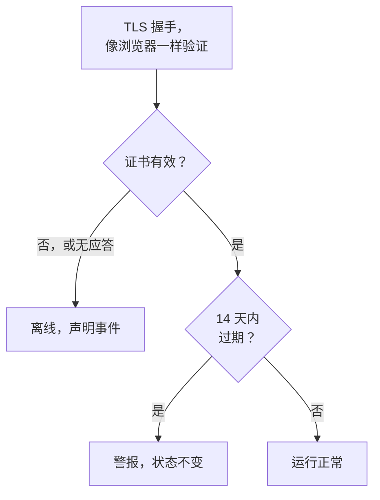

# SSL 证书监控

SSL 证书监视器像浏览器一样检查您的网站和服务出示的 TLS 证书，并在证书过期之前提醒您。当证书不再有效时（已过期、自签名、为其他主机名签发，或来自浏览器不信任的颁发机构），它还会让监视器离线。

:::cards
- [创建监视器](#创建-ssl-证书监视器): 在控制台中完成六个步骤。
- [默认标准](#默认标准): 无需设置，提前 14 天发出过期警告。
- [监控标准](#监控标准): 有效性、过期和自签名证书。
- [故障排查](#故障排查): 自签名证书和内部证书。
:::

## 工作原理

每次检查时，探测器会与 URL 中的主机和端口（除非 URL 指定了其他端口，否则为 `443`）建立 TLS 连接，并像浏览器那样验证证书：受信任的颁发机构、匹配的主机名，以及包含今天在内的有效期。即使证书未通过验证，探测器仍会读取它，因此无论如何都会记录其到期日期、颁发者和指纹。连接失败、超时或出示无效证书时会重试，最多重试您允许的次数。然后 OneUptime 用监视器的条件评估结果。

失去自身网络连接的探测器不会报告任何结果，因此它无法将您的证书标记为无效。

## 开始之前

- **可以创建监视器的角色**：Project Owner、Project Admin、Project Member、Monitor Admin 或 Monitor Member，或者拥有 Create Monitor 权限的自定义角色。
- **能够访问该主机和端口的探测器。** 每个新监视器都会选中您项目的默认探测器。私有网络中的服务需要该网络内的 [自定义探测器](/docs/probe/custom-probe)。

## 创建 SSL 证书监视器

:::steps
### 开始创建新监视器

前往 **监视器**，点击 **创建监视器**。在 **监视器类型** 下选择 **SSL Certificate**。

### 命名

输入 **名称**，例如 `example.com certificate`，然后点击 **下一步**。

### 输入 URL

在 **网站 URL** 中输入要检查其证书的网站，例如 `https://example.com`。对于其他端口上的服务，请带上端口：`https://example.com:8443`。

### 测试

点击 **测试监视器**，在 **选择探测器** 中选择一个探测器，然后点击 **运行测试**。**监视器测试结果** 会显示探测器获取的证书及其颁发者和到期日期。

### 检查条件

**监视器条件** 从 [默认标准](#默认标准) 开始：证书无效时为离线，14 天内过期时发出警报。如有需要可修改，然后点击 **下一步**。

### 选择探测器并创建

保留或修改 **探测器** 和 **监控间隔**（初始为 **每 5 分钟**；SSL 证书监视器提供 5 分钟或更长的间隔），然后点击 **创建监视器**。监视器页面随即打开。
:::

## 配置选项

| 字段 | 默认值 | 要填写的内容 |
| --- | --- | --- |
| **网站 URL** | 无 | 要检查其证书的网站，例如 `https://example.com` 或 `https://example.com:8443`。只使用主机和端口；路径会被忽略。 |
| **请求超时（秒）**（在 **更多字段** 下） | `60` | 每次尝试等待 TLS 握手的时间。最长 60 秒。 |
| **失败时重试**（在 **更多字段** 下） | 探测器的默认值，通常为 `3` | 失败的尝试要重试多少次。最多 3 次。 |

**失败时重试** 计算的是第一次尝试 _之后_ 的重试次数，因此 `0` 表示检查运行一次，`2` 表示最多运行三次。留空时使用探测器的默认值：3，除非探测器的 `PROBE_MONITOR_RETRY_LIMIT` 另有规定。连接错误、证书验证失败和超时都会重试，两次尝试之间暂停一秒。

## 监控标准

条件决定证书何时算作正常、性能下降或有问题，以及是否因此声明事件或创建警报。每个条件检查一个或多个筛选器：

| 筛选器 | 条件 | 检查内容 |
| --- | --- | --- |
| **Is Valid Certificate** | **是**、**否** | 证书通过浏览器的检查：受信任的颁发机构、匹配的主机名，以及包含今天在内的有效期。端点没有应答时为 **否**。 |
| **Is Not A Valid Certificate** | **是**、**否** | 与 **Is Valid Certificate** 相反：证书未通过这些检查或无法检查时为 **是**。 |
| **Is Expired Certificate** | **是**、**否** | 证书的到期日期已过。 |
| **Is Self Signed Certificate** | **是**、**否** | 证书或其链中的某个证书是自签名的。 |
| **Expires In Days** | **Greater Than**、**Less Than**、**Greater Than Or Equal To**、**Less Than Or Equal To** | 距证书过期的天数。 |
| **Expires In Hours** | **Greater Than**、**Less Than**、**Greater Than Or Equal To**、**Less Than Or Equal To** | 距证书过期的小时数。 |

**Expires In Days** 按整天计算：14 天 20 小时后过期的证书还剩 14 天。**Expires In Hours** 以同样的方式按整小时计算。

有两个或更多筛选器时，**匹配条件** 决定是 **全部** 筛选器都必须匹配，还是 **任意** 一个匹配即可。条件的 **操作** 决定它做什么：更改监视器状态、创建警报、声明事件，或其中任意几项。

### 默认标准

新的 SSL 证书监视器以三个条件开始，因此无需任何设置就能在证书过期之前提醒您：

1. **证书无效** — 证书已过期、是自签名的、为其他主机名签发或由不受信任的机构签发，或者因端点没有应答而无法检查。监视器被标记为 **离线**，并创建名为“_monitor name_ certificate is not valid”的事件。事件的根本原因会说明是哪种情况。证书再次有效时，事件会自行解决。
2. **证书即将过期** — 证书有效，但将在 14 天内过期。会创建名为“_monitor name_ certificate expires soon”的 **警报**。
3. **证书有效** — 监视器被标记为 **运行正常**。

“即将过期”的提醒是警报，而不是事件：它不会显示在您的状态页上，除非您为它添加值班策略，否则不会呼叫任何人，也不会改变监视器的状态。它使用您项目的第二个警报严重程度，在新项目中为 **Low**。更新后的证书被获取后，监视器会回到“证书有效”，警报会自行解决。

条件从上到下检查，第一个匹配的条件决定接下来发生什么。因此“即将过期”位于“有效”之上：即将过期的证书仍然有效，所以会同时匹配两者。

要更早收到提醒，请修改“即将过期”条件中 **Expires In Days** 筛选器的值，例如改为 `30`。要改为呼叫某人，请打开该条件的 **操作**：打开 **当过滤器匹配时，声明事件。** 或者保留警报，并在 **值班策略** 下为它添加值班策略。

:::details 为在此提醒出现之前创建的监视器添加提醒
在 OneUptime 添加此提醒之前创建的监视器没有“即将过期”条件。要添加它：

1. 在监视器上打开 **配置 → 标准**，然后点击 **编辑监控条件**。
2. 点击 **添加条件**。将其筛选器设为 **Is Valid Certificate** / **是**，点击 **添加过滤器**，并将第二个设为 **Expires In Days** / **Less Than Or Equal To** / `14`。将 **匹配条件** 保持为 **全部**（有两个筛选器后，它会出现在筛选器下方）。
3. 在 **操作** 下打开 **当过滤器匹配时，创建警报。** 并保持 **当过滤器匹配时，更改监视器状态。** 关闭，使它创建警报而不改变监视器状态。
4. 将新条件拖到把监视器标记为在线的条件上方，然后保存。
:::

### 示例条件

| 目标 | 筛选器 | 条件 | 值 |
| --- | --- | --- | --- |
| 提前一个月提醒 | **Expires In Days** | **Less Than Or Equal To** | `30` |
| 在最后一天呼叫某人 | **Expires In Hours** | **Less Than** | `24` |
| 仅在证书过期后才离线 | **Is Expired Certificate** | **是** | — |
| 标记自签名证书 | **Is Self Signed Certificate** | **是** | — |

关于过期的条件必须位于将证书标记为有效的条件之上：即将过期的证书仍然有效，而第一个匹配的条件生效。

## 最佳实践

1. **给自己留出续期时间** — 默认提醒在过期前 14 天发出，适合自动续期的证书。如果您续期需要更长时间（购买的证书或变更流程），请提高到 30 天。
2. **监控每个端点** — 如果您有多个域名或子域名，请为每个创建一个监视器。每个都可能有自己的证书。
3. **包含其他端口** — 在 `443` 以外的端口（例如 `8443`）上提供 TLS 的服务也有证书。请在 URL 中写上端口。
4. **续期后检查** — 续期证书后，请查看监视器的下一次结果：它显示的到期日期应当是新的。

## 故障排查

:::details 证书在我的浏览器中正常，但监视器说它无效
事件的根本原因会说明原因。常见原因是服务器发送证书时没有附带中间证书：浏览器往往会自行补全，探测器则不会。请将服务器配置为发送完整的证书链。另一个原因是 URL 中的主机名不在证书上。
:::

:::details 我在监控一个使用自签名证书的内部服务
自签名证书永远不会有效，因此默认条件会让监视器保持离线。**Is Self Signed Certificate**、**Is Expired Certificate** 和 **Expires In Days** 对它仍然有效，因此请基于它们构建条件。在 **配置 → 标准** 中：

1. 在“无效”条件中点击 **添加过滤器**，将新筛选器设为 **Is Self Signed Certificate** / **否**，并将 **匹配条件** 设为 **全部**。当端点没有应答或证书存在其他问题时，该条件仍会让监视器离线。
2. 添加一个 **Is Expired Certificate** / **是** 的条件，将监视器标记为 **离线** 并声明事件，然后把它拖到最上方。
3. 在“即将过期”条件中，把 **Is Valid Certificate** / **是** 替换为 **Is Expired Certificate** / **否**，让提醒也覆盖自签名证书。

在证书有效期内，没有条件匹配，监视器显示其默认状态 **运行正常**。
:::

:::details 监视器离线，提示“could not be checked because the endpoint is not reachable”
探测器无法与主机和端口建立 TLS 连接。请检查 URL 中的端口，以及防火墙是否放行探测器。私有网络中的主机需要 [自定义探测器](/docs/probe/custom-probe)。
:::

## 后续步骤

:::cards
- [网站监控](/docs/monitor/website-monitor): 检查网站本身是否应答。
- [域名监控](/docs/monitor/domain-monitor): 在域名注册过期之前收到提醒。
- [升级规则](/docs/on-call/escalation-rules): 决定警报和事件呼叫谁。
- [事件概览](/docs/incidents/index): 监视器声明事件之后会发生什么。
:::
