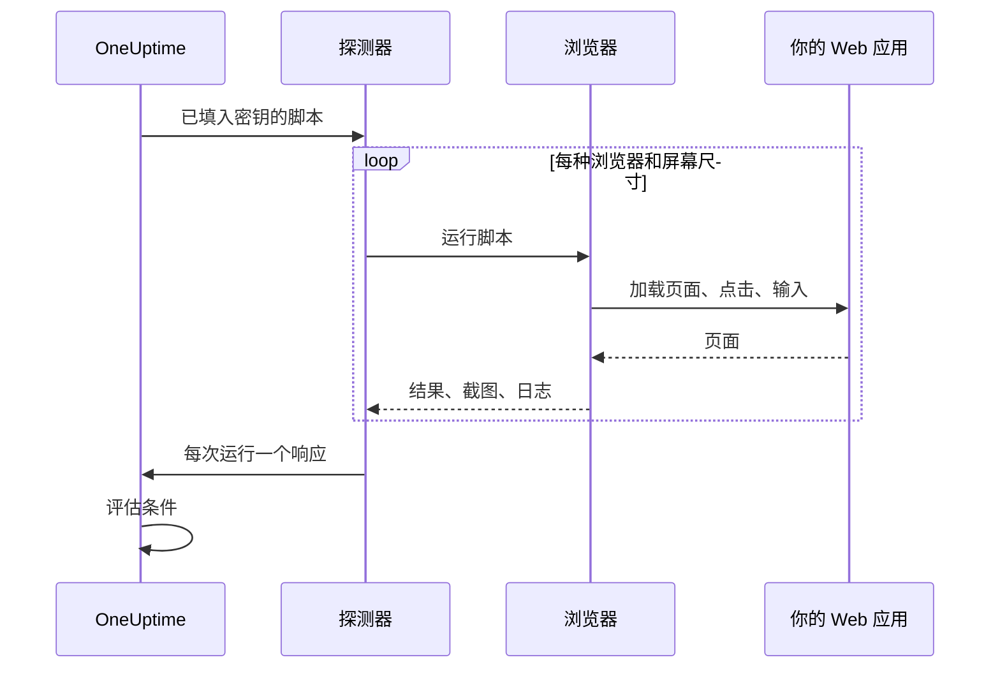

# 合成监控

合成监视器按计划用你编写的 Playwright 脚本在真实浏览器中驱动你的 Web 应用：它打开页面、填写表单、点击走完一条用户旅程，旅程失败时检查也会失败。用它来发现正常运行时间检查看不到的故障：不再能用的登录、点了没反应的结账按钮、永远加载不完的仪表板。

:::cards
- [创建监视器](#创建合成监视器): 编写脚本，选择浏览器和屏幕尺寸。
- [编写脚本](#编写脚本): 从一个可直接运行的登录旅程开始。
- [截图](#截图): 查看运行失败时页面的样子。
- [脚本可以使用什么](#脚本中可用的模块): Playwright、HTTP、加密和指标。
:::

## 工作原理

每次检查时，探测器会针对你选择的每种浏览器和屏幕尺寸，依次各运行一次你的脚本。每次运行都会启动一个全新的浏览器，没有之前运行留下的 Cookie 或存储；脚本驱动自己的页面、截图，然后返回结果或抛出错误。探测器上报每一次运行，OneUptime 再据此评估你的条件。



| 屏幕类型 | 视口 |
| --- | --- |
| Mobile | 360 × 640 |
| Tablet | 1024 × 768 |
| Desktop | 1920 × 1080 |

浏览器是 Chromium 和 Firefox。

## 开始之前

- 一个能访问你的 Web 应用的 **探测器**。对于你网络内部的应用，请使用[自定义探测器](/docs/probe/custom-probe)。探测器的 Docker 镜像包含 Chromium 和 Firefox；在 Docker 之外运行的探测器需要自行安装它们。
- 旅程需要的所有密码和令牌，都应保存为 [监控密钥](/docs/monitor/monitor-secrets)。

## 创建合成监视器

:::steps
### 开始一个新监视器

进入 **监视器**，点击 **创建监视器**。在 **监视器类型** 下点击 **更多监视器类型**，然后在 **Synthetic Monitoring** 下选择 **Synthetic Monitor**，或在搜索框中输入 `playwright`。输入 **名称**，然后点击 **下一步**。

### 添加脚本

在 **Playwright Code** 编辑器中编写脚本。可以从[下面的示例](#编写脚本)开始。

### 选择浏览器和屏幕尺寸

在 **浏览器类型** 下勾选浏览器，在 **屏幕类型** 下勾选尺寸。脚本会针对每种组合各运行一次，因此两种浏览器和三种尺寸意味着每次检查运行六次。在 **更多字段** 下，**出错时的重试次数** 可以把失败的运行最多重试 5 次。

### 测试

点击 **测试监视器**，从探测器运行一次脚本，查看每次运行的结果、日志和截图。

### 检查条件

监视器一开始有两个条件：任何一次运行失败时变为离线并宣布一个事件，没有运行失败时变为在线。你可以修改它们或添加自己的条件（参见[条件](#条件)），然后点击 **下一步**。

### 选择探测器并创建

选择 **探测器** 和 **监控间隔**（合成监视器提供 5 分钟或更长的间隔），然后点击 **创建监视器**。
:::

## 编写脚本

脚本是一个 `async` 函数的函数体。`page` 是一个已经打开、兼容 Playwright 的页面；驱动它，用 `return` 返回结果，用 `throw`（或让某个 Playwright 调用超时）让运行失败。下面的示例先登录，再检查仪表板是否加载：

```javascript title="Synthetic monitor script"
await page.goto("https://app.example.com/login");
screenshots["login-page"] = await page.screenshot();

await page.fill("#email", "monitoring@example.com");
await page.fill("#password", "{{monitorSecrets.AppPassword}}");
await page.click("button[type=submit]");

// Fails the run if the dashboard does not appear within 10 seconds.
await page.waitForSelector(".dashboard", { timeout: 10000 });
screenshots["dashboard"] = await page.screenshot();

console.log(`Signed in on ${browserType}, ${screenSizeType}`);

return {
  data: { title: await page.title() },
};
```

| 目的 | 做法 | OneUptime 记录的内容 |
| --- | --- | --- |
| 上报结果 | `return { data: ... }` | 本次运行的 **结果**。只保留 `data`。 |
| 让运行失败 | `throw new Error("...")`，或让某个等待超时 | 本次运行的 **脚本错误**。 |
| 保留证据 | `screenshots["name"] = await page.screenshot()` | 一张截图，即使运行失败也会保留。 |
| 留下痕迹 | `console.log(...)` | 本次运行的日志消息。 |

要查看这些运行，请打开监视器的 **概览**：**监视器摘要** 卡片中每种浏览器和屏幕尺寸各有一个区块，**显示更多详情** 会显示每次运行的截图。

### 使用 Playwright

我们使用 Playwright 来模拟用户交互。`page` 值是为本次执行创建的页面的一个安全、兼容 Playwright 的外观层。常用的 `Page`、`Locator`、`Frame`、`ElementHandle`、`JSHandle`、`Request`、`Response`、键盘、鼠标和浏览器上下文方法都可以使用，包括导航、定位器、点击、表单输入、页面求值、弹出窗口、更多页面、检查响应以及截图。你可以通过 `page.context()` 访问本次执行的浏览器上下文，例如打开新页面或处理弹出窗口。

合成脚本不在探测器的 Node.js 进程中运行。值以复制的数据或与本次执行绑定的不透明能力的形式跨越运行时边界，因此一些 Playwright API 的行为有所不同，或者完全不能用：

| 不可用 | 替代做法 |
| --- | --- |
| 启动或连接浏览器的方法、CDP 会话、请求路由、暴露的绑定、Playwright 私有字段，以及任何读写主机文件系统路径的选项。因此 `page.context().browser()` 不可用。 | 使用提供给你的页面和浏览器上下文。 |
| 事件监听器（`page.on(...)`、`page.once(...)`）：调用它们会失败并给出明确的错误。 | 对话框和弹出窗口使用 `page.waitForEvent(...)`，或者使用以字符串或正则表达式匹配的响应和请求等待。 |
| 事件、请求、响应和 URL 等待方法的函数谓词。 | 字符串或正则表达式匹配器、定位器或显式轮询。 |
| 同步的框架访问器（`page.frames()`、`page.mainFrame()`、`page.frame(...)`）。 | iframe 使用 `page.frameLocator(...)`。 |
| `page.request.*` | HTTP 请求使用全局的 `axios`。 |
| 整页截图和 PDF 输出。 | 视口截图，它保留下面描述的失败证据行为。 |

`page.waitForNavigation(...)`、`page.setDefaultTimeout(...)` 和 `page.setDefaultNavigationTimeout(...)` 都受支持。`page.waitForEvent(...)` 可以等待 `dialog`、`domcontentloaded`、`load`、`popup`、`request`、`requestfailed`、`requestfinished` 和 `response`。传给 `page.evaluate()` 等方法的求值函数在被监控的浏览器页面中执行，绝不会在探测器进程中执行。每次执行最多可以使用八个页面。

浏览器权限仅限于地理位置和通知。剪贴板、摄像头、麦克风、MIDI、本地字体以及其他主机设备权限，监控脚本都无法使用。

### 脚本返回的内容

脚本返回的数据在存储前会序列化为 JSON：在普通对象和数组中，`NaN` 和 `Infinity` 变成 `null`，值为 `undefined` 的属性和函数被丢弃，`Date` 对象变成 ISO 字符串，与 `JSON.stringify` 的处理方式相同。类实例和其他非普通对象会被整个丢弃。`BigInt` 会变成字符串。存在循环引用、嵌套超过 30 层或大于 5 MB 的结果会让运行失败。

### 根据返回的数据告警

脚本作为 `data` 返回的内容就是监视器的 **Result Value**，条件可以对它进行比较。当 `data` 是对象或数组时，在 Result Value 过滤器上填写 **字段路径（可选）** 即可比较其中一个字段，例如 `status`、`timings.loadTime` 或 `errors[0].message`。过滤器会针对监视器运行的每种浏览器和屏幕尺寸的数据进行检查，只要其中任何一个匹配就算匹配。路径和条件的工作方式请参阅 [根据返回的数据告警](/docs/monitor/custom-code-monitor#根据返回的数据告警)。

## 截图

脚本上下文中有一个预先声明的 `screenshots` 对象。你可以在脚本中的任何位置把截图赋值给它，这些截图 **即使脚本抛出错误** 也会被保存（包括断言失败、超时或意外错误），因此你能准确看到运行失败时页面的样子。保存的截图会显示在 OneUptime 仪表板中对应的那次监视器运行下。

```javascript
// Capture screenshots via the `screenshots` side-channel — they are preserved on both success and failure.

await page.goto("https://app.example.com/login");
screenshots["login-page"] = await page.screenshot();

await page.fill("#email", "user@example.com");
await page.fill("#password", "wrong");
await page.click("button[type=submit]");

// If the next assertion throws, the `login-page` screenshot above is still captured.
await page.waitForSelector(".dashboard", { timeout: 5000 });

screenshots["dashboard"] = await page.screenshot();

return {
  data: "Login succeeded",
};
```

每次运行最多保留 20 张截图，每张最多 10 MB，总共最多 50 MB。只要把截图放进监视器的事件或告警描述中，失败的运行所打开的事件或告警的页面以及相关邮件里也能显示截图。请参阅 [显示截图](/docs/monitor/incident-alert-templating#合成监控器)。

:::details 返回截图（旧方式）
为了向后兼容，你也可以把截图作为返回值的一部分从脚本中返回。以这种方式返回的截图 **只有** 在脚本正常结束时才会保存；如果脚本抛出错误，它们就会丢失。需要失败证据时，请优先使用上面的旁路方式。

```javascript
// Legacy pattern — screenshots only captured on successful return.
const screenshots = {};
screenshots["screenshot-name"] = await page.screenshot();

return {
  data: "Hello World",
  screenshots: screenshots,
};
```
:::

## 使用监控密钥

在脚本中的任何位置用 `{{monitorSecrets.NAME}}` 引用密钥。OneUptime 会在脚本到达探测器之前，把引用替换为密钥的值，并且是纯文本。因此，要把密钥当作字符串使用时请用引号括起来，要当作数字或布尔值使用时则不加引号：

```javascript
// Used as a string: wrap it in quotes.
const password = "{{monitorSecrets.AppPassword}}";

// Used as a number or a boolean: leave it bare.
const retryLimit = {{monitorSecrets.RetryLimit}};
const verbose = {{monitorSecrets.Verbose}};
```

如何创建密钥并选择哪些监视器可以使用它，请参阅 [监控密钥](/docs/monitor/monitor-secrets)。

## 自定义指标

你可以在脚本中用 `oneuptime.captureMetric()` 函数记录自定义指标。这些指标存储在 OneUptime 中，可以通过 Metric Explorer 在仪表板上绘制成图表。

```javascript
oneuptime.captureMetric(name, value, attributes);
```

| 参数 | 类型 | 说明 |
| --- | --- | --- |
| `name` | string，必填 | 指标名称（例如 `"dashboard.load.time"`）。保存时会自动加上 `custom.monitor.` 前缀。 |
| `value` | number，必填 | 指标的数值。 |
| `attributes` | object，可选 | 用于补充上下文的键值对。 |

### 示例

```javascript
await page.goto("https://app.example.com");

const startTime = Date.now();
await page.waitForSelector("#dashboard-loaded");
const loadTime = Date.now() - startTime;

// Capture page load time, tagged with this run's browser and screen size
oneuptime.captureMetric("dashboard.load.time", loadTime, {
  page: "dashboard",
  browser: browserType,
  screen: screenSizeType,
});

screenshots["dashboard"] = await page.screenshot();

return {
  data: { loadTime },
};
```

记录之后，这些指标会以 `custom.monitor.dashboard.load.time` 这样的名称出现在 Metric Explorer 中，也会出现在监视器 **指标** 页面的 **自定义指标** 下。OneUptime 会给每个数据点加上监视器和探测器；要按浏览器或屏幕尺寸筛选，请像示例那样把它们作为属性传入。

一次运行最多记录 100 个指标，且只能是数值；OneUptime 对每次检查的所有运行合计最多保留 100 个。与自定义代码监视器一样，有些属性名称是[保留的](/docs/monitor/custom-code-monitor#保留的属性键)，脚本设置它们时会被丢弃。

## 条件

| 过滤器类型 | 检查内容 |
| --- | --- |
| **错误** | 某次运行抛出的错误（如果有）。 |
| **Result Value** | 某次运行返回的 `data`。 |
| **执行时间（毫秒）** | 某次运行花费的时间。 |
| **浏览器类型** | 某次运行使用的浏览器：**Equal To** 或 **Not Equal To**。 |
| **Screen Size** | 某次运行使用的屏幕尺寸：**Equal To** 或 **Not Equal To**。 |

每个过滤器都会针对每一次运行进行检查，只要有一次运行匹配就算匹配。过滤器是分别检查的，而不是逐次运行地检查：**错误** Is Not Empty 加上 **浏览器类型** Equal To `Firefox`，会在任意一次运行失败、且其中一次运行使用了 Firefox 时匹配，而不只是在 Firefox 那次运行失败时匹配。要单独关注某一种浏览器，请为它单独创建一个监视器。

在事件和告警模板中，每次运行都在 `{{syntheticResponses}}` 中：请参阅 [事件与告警模板](/docs/monitor/incident-alert-templating#合成监控器)。

## 脚本中可用的模块

| 名称 | 说明 |
| --- | --- |
| `page` | 用于与浏览器交互的安全、兼容 Playwright 的外观层。你可以通过 `page.context()` 访问本次执行的浏览器上下文来创建页面或处理弹出窗口，但启动/连接浏览器、CDP、路由、绑定、私有字段和主机路径选项都不可用。 |
| `screenshots` | 一个预先声明的对象，你把截图赋值给它（例如 `screenshots['login-page'] = await page.screenshot()`）。赋值到这里的截图即使脚本随后抛出错误也会保存。 |
| `browserType` | 本次运行使用的浏览器：`Chromium` 或 `Firefox`。 |
| `screenSizeType` | 本次运行使用的屏幕尺寸：`Mobile`、`Tablet` 或 `Desktop`。 |
| `axios` | 基于 Promise 的 HTTP 客户端，支持以函数方式调用 Axios，以及 `request`、`get`、`head`、`options`、`post`、`put`、`patch`、`delete` 和 `create`。请求体最多 1 MB，响应最多 5 MB；最多跟随 5 次重定向，最长 30 秒后超时。自定义传输、适配器、套接字、代理以及代理覆盖都不可用。 |
| `crypto` | 在浏览器 Worker 中实现的 SHA-256 哈希、HMAC-SHA-256、`randomBytes`、`randomInt` 和 `randomUUID`。 |
| `console` | `console.log`、`info`、`warn` 和 `error`。消息与每次运行一起保留。 |
| `oneuptime.captureMetric` | 记录自定义指标。请参阅[自定义指标](#自定义指标)。 |
| `http` | 一个带缓冲、仅限客户端的兼容外观层，支持 `request`、`get` 和 `Agent`。 |
| `https` | 仅限客户端的 `http` 外观层的 HTTPS 版本。 |
| `Buffer`、`setTimeout`、`setInterval` | 以及它们对应的 `clear` 函数。 |

脚本在浏览器 Worker 中运行，而不是在 Node.js 中，并且无法打开自己的网络连接：`fetch`、`XMLHttpRequest` 和 `WebSocket` 都被阻止。HTTP 请求请使用 `axios`。

## 限制

| 限制 | 默认值 | 探测器设置 |
| --- | --- | --- |
| 脚本超时 | 60 秒。超时的 Worker 及其所有浏览器子进程都会被终止。 | `PROBE_SYNTHETIC_MONITOR_SCRIPT_TIMEOUT_IN_MS` |
| 一次运行整个进程树的内存 | 1.5 GiB | `PROBE_SYNTHETIC_MONITOR_MAX_PROCESS_TREE_RSS_BYTES` |
| 可写的浏览器存储 | 256 MiB | `PROBE_SYNTHETIC_MONITOR_MAX_DISK_BYTES` |
| 一个探测器上同时进行的运行 | 4 | `PROBE_SYNTHETIC_MONITOR_MAX_CONCURRENCY` |
| 每次执行的页面数 | 8 | — |

超出内存或存储限制会终止该次执行并删除其临时配置文件。探测器设置适用于自托管的探测器；Helm Chart 为每个探测器设置相同的值（例如 `syntheticMonitorScriptTimeoutInMs`）。

浏览器随探测器的 Docker 镜像一起提供，因此更新镜像后，自托管的探测器就会获得更新的浏览器。

## 故障排除

:::details 运行失败了，但我看不出原因
在每个有风险的步骤之前把截图赋值给 `screenshots` 对象。即使运行失败它们也会保留，并显示页面在那一刻的样子。
:::

:::details `page.on(...)` 抛出错误
事件监听器无法跨越隔离边界。对话框和弹出窗口请使用 `page.waitForEvent(...)`，或者使用以字符串或正则表达式匹配的响应或请求等待。
:::

:::details 运行超时
用 `page.waitForSelector(...)` 等待特定元素，并设置比脚本自身限制更短的 `timeout`，这样运行会在慢的那一步失败，并给出清楚的错误。
:::

:::details 自托管的探测器提示找不到浏览器可执行文件
探测器运行在它的 Docker 镜像之外，并且没有安装 Chromium 或 Firefox。请运行探测器的镜像，或在那台机器上安装浏览器。
:::

## 后续步骤

:::cards
- [自定义代码监控](/docs/monitor/custom-code-monitor): 不用浏览器，用脚本检查 API。
- [显示截图](/docs/monitor/incident-alert-templating#合成监控器): 把失败运行的截图放进事件。
- [监控密钥](/docs/monitor/monitor-secrets): 不把凭据写进脚本。
:::
