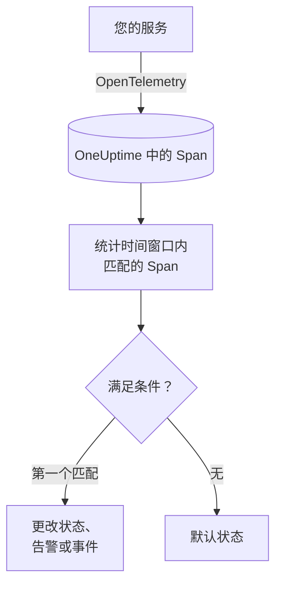

# 跟踪监控

跟踪监视器在一个时间窗口内统计您的服务发送到 OneUptime、且与您的过滤器（Span 名称、状态、服务、属性）匹配的 Span。当计数满足您的条件时，它会更改监视器的状态、创建告警或声明事件。可以用它对某个端点的失败请求、错误 Span 激增，或已经停止发送追踪的服务告警。

:::cards
- [创建监视器](#创建跟踪监视器): 选择要统计的 Span 以及何时告警。
- [Span 状态码](#span-状态码): OK、ERROR 和 UNSET 的含义，以及该按哪个过滤。
- [如何评估](#如何评估): 时间窗口、计数和一分钟的周期。
- [条件](#条件): 阈值、异常检测和默认值。
:::

## 工作原理

OneUptime 每分钟统计一次与监视器过滤器匹配、且在其时间窗口内开始的 Span。它把这个计数从上到下与监视器的条件比较，第一个匹配的条件决定发生什么。如果没有条件匹配，监视器会回到默认状态。

## 开始之前

- 您的服务通过 OpenTelemetry 把追踪发送到 OneUptime。请参阅 [OpenTelemetry](/docs/telemetry/open-telemetry)。
- 在追踪浏览器中查到您要监视的 Span 的确切名称：Span 名称由您的埋点决定，例如 `POST /api/checkout` 或 `GET`。

## 创建跟踪监视器

:::steps
### 开始创建新监视器

前往 **监视器**，点击 **创建监视器**。

### 选择 Traces

在 **监视器类型** 下点击 **更多监视器类型**，然后在 **遥测** 下选择 **追踪**，或在搜索框中输入 `traces`。输入 **名称**，然后点击 **下一步**。

### 选择要统计的 Span

在 **追踪监视器配置** 中设置 **Span 名称**、**监视器跟踪（时间）**、**按跨度状态过滤**。留空的过滤器匹配所有 Span。过滤器下方的 **Spans 预览** 显示它们当前匹配的 Span。

### 缩小范围（可选）

打开 **更多字段**，按遥测服务、基础设施实体或属性过滤。

### 设置条件

**监视器条件** 卡片一开始有两个条件：没有 Span 匹配时离线并创建事件；至少有一个匹配时在线。请把它们改成您想告警的情况（请参阅 [条件](#条件)）。

### 创建监视器

点击 **创建监视器**。监视器会在其 **概览** 页面打开，第一次评估在一分钟内运行。
:::

> [!TIP]
> 若要在 AI 功能回答不佳（失败、拒绝、被截断、为空、被标记或缓慢的回答）时收到通知，请改为在 **遥测** 下选择 **AI / LLM**。该监视器会替您读取追踪中的 AI 调用，无需编写任何 Span 过滤器。请参阅 [AI / LLM 可观测性](/docs/telemetry/ai-llm-observability#ai-回答不佳时收到通知)。

## 查询内容

| 字段 | 匹配什么 | 默认值 |
| --- | --- | --- |
| **Span 名称** | 名称包含此文本的 Span，不区分大小写。 | 空：所有 Span |
| **监视器跟踪（时间）** | 在最近 5 秒到最近 24 小时内开始的 Span。 | **最近 1 分钟** |
| **按跨度状态过滤** | 具有所选任一状态的 Span：**未设置**、**正常** 或 **错误**。 | 空：所有状态 |
| **按遥测服务过滤**（在 **更多字段** 中） | 来自所选任一服务的 Span。 | 空：所有服务 |
| **Filter by Infrastructure Entity**（在 **更多字段** 中） | 来自所选任一主机、Pod、容器及其他实体的 Span。 | 空：所有实体 |
| **按属性过滤**（在 **更多字段** 中） | 属性满足所有条件的 Span。每个条件都有自己的运算符，例如“等于”或“包含”。 | 空：无条件 |

Span 必须匹配您设置的所有过滤器才会被计数。

### Span 状态码

- **OK** — 操作已由应用程序代码或追踪管道明确标记为成功
- **ERROR** — 操作遇到错误
- **UNSET** — 未设置错误状态。这是 OpenTelemetry 的默认状态

UNSET 并不表示数据缺失。OpenTelemetry 埋点会在操作失败时将状态设为 ERROR，而让成功的 Span 保持为 UNSET，因此在健康的服务上，大多数 Span 都是 UNSET。OneUptime 会以绿色将它们显示为“Unset (no error)”。记录异常不会改变 Span 的状态，因此 UNSET 的 Span 仍可能带有异常；这些异常会与该 Span 一起列出。若要针对失败发出告警，请按 ERROR 过滤。若要统计所有未失败的 Span，请同时选择 OK 和 UNSET。

如果您希望成功的请求显示为 OK，请在 **追踪 > 设置 > 管道** 下添加一个追踪管道，其过滤条件为 **状态 = 未设置**，并包含一个 **状态重映射器**，用于将 `http.response.status_code` 的值（例如 `200`）映射为“正常 (1)”。

## 如何评估

- **每分钟。** 跟踪监视器不由探测器检查，因此没有可设置的间隔，也没有 **探测器与间隔** 页面。
- **每次评估一个数字。** 监视器统计与所有过滤器匹配、且在评估前的 **监视器跟踪（时间）** 内开始的 Span。设为 **最近 5 分钟** 时，每次评估回看五分钟，因此相邻评估的窗口会重叠。
- **没有 Span 就是计数 0。** 停止发送追踪的服务计数为 0，而默认的离线条件正是在找这种情况。
- **OneUptime 自身的停机不算沉默。** 只要时间窗口中包含 OneUptime 自身未接收数据的时间（正在重启、升级或追赶积压），检查就会等待：状态不会改变，也不会打开或解决任何事件或告警。请参阅 [OneUptime 未接收数据时](/docs/monitor/when-oneuptime-is-not-receiving)。
- **条件从上到下。** 第一个匹配的条件决定结果，因此请把最严重的放在最前面。

每次状态变化及其原因都会记录在监视器的 **状态时间线** 上。

## 条件

跟踪监视器的条件只有一个 **过滤器类型**：**Span Count**，即窗口内匹配的 Span 数量。选择一个 **过滤条件**，如果是阈值条件，再填写 **值**。

| 过滤条件 | 当 Span 数量…时匹配 |
| --- | --- |
| **Greater Than** | 高于该值 |
| **Greater Than Or Equal To** | 等于或高于该值 |
| **Less Than** | 低于该值 |
| **Less Than Or Equal To** | 等于或低于该值 |
| **Equal To** | 正好等于该值 |
| **Anomalously High** | 高于每周这个时段的预期范围 |
| **Anomalously Low** | 低于该范围 |
| **Anomalous** | 向任一方向超出该范围 |

异常条件没有 **值**。请选择 **灵敏度**（Low、默认的 Medium 或 High）以及 14 天（默认）、28 天、60 天或 90 天的 **基线窗口**。OneUptime 把计数换算成每分钟的速率，并与该窗口内每周的同一时段比较。基线只涵盖监视器的服务和 Span 状态，不包括其 Span 名称和属性过滤器。在每周这个时段积累足够的历史之前，条件仍在学习，不会触发。

新的跟踪监视器从以下条件开始：

| 条件 | 过滤器 | 效果 |
| --- | --- | --- |
| Check if … is offline | **Span Count** **Equal To** `0` | 将监视器标记为离线并声明事件，事件会自动解决 |
| Check if … is online | **Span Count** **Greater Than** `0` | 将监视器标记为在线 |

## 实例：结账请求失败

五分钟内，结账服务记录了 1,200 个名为 `POST /api/checkout` 的 Span：1,150 个 UNSET、20 个 OK、30 个 ERROR。同一个监视器根据 **按跨度状态过滤** 的不同，统计出的数字差别很大：

| 按跨度状态过滤 | Span Count | 衡量的内容 |
| --- | --- | --- |
| **错误** | 30 | 失败的请求 |
| **正常** | 20 | 只有被您的代码标记为成功的请求 |
| **未设置** 和 **正常** | 1,170 | 所有未失败的请求 |
| 空 | 1,200 | 所有请求 |

要在五分钟内超过 10 个结账请求失败时被呼叫：

- **Span 名称**：`POST /api/checkout`
- **监视器跟踪（时间）**：**最近 5 分钟**
- **按跨度状态过滤**：**错误**
- 条件 1：**Span Count** **Greater Than** `10`：将监视器标记为离线并声明事件
- 条件 2：**Span Count** **Less Than Or Equal To** `10`：将监视器标记为在线

有 30 个失败请求时，条件 1 匹配并声明事件。当五分钟内失败数不超过 10 个时，条件 2 匹配，监视器恢复在线，事件会自行解决。

## 故障排查

:::details 监视器没有统计到我的端点的任何 Span
**Span 名称** 与 Span 的名称比较，而埋点通常按路由（`POST /api/checkout`）或只按方法（`GET`）命名服务端 Span。请在追踪浏览器中找到确切的名称。然后打开监视器的 **标准** 页面（在 **配置** 下），点击 **Edit Monitoring Criteria**：**Spans 预览** 会显示过滤器当前匹配的内容。
:::

:::details 按正常过滤时，成功的请求没有被统计
大多数埋点会把成功的 Span 保留为 UNSET，而不是 OK（请参阅 [Span 状态码](#span-状态码)）。请同时选择 **未设置** 和 **正常**，或添加那里介绍的追踪管道。
:::

:::details 某个 Span 有异常，但没有被计为错误
记录异常不会改变 Span 的状态。请按 **错误** 过滤，或使用 [异常监视器](/docs/monitor/exceptions-monitor) 对异常本身告警。
:::

:::details 异常条件从不触发
它仍在学习：它所比较的每周时段在 **基线窗口** 内还没有足够的历史。
:::

## 后续步骤

:::cards
- [异常监控](/docs/monitor/exceptions-monitor): 对您的服务记录的异常告警。
- [日志监控](/docs/monitor/logs-monitor): 对日志量和日志内容告警。
- [搜索语法](/docs/telemetry/search-syntax): 在追踪浏览器中查找 Span 名称和状态。
- [事件与告警模板](/docs/monitor/incident-alert-templating): 编写有用的告警标题和描述。
:::
