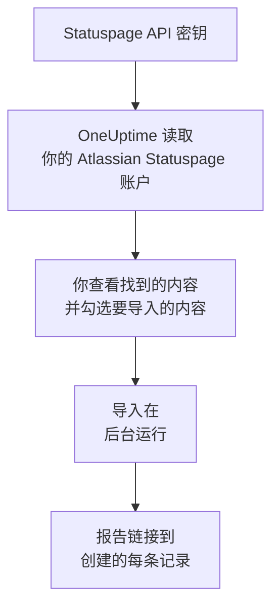

# 从 Atlassian Statuspage 迁移

**从其他工具导入** 只需几分钟就能把你的 Atlassian Statuspage 页面迁移到 OneUptime。使用一个 Statuspage API 密钥，OneUptime 会读取你的页面、它们的组件和分组以及电子邮件订阅者，展示找到的内容，并创建你勾选的内容。Statuspage 中的任何内容都不会改变。

:::cards
- [导入你的账户](#导入你的-atlassian-statuspage-账户): 创建密钥，读取你的账户，并勾选要导入的内容。
- [会导入什么](#会导入什么): 每个 Statuspage 页面、组件和订阅者在 OneUptime 中会变成什么。
- [完成迁移](#完成迁移): 导入完成后要做的事。
:::

## 工作原理

- **密钥只使用一次。** OneUptime 读取你的账户期间，密钥会加密保存；读取一结束，无论成功与否，密钥都会立即删除。它不会再次显示，也不会写入任何日志。
- **OneUptime 只读取。** 它只调用 Atlassian Statuspage 自己的 API：`api.statuspage.io`。它每秒发送一个请求，这是 Statuspage 允许单个密钥的上限。当 Atlassian Statuspage 要求放慢速度时，它会等待后重试。
- **在你开始导入之前，不会创建任何内容。** 预览会为每一项显示：它是新的、已在 OneUptime 中（并按原样使用）、已由之前的导入带入，或者无法导入的原因。
- **再次运行绝不会重复创建。** OneUptime 会按 Atlassian Statuspage ID 记住每次导入带入的内容。在 Atlassian Statuspage 中添加页面或组件后再次运行，只会创建新的内容。

## 开始之前

- **一个 OneUptime 项目，以及创建所导入内容的权限。** 项目所有者和项目管理员可以导入所有内容。其他角色也可以运行导入，并导入他们有权创建的记录类型。其余内容会显示为不导入，并附上原因。
- **一个 Statuspage API 密钥。** 只有账户所有者才能创建。导入绝不会写入 Statuspage，并会读取密钥能看到的每个页面。
- **为你的页面留出空间（OneUptime Cloud）。** 你的套餐对状态页和订阅者的数量有上限。放不下的内容会显示为不导入。组件会变成免费的手动监视器。

## 导入你的 Atlassian Statuspage 账户

:::steps
### 在 Statuspage 中创建 API 密钥
在 Statuspage 中选择左下角的头像，然后选择 **API info**。选择 **Create key**，将它命名为 `OneUptime import`，然后复制。

### 打开导入页面
在 OneUptime 中，进入 **项目设置** > **从其他工具导入**，然后选择 **Atlassian Statuspage**。

### 连接 Atlassian Statuspage
将密钥粘贴到 **Atlassian Statuspage API 密钥** 中，然后选择 **读取我的 Atlassian Statuspage 账户**。大型账户需要几分钟，读取期间你可以离开页面。

### 勾选要导入的内容
预览按类型分节列出找到的内容。所有将被创建的内容一开始都已勾选，但订阅者除外。每一项下面，OneUptime 会说明哪些内容不会原样导入。当勾选的状态页显示了你未勾选的监视器时，它会提示，**一并勾选** 可以把它们勾选上。要导入订阅者，请勾选他们，然后在下方确认他们同意接收你的更新，并且你可以迁移他们。不会给任何人发送邮件。

### 开始导入
选择 **开始导入**。导入在后台运行：你可以离开页面，报告会在那里等你。
:::

报告会统计已创建和未导入的数量，并列出每一项及其对应记录的链接，失败的排在最前面。以前的导入列在同一页面的 **以前的导入** 下。

## 会导入什么

| 在 Atlassian Statuspage 中 | 在 OneUptime 中 | 方式 |
| --- | --- | --- |
| Components | 手动监视器 | 每个组件都会变成状态页显示的手动监视器。没有任何东西检查它：你像在 Statuspage 中一样，在 OneUptime 中设置它的状态。组件分组会变成页面上的分组。 |
| Pages | 状态页 | 每个页面会连同名称和描述、分组中的组件，以及它突出显示的组件的可用率和历史一起导入。只有部分人可以查看的页面会以私有方式导入。 |
| Email subscribers | 状态页订阅者 | 在你确认可以迁移后，已确认的电子邮件订阅者会被导入，并订阅相同的组件。不会给任何人发送邮件，他们从 OneUptime 收到的每条更新都带有退订链接。 |

组件以正常运行状态导入。预览会列出当前在 Statuspage 中未显示为正常运行的每个组件，方便你在导入后设置它的状态。

## 不会导入什么

- **事件、计划维护及其历史。** OneUptime 中的事件是会呼叫人员的实时记录，因此过去的事件留在 Statuspage 中。
- **通过短信、Webhook、Slack 或 Microsoft Teams 订阅的订阅者。** 预览会统计数量。只会导入电子邮件订阅者。
- **事件模板和系统指标。** 请在 OneUptime 中添加你仍然需要的内容。
- **状态页自己的域名和品牌。** 在 OneUptime 中，在 **自定义域名** 下添加域名，在 **品牌** 下添加徽标。

## 限制

一次导入最多创建 2,000 条记录：最多 1,000 个监视器和 50 个状态页。订阅者不计入其中：一次导入最多带入 5,000 个订阅者。超出限制的内容会显示为不导入。再次运行导入即可带入其余部分。

在 OneUptime Cloud 上，套餐没有空间容纳的状态页和订阅者会显示为不导入，并注明所需条件。

预览保留一天。只有读取账户的人才能勾选内容并开始导入。项目所有者和项目管理员可以看到每次导入的进度和报告。

## 完成迁移

:::steps
### 检查你的状态页
在 **状态页面** 下打开每个页面，并与 Statuspage 中的页面对比。每个组件都是一个手动监视器：情况变化时，请在 OneUptime 中更改其状态。

### 将状态页的地址指向 OneUptime
在 **状态页面** 下打开页面，在 **自定义域名** 中添加你的域名，然后修改它的 DNS 记录。这样访客和订阅者就会访问新页面。

### 在 Atlassian Statuspage 中关闭你的页面
当你的域名指向 OneUptime 后，请在 Statuspage 中关闭该页面，以免其订阅者收到重复通知。
:::

## 故障排除

:::details Atlassian Statuspage 不接受 API 密钥
请检查你是否复制了完整的密钥，以及它是否由账户所有者在 **API info** 中创建。一个密钥属于一个 Statuspage 组织，只能读取该组织的页面。然后选择 **重试**。
:::

:::details 无法导入订阅者
请勾选订阅者下方的复选框，确认他们同意接收你的更新，并且你可以迁移他们：**开始导入** 会等待这一确认。从未在 Statuspage 中确认订阅的订阅者会留在那里。
:::

:::details 有些项目无法勾选
每一项都会说明原因：项目中已有的名称、之前的导入已带入的内容，或者你无权创建、或你的套餐不包含的记录。
:::

## 后续步骤

:::cards
- [状态页概览](/docs/status-pages/index): 状态页显示什么，以及谁可以查看。
- [订阅者与公告](/docs/status-pages/subscribers): 订阅者如何得知事件。
- [手动监控](/docs/monitor/manual-monitor): 由你自己设置状态的监视器。
:::
