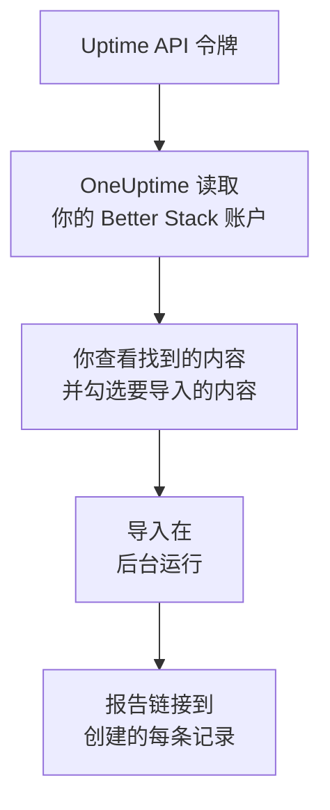

# 从 Better Stack 迁移

**从其他工具导入** 只需几分钟就能把你的 Better Stack Uptime 监视器、心跳和状态页迁移到 OneUptime。使用一个 Better Stack Uptime API 令牌，OneUptime 会读取你的监视器、心跳、状态页及其电子邮件订阅者，展示找到的内容，并创建你勾选的内容。Better Stack 中的任何内容都不会改变。

:::cards
- [导入你的账户](#导入你的-better-stack-账户): 创建令牌，读取你的账户，并勾选要导入的内容。
- [会导入什么](#会导入什么): 每个 Better Stack 监视器、心跳和状态页在 OneUptime 中会变成什么。
- [完成迁移](#完成迁移): 导入完成后要做的事。
:::

## 工作原理

- **密钥只使用一次。** OneUptime 读取你的账户期间，密钥会加密保存；读取一结束，无论成功与否，密钥都会立即删除。它不会再次显示，也不会写入任何日志。
- **OneUptime 只读取。** 它只调用 Better Stack 自己的 API：`incidents.betterstack.com`。当 Better Stack 要求放慢速度时，它会等待后重试。
- **在你开始导入之前，不会创建任何内容。** 预览会为每一项显示：它是新的、已在 OneUptime 中（并按原样使用）、已由之前的导入带入，或者无法导入的原因。
- **再次运行绝不会重复创建。** OneUptime 会按 Better Stack ID 记住每次导入带入的内容。在 Better Stack 中添加监视器或心跳后再次运行，只会创建新的内容。

## 开始之前

- **一个 OneUptime 项目，以及创建所导入内容的权限。** 项目所有者和项目管理员可以导入所有内容。其他角色也可以运行导入，并导入他们有权创建的记录类型。其余内容会显示为不导入，并附上原因。
- **一个 Better Stack Uptime API 令牌。** 请使用团队级 Uptime 令牌：它会读取该团队的监视器、心跳和状态页。导入绝不会写入 Better Stack。
- **付款方式（OneUptime Cloud）。** 执行检查的监视器即使在 Free 套餐中也会按用量计费，因此请在导入前于 **项目设置** > **账单** 中添加付款方式。没有付款方式时，这些监视器会显示为不导入。

## 导入你的 Better Stack 账户

:::steps
### 在 Better Stack 中创建 API 令牌
在 Better Stack 中，依次进入 **API tokens** > **Team-based tokens**，然后选择你的团队。在 **Uptime API tokens** 下创建一个名为 `OneUptime import` 的令牌并复制。

### 打开导入页面
在 OneUptime 中，进入 **项目设置** > **从其他工具导入**，然后选择 **Better Stack**。

### 连接 Better Stack
将令牌粘贴到 **Better Stack API 密钥** 中，然后选择 **读取我的 Better Stack 账户**。大型账户需要几分钟，读取期间你可以离开页面。

### 勾选要导入的内容
预览按类型分节列出找到的内容。所有将被创建的内容一开始都已勾选，但已暂停的监视器（勾选后会以暂停状态导入）和订阅者除外。每一项下面，OneUptime 会说明哪些内容不会原样导入。当勾选的状态页显示了你未勾选的监视器时，它会提示，**一并勾选** 可以把它们勾选上。要导入订阅者，请勾选他们，然后在下方确认他们同意接收你的更新，并且你可以迁移他们。不会给任何人发送邮件。

### 开始导入
选择 **开始导入**。导入在后台运行：你可以离开页面，报告会在那里等你。
:::

报告会统计已创建和未导入的数量，并列出每一项及其对应记录的链接，失败的排在最前面。以前的导入列在同一页面的 **以前的导入** 下。

## 会导入什么

| 在 Better Stack 中 | 在 OneUptime 中 | 方式 |
| --- | --- | --- |
| Monitors and heartbeats | 监视器 | 每个监视器都会变成同类型的监视器，地址、间隔和超时都相同。每个心跳都会变成入站请求监视器。 |
| Status pages | 状态页 | 每个页面会以其分区作为分组，连同它显示的监视器和心跳一起导入。你手动跟踪的项目会变成手动监视器。设有密码或 IP 白名单的页面会以私有方式导入。 |
| Email subscribers | 状态页订阅者 | 在你确认可以迁移后，已确认的电子邮件订阅者会被导入，并订阅相同的资源。不会给任何人发送邮件，他们从 OneUptime 收到的每条更新都带有退订链接。 |

- **status、expected status code、keyword 和 keyword absence 监视器** 会变成网站监视器；如果它们发送其他方法、标头或 JSON 正文，则变成 API 监视器。status 监视器在任何 2xx 应答时为正常，expected status code 监视器在它列出的状态码时为正常。
- **Ping 和 TCP 监视器** 会变成 Ping 和端口监视器。**SMTP、POP 和 IMAP 监视器** 会变成对应端口的端口监视器：OneUptime 只检查端口是否响应，不检查邮件通信。
- **DNS 监视器** 会变成针对其查询名称的 DNS 监视器，并询问同一台服务器。
- **心跳** 会变成入站请求监视器，在周期加宽限时间内没有收到请求时判定为故障。每个监视器在 OneUptime 中都有新地址。
- **SSL 到期警告。** 在证书到期前发出警告的监视器，还会获得一个以它命名、提前同样天数警告的 SSL 证书监视器。

每个监视器都由项目的探测器检查，和你自己创建的监视器一样。OneUptime 不提供的检查间隔会改为最接近的可用间隔，超过一分钟的超时会改为一分钟。任一项发生变化时，预览都会说明。

## 不会导入什么

- **可用性历史、响应时间和事件。** OneUptime 从导入完成时开始检查。
- **告警联系人和集成。** 请按 [完成迁移](#完成迁移) 中的说明，在 OneUptime 中选择通知谁。
- **密码，以及可能包含机密信息的标头。** 需要登录的监视器，或发送 `Authorization`、Cookie 或令牌标头的监视器，会去掉这些内容后导入：请用 [监视器密钥](/docs/monitor/monitor-secrets) 添加。
- **UDP 和 Playwright 监视器。** OneUptime 没有能做同样事情的监视器，预览会逐一列出。
- **从未确认订阅的订阅者。** 他们会留在 Better Stack 中。
- **状态页上除监视器、心跳和手动跟踪项目以外的内容。** 预览会逐一列出。
- **状态页自己的域名和品牌。** 在 OneUptime 中，在 **自定义域名** 下添加域名，在 **品牌** 下添加徽标。

## 限制

一次导入最多创建 2,000 条记录：最多 1,000 个监视器和 50 个状态页。订阅者不计入其中：一次导入最多带入 5,000 个订阅者。超出限制的内容会显示为不导入。再次运行导入即可带入其余部分。

在 OneUptime Cloud 上，执行检查的监视器需要付款方式，套餐没有空间容纳的内容会显示为不导入，并注明所需条件。

预览保留一天。只有读取账户的人才能勾选内容并开始导入。项目所有者和项目管理员可以看到每次导入的进度和报告。

## 完成迁移

:::steps
### 检查你的监视器
在 **监视器** 下打开每个监视器，检查它的首批结果。心跳监视器有一个新地址：请让调用它的任务改为指向该地址。

### 选择通知谁
为监视器添加所有者，或为它们创建的事件设置 **值班** > **值班策略** 中的值班策略，这样出现故障时会通知到合适的人。

### 将状态页的地址指向 OneUptime
在 **状态页面** 下打开页面，在 **自定义域名** 中添加你的域名，然后修改它的 DNS 记录。这样访客和订阅者就会访问新页面。

### 在 Better Stack 中关闭检查
当 OneUptime 检查相同的内容后，请在 Better Stack 中暂停这些检查，以免有人收到重复通知。
:::

## 故障排除

:::details Better Stack 不接受 API 密钥
请检查你是否复制了完整的令牌，以及它是否是 **Uptime API tokens** 中团队的令牌，而不是 Telemetry 令牌。然后选择 **重试**。
:::

:::details 某个监视器显示为不导入
它会说明原因：OneUptime 没有的监视器类型、OneUptime 无法读取的地址，或者项目没有空间或没有付款方式来容纳它。如果 OneUptime 已经运行着名称、类型和地址都相同的监视器，会直接使用该监视器。
:::

:::details 有些项目无法勾选
每一项都会说明原因：项目中已有的名称、之前的导入已带入的内容，或者你无权创建、或你的套餐不包含的记录。
:::

## 后续步骤

:::cards
- [入站请求监控](/docs/monitor/incoming-request-monitor): 心跳在 OneUptime 中如何工作。
- [状态页概览](/docs/status-pages/index): 状态页显示什么，以及谁可以查看。
- [从 UptimeRobot 迁移](/docs/moving-to-oneuptime/uptimerobot): 从 UptimeRobot 迁移你的检查。
:::
