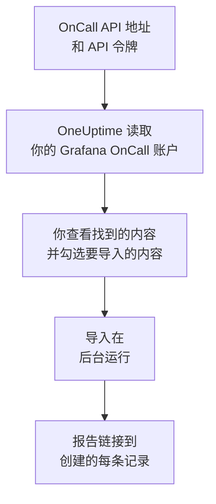

# 从 Grafana OnCall 迁移

Grafana Labs 已于 2026 年 3 月将开源版 Grafana OnCall 归档，在 Grafana Cloud 上它作为 Grafana Cloud IRM 的一部分继续提供。无论你的 OnCall 运行在哪里，**从其他工具导入** 都只需几分钟就能把你的值班配置迁移到 OneUptime。使用 OnCall API 地址和一个 API 令牌，OneUptime 会读取你的用户、团队、计划和升级链，展示找到的内容，并创建你勾选的内容。Grafana OnCall 中的任何内容都不会改变。

:::cards
- [导入你的账户](#导入你的-grafana-oncall-账户): 创建令牌，读取你的账户，并勾选要导入的内容。
- [会导入什么](#会导入什么): 每条 Grafana OnCall 记录在 OneUptime 中会变成什么。
- [完成迁移](#完成迁移): 导入完成后要做的事。
:::

## 工作原理

- **令牌只使用一次。** OneUptime 读取你的账户期间，令牌会与 API 地址一起加密保存；读取一结束，无论成功与否，令牌都会立即删除。它不会再次显示，也不会写入任何日志。
- **OneUptime 只读取，而且只从你提供的地址读取。** 它只调用你粘贴的 OnCall API 地址，每秒最多一次，这在 Grafana OnCall 每个令牌五分钟 300 个请求的限制之内。当 Grafana OnCall 要求放慢速度时，它会等待后重试。
- **每次请求前都会检查地址。** OneUptime 绝不会调用它所运行的机器或云元数据服务，也绝不会跟随重定向。在 OneUptime Cloud 上，地址还必须是公网地址，并以 `https://` 开头。自托管的 OneUptime 也可以读取你自己网络中的 Grafana OnCall，除非其管理员关闭了这项功能，见 [Private Network Access](/docs/self-hosted/private-network-access)。
- **在你开始导入之前，不会创建任何内容。** 预览会为每一项显示：它是新的、已在 OneUptime 中（并按原样使用）、已由之前的导入带入，或者无法导入的原因。
- **再次运行绝不会重复创建。** OneUptime 会按 Grafana OnCall ID 记住每次导入带入的内容。在 Grafana OnCall 中添加人员或计划后再次运行，只会创建新的内容。

## 开始之前

- **一个 OneUptime 项目，以及创建所导入内容的权限。** 项目所有者和项目管理员可以导入所有内容。其他角色也可以运行导入，并导入他们有权创建的记录类型。其余内容会显示为不导入，并附上原因。
- **一个 Grafana OnCall API 令牌。** 请使用 OnCall API 令牌，而不是 Grafana 服务账户的令牌。导入绝不会写入 Grafana OnCall。导入完成后请删除该令牌。
- **你的 OnCall API 地址。** OnCall 的设置会在 API 令牌旁边显示它。在 Grafana Cloud 上，它类似于 `https://oncall-prod-us-central-0.grafana.net/oncall`。在你自己的安装中，它是你的 OnCall 引擎的地址。

## 导入你的 Grafana OnCall 账户

:::steps
### 在 Grafana OnCall 中创建 API 令牌
在 Grafana 中依次打开 **OnCall** > **Settings**。在 Grafana Cloud 上，依次打开 **IRM** > **Settings** > **Admin & API**。复制那里显示的 OnCall API 地址。在 **API tokens** 下创建一个名为 `OneUptime import` 的令牌并复制它。

### 打开导入页面
在 OneUptime 中依次打开 **项目设置** > **从其他工具导入**，然后选择 **Grafana OnCall**。

### 连接 Grafana OnCall
将地址粘贴到 **Grafana OnCall API 地址** 中，将令牌粘贴到 **Grafana OnCall API 密钥** 中，然后选择 **读取我的 Grafana OnCall 账户**。较大的账户需要几分钟，读取期间你可以离开页面。

### 勾选要导入的内容
预览按类型分节列出找到的内容。所有将被创建的内容一开始都已勾选，但不在任何团队、计划或升级链中的人员除外。每一项下面，OneUptime 会说明哪些内容不会原样导入。当勾选的项目用到了你未勾选的内容时，它会提示，**一并勾选** 可以把它们勾选上。

### 开始导入
如果要邀请人员，请在 **将新成员邀请到** 中选择他们加入的团队。然后选择 **开始导入**。导入在后台运行：你可以离开页面，报告会在那里等你。
:::

报告会统计已创建、已邀请和未导入的数量，并列出每一项及其对应记录的链接，失败的排在最前面。以前的导入列在同一页面的 **以前的导入** 下。

## 会导入什么

| Grafana OnCall 中 | OneUptime 中 | 方式 |
| --- | --- | --- |
| 用户 | 项目成员 | 按电子邮件地址匹配。尚未加入项目的人会被邀请加入你选择的团队。 |
| 团队 | 团队 | 连同成员一起创建。项目中已有同名团队时按原样使用，其成员保持不变。 |
| 计划 | 值班计划 | 每个轮换都会成为一个层，人员、开始时间、交接和值班时段保持不变，使用计划的时区，并归计划所属团队所有。较高层上的轮换仍然优先于下面的层。 |
| 升级链 | 值班策略 | 通知人员、团队或计划当前值班人的步骤会成为升级规则，等待步骤会成为下一条规则之前的等待时间。重复整条链的步骤成为策略的重复次数。 |

同一层上同时值班的轮换，以及让多人同时值班的轮换，会各自成为一个 OneUptime 计划，因为 OneUptime 的计划同一时间只有一人值班。原先呼叫该计划的每个值班策略都会呼叫所有这些计划。

## 不会导入什么

- **告警组及其历史。** OneUptime 从你的配置开始，而不是从过去的告警开始。
- **集成、路由和外发 webhook。** 请改为将你的监视器和告警来源指向 OneUptime，见 [完成迁移](#完成迁移)。
- **覆盖、一次性班次，以及已经结束的轮换。** 导入后，在 OneUptime 中添加你仍然需要的覆盖。
- **来自日历链接的班次。** 班次来自 iCal 链接的计划导入时不含层，请在 OneUptime 中添加。
- **每个人的通知规则。** 每个人在接受邀请后，在自己的 **用户设置** 中选择被呼叫的方式。
- **OneUptime 中没有完全对应项的步骤。** 通知 Slack 用户组或频道、调用 webhook、宣布事件或解决告警的步骤不会导入。逐个通知人员的步骤会同时呼叫所有人，只在特定时段或告警数量下才继续的步骤总是会继续，预览会说明有哪些变化。

## 限制

一次导入最多创建 2,000 条记录：最多 500 人、200 个团队、200 个值班计划和 200 个值班策略。超出限制的内容会显示为不导入。再次运行导入即可带入其余部分。

在 OneUptime Cloud 上，你的套餐不包含的记录会显示为不导入，并注明所需的套餐。

预览保留一天。只有读取账户的人才能勾选内容并开始导入。项目所有者和项目管理员可以看到每次导入的进度和报告。

## 完成迁移

:::steps
### 检查值班计划
在 **值班** > **值班计划** 中打开每个计划，检查现在谁在值班、接下来是谁。

### 确保每个人都能被呼叫
被邀请的人接受邀请后，添加用于接收呼叫的电话号码、电子邮件地址或移动应用。**值班** > **就绪情况** 会显示哪些人还无法联系到。

### 将告警发送到 OneUptime
将你的监视器和发出告警的工具指向 OneUptime，并呼叫自己一次进行测试。

### 在 Grafana OnCall 中关闭呼叫
当 OneUptime 能呼叫到正确的人后，请在 Grafana OnCall 中关闭通知，以免有人被重复呼叫。
:::

## 故障排除

:::details Grafana OnCall 不接受 API 密钥
请检查你是否复制了完整的令牌、它是否是 OnCall API 令牌而不是 Grafana 服务账户的令牌，以及 API 地址是否是它旁边显示的那个。然后选择 **重试**。
:::

:::details OneUptime 没有调用该 API 地址
请按 OnCall 设置中显示的样子原样粘贴 OnCall API 地址。在 OneUptime Cloud 上，它必须以 `https://` 开头，并且可以从互联网访问。自托管的 OneUptime 也可以访问你自己网络中的地址，除非其管理员关闭了这项功能，但绝不会访问 OneUptime 所在机器上的地址。
:::

:::details 预览中缺少某类记录
令牌无法读取该类记录，预览顶部会说明这一点。令牌读取的是创建它的人能看到的内容，因此请以 Grafana OnCall 管理员身份创建令牌，然后重新读取账户。
:::

:::details 有些项目无法勾选
每一项都会说明原因：项目中已有的名称、之前的导入已带入的内容，或者你无权创建、或你的套餐不包含的记录。
:::

## 后续步骤

:::cards
- [值班计划](/docs/on-call/schedules): 层、限制和交接。
- [升级规则](/docs/on-call/escalation-rules): 值班策略如何呼叫人员。
- [从 PagerDuty 迁移](/docs/moving-to-oneuptime/pagerduty): 从 PagerDuty 迁移团队。
:::
