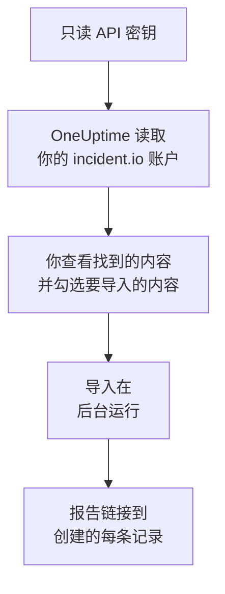

# 从 incident.io 迁移

**从其他工具导入** 只需几分钟就能把你的 incident.io 配置迁移到 OneUptime。使用一个只读的 incident.io API 密钥，OneUptime 会读取你的用户、团队、计划、升级路径、服务和事件设置，展示找到的内容，并创建你勾选的内容。incident.io 中的任何内容都不会改变。

:::cards
- [导入你的账户](#导入你的-incidentio-账户): 创建密钥，读取你的账户，并勾选要导入的内容。
- [会导入什么](#会导入什么): 每条 incident.io 记录在 OneUptime 中会变成什么。
- [完成迁移](#完成迁移): 导入完成后要做的事。
:::

## 工作原理

- **密钥只使用一次。** OneUptime 读取你的账户期间，密钥会加密保存；读取一结束，无论成功与否，密钥都会立即删除。它不会再次显示，也不会写入任何日志。
- **OneUptime 只读取。** 它只调用 incident.io 自己的 API：`api.incident.io`。当 incident.io 要求放慢速度时，它会等待后重试。
- **在你开始导入之前，不会创建任何内容。** 预览会为每一项显示：它是新的、已在 OneUptime 中（并按原样使用）、已由之前的导入带入，或者无法导入的原因。
- **再次运行绝不会重复创建。** OneUptime 会按 incident.io ID 记住每次导入带入的内容。在 incident.io 中添加人员或计划后再次运行，只会创建新的内容。

## 开始之前

- **一个 OneUptime 项目，以及创建所导入内容的权限。** 项目所有者和项目管理员可以导入所有内容。其他角色也可以运行导入，并导入他们有权创建的记录类型。其余内容会显示为不导入，并附上原因。
- **一个只能查看数据的 incident.io API 密钥。** 导入绝不会写入 incident.io，因此密钥不需要任何创建、编辑或管理权限。

## 导入你的 incident.io 账户

:::steps
### 在 incident.io 中创建 API 密钥
在 incident.io 中依次打开 **Settings** > **API keys**，然后选择 **Add new**。将它命名为 `OneUptime import`，只授予查看数据的权限，不授予创建、编辑或管理权限，然后复制密钥。

### 打开导入页面
在 OneUptime 中依次打开 **项目设置** > **从其他工具导入**，然后选择 **incident.io**。

### 连接 incident.io
将密钥粘贴到 **incident.io API 密钥** 中，然后选择 **读取我的 incident.io 账户**。较大的账户需要几分钟，读取期间你可以离开页面。

### 勾选要导入的内容
预览按类型分节列出找到的内容。所有将被创建的内容一开始都已勾选，但不在任何团队、计划或升级路径中的人员除外。每一项下面，OneUptime 会说明哪些内容不会原样导入。当勾选的项目用到了你未勾选的内容时，它会提示，**一并勾选** 可以把它们勾选上。

### 开始导入
如果要邀请人员，请在 **将新成员邀请到** 中选择他们加入的团队。然后选择 **开始导入**。导入在后台运行：你可以离开页面，报告会在那里等你。
:::

报告会统计已创建、已邀请和未导入的数量，并列出每一项及其对应记录的链接，失败的排在最前面。以前的导入列在同一页面的 **以前的导入** 下。

## 会导入什么

| incident.io 中 | OneUptime 中 | 方式 |
| --- | --- | --- |
| 用户 | 项目成员 | 按电子邮件地址匹配。尚未加入项目的人会被邀请加入你选择的团队。已停用的用户不会导入。 |
| 团队 | 团队 | 连同成员一起创建。项目中已有同名团队时按原样使用，其成员保持不变。 |
| 计划 | 值班计划 | 每个轮换都会成为一个层，人员、开始时间、轮次长度和工作时间保持不变，使用计划的时区。导入的是当前生效的轮换版本。 |
| 升级路径 | 值班策略 | 每个级别都会成为一条升级规则，在相同的等待时间后呼叫相同的计划、用户和团队。重复成为策略的重复次数，分支则导入第一条路径。 |
| 目录服务 | 服务 | 你的目录中属于服务类别的目录类型的条目，在服务目录中创建。已归档的条目会被省略。 |
| 严重性 | 事件严重性 | 按 incident.io 中的顺序创建，最严重的在前。项目中已有同名严重性时按原样使用。 |
| 状态 | 事件状态 | 分诊状态对应 OneUptime 中事件开始时的状态，已关闭状态对应事件解决时的状态。进行中和已暂停的状态会创建在“已确认”和“已解决”之间。 |
| 事件角色 | 事件角色 | 主导角色对应 OneUptime 的事件指挥官，其他角色会被创建。OneUptime 会记录每个事件的宣布人，因此不需要报告人角色。 |
| 自定义字段 | 事件自定义字段 | 单选字段变为下拉列表，多选字段变为多选下拉列表，文本和链接字段变为文本，数字字段变为数字，并带上它们的选项。 |

如果某个轮换中同时有多人值班，它会按每个值班人员拆分成一个 OneUptime 计划，因为 OneUptime 的计划同一时间只有一人值班。原先呼叫该计划的每个值班策略都会呼叫所有这些计划。

## 不会导入什么

- **事件、告警及其历史。** OneUptime 从你的配置开始，而不是从过去的事件开始。
- **工作流、状态页、告警路由和集成。** 请改为将你的监视器和告警来源指向 OneUptime，见 [完成迁移](#完成迁移)。
- **选项来自目录的自定义字段，** 以及 OneUptime 中没有对应状态的状态：declined、merged、canceled 和 learning。
- **计划的覆盖，以及计划在以后进行的轮换更改。** 预览会逐一列出计划中的更改，到时你可以在 OneUptime 中进行更改。
- **OneUptime 中没有完全对应项的升级步骤。** 在 Slack 或 Microsoft Teams 频道中发帖的步骤会被省略，因为在 OneUptime 中由工作区通知规则完成这项工作；转交给另一条升级路径的步骤同样会被省略。呼叫下一位值班人员的步骤会以 OneUptime 中最接近的方式导入，预览会说明有哪些变化。

## 限制

一次导入最多创建 2,000 条记录：最多 500 人、200 个团队、200 个值班计划、200 个值班策略、500 个服务、100 个事件自定义字段，以及事件严重性、事件状态和事件角色各 25 个。超出限制的内容会显示为不导入。再次运行导入即可带入其余部分。

在 OneUptime Cloud 上，你的套餐不包含的记录会显示为不导入，并注明所需的套餐。

预览保留一天。只有读取账户的人才能勾选内容并开始导入。项目所有者和项目管理员可以看到每次导入的进度和报告。

## 完成迁移

:::steps
### 检查值班计划
在 **值班** > **值班计划** 中打开每个计划，检查现在谁在值班、接下来是谁。

### 确保每个人都能被呼叫
被邀请的人接受邀请后，添加用于接收呼叫的电话号码、电子邮件地址或移动应用。**值班** > **就绪情况** 会显示哪些人还无法联系到。

### 将告警发送到 OneUptime
将你的监视器和发出告警的工具指向 OneUptime，并呼叫自己一次进行测试。

### 在 incident.io 中关闭呼叫
当 OneUptime 能呼叫到正确的人后，请在 incident.io 中关闭通知，以免有人被重复呼叫。
:::

## 故障排除

:::details incident.io 不接受 API 密钥
请检查你是否复制了完整的密钥，以及它是否已在 **Settings** > **API keys** 中被删除。然后选择 **重试**。
:::

:::details 预览中缺少某类记录
密钥无法读取该类记录，预览顶部会说明这一点。请为密钥授予查看该类数据的权限，然后重新读取账户。
:::

:::details 有些项目无法勾选
每一项都会说明原因：已停用的用户、项目中已有的名称、之前的导入已带入的内容，或者你无权创建、或你的套餐不包含的记录。
:::

## 后续步骤

:::cards
- [值班计划](/docs/on-call/schedules): 层、限制和交接。
- [事件状态和严重性](/docs/incidents/states-and-severities): 事件经历的状态和严重性。
- [从 Opsgenie 迁移](/docs/moving-to-oneuptime/opsgenie): 从 Opsgenie 迁移团队。
:::
